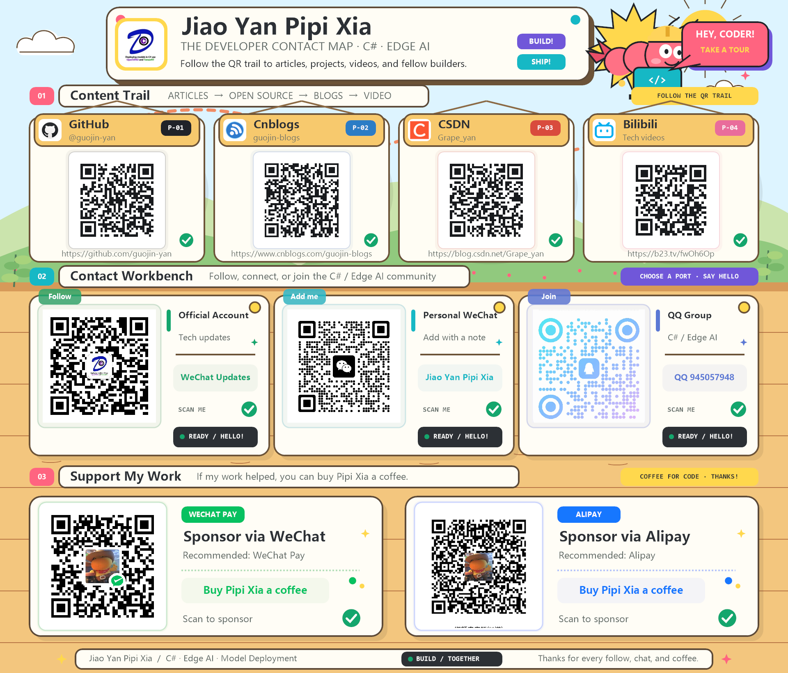

<picture>
  <source media="(prefers-color-scheme: dark)" srcset="docs/images/readme/hero-dark.svg">
  <source media="(prefers-color-scheme: light)" srcset="docs/images/readme/hero-light.svg">
  
</picture>

<h1 align="center">TensorRT CSharp API v4.0</h1>

  TensorRT and CUDA bindings for C# and .NET, with managed APIs, project-owned bridge packages, runnable vision samples, and a TensorRtExec desktop workflow.

  
  
  
  
  

  
  

<strong>English</strong> | <a href="README.zh-CN.md">简体中文</a>

# TensorRT CSharp API v4.0

TensorRT CSharp API v4.0 provides a .NET API for TensorRT inference, CUDA runtime compilation, memory, streams, callbacks, and the TensorRtExec desktop workflow. The stable `4.0.0` release is public; development now focuses on package-consuming examples, applications, and complete technical articles.

## 📖 Introduction

The managed API keeps the public namespace roots stable:

- <code>JYPPX.TensorRtSharp</code> is the main TensorRT surface and the default home for shared types.
- <code>JYPPX.CudaSharp</code> is the CUDA surface.
- Native bridge loading is explicit through <code>jyppxtrtbridge</code> and the versioned bridge package.

CUDA, cuDNN, TensorRT, and NVRTC are user-installed prerequisites. NVIDIA runtime redistribution is retired: this repository publishes managed source/packages and project-owned bridge-only packages, never CUDA/cuDNN/TensorRT vendor archives.

## ✨ Release Highlights

- C# bindings and source are grouped by module under <code>src</code>.
- TensorRT engine building, execution contexts, bindings, dynamic-shape profiles, allocators, logging, profiling, progress monitoring, streams, events, CUDA graphs, and CUDA RTC are covered by the managed API.
- Runtime package roles are explicit: the `.Bridge` packages with `split_package_roles=bridge` contain only the project bridge for a fixed CUDA/TensorRT line.
- NuGet branding is fixed: <code>nuget/logo.jpg</code> is the package logo and the English root README is embedded as the package README.
- The release license is Apache-2.0.

## 📢 Latest Update: 4.0.0

- Finalizes the stable `JYPPX.TensorRtSharp` and `JYPPX.CudaSharp` namespace roots and the 4.0 managed API surface.
- Publishes one managed package plus 6 Windows and 12 Linux project-owned Bridge packages; consumers install the matching NVIDIA runtime themselves.
- Keeps CUDA, cuDNN, TensorRT, NVRTC, sample applications, and model binaries outside all NuGet packages.

Read the [detailed 4.0.0 notes](docs/releases/4.0.0.md) or browse the [complete version index](docs/releases/README.md).

## 🚀 Get Started In 30 Seconds

Create a console project, reference the managed package, and install the bridge package that matches the CUDA/TensorRT installation on the target machine:

~~~powershell
dotnet new console -n TrtQuickstart
cd TrtQuickstart
dotnet add package JYPPX.TensorRT.CSharp.API --version 4.0.0
dotnet add package JYPPX.TensorRT.CSharp.API.Runtime.win-x64.trt10.11.cuda12.9.cudnn9.22.Bridge --version 4.0.0
~~~

The exact `4.0.0` version keeps restores reproducible without selecting API-incompatible historical 4.x packages such as `4.0.6170`. Replace the Bridge package ID with the RID and NVIDIA-runtime matrix installed on the target machine.

Then create a runtime, load an engine, bind input/output tensors, execute, and read the result. The bridge package is not a replacement for the user-installed NVIDIA runtime. See the [inference bindings tutorial](docs/articles/zh-cn/inference-bindings-tutorial.md) and [Windows installation guide](docs/articles/zh-cn/windows-installation-and-troubleshooting-guide.md).

## 📦 Package Layout

| Package | Contents |
| --- | --- |
| <code>JYPPX.TensorRT.CSharp.API</code> | Managed TensorRT and CUDA-facing C# API |
| <code>JYPPX.TensorRT.CSharp.API.Runtime.*.Bridge</code> | Project-owned native bridge only; select one by RID/TensorRT/CUDA/cuDNN |

`Classification` at `samples/ComputerVision/01.Classification` and `YoloVision` at `applications/YoloVision` are runnable examples. They consume the public 4-series managed package and are deliberately excluded from all public package feeds and Release assets.

## 🧪 Example Series

| Series | Project | Focus |
| --- | --- | --- |
| CUDA | `Cuda/01.RuntimeCompilation` | CUDA RTC compilation, module loading, launch, and readback |
| Inference | `Inference/01.Bindings`, `Inference/02.DynamicShapes` | Bindings, memory ownership, and dynamic profiles |
| Performance | `Performance/01.MultiStream` | CUDA streams, events, and ordering |
| Computer vision | `Classification` | Image preprocessing, Top-K output, JSON, and annotated results |
| Applications | `YoloVision`, `OnnxToEngine`, `TensorRtExec` | Complete multi-step workflows and advanced usage |

See the [sample series](samples/README.md) and [applications](applications/README.md) for runnable commands and matching articles.

CUDA RTC roadmap: [English](docs/articles/en/cuda-runtime-compilation-roadmap.md) | [简体中文](docs/articles/zh-cn/cuda-runtime-compilation-roadmap.md) | [technical article](docs/articles/zh-cn/cuda-runtime-compilation-technical-article.md)

## 🌐 Public Packages And Release Assets

The stable `4.0.0` release is available through GitHub Releases, NuGet.org, and GitHub Packages. Package README content is the English root README, package branding uses <code>nuget/logo.jpg</code>, and the core managed package uses the Apache-2.0 SPDX license expression.

| Package | Version | NuGet.org | GitHub Packages | Purpose |
| --- | --- | --- | --- | --- |
| <code>JYPPX.TensorRT.CSharp.API</code> |  | [Gallery](https://www.nuget.org/packages/JYPPX.TensorRT.CSharp.API/) | [Package feed](https://github.com/users/guojin-yan/packages/nuget/package/jyppx.tensorrt.csharp.api) | Core managed TensorRT/CUDA API |

| Release channel | Link | Assets |
| --- | --- | --- |
| GitHub Release | [v4.0.0](https://github.com/guojin-yan/TensorRT-CSharp-API/releases/tag/v4.0.0) | Source archive, core managed <code>.nupkg</code>, and project-owned Bridge <code>.nupkg</code> files |
| GitHub Packages | [NuGet package feed](https://github.com/users/guojin-yan/packages?repo_name=TensorRT-CSharp-API) | Core managed package and the published project-owned Bridge matrix |
| NuGet.org | [Core package 4.0.0](https://www.nuget.org/packages/JYPPX.TensorRT.CSharp.API/4.0.0) | Core managed package and all 18 project-owned Bridge packages |

### 🧩 Bridge package matrix

Every published Bridge package is listed below. CUDA, cuDNN, and TensorRT are prerequisites installed by the consumer; the `.Bridge` package contains only `jyppxtrtbridge`. The Version column is a live NuGet.org badge. `published-4.0.0` means the exact `4.0.0` package is available in GitHub Packages, the GitHub Release, and NuGet.org.

| Package ID | Version | Runtime key | CUDA | cuDNN | TensorRT | Publication state |
| --- | --- | --- | --- | --- | --- | --- |
| `JYPPX.TensorRT.CSharp.API.Runtime.win-x64.trt8.6.cuda11.8.cudnn8.9.Bridge` |  | `win-x64-trt8.6-cuda11.8-cudnn8.9` | 11.8 | 8.9 | 8.6 | published-4.0.0 |
| `JYPPX.TensorRT.CSharp.API.Runtime.win-x64.trt8.6.cuda12.1.cudnn8.9.Bridge` |  | `win-x64-trt8.6-cuda12.1-cudnn8.9` | 12.1 | 8.9 | 8.6 | published-4.0.0 |
| `JYPPX.TensorRT.CSharp.API.Runtime.win-x64.trt10.11.cuda11.8.cudnn8.9.Bridge` |  | `win-x64-trt10.11-cuda11.8-cudnn8.9` | 11.8 | 8.9 | 10.11 | published-4.0.0 |
| `JYPPX.TensorRT.CSharp.API.Runtime.win-x64.trt10.11.cuda12.9.cudnn9.22.Bridge` |  | `win-x64-trt10.11-cuda12.9-cudnn9.22` | 12.9 | 9.22 | 10.11 | published-4.0.0 |
| `JYPPX.TensorRT.CSharp.API.Runtime.win-x64.trt11.0.cuda12.9.cudnn9.22.Bridge` |  | `win-x64-trt11.0-cuda12.9-cudnn9.22` | 12.9 | 9.22 | 11.0 | published-4.0.0 |
| `JYPPX.TensorRT.CSharp.API.Runtime.win-x64.trt11.0.cuda13.2.cudnn9.22.Bridge` |  | `win-x64-trt11.0-cuda13.2-cudnn9.22` | 13.2 | 9.22 | 11.0 | published-4.0.0 |
| `JYPPX.TensorRT.CSharp.API.Runtime.linux-x64.ubuntu20.04.trt8.6.cuda11.8.cudnn8.9.Bridge` |  | `linux-x64-ubuntu20.04-trt8.6-cuda11.8-cudnn8.9` | 11.8 | 8.9 | 8.6 | published-4.0.0 |
| `JYPPX.TensorRT.CSharp.API.Runtime.linux-x64.ubuntu20.04.trt8.6.cuda12.1.cudnn8.9.Bridge` |  | `linux-x64-ubuntu20.04-trt8.6-cuda12.1-cudnn8.9` | 12.1 | 8.9 | 8.6 | published-4.0.0 |
| `JYPPX.TensorRT.CSharp.API.Runtime.linux-x64.ubuntu20.04.trt10.11.cuda11.8.cudnn8.9.Bridge` |  | `linux-x64-ubuntu20.04-trt10.11-cuda11.8-cudnn8.9` | 11.8 | 8.9 | 10.11 | published-4.0.0 |
| `JYPPX.TensorRT.CSharp.API.Runtime.linux-x64.ubuntu22.04.trt8.6.cuda11.8.cudnn8.9.Bridge` |  | `linux-x64-ubuntu22.04-trt8.6-cuda11.8-cudnn8.9` | 11.8 | 8.9 | 8.6 | published-4.0.0 |
| `JYPPX.TensorRT.CSharp.API.Runtime.linux-x64.ubuntu22.04.trt8.6.cuda12.1.cudnn8.9.Bridge` |  | `linux-x64-ubuntu22.04-trt8.6-cuda12.1-cudnn8.9` | 12.1 | 8.9 | 8.6 | published-4.0.0 |
| `JYPPX.TensorRT.CSharp.API.Runtime.linux-x64.ubuntu22.04.trt10.11.cuda11.8.cudnn8.9.Bridge` |  | `linux-x64-ubuntu22.04-trt10.11-cuda11.8-cudnn8.9` | 11.8 | 8.9 | 10.11 | published-4.0.0 |
| `JYPPX.TensorRT.CSharp.API.Runtime.linux-x64.ubuntu22.04.trt10.11.cuda12.9.cudnn9.22.Bridge` |  | `linux-x64-ubuntu22.04-trt10.11-cuda12.9-cudnn9.22` | 12.9 | 9.22 | 10.11 | published-4.0.0 |
| `JYPPX.TensorRT.CSharp.API.Runtime.linux-x64.ubuntu22.04.trt11.0.cuda12.9.cudnn9.22.Bridge` |  | `linux-x64-ubuntu22.04-trt11.0-cuda12.9-cudnn9.22` | 12.9 | 9.22 | 11.0 | published-4.0.0 |
| `JYPPX.TensorRT.CSharp.API.Runtime.linux-x64.ubuntu22.04.trt11.0.cuda13.2.cudnn9.22.Bridge` |  | `linux-x64-ubuntu22.04-trt11.0-cuda13.2-cudnn9.22` | 13.2 | 9.22 | 11.0 | published-4.0.0 |
| `JYPPX.TensorRT.CSharp.API.Runtime.linux-x64.ubuntu24.04.trt10.11.cuda12.9.cudnn9.22.Bridge` |  | `linux-x64-ubuntu24.04-trt10.11-cuda12.9-cudnn9.22` | 12.9 | 9.22 | 10.11 | published-4.0.0 |
| `JYPPX.TensorRT.CSharp.API.Runtime.linux-x64.ubuntu24.04.trt11.0.cuda12.9.cudnn9.22.Bridge` |  | `linux-x64-ubuntu24.04-trt11.0-cuda12.9-cudnn9.22` | 12.9 | 9.22 | 11.0 | published-4.0.0 |
| `JYPPX.TensorRT.CSharp.API.Runtime.linux-x64.ubuntu24.04.trt11.0.cuda13.2.cudnn9.22.Bridge` |  | `linux-x64-ubuntu24.04-trt11.0-cuda13.2-cudnn9.22` | 13.2 | 9.22 | 11.0 | published-4.0.0 |

Runtime packages do not bundle NVIDIA libraries. For local source builds, use the scripts in <code>eng</code> only through the documented entry points; most exporter and owner-proof scripts are internal engineering tools.

## 🛠️ Native Dependencies

Install the matching NVIDIA stack before running a bridge package:

| Example line | Expected user installation |
| --- | --- |
| Windows x64 TRT 10.11 / CUDA 12.9 | TensorRT 10.11, CUDA 12.9, cuDNN 9.22 |
| Linux x64 TRT 11.0 / CUDA 13.2 | TensorRT 11.0, CUDA 13.2, cuDNN 9.22 |

Use <code>TENSORRT_PATH</code>, <code>JYPPX_TENSORRT_ROOT</code>, and the platform loader path appropriate for your machine. The repository does not upload or package these vendor runtimes.

## 🧠 Models And ONNX Conversion

Demo models are staged outside Git in the sibling <code>models</code> directory and are not included in source archives or packages. Each article records the official acquisition URL, pinned revision, license, conversion command, input/output contract, and SHA256.

| Demo | Official source and conversion |
| --- | --- |
| MNIST | Project-generated digits; export with the sample PyTorch/ONNX script, then build a TensorRT engine with <code>trtexec</code>. |
| ResNet18 | torchvision official weights; export with <code>torch.onnx.export</code> using NCHW 224x224 and ImageNet normalization. |
| YOLOv8n detection/classification/segmentation/pose/OBB | Ultralytics official checkpoints; export with the pinned Ultralytics command and validate output names/shapes before TensorRT build. |
| YOLOv10n | THU-MIG official checkpoint; export with the repository reference script and preserve end-to-end output contract. |
| YOLOX-S | Megvii official checkpoint; export through the pinned YOLOX/ONNX path and validate decode metadata. |
| LRASPP MobileNetV3 Large | torchvision v0.25.0 official weights; export to <code>[1,21,320,320]</code> with ImageNet mean/std and compare argmax maps. |

See the [demo model inventory](samples/assets/demo-model-inventory.json), [acquisition and conversion guide](docs/articles/zh-cn/demo-model-acquisition-and-onnx-conversion.md), and <code>eng/Sync-DemoOnnxModels.ps1</code>. Model files stay in the external model store until ModelZoo is available.

## 📚 Documentation

- [English documentation](docs/index.md)
- [Chinese public article entrypoint](docs/articles/zh-cn/README.md)
- [Releases](docs/articles/zh-cn/01-release/README.md)
- [Sample series](docs/articles/zh-cn/02-samples/README.md)
- [Applications](docs/articles/zh-cn/03-applications/README.md)
- [API usage](docs/articles/zh-cn/04-api/README.md)
- [Installation and runtime environment](docs/articles/zh-cn/05-installation/README.md)
- [Source build](docs/articles/zh-cn/06-source-build/README.md)
- [Project background and other topics](docs/articles/zh-cn/07-misc/README.md)
- [4.0.0 release article](docs/articles/zh-cn/01-release/2026/2026-08-10-tensorrtsharp-4.0.0.md)
- [Windows installation](docs/articles/zh-cn/05-installation/windows/msc-003-windows-installation.md)
- [Managed and Bridge package selection](docs/articles/zh-cn/05-installation/packages/msc-004-managed-and-bridge-package-selection.md)
- [Sample series overview](docs/articles/zh-cn/02-samples/smp-001-sample-series-overview.md)
- [Project overview](docs/articles/zh-cn/project-overview.md)
- [Source organization](docs/articles/zh-cn/source-organization.md)
- [Model acquisition and ONNX conversion](docs/articles/zh-cn/demo-model-acquisition-and-onnx-conversion.md)
- [Inference bindings](docs/articles/zh-cn/inference-bindings-tutorial.md)
- [TensorRtExec GUI](docs/articles/zh-cn/tensorrtexec-gui-user-guide.md)
- [YOLOVision model matrix](applications/YoloVision/yolo-model-matrix.json)
- [TensorRtExec feature matrix](applications/TensorRtExec/tensor-rt-exec-feature-matrix.json)
- [ONNX-to-engine parity matrix](applications/OnnxToEngine/trtexec-parity-matrix.json)

## 🔨 Build From Source

~~~powershell
dotnet restore TensorRtSharp.sln
dotnet build TensorRtSharp.sln -c Release
dotnet test tests/JYPPX.ProjectQuality.Tests/JYPPX.ProjectQuality.Tests.csproj -c Release --no-restore
~~~

For a future release, set <code>JYPPXPackageVersion</code> to the approved 4-series version. Inspect every generated nupkg before upload; it must contain the package README and <code>logo.jpg</code> and must not contain CUDA, cuDNN, or TensorRT vendor binaries.

## 🚢 Release And Action Policy

Workflows are manual-only to conserve Actions quota. The <code>grape-yan</code> repository is validation-only and never publishes. Run local restore, build, focused tests, package inspection, and clean-consumer checks first; dispatch a remote validation or formal release only after the Owner approves it.

NuGet publication requires the core package permission plus package-scoped push permission for each project-owned `.Bridge` ID. `JYPPX.TensorRT.CSharp.API.YoloVision` and `JYPPX.TensorRT.CSharp.API.Classification` are sample-only IDs and must never be uploaded. A nuget.org `403` is an authorization failure, not a retryable build failure.

## 🗂️ Repository Layout

- <code>src</code>: managed interfaces grouped by CUDA, TensorRT, runtime, memory, and shared modules.
- <code>native</code>: project bridge source and ABI exports.
- <code>samples</code>: runnable C# demonstrations and model metadata.
- <code>applications/TensorRtExec</code>: desktop engine builder and runner.
- <code>pack</code>: managed and bridge-only package definitions.
- <code>docs</code>: DocFX site and technical articles.
- <code>eng</code>: build, acquisition, validation, and release engineering scripts.

## ⚖️ Open Source and Usage Notice

**1. Open Source License Notice**

All open source project code by the author is released under the **Apache License 2.0**.

*Special note: This project integrates several third-party libraries. If the license of any third-party library conflicts with or differs from the Apache License 2.0, the original license of that third-party library shall prevail. This project neither includes nor represents the licensing statements of those third-party libraries. Before use, you must read and comply with the applicable licenses of all third-party libraries.*

**2. Code Development and Quality Notice**

- **AI-assisted development**: Artificial intelligence (AI) was used to assist in generating and optimizing this code during development; the code was not written entirely by hand, line by line.
- **Security commitment**: **The author solemnly declares that this code contains no intentionally introduced backdoors, viruses, Trojan horses, or malicious code intended to damage user devices or steal data.**
- **Technical limitations**: Because of the limits of the author's individual technical knowledge and ability, the code may contain basic issues caused by imperfect logic, insufficient optimization, or lack of experience, including but not limited to memory leaks, occasional crashes, and unreleased resources. Such issues result solely from limited ability and are not intentional.
- **Testing scope**: Because the author's time and resources are limited, this software has not undergone comprehensive testing covering every edge case.

**3. Disclaimer (Important)**

**Before applying this code to any real-world project, especially a commercial, industrial, or mission-critical environment, you must conduct thorough and rigorous testing and validation yourself.** In view of the possible code defects and limited test coverage described above, **the author assumes no liability for any direct or indirect loss resulting from the use of this code, including but not limited to equipment failure, data loss, system outage, or loss of profit.** By using this code, you acknowledge these risks and agree to bear all resulting consequences; the author is not responsible for related issues.

**4. Scope of Open Source Code**

This project commits to making its core logic code fully open source. However, the binary files, source code, and related resources of the aforementioned "third-party libraries" are outside this project's open source obligations; obtain them according to their respective instructions.

**5. Community and Feedback**

Despite the limitations described above, everyone is welcome to download and use the project, submit Issues, or participate in testing so that we can improve it together. If you discover a bug, memory overflow, or an opportunity for improvement, please contact the author through the channels provided on the project homepage. We will do our best to assist within the time available.

## 🤝 Contact and Sponsorship

When reporting a problem, include the package version, CUDA/cuDNN/TensorRT versions, GPU, operating system, and failing command. Do not upload model weights or NVIDIA runtime files whose licenses prohibit redistribution.

  

