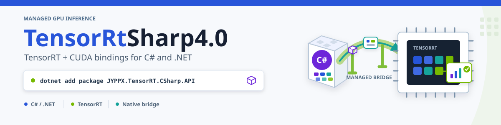
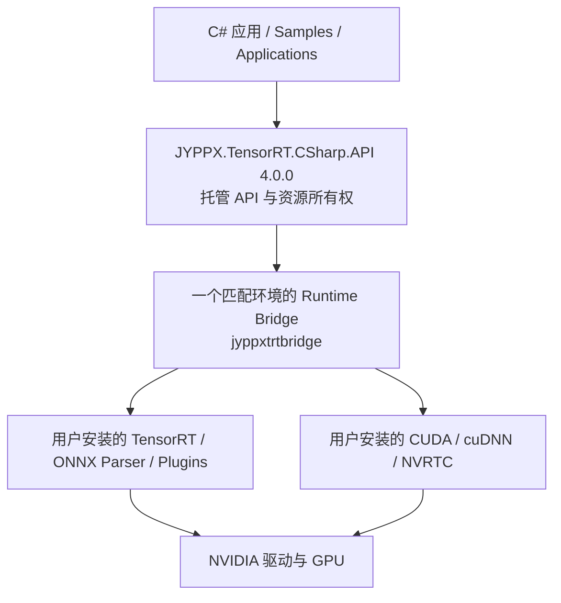
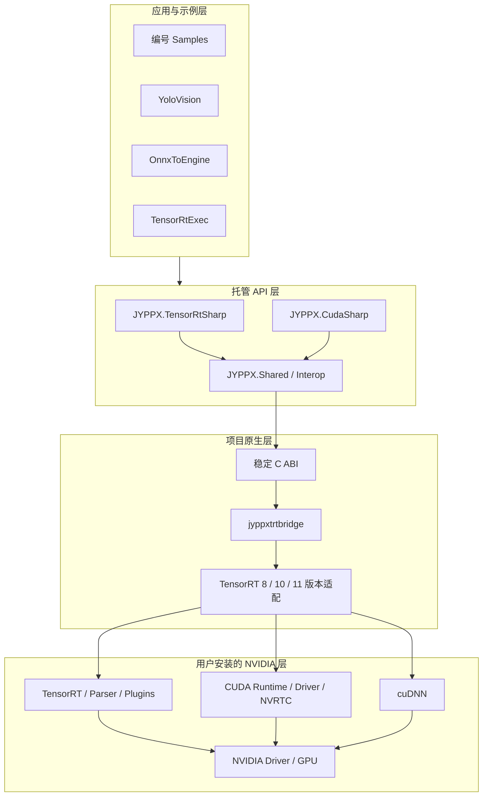
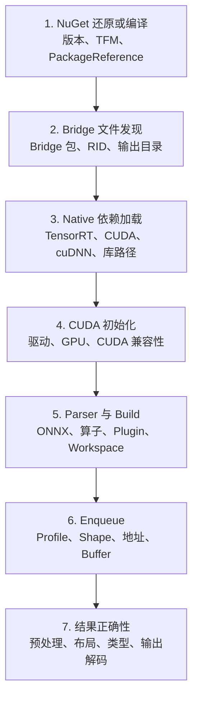

# TensorRT CSharp API v4.0 正式发布：面向 .NET 的 TensorRT 与 CUDA 全新重构

<!-- public-article-layout:start -->
<style>
.content article { min-width: 0; overflow-wrap: anywhere; }
.content article a, .content article :not(pre) > code { overflow-wrap: anywhere; word-break: break-word; }
.content article pre:not(.mermaid), .content article table { display: block; max-width: 100%; overflow-x: auto; }
.content pre.mermaid { max-width: 640px; margin: 16px auto; overflow-x: auto; }
.content pre.mermaid svg { display: block; width: 100%; max-width: 640px; height: auto; }
</style>
<!-- public-article-layout:end -->



> 文章 ID：`REL-001`<br>
> 对应版本：`4.0.0`<br>
> 正式版本记录日期：2026-08-10<br>
> 内容状态：`ready`，尚未发布到 CSDN

TensorRT CSharp API v4.0 4.0.0 已正式发布。

这不是在 3.x 代码上继续累加接口的小版本，也不是一次简单的包名调整。4.0 从源码组织、托管对象模型、原生 ABI、资源所有权、版本适配、NuGet 分发、样例和验证体系等方面重新构建，是一条全新的产品线。对 3.x 使用者而言，正确的理解方式是“迁移到新架构”，而不是“替换版本号后原地升级”。

4.0.0 的公开交付已经可以交叉核对：

- `v4.0.0` GitHub Release：<https://github.com/guojin-yan/TensorRT-CSharp-API/releases/tag/v4.0.0> 为 Latest，对应发布提交 `673e120807d789d90a13a9f28a043282e95bb5e6`。
- Release 提供 19 个 `.nupkg`：1 个托管 API 包、6 个 Windows x64 Bridge 包和 12 个 Linux x64 Bridge 包。
- `JYPPX.TensorRT.CSharp.API 4.0.0`：<https://www.nuget.org/packages/JYPPX.TensorRT.CSharp.API/4.0.0> 与 18 个 Runtime Bridge 的 `4.0.0` 均已发布到 NuGet.org。
- NuGet 包列表：<https://www.nuget.org/packages?q=+JYPPX.TensorRT.CSharp&includeComputedFrameworks=true&prerel=true&sortby=relevance> 可检索这 19 个包。
- 项目采用 Apache-2.0 许可证，核心源码、Samples、Applications、DocFX 文档和发布记录均在同一仓库维护。

本文是一篇自包含的首发说明。即使后续教程尚未发布，读者也可以只依靠本文完成项目认识、版本选型、安装、最小推理和第一轮排障。

---

## 1. 前言
<!-- public-article-project-preface:start -->
TensorRT CSharp API v4.0 是一个面向 C#/.NET 开发者的 TensorRT 与 CUDA 工程化接口项目。它把 NVIDIA 原生运行时、生成式绑定、C++ Bridge、托管对象模型和可验证的示例程序组织成一条完整链路，使使用者可以在熟悉的 .NET 项目中完成 Engine 构建、反序列化、ExecutionContext 管理、CUDA 内存操作、异步流同步和结果校验。项目的目标不是隐藏 TensorRT 的概念，而是把这些概念转换为有明确生命周期、所有权和错误边界的 C# API。

4.0.0 是一次完整重构后的正式版本。核心接口、Bridge 边界、Runtime 包命名、样例目录和验证方式都以 4.x 设计为准，不能把 3.x 的类型名、旧包名或旧 DLL 目录直接复制到新项目。托管包只提供项目接口和自有 Bridge；TensorRT、CUDA、cuDNN、显卡驱动以及对应许可证仍由使用者按目标平台安装和管理。

单篇文章也应能够独立阅读：读者可以先从项目入口确认源码和包，再根据本文的程序路径准备依赖，最后用输出中的状态、计数、Shape、哈希或结果图片判断流程是否真的完成。对于尚未具备兼容 GPU 的环境，本文会把静态检查、期望输出和真实运行结果分开标记，不把帮助命令或 build-only 结果包装成推理成功。

项目、包和源码入口（以下地址保留明文，便于复制到不完整支持 Markdown 链接的平台）：

项目主页：

```text
https://github.com/guojin-yan/TensorRT-CSharp-API/tree/TensorRtSharp4.0
```

核心 NuGet：

```text
https://www.nuget.org/packages/JYPPX.TensorRT.CSharp.API/4.0.0
```

Runtime Bridge 包列表：

```text
https://www.nuget.org/packages?q=+JYPPX.TensorRT.CSharp&includeComputedFrameworks=true&prerel=true&sortby=relevance
```

运行库清单：

```text
https://github.com/guojin-yan/TensorRT-CSharp-API/blob/TensorRtSharp4.0/pack/runtime/runtime-packages.manifest.json
```

### 1.1 程序出处与输出说明

本文涉及的程序、脚本或命令均以仓库中的实现为准；对应源码入口：

```text
https://github.com/guojin-yan/TensorRT-CSharp-API/tree/TensorRtSharp4.0
```

运行示例必须同时给出程序输出和判定标准。终端中的 `status`、`Ready`、`Bound`、`enqueueCount`、`OutputMatch`、进程退出码、报告文件或结果图片分别说明不同层次的事实；只有明确写出这些结果，读者才能区分程序启动、Engine 构建、GPU enqueue 和业务结果语义。
<!-- public-article-project-preface:end -->

### 1.2 项目简介与公开入口

TensorRT CSharp API v4.0 是面向 .NET 开发者的 TensorRT 与 CUDA C# API 封装项目。项目把 TensorRT 的 Runtime、Builder、Network、Engine、ExecutionContext、ONNX Parser 和推理绑定，以及 CUDA 的 Device、Memory、Stream、Event、Graph、Runtime Compilation 等能力，整理为可管理所有权、可诊断、可通过 NuGet 消费的托管接口。

| 公开入口 | 链接 |
| --- | --- |
| 项目主页与源码 | TensorRT-CSharp-API：<https://github.com/guojin-yan/TensorRT-CSharp-API/tree/TensorRtSharp4.0> |
| 4.0.0 Release | GitHub Release v4.0.0：<https://github.com/guojin-yan/TensorRT-CSharp-API/releases/tag/v4.0.0> |
| DocFX 文档源码 | docs/articles/zh-cn：<https://github.com/guojin-yan/TensorRT-CSharp-API/tree/TensorRtSharp4.0/docs/articles/zh-cn> |
| NuGet 包列表 | NuGet 搜索：<https://www.nuget.org/packages?q=+JYPPX.TensorRT.CSharp&includeComputedFrameworks=true&prerel=true&sortby=relevance> |
| 核心接口包 | JYPPX.TensorRT.CSharp.API 4.0.0：<https://www.nuget.org/packages/JYPPX.TensorRT.CSharp.API/4.0.0> |

### 1.3 包列表与代码获取

4.0.0 的公开包分成 1 个托管接口包和 18 个按操作系统、TensorRT、CUDA、cuDNN 组合拆分的 Runtime Bridge 包。Samples、Applications 和本文示例均属于 GitHub 源码，不会额外生成一个“分类包”或“案例包”。

- 托管包：`JYPPX.TensorRT.CSharp.API`，版本固定为 `4.0.0`。
- Windows Bridge：`JYPPX.TensorRT.CSharp.API.Runtime.win-x64.*.Bridge`。
- Linux Bridge：`JYPPX.TensorRT.CSharp.API.Runtime.linux-x64.*.Bridge`。
- NVIDIA TensorRT、CUDA、cuDNN、NVRTC 和驱动：由目标机器安装，Bridge 不重新分发这些厂商运行库。
- Samples 源码入口：samples/README.zh-CN.md：<https://github.com/guojin-yan/TensorRT-CSharp-API/blob/TensorRtSharp4.0/samples/README.zh-CN.md>。

本文后续所有代码均可以从 TensorRT CSharp API v4.0 源码分支：<https://github.com/guojin-yan/TensorRT-CSharp-API/tree/TensorRtSharp4.0>获取；包选择和安装命令以本文的 `4.0.0` 为准，不使用预览通配符。

### 1.4 为什么需要 TensorRT C# API

NVIDIA TensorRT 的核心接口以 C++ 为主。一个完整推理程序通常还会同时触及 CUDA Runtime、CUDA Driver、显存、Stream、Event、NVRTC、ONNX Parser、Plugin 和 cuDNN。C++ 开发者可以直接使用这些原生接口，但 .NET 项目如果从零接入，会立即面对几类问题。

第一类问题是 ABI。TensorRT 并不是一组可以直接复制成 `[DllImport]` 的纯 C 函数；大量对象来自 C++ 接口和虚函数表，不同 TensorRT 大版本还会增加、替换或移除成员。让业务代码直接感知这些变化，会把版本兼容逻辑扩散到整个应用。

第二类问题是所有权。Runtime、Builder、Network、Engine、ExecutionContext、Parser、Stream、Event 和 Device Memory 都有明确的创建者、依赖关系与释放顺序。托管对象被 GC 回收不等于 GPU 工作已经完成；异步 enqueue 后过早释放 Stream、Buffer 或回调对象，会产生非常难以复现的问题。

第三类问题是部署。程序能编译，并不代表目标机器能加载正确的 Bridge、TensorRT、CUDA、cuDNN 和驱动。Windows 与 Linux 的动态库命名、搜索路径和 RID 不同，同一操作系统下又存在多组 TensorRT/CUDA/cuDNN 组合。

第四类问题是工程化。真实项目不仅要“调用一次推理”，还要处理动态 Shape、Optimization Profile、多 Stream、Engine 序列化、Refit、Logger、Profiler、Allocator、错误诊断、模型输入输出契约和结果校验。

TensorRT CSharp API v4.0 的作用，就是把这些跨越 C#、C ABI、C++、CUDA 和 TensorRT 的复杂边界集中在一个可维护的工程中，让上层应用使用强类型、可释放、可诊断的 .NET API。

### 1.5 什么是 TensorRT CSharp API v4.0

TensorRT CSharp API v4.0 是面向 C#/.NET 的 TensorRT 与 CUDA API 项目。它由三部分组成：

1. `JYPPX.TensorRT.CSharp.API`：跨平台托管程序集，提供 `JYPPX.TensorRtSharp` 与 `JYPPX.CudaSharp` 两个主要命名空间。
2. `JYPPX.TensorRT.CSharp.API.Runtime.*.Bridge`：项目自有原生桥接库，把稳定的 C ABI 映射到指定版本的 TensorRT/CUDA C++ 接口。
3. 用户安装的 NVIDIA 运行环境：显卡驱动、TensorRT、CUDA、cuDNN 与按需使用的 NVRTC。

它不是 TensorRT 的重新实现，也不会替代 NVIDIA Runtime。TensorRT 仍然负责网络优化、Kernel 选择与 GPU 推理；TensorRT CSharp API v4.0 负责把这些能力以 .NET 友好的方式暴露出来，并管理原生边界。



### 1.6 与 3.x 的差异：为什么说 4.0 是一次大换代

4.0 的目标不是保持 3.x 的源码或二进制兼容，而是重新建立一套可以继续支持 TensorRT 8、10、11 以及现代 .NET 的基础。主要变化如下。

| 维度 | 3.x 迁移时常见的旧使用方式 | 4.0.0 新架构 | 升级价值 |
| --- | --- | --- | --- |
| 产品定位 | 在旧 API 表面继续增加封装 | 重新设计 TensorRT/CUDA 托管 API、Bridge 与交付体系 | 后续演进有清晰边界 |
| 命名空间 | 旧项目可能保留多套历史入口 | 统一为 `JYPPX.TensorRtSharp` 与 `JYPPX.CudaSharp` | 业务代码入口更稳定 |
| 原生边界 | 业务容易感知 native handle 或版本差异 | 项目 Bridge 提供受控 C ABI，托管层提供强类型对象 | 减少 ABI 变化外溢 |
| 生命周期 | 依赖调用者自行理解大量释放顺序 | 以 `IDisposable`、owner-bound 对象和 copied snapshot 表达所有权 | 降低悬空指针和提前释放风险 |
| TensorRT 版本 | 旧接口通常与特定历史版本耦合 | 正式矩阵覆盖 TensorRT 8.6、10.11 和 11.0 | 同一托管产品线覆盖多代 Runtime |
| CUDA 能力 | 以推理所需的少量 CUDA 操作为主 | 独立 `JYPPX.CudaSharp`，覆盖内存、Stream、Event、Graph、Module、Kernel、Driver 与 NVRTC | 可以构建完整 GPU 管线 |
| 动态网络 | 动态 Shape 与 Profile 需要较多底层拼装 | 提供 Optimization Profile、Shape、Binding readiness 等对象 | 动态输入更可诊断 |
| 回调 | Logger、Profiler、Allocator 等容易受委托生命周期影响 | 引入托管 owner、attach/detach 与诊断状态 | 回调生命周期更明确 |
| 包结构 | 旧包或本地部署容易混合托管、Bridge、厂商 Runtime | 1 个托管包 + 1 个按环境选择的 Bridge；厂商 Runtime 由用户安装 | 包职责与许可证边界清晰 |
| 平台矩阵 | 平台与版本组合不容易从包身份看出 | RID、Ubuntu、TRT、CUDA、cuDNN 都写入 Bridge 包 ID | 选包和排错可机械核对 |
| .NET 支持 | 旧项目迁移目标往往受历史框架限制 | 托管包多目标支持 .NET Framework 4.6 至 4.8.1、.NET Core 3.1、.NET 5 至 10 | 覆盖存量与现代应用 |
| 样例验证 | 源码引用可能掩盖发布包缺失 | 编号 Samples 使用正式 `PackageReference` | 更接近真实用户消费方式 |
| 应用层 | 核心库与完整应用边界不清晰 | Samples、YoloVision、OnnxToEngine、TensorRtExec 分层维护 | 学习、集成和工具使用各有入口 |

这张表表达的是迁移方向，不意味着 3.x 的每个项目都使用完全相同的方式。最重要的结论有三个：

- 4.0 不承诺与 3.x 二进制兼容，不能只替换 NuGet 版本号。
- 旧 Engine 也不能因为 C# API 已迁移就直接视为兼容；必须在目标 TensorRT、GPU 与构建策略上重新验证。
- 建议先建立一个 4.0 最小项目，再逐步迁移模型构建、推理、预处理和业务代码，而不是在旧工程中一次性替换所有接口。

### 1.7 TensorRT CSharp API v4.0 的核心优势

**强类型 C# 对象模型。** 常用 TensorRT/CUDA 对象以类、枚举、结构体和诊断快照呈现，减少裸指针、魔法数字和散落的 P/Invoke。

**显式资源生命周期。** 核心 GPU 与 TensorRT 对象实现 `IDisposable`，调用方可以使用 `using` 表达释放顺序。异步操作相关对象会尽量保留所有权关系，而不是把 native handle 直接交给业务层。

**多代 TensorRT 适配。** 4.0.0 的正式 Bridge 矩阵同时覆盖 TensorRT 8.6、10.11 和 11.0。托管层通过能力探测与版本适配处理差异，而不是要求每个业务项目维护一份条件编译代码。

**TensorRT 与 CUDA 同仓协作。** 推理不只是 `Enqueue`。显存复制、Pinned Memory、多 Stream、Event、CUDA Graph、NVRTC 和 Driver Module 都可以在同一个 C# API 体系内组合。

**可诊断而不是只抛出“加载失败”。** 环境探测、Binding Report、Execution Readiness、Parser 错误、Runtime/Builder 能力和回调状态都可以转成托管诊断信息。

**包边界透明。** Bridge 只包含项目自己的 `jyppxtrtbridge.dll` 或 `libjyppxtrtbridge.so`，不把 NVIDIA 厂商二进制重新打进 NuGet。部署者可以清楚知道哪部分来自项目，哪部分来自目标机器。

**从最小样例到完整应用。** 仓库既有聚焦单一概念的编号 Samples，也有图像分类、YoloVision、OnnxToEngine 和 TensorRtExec 等完整源码应用。

---

## 2. TensorRT CSharp API v4.0 4.0.0 介绍

### 2.1 项目简介

TensorRT CSharp API v4.0 面向以下开发者：

- 需要在 ASP.NET Core、Worker Service、桌面程序、CLI 或其他 .NET 应用中执行 TensorRT Engine 的团队。
- 需要从 ONNX 构建 Engine，并控制 Workspace、优化等级、精度、Profile 和序列化流程的开发者。
- 需要在 C# 中编排 CUDA Memory、Stream、Event、Graph 或运行时编译 Kernel 的 GPU 开发者。
- 需要将现有 C++ TensorRT 推理流程逐步迁移到 .NET，同时保留原生性能路径的项目。
- 需要 Logger、Profiler、Progress Monitor、Error Recorder、GPU/Output Allocator 等高级接口的工程团队。

它不适合以下误用：

- 把 NuGet Bridge 当成 CUDA、TensorRT 或显卡驱动安装器。
- 假定任意 TensorRT Engine 可以跨 GPU、跨 TensorRT 大版本或跨构建配置直接复用。
- 在未验证输入布局、归一化、颜色通道和输出解码的情况下，把“成功 Enqueue”当成模型正确。
- 同时引用多个不匹配的 Bridge，期待运行时自动选择正确版本。

### 2.2 核心特征

4.0.0 的功能覆盖可以按八个区域理解。

| 区域 | 代表能力 |
| --- | --- |
| 环境与诊断 | Bridge 构建信息、TensorRT/CUDA 版本、设备枚举、依赖探测、错误日志 |
| Engine 构建 | Builder、Network Definition、Builder Config、ONNX Parser、Optimization Profile、Timing Cache |
| 推理执行 | Runtime、Engine、Execution Context、Tensor Address、Shape Inference、异步 Enqueue |
| Tensor 与层 | Input/Output、Dims、DataType、常用 Layer、TensorRT 11 新层与边界能力 |
| CUDA 基础 | Device、Device Memory、Pinned/Managed Memory、Stream、Event、异步复制与填充 |
| CUDA 高级能力 | Graph、Memory Pool、Module、Kernel Launch、Driver API、NVRTC、IPC 与纹理/数组 |
| 回调与扩展 | Logger、Profiler、Progress Monitor、Error Recorder、Allocator、Debug Listener、Plugin 元数据 |
| 工程化能力 | Engine 保存/加载、Refit、Inspector、诊断快照、样例、完整应用与 DocFX API 文档 |

### 2.3 项目信息

| 项目项 | 信息 |
| --- | --- |
| 项目名称 | TensorRT CSharp API v4.0 / TensorRT-CSharp-API |
| 正式版本 | `4.0.0` |
| 发布日期 | 2026-08-10 |
| 许可证 | Apache-2.0 |
| 代码仓库 | github.com/guojin-yan/TensorRT-CSharp-API：<https://github.com/guojin-yan/TensorRT-CSharp-API> |
| GitHub Release | v4.0.0：<https://github.com/guojin-yan/TensorRT-CSharp-API/releases/tag/v4.0.0> |
| 核心 NuGet | JYPPX.TensorRT.CSharp.API 4.0.0：<https://www.nuget.org/packages/JYPPX.TensorRT.CSharp.API/4.0.0> |
| NuGet 包列表 | NuGet 搜索：<https://www.nuget.org/packages?q=+JYPPX.TensorRT.CSharp&includeComputedFrameworks=true&prerel=true&sortby=relevance> |
| 在线文档 | TensorRT CSharp API v4.0 DocFX：<https://guojin-yan.github.io/TensorRT-CSharp-API/> |
| 主要命名空间 | `JYPPX.TensorRtSharp`、`JYPPX.CudaSharp` |
| 原生桥接库 | Windows：`jyppxtrtbridge.dll`；Linux：`libjyppxtrtbridge.so` |
| CPU 架构 | x64 |
| 正式操作系统 | Windows x64、Ubuntu 20.04/22.04/24.04 x64，具体取决于 Bridge |
| TensorRT | 8.6、10.11、11.0，具体取决于 Bridge |
| CUDA Toolkit | 11.8、12.1、12.9、13.2，具体取决于 Bridge |
| cuDNN | 8.9、9.22，具体取决于 Bridge |
| 托管目标框架 | .NET Framework 4.6/4.6.1/4.6.2/4.7/4.7.1/4.7.2/4.8/4.8.1；.NET Core 3.1；.NET 5/6/7/8/9/10 |
| NuGet 数量 | 19：1 个托管包 + 18 个 Runtime Bridge |
| 厂商 Runtime 策略 | CUDA、cuDNN、TensorRT、NVRTC 与驱动由用户安装，不进入项目 NuGet |

### 2.4 仓库中的 Samples 与 Applications

`samples/` 中有 8 个编号示例：

| 分类 | 示例 | 验证重点 |
| --- | --- | --- |
| CUDA | `Cuda/01.RuntimeCompilation` | NVRTC、PTX/CUBIN、Module、Kernel Launch、GPU 读回 |
| Inference | `Inference/01.Bindings` | 动态 Batch、输入输出 Buffer、地址绑定、Enqueue 与逐值校验 |
| Inference | `Inference/02.DynamicShapes` | Optimization Profile、运行时 Shape 与输出验证 |
| Inference | `Inference/03.OnnxBuildAndRun` | ONNX 解析、Engine 构建、推理和 JSON 输出 |
| Inference | `Inference/04.RefittedPlan` | Refit、Plan 保存/重载与结果校验 |
| Diagnostics | `Diagnostics/01.CallbackLifecycle` | Logger、Profiler、Progress Monitor、Debug Listener 生命周期 |
| Performance | `Performance/01.MultiStream` | 两条非阻塞 Stream、Event 与跨流顺序 |
| Computer Vision | `ComputerVision/01.Classification` | ResNet18、图像预处理、Top-K 和结果图 |

`applications/` 中提供更完整的源码应用：

- `YoloVision`：覆盖目标检测、分类、实例分割、OBB、姿态和语义分割。
- `OnnxToEngine`：将 ONNX 解析、Engine 构建、保存与报告输出组合成 CLI。
- `TensorRtExec`：提供 trtexec 风格命令行能力与 WinForms 桌面界面。

这些应用不是额外的 4.0.0 NuGet 产品。它们以源码形式交付，便于读者理解如何把核心 API 组合成真实工具。

---

## 3. NuGet 包介绍

### 3.1 核心接口包

所有项目都先安装同一个托管包：

```text
JYPPX.TensorRT.CSharp.API 4.0.0
```

这个包包含：

- `JYPPX.TensorRtSharp` 的 TensorRT 托管 API。
- `JYPPX.CudaSharp` 的 CUDA 托管 API。
- 托管层所需的共享互操作代码、XML 文档、NuGet README 与项目元数据。
- 针对多个 .NET Framework、.NET Core 和现代 .NET TFM 构建的程序集。

这个包不包含：

- `jyppxtrtbridge` 原生库。
- NVIDIA 驱动、CUDA、cuDNN、TensorRT、ONNX Parser、Plugin 或 NVRTC。
- 模型、ONNX、Engine、测试图片或 Applications。

因此，只安装核心包可以完成编译和浏览 API，但涉及原生能力时还必须选择一个 Runtime Bridge，并在机器上安装对应 NVIDIA 依赖。

### 3.2 Windows Runtime Bridge：6 个

| # | Runtime Bridge 包 | TensorRT | CUDA | cuDNN |
| ---: | --- | ---: | ---: | ---: |
| 1 | `JYPPX.TensorRT.CSharp.API.Runtime.win-x64.trt8.6.cuda11.8.cudnn8.9.Bridge` | 8.6 | 11.8 | 8.9 |
| 2 | `JYPPX.TensorRT.CSharp.API.Runtime.win-x64.trt8.6.cuda12.1.cudnn8.9.Bridge` | 8.6 | 12.1 | 8.9 |
| 3 | `JYPPX.TensorRT.CSharp.API.Runtime.win-x64.trt10.11.cuda11.8.cudnn8.9.Bridge` | 10.11 | 11.8 | 8.9 |
| 4 | `JYPPX.TensorRT.CSharp.API.Runtime.win-x64.trt10.11.cuda12.9.cudnn9.22.Bridge` | 10.11 | 12.9 | 9.22 |
| 5 | `JYPPX.TensorRT.CSharp.API.Runtime.win-x64.trt11.0.cuda12.9.cudnn9.22.Bridge` | 11.0 | 12.9 | 9.22 |
| 6 | `JYPPX.TensorRT.CSharp.API.Runtime.win-x64.trt11.0.cuda13.2.cudnn9.22.Bridge` | 11.0 | 13.2 | 9.22 |

### 3.3 Linux Runtime Bridge：12 个

| Ubuntu | Runtime Bridge 包 | TensorRT | CUDA | cuDNN |
| --- | --- | ---: | ---: | ---: |
| 20.04 | `JYPPX.TensorRT.CSharp.API.Runtime.linux-x64.ubuntu20.04.trt8.6.cuda11.8.cudnn8.9.Bridge` | 8.6 | 11.8 | 8.9 |
| 20.04 | `JYPPX.TensorRT.CSharp.API.Runtime.linux-x64.ubuntu20.04.trt8.6.cuda12.1.cudnn8.9.Bridge` | 8.6 | 12.1 | 8.9 |
| 20.04 | `JYPPX.TensorRT.CSharp.API.Runtime.linux-x64.ubuntu20.04.trt10.11.cuda11.8.cudnn8.9.Bridge` | 10.11 | 11.8 | 8.9 |
| 22.04 | `JYPPX.TensorRT.CSharp.API.Runtime.linux-x64.ubuntu22.04.trt8.6.cuda11.8.cudnn8.9.Bridge` | 8.6 | 11.8 | 8.9 |
| 22.04 | `JYPPX.TensorRT.CSharp.API.Runtime.linux-x64.ubuntu22.04.trt8.6.cuda12.1.cudnn8.9.Bridge` | 8.6 | 12.1 | 8.9 |
| 22.04 | `JYPPX.TensorRT.CSharp.API.Runtime.linux-x64.ubuntu22.04.trt10.11.cuda11.8.cudnn8.9.Bridge` | 10.11 | 11.8 | 8.9 |
| 22.04 | `JYPPX.TensorRT.CSharp.API.Runtime.linux-x64.ubuntu22.04.trt10.11.cuda12.9.cudnn9.22.Bridge` | 10.11 | 12.9 | 9.22 |
| 22.04 | `JYPPX.TensorRT.CSharp.API.Runtime.linux-x64.ubuntu22.04.trt11.0.cuda12.9.cudnn9.22.Bridge` | 11.0 | 12.9 | 9.22 |
| 22.04 | `JYPPX.TensorRT.CSharp.API.Runtime.linux-x64.ubuntu22.04.trt11.0.cuda13.2.cudnn9.22.Bridge` | 11.0 | 13.2 | 9.22 |
| 24.04 | `JYPPX.TensorRT.CSharp.API.Runtime.linux-x64.ubuntu24.04.trt10.11.cuda12.9.cudnn9.22.Bridge` | 10.11 | 12.9 | 9.22 |
| 24.04 | `JYPPX.TensorRT.CSharp.API.Runtime.linux-x64.ubuntu24.04.trt11.0.cuda12.9.cudnn9.22.Bridge` | 11.0 | 12.9 | 9.22 |
| 24.04 | `JYPPX.TensorRT.CSharp.API.Runtime.linux-x64.ubuntu24.04.trt11.0.cuda13.2.cudnn9.22.Bridge` | 11.0 | 13.2 | 9.22 |

### 3.4 如何选择正确的 Bridge

Bridge 包 ID 本身就是兼容条件：

```text
Runtime.<RID>[.<Ubuntu版本>].trt<TensorRT>.cuda<CUDA>.cudnn<cuDNN>.Bridge
```

选择顺序必须是：

1. 确认操作系统与 CPU 架构。
2. Linux 再确认 Ubuntu 版本，不要跨发行版复用 `.so`。
3. 确认目标机器实际安装的 TensorRT 版本。
4. 确认 CUDA Toolkit/Runtime 组合。
5. 确认 cuDNN 版本。
6. 从表中选择唯一匹配项，并把核心包和 Bridge 都固定为精确 `4.0.0`。

例如，目标机器是 Windows x64、TensorRT 10.11、CUDA 12.9、cuDNN 9.22，则选择：

```text
JYPPX.TensorRT.CSharp.API.Runtime.win-x64.trt10.11.cuda12.9.cudnn9.22.Bridge
```

不要按“数字最大”选包，也不要同时安装多个 Bridge。NuGet 能完成依赖还原，不代表 native ABI 一定匹配。

### 3.5 为什么 Bridge 不携带 NVIDIA Runtime

4.0.0 明确采用 bridge-only 策略。这样设计有四个原因：

- NVIDIA 组件有独立许可证和分发规则，项目不应把厂商 Runtime 当作自己的二进制重新发布。
- 驱动、CUDA、TensorRT、cuDNN 之间存在严格兼容关系，目标机器应由部署者统一管理。
- 避免单个 NuGet 变成体积巨大的“全家桶”，也避免多个包重复携带相同厂商文件。
- 排障边界更清楚：托管 API、项目 Bridge、厂商 Runtime、驱动/GPU 可以分别检查。

---

## 4. 安装与首次验证

### 4.1 系统要求与依赖版本

最低准备项如下：

| 组件 | 要求 |
| --- | --- |
| CPU | x64 |
| GPU | 支持所选 TensorRT/CUDA 组合的 NVIDIA GPU |
| 驱动 | 满足所选 CUDA Runtime 的最低驱动要求 |
| .NET | 使用核心包支持的 TFM；仓库编号 Samples 以 `net8.0` 为主 |
| TensorRT | 必须与 Bridge 包 ID 的 `trt` 段一致 |
| CUDA | 必须与 Bridge 包 ID 的 `cuda` 段一致 |
| cuDNN | 必须与 Bridge 包 ID 的 `cudnn` 段一致 |
| 磁盘与权限 | 能还原 NuGet，并能让进程加载用户安装的 native libraries |

驱动与 CUDA 的兼容关系以 NVIDIA 官方文档为准。Bridge 的版本名称描述项目编译目标，但不会替目标机器修复驱动或安装依赖。

### 4.2 Windows 环境安装

假设机器已经安装 TensorRT 10.11、CUDA 12.9、cuDNN 9.22，并准备创建 .NET 8 控制台项目：

```powershell
dotnet new console -n TensorRtSharpQuickstart -f net8.0
Set-Location .\TensorRtSharpQuickstart

dotnet add package JYPPX.TensorRT.CSharp.API --version 4.0.0
dotnet add package JYPPX.TensorRT.CSharp.API.Runtime.win-x64.trt10.11.cuda12.9.cudnn9.22.Bridge --version 4.0.0

dotnet restore
dotnet list package --include-transitive
```

对应 `.csproj` 的关键部分是：

```xml
<ItemGroup>
  <PackageReference Include="JYPPX.TensorRT.CSharp.API" Version="4.0.0" />
  <PackageReference
    Include="JYPPX.TensorRT.CSharp.API.Runtime.win-x64.trt10.11.cuda12.9.cudnn9.22.Bridge"
    Version="4.0.0" />
</ItemGroup>
```

运行前检查：

```powershell
nvidia-smi
dotnet --info
Get-ChildItem Env:CUDA_PATH
Get-ChildItem -Recurse .\bin | Where-Object Name -eq 'jyppxtrtbridge.dll'
```

`PATH` 中还需要能够找到目标 TensorRT/CUDA/cuDNN 动态库。实际目录由 NVIDIA 安装方式决定，不要把其他版本目录为了“碰运气”全部加入 `PATH`。

### 4.3 Linux 环境安装

Linux 必须先按照目标 Ubuntu 版本安装 NVIDIA 驱动、CUDA、TensorRT 与 cuDNN。下面以 Ubuntu 22.04、TensorRT 10.11、CUDA 12.9、cuDNN 9.22 为例：

```bash
dotnet new console -n TensorRtSharpQuickstart -f net8.0
cd TensorRtSharpQuickstart

dotnet add package JYPPX.TensorRT.CSharp.API --version 4.0.0
dotnet add package JYPPX.TensorRT.CSharp.API.Runtime.linux-x64.ubuntu22.04.trt10.11.cuda12.9.cudnn9.22.Bridge --version 4.0.0

dotnet restore
dotnet list package --include-transitive
```

检查系统和动态库：

```bash
uname -m
cat /etc/os-release
nvidia-smi
dotnet --info
ldconfig -p | grep -E 'nvinfer|cudart|cudnn'
find ./bin -name 'libjyppxtrtbridge.so' -print
```

如果厂商库安装在非标准目录，需要按部署规范配置 `LD_LIBRARY_PATH` 或 `ldconfig`。不要把 Windows Bridge 用到 Wine，也不要把 Ubuntu 22.04 Bridge 直接复制到 20.04/24.04 后假定兼容。

### 4.4 先做离线编译验证

从源码仓库运行以下命令：

```powershell
dotnet run --project .\samples\Inference\01.Bindings -c Release -- --help
```

帮助入口不初始化 GPU，可以先确认：

- NuGet 能还原精确 `4.0.0`。
- 项目能编译。
- 正确的样例入口可以启动。

但 `--help` 成功不等于 GPU 推理成功。下一步仍要执行环境探测、构建或加载 Engine、Enqueue 并验证输出。

### 4.5 最小环境探测代码

```csharp
using JYPPX.CudaSharp;
using JYPPX.TensorRtSharp;

TensorRtEnvironmentSnapshot trt = TensorRtEnvironmentProbe.GetCurrent();
CudaEnvironmentSnapshot cuda = CudaEnvironmentProbe.GetCurrent();

Console.WriteLine($"Bridge: {trt.BuildInfo.BridgeName}");
Console.WriteLine($"TensorRT: {trt.BuildInfo.TensorRtVersion}");
Console.WriteLine($"CUDA Toolkit: {cuda.BuildInfo.CudaToolkitVersion}");
Console.WriteLine($"CUDA devices: {cuda.CudaRuntimeInfo.DeviceCount}");
```

首次运行时，建议把这些信息写入应用日志。它们比单独记录 NuGet 版本更能说明进程最终加载了什么环境。

---

## 5. 核心接口介绍

### 5.1 TensorRT 核心对象

| 类型 | 主要责任 | 生命周期提示 |
| --- | --- | --- |
| `TensorRtLogger` | 接收 TensorRT 日志 | 应覆盖依赖它的 Runtime/Builder 生命周期 |
| `TensorRtRuntime` | 反序列化 Engine，创建 Runtime 侧对象 | Engine 创建完成后仍应按对象依赖正确释放 |
| `TensorRtBuilder` | 创建 Network、Config、Profile 并构建 Engine | 构建阶段使用，可与推理部署阶段分离 |
| `TensorRtNetworkDefinition` | 定义或承载 ONNX Parser 生成的网络 | Tensor 与 Layer 通常受 Network 所有权约束 |
| `TensorRtBuilderConfig` | Workspace、Flag、优化等级、Profile、Stream 等构建策略 | 配置必须在 Build 完成前保持有效 |
| `TensorRtOptimizationProfile` | 定义 Dynamic Shape 的 min/opt/max | 动态输入必须覆盖实际运行 Shape |
| `TensorRtOnnxParser` | 将 ONNX 解析到 Network | 解析失败时读取完整错误摘要 |
| `TensorRtHostMemory` | 承载序列化 Plan | 可保存到文件或交给 Runtime 反序列化 |
| `TensorRtEngine` | 已构建或已加载的 TensorRT Engine | 可创建一个或多个 Execution Context |
| `TensorRtExecutionContext` | 保存一次执行上下文、Profile、Shape 与地址状态 | 不应被多个无协调线程随意共享 |
| `TensorRtInferenceBindings` | 管理输入输出 Buffer、Shape、地址、Readiness 与 Enqueue | 是常用推理路径的高层组合对象 |
| `TensorRtEngineInspector` | 查询层信息与 Engine 诊断 | 用于排查构建结果，不替代结果正确性验证 |
| `TensorRtRefitter` | 更新可 Refit Engine 的权重 | Refit 后应保存、重载并重新验证输出 |

### 5.2 TensorRT 常用接口族

**构建与网络：** `CreateNetwork`、`CreateBuilderConfig`、`CreateOptimizationProfile`、`BuildSerializedNetwork`、Network Layer API、ONNX Parser。

**Engine 与执行：** `Deserialize`、`DeserializeFromFile`、`CreateExecutionContext`、`SetInputShape`、`SetTensorAddress`、`EnqueueV3` 及其高层 Binding 封装。

**动态 Shape：** `TensorRtDims`、Optimization Profile 的 min/opt/max、运行时 Shape、Shape Inference 与 Readiness。

**诊断与回调：** Logger、Profiler、Progress Monitor、Error Recorder、Debug Listener、GPU Allocator、Output Allocator。

**高级能力：** Timing Cache、Engine Inspector、Plugin Registry、Refit、辅助 Stream、Device Memory、TensorRT 11 新增的构建与运行控制。

### 5.3 CUDA 核心对象

| 类型 | 主要责任 |
| --- | --- |
| `CudaEnvironmentProbe` | 获取 Bridge、CUDA Runtime 和设备状态 |
| `CudaDevice` / `CudaDeviceScope` | 设备选择与当前设备作用域 |
| `CudaMemory` | Device Memory 分配、同步/异步复制、填充与读回 |
| `CudaPinnedMemory` | 锁页 Host Memory，为异步传输提供合适缓冲区 |
| `CudaManagedMemory` | CUDA Unified/Managed Memory |
| `CudaStream` | 异步任务序列、同步、Event wait 与耗时测量 |
| `CudaEvent` | GPU 时间点、同步与跨 Stream 依赖 |
| `CudaGraph` | 捕获、实例化和启动重复 GPU 工作图 |
| `CudaMemoryPool` | 流有序内存分配与池属性 |
| `CudaRtcCompiler` | 使用 NVRTC 在运行时编译 CUDA 源码 |
| `CudaKernelLibrary` | 加载 PTX/CUBIN 并启动 Kernel |
| `CudaDriverModule` | 通过 CUDA Driver API 加载 Module 与启动 Kernel |

### 5.4 资源释放的基本规则

1. 优先使用 `using`/`using var`，不要等待 GC 决定 native 资源何时释放。
2. 先完成或同步异步 GPU 工作，再释放相关 Stream、Event、Memory、Engine 和回调 owner。
3. 子对象通常不能比创建它的父对象活得更久。例如 Execution Context 不应超过 Engine 生命周期。
4. 不要缓存从 native 层借用的指针。4.0 尽量提供 copied snapshot 或强类型 owner，业务代码也应维持这一边界。
5. 多线程场景要按 TensorRT/CUDA 对象自身的线程安全约束设计，不要因为 C# 对象可被多个线程访问就假定原生对象线程安全。

---

## 6. 项目架构设计

### 6.1 分层结构



### 6.2 为什么中间要有 C ABI Bridge

如果 C# 直接绑定 TensorRT C++ 虚函数表，每次 TensorRT 调整接口布局，托管层都必须理解编译器 ABI、继承与版本细节。4.0 的 Bridge 把 C++ 版本差异收敛在 native 项目内部，对托管层暴露项目控制的 C ABI。

这样做不能消除所有版本差异，但能把差异限制在明确位置：

- Bridge 在构建时绑定指定 TensorRT/CUDA/cuDNN 组合。
- 托管层通过能力探测决定哪些入口可用。
- Bridge 包 ID 明确记录其目标环境。
- 业务项目主要面对稳定的 C# 对象，而不是每个 TensorRT 版本的 C++ 布局。

### 6.3 源码组织

```text
src/
  JYPPX.TensorRtSharp/        TensorRT 托管 API
  JYPPX.CudaSharp/            CUDA 托管 API
  JYPPX.Shared/               共享类型与互操作基础
  JYPPX.TensorRtSharp.Tools/  工具层能力
native/                       项目自有原生 Bridge 与版本适配
samples/                      聚焦单一概念的编号案例
applications/                 完整源码应用
docs/                         DocFX、API 与中英文文章
eng/                          构建、验证、打包与发布脚本
tests/                        单元、质量和契约测试
```

### 6.4 包架构与运行时加载

构建时，核心包提供编译引用；Bridge 包通过 RID 资产把 `jyppxtrtbridge` 放入输出目录。运行时再由操作系统加载器解析 Bridge 依赖的 NVIDIA 动态库。

因此部署成功需要同时满足四个条件：

```text
托管 API 版本正确
  + 唯一且匹配的 Bridge
  + 可被加载器找到的 NVIDIA Runtime
  + 兼容的驱动与 GPU
= 可进入真实 TensorRT/CUDA 调用
```

任何一个条件缺失，都不应通过复制另一版本 DLL 或同时安装多个 Bridge 来掩盖。

---

## 7. 常用功能与代码

下面代码用于展示 4.0 的核心使用方式。为了让首发文章自包含，每段都说明关键步骤；生产项目还需要补充业务日志、配置、模型契约和错误处理。

### 7.1 从 C# 构建一个动态 Batch 网络并推理

下面使用 Identity 网络演示完整生命周期，不依赖外部 ONNX：

```csharp
using JYPPX.CudaSharp;
using JYPPX.TensorRtSharp;

using TensorRtLogger logger = new TensorRtLogger(TensorRtApiLine.TensorRt10);
using TensorRtRuntime runtime = new TensorRtRuntime(logger);
using TensorRtBuilder builder = new TensorRtBuilder(logger);
using TensorRtBuilderConfig config = builder.CreateBuilderConfig();
using CudaStream stream = new CudaStream();

config.SetMemoryPoolLimit(
    TensorRtMemoryPoolType.Workspace,
    64UL * 1024UL * 1024UL);
config.SetOptimizationLevel(3);
config.SetProfileStream(stream);

using TensorRtNetworkDefinition network = builder.CreateNetwork(
    TensorRtNetworkDefinitionCreationFlags.ExplicitBatch);
using TensorRtTensor input = network.AddInput(
    "input",
    TensorRtDataType.Float,
    new TensorRtDims(new[] { -1, 4 }));
using TensorRtLayer identity = network.AddIdentity(input);
using TensorRtTensor output = identity.GetOutput(0);
output.Name = "output";
network.MarkOutput(output);

using TensorRtOptimizationProfile profile =
    builder.CreateOptimizationProfile();
profile.SetShape(
    "input",
    new TensorRtDims(new[] { 1, 4 }),
    new TensorRtDims(new[] { 2, 4 }),
    new TensorRtDims(new[] { 4, 4 }));
int profileIndex = config.AddOptimizationProfile(profile);

using TensorRtHostMemory plan =
    builder.BuildSerializedNetwork(network, config);
using TensorRtEngine engine = runtime.Deserialize(plan);
using TensorRtExecutionContext context = engine.CreateExecutionContext();

TensorRtDims shape = new TensorRtDims(new[] { 2, 4 });
float[] values = { 1, 2, 3, 4, 5, 6, 7, 8 };

using TensorRtInferenceBindings bindings =
    new TensorRtInferenceBindings(engine, context, profileIndex);
bindings.SetInputShape("input", shape)
        .CopyInputFromHost("input", values, shape);
bindings.AllocateDeviceBuffer("output", shape);
bindings.BindAll();

TensorRtExecutionContextReadiness readiness =
    bindings.GetReadiness(runShapeInference: true);
if (!readiness.IsReadyForEnqueue)
{
    throw new InvalidOperationException(readiness.ToString());
}

TensorRtInferenceExecutionSummary execution =
    bindings.EnqueueAsync(stream, synchronize: true, runShapeInference: false);
float[] result = bindings.ReadOutputSingles("output", values.Length);

Console.WriteLine(execution);
Console.WriteLine($"OutputMatch={values.SequenceEqual(result)}");
```

这段代码体现了 4.0 的典型路径：Builder/Network/Config/Profile 负责构建，Runtime/Engine/Context 负责执行，`TensorRtInferenceBindings` 负责 Shape、Buffer、地址和 Readiness。

### 7.2 从 ONNX 构建 Engine

```csharp
using TensorRtNetworkDefinition network = builder.CreateNetwork(
    TensorRtNetworkDefinitionCreationFlags.ExplicitBatch);
using TensorRtOnnxParser parser = new TensorRtOnnxParser(logger, network);

if (!parser.ParseFromFile(modelPath))
{
    throw new InvalidOperationException(parser.GetErrorSummary());
}

config.SetMemoryPoolLimit(
    TensorRtMemoryPoolType.Workspace,
    256UL * 1024UL * 1024UL);
config.SetOptimizationLevel(3);
config.SetProfileStream(stream);

using TensorRtHostMemory plan =
    builder.BuildSerializedNetwork(network, config);
using TensorRtEngine engine = runtime.Deserialize(plan);
```

如果 ONNX 输入含动态维度，还需要在 Build 前创建 Optimization Profile。解析成功只说明网络可以进入 TensorRT Network，不说明所有构建策略、Plugin 和运行输入都正确。

### 7.3 动态 Shape 的关键步骤

```csharp
using TensorRtOptimizationProfile profile =
    builder.CreateOptimizationProfile();

profile.SetShape(
    "images",
    new TensorRtDims(new[] { 1, 3, 320, 320 }),
    new TensorRtDims(new[] { 1, 3, 640, 640 }),
    new TensorRtDims(new[] { 4, 3, 1280, 1280 }));

int profileIndex = config.AddOptimizationProfile(profile);

// 创建 engine/context/bindings 后：
bindings.SetInputShape(
    "images",
    new TensorRtDims(new[] { 1, 3, 640, 640 }));
```

运行 Shape 必须落在 min/max 范围内。`opt` 不是唯一合法 Shape，而是 TensorRT 优化时的重要参考点。多个输入需要为每个动态输入建立一致的 Profile 契约。

### 7.4 CUDA 显存、Stream 与 Event

```csharp
const int byteCount = 4096;

using CudaStream producer =
    new CudaStream(CudaStreamCreationFlags.NonBlocking);
using CudaStream consumer =
    new CudaStream(CudaStreamCreationFlags.NonBlocking);
using CudaMemory device = new CudaMemory(byteCount);
using CudaPinnedMemory host = new CudaPinnedMemory(byteCount);
using CudaEvent ready = new CudaEvent();

device.FillAsync(0x33, byteCount, producer);
ready.Record(producer);

consumer.WaitFor(ready);
device.CopyToAsync(host, byteCount, consumer);
consumer.Synchronize();

bool passed = host.ToArray(byteCount)
    .All(static value => value == 0x33);
Console.WriteLine($"CrossStreamWait={passed}");
```

Event 把依赖留在 GPU 调度侧，避免 CPU 先同步生产者再提交消费者。真实推理管线可以用同样方式连接 H2D、预处理、TensorRT Enqueue 和后处理。

### 7.5 使用 CUDA Event 测量 GPU 工作

```csharp
float elapsedMilliseconds = stream.MeasureElapsedTime(cudaStream =>
{
    bindings.EnqueueAsync(
        cudaStream,
        synchronize: false,
        runShapeInference: false);
});

Console.WriteLine($"TensorRT enqueue elapsed: {elapsedMilliseconds:0.###} ms");
```

这比只用 `Stopwatch` 包住一次异步提交更接近 GPU 实际执行时间。`Stopwatch` 如果没有正确同步，测到的可能只是 CPU 提交耗时。

### 7.6 NVRTC 运行时编译 CUDA Kernel

```csharp
using JYPPX.CudaSharp;

const string source = """
extern "C" __global__ void scale(float* values, int count)
{
    int i = (int)(blockIdx.x * blockDim.x + threadIdx.x);
    if (i < count) values[i] *= 2.0f;
}
""";

var program = new CudaRtcProgramSource(source, "scale.cu");
var options = new CudaRtcCompileOptions(
    targetArchitecture: "compute_75",
    generateLineInfo: true);

CudaRtcCompilationResult compilation =
    CudaRtcCompiler.Compile(program, options);
if (!compilation.Success)
{
    throw new InvalidOperationException(compilation.Log);
}

CudaRtcArtifact? ptx = compilation.FindArtifact(CudaRtcArtifactKind.Ptx);
Console.WriteLine($"PTX bytes={ptx?.Length} sha256={ptx?.Sha256}");
```

NVRTC 来自用户安装的 CUDA Toolkit，不包含在 Bridge NuGet 中。生产代码应先调用 `CudaRtcCompiler.GetCapability()`，再根据可用性决定是否启用运行时编译。

### 7.7 Logger 与 Profiler

TensorRT 日志用于定位 Parser、Builder 和 Runtime 问题；Profiler 可采集层级执行时间。回调对象必须在 native 侧可能调用它们的整个期间保持存活。

建议的工程做法是：

- 将 TensorRT 日志映射到应用现有日志系统，并保留 severity。
- 性能诊断时启用 Profiler，正常生产路径按需要关闭详细层日志。
- 不允许托管回调异常跨越 native 边界；在回调内部捕获并记录。
- 先 detach 回调，再释放 owner 和依赖对象。

---

## 8. 性能测试与正确理解

### 8.1 C# 封装是否会让 TensorRT 变慢

真正的网络优化和推理 Kernel 仍由 TensorRT/CUDA 在 native/GPU 侧执行。C# 层主要负责配置对象、提交任务和管理资源。对于计算量足够大的模型，托管调用本身通常不是主要耗时；但以下因素仍可能显著影响整体性能：

- 每次推理重复创建 Runtime、Engine、Context 或 Buffer。
- 使用普通托管数组并进行不必要的多次复制。
- 每次 Enqueue 后立即同步，破坏流水线并行。
- 动态 Shape 变化过于频繁，或 Profile 设计不合理。
- 预处理和后处理仍在 CPU 上串行执行。
- 日志、Profiler、Debug Listener 或输出读回在热路径中产生额外开销。
- 用 Debug 构建或未预热就记录第一次结果。

4.0 的设计重点是让调用者能复用 Engine/Context/Buffer、使用 Pinned Memory 和 Stream/Event，并用 GPU Event 进行测量，而不是声称“换成 C# 后自动获得额外加速”。

### 8.2 4.0 开发周期中的真实运行记录

仓库保留了真实 GPU 运行与输出校验记录。以下数字只用于说明功能路径和测量能力，不是跨设备的官方排行榜，也不能直接当作 3.x/4.0 性能对比。

| 工作负载 | 环境摘要 | 单次记录 | 验证内容 |
| --- | --- | ---: | --- |
| Dynamic Shape Identity | Windows 11、RTX 3060 Laptop、TRT 10.11、CUDA 12.9 | `0.629 ms` | 动态 Shape、Enqueue、输入输出逐值一致 |
| TorchVision ResNet18 分类 | Windows 11、RTX 3060 Laptop、TRT 10.11、CUDA 12.9 | `3.063 ms` | 本地包消费者、真实图片、Top-5、参考输出校验 |
| CUDA MultiStream | Windows 11、RTX 3060 Laptop、CUDA 12.9 | 不以延迟为目标 | 两条非阻塞 Stream、4096 字节读回、跨流 Event wait 均通过 |

这些记录的共同边界是：单机、单次特定运行不能外推到其他 GPU、功耗状态、驱动、TensorRT 版本、模型、Batch、精度或并发设置。尤其不能用两个不同构建条件下的数字宣称某个 TensorRT 版本必然更快。

### 8.3 推荐的基准测试方法

对自己的模型，应采用以下流程：

1. 固定 GPU、驱动、TensorRT、CUDA、cuDNN、Bridge、模型 SHA256 和 Engine 构建参数。
2. Release 构建，关闭调试器，记录 GPU 型号、功耗模式和时钟策略。
3. 预热足够次数，使 Engine、内存和 Kernel 初始化不进入稳定区间。
4. 复用 Runtime、Engine、Context、Stream 和 Buffer，不在迭代内反复创建。
5. 用 CUDA Event 测 GPU 推理；用端到端计时另测预处理、H2D、推理、D2H 和后处理。
6. 至少报告平均值、P50、P95、P99、吞吐量、Batch、并发 Stream 数和样本数。
7. 同时验证输出，避免把错误输入、空输出或跳过执行记录成“更快”。
8. 比较 3.x 与 4.0 时，必须使用同一机器、同一模型、同一 Engine 策略、同一输入和相同同步边界。

首发版本没有伪造一个无法复核的 3.x 对照数字。4.0 是否提升某个业务的端到端性能，应由上述同条件 A/B 测试回答；4.0 已提供完成这类测试所需的 Stream、Event、Profiler、绑定复用和结构化输出基础。

---

## 9. 问题排查

### 9.1 先判断问题位于哪一层

按执行链从上到下检查，在第一个失败的阶段停下来处理，不要同时改动多个层次。



### 9.2 常见症状与处理

| 症状 | 常见原因 | 建议处理 |
| --- | --- | --- |
| NuGet 还原到 `4.0.6170` 等历史包 | 未固定正式版本，NuGet 按版本排序选择历史线 | 核心包和 Bridge 都显式写 `Version="4.0.0"` |
| `DllNotFoundException: jyppxtrtbridge` | 未安装 Bridge、RID 不匹配、native asset 未复制 | `dotnet list package`，检查 `bin` 下 DLL/SO |
| Windows 提示某模块找不到 | Bridge 存在，但其依赖的 TensorRT/CUDA/cuDNN DLL 不在加载路径 | 用系统工具检查依赖，修正唯一正确版本的 `PATH` |
| Linux 加载 `.so` 失败 | Ubuntu/RID 不匹配或 `ld.so` 找不到依赖 | `ldd libjyppxtrtbridge.so`、`ldconfig -p`、检查 `/etc/os-release` |
| CUDA error 35 | 驱动不足以支持当前 CUDA Runtime | 升级兼容驱动或选择与驱动匹配的 CUDA/Bridge 组合 |
| Bridge 报告版本不匹配 | 包 ID 与本机 TensorRT/CUDA/cuDNN 不一致 | 重新按四元组选择 Bridge，不要复制别的版本 DLL |
| ONNX Parser 失败 | 不支持的算子、Plugin 缺失、模型损坏或 opset 问题 | 输出 `parser.GetErrorSummary()`，逐条处理 Parser 错误 |
| Engine 反序列化失败 | Engine 来自不同 TensorRT/GPU/构建环境，或 Plugin 不可用 | 在目标环境重新构建 Engine，并核对 Plugin |
| Dynamic Shape 失败 | 未设置 Profile、运行 Shape 超出 min/max、Shape Tensor 未赋值 | 检查每个动态输入与 Profile，调用 Readiness 诊断 |
| Enqueue 前提示地址未绑定 | 输入/输出 Buffer 未分配或未 `BindAll` | 查看 Binding Report 和 `GetReadiness()` |
| GPU OOM | Workspace、Activation、Buffer、Context 或并发量过大 | 降低 Batch/Shape/并发，复用 Buffer，记录显存峰值 |
| 输出数值错误 | RGB/BGR、NCHW/NHWC、缩放、均值方差、DataType 或后处理错误 | 用独立参考实现逐阶段比较，不只检查进程退出码 |
| 第一次推理特别慢 | Engine/Kernel/内存初始化或时钟状态未预热 | 分离 warm-up 与 measurement，不报告冷启动为稳定延迟 |
| 多 Stream 反而变慢 | 工作本身互相依赖、GPU 已饱和或同步位置错误 | 先用 Event 保证正确，再用真实负载测量 |

### 9.3 Windows 快速诊断命令

```powershell
dotnet --info
dotnet list package --include-transitive
nvidia-smi
Get-ChildItem Env:PATH
Get-ChildItem -Recurse .\bin -Include jyppxtrtbridge.dll
```

### 9.4 Linux 快速诊断命令

```bash
dotnet --info
dotnet list package --include-transitive
nvidia-smi
cat /etc/os-release
ldconfig -p | grep -E 'nvinfer|nvonnxparser|cudart|cudnn'
ldd ./bin/Release/net8.0/runtimes/linux-x64/native/libjyppxtrtbridge.so
```

### 9.5 报告问题时应提供什么

为了避免只有一句“运行不了”，建议至少提供：

- 操作系统版本、CPU 架构、GPU 型号和 NVIDIA 驱动版本。
- .NET SDK/Runtime 与目标 TFM。
- 核心包和 Bridge 的完整包 ID、精确版本。
- TensorRT、CUDA、cuDNN 版本及安装方式。
- `TensorRtEnvironmentProbe` / `CudaEnvironmentProbe` 输出。
- 完整异常、TensorRT Logger 和 Parser 错误，不只截最后一行。
- 模型来源、SHA256、输入输出名称、Shape、DataType 与预处理方式。
- 是否能运行最小 Identity/Bindings 示例，以及问题是否只在业务模型出现。

---

## 10. 从 3.x 或预览版迁移

### 10.1 从 3.x 迁移

建议建立新项目逐层迁移：

1. 使用 4.0.0 核心包与唯一 Bridge 创建最小环境探测程序。
2. 用 Identity 网络验证 Builder、Runtime、Engine、Context、Buffer 和 Enqueue。
3. 再迁移 ONNX Parser 与真实模型，先保持 FP32 和单 Stream。
4. 对齐预处理、输入 Shape/DataType、输出解码与参考结果。
5. 最后恢复 FP16/INT8、动态 Shape、多 Stream、Plugin、Refit 和自定义回调。

不要在第一步同时迁移所有优化项。这样一旦结果不一致，可以判断问题发生在 API 迁移、环境、模型契约还是性能策略。

### 10.2 从 4.0 预览或开发快照迁移

1. 将核心包和 Bridge 同时固定为精确 `4.0.0`。
2. 删除 `4.0.0-*` 预览、本地 `.nupkg`、源码 `ProjectReference` 和退役 Runtime 包。
3. 运行 `dotnet list package --include-transitive`，确认没有重复核心包或多个 Bridge。
4. 检查命名空间已经使用 `JYPPX.TensorRtSharp`、`JYPPX.CudaSharp`。
5. 清理 `bin/obj` 后重新还原和构建，避免旧 native asset 残留。
6. 重新执行 Engine 构建/加载、推理和输出校验。

历史 `4.0.6170` 等包属于不同 API 表面。版本号看起来更大，不代表它们可以替代新正式线的 `4.0.0`。

---

## 11. 已知边界

- 4.0.0 的 Bridge 不安装或分发 NVIDIA 驱动、TensorRT、CUDA、cuDNN、NVRTC、Parser 或 Plugin。
- 正式包矩阵覆盖 Windows 和 Ubuntu，但单个 GPU 实机结果不能外推为全部 18 个 Bridge 组合都完成相同真实模型验证。
- GitHub hosted Linux 构建环境可验证构建、打包和静态消费，不等于具有 NVIDIA GPU 的 Linux Runtime 证明。
- TensorRT Engine 的可移植性受 TensorRT 版本、GPU 架构、构建 Flag、Plugin 与硬件兼容策略影响。
- Dynamic Shape、INT8 校准、Plugin、Refit、回调和 TensorRT 11 新接口各有额外约束，使用前应在目标环境做专项验证。
- 模型权重、ONNX、测试图片和临时 Engine 不进入核心 NuGet。业务项目需要自行记录模型来源、许可证、转换参数和 SHA256。

这些边界不是功能缺失清单，而是 GPU 原生部署必须明确的责任范围。把边界写清楚，比让一个“大包”在未知环境里碰巧运行更重要。

---

## 12. 总结

TensorRT CSharp API v4.0 4.0.0 是一次面向未来的全新重构。它重新定义了 C# 应用如何进入 TensorRT/CUDA：

- 用 `JYPPX.TensorRtSharp` 和 `JYPPX.CudaSharp` 提供统一、强类型的托管 API。
- 用项目自有 `jyppxtrtbridge` 收敛 C++ ABI 与 TensorRT 版本差异。
- 用 1 个托管包和 18 个精确命名的 Bridge 覆盖 Windows、Ubuntu、TensorRT 8.6/10.11/11.0 及对应 CUDA/cuDNN 组合。
- 用显式所有权、`IDisposable`、Binding Readiness 和诊断快照降低 native 生命周期风险。
- 用 Samples 与 Applications 展示从显存、Stream、Event、ONNX 构建到真实视觉任务的完整路径。
- 坚持 Bridge 与 NVIDIA 厂商 Runtime 分离，让许可证、部署和排障边界保持透明。

第一次使用时，请遵循一个简单顺序：确认本机版本组合，选择唯一 Bridge，固定精确 `4.0.0`，先做环境探测和 Identity 推理，再接入真实模型，最后进行性能优化。

后续将围绕 Windows/Linux 安装、Bridge 选包、ONNX 构建、Dynamic Shape、推理绑定、CUDA Stream/Event、NVRTC、回调生命周期、YoloVision 与 TensorRtExec 分别展开专题。首发文章不依赖这些后续内容；本文已经包含完成第一次安装、运行和排障所需的核心信息。

## 13. 公开入口

- 项目源码：TensorRT-CSharp-API：<https://github.com/guojin-yan/TensorRT-CSharp-API>
- 正式版本：GitHub Release v4.0.0：<https://github.com/guojin-yan/TensorRT-CSharp-API/releases/tag/v4.0.0>
- 核心包：JYPPX.TensorRT.CSharp.API 4.0.0：<https://www.nuget.org/packages/JYPPX.TensorRT.CSharp.API/4.0.0>
- 包列表：NuGet 搜索：<https://www.nuget.org/packages?q=+JYPPX.TensorRT.CSharp&includeComputedFrameworks=true&prerel=true&sortby=relevance>
- 在线文档：TensorRT CSharp API v4.0 DocFX：<https://guojin-yan.github.io/TensorRT-CSharp-API/>
- 版本记录：`docs/releases/4.0.0.md`：<https://github.com/guojin-yan/TensorRT-CSharp-API/blob/TensorRtSharp4.0/docs/releases/4.0.0.md>

<!-- public-article-declaration:start -->
## 14. 文章声明

### 14.1 开源协议声明
作者所有开源项目代码均遵循 Apache License 2.0 开源协议。
特别说明：本项目集成了若干第三方库。若任何第三方库的许可协议与 Apache 2.0 协议存在冲突或不一致，均以该第三方库的原始许可协议为准。本项目不包含也不代表这些第三方库的授权声明，使用前请务必阅读并遵守第三方库的相关许可。

### 14.2 代码开发与质量说明
AI 辅助开发：本代码在开发过程中使用了人工智能（AI）辅助生成与优化，并非完全由人工逐行编写。
安全性承诺：作者郑重声明，本代码中绝无任何有意设置的后门、病毒、木马或旨在破坏用户设备、窃取数据的恶意代码。
技术局限性：受限于作者个人的技术水平与能力，代码中可能存在因逻辑不严谨、优化不足或经验欠缺导致的低级问题（例如但不限于内存泄漏、偶发崩溃、资源未释放等）。这些问题纯属能力不足所致，并非主观故意。
测试范围：由于作者精力有限，未对本软件进行全方位、覆盖所有边缘场景的完整测试。

### 14.3 免责声明（重要）
请在将本代码应用于任何实际项目（特别是商业、工业或关键任务环境）之前，务必进行详尽、严格的自行测试与验证。 鉴于上述可能存在的代码缺陷及测试覆盖不足，因使用本代码而导致的任何直接或间接损失（包括但不限于设备故障、数据丢失、系统瘫痪或利润损失等），本作者概不负责。 一旦您开始使用本代码，即表示您已知晓上述风险并同意自行承担一切后果，相关问题与本作者无关。

### 14.4 代码开源范围
本项目承诺核心逻辑代码完全开源，但上述提到的“第三方库”的二进制文件、源代码或相关资源不在本项目的开源义务范围内，请根据其各自的指引获取。

### 14.5 社区与反馈
尽管存在上述不足，我们仍欢迎大家下载使用、提交 Issue 或参与测试，共同完善项目。如果您在使用过程中发现 Bug、内存溢出或有改进建议，欢迎通过项目主页提供的联系方式与作者取得联系，我们将尽力在有限的时间内提供协助。


<!-- public-article-declaration:end -->
