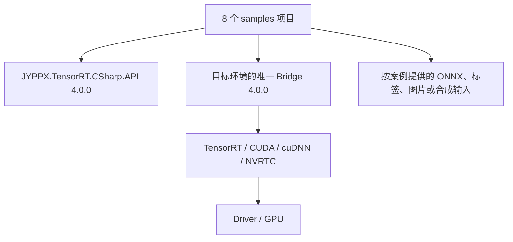

# TensorRT CSharp API v4.0 系列案例总览与学习路线

<!-- public-article-layout:start -->
<style>
.content article { min-width: 0; overflow-wrap: anywhere; }
.content article a, .content article :not(pre) > code { overflow-wrap: anywhere; word-break: break-word; }
.content article pre:not(.mermaid), .content article table { display: block; max-width: 100%; overflow-x: auto; }
.content pre.mermaid { max-width: 640px; margin: 16px auto; overflow-x: auto; }
.content pre.mermaid svg { display: block; width: 100%; max-width: 640px; height: auto; }
</style>
<!-- public-article-layout:end -->

> 文章 ID：`SMP-001`<br>
> 对应版本：`4.0.0`<br>
> 案例数量：8<br>
> 内容状态：`ready`，尚未发布到 CSDN

TensorRT CSharp API v4.0 的 `samples/` 不是一组互不相关的代码片段，而是一条从 CUDA 基础、TensorRT 输入输出、动态 Shape，到 ONNX 构建、Refit、回调、并发和真实图像分类的学习路线。每个案例都保持小而专注，并通过公开的 `JYPPX.TensorRT.CSharp.API 4.0.0` 包构建。

本文先说明 8 个案例各自解决什么问题、需要哪些环境和资产、从哪里运行，以及后续深水文章的稳定 ID。它不会把帮助输出写成 GPU 实测，也不会把某一个真实模型结果外推到全部案例。

## 1. 前言
<!-- public-article-project-preface:start -->
TensorRT CSharp API v4.0 是一个面向 C#/.NET 开发者的 TensorRT 与 CUDA 工程化接口项目。它把 NVIDIA 原生运行时、生成式绑定、C++ Bridge、托管对象模型和可验证的示例程序组织成一条完整链路，使使用者可以在熟悉的 .NET 项目中完成 Engine 构建、反序列化、ExecutionContext 管理、CUDA 内存操作、异步流同步和结果校验。项目的目标不是隐藏 TensorRT 的概念，而是把这些概念转换为有明确生命周期、所有权和错误边界的 C# API。

4.0.0 是一次完整重构后的正式版本。核心接口、Bridge 边界、Runtime 包命名、样例目录和验证方式都以 4.x 设计为准，不能把 3.x 的类型名、旧包名或旧 DLL 目录直接复制到新项目。托管包只提供项目接口和自有 Bridge；TensorRT、CUDA、cuDNN、显卡驱动以及对应许可证仍由使用者按目标平台安装和管理。

单篇文章也应能够独立阅读：读者可以先从项目入口确认源码和包，再根据本文的程序路径准备依赖，最后用输出中的状态、计数、Shape、哈希或结果图片判断流程是否真的完成。对于尚未具备兼容 GPU 的环境，本文会把静态检查、期望输出和真实运行结果分开标记，不把帮助命令或 build-only 结果包装成推理成功。

项目、包和源码入口（以下地址保留明文，便于复制到不完整支持 Markdown 链接的平台）：

项目主页：

```text
https://github.com/guojin-yan/TensorRT-CSharp-API/tree/TensorRtSharp4.0
```

核心 NuGet：

```text
https://www.nuget.org/packages/JYPPX.TensorRT.CSharp.API/4.0.0
```

Runtime Bridge 包列表：

```text
https://www.nuget.org/packages?q=+JYPPX.TensorRT.CSharp&includeComputedFrameworks=true&prerel=true&sortby=relevance
```

运行库清单：

```text
https://github.com/guojin-yan/TensorRT-CSharp-API/blob/TensorRtSharp4.0/pack/runtime/runtime-packages.manifest.json
```

### 1.1 程序出处与输出说明

本文涉及的程序、脚本或命令均以仓库中的实现为准；对应源码入口：

```text
https://github.com/guojin-yan/TensorRT-CSharp-API/tree/TensorRtSharp4.0/samples
```

运行示例必须同时给出程序输出和判定标准。终端中的 `status`、`Ready`、`Bound`、`enqueueCount`、`OutputMatch`、进程退出码、报告文件或结果图片分别说明不同层次的事实；只有明确写出这些结果，读者才能区分程序启动、Engine 构建、GPU enqueue 和业务结果语义。
<!-- public-article-project-preface:end -->

### 1.2 项目简介

TensorRT CSharp API v4.0 是面向 C#/.NET 的 TensorRT 与 CUDA 封装项目。它通过 `JYPPX.TensorRtSharp` 和 `JYPPX.CudaSharp` 提供类型化、可释放、可诊断的 GPU 推理接口；`samples/` 目录则把这些接口拆成可以逐个运行和验证的小案例，帮助开发者从第一条 CUDA 命令逐步走到真实图像分类。

### 1.3 项目链接与包列表

| 项目内容 | 入口 |
| --- | --- |
| 项目源码 | TensorRT-CSharp-API 4.0 分支：<https://github.com/guojin-yan/TensorRT-CSharp-API/tree/TensorRtSharp4.0> |
| Samples 源码 | samples/README.zh-CN.md：<https://github.com/guojin-yan/TensorRT-CSharp-API/blob/TensorRtSharp4.0/samples/README.zh-CN.md> |
| 本文对应案例源码 | 8 个案例目录：<https://github.com/guojin-yan/TensorRT-CSharp-API/tree/TensorRtSharp4.0/samples> |
| 核心 NuGet | JYPPX.TensorRT.CSharp.API 4.0.0：<https://www.nuget.org/packages/JYPPX.TensorRT.CSharp.API/4.0.0> |
| Runtime Bridge | NuGet 包列表：<https://www.nuget.org/packages?q=+JYPPX.TensorRT.CSharp&includeComputedFrameworks=true&prerel=true&sortby=relevance> |

所有案例通过 `JYPPX.TensorRT.CSharp.API 4.0.0` 消费托管接口；真实 GPU 运行时再选择一个与操作系统、TensorRT、CUDA 和 cuDNN 完全匹配的 `*.Bridge 4.0.0` 包。源码、案例和文档不是额外 NuGet 包。

### 1.4 本文结构

先说明统一依赖和证据边界，再给出 8 个案例的学习顺序、帮助命令、真实运行要求、结果展示规则和故障定位入口。需要直接复制代码时，以表格中的 GitHub 案例目录和每篇专题文章中的源码链接为准。

## 2. 开始前的共同边界

所有案例都从仓库根目录执行。项目统一通过 `build/JYPPX.PublicSamplePackages.props` 引用精确版本：

```text
JYPPX.TensorRT.CSharp.API 4.0.0
```

真实运行仍需要一个与目标环境匹配的 Bridge 包和用户安装的 NVIDIA 运行库。仓库示例的包引用、Bridge 选择与厂商依赖之间关系如下：



在阅读运行结果时，至少区分四件事：

| 层级 | 能说明什么 | 不能说明什么 |
| --- | --- | --- |
| `--help` | 项目能还原、编译，参数入口可达 | 没有初始化 GPU，不是 TensorRT 运行结果 |
| 合成网络/合成输入运行 | 指定基础 API 路径在当前机器执行 | 不是外部真实模型或真实图片结果 |
| 真实模型案例 | 模型、输入、输出语义在记录环境中一致 | 不是所有 GPU/模型/版本组合都通过 |
| 干净公开包消费者验证 | 指定公开包在独立项目中恢复并运行 | 只覆盖该记录的环境与路径 |

## 3. 8 个案例一览

| 顺序 | 案例 | 主要目标 | 外部模型 | 真实运行的主要要求 | 后续文章 |
| ---: | --- | --- | --- | --- | --- |
| 1 | `Cuda/01.RuntimeCompilation` | NVRTC 编译、Module、Kernel、显存读写 | 不需要 | NVIDIA GPU、驱动、匹配 CUDA/NVRTC | `SMP-006`：<https://github.com/guojin-yan/TensorRT-CSharp-API/blob/TensorRtSharp4.0/docs/articles/zh-cn/02-samples/smp-006-cuda-runtime-compilation.md> |
| 2 | `Inference/01.Bindings` | 输入输出张量、地址绑定、内存所有权 | 不需要 | GPU、TensorRT、CUDA、Bridge | `SMP-002`：<https://github.com/guojin-yan/TensorRT-CSharp-API/blob/TensorRtSharp4.0/docs/articles/zh-cn/02-samples/smp-002-inference-bindings.md> |
| 3 | `Inference/02.DynamicShapes` | Optimization Profile 和动态 Shape | 不需要 | GPU、TensorRT、CUDA、Bridge | `SMP-003`：<https://github.com/guojin-yan/TensorRT-CSharp-API/blob/TensorRtSharp4.0/docs/articles/zh-cn/02-samples/smp-003-dynamic-shapes.md> |
| 4 | `Inference/03.OnnxBuildAndRun` | ONNX 解析、Engine 构建、单次推理、JSON | 可选 | 合成模式需要 GPU/TensorRT；外部模式另需 ONNX | `SMP-004`：<https://github.com/guojin-yan/TensorRT-CSharp-API/blob/TensorRtSharp4.0/docs/articles/zh-cn/02-samples/smp-004-onnx-build-and-run.md> |
| 5 | `Inference/04.RefittedPlan` | initializer refit、Plan 保存、重载、输出校验 | 可选 | GPU、支持相应 Refit 的 TensorRT；外部模式另需 ONNX | `SMP-005`：<https://github.com/guojin-yan/TensorRT-CSharp-API/blob/TensorRtSharp4.0/docs/articles/zh-cn/02-samples/smp-005-refitted-plan.md> |
| 6 | `Diagnostics/01.CallbackLifecycle` | Logger、Profiler、ProgressMonitor、DebugListener 生命周期 | 不需要 | GPU、TensorRT；部分回调取决于 TRT 10/11 能力 | `SMP-008`：<https://github.com/guojin-yan/TensorRT-CSharp-API/blob/TensorRtSharp4.0/docs/articles/zh-cn/02-samples/smp-008-callback-lifecycle.md> |
| 7 | `Performance/01.MultiStream` | CUDA Stream、Event 和跨流顺序 | 不需要 | GPU、驱动、CUDA、Bridge | `SMP-007`：<https://github.com/guojin-yan/TensorRT-CSharp-API/blob/TensorRtSharp4.0/docs/articles/zh-cn/02-samples/smp-007-cuda-multistream.md> |
| 8 | `ComputerVision/01.Classification` | 图像预处理、ResNet18、Top-K、JSON 和结果图 | 需要 | GPU、TensorRT、OpenCV 路径、ONNX、标签和图片 | `SMP-009`：<https://github.com/guojin-yan/TensorRT-CSharp-API/blob/TensorRtSharp4.0/docs/articles/zh-cn/02-samples/smp-009-resnet18-classification.md> |

这个顺序是学习建议，不是强制依赖关系。如果目标是排查 TensorRT 输入输出，可以从 Bindings 开始；如果目标是视觉应用，仍建议先完成 Bindings 和 DynamicShapes，再进入 Classification。

## 4. 结果展示应该与案例类型一致

系列总览不能用一张图像分类结果代表全部 8 个案例。这里的案例分为非视觉计算、TensorRT 推理、生命周期诊断和视觉任务四类，它们应该展示不同的可验证结果：

| 案例类型 | 合适的结果展示 | 关键判断字段 |
| --- | --- | --- |
| CUDA 与非视觉计算 | 真实终端输出、GPU 读回和进程退出码 | `gpuReadback=True`、`correctness=True`、`ProcessExitCode=0` |
| TensorRT 推理 | Binding/Profile/Shape、执行状态和输出一致性 | `Ready=True`、`Bound=True`、`OutputMatch=True` |
| 生命周期与并发 | 回调事件、跨流顺序、资源释放状态 | `CrossStreamWait=True`、回调计数或 detach 状态 |
| 图像分类 | 真实运行终端与同次任务的可视化结果 | Top-K、参考值校验、`OutputValidated=True`、叠加图 |

下面先给出两种非视觉案例的代表性结果。它们不是装饰性截图，而是可以直接读出环境、输入输出契约和校验结论的真实终端记录。

### 4.1 TensorRT Binding 与 GPU 输出读回


这张图对应 `Inference/01.Bindings`。`Ready=True`、`Bound=True` 和 `OutputMatch=True` 分别证明执行上下文已满足 Enqueue 条件、输入输出地址已绑定、GPU 读回结果与预期一致。

### 4.2 CUDA Stream 与 Event 顺序


这张图对应 `Performance/01.MultiStream`。`IndependentStreams=True` 验证两条 Stream 的独立读回，`CrossStreamWait=True` 验证生产者 Event 与消费者等待顺序，最后以 `ProcessExitCode=0` 结束。

Classification 的终端验证和任务结果放在本文第八节，避免把视觉结果错误地当成整个系列的统一输出形式。

## 5. 先运行 8 个帮助入口

以下命令会实际进入各案例的帮助分支，不应初始化 TensorRT 或 CUDA：

```powershell
dotnet run --project .\samples\Cuda\01.RuntimeCompilation -- --help
dotnet run --project .\samples\Inference\01.Bindings -- --help
dotnet run --project .\samples\Inference\02.DynamicShapes -- --help
dotnet run --project .\samples\Inference\03.OnnxBuildAndRun -- --help
dotnet run --project .\samples\Inference\04.RefittedPlan -- --help
dotnet run --project .\samples\Diagnostics\01.CallbackLifecycle -- --help
dotnet run --project .\samples\Performance\01.MultiStream -- --help
dotnet run --project .\samples\ComputerVision\01.Classification -- --help
```

第一次执行仍可能需要从 NuGet.org 还原 `4.0.0`，因此“帮助不需要 GPU”和“帮助完全不需要网络/包缓存”不是同一个概念。已经还原并构建后，帮助分支本身不依赖模型、GPU 或 NVIDIA DLL。

如果帮助命令失败，先处理 .NET SDK、NuGet 源或编译问题；不要立刻更换 CUDA。帮助成功而真实运行失败时，再进入 Bridge、厂商运行库、GPU 和资产排查。

## 6. 第一阶段：CUDA 与 TensorRT 基础

### 6.1 `Cuda/01.RuntimeCompilation`：先看一次完整 CUDA 数据流

这个案例把 CUDA C 源码交给 NVRTC，得到 PTX，加载 Module，取得 Kernel，分配设备内存，启动计算并把结果读回主机。

为什么把它放在第一篇：它不依赖 ONNX 或 TensorRT Network，可以先理解“托管对象如何持有原生资源、数据如何进出 GPU、Stream 如何参与执行”。

真实运行需要：

- NVIDIA GPU 和可用驱动；
- 与目标 Bridge 组合匹配的 CUDA 运行库；
- NVRTC 动态库；
- 不需要外部模型、标签或图片。

帮助入口：

```powershell
dotnet run --project .\samples\Cuda\01.RuntimeCompilation -- --help
```

完整的源码字符串、编译日志、PTX/CUBIN/LTO IR、Runtime/Driver 两条 Kernel 路径、GPU 读回和错误处理见 `SMP-006`：在 C# 中动态编译并运行 CUDA Kernel：<https://github.com/guojin-yan/TensorRT-CSharp-API/blob/TensorRtSharp4.0/docs/articles/zh-cn/02-samples/smp-006-cuda-runtime-compilation.md>，案例参数以 README：<https://github.com/guojin-yan/TensorRT-CSharp-API/blob/TensorRtSharp4.0/samples/Cuda/01.RuntimeCompilation/README.zh-CN.md> 为准。

### 6.2 `Inference/01.Bindings`：掌握 TensorRT 最小执行闭环

Bindings 案例使用确定性网络说明：如何识别输入输出、计算缓冲区大小、分配主机/设备内存、把地址绑定到 ExecutionContext，以及在执行后读回并校验结果。

它是后续所有推理文章的基础。模型可能不同，但“张量名称、Shape、数据类型、内存大小和地址必须一致”这一约束不会消失。

真实运行需要 GPU、TensorRT、CUDA 和唯一匹配 Bridge，不需要外部 ONNX。帮助入口：

```powershell
dotnet run --project .\samples\Inference\01.Bindings -- --help
```

完整步骤、核心代码和真实运行结果见 `SMP-002`：推理输入、显存绑定与 GPU 输出读回：<https://github.com/guojin-yan/TensorRT-CSharp-API/blob/TensorRtSharp4.0/docs/articles/zh-cn/02-samples/smp-002-inference-bindings.md>，案例参数以 README：<https://github.com/guojin-yan/TensorRT-CSharp-API/blob/TensorRtSharp4.0/samples/Inference/01.Bindings/README.zh-CN.md> 为准。

### 6.3 `Inference/02.DynamicShapes`：从静态 Shape 进入 Profile

动态输入不是在运行时随意改数组长度。Builder 阶段需要为输入建立 Optimization Profile，给出 `min/opt/max`；运行时 Shape 必须位于范围内，并在执行前完成地址和 Shape 绑定。

真实运行仍使用项目内确定性网络，不需要外部模型。帮助入口：

```powershell
dotnet run --project .\samples\Inference\02.DynamicShapes -- --help
```

完整步骤、Profile 规则和真实运行结果见 `SMP-003`：Dynamic Shape 与动态 Batch 推理：<https://github.com/guojin-yan/TensorRT-CSharp-API/blob/TensorRtSharp4.0/docs/articles/zh-cn/02-samples/smp-003-dynamic-shapes.md>，案例参数以 README：<https://github.com/guojin-yan/TensorRT-CSharp-API/blob/TensorRtSharp4.0/samples/Inference/02.DynamicShapes/README.zh-CN.md> 为准。

## 7. 第二阶段：从 ONNX 到可复用 Engine

### 7.1 `Inference/03.OnnxBuildAndRun`：把构建和运行放进一个最小程序

该案例覆盖 ONNX Parser、Builder 配置、Engine 序列化、ExecutionContext、输入生成/加载、单次推理和结构化 JSON。它既可以使用案例支持的合成路径，也可以接受外部 ONNX。

帮助入口：

```powershell
dotnet run --project .\samples\Inference\03.OnnxBuildAndRun -- --help
```

需要外部 ONNX 时，必须同时记录：

- 上游项目与模型 URL；
- 固定版本或提交、许可证；
- 导出工具、版本、opset 和完整转换命令；
- 输入输出名称、Shape、布局和数据类型；
- ONNX SHA256 与输出语义检查方式。

完整的 synthetic/external 双路径、核心代码和本次真实 JSON 结果见 `SMP-004`：从 ONNX 到 TensorRT Engine：<https://github.com/guojin-yan/TensorRT-CSharp-API/blob/TensorRtSharp4.0/docs/articles/zh-cn/02-samples/smp-004-onnx-build-and-run.md>，案例参数以 README：<https://github.com/guojin-yan/TensorRT-CSharp-API/blob/TensorRtSharp4.0/samples/Inference/03.OnnxBuildAndRun/README.zh-CN.md> 为准。

### 7.2 `Inference/04.RefittedPlan`：理解“结构复用”和“权重更新”的边界

Refit 不是任意修改一个已经生成的 Engine。构建时需要保留可 refit 信息，更新项必须与可 refit 权重名称、角色、Shape 和类型一致。案例还覆盖 Plan 持久化、从磁盘重载和输出验证。

帮助入口：

```powershell
dotnet run --project .\samples\Inference\04.RefittedPlan -- --help
```

完整的 baseline 构建、ONNX initializer 更新、Plan 持久化、磁盘重载和前后输出校验见 `SMP-005`：TensorRT Refitted Plan 实战：<https://github.com/guojin-yan/TensorRT-CSharp-API/blob/TensorRtSharp4.0/docs/articles/zh-cn/02-samples/smp-005-refitted-plan.md>。不要用“文件成功写出”代替“重载后输出语义正确”；参数以 案例 README：<https://github.com/guojin-yan/TensorRT-CSharp-API/blob/TensorRtSharp4.0/samples/Inference/04.RefittedPlan/README.zh-CN.md> 为准。

## 8. 第三阶段：生命周期与并发

### 8.1 `Diagnostics/01.CallbackLifecycle`：回调对象为什么必须显式管理

Logger、Profiler、ProgressMonitor 和 DebugListener 都跨越托管/原生边界。回调不仅是一个委托，还涉及原生对象是否保存指针、托管对象是否被 GC、异常能否穿越 ABI，以及释放前是否已经解除注册。

帮助入口：

```powershell
dotnet run --project .\samples\Diagnostics\01.CallbackLifecycle -- --help
```

四类回调的 owner、真实调用、复制元数据、no-throw 规则和 detach 顺序见 `SMP-008`：TensorRT Callback 生命周期：<https://github.com/guojin-yan/TensorRT-CSharp-API/blob/TensorRtSharp4.0/docs/articles/zh-cn/02-samples/smp-008-callback-lifecycle.md>。部分能力与 TensorRT 10/11 接口有关；参数和版本条件以 案例 README：<https://github.com/guojin-yan/TensorRT-CSharp-API/blob/TensorRtSharp4.0/samples/Diagnostics/01.CallbackLifecycle/README.zh-CN.md> 为准。

### 8.2 `Performance/01.MultiStream`：并发从正确同步开始

多 Stream 不等于自动提速。案例先用 Event 建立可观察的跨流顺序，再比较串行与多流路径。正确性包括：写入完成后再消费、Event 记录在正确 Stream、主机读回前完成同步，以及资源释放不早于异步工作。

帮助入口：

```powershell
dotnet run --project .\samples\Performance\01.MultiStream -- --help
```

两条独立 Stream、跨流 Event 等待、真实 GPU 读回和与 TensorRT 推理的关系见 `SMP-007`：CUDA 多流与 Event 同步：<https://github.com/guojin-yan/TensorRT-CSharp-API/blob/TensorRtSharp4.0/docs/articles/zh-cn/02-samples/smp-007-cuda-multistream.md>，案例说明见 README：<https://github.com/guojin-yan/TensorRT-CSharp-API/blob/TensorRtSharp4.0/samples/Performance/01.MultiStream/README.zh-CN.md>。单次运行不应写成通用性能结论，实际收益取决于工作负载、传输和同步方式。

## 9. 第四阶段：真实图像分类

### 9.1 `ComputerVision/01.Classification`：把模型契约延伸到用户可见结果

Classification 把前面的内存、Shape、Engine 和输出校验串成一个图像任务：读取图片、resize/crop、颜色转换、归一化、NCHW 排列、TensorRT 推理、Top-K、JSON 报告和结果图。

视觉任务不能只放一张经过叠加的结果图。先看同次公开包消费者验证的终端记录：它明确给出 `ProjectReference=False`、Bridge 版本、输入输出 Shape、Top-K、1000 个概率和原始 logits 的独立参考比较，以及受控负例是否按预期失败。


这里不再把原有的狗图片叠加图作为“分类正确”的展示。Wikimedia 原图说明写的是“可能为 Shih Tzu / Maltese 混种”，而 ResNet18 的本次 Top-1 是 `Tibetan terrier`，概率仅为 `0.309864`；与原图说明接近的 `Shih-Tzu` 位于第 4，概率为 `0.119756`。这说明模型对相近长毛小型犬种存在明显不确定性，不能把 Top-1 当作真实犬种标签。

类别表本身没有错位：`imagenet1k.names` 直接由 torchvision `ResNet18_Weights.DEFAULT.meta["categories"]` 生成，共 1000 项；本次涉及的索引 155、194、200、204、266 分别对应 `Shih-Tzu`、`Dandie Dinmont`、`Tibetan terrier`、`Lhasa`、`miniature poodle`。TensorRT 与 ONNX Runtime 的 1000 个概率和原始 logits 也全部通过数值比较。因此这条记录证明的是 **TensorRT CSharp API v4.0 与独立参考执行一致**，不是证明 ResNet18 对该图片的犬种判断正确。

总览只保留终端验证图。原始叠加图及其语义偏差分析放在 Classification 专项文章中，避免把模型误判当成整个案例系列的视觉成果。

帮助入口：

```powershell
dotnet run --project .\samples\ComputerVision\01.Classification -- --help
```

真实运行至少需要：

- 按文章固定来源取得并转换的 ResNet18 ONNX；
- 与模型输出顺序一致的 ImageNet 标签；
- 许可允许在文章中展示的输入图片；
- 正确的 `NCHW 1x3x224x224`、RGB/BGR、scale、mean/std；
- GPU、TensorRT、CUDA、cuDNN、Bridge，以及项目规定的图像解码路径。

模型获取、转换、预处理、独立参考、结果图片和语义边界见 `SMP-009`：在 C# 中运行 ResNet18 图像分类：<https://github.com/guojin-yan/TensorRT-CSharp-API/blob/TensorRtSharp4.0/docs/articles/zh-cn/02-samples/smp-009-resnet18-classification.md>，案例参数见 README：<https://github.com/guojin-yan/TensorRT-CSharp-API/blob/TensorRtSharp4.0/samples/ComputerVision/01.Classification/README.zh-CN.md>。

## 10. 如何选择自己的起点

| 目标 | 建议路线 |
| --- | --- |
| 先验证 CUDA/.NET 原生边界 | RuntimeCompilation → MultiStream |
| 加载已有 Engine 做推理 | Bindings → DynamicShapes → 业务 Engine |
| 从 ONNX 构建 Engine | Bindings → DynamicShapes → OnnxBuildAndRun |
| 更新已有网络权重 | Bindings → OnnxBuildAndRun → RefittedPlan |
| 开发诊断和可观察性 | Bindings → CallbackLifecycle |
| 开发视觉模型应用 | Bindings → DynamicShapes → OnnxBuildAndRun → Classification → YoloVision |

完整应用不是第 9 个小案例，而是独立工作流：

- YoloVision README：<https://github.com/guojin-yan/TensorRT-CSharp-API/blob/TensorRtSharp4.0/applications/YoloVision/README.zh-CN.md>
- OnnxToEngine README：<https://github.com/guojin-yan/TensorRT-CSharp-API/blob/TensorRtSharp4.0/applications/OnnxToEngine/README.zh-CN.md>
- TensorRtExec README：<https://github.com/guojin-yan/TensorRT-CSharp-API/blob/TensorRtSharp4.0/applications/TensorRtExec/README.md>

## 11. 运行失败时先看哪一层

### 11.1 帮助入口就失败

检查 .NET SDK、NuGet.org 可访问性、`4.0.0` 包恢复和编译错误。此阶段通常还没有进入 GPU/模型问题。

### 11.2 第一次原生调用失败

检查唯一 Bridge、RID、进程架构、TensorRT/CUDA/cuDNN/NVRTC 动态库和驱动。Windows 使用 `MSC-003`：<https://github.com/guojin-yan/TensorRT-CSharp-API/blob/TensorRtSharp4.0/docs/articles/zh-cn/05-installation/windows/msc-003-windows-installation.md>，包选择使用 `MSC-004`：<https://github.com/guojin-yan/TensorRT-CSharp-API/blob/TensorRtSharp4.0/docs/articles/zh-cn/05-installation/packages/msc-004-managed-and-bridge-package-selection.md>。

### 11.3 Engine 或 ONNX 构建失败

保存 Parser/Builder 完整日志，检查 opset、动态维度、Plugin、精度标志和 Workspace 配置。构建失败不是输入图片问题。

### 11.4 推理运行但输出错误

逐项比对张量名称、Shape、类型、布局、颜色顺序、归一化、输出解码和标签顺序。能执行到结束只说明调用链没有抛出异常，不说明输出语义正确。

### 11.5 结果图不正确

先核对结构化输出，再检查坐标缩放、letterbox/crop 逆变换、类别映射和绘图。原图、模型输出和渲染结果应使用哈希或稳定记录建立对应关系。

## 12. 文章和资产规则

`SMP-002` 至 `SMP-009` 八篇案例专题均遵循同一结构：

1. 说明案例目标、受众和依赖职责。
2. 给出从仓库根目录可执行的帮助与真实运行命令。
3. 模型案例记录 URL、固定版本、许可证、转换命令、契约和 SHA256。
4. 展示真实终端或软件页面；视觉任务同时展示叠加任务结果的图片。
5. 区分帮助、预检查、构建、合成输入、真实模型和公开包消费者结果。
6. 记录失败条件和环境边界，不把单机结果写成全矩阵结论。

模型和测试图片原则上放在仓库同级的 `models` 工作区，不进入 Git、核心 NuGet 或 Bridge 包。只有许可证和再分发条件清楚的图片才能进入公开文章资产。

## 13. 相关入口

- `REL-001：TensorRT CSharp API v4.0 4.0.0 正式发布`：<https://github.com/guojin-yan/TensorRT-CSharp-API/blob/TensorRtSharp4.0/docs/articles/zh-cn/01-release/2026/2026-08-10-tensorrtsharp-4.0.0.md>
- Samples 中文 README：<https://github.com/guojin-yan/TensorRT-CSharp-API/blob/TensorRtSharp4.0/samples/README.zh-CN.md>
- 历史系列案例学习路线：<https://github.com/guojin-yan/TensorRT-CSharp-API/blob/TensorRtSharp4.0/docs/articles/zh-cn/sample-series-overview.md>
- 模型获取与 ONNX 转换：<https://github.com/guojin-yan/TensorRT-CSharp-API/blob/TensorRtSharp4.0/docs/articles/zh-cn/demo-model-acquisition-and-onnx-conversion.md>
- 完整应用模块：<https://github.com/guojin-yan/TensorRT-CSharp-API/blob/TensorRtSharp4.0/docs/articles/zh-cn/03-applications/README.md>

## 14. 结语

最有效的学习方式不是直接把大型模型塞进应用，而是逐层建立确定性：先能显示帮助，再跑无外部资产的 CUDA/TensorRT 最小路径，然后进入 ONNX、Refit、回调和并发，最后才处理图像预处理与输出语义。8 个案例正是按这个思路划分；遇到问题时，也可以沿同一顺序向下定位。

<!-- public-article-declaration:start -->
## 15. 文章声明

### 15.1 开源协议声明
作者所有开源项目代码均遵循 Apache License 2.0 开源协议。
特别说明：本项目集成了若干第三方库。若任何第三方库的许可协议与 Apache 2.0 协议存在冲突或不一致，均以该第三方库的原始许可协议为准。本项目不包含也不代表这些第三方库的授权声明，使用前请务必阅读并遵守第三方库的相关许可。

### 15.2 代码开发与质量说明
AI 辅助开发：本代码在开发过程中使用了人工智能（AI）辅助生成与优化，并非完全由人工逐行编写。
安全性承诺：作者郑重声明，本代码中绝无任何有意设置的后门、病毒、木马或旨在破坏用户设备、窃取数据的恶意代码。
技术局限性：受限于作者个人的技术水平与能力，代码中可能存在因逻辑不严谨、优化不足或经验欠缺导致的低级问题（例如但不限于内存泄漏、偶发崩溃、资源未释放等）。这些问题纯属能力不足所致，并非主观故意。
测试范围：由于作者精力有限，未对本软件进行全方位、覆盖所有边缘场景的完整测试。

### 15.3 免责声明（重要）
请在将本代码应用于任何实际项目（特别是商业、工业或关键任务环境）之前，务必进行详尽、严格的自行测试与验证。 鉴于上述可能存在的代码缺陷及测试覆盖不足，因使用本代码而导致的任何直接或间接损失（包括但不限于设备故障、数据丢失、系统瘫痪或利润损失等），本作者概不负责。 一旦您开始使用本代码，即表示您已知晓上述风险并同意自行承担一切后果，相关问题与本作者无关。

### 15.4 代码开源范围
本项目承诺核心逻辑代码完全开源，但上述提到的“第三方库”的二进制文件、源代码或相关资源不在本项目的开源义务范围内，请根据其各自的指引获取。

### 15.5 社区与反馈
尽管存在上述不足，我们仍欢迎大家下载使用、提交 Issue 或参与测试，共同完善项目。如果您在使用过程中发现 Bug、内存溢出或有改进建议，欢迎通过项目主页提供的联系方式与作者取得联系，我们将尽力在有限的时间内提供协助。


<!-- public-article-declaration:end -->
