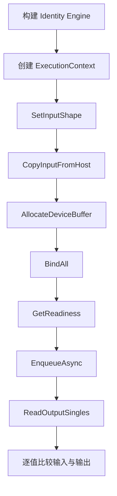
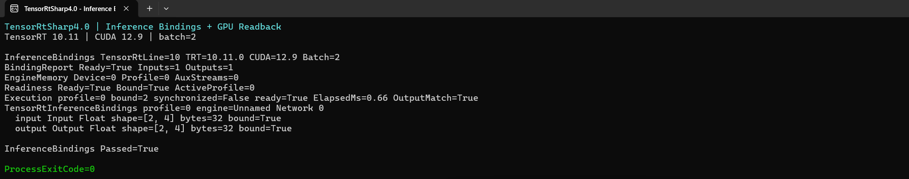

# 使用 TensorRT CSharp API v4.0 管理推理输入、显存绑定与 GPU 输出读回

<!-- public-article-layout:start -->
<style>
.content article { min-width: 0; overflow-wrap: anywhere; }
.content article a, .content article :not(pre) > code { overflow-wrap: anywhere; word-break: break-word; }
.content article pre:not(.mermaid), .content article table { display: block; max-width: 100%; overflow-x: auto; }
.content pre.mermaid { max-width: 640px; margin: 16px auto; overflow-x: auto; }
.content pre.mermaid svg { display: block; width: 100%; max-width: 640px; height: auto; }
</style>
<!-- public-article-layout:end -->

TensorRT Engine 创建成功，只代表模型已经可以被加载。真正执行推理时，还需要设置输入 shape、准备 host 数据、分配 device buffer、绑定 tensor address、检查 execution context 状态、提交 CUDA stream，最后把输出安全地读回 CPU。这里任何一步不完整，enqueue 都可能失败。

TensorRT CSharp API v4.0 的 `InferenceBindings` 示例把这些操作收敛到 `TensorRtInferenceBindings`，并通过一个动态 batch 的 Identity 网络完成真实 GPU 执行。本文从环境准备开始，逐步走完网络构建、输入输出绑定、执行、读回和逐值校验。

> 本文是 TensorRT CSharp API v4.0 4.0.0 Samples 系列的 `SMP-002`，对应源码 `samples/Inference/01.Bindings`。文中的 API、包版本、命令和结果均以 `4.0.0` 为基线。

## 1. 前言
<!-- public-article-project-preface:start -->
TensorRT CSharp API v4.0 是一个面向 C#/.NET 开发者的 TensorRT 与 CUDA 工程化接口项目。它把 NVIDIA 原生运行时、生成式绑定、C++ Bridge、托管对象模型和可验证的示例程序组织成一条完整链路，使使用者可以在熟悉的 .NET 项目中完成 Engine 构建、反序列化、ExecutionContext 管理、CUDA 内存操作、异步流同步和结果校验。项目的目标不是隐藏 TensorRT 的概念，而是把这些概念转换为有明确生命周期、所有权和错误边界的 C# API。

4.0.0 是一次完整重构后的正式版本。核心接口、Bridge 边界、Runtime 包命名、样例目录和验证方式都以 4.x 设计为准，不能把 3.x 的类型名、旧包名或旧 DLL 目录直接复制到新项目。托管包只提供项目接口和自有 Bridge；TensorRT、CUDA、cuDNN、显卡驱动以及对应许可证仍由使用者按目标平台安装和管理。

单篇文章也应能够独立阅读：读者可以先从项目入口确认源码和包，再根据本文的程序路径准备依赖，最后用输出中的状态、计数、Shape、哈希或结果图片判断流程是否真的完成。对于尚未具备兼容 GPU 的环境，本文会把静态检查、期望输出和真实运行结果分开标记，不把帮助命令或 build-only 结果包装成推理成功。

项目、包和源码入口（以下地址保留明文，便于复制到不完整支持 Markdown 链接的平台）：

项目主页：

```text
https://github.com/guojin-yan/TensorRT-CSharp-API/tree/TensorRtSharp4.0
```

核心 NuGet：

```text
https://www.nuget.org/packages/JYPPX.TensorRT.CSharp.API/4.0.0
```

Runtime Bridge 包列表：

```text
https://www.nuget.org/packages?q=+JYPPX.TensorRT.CSharp&includeComputedFrameworks=true&prerel=true&sortby=relevance
```

运行库清单：

```text
https://github.com/guojin-yan/TensorRT-CSharp-API/blob/TensorRtSharp4.0/pack/runtime/runtime-packages.manifest.json
```

### 1.1 程序出处与输出说明

本文涉及的程序、脚本或命令均以仓库中的实现为准；对应源码入口：

```text
https://github.com/guojin-yan/TensorRT-CSharp-API/tree/TensorRtSharp4.0/samples
```

运行示例必须同时给出程序输出和判定标准。终端中的 `status`、`Ready`、`Bound`、`enqueueCount`、`OutputMatch`、进程退出码、报告文件或结果图片分别说明不同层次的事实；只有明确写出这些结果，读者才能区分程序启动、Engine 构建、GPU enqueue 和业务结果语义。
<!-- public-article-project-preface:end -->

### 1.2 项目简介

TensorRT CSharp API v4.0 面向希望在 C#/.NET 中直接使用 NVIDIA TensorRT 和 CUDA 的开发者。项目把 native handle、资源释放、TensorRT Engine 生命周期、CUDA Stream 和输入输出 tensor 绑定统一到托管 API，让业务代码可以专注模型输入、推理调度与输出处理。

### 1.3 项目链接与包列表

| 项目内容 | 入口 |
| --- | --- |
| 项目源码 | TensorRT-CSharp-API 4.0 分支：<https://github.com/guojin-yan/TensorRT-CSharp-API/tree/TensorRtSharp4.0> |
| 本文案例源码 | samples/Inference/01.Bindings：<https://github.com/guojin-yan/TensorRT-CSharp-API/tree/TensorRtSharp4.0/samples/Inference/01.Bindings> |
| 案例入口代码 | Program.cs：<https://github.com/guojin-yan/TensorRT-CSharp-API/blob/TensorRtSharp4.0/samples/Inference/01.Bindings/Program.cs> |
| 核心 NuGet | JYPPX.TensorRT.CSharp.API 4.0.0：<https://www.nuget.org/packages/JYPPX.TensorRT.CSharp.API/4.0.0> |
| Runtime Bridge | NuGet 包列表：<https://www.nuget.org/packages?q=+JYPPX.TensorRT.CSharp&includeComputedFrameworks=true&prerel=true&sortby=relevance> |

本文只使用 Identity 网络验证 API 调用顺序，不需要模型下载；真正运行仍需一个匹配目标 ABI 的 `*.Bridge 4.0.0` 和用户安装的 TensorRT/CUDA/cuDNN/NVRTC。

### 1.4 本文结构

按“环境准备 → 网络构建 → Profile → Engine/Context → 输入输出绑定 → enqueue → 读回校验 → 排障”的顺序展开。代码片段用于说明核心接口，完整可运行代码始终以 GitHub `Program.cs` 为准。

## 2. 适用读者

本文适合已经能编译 C# 项目，希望掌握 TensorRT ExecutionContext 实际推理流程的开发者。它也适合准备接入分类、检测、分割或自定义 ONNX 模型，但不想在业务代码中长期保存裸 `IntPtr` 的维护者。

## 3. 本文使用的项目与库

| 组件 | 本文中的职责 |
| --- | --- |
| TensorRT CSharp API v4.0 | 示例所在项目，提供 TensorRT/CUDA 的 owner-safe C# API。 |
| `JYPPX.TensorRtSharp` | 创建 network、engine、execution context 和推理绑定。 |
| `JYPPX.CudaSharp` | 创建 CUDA stream，并测量 GPU 执行耗时。 |
| `JYPPX.SampleSupport` | 解析参数、探测环境并选择 TensorRT adapter line。 |
| NVIDIA TensorRT | 构建并执行 Identity Engine。 |
| .NET | 编译并运行 C# 示例。 |

示例项目通过仓库统一配置消费稳定版 `JYPPX.TensorRT.CSharp.API` `4.0.0`，自身设置为 `IsPackable=false`。运行时仍需选择与目标机器匹配的 Bridge 包或本地 Bridge 产物；Bridge 不携带 NVIDIA TensorRT、CUDA、cuDNN 或 NVRTC。

本文实测环境为 Windows 11、NVIDIA GeForce RTX 3060 Laptop GPU、驱动 576.02、CUDA 12.9、TensorRT 10.11.0.33 和 .NET SDK 10.0.301。CUDA、cuDNN、TensorRT 和 NVRTC 均由用户自行安装，仓库及后续发布物不携带 NVIDIA 运行库。

## 4. 模型获取与 ONNX 转换

这个示例**没有使用深度学习模型，也不需要 ONNX 文件**。它在 C# 内存中创建一个 Identity 网络，输入值经过 GPU 后原样输出。因此没有权重下载、模型许可证、ONNX 转换步骤，也不会向外层 `models` 目录写入模型。

选择 Identity 网络是为了单独验证推理绑定和显存生命周期。替换为真实模型时，只需要把内存网络构建部分换成 ONNX Parser 或已生成的 Engine，后面的 binding、readiness、enqueue 和 readback 流程仍可复用。

## 5. 环境准备

先安装 .NET SDK：<https://dotnet.microsoft.com/download/dotnet>、CUDA Toolkit：<https://developer.nvidia.com/cuda-downloads> 和 TensorRT：<https://developer.nvidia.com/tensorrt/download>，并按目标 TensorRT/CUDA 组合编译桥接库。

进入仓库根目录后设置运行环境。命令使用变量和仓库相对路径，不依赖某台机器的盘符：

```powershell
$RepoRoot = (Get-Location).Path
$env:TENSORRT_PATH = '<你的 TensorRT 安装目录>'
$env:JYPPX_TENSORRT_ROOT = $env:TENSORRT_PATH
$env:JYPPX_NATIVE_BRIDGE_PATH = Join-Path $RepoRoot 'build-out\win-x64-trt10-cuda12-release\bin\Release\jyppxtrtbridge.dll'
$env:JYPPX_ENABLE_DEVELOPMENT_PROBING = 'true'
```

如果使用其他版本组合，应把桥接库目录替换为对应构建产物，不能用 TRT10/CUDA12 的桥接库冒充其他 ABI 组合。

## 6. 示例网络与数据

示例源文件位于 `samples/Inference/01.Bindings/Program.cs`。网络只有一个 Identity layer：

```text
input [-1, 4] -> Identity -> output [-1, 4]
```

第一维为动态 batch，Optimization Profile 范围如下：

| Profile 位置 | Shape |
| --- | --- |
| min | `[1, 4]` |
| opt | `[2, 4]` |
| max | `[4, 4]` |

本文使用 batch 2，所以运行时输入 shape 为 `[2, 4]`。输入包含 8 个 `float`，每个值按 `index + 1.25f` 生成，输入和输出 device buffer 都是 32 字节。



## 7. 一步步实现推理

### 7.1 创建 Runtime、Builder 和 CUDA Stream

```csharp
using TensorRtLogger logger = new TensorRtLogger(line);
using TensorRtRuntime runtime = new TensorRtRuntime(logger);
using TensorRtBuilder builder = new TensorRtBuilder(logger);
using TensorRtBuilderConfig config = builder.CreateBuilderConfig();
using CudaStream stream = new CudaStream();
```

`using` 明确了资源释放顺序。CUDA stream 在所有依赖它的 TensorRT 操作完成后才会释放。

### 7.2 创建网络并声明输出

```csharp
using TensorRtNetworkDefinition network =
    builder.CreateNetwork(TensorRtNetworkDefinitionCreationFlags.ExplicitBatch);

using TensorRtTensor inputTensor = network.AddInput(
    "input",
    TensorRtDataType.Float,
    new TensorRtDims(new[] { -1, 4 }));

using TensorRtLayer identity = network.AddIdentity(inputTensor);
using TensorRtTensor outputTensor = identity.GetOutput(0);
outputTensor.Name = "output";
network.MarkOutput(outputTensor);
```

### 7.3 配置 Optimization Profile

```csharp
using TensorRtOptimizationProfile profile = builder.CreateOptimizationProfile();
profile.SetShape(
    "input",
    new TensorRtDims(new[] { 1, 4 }),
    new TensorRtDims(new[] { 2, 4 }),
    new TensorRtDims(new[] { 4, 4 }));
int profileIndex = config.AddOptimizationProfile(profile);
```

Runtime batch 必须落在 `[1, 4]` 内。真实模型有多个动态输入时，每个输入都要在同一个 profile 中给出合法范围。

### 7.4 构建 Engine 和 ExecutionContext

```csharp
using TensorRtHostMemory hostMemory =
    builder.BuildSerializedNetwork(network, config);
using TensorRtEngine engine = runtime.Deserialize(hostMemory);
using TensorRtExecutionContext context = engine.CreateExecutionContext();
```

`TensorRtHostMemory`、`TensorRtEngine` 和 `TensorRtExecutionContext` 都是有所有权的对象，离开作用域时按逆序释放。

### 7.5 设置输入并分配输出显存

```csharp
TensorRtDims runtimeShape = new(new[] { batch, 4 });
float[] inputValues = Enumerable.Range(0, batch * 4)
    .Select(index => index + 1.25f)
    .ToArray();

using TensorRtInferenceBindings bindings =
    new TensorRtInferenceBindings(engine, context, profileIndex);

bindings.SetInputShape("input", runtimeShape)
        .CopyInputFromHost("input", inputValues, runtimeShape);
bindings.AllocateDeviceBuffer("output", runtimeShape);
bindings.BindAll();
```

`CopyInputFromHost` 负责输入 buffer 与 host-to-device 复制，`AllocateDeviceBuffer` 根据输出 shape 分配显存，`BindAll` 将这些 buffer 地址写入 ExecutionContext。

### 7.6 在 Enqueue 前检查状态

```csharp
TensorRtExecutionContextReadiness readiness =
    bindings.GetReadiness(runShapeInference: true);

if (!readiness.IsReadyForEnqueue)
{
    throw new InvalidOperationException(
        "Inference bindings are not ready: " + readiness);
}
```

这里同时检查动态 shape、active profile 和 tensor address。比起直接调用 enqueue，先读取 readiness 能给出更明确的故障位置。

### 7.7 执行、读回并比较

```csharp
TensorRtInferenceExecutionSummary executionSummary = null!;
float elapsedMilliseconds = stream.MeasureElapsedTime(cudaStream =>
{
    executionSummary = bindings.EnqueueAsync(
        cudaStream,
        synchronize: false,
        runShapeInference: false);
});

float[] outputValues = bindings.ReadOutputSingles("output", inputValues.Length);
if (!inputValues.SequenceEqual(outputValues))
{
    throw new InvalidOperationException("Inference binding output mismatch.");
}
```

Identity 网络应逐值返回输入。示例还调用 `ReadOutputBytes`，确认完整原始缓冲区与 FP32 输出的位模式一致；`OutputMatch=True` 因而验证了 host-to-device、tensor binding、GPU enqueue、typed readback、raw readback 和输出长度这条完整路径。

### 7.8 正确处理 FP16、整数和布尔输出

`CopyInputFromHost(string, float[], ...)` 与 `ReadOutputSingles` 是明确的 FP32 通道。它们会检查 engine binding 的 `DataType`；如果把 Half、BFloat16、整数或布尔 tensor 误当作 FP32，API 会直接拒绝，而不是把相同的内存位模式静默解释成错误数值。

非 FP32 输出应先读取完整原始缓冲区，再按照 binding metadata 解码：

```csharp
TensorRtInferenceBuffer outputBuffer = bindings.Buffers["output"];
byte[] rawOutput = bindings.ReadOutputBytes("output");

Console.WriteLine(
    $"Type={outputBuffer.Tensor.DataType} " +
    $"Format={outputBuffer.Tensor.Format} " +
    $"Bytes={rawOutput.Length}");
```

`ReadOutputBytes` 使用 `TensorRtInferenceBuffer.SizeInBytes` 读取完整绑定，不猜测元素类型。调用方必须结合 `DataType`、`EffectiveBytesPerComponent`、`EffectiveComponentsPerElement`、`Format` 和 `VectorizedDimension` 解码；对于打包或向量化格式，不能只按逻辑 shape 乘标量大小。非 FP32 输入可继续使用 `CopyInputFromHost(string, byte[], ...)` 写入已经按相同 metadata 编码的字节。

## 8. 编译并运行

从仓库根目录编译 Release 示例：

```powershell
dotnet build .\samples\Inference\01.Bindings\InferenceBindings.csproj `
  -c Release `
  --no-restore `
  /p:UseSharedCompilation=false
```

运行 TensorRT 10、batch 2：

```powershell
dotnet .\samples\Inference\01.Bindings\bin\Release\net8.0\InferenceBindings.dll `
  --tensor-rt-line 10 `
  --batch 2
```

| 参数 | 含义 |
| --- | --- |
| `--tensor-rt-line <8|10|11>` | 选择 TensorRT adapter line；本文使用 10。 |
| `--batch <1..4>` | 设置 profile 范围内的运行时 batch；本文使用 2。 |

## 9. 真实运行结果

下面是上述 Release 命令的真实 Windows Terminal 运行窗口。图片只裁掉了输出结束后的空白区域，没有重绘或改写终端内容；终端截图来自本次真实运行的 stdout。



对应的完整输出为：

```text
InferenceBindings TensorRtLine=10 TRT=10.11.0 CUDA=12.9 Batch=2
BindingReport Ready=True Inputs=1 Outputs=1
EngineMemory Device=0 Profile=0 AuxStreams=0
Readiness Ready=True Bound=True ActiveProfile=0
Execution profile=0 bound=2 synchronized=False ready=True ElapsedMs=0.66 OutputMatch=True
TensorRtInferenceBindings profile=0 engine=Unnamed Network 0
  input Input Float shape=[2, 4] bytes=32 bound=True
  output Output Float shape=[2, 4] bytes=32 bound=True

InferenceBindings Passed=True
ProcessExitCode=0
```

| 检查项 | 实测结果 | 说明 |
| --- | --- | --- |
| Binding report | `Ready=True` | 1 个输入和 1 个输出均已登记。 |
| ExecutionContext | `Ready=True Bound=True` | shape 与所有 tensor address 已满足执行条件。 |
| 输入 buffer | `[2, 4]` / 32 bytes | 8 个 float 已复制到 device。 |
| 输出 buffer | `[2, 4]` / 32 bytes | 输出 shape 与输入一致。 |
| GPU 输出校验 | `OutputMatch=True` | 8 个值逐值匹配。 |
| GPU 计时 | `0.66 ms` | 仅记录本次运行，不作为跨机器性能基准。 |
| 进程状态 | `ProcessExitCode=0` | 示例正常退出。 |

机器可读证据位于 `samples/assets/inference-bindings-article-runtime-evidence.json`。其中保存了源文件、程序集、桥接库、原始日志和截图 SHA256，测试会重新计算仓库内源文件与截图哈希。

2026-08-04 将共享类型迁入 `JYPPX.TensorRtSharp.Shared` 命名空间并补充字节读回 API 后，本文命令再次在同一 TensorRT 10.11 / CUDA 12.9 环境执行，结果为 `ProcessExitCode=0`、`OutputMatch=True`，耗时 `1.034 ms`。本次还实际比较了 typed FP32 与 raw byte readback 的完整位模式。证据中的 `maintenanceValidation` 保存当前源码、程序集和运行日志 SHA256；正文图片仍保留 2026-08-03 的真实终端截图，并明确记录 `runtimeScreenshotRecaptured=false`，不把旧图冒充为本次重拍。

## 10. 如何阅读 `bindings.Describe()`

示例会输出每个 tensor 的角色、数据类型、运行时 shape、字节数和绑定状态：

```text
input Input Float shape=[2, 4] bytes=32 bound=True
output Output Float shape=[2, 4] bytes=32 bound=True
```

真实模型出错时，先比较这份报告与 ONNX 输入输出合同：名称不一致、layout 错误、shape 未设置或字节数不足通常都能在这里暴露。

## 11. 常见问题

### 11.1 输出 `InferenceBindings=Skipped`

这表示 TensorRT runtime、builder、CUDA 或本机依赖探测不可用。它是环境诊断，不是推理成功。先检查用户安装的 CUDA/TensorRT、桥接库版本和环境变量。

### 11.2 `Ready=False` 或 `Bound=False`

确认每个动态输入都调用了 `SetInputShape`，每个输入和输出都有 device buffer，并且在 enqueue 前调用了 `BindAll`。多输入网络不能只绑定第一个输入。

### 11.3 Batch 参数无效

示例只允许 batch 1 到 4。超出范围会返回参数错误，避免把非法 shape 继续传入 TensorRT。

### 11.4 CUDA error 35

这通常表示显卡驱动与所加载的 CUDA runtime 不兼容。应修正驱动、CUDA、TensorRT 和桥接库组合，而不是绕过 readiness 检查。

## 12. 本文结论与边界

本次实测完成了 TensorRT 10 Engine 构建、ExecutionContext 创建、动态输入设置、输入输出显存分配、地址绑定、异步 enqueue、GPU 输出读回和 8 个 float 的逐值比较。

该结果只对应源码树中的最小 Identity 网络，不代表任意真实 ONNX 模型的输入 layout、预处理、后处理或精度已经正确。本文没有创建 Release，没有发布 NuGet/GitHub Packages，也没有执行 post-publish 验证。

<!-- public-article-declaration:start -->
## 13. 文章声明

### 13.1 开源协议声明
作者所有开源项目代码均遵循 Apache License 2.0 开源协议。
特别说明：本项目集成了若干第三方库。若任何第三方库的许可协议与 Apache 2.0 协议存在冲突或不一致，均以该第三方库的原始许可协议为准。本项目不包含也不代表这些第三方库的授权声明，使用前请务必阅读并遵守第三方库的相关许可。

### 13.2 代码开发与质量说明
AI 辅助开发：本代码在开发过程中使用了人工智能（AI）辅助生成与优化，并非完全由人工逐行编写。
安全性承诺：作者郑重声明，本代码中绝无任何有意设置的后门、病毒、木马或旨在破坏用户设备、窃取数据的恶意代码。
技术局限性：受限于作者个人的技术水平与能力，代码中可能存在因逻辑不严谨、优化不足或经验欠缺导致的低级问题（例如但不限于内存泄漏、偶发崩溃、资源未释放等）。这些问题纯属能力不足所致，并非主观故意。
测试范围：由于作者精力有限，未对本软件进行全方位、覆盖所有边缘场景的完整测试。

### 13.3 免责声明（重要）
请在将本代码应用于任何实际项目（特别是商业、工业或关键任务环境）之前，务必进行详尽、严格的自行测试与验证。 鉴于上述可能存在的代码缺陷及测试覆盖不足，因使用本代码而导致的任何直接或间接损失（包括但不限于设备故障、数据丢失、系统瘫痪或利润损失等），本作者概不负责。 一旦您开始使用本代码，即表示您已知晓上述风险并同意自行承担一切后果，相关问题与本作者无关。

### 13.4 代码开源范围
本项目承诺核心逻辑代码完全开源，但上述提到的“第三方库”的二进制文件、源代码或相关资源不在本项目的开源义务范围内，请根据其各自的指引获取。

### 13.5 社区与反馈
尽管存在上述不足，我们仍欢迎大家下载使用、提交 Issue 或参与测试，共同完善项目。如果您在使用过程中发现 Bug、内存溢出或有改进建议，欢迎通过项目主页提供的联系方式与作者取得联系，我们将尽力在有限的时间内提供协助。


<!-- public-article-declaration:end -->
