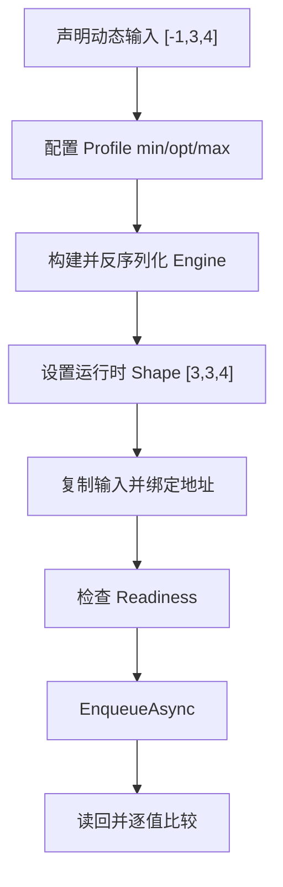
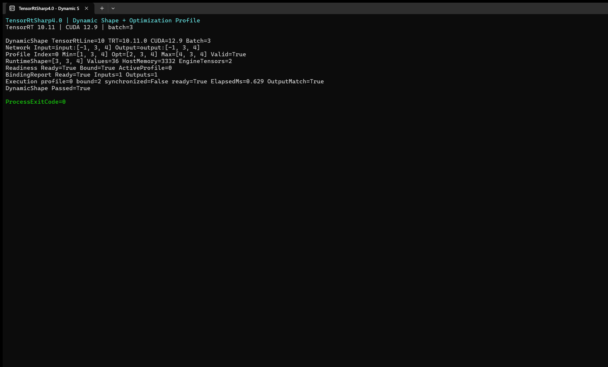

# 使用 TensorRT CSharp API v4.0 完成 Dynamic Shape 与动态 Batch 推理

<!-- public-article-layout:start -->
<style>
.content article { min-width: 0; overflow-wrap: anywhere; }
.content article a, .content article :not(pre) > code { overflow-wrap: anywhere; word-break: break-word; }
.content article pre:not(.mermaid), .content article table { display: block; max-width: 100%; overflow-x: auto; }
.content pre.mermaid { max-width: 640px; margin: 16px auto; overflow-x: auto; }
.content pre.mermaid svg { display: block; width: 100%; max-width: 640px; height: auto; }
</style>
<!-- public-article-layout:end -->

生产环境中的输入尺寸很少永远固定：服务端会合并不同数量的请求，图像模型可能接收多种分辨率，序列模型的长度也会变化。TensorRT 用动态维度和 Optimization Profile 描述这些变化范围，但仅把输入维度写成 `-1` 并不足以完成推理。构建阶段、运行阶段和显存绑定阶段必须使用一致的 shape。

本文从仓库自带的 `DynamicShape` 示例出发，构建一个动态 batch 的 Identity 网络，并在真实 NVIDIA GPU 上完成序列化、反序列化、输入绑定、异步执行和输出校验。示例刻意保持网络很小，方便把注意力放在 Dynamic Shape 的完整调用顺序上。

> 本文是 TensorRT CSharp API v4.0 4.0.0 Samples 系列的 `SMP-003`，对应源码 `samples/Inference/02.DynamicShapes`。文中的 API、包版本、命令和结果均以 `4.0.0` 为基线。

## 1. 前言
<!-- public-article-project-preface:start -->
TensorRT CSharp API v4.0 是一个面向 C#/.NET 开发者的 TensorRT 与 CUDA 工程化接口项目。它把 NVIDIA 原生运行时、生成式绑定、C++ Bridge、托管对象模型和可验证的示例程序组织成一条完整链路，使使用者可以在熟悉的 .NET 项目中完成 Engine 构建、反序列化、ExecutionContext 管理、CUDA 内存操作、异步流同步和结果校验。项目的目标不是隐藏 TensorRT 的概念，而是把这些概念转换为有明确生命周期、所有权和错误边界的 C# API。

4.0.0 是一次完整重构后的正式版本。核心接口、Bridge 边界、Runtime 包命名、样例目录和验证方式都以 4.x 设计为准，不能把 3.x 的类型名、旧包名或旧 DLL 目录直接复制到新项目。托管包只提供项目接口和自有 Bridge；TensorRT、CUDA、cuDNN、显卡驱动以及对应许可证仍由使用者按目标平台安装和管理。

单篇文章也应能够独立阅读：读者可以先从项目入口确认源码和包，再根据本文的程序路径准备依赖，最后用输出中的状态、计数、Shape、哈希或结果图片判断流程是否真的完成。对于尚未具备兼容 GPU 的环境，本文会把静态检查、期望输出和真实运行结果分开标记，不把帮助命令或 build-only 结果包装成推理成功。

项目、包和源码入口（以下地址保留明文，便于复制到不完整支持 Markdown 链接的平台）：

项目主页：

```text
https://github.com/guojin-yan/TensorRT-CSharp-API/tree/TensorRtSharp4.0
```

核心 NuGet：

```text
https://www.nuget.org/packages/JYPPX.TensorRT.CSharp.API/4.0.0
```

Runtime Bridge 包列表：

```text
https://www.nuget.org/packages?q=+JYPPX.TensorRT.CSharp&includeComputedFrameworks=true&prerel=true&sortby=relevance
```

运行库清单：

```text
https://github.com/guojin-yan/TensorRT-CSharp-API/blob/TensorRtSharp4.0/pack/runtime/runtime-packages.manifest.json
```

### 1.1 程序出处与输出说明

本文涉及的程序、脚本或命令均以仓库中的实现为准；对应源码入口：

```text
https://github.com/guojin-yan/TensorRT-CSharp-API/tree/TensorRtSharp4.0/samples
```

运行示例必须同时给出程序输出和判定标准。终端中的 `status`、`Ready`、`Bound`、`enqueueCount`、`OutputMatch`、进程退出码、报告文件或结果图片分别说明不同层次的事实；只有明确写出这些结果，读者才能区分程序启动、Engine 构建、GPU enqueue 和业务结果语义。
<!-- public-article-project-preface:end -->

### 1.2 项目简介

TensorRT CSharp API v4.0 为 .NET 开发者提供 TensorRT Builder、Optimization Profile、ExecutionContext、Bindings 和 CUDA Stream 的托管封装。Dynamic Shape 是最能体现这套 API 价值的基础能力之一：输入尺寸变化时，应用仍可以用明确的 profile 和 readiness 检查控制执行边界。

### 1.3 项目链接与包列表

| 项目内容 | 入口 |
| --- | --- |
| 项目源码 | TensorRT-CSharp-API 4.0 分支：<https://github.com/guojin-yan/TensorRT-CSharp-API/tree/TensorRtSharp4.0> |
| 本文案例源码 | samples/Inference/02.DynamicShapes：<https://github.com/guojin-yan/TensorRT-CSharp-API/tree/TensorRtSharp4.0/samples/Inference/02.DynamicShapes> |
| 案例入口代码 | Program.cs：<https://github.com/guojin-yan/TensorRT-CSharp-API/blob/TensorRtSharp4.0/samples/Inference/02.DynamicShapes/Program.cs> |
| 核心 NuGet | JYPPX.TensorRT.CSharp.API 4.0.0：<https://www.nuget.org/packages/JYPPX.TensorRT.CSharp.API/4.0.0> |
| Runtime Bridge | NuGet 包列表：<https://www.nuget.org/packages?q=+JYPPX.TensorRT.CSharp&includeComputedFrameworks=true&prerel=true&sortby=relevance> |

案例本身使用内存 Identity 网络，不需要外部模型或 ONNX；真实 GPU 运行需要与目标 TensorRT/CUDA/cuDNN 组合匹配的 `*.Bridge 4.0.0`。

### 1.4 本文结构

先介绍动态输入和 profile 的约束，再逐步实现网络、构建 Engine、设置运行时 shape、绑定地址、执行和校验，最后总结动态 shape 常见失败原因。

## 2. 适用读者

本文适合已经能够编译 .NET 项目，希望了解 TensorRT 动态输入、Optimization Profile 和执行前诊断的开发者。阅读后可以把相同流程迁移到分类、检测、分割或序列模型。

## 3. 本文解决什么问题

本文集中解决三个经常混在一起的问题：

1. 如何声明动态维度并为它配置合法的 min/opt/max 范围。
2. 如何在每次推理前设置真实输入 shape、分配显存并绑定 tensor address。
3. 如何在 enqueue 前判断 profile、shape 和地址是否已经全部就绪。

## 4. 本文使用的项目与库

| 组件 | 本文中的职责 |
| --- | --- |
| TensorRT CSharp API v4.0 | 提供 TensorRT 和 CUDA 的 owner-safe C# 接口。 |
| `JYPPX.TensorRtSharp` | 创建 builder、network、profile、engine 和 execution context。 |
| `JYPPX.CudaSharp` | 创建非阻塞 CUDA stream，并测量 GPU 执行耗时。 |
| `JYPPX.SampleSupport` | 解析命令行参数并选择 TensorRT 适配器。 |
| NVIDIA TensorRT | 构建并运行动态 shape 的 Identity 网络。 |
| .NET | 编译和运行 C# 示例。 |

示例项目通过仓库统一配置消费稳定版 `JYPPX.TensorRT.CSharp.API` `4.0.0`，自身不参与打包。运行它仍然需要与目标 TensorRT/CUDA ABI 对应的 Bridge，以及用户安装的 NVIDIA 运行库。

本文实测环境为 Windows 11、NVIDIA GeForce RTX 3060 Laptop GPU、驱动 576.02、CUDA 12.9、TensorRT 10.11.0.33 和 .NET SDK 10.0.301。TensorRT、CUDA 与显卡驱动由用户自行安装，仓库及其发布物不包含 NVIDIA 运行库。

## 5. 模型获取与 ONNX 转换

这个示例**没有使用深度学习模型，也不需要 ONNX 文件**。网络由 C# 在内存中创建：输入经过一个 Identity layer 后原样输出。因此不存在权重下载、模型许可证、ONNX 转换或外层 `models` 暂存文件。

这种设计的目的不是展示识别效果，而是隔离并验证 Dynamic Shape 的基础调用路径。接入真实 ONNX 模型时，模型的输入名、动态维度和 Optimization Profile 范围仍需按本文相同顺序配置。

## 6. 环境准备

先安装与目标版本匹配的 NVIDIA 驱动、CUDA Toolkit 和 TensorRT，并确认仓库已经生成对应版本的 `jyppxtrtbridge.dll`。进入仓库根目录后，用变量保存本机 TensorRT 安装目录：

```powershell
$RepoRoot = (Get-Location).Path
$env:TENSORRT_PATH = '<你的 TensorRT 安装目录>'
$env:JYPPX_TENSORRT_ROOT = $env:TENSORRT_PATH
$env:JYPPX_NATIVE_BRIDGE_PATH = Join-Path $RepoRoot 'build-out\win-x64-trt10-cuda12-release\bin\Release\jyppxtrtbridge.dll'
$env:JYPPX_ENABLE_DEVELOPMENT_PROBING = 'true'
```

桥接库只封装 TensorRT/CUDA ABI；TensorRT、CUDA、cuDNN 和 NVRTC 始终从用户机器的安装目录加载。

## 7. 理解示例网络

示例源文件位于 `samples/Inference/02.DynamicShapes/Program.cs`，网络结构如下：

```text
input [-1, 3, 4] -> Identity -> output [-1, 3, 4]
```

第一维的 `-1` 表示 batch 在构建时未知。示例为它创建一个 Optimization Profile：

| Profile 位置 | Shape | 含义 |
| --- | --- | --- |
| min | `[1, 3, 4]` | 允许的最小 batch。 |
| opt | `[2, 3, 4]` | builder 优先优化的典型 batch。 |
| max | `[4, 3, 4]` | 允许的最大 batch。 |

本文运行时选择 batch 3，因此实际输入 shape 为 `[3, 3, 4]`，共有 36 个 `float`。



## 8. 核心代码

### 8.1 声明动态输入

```csharp
using TensorRtNetworkDefinition network =
    builder.CreateNetwork(TensorRtNetworkDefinitionCreationFlags.ExplicitBatch);

using TensorRtTensor inputTensor = network.AddInput(
    "input",
    TensorRtDataType.Float,
    new TensorRtDims(new[] { -1, 3, 4 }));

using TensorRtLayer identity = network.AddIdentity(inputTensor);
using TensorRtTensor outputTensor = identity.GetOutput(0);
outputTensor.Name = "output";
network.MarkOutput(outputTensor);
```

### 8.2 添加 Optimization Profile

```csharp
using TensorRtOptimizationProfile profile = builder.CreateOptimizationProfile();
profile.SetShape(
    "input",
    new TensorRtDims(new[] { 1, 3, 4 }),
    new TensorRtDims(new[] { 2, 3, 4 }),
    new TensorRtDims(new[] { 4, 3, 4 }));

TensorRtOptimizationProfileShapeRange profileRange =
    profile.GetShapeRange("input");
bool profileValid = profile.IsValid;
int profileIndex = config.AddOptimizationProfile(profile);
```

`min`、`opt` 和 `max` 的 rank 必须一致，而且每一维都要满足 `min <= opt <= max`。`profile.IsValid` 是构建前的第一道检查。

### 8.3 设置运行时 shape 并绑定显存

```csharp
TensorRtDims runtimeShape = new(new[] { batch, 3, 4 });

using TensorRtInferenceBindings bindings =
    new TensorRtInferenceBindings(engine, context, profileIndex);

bindings.SetInputShape("input", runtimeShape)
        .CopyInputFromHost("input", inputValues, runtimeShape);
bindings.AllocateDeviceBuffer(
    "output",
    runtimeShape,
    checked(inputValues.Length * sizeof(float)));
bindings.BindAll();
```

### 8.4 在执行前检查状态

```csharp
TensorRtExecutionContextReadiness readiness =
    bindings.GetReadiness(runShapeInference: true);

if (!readiness.IsReadyForEnqueue)
{
    throw new InvalidOperationException(
        "Dynamic shape bindings are not ready: " + readiness);
}
```

`GetReadiness` 会集中报告输入 shape、active profile 和 tensor address 状态。这样可以在真正 enqueue 前发现配置错误，而不是等 TensorRT 返回一条难定位的底层错误。

### 8.5 执行并验证输出

```csharp
TensorRtInferenceExecutionSummary executionSummary = null!;
float elapsedMilliseconds = stream.MeasureElapsedTime(cudaStream =>
{
    executionSummary = bindings.EnqueueAsync(
        cudaStream,
        synchronize: false,
        runShapeInference: false);
});

float[] outputValues = bindings.ReadOutputSingles("output", inputValues.Length);
bool outputMatch = inputValues.SequenceEqual(outputValues);
```

Identity 网络的输出应该与输入逐值相等，所以 `OutputMatch=True` 是比“进程没有崩溃”更明确的正确性检查。

## 9. 编译与运行

从仓库根目录执行 Release 编译：

```powershell
dotnet build .\samples\Inference\02.DynamicShapes\DynamicShape.csproj `
  -c Release `
  --no-restore `
  /p:UseSharedCompilation=false
```

运行 batch 3：

```powershell
dotnet .\samples\Inference\02.DynamicShapes\bin\Release\net8.0\DynamicShape.dll `
  --tensor-rt-line 10 `
  --batch 3
```

参数说明：

| 参数 | 含义 |
| --- | --- |
| `--tensor-rt-line <8|10|11>` | 选择 TensorRT adapter line；本文使用 10。 |
| `--batch <1..4>` | 选择 profile 范围内的运行时 batch；本文使用 3。 |

## 10. 真实运行结果

下面是上述命令在实测环境中的完整 Windows Terminal 运行窗口。截图来自同一次真实运行的 stdout，不是重新排版的指标卡片。



终端中的关键输出如下：

```text
DynamicShape TensorRtLine=10 TRT=10.11.0 CUDA=12.9 Batch=3
Network Input=input:[-1, 3, 4] Output=output:[-1, 3, 4]
Profile Index=0 Min=[1, 3, 4] Opt=[2, 3, 4] Max=[4, 3, 4] Valid=True
RuntimeShape=[3, 3, 4] Values=36 HostMemory=3332 EngineTensors=2
Readiness Ready=True Bound=True ActiveProfile=0
BindingReport Ready=True Inputs=1 Outputs=1
Execution profile=0 bound=2 synchronized=False ready=True ElapsedMs=0.629 OutputMatch=True
DynamicShape Passed=True
ProcessExitCode=0
```

| 检查项 | 实测结果 | 说明 |
| --- | --- | --- |
| Profile | `Valid=True` | min/opt/max 被 TensorRT 接受。 |
| Runtime shape | `[3, 3, 4]` | batch 3 位于允许范围内。 |
| Tensor address | `Bound=True` | 输入与输出地址均已绑定。 |
| Binding report | 1 input / 1 output | Engine I/O 与预期一致。 |
| 输出校验 | `OutputMatch=True` | 36 个输出值与输入逐值一致。 |
| GPU 计时 | `0.629 ms` | 本次运行记录，不作为跨机器性能基准。 |
| 进程状态 | `ProcessExitCode=0` | 示例正常结束。 |

本次运行的机器可读记录位于 `samples/assets/dynamic-shape-article-runtime-evidence.json`。记录中保存了源文件、程序集、桥接库、原始日志和截图的 SHA256，便于确认正文、截图与运行产物是否对应。

2026-08-04 完成共享命名空间迁移后再次执行同一 Release 示例，结果为 `ProcessExitCode=0`、`OutputMatch=True`，耗时 `0.724 ms`。`maintenanceValidation` 记录当前源码、程序集和运行日志 SHA256；正文继续使用 2026-08-03 的真实终端截图，并以 `runtimeScreenshotRecaptured=false` 明确它不是本次重拍图片。

## 11. 常见问题

### 11.1 Batch 超出 Profile 范围

执行 `--batch 8` 会在进入 TensorRT 前失败，因为示例只允许 `[1, 4]`。真实模型也应先在应用层校验输入，再调用 `SetInputShape`。

### 11.2 输出 `DynamicShape=Skipped`

这表示当前机器无法创建 TensorRT runtime 或 builder，常见原因是 TensorRT/CUDA 安装目录不完整、桥接库版本不匹配或开发探测没有启用。它是环境诊断结果，不代表推理成功。

### 11.3 `Ready=False` 或 `Bound=False`

先检查是否对每个动态输入调用了 `SetInputShape`，再检查所有输入输出是否已经分配并绑定 device buffer。多输入模型必须为每个动态输入分别设置 shape。

### 11.4 CUDA error 35

该错误通常表示当前显卡驱动无法支持所加载的 CUDA runtime。应调整驱动、CUDA、TensorRT 和桥接库的版本组合，而不是修改 Dynamic Shape 逻辑绕过错误。

## 12. 读取 Engine 中的 Profile Tensor Values

当网络包含 shape tensor input 时，可以从构建后的 engine 读取某个 profile 的 min/opt/max 值。TensorRT CSharp API v4.0 会复制 TensorRT 返回的数据，不把 borrowed pointer 暴露给调用者：

```csharp
long[] optValues = engine.GetProfileTensorValuesV2(
    "shape_input",
    profileIndex: 0,
    TensorRtOptimizationProfileSelector.Opt);
```

如果 tensor shape 仍含未知维度，自动推导无法确定复制数量，应改用带 `valueCount` 的重载：

```csharp
long[] optValues = engine.GetProfileTensorValuesV2(
    "shape_input",
    profileIndex: 0,
    TensorRtOptimizationProfileSelector.Opt,
    valueCount: expectedShapeValueCount);
```

## 13. 本文结论与边界

这次实测证明了源码树中的 TensorRT 10 Dynamic Shape、Optimization Profile、binding readiness、CUDA stream enqueue 和 GPU readback 路径能够协同工作，并且 batch 3 的 36 个输出值全部匹配。

它不证明任意 ONNX 模型的布局、精度或后处理正确，也不替代真实模型验证。本文没有执行 NuGet 发布、GitHub Packages 发布、Release 创建或 post-publish 验证；截图与证据只对应本次本机源码运行。

<!-- public-article-declaration:start -->
## 14. 文章声明

### 14.1 开源协议声明
作者所有开源项目代码均遵循 Apache License 2.0 开源协议。
特别说明：本项目集成了若干第三方库。若任何第三方库的许可协议与 Apache 2.0 协议存在冲突或不一致，均以该第三方库的原始许可协议为准。本项目不包含也不代表这些第三方库的授权声明，使用前请务必阅读并遵守第三方库的相关许可。

### 14.2 代码开发与质量说明
AI 辅助开发：本代码在开发过程中使用了人工智能（AI）辅助生成与优化，并非完全由人工逐行编写。
安全性承诺：作者郑重声明，本代码中绝无任何有意设置的后门、病毒、木马或旨在破坏用户设备、窃取数据的恶意代码。
技术局限性：受限于作者个人的技术水平与能力，代码中可能存在因逻辑不严谨、优化不足或经验欠缺导致的低级问题（例如但不限于内存泄漏、偶发崩溃、资源未释放等）。这些问题纯属能力不足所致，并非主观故意。
测试范围：由于作者精力有限，未对本软件进行全方位、覆盖所有边缘场景的完整测试。

### 14.3 免责声明（重要）
请在将本代码应用于任何实际项目（特别是商业、工业或关键任务环境）之前，务必进行详尽、严格的自行测试与验证。 鉴于上述可能存在的代码缺陷及测试覆盖不足，因使用本代码而导致的任何直接或间接损失（包括但不限于设备故障、数据丢失、系统瘫痪或利润损失等），本作者概不负责。 一旦您开始使用本代码，即表示您已知晓上述风险并同意自行承担一切后果，相关问题与本作者无关。

### 14.4 代码开源范围
本项目承诺核心逻辑代码完全开源，但上述提到的“第三方库”的二进制文件、源代码或相关资源不在本项目的开源义务范围内，请根据其各自的指引获取。

### 14.5 社区与反馈
尽管存在上述不足，我们仍欢迎大家下载使用、提交 Issue 或参与测试，共同完善项目。如果您在使用过程中发现 Bug、内存溢出或有改进建议，欢迎通过项目主页提供的联系方式与作者取得联系，我们将尽力在有限的时间内提供协助。


<!-- public-article-declaration:end -->
