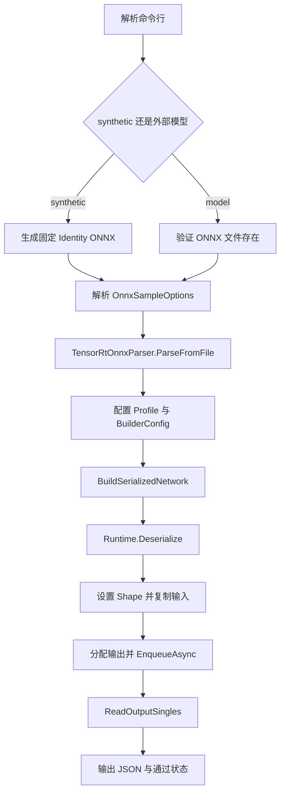
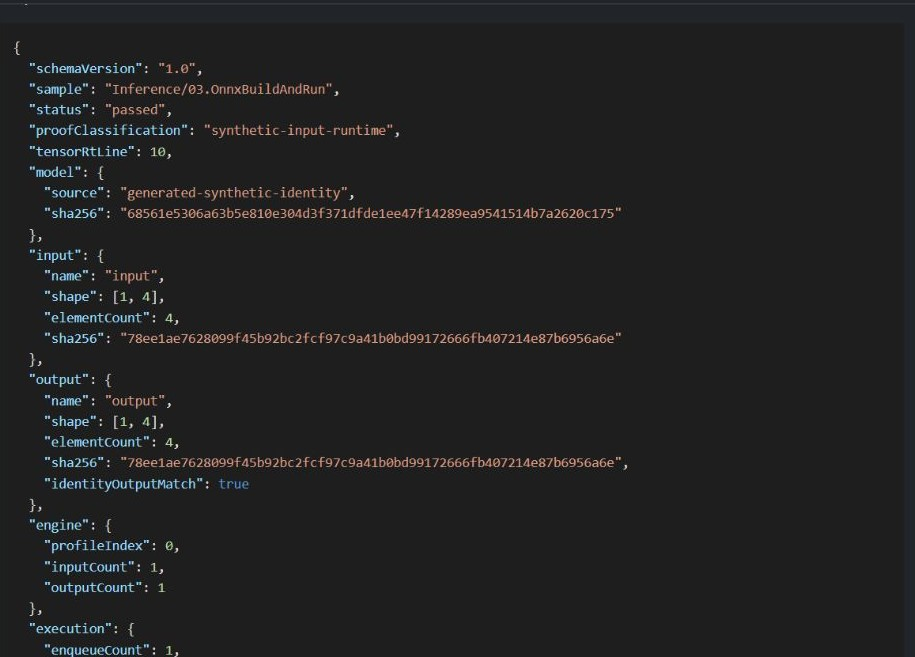

# 从 ONNX 到 TensorRT Engine：构建、加载与单次推理

<!-- public-article-layout:start -->
<style>
.content article { min-width: 0; overflow-wrap: anywhere; }
.content article a, .content article :not(pre) > code { overflow-wrap: anywhere; word-break: break-word; }
.content article pre:not(.mermaid), .content article table { display: block; max-width: 100%; overflow-x: auto; }
.content pre.mermaid { max-width: 640px; margin: 16px auto; overflow-x: auto; }
.content pre.mermaid svg { display: block; width: 100%; max-width: 640px; height: auto; }
</style>
<!-- public-article-layout:end -->

很多 ONNX 教程只停在“Parser 没报错”或“Engine 已生成”，但这两件事都不能证明模型真正执行过。一个完整的最小闭环至少应包含：读取 ONNX、解析网络、配置 Builder、构建序列化 Engine、由 Runtime 加载 Engine、准备输入、绑定显存、执行一次 enqueue、读回输出并验证结果。

TensorRT CSharp API v4.0 4.0.0 的 `OnnxBuildAndRun` 示例把这条链路压缩为一个可运行程序，并提供两种入口：无需下载模型的 deterministic synthetic Identity 模式，以及面向用户 ONNX 文件的外部模型模式。两种模式共用同一套 TensorRT 构建和推理实现。

> 本文是 TensorRT CSharp API v4.0 4.0.0 Samples 系列的 `SMP-004`，对应源码 `samples/Inference/03.OnnxBuildAndRun`。本文讲的是 Sample，不是功能更完整的 `applications/OnnxToEngine` 工具。

## 1. 前言
<!-- public-article-project-preface:start -->
TensorRT CSharp API v4.0 是一个面向 C#/.NET 开发者的 TensorRT 与 CUDA 工程化接口项目。它把 NVIDIA 原生运行时、生成式绑定、C++ Bridge、托管对象模型和可验证的示例程序组织成一条完整链路，使使用者可以在熟悉的 .NET 项目中完成 Engine 构建、反序列化、ExecutionContext 管理、CUDA 内存操作、异步流同步和结果校验。项目的目标不是隐藏 TensorRT 的概念，而是把这些概念转换为有明确生命周期、所有权和错误边界的 C# API。

4.0.0 是一次完整重构后的正式版本。核心接口、Bridge 边界、Runtime 包命名、样例目录和验证方式都以 4.x 设计为准，不能把 3.x 的类型名、旧包名或旧 DLL 目录直接复制到新项目。托管包只提供项目接口和自有 Bridge；TensorRT、CUDA、cuDNN、显卡驱动以及对应许可证仍由使用者按目标平台安装和管理。

单篇文章也应能够独立阅读：读者可以先从项目入口确认源码和包，再根据本文的程序路径准备依赖，最后用输出中的状态、计数、Shape、哈希或结果图片判断流程是否真的完成。对于尚未具备兼容 GPU 的环境，本文会把静态检查、期望输出和真实运行结果分开标记，不把帮助命令或 build-only 结果包装成推理成功。

项目、包和源码入口（以下地址保留明文，便于复制到不完整支持 Markdown 链接的平台）：

项目主页：

```text
https://github.com/guojin-yan/TensorRT-CSharp-API/tree/TensorRtSharp4.0
```

核心 NuGet：

```text
https://www.nuget.org/packages/JYPPX.TensorRT.CSharp.API/4.0.0
```

Runtime Bridge 包列表：

```text
https://www.nuget.org/packages?q=+JYPPX.TensorRT.CSharp&includeComputedFrameworks=true&prerel=true&sortby=relevance
```

运行库清单：

```text
https://github.com/guojin-yan/TensorRT-CSharp-API/blob/TensorRtSharp4.0/pack/runtime/runtime-packages.manifest.json
```

### 1.1 程序出处与输出说明

本文涉及的程序、脚本或命令均以仓库中的实现为准；对应源码入口：

```text
https://github.com/guojin-yan/TensorRT-CSharp-API/tree/TensorRtSharp4.0/samples
```

运行示例必须同时给出程序输出和判定标准。终端中的 `status`、`Ready`、`Bound`、`enqueueCount`、`OutputMatch`、进程退出码、报告文件或结果图片分别说明不同层次的事实；只有明确写出这些结果，读者才能区分程序启动、Engine 构建、GPU enqueue 和业务结果语义。
<!-- public-article-project-preface:end -->

### 1.2 项目简介

TensorRT CSharp API v4.0 把 ONNX Parser、TensorRT Builder、Runtime、Engine、ExecutionContext 和 CUDA Stream 组合成面向 .NET 的推理链路。`OnnxBuildAndRun` 是该链路的最小样例，用很小的 synthetic Identity ONNX 先验证 API 和 GPU 执行，再为外部 ONNX 模型留下清晰的输入、输出和证据边界。

### 1.3 项目链接与包列表

| 项目内容 | 入口 |
| --- | --- |
| 项目源码 | TensorRT-CSharp-API 4.0 分支：<https://github.com/guojin-yan/TensorRT-CSharp-API/tree/TensorRtSharp4.0> |
| 本文案例源码 | samples/Inference/03.OnnxBuildAndRun：<https://github.com/guojin-yan/TensorRT-CSharp-API/tree/TensorRtSharp4.0/samples/Inference/03.OnnxBuildAndRun> |
| 程序入口 | Program.cs：<https://github.com/guojin-yan/TensorRT-CSharp-API/blob/TensorRtSharp4.0/samples/Inference/03.OnnxBuildAndRun/Program.cs> |
| Synthetic ONNX 生成代码 | SyntheticIdentityOnnxModel.cs：<https://github.com/guojin-yan/TensorRT-CSharp-API/blob/TensorRtSharp4.0/samples/Inference/03.OnnxBuildAndRun/SyntheticIdentityOnnxModel.cs> |
| 核心 NuGet | JYPPX.TensorRT.CSharp.API 4.0.0：<https://www.nuget.org/packages/JYPPX.TensorRT.CSharp.API/4.0.0> |
| Runtime Bridge | NuGet 包列表：<https://www.nuget.org/packages?q=+JYPPX.TensorRT.CSharp&includeComputedFrameworks=true&prerel=true&sortby=relevance> |

### 1.4 本文结构

先说明项目和包边界，再介绍 synthetic/external 两种模式、Parser/Builder/Runtime/Bindings 的调用顺序、结构化 JSON 结果和常见问题。本文的 `passed` 只代表 synthetic-input-runtime，不代表外部模型精度。

## 2. 本文解决什么问题

读完并完成示例后，可以确认以下边界：

1. C# 程序能够通过 TensorRT ONNX Parser 读取 ONNX。
2. Builder 能够生成 serialized network，Runtime 能够在内存中反序列化为 Engine。
3. 输入 tensor 名称、shape 和 FP32 数据能够正确写入 device buffer。
4. ExecutionContext 能够完成一次真实 GPU enqueue，并把 FP32 输出读回 CPU。
5. synthetic Identity 模式能通过输入输出值和 SHA256 双重校验。
6. 程序能把关键事实写成结构化 JSON，而不是只依赖终端中的一句 `Passed=True`。

本文不会用 synthetic 结果证明任意外部模型可运行，也不会把它描述为真实模型精度、公开包消费或发布后验证。

## 3. 项目与依赖

| 组件 | 作用 |
| --- | --- |
| `samples/Inference/03.OnnxBuildAndRun` | 参数入口、synthetic ONNX 生成、结果判断和 JSON 报告 |
| `JYPPX.SampleSupport` | ONNX 解析、Builder 配置、输入准备、绑定、enqueue 与输出读回 |
| `JYPPX.TensorRT.CSharp.API` `4.0.0` | TensorRT 与 CUDA 的公开托管 API |
| `JYPPX.TensorRtSharp` | Logger、Runtime、Builder、Network、Parser、Engine、Context 和 Bindings |
| `JYPPX.CudaSharp` | 非阻塞 CUDA Stream 和 GPU 计时 |
| NVIDIA TensorRT / CUDA | ONNX 解析、Engine 构建与 GPU 执行 |
| .NET 8 | 编译并运行示例 |

项目设置为 `IsPackable=false`，没有源码 `ProjectReference`，通过仓库统一 props 消费精确的稳定版 `JYPPX.TensorRT.CSharp.API` `4.0.0`。示例本身不会变成另一个 NuGet 包。

Bridge 包或本地 Bridge 产物必须与目标机器的 TensorRT/CUDA ABI 一致。Bridge 只包含项目自有的 `jyppxtrtbridge`；TensorRT、CUDA、cuDNN 和 NVRTC 仍由用户安装。

## 4. 两种运行模式

### 4.1 synthetic Identity 模式

`--synthetic` 会在系统临时目录生成固定的 `identity-1x4.onnx`：

```text
input: float32[1,4] -> Identity -> output: float32[1,4]
```

该模型没有权重，ONNX opset 为 13，输入与输出应逐值一致。它适合验证部署链路，因为没有下载地址、许可证、标签、图片、预处理或后处理等额外变量。

### 4.2 外部 ONNX 模式

`--model <path>` 使用调用方提供的 ONNX。当前 Sample 面向至少一个 FP32 输入和一个 FP32 输出的最小场景；复杂模型应明确提供输入、输出和 shape。外部模型能成功构建和 enqueue，也仍需独立参考来判断数值或任务语义是否正确。

两种模式互斥，同时传入 `--synthetic` 和 `--model` 会返回参数错误；两者都不提供也会失败，并提示选择其中一个。

## 5. 完整执行流程



需要注意：当前 Sample 在内存中把 `TensorRtHostMemory` 反序列化为 Engine，不会默认把 `.plan` 文件写入仓库。它验证了“构建并加载”，但不是 Engine 文件持久化教程。

## 6. 先检查离线帮助

帮助分支位于任何 TensorRT 或 CUDA 对象创建之前，因此可以在没有 GPU 运行环境的机器上执行：

```powershell
dotnet run --project .\samples\Inference\03.OnnxBuildAndRun -- --help
```

主要参数如下：

| 参数 | 含义 |
| --- | --- |
| `--synthetic` | 生成并运行固定的 `1x4` Identity ONNX |
| `--model <path>` | 使用外部 ONNX；与 `--synthetic` 互斥 |
| `--tensor-rt-line <8|10|11>` | 选择 TensorRT adapter line，默认 `10` |
| `--input-shape <dims>` | 具体输入 shape，默认 `1x4` |
| `--input-name <name>` | 无法唯一推断时指定输入 tensor 名 |
| `--output-name <name>` | 指定输出 tensor 名，默认第一个输出 |
| `--input-pattern <pattern>` | `zeros`、`ones` 或 `ramp`，默认 `ramp` |
| `--output-json <path>` | 把结构化结果同时写入 JSON 文件 |

`--help` 返回 0 只说明命令行入口可用，不是 TensorRT runtime 或 GPU 推理成功。

## 7. 核心代码解析

### 7.1 生成确定性的最小 ONNX

synthetic 模型直接使用一个很小的 Protobuf writer 生成，不需要 Python、PyTorch 或外部 `.onnx`：

```csharp
string modelPath = synthetic
    ? SyntheticIdentityOnnxModel.WriteToTemporaryDirectory()
    : requestedModel;
```

节点只有一个 `Identity`，输入输出均为 `float32[1,4]`。相同源码每次生成相同字节，因此可以通过模型 SHA256 发现意外变化。

### 7.2 解析 ONNX 并创建 TensorRT 对象

共享实现先探测 adapter，再按所有权顺序创建 TensorRT/CUDA 对象：

```csharp
using TensorRtLogger logger = new TensorRtLogger(options.Line);
using TensorRtRuntime runtime = new TensorRtRuntime(logger);
using TensorRtBuilder builder = new TensorRtBuilder(logger);
using TensorRtBuilderConfig config = builder.CreateBuilderConfig();
using CudaStream stream = new CudaStream(CudaStreamCreationFlags.NonBlocking);
using TensorRtNetworkDefinition network =
    builder.CreateNetwork(TensorRtNetworkDefinitionCreationFlags.ExplicitBatch);
using TensorRtOnnxParser parser = new TensorRtOnnxParser(logger, network);

if (!parser.ParseFromFile(options.ModelPath))
{
    throw new InvalidOperationException(parser.GetErrorSummary());
}
```

`using` 不只是语法习惯。Logger、Runtime、Builder、Config、Stream、Network 和 Parser 都持有 native 资源，释放顺序必须覆盖它们之间的依赖关系。

### 7.3 配置动态 Shape 与 Builder

当 ONNX 输入含动态维度，或命令行显式提供 profile 范围时，Sample 会创建 Optimization Profile：

```csharp
using TensorRtOptimizationProfile profile = builder.CreateOptimizationProfile();
profile.SetShape(input.Name, input.Options.MinShape,
    input.Options.OptShape, input.Options.MaxShape);
int profileIndex = config.AddOptimizationProfile(profile);
```

随后设置 256 MiB workspace、optimization level 3、0 个辅助流，并把 CUDA stream 作为 profile stream。传入 `--noTF32` 时还会关闭 TF32 并读回检查，避免参数只写入了托管状态却没有作用到 BuilderConfig。

### 7.4 构建并加载 Engine

```csharp
using TensorRtHostMemory hostMemory =
    builder.BuildSerializedNetwork(network, config);
using TensorRtEngine engine = runtime.Deserialize(hostMemory);
using TensorRtExecutionContext context = engine.CreateExecutionContext();
using TensorRtInferenceBindings bindings =
    new TensorRtInferenceBindings(engine, context, profileIndex);
```

这段代码覆盖 Parser 后的三个不同阶段：Builder 产出序列化字节、Runtime 加载字节、Engine 创建 ExecutionContext。不能把 Parser 成功等同于这三步也成功。

### 7.5 复制输入、绑定并执行

```csharp
bindings.SetInputShape(input.Name, input.Options.Shape);
bindings.CopyInputFromHost(input.Name, inputValues, input.Options.Shape);
_ = bindings.GetReadiness(runShapeInference: true);

TensorRtInferenceBuffer outputBuffer =
    bindings.AllocateDeviceBuffer(outputName);

TensorRtInferenceExecutionSummary executionSummary = null!;
float elapsedMilliseconds = stream.MeasureElapsedTime(cudaStream =>
{
    executionSummary = bindings.EnqueueAsync(
        cudaStream,
        synchronize: false,
        runShapeInference: true);
});

float[] outputValues = bindings.ReadOutputSingles(
    outputName,
    TensorRtOnnxSample.CountElements(outputBuffer.RuntimeShape!));
```

输出 buffer 在 shape inference 后按实际输出 shape 分配。当前 Sample 明确只读取 FP32 输出；如果外部模型的目标输出不是 Float，会直接返回不支持，而不是按错误位宽静默解码。

### 7.6 用 Identity 结果闭环

```csharp
bool identityOutputMatch =
    !synthetic || result.OutputValues.SequenceEqual(result.Inputs[0].Preview);
string status = identityOutputMatch ? "passed" : "failed";
```

synthetic 输入只有 4 个元素，`Preview` 覆盖全部输入，因此这里是完整逐值比较。JSON 还分别计算输入和输出 float 字节的 SHA256，形成第二个可复查信号。

## 8. 编译与运行

从仓库根目录执行：

```powershell
dotnet restore .\samples\Inference\03.OnnxBuildAndRun\OnnxBuildAndRun.csproj
dotnet build .\samples\Inference\03.OnnxBuildAndRun\OnnxBuildAndRun.csproj `
  -c Release --no-restore /p:UseSharedCompilation=false
```

使用源码仓库中的本地 Bridge 做开发验证时，可以设置：

```powershell
$RepoRoot = (Resolve-Path .).Path
$env:TENSORRT_PATH = '<你的 TensorRT 安装目录>'
$env:JYPPX_TENSORRT_ROOT = $env:TENSORRT_PATH
$env:JYPPX_NATIVE_BRIDGE_PATH = '<与本机 ABI 匹配的 jyppxtrtbridge.dll>'
$env:JYPPX_ENABLE_DEVELOPMENT_PROBING = '1'
```

运行 synthetic 模式并保存报告：

```powershell
dotnet run `
  --project .\samples\Inference\03.OnnxBuildAndRun\OnnxBuildAndRun.csproj `
  -c Release --no-build -- `
  --synthetic `
  --tensor-rt-line 10 `
  --output-json .\artifacts\onnx-build-and-run.json
```

运行外部单输入、单输出 FP32 ONNX：

```powershell
dotnet run `
  --project .\samples\Inference\03.OnnxBuildAndRun\OnnxBuildAndRun.csproj `
  -c Release --no-build -- `
  --model .\models\model.onnx `
  --input-shape 1x4 `
  --input-pattern ramp `
  --tensor-rt-line 10 `
  --output-json .\artifacts\onnx-build-and-run-external.json
```

外部模型的 shape、输入名、输出名和数据类型必须以模型合同为准，不能照抄 `1x4`。

## 9. 本次真实运行结果

2026-08-11 在 Windows、TensorRT 10.11 / CUDA 12.9 对应 Bridge 上执行本文 synthetic 命令，程序真实完成一次 GPU enqueue。下面省略了本机临时目录，只保留可复查的结果字段：

```json
{
  "schemaVersion": "1.0",
  "sample": "Inference/03.OnnxBuildAndRun",
  "status": "passed",
  "proofClassification": "synthetic-input-runtime",
  "tensorRtLine": 10,
  "model": {
    "source": "generated-synthetic-identity",
    "sha256": "68561e5306a63b5e810e304d3f371dfde1ee47f14289ea9541514b7a2620c175"
  },
  "input": {
    "name": "input",
    "shape": [1, 4],
    "elementCount": 4,
    "sha256": "78ee1ae7628099f45b92bc2fcf97c9a41b0bd99172666fb407214e87b6956a6e"
  },
  "output": {
    "name": "output",
    "shape": [1, 4],
    "elementCount": 4,
    "sha256": "78ee1ae7628099f45b92bc2fcf97c9a41b0bd99172666fb407214e87b6956a6e",
    "identityOutputMatch": true
  },
  "engine": {
    "profileIndex": 0,
    "inputCount": 1,
    "outputCount": 1
  },
  "execution": {
    "enqueueCount": 1,
    "elapsedMilliseconds": 2.614272,
    "summary": "profile=0 bound=2 synchronized=False ready=True"
  }
}
```



| 检查项 | 实测值 | 能证明什么 |
| --- | --- | --- |
| `status` | `passed` | 程序完整路径正常结束 |
| 模型来源 | `generated-synthetic-identity` | 本次使用固定 synthetic ONNX |
| Engine I/O | 1 input / 1 output | 解析后的网络合同符合预期 |
| `enqueueCount` | `1` | 实际提交了一次推理 |
| `ready` | `True` | profile、shape 和地址满足执行条件 |
| 输入/输出 SHA256 | 完全相同 | 输出 float 字节与输入一致 |
| `identityOutputMatch` | `true` | 4 个值逐值匹配 |
| GPU 计时 | `2.614272 ms` | 仅为本次运行记录，不是性能基准 |

这次结果是 `synthetic-input-runtime`。它比 `--help`、restore 或 build 更强，因为 TensorRT Engine 和 GPU enqueue 确实执行了；它仍弱于固定外部模型、真实输入、独立框架参考和公开包安装后的端到端证明。

## 10. 结构化 JSON 应如何使用

建议在自动化或复查时先判断 `status`，再检查 `proofClassification`、模型哈希、I/O shape、`enqueueCount` 和 `identityOutputMatch`。不要只搜索最后一行 `Passed=True`。

三种状态应分别处理：

| 状态 | 含义 | 处理方式 |
| --- | --- | --- |
| `passed` | 当前输入完成构建、加载、enqueue 和结果检查 | 继续核对 proof classification 和资产合同 |
| `skipped` | Bridge、TensorRT、CUDA 或 Builder 环境不可用 | 修复依赖；不能写成推理成功 |
| `invalid-arguments` | 模型、shape 或参数不合法 | 修正调用参数；进程返回 2 |

## 11. 常见问题

### 11.1 `Unable to load DLL 'jyppxtrtbridge'`

确认安装或指定了与当前平台、TensorRT 和 CUDA 组合匹配的 Bridge。`JYPPX_NATIVE_BRIDGE_PATH` 应指向文件本身，而不是目录；同时确认 TensorRT 根目录可被解析。

### 11.2 输出 `status=skipped`

这表示依赖探测或部署环境不可用。检查 NVIDIA 驱动、TensorRT/CUDA 安装、Bridge ABI 和动态库搜索路径。Skip 是环境诊断，不是通过。

### 11.3 Parser 返回错误摘要

真实 ONNX 常见原因包括算子或 opset 不受目标 TensorRT 支持、plugin 缺失、输入合同不完整、动态 shape 没有 profile，或导出器生成了目标版本无法解析的图。保留完整 parser error summary，再回到模型导出和 TensorRT 支持矩阵定位。

### 11.4 外部模型输出不是 FP32

当前最小 Sample 的 typed readback 只接受 Float 输出。FP16、整数、布尔、量化或多输出模型需要按 binding metadata 分配和解码，不能强行使用 `ReadOutputSingles`。

### 11.5 `identityOutputMatch=false`

synthetic 模式下这应视为失败。先保留 JSON、模型 SHA256、输入输出 SHA256 和原始 stdout，不要仅重新运行到偶然通过。Identity 的输入输出不一致通常意味着绑定、shape、buffer 或执行链路存在问题。

## 12. 结论与边界

本文完成了 TensorRT CSharp API v4.0 4.0.0 下最小 ONNX 到 TensorRT 推理闭环：固定 ONNX 生成、Parser 解析、Builder 配置、serialized network 构建、Runtime 反序列化、ExecutionContext 创建、输入复制、显存绑定、GPU enqueue、输出读回和结构化结果检查。

本次真实结果只证明 synthetic Identity 模型在当前 TensorRT 10.11 / CUDA 12.9 环境完成了一次执行。它不证明任意 ONNX 模型兼容，不证明模型精度，不是 package-consumer-runtime 或 post-publish proof，也没有触发 NuGet、GitHub Packages 或 Release 发布。

## 13. 延伸阅读

- SMP-002：推理输入、显存绑定与 GPU 输出读回：<https://github.com/guojin-yan/TensorRT-CSharp-API/blob/TensorRtSharp4.0/docs/articles/zh-cn/02-samples/smp-002-inference-bindings.md>
- SMP-003：Dynamic Shape 与动态 Batch：<https://github.com/guojin-yan/TensorRT-CSharp-API/blob/TensorRtSharp4.0/docs/articles/zh-cn/02-samples/smp-003-dynamic-shapes.md>
- SMP-009：在 C# 中运行 ResNet18 图像分类：<https://github.com/guojin-yan/TensorRT-CSharp-API/blob/TensorRtSharp4.0/docs/articles/zh-cn/02-samples/smp-009-resnet18-classification.md>

<!-- public-article-declaration:start -->
## 14. 文章声明

### 14.1 开源协议声明
作者所有开源项目代码均遵循 Apache License 2.0 开源协议。
特别说明：本项目集成了若干第三方库。若任何第三方库的许可协议与 Apache 2.0 协议存在冲突或不一致，均以该第三方库的原始许可协议为准。本项目不包含也不代表这些第三方库的授权声明，使用前请务必阅读并遵守第三方库的相关许可。

### 14.2 代码开发与质量说明
AI 辅助开发：本代码在开发过程中使用了人工智能（AI）辅助生成与优化，并非完全由人工逐行编写。
安全性承诺：作者郑重声明，本代码中绝无任何有意设置的后门、病毒、木马或旨在破坏用户设备、窃取数据的恶意代码。
技术局限性：受限于作者个人的技术水平与能力，代码中可能存在因逻辑不严谨、优化不足或经验欠缺导致的低级问题（例如但不限于内存泄漏、偶发崩溃、资源未释放等）。这些问题纯属能力不足所致，并非主观故意。
测试范围：由于作者精力有限，未对本软件进行全方位、覆盖所有边缘场景的完整测试。

### 14.3 免责声明（重要）
请在将本代码应用于任何实际项目（特别是商业、工业或关键任务环境）之前，务必进行详尽、严格的自行测试与验证。 鉴于上述可能存在的代码缺陷及测试覆盖不足，因使用本代码而导致的任何直接或间接损失（包括但不限于设备故障、数据丢失、系统瘫痪或利润损失等），本作者概不负责。 一旦您开始使用本代码，即表示您已知晓上述风险并同意自行承担一切后果，相关问题与本作者无关。

### 14.4 代码开源范围
本项目承诺核心逻辑代码完全开源，但上述提到的“第三方库”的二进制文件、源代码或相关资源不在本项目的开源义务范围内，请根据其各自的指引获取。

### 14.5 社区与反馈
尽管存在上述不足，我们仍欢迎大家下载使用、提交 Issue 或参与测试，共同完善项目。如果您在使用过程中发现 Bug、内存溢出或有改进建议，欢迎通过项目主页提供的联系方式与作者取得联系，我们将尽力在有限的时间内提供协助。


<!-- public-article-declaration:end -->
