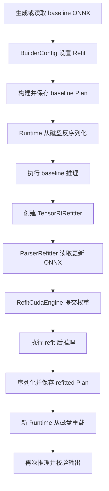

# TensorRT Refitted Plan 实战：权重替换、持久化与重新加载

<!-- public-article-layout:start -->
<style>
.content article { min-width: 0; overflow-wrap: anywhere; }
.content article a, .content article :not(pre) > code { overflow-wrap: anywhere; word-break: break-word; }
.content article pre:not(.mermaid), .content article table { display: block; max-width: 100%; overflow-x: auto; }
.content pre.mermaid { max-width: 640px; margin: 16px auto; overflow-x: auto; }
.content pre.mermaid svg { display: block; width: 100%; max-width: 640px; height: auto; }
</style>
<!-- public-article-layout:end -->

当网络结构保持不变、只有权重需要更新时，重新解析 ONNX 并完整构建 Engine 往往不是唯一选择。TensorRT Refit 可以在一个以 `Refit` 标志构建的 Engine 上替换可重装权重，再把更新后的 Engine 序列化为新的 Plan。真正可靠的 Refit 验证不能停在“API 返回成功”或“文件已经写出”，还必须执行 refit 前后推理，并从磁盘重新加载新 Plan 再检查输出。

TensorRT CSharp API v4.0 4.0.0 的 `RefittedPlan` 示例用两个确定性的 `1x4` ONNX 模型完成这条闭环：baseline 模型把输入乘以 1，refit 模型只把 initializer 改为 2。程序构建 baseline Plan、提交权重更新、保存 refitted Plan，并验证重新加载后的输出仍为输入的 2 倍。

> 本文是 TensorRT CSharp API v4.0 4.0.0 Samples 系列的 `SMP-005`，对应源码 `samples/Inference/04.RefittedPlan`。本文验证的是 synthetic-input-runtime，不把合成模型结果描述为外部真实模型或公开包消费者证明。

## 1. 前言
<!-- public-article-project-preface:start -->
TensorRT CSharp API v4.0 是一个面向 C#/.NET 开发者的 TensorRT 与 CUDA 工程化接口项目。它把 NVIDIA 原生运行时、生成式绑定、C++ Bridge、托管对象模型和可验证的示例程序组织成一条完整链路，使使用者可以在熟悉的 .NET 项目中完成 Engine 构建、反序列化、ExecutionContext 管理、CUDA 内存操作、异步流同步和结果校验。项目的目标不是隐藏 TensorRT 的概念，而是把这些概念转换为有明确生命周期、所有权和错误边界的 C# API。

4.0.0 是一次完整重构后的正式版本。核心接口、Bridge 边界、Runtime 包命名、样例目录和验证方式都以 4.x 设计为准，不能把 3.x 的类型名、旧包名或旧 DLL 目录直接复制到新项目。托管包只提供项目接口和自有 Bridge；TensorRT、CUDA、cuDNN、显卡驱动以及对应许可证仍由使用者按目标平台安装和管理。

单篇文章也应能够独立阅读：读者可以先从项目入口确认源码和包，再根据本文的程序路径准备依赖，最后用输出中的状态、计数、Shape、哈希或结果图片判断流程是否真的完成。对于尚未具备兼容 GPU 的环境，本文会把静态检查、期望输出和真实运行结果分开标记，不把帮助命令或 build-only 结果包装成推理成功。

项目、包和源码入口（以下地址保留明文，便于复制到不完整支持 Markdown 链接的平台）：

项目主页：

```text
https://github.com/guojin-yan/TensorRT-CSharp-API/tree/TensorRtSharp4.0
```

核心 NuGet：

```text
https://www.nuget.org/packages/JYPPX.TensorRT.CSharp.API/4.0.0
```

Runtime Bridge 包列表：

```text
https://www.nuget.org/packages?q=+JYPPX.TensorRT.CSharp&includeComputedFrameworks=true&prerel=true&sortby=relevance
```

运行库清单：

```text
https://github.com/guojin-yan/TensorRT-CSharp-API/blob/TensorRtSharp4.0/pack/runtime/runtime-packages.manifest.json
```

### 1.1 程序出处与输出说明

本文涉及的程序、脚本或命令均以仓库中的实现为准；对应源码入口：

```text
https://github.com/guojin-yan/TensorRT-CSharp-API/tree/TensorRtSharp4.0/samples
```

运行示例必须同时给出程序输出和判定标准。终端中的 `status`、`Ready`、`Bound`、`enqueueCount`、`OutputMatch`、进程退出码、报告文件或结果图片分别说明不同层次的事实；只有明确写出这些结果，读者才能区分程序启动、Engine 构建、GPU enqueue 和业务结果语义。
<!-- public-article-project-preface:end -->

### 1.2 项目简介

TensorRT CSharp API v4.0 是面向 C#/.NET 的 TensorRT 与 CUDA API。4.0.0 将 Builder、ONNX Parser、Runtime、Engine、ExecutionContext、Refitter、CUDA Stream 和显存对象组织为显式生命周期的托管接口，使 .NET 应用能够在不编写业务侧 C++/CLI 的情况下完成 Engine 构建、推理和高级能力验证。

Refit 是其中一项容易被误解的高级能力。它不是修改任意 Engine，也不是绕过模型兼容性检查；它要求 Engine 在构建时保留可 refit 信息，更新模型与原模型结构兼容，并且权重名称、角色、形状和数据类型满足 TensorRT 的约束。

### 1.3 项目链接与包列表

| 项目内容 | 入口 |
| --- | --- |
| 项目源码 | TensorRT-CSharp-API 4.0 分支：<https://github.com/guojin-yan/TensorRT-CSharp-API/tree/TensorRtSharp4.0> |
| 本文案例源码 | samples/Inference/04.RefittedPlan：<https://github.com/guojin-yan/TensorRT-CSharp-API/tree/TensorRtSharp4.0/samples/Inference/04.RefittedPlan> |
| 程序入口 | Program.cs：<https://github.com/guojin-yan/TensorRT-CSharp-API/blob/TensorRtSharp4.0/samples/Inference/04.RefittedPlan/Program.cs> |
| Synthetic ONNX 生成代码 | SyntheticRefitOnnxModel.cs：<https://github.com/guojin-yan/TensorRT-CSharp-API/blob/TensorRtSharp4.0/samples/Inference/04.RefittedPlan/SyntheticRefitOnnxModel.cs> |
| 中文案例说明 | README.zh-CN.md：<https://github.com/guojin-yan/TensorRT-CSharp-API/blob/TensorRtSharp4.0/samples/Inference/04.RefittedPlan/README.zh-CN.md> |
| 核心 NuGet | JYPPX.TensorRT.CSharp.API 4.0.0：<https://www.nuget.org/packages/JYPPX.TensorRT.CSharp.API/4.0.0> |
| Runtime Bridge | NuGet 包列表：<https://www.nuget.org/packages?q=+JYPPX.TensorRT.CSharp&includeComputedFrameworks=true&prerel=true&sortby=relevance> |

示例通过仓库统一配置消费精确版本 `4.0.0`。真实运行时还要选择一个与操作系统、TensorRT、CUDA 和 cuDNN 组合完全匹配的 `*.Bridge 4.0.0` 包。Bridge 只提供项目自有的原生适配层，NVIDIA TensorRT、CUDA 和 cuDNN 仍由使用者安装。

### 1.4 本文结构

本文先解释 Refit 的适用范围和完整生命周期，再介绍 synthetic/external 两种模式、核心接口、运行命令、2026-08-11 的真实结果、资源释放顺序和常见故障。阅读后应能够区分“权重已提交”“Plan 已保存”和“重载后的推理语义正确”这三个不同结论。

## 2. 为什么需要 Refit

完整重建 Engine 会重新经历 ONNX 解析、图优化、Tactic 选择和序列化。在下列场景中，如果网络结构保持一致，可以评估 Refit：

- 同一网络拓扑需要部署多组经过校准或微调的权重；
- 需要更新少量 initializer，但不希望重复完整 Builder 搜索；
- 需要把更新后的 Engine 保存并交给另一个进程加载；
- 需要在自动化中证明“更新前、更新后、重载后”三个状态的输出关系。

Refit 不适合结构、算子、tensor 合同或插件发生变化的模型。它也不自动保证数值正确，提交成功后仍必须使用业务输入或确定性输入做输出检查。

## 3. 示例验证的完整生命周期



这个顺序故意包含两个磁盘边界：baseline Plan 先保存再加载，refitted Plan 也保存后由新的 Runtime 加载。只有这样才能排除“仅当前内存中的 Engine 已更新，但持久化文件不可用”的情况。

## 4. Synthetic 模型合同

`--synthetic` 会生成两个结构完全一致的 ONNX：

```text
input: float32[1,4]
initializer: scale float32[4]
output = input * scale
```

两者唯一的业务差异是 initializer 值：

| 模型 | `scale` | 输入 `[1, 2, -3, 4]` 的预期输出 |
| --- | --- | --- |
| baseline | `[1, 1, 1, 1]` | `[1, 2, -3, 4]` |
| refit | `[2, 2, 2, 2]` | `[2, 4, -6, 8]` |

这种最小模型没有预处理、标签、随机输入或模型下载变量，适合验证 Refit API 和 Plan 生命周期。它不能替代真实网络的权重映射和精度验证。

## 5. 环境与安装

### 5.1 基础要求

| 组件 | 要求 |
| --- | --- |
| .NET | .NET 8 SDK 或更高兼容 SDK |
| GPU | 支持目标 CUDA/TensorRT 组合的 NVIDIA GPU |
| TensorRT | 本组合示例支持 adapter line 10 或 11 |
| CUDA/cuDNN | 与所选 Bridge 包名中的版本一致 |
| 托管包 | `JYPPX.TensorRT.CSharp.API` `4.0.0` |
| Bridge | 与 OS、RID、TensorRT、CUDA、cuDNN 精确匹配的一个 `*.Bridge` `4.0.0` |

该示例明确拒绝 TensorRT 8，因为这里使用的 ONNX Parser-Refitter 路径要求 TensorRT 10 或 11。

### 5.2 在业务项目中安装

以下命令只展示 Windows x64、TensorRT 10.11、CUDA 12.9、cuDNN 9.22 这一组合：

```powershell
dotnet add package JYPPX.TensorRT.CSharp.API --version 4.0.0
dotnet add package JYPPX.TensorRT.CSharp.API.Runtime.win-x64.trt10.11.cuda12.9.cudnn9.22.Bridge --version 4.0.0
```

其他组合应从发布文章的运行时矩阵中选择，不能把多个 Bridge 同时装进一个进程，也不能只按“CUDA 大版本接近”来猜测 ABI 兼容。

## 6. 先检查离线帮助

从仓库根目录执行：

```powershell
dotnet run --project .\samples\Inference\04.RefittedPlan -- --help
```

帮助分支位于 TensorRT/CUDA 对象创建之前，不需要 GPU 或模型。第一次运行仍可能需要联网还原 NuGet 包；因此“帮助不加载 GPU”不等于“帮助永远不需要包缓存或网络”。

主要参数如下：

| 参数 | 含义 |
| --- | --- |
| `--synthetic` | 生成确定性的 scale=1/2 两个 ONNX |
| `--baseline-model <path>` | 外部 baseline ONNX |
| `--refit-model <path>` | 与 baseline 结构匹配的更新 ONNX |
| `--tensor-rt-line <10|11>` | 选择 TensorRT adapter line，默认 10 |
| `--plan <path>` | refitted Plan 输出路径 |
| `--output-json <path>` | 同时保存结构化运行报告 |

`--synthetic` 与外部模型参数互斥。只给一个外部模型、同时使用两种模式或选择 TensorRT 8，程序都会返回明确的参数错误。

## 7. 核心代码解析

### 7.1 构建可 Refit 的 baseline Plan

关键点是 Builder 阶段设置 `TensorRtBuilderFlag.Refit`，而不是在 Engine 构建完成后才临时开启：

```csharp
using TensorRtBuilder builder = new TensorRtBuilder(logger);
using TensorRtBuilderConfig config = builder.CreateBuilderConfig();
using TensorRtNetworkDefinition network =
    builder.CreateNetwork(TensorRtNetworkDefinitionCreationFlags.ExplicitBatch);
using TensorRtOnnxParser parser = new TensorRtOnnxParser(logger, network);

config.SetFlag(TensorRtBuilderFlag.Refit);
config.SetMemoryPoolLimit(TensorRtMemoryPoolType.Workspace, 64UL * 1024UL * 1024UL);

if (!parser.ParseFromFile(modelPath))
{
    throw new InvalidDataException(parser.GetErrorSummary());
}

using TensorRtHostMemory baselinePlan =
    builder.BuildSerializedNetwork(network, config);
baselinePlan.SaveToFile(planPath);
```

Engine 加载后还会检查 `engine.IsRefittable`。这个属性为 `false` 时，继续创建 Refitter 没有意义，应回到构建标志和网络中的可 refit initializer 排查。

### 7.2 加载新权重并提交

```csharp
using TensorRtRefitter refitter = engine.CreateRefitter(logger);
int before = refitter.MissingWeightCount;

using TensorRtOnnxParserRefitter parserRefitter =
    refitter.CreateOnnxParserRefitter(logger);

bool modelAccepted = parserRefitter.RefitFromFile(refitModelPath);
int afterLoad = refitter.MissingWeightCount;
bool committed = modelAccepted && refitter.RefitCudaEngine();
```

三个信号需要分别记录：更新模型是否被 Parser-Refitter 接受、加载后是否仍有缺失权重、`RefitCudaEngine` 是否提交成功。只检查最后一个布尔值会丢失定位信息。

### 7.3 用同一输入检查前后输出

示例对同一个 Engine 在 refit 前后分别执行推理：

```csharp
float[] before = RunInference(engine, InputValues);
// 加载并提交新权重
float[] after = RunInference(engine, InputValues);
```

通过条件同时包括：

- baseline 输出等于输入；
- refit 后输出等于 `input * 2`；
- refit 前后输出确实发生变化；
- refitted Plan 从磁盘重载后的输出仍等于 `input * 2`。

“输出发生变化”本身也不够，因为错误权重同样可能改变输出；必须同时比较明确的预期值。

### 7.4 持久化并使用新的 Runtime 重载

```csharp
using TensorRtHostMemory refittedPlan = engine.Serialize();
refittedPlan.SaveToFile(refittedPlanPath);

using TensorRtRuntime reloadRuntime = new TensorRtRuntime(logger);
using TensorRtEngine reloadedEngine =
    reloadRuntime.DeserializeFromFile(refittedPlanPath);
float[] afterReload = RunInference(reloadedEngine, InputValues);
```

新的 Runtime 和 Engine 能够读取磁盘文件并复现 refit 后输出，才证明持久化闭环成立。Plan 通常与目标 TensorRT、GPU 架构、插件和构建选项有关，不应把本机生成的文件当作任意环境通用资产。

## 8. 编译与运行

```powershell
dotnet restore .\samples\Inference\04.RefittedPlan\RefittedPlan.csproj
dotnet build .\samples\Inference\04.RefittedPlan\RefittedPlan.csproj `
  -c Release --no-restore /p:UseSharedCompilation=false
```

使用目标机器已安装的 TensorRT 与匹配 Bridge，运行 synthetic 流程：

```powershell
$env:JYPPX_ENABLE_DEVELOPMENT_PROBING = '1'

dotnet run `
  --project .\samples\Inference\04.RefittedPlan\RefittedPlan.csproj `
  -c Release --no-build -- `
  --synthetic `
  --tensor-rt-line 10 `
  --plan .\artifacts\refitted-plan\scale.engine `
  --output-json .\artifacts\refitted-plan\report.json
```

业务项目正常应通过精确 Bridge 包部署；`JYPPX_ENABLE_DEVELOPMENT_PROBING` 用于源码仓库开发验证，不应作为缺少正确运行时包时的长期替代方案。

## 9. 本次真实运行结果

2026-08-11 在 Windows、NVIDIA GeForce RTX 3060 Laptop GPU、TensorRT 10.11、CUDA 12.9 对应 Bridge 上重新执行当前示例，进程返回 0，报告核心字段如下：

```json
{
  "sample": "Inference/04.RefittedPlan",
  "status": "passed",
  "proofClassification": "synthetic-input-runtime",
  "tensorRtLine": 10,
  "environment": {
    "tensorRtVersion": "10.11.0",
    "cudaToolkitVersion": "12.9"
  },
  "plans": {
    "baselineLengthBytes": 19436,
    "refittedLengthBytes": 19436,
    "deserializedFromDisk": true
  },
  "refit": {
    "engineRefittable": true,
    "allRefittableWeightCount": 1,
    "missingWeightCountBefore": 0,
    "parserRefitAccepted": true,
    "missingWeightCountAfterModelLoad": 0,
    "refitCommitted": true
  },
  "inference": {
    "input": [1, 2, -3, 4],
    "before": [1, 2, -3, 4],
    "after": [2, 4, -6, 8],
    "afterReload": [2, 4, -6, 8],
    "beforeMatch": true,
    "afterMatch": true,
    "reloadedMatch": true,
    "outputChanged": true
  }
}
```

| 检查项 | 本次结果 | 能证明什么 |
| --- | --- | --- |
| `engineRefittable` | `true` | baseline Engine 保留了 Refit 能力 |
| 可 refit 权重数 | 1 | synthetic 网络中的 scale initializer 被识别 |
| 更新模型接受 | `true` | Parser-Refitter 接受结构匹配的 ONNX |
| 缺失权重 | 0 → 0 | 当前网络没有等待补齐的 refit 项 |
| 提交结果 | `true` | TensorRT 接受权重更新 |
| before/after | `x` → `2x` | 更新后的内存 Engine 输出符合预期 |
| `afterReload` | `2x` | 磁盘 Plan 重载后仍保留更新结果 |

文件长度相同不表示文件内容相同，也不是正确性条件。程序实际报告 baseline/refitted Plan 的 SHA256，并通过输出语义决定最终状态；文章只摘录与理解流程直接相关的字段。

## 10. 使用外部 ONNX 时的约束

```powershell
dotnet run `
  --project .\samples\Inference\04.RefittedPlan -- `
  --baseline-model .\models\baseline.onnx `
  --refit-model .\models\updated.onnx `
  --tensor-rt-line 10 `
  --plan .\artifacts\refitted-plan\updated.engine
```

当前紧凑验证器要求输入和输出名分别为 `input`、`output`，数据类型为 FP32，元素数均为 4。真实业务模型通常不满足这个最小合同，需要扩展输入准备和输出校验；不能仅替换文件路径后就把 synthetic 的预期值用于业务模型。

外部模型至少应记录：

- baseline/refit ONNX 的来源、版本、许可证和 SHA256；
- 两个图的结构一致性与 initializer 映射规则；
- TensorRT 版本、构建标志、插件和精度配置；
- 更新前后的业务参考输出；
- Plan 重载环境和验证输入。

## 11. 生命周期与释放顺序

Refit 路径中存在多组 owner/borrower：Logger 被 Runtime、Builder 和 Refitter 借用；Parser-Refitter 依赖 Refitter；Refitter 依赖 Engine。推荐顺序是先释放最内层 borrower，再释放其 owner：

```text
TensorRtOnnxParserRefitter
  -> TensorRtRefitter
  -> TensorRtEngine
  -> TensorRtRuntime / TensorRtBuilder
  -> TensorRtLogger
```

C# `using` 能帮助形成确定性释放，但仍要按依赖顺序排列作用域。不要在仍有 native 对象可能回调 Logger 时提前释放 Logger。

## 12. 常见问题

### 12.1 `engine.IsRefittable=false`

确认 BuilderConfig 在构建前设置了 `TensorRtBuilderFlag.Refit`，并确认网络确实包含 TensorRT 可识别的可 refit 权重。一个普通 Plan 不能在构建后补开 Refit。

### 12.2 `RefitFromFile` 返回 false

保留 Parser/Refitter 诊断，检查网络结构、initializer 名称、角色、shape 和数据类型。更新模型不是任意 ONNX，只替换文件但改变了图结构通常不满足要求。

### 12.3 `MissingWeightCount` 不为 0

枚举并核对缺失权重，不要继续把 `RefitCudaEngine` 的失败归因于 CUDA。缺失项通常意味着更新模型没有提供 TensorRT 期望的权重映射。

### 12.4 Plan 能写出但无法重载

检查文件是否完整、目标 TensorRT/Bridge 是否匹配，以及 Engine 是否依赖当前环境的插件或硬件。文件存在只证明 I/O 完成，不证明 TensorRT 能反序列化。

### 12.5 重载成功但输出不正确

按同一输入分别保存 before、after、afterReload 和独立参考。若 after 正确但 afterReload 错误，重点检查序列化对象和实际加载路径；若 after 已经错误，则回到权重映射和模型合同。

## 13. 结论与证据边界

本文完成了 TensorRT CSharp API v4.0 4.0.0 下可 Refit Engine 的最小完整闭环：以 Refit 标志构建 baseline、磁盘加载、ONNX initializer 更新、提交权重、refit 前后推理、再次序列化、使用新 Runtime 重载并验证输出。

2026-08-11 的结果属于当前源码树、当前 Windows 主机上的 `synthetic-input-runtime`。它证明该最小网络在 TensorRT 10.11/CUDA 12.9 环境中通过，不证明任意真实模型可 Refit，不证明 Linux 或全部 TensorRT 11 组合，也不是公开 NuGet 消费者或发布后验证。本文没有执行包发布、GitHub Release 或 CSDN 发布。

## 14. 延伸阅读

- SMP-004：从 ONNX 到 TensorRT Engine：<https://github.com/guojin-yan/TensorRT-CSharp-API/blob/TensorRtSharp4.0/docs/articles/zh-cn/02-samples/smp-004-onnx-build-and-run.md>
- SMP-002：推理输入、显存绑定与 GPU 输出读回：<https://github.com/guojin-yan/TensorRT-CSharp-API/blob/TensorRtSharp4.0/docs/articles/zh-cn/02-samples/smp-002-inference-bindings.md>
- Windows 安装与首个推理：<https://github.com/guojin-yan/TensorRT-CSharp-API/blob/TensorRtSharp4.0/docs/articles/zh-cn/05-installation/windows/msc-003-windows-installation.md>
- 托管包与 Bridge 运行时包如何选择：<https://github.com/guojin-yan/TensorRT-CSharp-API/blob/TensorRtSharp4.0/docs/articles/zh-cn/05-installation/packages/msc-004-managed-and-bridge-package-selection.md>

<!-- public-article-declaration:start -->
## 15. 文章声明

### 15.1 开源协议声明
作者所有开源项目代码均遵循 Apache License 2.0 开源协议。
特别说明：本项目集成了若干第三方库。若任何第三方库的许可协议与 Apache 2.0 协议存在冲突或不一致，均以该第三方库的原始许可协议为准。本项目不包含也不代表这些第三方库的授权声明，使用前请务必阅读并遵守第三方库的相关许可。

### 15.2 代码开发与质量说明
AI 辅助开发：本代码在开发过程中使用了人工智能（AI）辅助生成与优化，并非完全由人工逐行编写。
安全性承诺：作者郑重声明，本代码中绝无任何有意设置的后门、病毒、木马或旨在破坏用户设备、窃取数据的恶意代码。
技术局限性：受限于作者个人的技术水平与能力，代码中可能存在因逻辑不严谨、优化不足或经验欠缺导致的低级问题（例如但不限于内存泄漏、偶发崩溃、资源未释放等）。这些问题纯属能力不足所致，并非主观故意。
测试范围：由于作者精力有限，未对本软件进行全方位、覆盖所有边缘场景的完整测试。

### 15.3 免责声明（重要）
请在将本代码应用于任何实际项目（特别是商业、工业或关键任务环境）之前，务必进行详尽、严格的自行测试与验证。 鉴于上述可能存在的代码缺陷及测试覆盖不足，因使用本代码而导致的任何直接或间接损失（包括但不限于设备故障、数据丢失、系统瘫痪或利润损失等），本作者概不负责。 一旦您开始使用本代码，即表示您已知晓上述风险并同意自行承担一切后果，相关问题与本作者无关。

### 15.4 代码开源范围
本项目承诺核心逻辑代码完全开源，但上述提到的“第三方库”的二进制文件、源代码或相关资源不在本项目的开源义务范围内，请根据其各自的指引获取。

### 15.5 社区与反馈
尽管存在上述不足，我们仍欢迎大家下载使用、提交 Issue 或参与测试，共同完善项目。如果您在使用过程中发现 Bug、内存溢出或有改进建议，欢迎通过项目主页提供的联系方式与作者取得联系，我们将尽力在有限的时间内提供协助。


<!-- public-article-declaration:end -->
