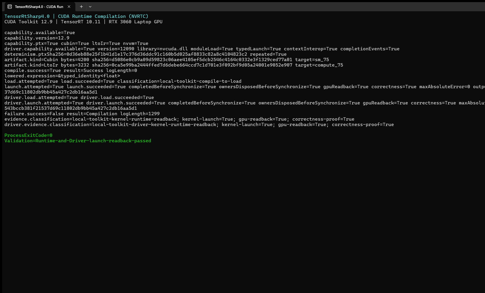

# 在 C# 中使用 TensorRT CSharp API v4.0 动态编译并运行 CUDA Kernel

<!-- public-article-layout:start -->
<style>
.content article { min-width: 0; overflow-wrap: anywhere; }
.content article a, .content article :not(pre) > code { overflow-wrap: anywhere; word-break: break-word; }
.content article pre:not(.mermaid), .content article table { display: block; max-width: 100%; overflow-x: auto; }
.content pre.mermaid { max-width: 640px; margin: 16px auto; overflow-x: auto; }
.content pre.mermaid svg { display: block; width: 100%; max-width: 640px; height: auto; }
</style>
<!-- public-article-layout:end -->

CUDA Runtime Compilation 适合在运行时生成或组合 Kernel，而不是为每一种参数组合预先构建本机二进制。完整流程不只是把一段 CUDA C 字符串交给 NVRTC：程序还要发现编译器能力、传入虚拟头文件和选项、保存编译日志、复制 PTX/CUBIN/LTO IR、加载 Module、按 ABI 组织 Kernel 参数、提交到 Stream，并把 GPU 结果读回验证。

TensorRT CSharp API v4.0 4.0.0 的 `RuntimeCompilation` 示例同时覆盖 CUDA Runtime Library 和 CUDA Driver Module 两条启动路径。示例编译一个确定性的向量加法 Kernel，对 257 个 FP32 元素执行 GPU 计算，并用逐元素误差和输出 SHA256 检查结果；它还故意编译一段错误源码，证明失败日志不会在托管边界丢失。

> 本文是 TensorRT CSharp API v4.0 4.0.0 Samples 系列的 `SMP-006`，对应源码 `samples/Cuda/01.RuntimeCompilation`。本示例不依赖 ONNX 或 TensorRT Engine，但仍通过 TensorRT CSharp API v4.0 的 CUDA API 和目标 Bridge 进入真实 CUDA/NVRTC 运行时。

## 1. 前言
<!-- public-article-project-preface:start -->
TensorRT CSharp API v4.0 是一个面向 C#/.NET 开发者的 TensorRT 与 CUDA 工程化接口项目。它把 NVIDIA 原生运行时、生成式绑定、C++ Bridge、托管对象模型和可验证的示例程序组织成一条完整链路，使使用者可以在熟悉的 .NET 项目中完成 Engine 构建、反序列化、ExecutionContext 管理、CUDA 内存操作、异步流同步和结果校验。项目的目标不是隐藏 TensorRT 的概念，而是把这些概念转换为有明确生命周期、所有权和错误边界的 C# API。

4.0.0 是一次完整重构后的正式版本。核心接口、Bridge 边界、Runtime 包命名、样例目录和验证方式都以 4.x 设计为准，不能把 3.x 的类型名、旧包名或旧 DLL 目录直接复制到新项目。托管包只提供项目接口和自有 Bridge；TensorRT、CUDA、cuDNN、显卡驱动以及对应许可证仍由使用者按目标平台安装和管理。

单篇文章也应能够独立阅读：读者可以先从项目入口确认源码和包，再根据本文的程序路径准备依赖，最后用输出中的状态、计数、Shape、哈希或结果图片判断流程是否真的完成。对于尚未具备兼容 GPU 的环境，本文会把静态检查、期望输出和真实运行结果分开标记，不把帮助命令或 build-only 结果包装成推理成功。

项目、包和源码入口（以下地址保留明文，便于复制到不完整支持 Markdown 链接的平台）：

项目主页：

```text
https://github.com/guojin-yan/TensorRT-CSharp-API/tree/TensorRtSharp4.0
```

核心 NuGet：

```text
https://www.nuget.org/packages/JYPPX.TensorRT.CSharp.API/4.0.0
```

Runtime Bridge 包列表：

```text
https://www.nuget.org/packages?q=+JYPPX.TensorRT.CSharp&includeComputedFrameworks=true&prerel=true&sortby=relevance
```

运行库清单：

```text
https://github.com/guojin-yan/TensorRT-CSharp-API/blob/TensorRtSharp4.0/pack/runtime/runtime-packages.manifest.json
```

### 1.1 程序出处与输出说明

本文涉及的程序、脚本或命令均以仓库中的实现为准；对应源码入口：

```text
https://github.com/guojin-yan/TensorRT-CSharp-API/tree/TensorRtSharp4.0/samples
```

运行示例必须同时给出程序输出和判定标准。终端中的 `status`、`Ready`、`Bound`、`enqueueCount`、`OutputMatch`、进程退出码、报告文件或结果图片分别说明不同层次的事实；只有明确写出这些结果，读者才能区分程序启动、Engine 构建、GPU enqueue 和业务结果语义。
<!-- public-article-project-preface:end -->

### 1.2 项目简介

TensorRT CSharp API v4.0 不只封装 TensorRT 推理接口，也提供显存、Stream、Event、Driver Module、Kernel 参数和 NVRTC 等 CUDA 能力。这样，C# 应用可以把预处理、后处理、数据重排或业务自定义算子放在 GPU 上执行，并与 TensorRT 使用同一套显式资源生命周期。

Runtime Compilation 的价值在于灵活，但代价是部署环境必须具备匹配的 NVRTC，源码和编译选项也成为运行时合同的一部分。编译成功仅说明生成了某种产物，不能替代 Module 加载、Kernel 启动和结果读回。

### 1.3 项目链接与包列表

| 项目内容 | 入口 |
| --- | --- |
| 项目源码 | TensorRT-CSharp-API 4.0 分支：<https://github.com/guojin-yan/TensorRT-CSharp-API/tree/TensorRtSharp4.0> |
| 本文案例源码 | samples/Cuda/01.RuntimeCompilation：<https://github.com/guojin-yan/TensorRT-CSharp-API/tree/TensorRtSharp4.0/samples/Cuda/01.RuntimeCompilation> |
| 程序入口 | Program.cs：<https://github.com/guojin-yan/TensorRT-CSharp-API/blob/TensorRtSharp4.0/samples/Cuda/01.RuntimeCompilation/Program.cs> |
| 中文案例说明 | README.zh-CN.md：<https://github.com/guojin-yan/TensorRT-CSharp-API/blob/TensorRtSharp4.0/samples/Cuda/01.RuntimeCompilation/README.zh-CN.md> |
| 核心 NuGet | JYPPX.TensorRT.CSharp.API 4.0.0：<https://www.nuget.org/packages/JYPPX.TensorRT.CSharp.API/4.0.0> |
| Runtime Bridge | NuGet 包列表：<https://www.nuget.org/packages?q=+JYPPX.TensorRT.CSharp&includeComputedFrameworks=true&prerel=true&sortby=relevance> |

| 依赖 | 责任边界 |
| --- | --- |
| `JYPPX.TensorRT.CSharp.API` | 提供 `JYPPX.CudaSharp` 托管 API |
| 目标 `*.Bridge` | 提供项目自有 native bridge，不携带 NVIDIA 厂商库 |
| CUDA Driver/Runtime | GPU 上下文、内存、Stream、Module 和 Kernel 执行 |
| NVRTC | 在运行时把 CUDA C/C++ 源码编译为 PTX/CUBIN/LTO IR |

### 1.4 本文结构

本文从环境探测开始，依次讲解编译输入、虚拟头文件、名称表达式、产物复制、Runtime/Driver 两条启动路径、受控失败和当前真实结果。重点是建立“编译、加载、启动、同步、读回、数值检查”的完整证据链。

## 2. 示例要解决的问题

该示例同时验证以下能力：

1. 能发现本机 NVRTC 和 CUDA Driver，并输出版本与能力。
2. 能把主源码、内存中的虚拟头文件和编译选项传给 NVRTC。
3. 能取得 PTX、CUBIN、LTO IR 以及模板 Kernel 的 lowered name。
4. 相同输入重复编译时，PTX SHA256 保持一致。
5. PTX 能通过 Runtime Library 路径加载并启动 Kernel。
6. 同一 PTX 能通过 Driver Module 路径加载并启动 Kernel。
7. 两条路径都能读回 257 个元素，最大绝对误差为 0。
8. 故意错误的源码会返回明确编译失败和非空日志。

这些检查比“`Compile` 返回 Success”更严格。真正的 GPU 运行结论必须看到 `launch.succeeded=True`、`gpuReadback=True` 和 `correctness=True`。

## 3. 环境与安装

### 3.1 运行要求

| 组件 | 要求 |
| --- | --- |
| .NET | .NET 8 SDK 或更高兼容 SDK |
| GPU/Driver | 支持目标 CUDA 的 NVIDIA GPU 与驱动 |
| CUDA Toolkit | 包含与目标组合匹配的 NVRTC 动态库 |
| 托管包 | `JYPPX.TensorRT.CSharp.API` `4.0.0` |
| Bridge | 与 OS/RID/CUDA 组合匹配的唯一 `*.Bridge` `4.0.0` |
| ONNX/模型 | 不需要 |

Bridge 不会携带 `nvrtc64_*.dll` 或 `libnvrtc.so`。这是有意的依赖边界：NVIDIA 厂商运行库由用户按其许可和目标环境安装，项目包只提供互操作层。

### 3.2 安装示例

下面仍以 Windows x64、TensorRT 10.11、CUDA 12.9、cuDNN 9.22 组合为例。虽然本示例不创建 TensorRT Engine，Bridge 包仍按完整 ABI 组合命名：

```powershell
dotnet add package JYPPX.TensorRT.CSharp.API --version 4.0.0
dotnet add package JYPPX.TensorRT.CSharp.API.Runtime.win-x64.trt10.11.cuda12.9.cudnn9.22.Bridge --version 4.0.0
```

源码仓库开发验证可显式指定本地 Bridge 和 NVRTC：

```powershell
$env:JYPPX_NATIVE_BRIDGE_PATH = '<jyppxtrtbridge.dll 的完整路径>'
$env:JYPPX_NVRTC_LIBRARY = '<nvrtc64_120_0.dll 的完整路径>'
$env:JYPPX_ENABLE_DEVELOPMENT_PROBING = '1'
```

这些环境变量应指向文件本身。业务应用优先通过精确的 Runtime 包部署 Bridge，不应依赖机器上偶然出现的同名 DLL。

## 4. 先检查离线帮助

```powershell
dotnet run --project .\samples\Cuda\01.RuntimeCompilation -- --help
```

帮助分支不会探测 CUDA 或加载 NVRTC。它只能证明项目已经还原、编译并进入参数入口，不能证明 GPU 或编译器可用。

## 5. Kernel 与编译输入

示例的核心 Kernel 对两组向量相加，再乘以虚拟头文件定义的比例：

```c
#include "scale.cuh"

extern "C" __global__ void vector_add(
    const float* left,
    const float* right,
    float* output,
    int count)
{
    int index = (int)(blockIdx.x * blockDim.x + threadIdx.x);
    if (index < count)
    {
        output[index] = (left[index] + right[index]) * SAMPLE_SCALE;
    }
}
```

`scale.cuh` 不需要写入磁盘，而是作为虚拟头文件传给编译器：

```csharp
var source = new CudaRtcProgramSource(
    sourceText,
    "runtime-compilation-sample.cu",
    new[] {
        new CudaRtcHeader("scale.cuh", "#define SAMPLE_SCALE 2.0f\n")
    },
    new[] { "&typed_identity<float>" });
```

这说明编译输入不只是 `sourceText`。主文件名、虚拟头文件、名称表达式和所有编译选项都应参与缓存键或审计记录，否则不同输入可能错误复用同一产物。

## 6. 先探测能力，再决定路径

```csharp
CudaRtcCapability rtc = CudaRtcCompiler.GetCapability();
CudaDriverCapability driver = CudaDriver.GetCapability();

if (!rtc.IsAvailable)
{
    Console.Error.WriteLine(rtc.DependencyDiagnostic);
    return 2;
}

if (!driver.IsAvailable)
{
    Console.Error.WriteLine(driver.DependencyDiagnostic);
    return 10;
}
```

能力对象会给出已加载库、版本和 PTX/CUBIN/LTO IR 等支持状态。探测成功不等于编译成功，编译成功也不等于产物能被当前 Driver 加载；文章和自动化需要保留每一层的独立结论。

## 7. 编译并复制产物

```csharp
var options = new CudaRtcCompileOptions(
    targetArchitecture: "compute_75",
    generateLineInfo: true);

CudaRtcCompilationResult result =
    CudaRtcCompiler.Compile(source, options);

CudaRtcArtifact? ptx =
    result.FindArtifact(CudaRtcArtifactKind.Ptx);
```

使用 `compute_75` 生成 PTX，使用真实 SM 目标 `sm_75` 生成 CUBIN；本机 NVRTC 支持时还会请求 LTO IR。托管对象保存的是从 NVRTC 复制出来的字节、长度、目标架构和 SHA256，不在编译对象释放后继续暴露原生临时指针。

示例还会对完全相同的输入重复编译，并比较 PTX SHA256：

```csharp
CudaRtcCompilationResult repeated =
    CudaRtcCompiler.Compile(source, options);

bool deterministic = string.Equals(
    ptx.Sha256,
    repeated.FindArtifact(CudaRtcArtifactKind.Ptx)?.Sha256,
    StringComparison.Ordinal);
```

确定性哈希适用于“相同源码、头文件、选项和工具链”的复查，不能跨 NVRTC 版本或架构目标推断产物一定相同。

## 8. Runtime Library 启动路径

```csharp
using CudaKernelLibrary library = CudaKernelLibrary.Load(ptx.ToArray());
using CudaMemory left = new CudaMemory(elementCount * sizeof(float));
using CudaMemory right = new CudaMemory(elementCount * sizeof(float));
using CudaMemory output = new CudaMemory(elementCount * sizeof(float));
using CudaStream stream = new CudaStream();

var configuration = new CudaKernelLaunchConfiguration(
    new CudaDim3((uint)((elementCount + 127) / 128)),
    new CudaDim3(128));

using CudaKernelLaunch launch = library.Launch(
    "vector_add",
    configuration,
    stream,
    CudaKernelArgument.FromDeviceMemory(left),
    CudaKernelArgument.FromDeviceMemory(right),
    CudaKernelArgument.FromDeviceMemory(output),
    CudaKernelArgument.FromInt32(elementCount));

launch.Synchronize();
```

Kernel 参数顺序、指针类型和标量宽度必须与 CUDA C 签名完全一致。`CudaKernelArgument` 显式表达参数类型，避免业务代码手工拼接不透明指针数组。

示例还验证 owner-bound launch：即使调用方先对 Library、Stream 和显存 owner 请求释放，Launch 对象仍维持异步工作完成所需的生命周期，直到 `Synchronize` 结束。不要在自定义封装中假定 `Launch` 返回就代表 GPU 已完成。

## 9. Driver Module 启动路径

同一 PTX 还会通过 `CudaDriverModule` 运行一次：

```csharp
using CudaDriverModule module = CudaDriverModule.Load(ptx.ToArray());
using CudaDriverKernelLaunch launch = module.Launch(
    "vector_add",
    configuration,
    stream,
    CudaKernelArgument.FromDeviceMemory(left),
    CudaKernelArgument.FromDeviceMemory(right),
    CudaKernelArgument.FromDeviceMemory(output),
    CudaKernelArgument.FromInt32(elementCount));

launch.Synchronize();
```

Runtime Library 与 Driver Module 是两条不同入口。两者输出相同，能提高本例对参数封送、Module 加载和 GPU 计算的信心，但不能据此推断所有 Kernel 在所有驱动上都表现一致。

## 10. 为什么要保留受控编译失败

```csharp
var broken = new CudaRtcProgramSource(
    "extern \"C\" __global__ void intentionally_broken( {\n",
    "intentional-failure.cu");

CudaRtcCompilationResult failure =
    CudaRtcCompiler.Compile(broken, options);
```

示例要求结果为 `Compilation`、`Success=false` 且日志非空。没有这条负例，只能确认成功路径；加入它后还能确认 NVRTC 的诊断文本被安全复制到托管层，业务程序可以保存错误位置和原因。

## 11. 编译与运行

```powershell
dotnet restore .\samples\Cuda\01.RuntimeCompilation\CudaRuntimeCompilation.csproj
dotnet build .\samples\Cuda\01.RuntimeCompilation\CudaRuntimeCompilation.csproj `
  -c Release --no-restore /p:UseSharedCompilation=false
dotnet run `
  --project .\samples\Cuda\01.RuntimeCompilation\CudaRuntimeCompilation.csproj `
  -c Release --no-build
```

如果目标 GPU 不支持示例中的 `compute_75`/`sm_75`，应根据部署架构调整编译目标，并把目标值纳入产物缓存键和运行记录。不能因为某个 PTX 在一台 GPU 上可加载，就忽略目标环境的 Driver/JIT 约束。

## 12. 本次真实运行结果

2026-08-11 在 Windows、RTX 3060 Laptop GPU、驱动 576.02、CUDA/NVRTC 12.9 上重新运行当前源码，进程返回 0。核心输出如下：

```text
capability.available=True
capability.version=12.9
driver.capability.available=True version=12090
determinism.ptxSha256=0d36eb88... repeated=True
artifact.kind=Cubin bytes=4200 target=sm_75
artifact.kind=LtoIr bytes=3232 target=compute_75
compile.success=True result=Success logLength=0
load.succeeded=True
launch.succeeded=True gpuReadback=True correctness=True maxAbsoluteError=0
driver.load.succeeded=True
driver.launch.succeeded=True gpuReadback=True correctness=True maxAbsoluteError=0
failure.success=False result=Compilation logLength=1299
```



上图是该案例同一 CUDA 12.9 环境下归档的真实终端记录；正文数值已在 2026-08-11 使用当前源码重新执行核对。判断结果时以结构化字段和当前 stdout 为准，而不是只看截图中的最后一行。

| 检查项 | 当前结果 | 结论 |
| --- | --- | --- |
| NVRTC | 12.9，可用 | 编译器动态库成功加载 |
| PTX 重复编译 | SHA256 相同 | 当前输入与工具链下保持确定性 |
| CUBIN/LTO IR | 4200/3232 字节 | 对应产物已复制到托管层 |
| Runtime 启动 | 通过 | Kernel 完成并读回 257 个元素 |
| Driver 启动 | 通过 | Driver Module 路径得到相同输出 |
| 最大绝对误差 | 0 | 两条路径均与 CPU 预期逐值一致 |
| 输出 SHA256 | 两条路径相同 | 读回字节一致 |
| 受控失败日志 | 1299 字符 | 编译错误诊断没有丢失 |

## 13. 常见问题

### 13.1 `capability.available=False`

检查 CUDA Toolkit 是否安装、进程位数是否正确，以及 `JYPPX_NVRTC_LIBRARY` 是否指向实际文件。只有 CUDA Driver 而没有 Toolkit/NVRTC 时，普通 CUDA 程序可能能运行，但 RTC 编译不可用。

### 13.2 找不到 CUDA 内建头文件或 builtins

NVRTC 主库与其配套 builtins 必须来自同一 Toolkit 安装。不要只复制一个 `nvrtc` DLL 到应用目录后混用另一版本的内建资源。

### 13.3 PTX 编译成功但 Module 无法加载

检查目标 `compute_*` 是否被当前 Driver 支持、Driver 是否足够新、PTX ISA 是否兼容，以及进程是否使用预期的 GPU。编译端成功不证明加载端兼容。

### 13.4 Kernel 启动成功但输出错误

逐项检查参数顺序、标量宽度、元素数、Grid/Block、主机到设备复制和同步位置。先保留输入/输出 SHA256 与最大误差，再定位是哪一个元素开始偏离。

### 13.5 为什么不能把本次结果写成性能数据

示例没有预热、重复次数、统计分布、频率控制或对照实现。它验证正确性和生命周期，不构成 Kernel 性能基准。

## 14. 结论与证据边界

本文完成了 TensorRT CSharp API v4.0 4.0.0 的 CUDA Runtime Compilation 闭环：能力探测、虚拟头文件、名称表达式、PTX/CUBIN/LTO IR、确定性哈希、Runtime/Driver 两条启动路径、GPU 读回和受控编译失败。

2026-08-11 的结论属于当前 Windows/CUDA 12.9 源码树运行，证据分类为本地工具链 Kernel runtime readback。它不证明 Linux、其他 CUDA/NVRTC 版本或所有 GPU 架构，也不是公开包消费者或 post-publish proof。示例没有 ONNX、模型精度或 TensorRT Engine 结论，也没有执行任何发布操作。

## 15. 延伸阅读

- SMP-007：CUDA 多流与 Event 同步：<https://github.com/guojin-yan/TensorRT-CSharp-API/blob/TensorRtSharp4.0/docs/articles/zh-cn/02-samples/smp-007-cuda-multistream.md>
- SMP-001：系列案例总览与学习路线：<https://github.com/guojin-yan/TensorRT-CSharp-API/blob/TensorRtSharp4.0/docs/articles/zh-cn/02-samples/smp-001-sample-series-overview.md>
- Windows 安装与首个推理：<https://github.com/guojin-yan/TensorRT-CSharp-API/blob/TensorRtSharp4.0/docs/articles/zh-cn/05-installation/windows/msc-003-windows-installation.md>
- 托管包与 Bridge 运行时包如何选择：<https://github.com/guojin-yan/TensorRT-CSharp-API/blob/TensorRtSharp4.0/docs/articles/zh-cn/05-installation/packages/msc-004-managed-and-bridge-package-selection.md>

<!-- public-article-declaration:start -->
## 16. 文章声明

### 16.1 开源协议声明
作者所有开源项目代码均遵循 Apache License 2.0 开源协议。
特别说明：本项目集成了若干第三方库。若任何第三方库的许可协议与 Apache 2.0 协议存在冲突或不一致，均以该第三方库的原始许可协议为准。本项目不包含也不代表这些第三方库的授权声明，使用前请务必阅读并遵守第三方库的相关许可。

### 16.2 代码开发与质量说明
AI 辅助开发：本代码在开发过程中使用了人工智能（AI）辅助生成与优化，并非完全由人工逐行编写。
安全性承诺：作者郑重声明，本代码中绝无任何有意设置的后门、病毒、木马或旨在破坏用户设备、窃取数据的恶意代码。
技术局限性：受限于作者个人的技术水平与能力，代码中可能存在因逻辑不严谨、优化不足或经验欠缺导致的低级问题（例如但不限于内存泄漏、偶发崩溃、资源未释放等）。这些问题纯属能力不足所致，并非主观故意。
测试范围：由于作者精力有限，未对本软件进行全方位、覆盖所有边缘场景的完整测试。

### 16.3 免责声明（重要）
请在将本代码应用于任何实际项目（特别是商业、工业或关键任务环境）之前，务必进行详尽、严格的自行测试与验证。 鉴于上述可能存在的代码缺陷及测试覆盖不足，因使用本代码而导致的任何直接或间接损失（包括但不限于设备故障、数据丢失、系统瘫痪或利润损失等），本作者概不负责。 一旦您开始使用本代码，即表示您已知晓上述风险并同意自行承担一切后果，相关问题与本作者无关。

### 16.4 代码开源范围
本项目承诺核心逻辑代码完全开源，但上述提到的“第三方库”的二进制文件、源代码或相关资源不在本项目的开源义务范围内，请根据其各自的指引获取。

### 16.5 社区与反馈
尽管存在上述不足，我们仍欢迎大家下载使用、提交 Issue 或参与测试，共同完善项目。如果您在使用过程中发现 Bug、内存溢出或有改进建议，欢迎通过项目主页提供的联系方式与作者取得联系，我们将尽力在有限的时间内提供协助。


<!-- public-article-declaration:end -->
