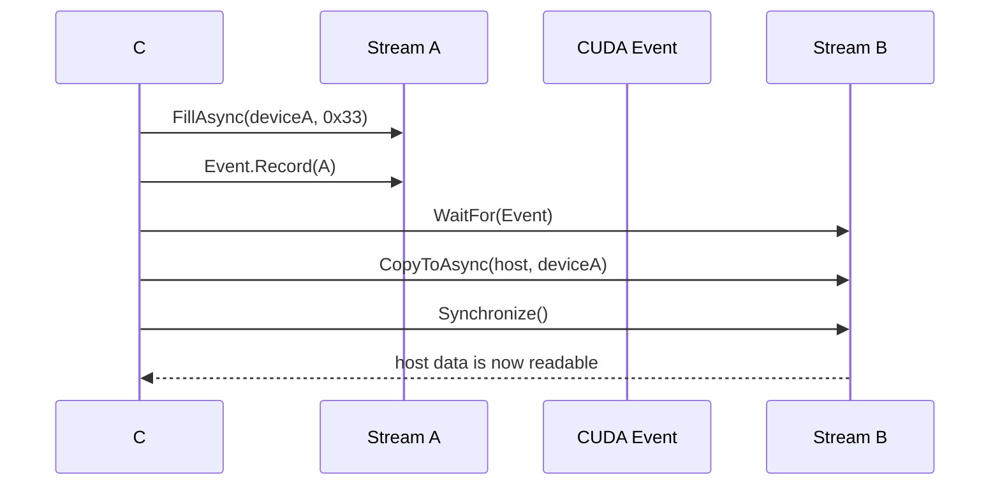

# 使用 TensorRT CSharp API v4.0 实现 CUDA 多流与 Event 同步

<!-- public-article-layout:start -->
<style>
.content article { min-width: 0; overflow-wrap: anywhere; }
.content article a, .content article :not(pre) > code { overflow-wrap: anywhere; word-break: break-word; }
.content article pre:not(.mermaid), .content article table { display: block; max-width: 100%; overflow-x: auto; }
.content pre.mermaid { max-width: 640px; margin: 16px auto; overflow-x: auto; }
.content pre.mermaid svg { display: block; width: 100%; max-width: 640px; height: auto; }
</style>
<!-- public-article-layout:end -->

CUDA Stream 允许主机按队列提交异步工作，但“使用了两条 Stream”并不自动意味着正确并发，更不等于性能一定提升。数据生产和消费跨越不同 Stream 时，必须用 Event 或其他同步机制建立依赖；主机读取结果前也必须等待对应工作完成。否则程序可能偶尔得到正确数据，却在负载或硬件变化后暴露竞态。

TensorRT CSharp API v4.0 4.0.0 的 `MultiStream` 示例用两个确定性阶段说明这件事：第一阶段在两条非阻塞 Stream 上独立填充并读回两块显存；第二阶段由 Stream A 写入数据并记录 Event，Stream B 等待该 Event 后再读取同一块显存。程序逐字节检查结果，只有独立路径和跨流路径都正确才输出 `MultiStream Passed=True`。

> 本文是 TensorRT CSharp API v4.0 4.0.0 Samples 系列的 `SMP-007`，对应源码 `samples/Performance/01.MultiStream`。它是 CUDA 正确性与同步教程，不是吞吐性能基准，也不创建 TensorRT Engine。

## 1. 前言
<!-- public-article-project-preface:start -->
TensorRT CSharp API v4.0 是一个面向 C#/.NET 开发者的 TensorRT 与 CUDA 工程化接口项目。它把 NVIDIA 原生运行时、生成式绑定、C++ Bridge、托管对象模型和可验证的示例程序组织成一条完整链路，使使用者可以在熟悉的 .NET 项目中完成 Engine 构建、反序列化、ExecutionContext 管理、CUDA 内存操作、异步流同步和结果校验。项目的目标不是隐藏 TensorRT 的概念，而是把这些概念转换为有明确生命周期、所有权和错误边界的 C# API。

4.0.0 是一次完整重构后的正式版本。核心接口、Bridge 边界、Runtime 包命名、样例目录和验证方式都以 4.x 设计为准，不能把 3.x 的类型名、旧包名或旧 DLL 目录直接复制到新项目。托管包只提供项目接口和自有 Bridge；TensorRT、CUDA、cuDNN、显卡驱动以及对应许可证仍由使用者按目标平台安装和管理。

单篇文章也应能够独立阅读：读者可以先从项目入口确认源码和包，再根据本文的程序路径准备依赖，最后用输出中的状态、计数、Shape、哈希或结果图片判断流程是否真的完成。对于尚未具备兼容 GPU 的环境，本文会把静态检查、期望输出和真实运行结果分开标记，不把帮助命令或 build-only 结果包装成推理成功。

项目、包和源码入口（以下地址保留明文，便于复制到不完整支持 Markdown 链接的平台）：

项目主页：

```text
https://github.com/guojin-yan/TensorRT-CSharp-API/tree/TensorRtSharp4.0
```

核心 NuGet：

```text
https://www.nuget.org/packages/JYPPX.TensorRT.CSharp.API/4.0.0
```

Runtime Bridge 包列表：

```text
https://www.nuget.org/packages?q=+JYPPX.TensorRT.CSharp&includeComputedFrameworks=true&prerel=true&sortby=relevance
```

运行库清单：

```text
https://github.com/guojin-yan/TensorRT-CSharp-API/blob/TensorRtSharp4.0/pack/runtime/runtime-packages.manifest.json
```

### 1.1 程序出处与输出说明

本文涉及的程序、脚本或命令均以仓库中的实现为准；对应源码入口：

```text
https://github.com/guojin-yan/TensorRT-CSharp-API/tree/TensorRtSharp4.0/samples
```

运行示例必须同时给出程序输出和判定标准。终端中的 `status`、`Ready`、`Bound`、`enqueueCount`、`OutputMatch`、进程退出码、报告文件或结果图片分别说明不同层次的事实；只有明确写出这些结果，读者才能区分程序启动、Engine 构建、GPU enqueue 和业务结果语义。
<!-- public-article-project-preface:end -->

### 1.2 项目简介

TensorRT CSharp API v4.0 为 C#/.NET 提供 TensorRT 与 CUDA 的托管接口。除模型推理外，库中的 `CudaStream`、`CudaEvent`、`CudaMemory` 和 `CudaPinnedMemory` 可以用于异步数据传输、预处理、后处理以及多请求调度。

多流程序最难的通常不是创建对象，而是明确“谁生产数据、谁消费数据、依赖在哪条流上记录、主机在何时可以读取、资源最早何时能释放”。本例先用最小的 4096 字节工作负载把这些关系做成可验证输出，再把同样的原则映射到 TensorRT 推理场景。

### 1.3 项目链接与包列表

| 项目内容 | 入口 |
| --- | --- |
| 项目源码 | TensorRT-CSharp-API 4.0 分支：<https://github.com/guojin-yan/TensorRT-CSharp-API/tree/TensorRtSharp4.0> |
| 本文案例源码 | samples/Performance/01.MultiStream：<https://github.com/guojin-yan/TensorRT-CSharp-API/tree/TensorRtSharp4.0/samples/Performance/01.MultiStream> |
| 程序入口 | Program.cs：<https://github.com/guojin-yan/TensorRT-CSharp-API/blob/TensorRtSharp4.0/samples/Performance/01.MultiStream/Program.cs> |
| 中文案例说明 | README.zh-CN.md：<https://github.com/guojin-yan/TensorRT-CSharp-API/blob/TensorRtSharp4.0/samples/Performance/01.MultiStream/README.zh-CN.md> |
| 核心 NuGet | JYPPX.TensorRT.CSharp.API 4.0.0：<https://www.nuget.org/packages/JYPPX.TensorRT.CSharp.API/4.0.0> |
| Runtime Bridge | NuGet 包列表：<https://www.nuget.org/packages?q=+JYPPX.TensorRT.CSharp&includeComputedFrameworks=true&prerel=true&sortby=relevance> |

所有示例代码通过 `JYPPX.TensorRT.CSharp.API 4.0.0` 使用 `JYPPX.CudaSharp`。真实 GPU 运行还需要唯一一个匹配 OS、RID、TensorRT、CUDA 和 cuDNN 组合的 Bridge，以及用户安装的 NVIDIA 驱动和 CUDA 运行库。

### 1.4 本文结构

本文先解释 Stream/Event 的顺序语义，然后分解独立流与跨流等待代码，给出安装和运行命令、当前真实结果、与 TensorRT ExecutionContext 的关系以及常见错误。全文只讨论正确性，不根据单次运行推导性能收益。

## 2. Stream 和 Event 分别解决什么问题

`CudaStream` 表示设备工作队列。同一条 Stream 中的操作按提交顺序执行，不同 Stream 之间默认没有全局先后关系。`CudaEvent` 可以记录某条 Stream 到达的时间点，另一个 Stream 再等待该 Event，从而在设备侧建立依赖。



关键点是 Event 记录在生产者 Stream A，等待发生在消费者 Stream B。若只在主机上创建 Event，却没有 `Record`，或让错误的 Stream 等待，依赖就没有建立。

## 3. 环境与安装

### 3.1 运行要求

| 组件 | 要求 |
| --- | --- |
| .NET | .NET 8 SDK 或更高兼容 SDK |
| GPU/Driver | 可运行目标 CUDA 组合的 NVIDIA GPU 与驱动 |
| CUDA | 与所选 Bridge 包名中的版本一致 |
| 托管包 | `JYPPX.TensorRT.CSharp.API` `4.0.0` |
| Bridge | 与当前 OS/RID/厂商库精确匹配的一个 `*.Bridge` `4.0.0` |
| ONNX/TensorRT Engine | 不需要 |

### 3.2 安装示例

以下仍以 Windows x64、TensorRT 10.11、CUDA 12.9、cuDNN 9.22 组合为例：

```powershell
dotnet add package JYPPX.TensorRT.CSharp.API --version 4.0.0
dotnet add package JYPPX.TensorRT.CSharp.API.Runtime.win-x64.trt10.11.cuda12.9.cudnn9.22.Bridge --version 4.0.0
```

虽然本例只调用 CUDA，Bridge 包仍按完整发行矩阵命名。不要安装多个 Bridge 来“自动匹配”，也不要把另一个 CUDA 版本的 Bridge 与当前进程加载的运行库混用。

## 4. 先检查离线帮助和环境探测

```powershell
dotnet run --project .\samples\Performance\01.MultiStream -- --help
```

帮助分支不会创建 Stream 或访问 GPU。真实运行首先调用 `CudaEnvironmentProbe.GetCurrent()`：

```csharp
CudaEnvironmentSnapshot snapshot;
try
{
    snapshot = CudaEnvironmentProbe.GetCurrent();
}
catch (CudaException exception)
{
    Console.WriteLine($"MultiStream=Skipped Reason={exception.Message}");
    return 0;
}
```

`Skipped` 是部署诊断，不是测试通过。自动化中应同时检查输出分类，不能因为进程返回 0 就把缺少 CUDA 的机器记为成功运行。

## 5. 第一阶段：两条独立 Stream

### 5.1 创建资源并限制生命周期

```csharp
using CudaStream streamA =
    new CudaStream(CudaStreamCreationFlags.NonBlocking);
using CudaStream streamB =
    new CudaStream(CudaStreamCreationFlags.NonBlocking);
using CudaMemory deviceA = new CudaMemory(4096);
using CudaMemory deviceB = new CudaMemory(4096);
using CudaPinnedMemory hostA = new CudaPinnedMemory(4096);
using CudaPinnedMemory hostB = new CudaPinnedMemory(4096);
using CudaEvent eventA = new CudaEvent();
using CudaEvent eventB = new CudaEvent();
```

Pinned host memory 适合参与异步拷贝，因为运行时不需要临时固定普通托管数组。显存、固定内存、Stream 和 Event 都持有原生资源，应在异步工作完成后确定性释放。

### 5.2 独立提交写入和读回

```csharp
deviceA.FillAsync(0x11, 4096, streamA);
deviceB.FillAsync(0x22, 4096, streamB);
deviceA.CopyToAsync(hostA, 4096, streamA);
deviceB.CopyToAsync(hostB, 4096, streamB);
eventA.Record(streamA);
eventB.Record(streamB);
eventA.Synchronize();
eventB.Synchronize();
```

两组操作分别在自己的 Stream 中保持顺序：填充先于拷贝。主机在两个 Event 同步后再读取 `hostA` 和 `hostB`，逐字节检查是否分别为 `0x11` 和 `0x22`。

这里验证的是两条独立队列都产生正确结果，不证明它们在时间线上有多少重叠。要证明并发或吞吐收益，需要更大的工作负载、时间线工具、预热和统计测试。

## 6. 第二阶段：跨 Stream Event 等待

```csharp
using CudaPinnedMemory orderedHost = new CudaPinnedMemory(4096);
using CudaEvent orderingEvent = new CudaEvent();

deviceA.FillAsync(0x33, 4096, streamA);
orderingEvent.Record(streamA);
streamB.WaitFor(orderingEvent);
deviceA.CopyToAsync(orderedHost, 4096, streamB);
streamB.Synchronize();
```

这段代码包含完整的生产者/消费者关系：

1. Stream A 异步把 `deviceA` 写成 `0x33`。
2. Event 在 Stream A 中记录，表示此前写入已到达同步点。
3. Stream B 等待 Event。
4. Stream B 把 `deviceA` 复制到 `orderedHost`。
5. 主机同步 Stream B 后再读取结果。

若省略第 2 或第 3 步，Stream B 可能在 Stream A 写完之前读取；若省略第 5 步，CPU 可能在异步复制完成前访问固定内存。

## 7. 为什么不用全局同步

设备级同步可以粗暴地让所有工作结束，但它会扩大等待范围，掩盖真正的数据依赖。Event 让消费者只等待所需生产者的某个时间点，其他无关 Stream 仍可继续执行。

正确的设计原则是：

- 同一数据链尽量在同一 Stream 内保持自然顺序；
- 跨 Stream 共享数据时，用 Event 表达最小依赖；
- 只有主机确实要读取或复用资源时才同步；
- 生命周期至少覆盖最后一个异步使用者；
- 不依赖默认 Stream 的隐式行为来修复错误顺序。

## 8. 编译与运行

```powershell
dotnet restore .\samples\Performance\01.MultiStream\MultiStream.csproj
dotnet build .\samples\Performance\01.MultiStream\MultiStream.csproj `
  -c Release --no-restore /p:UseSharedCompilation=false
dotnet run `
  --project .\samples\Performance\01.MultiStream\MultiStream.csproj `
  -c Release --no-build
```

源码仓库验证本地 Bridge 时可以设置：

```powershell
$env:JYPPX_NATIVE_BRIDGE_PATH = '<与本机 ABI 匹配的 Bridge 文件>'
$env:JYPPX_ENABLE_DEVELOPMENT_PROBING = '1'
```

正式业务项目应通过匹配的 Bridge 包部署，并让 NVIDIA 动态库来自明确的目标安装目录。

## 9. 本次真实运行结果

2026-08-11 在 Windows、RTX 3060 Laptop GPU、驱动 576.02、CUDA 12.9 对应 Bridge 上重新运行当前源码，进程返回 0：

```text
Bridge=jyppxtrtbridge CUDA Toolkit=12.9 DeviceCount=1
IndependentStreams=True A=True B=True Bytes=4096
CrossStreamWait=True ProducerStream=NonBlocking ConsumerStream=NonBlocking
StreamIds A=13 B=14
MultiStream Passed=True
```


上图是该案例同一 GPU/CUDA 环境中归档的运行截图，2026-08-11 已用当前源码再次执行并得到相同的关键结论。Stream ID 是本次进程内的诊断值，不应写入长期断言。

| 检查项 | 当前结果 | 能证明什么 |
| --- | --- | --- |
| 设备数量 | 1 | CUDA Runtime 看到了当前 GPU |
| Stream A 读回 | 全部 `0x11` | A 队列的填充与异步复制顺序正确 |
| Stream B 读回 | 全部 `0x22` | B 队列的填充与异步复制顺序正确 |
| `IndependentStreams` | `True` | 两条独立数据路径均通过逐字节检查 |
| `CrossStreamWait` | `True` | B 等待 A 的 Event 后读到全部 `0x33` |
| `MultiStream Passed` | `True` | 两阶段正确性条件同时成立 |

这里没有记录毫秒数，也没有声称多流比单流更快。4096 字节工作负载用于可重复的同步验证，不适合推导生产吞吐。

## 10. 与 TensorRT 推理的关系

TensorRT 的 `EnqueueAsync` 同样接收 CUDA Stream。将多请求或预处理/推理/后处理放到多条 Stream 时，需要遵守相同规则：

- 输入拷贝必须在该次推理消费前完成；
- ExecutionContext、Bindings 和显存不能在 Enqueue 完成前复用或释放；
- 一个 ExecutionContext 不应被多个并发执行错误共享；
- 跨流传递 tensor 时，用 Event 建立显式依赖；
- 输出读回前同步对应的完成点，而不是依赖偶然时序。

本例没有创建 Engine 或 ExecutionContext，因此它只证明 CUDA Stream/Event 基础路径，不是 TensorRT 多 Context 并发或模型吞吐证明。

## 11. 常见问题

### 11.1 输出 `MultiStream=Skipped`

检查 Bridge、进程架构、NVIDIA Driver 和 CUDA Runtime。Skip 表示依赖不可用，不能在报告中归类为 `Passed`。

### 11.2 `IndependentStreams=False`

先分别检查 Fill/Copy 是否使用了同一条预期 Stream、字节数是否一致、Pinned Memory 是否在同步前被访问，以及显存是否提前释放或复用。

### 11.3 `CrossStreamWait=False`

确认 Event 在生产者写入之后记录，消费者 Stream 确实调用 `WaitFor`，并且主机在检查 `orderedHost` 前同步了消费者 Stream。

### 11.4 更换 Stream 后出现随机错误

检查是否有资源仍绑定旧 Stream、是否共享了非线程安全的 Context、是否漏掉跨流 Event，以及对象是否在异步操作完成前离开 `using` 作用域。

### 11.5 多流没有提速

并发收益受工作负载大小、拷贝方向、Pinned Memory、GPU 引擎数量、Kernel 占用、同步密度和 Context 设计影响。先用 Nsight Systems 等时间线工具确认是否真正重叠，再做预热、多次迭代和统计；不要从本例的正确性输出推断性能。

## 12. 结论与证据边界

本文用 TensorRT CSharp API v4.0 4.0.0 完成了两条非阻塞 CUDA Stream 的独立读回，以及生产者 Event 到消费者 Wait 的跨流顺序验证。当前运行确认 4096 字节的三组固定值全部正确读回。

2026-08-11 的结论属于当前 Windows/CUDA 12.9 源码树运行。它不是 TensorRT 推理、模型精度、Linux、公开包消费者或 post-publish proof，也不是多流性能基准。本文没有执行 NuGet、GitHub Release 或其他发布操作。

## 13. 延伸阅读

- SMP-006：动态编译并运行 CUDA Kernel：<https://github.com/guojin-yan/TensorRT-CSharp-API/blob/TensorRtSharp4.0/docs/articles/zh-cn/02-samples/smp-006-cuda-runtime-compilation.md>
- SMP-002：推理输入、显存绑定与 GPU 输出读回：<https://github.com/guojin-yan/TensorRT-CSharp-API/blob/TensorRtSharp4.0/docs/articles/zh-cn/02-samples/smp-002-inference-bindings.md>
- SMP-003：Dynamic Shape 与动态 Batch 推理：<https://github.com/guojin-yan/TensorRT-CSharp-API/blob/TensorRtSharp4.0/docs/articles/zh-cn/02-samples/smp-003-dynamic-shapes.md>
- 托管包与 Bridge 运行时包如何选择：<https://github.com/guojin-yan/TensorRT-CSharp-API/blob/TensorRtSharp4.0/docs/articles/zh-cn/05-installation/packages/msc-004-managed-and-bridge-package-selection.md>

<!-- public-article-declaration:start -->
## 14. 文章声明

### 14.1 开源协议声明
作者所有开源项目代码均遵循 Apache License 2.0 开源协议。
特别说明：本项目集成了若干第三方库。若任何第三方库的许可协议与 Apache 2.0 协议存在冲突或不一致，均以该第三方库的原始许可协议为准。本项目不包含也不代表这些第三方库的授权声明，使用前请务必阅读并遵守第三方库的相关许可。

### 14.2 代码开发与质量说明
AI 辅助开发：本代码在开发过程中使用了人工智能（AI）辅助生成与优化，并非完全由人工逐行编写。
安全性承诺：作者郑重声明，本代码中绝无任何有意设置的后门、病毒、木马或旨在破坏用户设备、窃取数据的恶意代码。
技术局限性：受限于作者个人的技术水平与能力，代码中可能存在因逻辑不严谨、优化不足或经验欠缺导致的低级问题（例如但不限于内存泄漏、偶发崩溃、资源未释放等）。这些问题纯属能力不足所致，并非主观故意。
测试范围：由于作者精力有限，未对本软件进行全方位、覆盖所有边缘场景的完整测试。

### 14.3 免责声明（重要）
请在将本代码应用于任何实际项目（特别是商业、工业或关键任务环境）之前，务必进行详尽、严格的自行测试与验证。 鉴于上述可能存在的代码缺陷及测试覆盖不足，因使用本代码而导致的任何直接或间接损失（包括但不限于设备故障、数据丢失、系统瘫痪或利润损失等），本作者概不负责。 一旦您开始使用本代码，即表示您已知晓上述风险并同意自行承担一切后果，相关问题与本作者无关。

### 14.4 代码开源范围
本项目承诺核心逻辑代码完全开源，但上述提到的“第三方库”的二进制文件、源代码或相关资源不在本项目的开源义务范围内，请根据其各自的指引获取。

### 14.5 社区与反馈
尽管存在上述不足，我们仍欢迎大家下载使用、提交 Issue 或参与测试，共同完善项目。如果您在使用过程中发现 Bug、内存溢出或有改进建议，欢迎通过项目主页提供的联系方式与作者取得联系，我们将尽力在有限的时间内提供协助。


<!-- public-article-declaration:end -->
