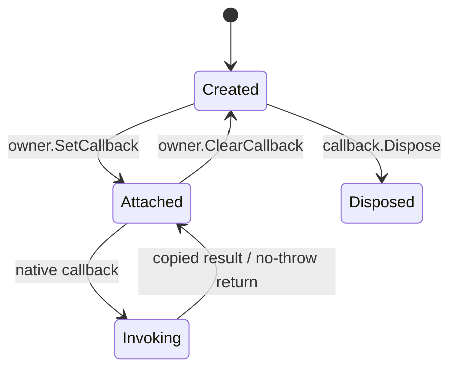

# TensorRT Callback 生命周期：Logger、Profiler、ProgressMonitor 与 DebugListener

<!-- public-article-layout:start -->
<style>
.content article { min-width: 0; overflow-wrap: anywhere; }
.content article a, .content article :not(pre) > code { overflow-wrap: anywhere; word-break: break-word; }
.content article pre:not(.mermaid), .content article table { display: block; max-width: 100%; overflow-x: auto; }
.content pre.mermaid { max-width: 640px; margin: 16px auto; overflow-x: auto; }
.content pre.mermaid svg { display: block; width: 100%; max-width: 640px; height: auto; }
</style>
<!-- public-article-layout:end -->

TensorRT Callback 看起来像“把一个 C# 委托传进去”，实际却跨越托管 GC、native owner、ABI 异常边界和异步执行。只要原生对象仍可能回调，托管 owner、delegate 和 native shim 就必须保持有效；可以解除的回调还要先从 BuilderConfig 或 ExecutionContext clear，再释放回调对象。错误顺序可能表现为回调计数为 0、进程异常、悬空指针或只在压力下出现的不稳定问题。

TensorRT CSharp API v4.0 4.0.0 的 `CallbackLifecycle` 示例把 Logger、ProgressMonitor、Profiler 和 DebugListener 放进同一个最小 TensorRT 流程：构建一个 `1x1` 卷积 Plan、执行一次 `1x1x2x2` FP32 推理、记录四类真实回调、复制必要元数据、显式 detach，并用结构化 JSON 保存调用次数、失败次数、输出一致性和释放顺序。

> 本文是 TensorRT CSharp API v4.0 4.0.0 Samples 系列的 `SMP-008`，对应源码 `samples/Diagnostics/01.CallbackLifecycle`。本组合示例要求 TensorRT 10 或 11；它不把 attach、帮助输出或主动 diagnostic shim 当作真实 callback invocation。

## 1. 前言
<!-- public-article-project-preface:start -->
TensorRT CSharp API v4.0 是一个面向 C#/.NET 开发者的 TensorRT 与 CUDA 工程化接口项目。它把 NVIDIA 原生运行时、生成式绑定、C++ Bridge、托管对象模型和可验证的示例程序组织成一条完整链路，使使用者可以在熟悉的 .NET 项目中完成 Engine 构建、反序列化、ExecutionContext 管理、CUDA 内存操作、异步流同步和结果校验。项目的目标不是隐藏 TensorRT 的概念，而是把这些概念转换为有明确生命周期、所有权和错误边界的 C# API。

4.0.0 是一次完整重构后的正式版本。核心接口、Bridge 边界、Runtime 包命名、样例目录和验证方式都以 4.x 设计为准，不能把 3.x 的类型名、旧包名或旧 DLL 目录直接复制到新项目。托管包只提供项目接口和自有 Bridge；TensorRT、CUDA、cuDNN、显卡驱动以及对应许可证仍由使用者按目标平台安装和管理。

单篇文章也应能够独立阅读：读者可以先从项目入口确认源码和包，再根据本文的程序路径准备依赖，最后用输出中的状态、计数、Shape、哈希或结果图片判断流程是否真的完成。对于尚未具备兼容 GPU 的环境，本文会把静态检查、期望输出和真实运行结果分开标记，不把帮助命令或 build-only 结果包装成推理成功。

项目、包和源码入口（以下地址保留明文，便于复制到不完整支持 Markdown 链接的平台）：

项目主页：

```text
https://github.com/guojin-yan/TensorRT-CSharp-API/tree/TensorRtSharp4.0
```

核心 NuGet：

```text
https://www.nuget.org/packages/JYPPX.TensorRT.CSharp.API/4.0.0
```

Runtime Bridge 包列表：

```text
https://www.nuget.org/packages?q=+JYPPX.TensorRT.CSharp&includeComputedFrameworks=true&prerel=true&sortby=relevance
```

运行库清单：

```text
https://github.com/guojin-yan/TensorRT-CSharp-API/blob/TensorRtSharp4.0/pack/runtime/runtime-packages.manifest.json
```

### 1.1 程序出处与输出说明

本文涉及的程序、脚本或命令均以仓库中的实现为准；对应源码入口：

```text
https://github.com/guojin-yan/TensorRT-CSharp-API/tree/TensorRtSharp4.0/samples
```

运行示例必须同时给出程序输出和判定标准。终端中的 `status`、`Ready`、`Bound`、`enqueueCount`、`OutputMatch`、进程退出码、报告文件或结果图片分别说明不同层次的事实；只有明确写出这些结果，读者才能区分程序启动、Engine 构建、GPU enqueue 和业务结果语义。
<!-- public-article-project-preface:end -->

### 1.2 项目简介

TensorRT CSharp API v4.0 是面向 C#/.NET 的 TensorRT 与 CUDA API。4.0.0 对回调的设计重点不是隐藏 native 生命周期，而是把 owner、attach/detach 状态、调用计数、失败计数和复制后元数据变成可观察的托管对象。

Callback 的价值包括日志采集、构建进度、逐层性能和 debug tensor 观察，但它们的触发 owner 不同。将四类 Callback 放进一个示例，能够展示共同的 no-throw/生命周期原则，也能说明它们并不是一种可以随意互换的接口。

### 1.3 项目链接与包列表

| 项目内容 | 入口 |
| --- | --- |
| 项目源码 | TensorRT-CSharp-API 4.0 分支：<https://github.com/guojin-yan/TensorRT-CSharp-API/tree/TensorRtSharp4.0> |
| 本文案例源码 | samples/Diagnostics/01.CallbackLifecycle：<https://github.com/guojin-yan/TensorRT-CSharp-API/tree/TensorRtSharp4.0/samples/Diagnostics/01.CallbackLifecycle> |
| 程序入口 | Program.cs：<https://github.com/guojin-yan/TensorRT-CSharp-API/blob/TensorRtSharp4.0/samples/Diagnostics/01.CallbackLifecycle/Program.cs> |
| 记录器实现 | CallbackRecords.cs：<https://github.com/guojin-yan/TensorRT-CSharp-API/blob/TensorRtSharp4.0/samples/Diagnostics/01.CallbackLifecycle/CallbackRecords.cs> |
| 中文案例说明 | README.zh-CN.md：<https://github.com/guojin-yan/TensorRT-CSharp-API/blob/TensorRtSharp4.0/samples/Diagnostics/01.CallbackLifecycle/README.zh-CN.md> |
| 核心 NuGet | JYPPX.TensorRT.CSharp.API 4.0.0：<https://www.nuget.org/packages/JYPPX.TensorRT.CSharp.API/4.0.0> |
| Runtime Bridge | NuGet 包列表：<https://www.nuget.org/packages?q=+JYPPX.TensorRT.CSharp&includeComputedFrameworks=true&prerel=true&sortby=relevance> |

示例通过稳定托管包消费公开 API；GPU 运行时还需要与 OS、TensorRT、CUDA 和 cuDNN 精确匹配的一个 `*.Bridge 4.0.0` 包。厂商库不包含在核心包或 Bridge 中。

### 1.4 本文结构

本文先比较四类 Callback 的 owner 与触发点，再拆解 synthetic 网络、attach、真实调用、复制元数据和 detach 代码，最后给出 2026-08-11 的真实结果、no-throw 规则和排障方法。

## 2. 四类 Callback 不是一个生命周期

| Callback | 主要 owner/借用者 | 触发时机 | 本例验证内容 |
| --- | --- | --- | --- |
| `TensorRtLogger` | Builder、Runtime 等对象链 | TensorRT 写日志 | 真实日志、调用/失败计数、复制的 severity/message |
| `TensorRtProgressMonitor` | `TensorRtBuilderConfig` | Engine 构建阶段 | attach、真实 phase/step、clear 后 detach |
| `TensorRtProfiler` | `TensorRtExecutionContext` | Enqueue 后逐层 profile | 真实 layer 名称/时间、clear 后 detach |
| `TensorRtDebugListenerCallbackOwner` | `TensorRtExecutionContext` | 标记的 debug tensor 产生时 | 复制后的名称/shape、不暴露借用指针、clear 后 detach |

Logger 通常被多个 TensorRT 对象长期借用，因此应最后释放。ProgressMonitor 只在构建阶段绑定 BuilderConfig；Profiler 和 DebugListener 则在执行阶段绑定 ExecutionContext。

## 3. 状态机与核心规则



安全顺序是 `Created -> Attached -> Invoking -> Attached -> Clear -> Disposed`。在 Attached 状态直接释放 callback owner 是错误用法，因为 native owner 仍可能保存回调入口。

还要区分三类信号：

- `IsAttached=true` 只证明 owner 关系已经建立；
- `InvocationCount>0` 证明至少经过了某种回调入口；
- 只有回调由真实 Builder/Enqueue 操作触发，才属于真实 runtime invocation。

示例不调用 `EmitDiagnostic` 来冒充真实回调，而是在 Engine 构建和 GPU Enqueue 中读取实际计数。

## 4. 环境与安装

### 4.1 运行要求

| 组件 | 要求 |
| --- | --- |
| .NET | .NET 8 SDK 或更高兼容 SDK |
| GPU | 支持目标 TensorRT/CUDA 组合的 NVIDIA GPU |
| TensorRT | adapter line 10 或 11 |
| CUDA/cuDNN | 与所选 Bridge 包名中的版本一致 |
| 托管包 | `JYPPX.TensorRT.CSharp.API` `4.0.0` |
| Bridge | 与当前 OS/RID/厂商库精确匹配的一个 `*.Bridge` `4.0.0` |
| ONNX/外部模型 | 不需要，示例在代码中构建网络 |

本组合示例拒绝 TensorRT 8，因为 ProgressMonitor 和 DebugListener 路径依赖 TensorRT 10/11 能力。单独使用 Logger 或某些 Profiler 接口的版本边界可能不同，不能从组合示例反推所有单项 API 都只支持 10/11。

### 4.2 安装示例

Windows x64、TensorRT 10.11、CUDA 12.9、cuDNN 9.22 示例：

```powershell
dotnet add package JYPPX.TensorRT.CSharp.API --version 4.0.0
dotnet add package JYPPX.TensorRT.CSharp.API.Runtime.win-x64.trt10.11.cuda12.9.cudnn9.22.Bridge --version 4.0.0
```

其他环境必须选择发布矩阵中的精确组合。回调涉及 native vtable/shim，Bridge 与目标 TensorRT ABI 不匹配时不能依赖托管层自动修复。

## 5. 先检查离线帮助

```powershell
dotnet run --project .\samples\Diagnostics\01.CallbackLifecycle -- --help
```

主要参数：

| 参数 | 含义 |
| --- | --- |
| `--tensor-rt-line <10|11>` | 选择 adapter line，默认 10 |
| `--output-json <path>` | 保存结构化报告 |
| `--help` / `-h` | 显示离线帮助 |

帮助返回 0 不会创建 Builder、Runtime 或 Callback，因此不能用来证明回调可用。真实运行输出 `skipped` 时，也只是依赖诊断。

## 6. 示例网络为什么足够

示例直接构建一个确定性的 `1x1` 卷积：

```text
callback_input: FP32 [1,1,2,2]
  -> Conv 1x1, weight=1, bias=0
callback_output: FP32 [1,1,2,2]
```

输入 `[1, 2, -3, 4]` 的预期输出完全相同。这个网络很小，但会经过 Builder、ProgressMonitor、Runtime、Engine、ExecutionContext、Profiler 和 DebugListener 所需的真实路径。

输出 tensor 在构建阶段被标记为 debug tensor：

```csharp
using TensorRtTensor output = convolution.GetOutput(0);
output.Name = OutputName;
network.MarkOutput(output);

if (!network.MarkDebugTensor(output) || !network.IsDebugTensor(output))
{
    throw new InvalidOperationException(
        "TensorRT did not retain the debug tensor mark.");
}
```

## 7. Logger：覆盖整个 TensorRT owner 链

```csharp
CallbackRecords records = new CallbackRecords();
using TensorRtLogger logger = new TensorRtLogger(
    line,
    records.RecordLog,
    TensorRtLogSeverity.Verbose);
```

`RecordLog` 把 severity 和 message 复制到并发队列。回调返回后不保存 TensorRT 的原生字符串指针。Logger 在 Builder、Runtime、Engine 等对象之后才离开 `using` 作用域，确保所有 borrower 释放期间仍可安全写日志。

真实日志可能随 TensorRT 版本、缓存、构建策略和机器状态变化。自动化应断言 `InvocationCount>0`、`FailureCount=0` 和记录结构有效，而不是固定某一条完整日志或固定次数。

## 8. ProgressMonitor：构建期间 attach，结束后 clear

```csharp
using TensorRtProgressMonitor progressMonitor =
    new TensorRtProgressMonitor(line, records.RecordProgress);

config.SetProgressMonitor(progressMonitor);
bool attached = config.HasProgressMonitor && progressMonitor.IsAttached;

try
{
    using TensorRtHostMemory plan =
        builder.BuildSerializedNetwork(network, config);
    return plan.ToArray();
}
finally
{
    config.ClearProgressMonitor();
}
```

`finally` 很重要：即使构建失败，也要尝试先解除 BuilderConfig 与 Callback 的关系。Progress handler 返回 `bool` 表示是否继续；实现中的异常不能穿越 native ABI，wrapper 会记录失败并使用保守返回策略。

## 9. Profiler：attach 不等于已经产生 layer 记录

```csharp
using TensorRtProfiler profiler =
    new TensorRtProfiler(line, records.RecordProfile);

context.SetProfiler(profiler);
context.EnqueueEmitsProfile = true;
bool attached = context.HasProfiler && profiler.IsAttached;
```

Profiler 只有在真实执行并由 TensorRT 发出 profile 回调后，`InvocationCount` 和 layer 记录才构成运行证据。示例在 `EnqueueAsync` 后同步 Stream，再读取计数和复制后的 layer 名称/毫秒值。

单次 `totalMilliseconds` 是诊断记录，不是模型性能基准。构建缓存、GPU 状态和首次执行开销都会影响结果。

## 10. DebugListener：只把复制后的元数据交给 C#

```csharp
TensorRtDebugTensorMetadataSnapshot debugMetadata = default;
using TensorRtDebugListenerCallbackOwner debugListener =
    new TensorRtDebugListenerCallbackOwner(
        line,
        metadata =>
        {
            debugMetadata = metadata;
            return true;
        });

context.SetDebugListener(debugListener);
context.SetTensorDebugState(OutputName, true);
```

托管 handler 接收到的是 `TensorRtDebugTensorMetadataSnapshot`，包括复制后的 tensor 名称和 shape。示例报告必须满足：

- `metadataCopied=true`；
- `borrowedPointerExposed=false`；
- 回调完成后 `inFlightCallbackCount=0`；
- clear 后 owner 与 context 均显示 detached。

这条边界避免业务代码在 callback 返回后继续使用 TensorRT 只在调用期间有效的借用指针。

## 11. Enqueue、同步和显式 Detach

```csharp
context.EnqueueAsync(stream);
stream.Synchronize();
float[] output = outputMemory.ToSingleArray(InputValues.Length);

bool debugCleared = context.ClearDebugListener();
context.ClearProfiler();

bool profilerDetached =
    !context.HasProfiler && !profiler.IsAttached;
bool debugDetached =
    debugCleared &&
    !context.HasManagedDebugListener &&
    !debugListener.IsAttached;
```

先同步是为了确保本次异步执行及其 Callback 已经结束；随后从 Context clear，最后才由 `using` 释放 callback owner。仅检查托管变量非空或调用过 `Set*`，不能证明 detach 正确。

示例保存的生命周期顺序为：

```text
attach progress monitor to builder config
build plan and clear progress monitor
attach profiler and debug listener to execution context
enqueue and synchronize
clear debug listener and profiler
dispose callback owners after borrowers detach
```

## 12. no-throw 是 ABI 条件

任何托管异常都不能越过 native callback frame。四类 wrapper 会捕获 handler 异常，增加 `CallbackFailureCount` 并保存诊断，而不是让异常直接进入 TensorRT 调用栈。

业务 handler 仍应保持短小、同步和可预测：

- 不使用 `async void`；
- 不在回调中执行长时间阻塞 I/O；
- 把原生数据立即复制为托管值；
- 需要异步处理时，把复制后的记录放入线程安全队列；
- 监控 `FailureCount`，不要吞掉后完全不可见。

## 13. 编译与运行

```powershell
dotnet restore .\samples\Diagnostics\01.CallbackLifecycle\CallbackLifecycle.csproj
dotnet build .\samples\Diagnostics\01.CallbackLifecycle\CallbackLifecycle.csproj `
  -c Release --no-restore /p:UseSharedCompilation=false
dotnet run `
  --project .\samples\Diagnostics\01.CallbackLifecycle\CallbackLifecycle.csproj `
  -c Release --no-build -- `
  --tensor-rt-line 10 `
  --output-json .\artifacts\callback-lifecycle\report.json
```

源码仓库使用本地 Bridge 验证时，可以设置开发探测变量；正式应用优先通过精确 Runtime 包部署。

## 14. 本次真实运行结果

2026-08-11 在 Windows、RTX 3060 Laptop GPU、TensorRT 10.11、CUDA 12.9 对应 Bridge 上重新运行当前源码，进程返回 0，报告为 `passed`：

```json
{
  "sample": "Diagnostics/01.CallbackLifecycle",
  "status": "passed",
  "proofClassification": "synthetic-input-runtime",
  "tensorRtLine": 10,
  "logger": {
    "invocationCount": 299,
    "failureCount": 0,
    "capturedCount": 299
  },
  "progressMonitor": {
    "attachedDuringBuild": true,
    "detachedAfterClear": true,
    "invocationCount": 28969,
    "failureCount": 0,
    "distinctPhaseCount": 13
  },
  "profiler": {
    "attachedDuringEnqueue": true,
    "detachedAfterClear": true,
    "invocationCount": 14,
    "failureCount": 0,
    "distinctLayerCount": 14,
    "metadataCopied": true
  },
  "debugListener": {
    "attachedDuringEnqueue": true,
    "detachedAfterClear": true,
    "invocationCount": 1,
    "failureCount": 0,
    "inFlightCallbackCount": 0,
    "tensorName": "callback_output",
    "shape": [1, 1, 2, 2],
    "metadataCopied": true,
    "borrowedPointerExposed": false,
    "detachCount": 1
  },
  "execution": {
    "input": [1, 2, -3, 4],
    "output": [1, 2, -3, 4],
    "outputMatch": true
  }
}
```

| 检查项 | 当前结果 | 能证明什么 |
| --- | --- | --- |
| Logger | 299 次，0 失败 | 真实 TensorRT 日志进入托管 handler |
| ProgressMonitor | 28969 次，13 个 phase，0 失败 | 构建阶段真实产生进度事件 |
| Profiler | 14 次、14 个 layer，0 失败 | Enqueue 产生真实 layer profile 记录 |
| DebugListener | 1 次，0 失败 | 标记输出触发真实 debug callback |
| Debug 元数据 | copied，未暴露借用指针 | callback 返回后只保留安全快照 |
| 四类 detach | 全部通过 | borrower 释放前关系已解除 |
| 输入/输出 | 完全一致 | `1x1` identity 卷积执行结果正确 |

调用次数和 Profiler 毫秒值不是稳定常量。它们可能随 TensorRT 构建策略、缓存和硬件状态变化；长期断言应关注计数大于 0、失败为 0、元数据有效、detach 成功和输出一致。

## 15. 常见问题

### 15.1 attach 后计数仍为 0

确认实际触发了对应操作：Logger 需要真实 TensorRT 日志，ProgressMonitor 需要 Builder 构建，Profiler 需要 Enqueue 且启用 profile emission，DebugListener 需要标记 debug tensor 并启用该 tensor 的 debug state。attach 本身不产生业务回调。

### 15.2 clear 前释放 callback

修正为“同步完成 -> owner.Clear* -> 确认 detached -> Dispose callback”。不要依赖 GC 或进程退出顺序处理 native 借用关系。

### 15.3 handler 异常但主流程没有抛出

这是 no-throw wrapper 的预期边界。读取 `CallbackFailureCount` 和最后异常诊断，修复 handler；不能因为 TensorRT 调用继续完成就忽略 callback 失败。

### 15.4 TensorRT 8 运行组合示例失败

该组合明确要求 10/11。应把结果记录为版本不适用，而不是尝试调用不存在的 ProgressMonitor/DebugListener entrypoint。

### 15.5 DebugListener 有调用但没有安全元数据

检查 `MetadataCopied`、tensor name、shape 和 `BorrowedPointerExposed`。仅有 invocation count 不能证明回调数据可在托管侧安全保留。

### 15.6 Profiler 时间波动很大

本例只验证 callback 和记录结构，不是性能测试。做正式性能分析时需要预热、固定模型/shape、重复迭代、统计分布和受控环境。

## 16. 结论与证据边界

本文完成了 TensorRT CSharp API v4.0 4.0.0 中 Logger、ProgressMonitor、Profiler 与 DebugListener 的组合生命周期：真实 Builder/Enqueue 触发、计数与失败记录、复制后元数据、GPU 输出校验、显式 clear/detach 和 owner 最后释放。

2026-08-11 的结果属于当前 Windows、TensorRT 10.11、CUDA 12.9 源码树上的 `synthetic-input-runtime`。它不证明 TensorRT 11 全矩阵、Linux、任意外部模型或公开包消费者，也不是性能基准或 post-publish proof。本文没有执行包发布或对外发布操作。

## 17. 延伸阅读

- SMP-002：推理输入、显存绑定与 GPU 输出读回：<https://github.com/guojin-yan/TensorRT-CSharp-API/blob/TensorRtSharp4.0/docs/articles/zh-cn/02-samples/smp-002-inference-bindings.md>
- SMP-004：从 ONNX 到 TensorRT Engine：<https://github.com/guojin-yan/TensorRT-CSharp-API/blob/TensorRtSharp4.0/docs/articles/zh-cn/02-samples/smp-004-onnx-build-and-run.md>
- SMP-001：系列案例总览与学习路线：<https://github.com/guojin-yan/TensorRT-CSharp-API/blob/TensorRtSharp4.0/docs/articles/zh-cn/02-samples/smp-001-sample-series-overview.md>
- 托管包与 Bridge 运行时包如何选择：<https://github.com/guojin-yan/TensorRT-CSharp-API/blob/TensorRtSharp4.0/docs/articles/zh-cn/05-installation/packages/msc-004-managed-and-bridge-package-selection.md>

<!-- public-article-declaration:start -->
## 18. 文章声明

### 18.1 开源协议声明
作者所有开源项目代码均遵循 Apache License 2.0 开源协议。
特别说明：本项目集成了若干第三方库。若任何第三方库的许可协议与 Apache 2.0 协议存在冲突或不一致，均以该第三方库的原始许可协议为准。本项目不包含也不代表这些第三方库的授权声明，使用前请务必阅读并遵守第三方库的相关许可。

### 18.2 代码开发与质量说明
AI 辅助开发：本代码在开发过程中使用了人工智能（AI）辅助生成与优化，并非完全由人工逐行编写。
安全性承诺：作者郑重声明，本代码中绝无任何有意设置的后门、病毒、木马或旨在破坏用户设备、窃取数据的恶意代码。
技术局限性：受限于作者个人的技术水平与能力，代码中可能存在因逻辑不严谨、优化不足或经验欠缺导致的低级问题（例如但不限于内存泄漏、偶发崩溃、资源未释放等）。这些问题纯属能力不足所致，并非主观故意。
测试范围：由于作者精力有限，未对本软件进行全方位、覆盖所有边缘场景的完整测试。

### 18.3 免责声明（重要）
请在将本代码应用于任何实际项目（特别是商业、工业或关键任务环境）之前，务必进行详尽、严格的自行测试与验证。 鉴于上述可能存在的代码缺陷及测试覆盖不足，因使用本代码而导致的任何直接或间接损失（包括但不限于设备故障、数据丢失、系统瘫痪或利润损失等），本作者概不负责。 一旦您开始使用本代码，即表示您已知晓上述风险并同意自行承担一切后果，相关问题与本作者无关。

### 18.4 代码开源范围
本项目承诺核心逻辑代码完全开源，但上述提到的“第三方库”的二进制文件、源代码或相关资源不在本项目的开源义务范围内，请根据其各自的指引获取。

### 18.5 社区与反馈
尽管存在上述不足，我们仍欢迎大家下载使用、提交 Issue 或参与测试，共同完善项目。如果您在使用过程中发现 Bug、内存溢出或有改进建议，欢迎通过项目主页提供的联系方式与作者取得联系，我们将尽力在有限的时间内提供协助。


<!-- public-article-declaration:end -->
