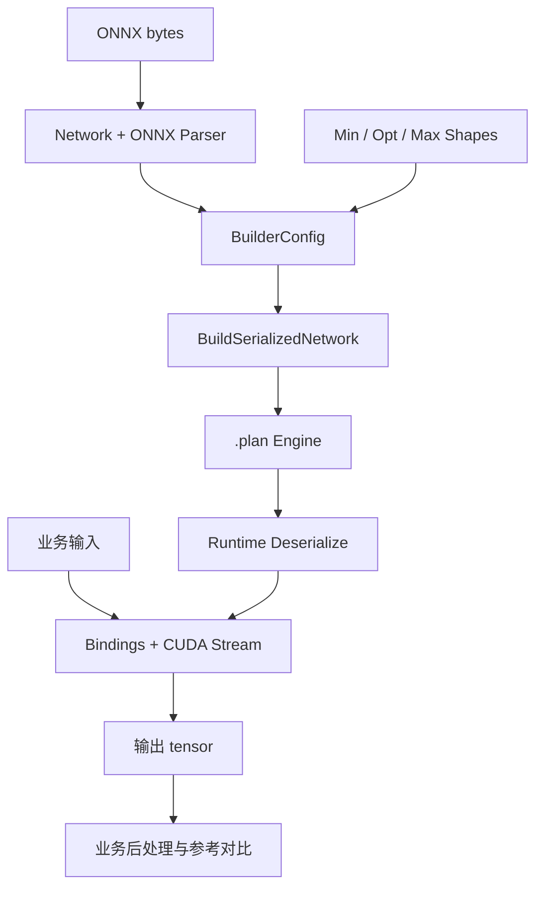
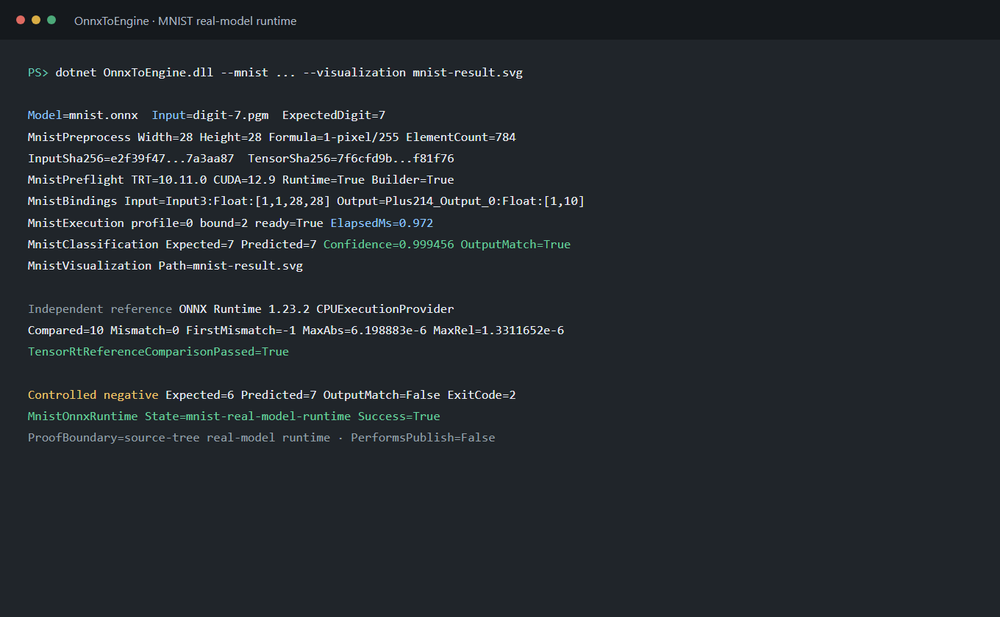
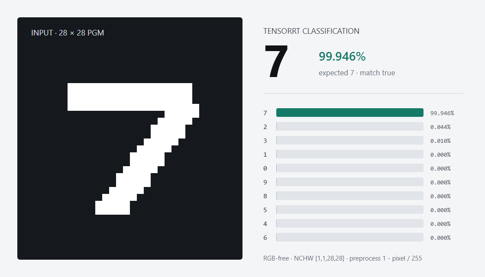

# 使用 TensorRT CSharp API v4.0 OnnxToEngine 将 ONNX 转换为 TensorRT Engine

<!-- public-article-layout:start -->
<style>
.content article { min-width: 0; overflow-wrap: anywhere; }
.content article a, .content article :not(pre) > code { overflow-wrap: anywhere; word-break: break-word; }
.content article pre:not(.mermaid), .content article table { display: block; max-width: 100%; overflow-x: auto; }
.content pre.mermaid { max-width: 640px; margin: 16px auto; overflow-x: auto; }
.content pre.mermaid svg { display: block; width: 100%; max-width: 640px; height: auto; }
</style>
<!-- public-article-layout:end -->

> 文章编号：`APP-ONNX-001`；适用版本：TensorRT CSharp API v4.0 `4.0.0`；当前状态：`review`。

## 1. 前言
<!-- public-article-project-preface:start -->
TensorRT CSharp API v4.0 是一个面向 C#/.NET 开发者的 TensorRT 与 CUDA 工程化接口项目。它把 NVIDIA 原生运行时、生成式绑定、C++ Bridge、托管对象模型和可验证的示例程序组织成一条完整链路，使使用者可以在熟悉的 .NET 项目中完成 Engine 构建、反序列化、ExecutionContext 管理、CUDA 内存操作、异步流同步和结果校验。项目的目标不是隐藏 TensorRT 的概念，而是把这些概念转换为有明确生命周期、所有权和错误边界的 C# API。

4.0.0 是一次完整重构后的正式版本。核心接口、Bridge 边界、Runtime 包命名、样例目录和验证方式都以 4.x 设计为准，不能把 3.x 的类型名、旧包名或旧 DLL 目录直接复制到新项目。托管包只提供项目接口和自有 Bridge；TensorRT、CUDA、cuDNN、显卡驱动以及对应许可证仍由使用者按目标平台安装和管理。

单篇文章也应能够独立阅读：读者可以先从项目入口确认源码和包，再根据本文的程序路径准备依赖，最后用输出中的状态、计数、Shape、哈希或结果图片判断流程是否真的完成。对于尚未具备兼容 GPU 的环境，本文会把静态检查、期望输出和真实运行结果分开标记，不把帮助命令或 build-only 结果包装成推理成功。

项目、包和源码入口（以下地址保留明文，便于复制到不完整支持 Markdown 链接的平台）：

项目主页：

```text
https://github.com/guojin-yan/TensorRT-CSharp-API/tree/TensorRtSharp4.0
```

核心 NuGet：

```text
https://www.nuget.org/packages/JYPPX.TensorRT.CSharp.API/4.0.0
```

Runtime Bridge 包列表：

```text
https://www.nuget.org/packages?q=+JYPPX.TensorRT.CSharp&includeComputedFrameworks=true&prerel=true&sortby=relevance
```

运行库清单：

```text
https://github.com/guojin-yan/TensorRT-CSharp-API/blob/TensorRtSharp4.0/pack/runtime/runtime-packages.manifest.json
```

### 1.1 程序出处与输出说明

本文涉及的程序、脚本或命令均以仓库中的实现为准；对应源码入口：

```text
https://github.com/guojin-yan/TensorRT-CSharp-API/tree/TensorRtSharp4.0/applications
```

运行示例必须同时给出程序输出和判定标准。终端中的 `status`、`Ready`、`Bound`、`enqueueCount`、`OutputMatch`、进程退出码、报告文件或结果图片分别说明不同层次的事实；只有明确写出这些结果，读者才能区分程序启动、Engine 构建、GPU enqueue 和业务结果语义。
<!-- public-article-project-preface:end -->

把 ONNX 转换成 TensorRT Engine，看起来只是一次 Parser 和 Builder 调用，实际还涉及显式 Batch、动态 Shape、Optimization Profile、精度、Workspace、Engine 序列化、重新加载和输出验证。TensorRT CSharp API v4.0：<https://github.com/guojin-yan/TensorRT-CSharp-API> 将这些 TensorRT/CUDA 能力封装为可在 .NET 中管理的 C# API，`applications/OnnxToEngine` 则提供一个可复制的命令行应用。

本文先讲通用 ONNX 构建流程，再用 MNIST 展示“构建、保存、重新加载、真实推理、独立对比”的完整闭环。后者很重要：Engine 文件生成只说明模型被成功解析和构建，不说明业务预处理、输入绑定和输出语义正确。

### 1.2 项目、包与源码

| 项目 | 说明 | 链接 |
| --- | --- | --- |
| TensorRT CSharp API v4.0 | TensorRT 与 CUDA 的 C# API | GitHub 项目：<https://github.com/guojin-yan/TensorRT-CSharp-API> |
| 稳定核心包 | 托管 API 与通用工具 | `JYPPX.TensorRT.CSharp.API 4.0.0`：<https://www.nuget.org/packages/JYPPX.TensorRT.CSharp.API/4.0.0> |
| Runtime Bridge | 匹配 TensorRT/CUDA/cuDNN 的原生桥接包 | NuGet 包列表：<https://www.nuget.org/profiles/JYPPX> |
| OnnxToEngine | ONNX 构建、MNIST 推理与报告应用 | 应用源码：<https://github.com/guojin-yan/TensorRT-CSharp-API/tree/TensorRtSharp4.0/applications/OnnxToEngine> |
| 主程序 | 参数解析与服务调度 | `Program.cs`：<https://github.com/guojin-yan/TensorRT-CSharp-API/blob/TensorRtSharp4.0/applications/OnnxToEngine/Program.cs> |
| 应用说明 | 参数和使用边界 | `README.zh-CN.md`：<https://github.com/guojin-yan/TensorRT-CSharp-API/blob/TensorRtSharp4.0/applications/OnnxToEngine/README.zh-CN.md> |

`OnnxToEngine` 是仓库中的 source-only 应用，不作为独立 NuGet 包发布。它消费稳定核心包和共享应用工具，NVIDIA Driver、CUDA、cuDNN 与 TensorRT 仍由使用者安装。

## 2. OnnxToEngine 能做什么

应用提供三类路径：

| 路径 | 作用 | 证明等级 |
| --- | --- | --- |
| 内置最小 identity | 验证 Parser、Profile、序列化、反序列化和读回 | synthetic runtime |
| 外部 ONNX `--buildOnly` | 构建 Engine 并输出 JSON/Markdown report | build-only |
| MNIST 专用路径 | 使用真实输入完成推理、分类和参考输出对比 | real-model-runtime |

对任意外部 ONNX，工具可以完成通用构建，但不能自动知道图片颜色、归一化、Tokenizer、输出类别、NMS 或其他业务语义。因此默认使用 `--buildOnly` 是有意的安全边界。

## 3. 工作原理



### 3.1 ONNX Parser

Parser 把 ONNX 图转换为 TensorRT Network。Parser 无报错并不保证 Engine 构建成功，构建成功也不保证所有输入输出符合业务预期，因此应同时保存 parser error、network tensor 和 build report。

### 3.2 Optimization Profile

包含动态维度的输入必须设置 `min/opt/max` 三组 Shape，并满足：

```text
min <= opt <= max
```

每个动态输入都必须有完整 profile。实际推理 Shape 超出范围时，Engine 不会自动扩展。

### 3.3 序列化与重新加载

`BuildSerializedNetwork` 生成 host memory，保存为 `.plan` 后，再由 Runtime 重新反序列化。重新加载能发现文件写入、版本兼容和 Engine 可读性问题，比直接继续使用构建阶段对象更接近部署流程。

## 4. 系统要求与安装

以 Windows x64、TensorRT 10.11、CUDA 12.9、cuDNN 9.22 为例，独立项目安装命令为：

```powershell
dotnet add package JYPPX.TensorRT.CSharp.API --version 4.0.0
dotnet add package JYPPX.TensorRT.CSharp.API.Runtime.win-x64.trt10.11.cuda12.9.cudnn9.22.Bridge --version 4.0.0
```

先确认环境：

```powershell
dotnet --info
nvidia-smi
```

然后在仓库根目录构建应用：

```powershell
dotnet build .\applications\OnnxToEngine\OnnxToEngine.csproj `
  -c Release `
  /p:UseSharedCompilation=false
```

> 当前源码复核说明：2026-08-12 已使用稳定核心包 `4.0.0` 完成 `OnnxToEngine` Release 构建和 `--help` 入口验证，结果为 0 警告、0 错误、退出码 0。下文实测结果仍来自已登记的 2026-08-04 TensorRT 10.11 运行证据；本轮尚未重新执行完整 MNIST GPU 流程，因此本文继续保持 `review`。

## 5. 通用 ONNX 构建

先建立仓库外部工作目录：

```powershell
$RepoRoot = (Get-Location).Path
$WorkspaceRoot = Split-Path -Parent $RepoRoot
$ModelRoot = Join-Path $WorkspaceRoot 'models\OnnxToEngine\MyModel'
$OutputRoot = Join-Path $WorkspaceRoot 'work\onnx-to-engine\my-model'
New-Item -ItemType Directory -Path $OutputRoot -Force | Out-Null
```

静态输入模型可以省略 Shape 参数；动态模型应显式传入：

```powershell
dotnet run --project .\applications\OnnxToEngine -- `
  --onnx (Join-Path $ModelRoot 'model.onnx') `
  --saveEngine (Join-Path $OutputRoot 'model.plan') `
  --minShapes input:1x3x640x640 `
  --optShapes input:1x3x640x640 `
  --maxShapes input:4x3x640x640 `
  --fp16 `
  --workspace 512 `
  --builderOptimizationLevel 4 `
  --maxAuxStreams 2 `
  --exportReport (Join-Path $OutputRoot 'build-report.json') `
  --buildOnly
```

报告至少应记录：模型 SHA256、TensorRT/CUDA 版本、输入输出 tensor、profile、precision、workspace、parser errors、Engine 路径与哈希、进程退出码和 `ProofClassification`。

## 6. 核心 C# 接口

### 6.1 解析 ONNX

```csharp
using TensorRtNetworkDefinition network =
    builder.CreateNetwork(TensorRtNetworkDefinitionCreationFlags.ExplicitBatch);
using TensorRtOnnxParser parser = new TensorRtOnnxParser(logger, network);

byte[] onnxBytes = File.ReadAllBytes(modelPath);
if (!parser.Parse(onnxBytes, Path.GetFileName(modelPath)))
{
    throw new InvalidOperationException(parser.GetErrorSummary());
}
```

### 6.2 配置动态 Shape

```csharp
using TensorRtOptimizationProfile profile = builder.CreateOptimizationProfile();
profile.SetDimensions("input", TensorRtOptProfileSelector.Min, minShape);
profile.SetDimensions("input", TensorRtOptProfileSelector.Opt, optShape);
profile.SetDimensions("input", TensorRtOptProfileSelector.Max, maxShape);
config.AddOptimizationProfile(profile);
```

### 6.3 构建和保存 Engine

```csharp
using TensorRtHostMemory serialized = builder.BuildSerializedNetwork(network, config);
serialized.SaveToFile(enginePath);
```

### 6.4 重新加载并运行

```csharp
using TensorRtEngine engine = runtime.DeserializeFromFile(enginePath);
using TensorRtExecutionContext context = engine.CreateExecutionContext();
using TensorRtInferenceBindings bindings =
    new TensorRtInferenceBindings(engine, context, profileIndex: 0);

bindings.CopyInputFromHost(inputName, inputValues, inputShape);
bindings.AllocateDeviceBuffer(outputName, outputShape, outputBytes);
bindings.BindAll();
bindings.EnqueueAsync(stream.Handle, synchronize: false, runShapeInference: false);
stream.Synchronize();
```

## 7. MNIST 真实模型闭环

通用 build-only 无法证明输出语义，所以仓库还提供 MNIST 专用模式。该模式读取确定性生成的 28x28 PGM 数字图，使用固定预处理执行 TensorRT，再与 ONNX Runtime CPU 输出比较。

### 7.1 模型与输入合同

| 项目 | 值 |
| --- | --- |
| 模型来源 | NVIDIA TensorRT 10.11 sample data / ONNX Model Zoo 归因 |
| ONNX 大小 | 26,454 bytes |
| ONNX SHA256 | `2f06e72de813a8635c9bc0397ac447a601bdbfa7df4bebc278723b958831c9bf` |
| 输入 | `Input3: float32[1,1,28,28]` |
| 输出 | `Plus214_Output_0: float32[1,10]` |
| 输入图 | 项目确定性生成 PGM，CC0 |
| 预处理 | `1 - pixel / 255` |

模型不提交到仓库。模型来源固定为 `TensorRT-10.11.0.33-sample-data`，应遵守 NVIDIA sample-data 条款和 ONNX Model Zoo 归因要求。

生成输入并运行：

```powershell
$MnistRoot = Join-Path $WorkspaceRoot 'models\OnnxToEngine\MNIST\nvidia-tensorrt-10.11'
$MnistOutput = Join-Path $WorkspaceRoot 'work\onnx-to-engine\mnist'

pwsh -File .\eng\New-MnistOwnerGeneratedDigit.ps1 `
  -OutputPath (Join-Path $MnistOutput 'digit-7.pgm') `
  -Digit 7

dotnet run --project .\applications\OnnxToEngine -- `
  --mnist `
  --tensor-rt-line 10 `
  --onnx (Join-Path $MnistRoot 'mnist.onnx') `
  --mnistInput (Join-Path $MnistOutput 'digit-7.pgm') `
  --expectedDigit 7 `
  --minimumConfidence 0.5 `
  --saveEngine (Join-Path $MnistOutput 'mnist.plan') `
  --exportReport (Join-Path $MnistOutput 'report.json') `
  --exportOutput (Join-Path $MnistOutput 'output.json') `
  --exportPreprocessedInput (Join-Path $MnistOutput 'input-f32.bin') `
  --exportVisualization (Join-Path $MnistOutput 'result.png')
```

## 8. 已登记的真实结果





2026-08-04 的机器可读记录 `onnxtoengine-mnist-owner-generated-win-x64-trt10.11-20260805` 包含以下结果：

| 检查项 | 结果 |
| --- | --- |
| TensorRT / CUDA | 10.11.0.33 / 12.9 |
| 预测数字 | 7 |
| 置信度 | `0.99945575` |
| 10 个 logits 与 ORT mismatch | 0 |
| 最大绝对误差 | `0.000006198883` |
| 最大相对误差 | `0.0000013311652` |
| 负例 | expected digit 改为 6，exit code 2 |
| Proof | `real-model-runtime` |

负例保持模型和输入不变，仅把期望数字从 7 改为 6；程序仍预测 7，并以非零退出码结束。这证明输出校验会 fail closed。

## 9. 常见问题

### 9.1 Parser 失败

读取 parser error 列表，检查不支持的算子、opset、动态维度和自定义 plugin。不要只保留最外层异常消息。

### 9.2 动态 Shape 构建失败

确保每个动态输入都有完整的 min/opt/max，并且 tensor 名称与 ONNX 完全一致。大小写或名称错误都会导致 profile 未应用。

### 9.3 Engine 能保存但推理输出错误

Engine 构建不理解业务预处理。检查输入 layout、dtype、归一化、tensor 名称、输出后处理和参考输出；不要把 build-only 报告升级为 runtime proof。

### 9.4 Engine 无法在另一台机器加载

普通 TensorRT Engine 通常与构建时的 TensorRT、GPU 架构和配置相关。应在目标环境构建或采用明确验证过的兼容策略，并记录环境矩阵。

### 9.5 稳定包与当前源码的 namespace 漂移

稳定核心包 `4.0.0` 使用 `JYPPX.Shared.Interop`，当前源码项目使用 `JYPPX.TensorRtSharp.Shared.Interop`。ApplicationTools 通过 `JYPPX_PUBLIC_STABLE_4_0_0` 条件兼容两条 namespace；若以后升级公开包版本，必须同时复核该条件、重新构建并执行本文流程，不能把 namespace 编译错误误判为 ONNX 模型错误。

## 10. 证据边界

已登记结果证明固定 MNIST 模型和项目自有输入在记录的 TensorRT 10.11 环境中完成构建、序列化、重新加载、真实 GPU 推理和 ONNX Runtime 对比。它不证明任意外部 ONNX 都有正确业务输出。

当前提交已经完成应用构建和帮助入口复核，但没有在本轮重新执行本文的完整 MNIST GPU 命令，因此历史记录仍只作为带日期的可追溯证据。本文也不是独立临时项目中的 post-publish proof，没有执行 package push、Tag、Release 或外部发布。

## 11. 总结

OnnxToEngine 适合把 ONNX Parser、Optimization Profile、Builder、Engine 文件和运行报告串成标准流程。使用外部模型时先完成 build-only，再由对应业务 runner 补齐真实输入、预处理、输出语义和参考对比，才能形成完整部署证据。

<!-- public-article-declaration:start -->
## 12. 文章声明

### 12.1 开源协议声明
作者所有开源项目代码均遵循 Apache License 2.0 开源协议。
特别说明：本项目集成了若干第三方库。若任何第三方库的许可协议与 Apache 2.0 协议存在冲突或不一致，均以该第三方库的原始许可协议为准。本项目不包含也不代表这些第三方库的授权声明，使用前请务必阅读并遵守第三方库的相关许可。

### 12.2 代码开发与质量说明
AI 辅助开发：本代码在开发过程中使用了人工智能（AI）辅助生成与优化，并非完全由人工逐行编写。
安全性承诺：作者郑重声明，本代码中绝无任何有意设置的后门、病毒、木马或旨在破坏用户设备、窃取数据的恶意代码。
技术局限性：受限于作者个人的技术水平与能力，代码中可能存在因逻辑不严谨、优化不足或经验欠缺导致的低级问题（例如但不限于内存泄漏、偶发崩溃、资源未释放等）。这些问题纯属能力不足所致，并非主观故意。
测试范围：由于作者精力有限，未对本软件进行全方位、覆盖所有边缘场景的完整测试。

### 12.3 免责声明（重要）
请在将本代码应用于任何实际项目（特别是商业、工业或关键任务环境）之前，务必进行详尽、严格的自行测试与验证。 鉴于上述可能存在的代码缺陷及测试覆盖不足，因使用本代码而导致的任何直接或间接损失（包括但不限于设备故障、数据丢失、系统瘫痪或利润损失等），本作者概不负责。 一旦您开始使用本代码，即表示您已知晓上述风险并同意自行承担一切后果，相关问题与本作者无关。

### 12.4 代码开源范围
本项目承诺核心逻辑代码完全开源，但上述提到的“第三方库”的二进制文件、源代码或相关资源不在本项目的开源义务范围内，请根据其各自的指引获取。

### 12.5 社区与反馈
尽管存在上述不足，我们仍欢迎大家下载使用、提交 Issue 或参与测试，共同完善项目。如果您在使用过程中发现 Bug、内存溢出或有改进建议，欢迎通过项目主页提供的联系方式与作者取得联系，我们将尽力在有限的时间内提供协助。


<!-- public-article-declaration:end -->
