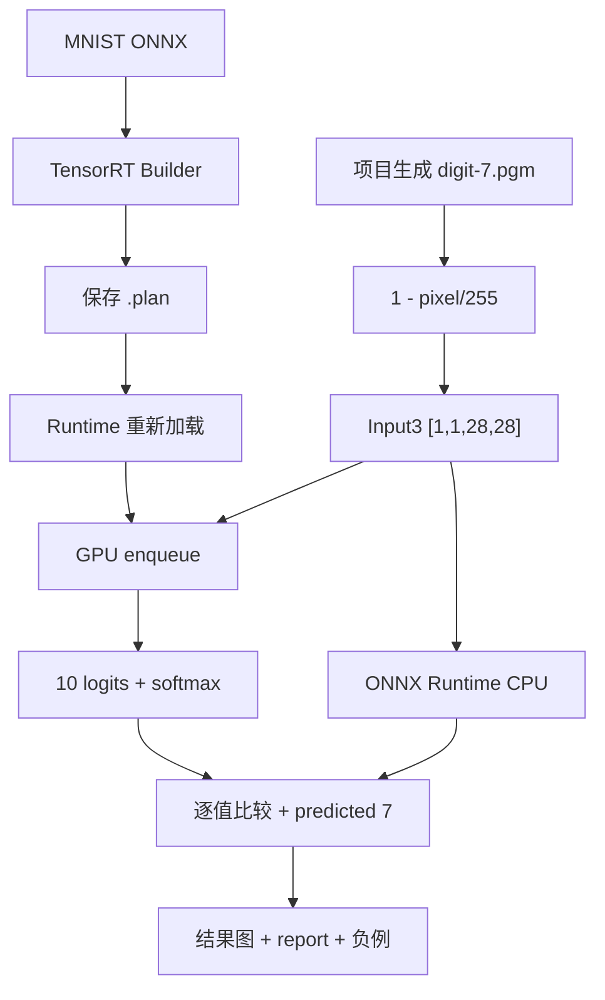
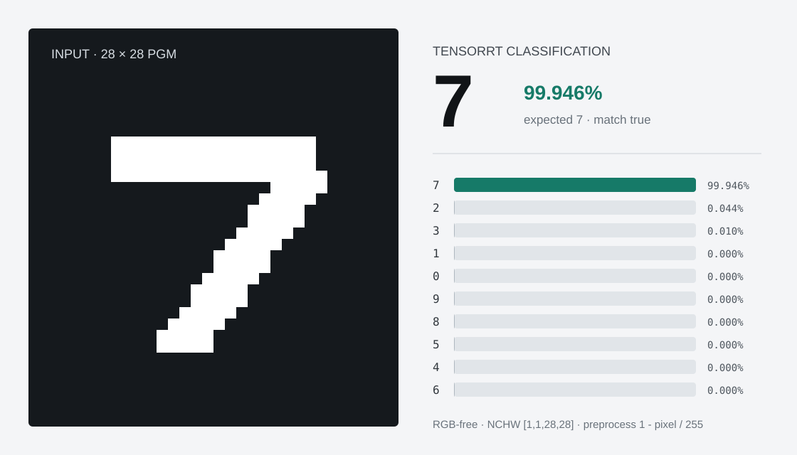

# 使用 TensorRT CSharp API v4.0 OnnxToEngine 完成 MNIST 推理与双重验证

<!-- public-article-layout:start -->
<style>
.content article { min-width: 0; overflow-wrap: anywhere; }
.content article a, .content article :not(pre) > code { overflow-wrap: anywhere; word-break: break-word; }
.content article pre:not(.mermaid), .content article table { display: block; max-width: 100%; overflow-x: auto; }
.content pre.mermaid { max-width: 640px; margin: 16px auto; overflow-x: auto; }
.content pre.mermaid svg { display: block; width: 100%; max-width: 640px; height: auto; }
</style>
<!-- public-article-layout:end -->

> 文章编号：`APP-ONNX-002`；适用版本：TensorRT CSharp API v4.0 `4.0.0`；当前状态：`ready`。

## 1. 前言
<!-- public-article-project-preface:start -->
TensorRT CSharp API v4.0 是一个面向 C#/.NET 开发者的 TensorRT 与 CUDA 工程化接口项目。它把 NVIDIA 原生运行时、生成式绑定、C++ Bridge、托管对象模型和可验证的示例程序组织成一条完整链路，使使用者可以在熟悉的 .NET 项目中完成 Engine 构建、反序列化、ExecutionContext 管理、CUDA 内存操作、异步流同步和结果校验。项目的目标不是隐藏 TensorRT 的概念，而是把这些概念转换为有明确生命周期、所有权和错误边界的 C# API。

4.0.0 是一次完整重构后的正式版本。核心接口、Bridge 边界、Runtime 包命名、样例目录和验证方式都以 4.x 设计为准，不能把 3.x 的类型名、旧包名或旧 DLL 目录直接复制到新项目。托管包只提供项目接口和自有 Bridge；TensorRT、CUDA、cuDNN、显卡驱动以及对应许可证仍由使用者按目标平台安装和管理。

单篇文章也应能够独立阅读：读者可以先从项目入口确认源码和包，再根据本文的程序路径准备依赖，最后用输出中的状态、计数、Shape、哈希或结果图片判断流程是否真的完成。对于尚未具备兼容 GPU 的环境，本文会把静态检查、期望输出和真实运行结果分开标记，不把帮助命令或 build-only 结果包装成推理成功。

项目、包和源码入口（以下地址保留明文，便于复制到不完整支持 Markdown 链接的平台）：

项目主页：

```text
https://github.com/guojin-yan/TensorRT-CSharp-API/tree/TensorRtSharp4.0
```

核心 NuGet：

```text
https://www.nuget.org/packages/JYPPX.TensorRT.CSharp.API/4.0.0
```

Runtime Bridge 包列表：

```text
https://www.nuget.org/packages?q=+JYPPX.TensorRT.CSharp&includeComputedFrameworks=true&prerel=true&sortby=relevance
```

运行库清单：

```text
https://github.com/guojin-yan/TensorRT-CSharp-API/blob/TensorRtSharp4.0/pack/runtime/runtime-packages.manifest.json
```

### 1.1 程序出处与输出说明

本文涉及的程序、脚本或命令均以仓库中的实现为准；对应源码入口：

```text
https://github.com/guojin-yan/TensorRT-CSharp-API/tree/TensorRtSharp4.0/applications
```

运行示例必须同时给出程序输出和判定标准。终端中的 `status`、`Ready`、`Bound`、`enqueueCount`、`OutputMatch`、进程退出码、报告文件或结果图片分别说明不同层次的事实；只有明确写出这些结果，读者才能区分程序启动、Engine 构建、GPU enqueue 和业务结果语义。
<!-- public-article-project-preface:end -->

TensorRT CSharp API v4.0：<https://github.com/guojin-yan/TensorRT-CSharp-API> 为 .NET 提供 TensorRT/CUDA C# API。`applications/OnnxToEngine` 不只可以把 ONNX 构建为 Engine，还提供 MNIST 专用路径，用固定输入合同完成 Engine 序列化、重新加载、真实 GPU 推理、结果分类和 artifact 输出。

本文使用 NVIDIA TensorRT sample data 中的 MNIST ONNX，并由项目脚本确定性生成数字 7 的 PGM 图片。TensorRT 结果会与 ONNX Runtime CPU 对同一 float32 tensor 的输出比较，再通过“期望数字改成 6”的受控负例证明失败关闭。这样可以避免把“Engine 文件生成成功”误写成“模型推理正确”。

### 1.2 项目、包与源码入口

| 项目 | 说明 | 链接 |
| --- | --- | --- |
| TensorRT CSharp API v4.0 | TensorRT/CUDA C# API | GitHub 项目：<https://github.com/guojin-yan/TensorRT-CSharp-API> |
| 稳定核心包 | 托管接口 | `JYPPX.TensorRT.CSharp.API 4.0.0`：<https://www.nuget.org/packages/JYPPX.TensorRT.CSharp.API/4.0.0> |
| Runtime Bridge | 与本机 TensorRT/CUDA/cuDNN 对应 | NuGet 包列表：<https://www.nuget.org/profiles/JYPPX> |
| OnnxToEngine | MNIST 命令入口与报告 | 应用源码：<https://github.com/guojin-yan/TensorRT-CSharp-API/tree/TensorRtSharp4.0/applications/OnnxToEngine> |
| 主程序 | `--mnist` 参数与运行状态 | `Program.cs`：<https://github.com/guojin-yan/TensorRT-CSharp-API/blob/TensorRtSharp4.0/applications/OnnxToEngine/Program.cs> |
| MNIST 服务 | 构建、绑定和推理 | `MnistOnnxRuntimeService.cs`：<https://github.com/guojin-yan/TensorRT-CSharp-API/blob/TensorRtSharp4.0/src/JYPPX.TensorRtSharp.Tools/Runtime/MnistOnnxRuntimeService.cs> |
| 结果可视化 | 像素、预测与十类概率 | `MnistVisualizationWriter.cs`：<https://github.com/guojin-yan/TensorRT-CSharp-API/blob/TensorRtSharp4.0/src/JYPPX.TensorRtSharp.Tools/Runtime/MnistVisualizationWriter.cs> |

OnnxToEngine 是 source-only 应用，不作为独立 NuGet 包发布。NVIDIA Driver、CUDA、cuDNN 和 TensorRT 仍由使用者安装。

## 2. 验证链路



本文同时证明：

1. 固定 ONNX 可被 TensorRT 解析和构建。
2. 保存后的 Engine 可以重新加载并执行。
3. TensorRT 与 ONNX Runtime 的 10 个输出在容差内一致。
4. 错误期望数字会返回非零退出码。

## 3. 当前源码复核状态

2026-08-13 已使用稳定核心包 `4.0.0` 重新构建 `OnnxToEngine`，结果为 0 警告、0 错误；稳定包与当前源码的共享 namespace 漂移通过受控编译条件兼容。随后使用同一模型、项目自有输入和预处理 tensor 依次执行 TensorRT 正例、错误期望数字负例与 ONNX Runtime 1.23.2 CPU 对照，三条路径均达到预设判定。

本轮机器可读汇总位于 `docs/articles/zh-cn/03-applications/onnxtoengine/onnxtoengine-runtime-evidence-20260813.json`。它明确记录基线 `ee351914`、非干净工作树、执行命令、退出码、输出、哈希和不能外推的证明边界。

## 4. 模型来源与许可

模型来自用户安装的 TensorRT 10.11.0.33 sample data，来源 README 将其归因于 ONNX Model Zoo MNIST。

| 项目 | 固定值 |
| --- | --- |
| 模型 | NVIDIA TensorRT sample-data `mnist.onnx` |
| 来源 | `https://github.com/onnx/models/tree/main/validated/vision/classification/mnist` |
| 固定版本 | `TensorRT-10.11.0.33-sample-data` |
| ONNX opset | 8 |
| 文件大小 | 26,454 bytes |
| SHA256 | `2f06e72de813a8635c9bc0397ac447a601bdbfa7df4bebc278723b958831c9bf` |
| 再分发批准 | 否 |

将模型复制到仓库外工作区：

```powershell
$RepoRoot = (Resolve-Path '.').Path
$WorkspaceRoot = Split-Path -Parent $RepoRoot
$ModelRoot = Join-Path $WorkspaceRoot 'models\OnnxToEngine\MNIST\nvidia-tensorrt-10.11'
New-Item -ItemType Directory -Force $ModelRoot | Out-Null

Copy-Item (Join-Path $env:TENSORRT_PATH 'data\mnist\mnist.onnx') `
  (Join-Path $ModelRoot 'mnist.onnx') -Force
Get-FileHash (Join-Path $ModelRoot 'mnist.onnx') -Algorithm SHA256
```

该文件已经是 ONNX，不需要再经过 PyTorch/TensorFlow 导出。复制与哈希校验不是模型转换；TensorRT 构建 `.plan` 也不是重新导出 ONNX。

## 5. 生成项目自有输入

本文不使用 TensorRT sample data 中的 `7.pgm`，而是由仓库脚本生成确定性几何数字 7：

```powershell
$AssetRoot = Join-Path $WorkspaceRoot 'work\onnxtoengine\mnist-owner-generated'
New-Item -ItemType Directory -Force $AssetRoot | Out-Null

pwsh -NoProfile -ExecutionPolicy Bypass `
  -File .\eng\New-MnistOwnerGeneratedDigit.ps1 `
  -OutputPath (Join-Path $AssetRoot 'digit-7.pgm') `
  -Digit 7
```

| 项目 | 值 |
| --- | --- |
| 格式 | P5 PGM |
| 尺寸 | 28x28 |
| 文件大小 | 797 bytes |
| SHA256 | `e2f39f47bae623e76b4a16dc4f2de66f11e3cae9b5e0eb2fa4f17858d7a3aa87` |
| 许可证 | CC0-1.0 |

图片由项目生成，没有第三方源素材；结果图可以展示实际 784 个像素。

## 6. 输入输出合同

| 角色 | Tensor | Shape | 类型 |
| --- | --- | --- | --- |
| 输入 | `Input3` | `[1,1,28,28]` | float32 |
| 输出 | `Plus214_Output_0` | `[1,10]` | float32 |

PGM 预处理公式与 TensorRT MNIST sample 保持一致：

```text
tensor[index] = 1 - pixel[index] / 255
```

784 个 float32 的 SHA256 为 `7f6cfd9ba7fadb5e2751bd150ea92275f90c413681fec0c74921f4b476f81f76`。输出经过稳定 softmax 后取 argmax；预测必须等于 expected digit 且达到最低置信度，程序才返回成功。

## 7. 核心实现

应用入口创建 options 并调用 MNIST service：

```csharp
MnistOnnxRuntimeOptions options = new MnistOnnxRuntimeOptions(
    tensorRtLine,
    onnxPath,
    inputPath,
    expectedDigit,
    saveEnginePath,
    exportReportPath,
    exportOutputPath,
    exportPreprocessedInputPath,
    workspaceBytes,
    minimumConfidence);

MnistOnnxRuntimeResult result = new MnistOnnxRuntimeService().Execute(options);
```

运行服务内部完成：

1. 校验 ONNX、PGM、Shape 和路径。
2. Parser + Builder 生成 serialized Engine。
3. 保存并由 Runtime 重新反序列化。
4. 创建 bindings，复制 784 个输入值并分配 10 个输出值。
5. CUDA stream enqueue、同步和输出读回。
6. softmax、argmax、置信度和 expected digit 验证。

## 8. 构建与运行

当前源码构建命令为：

```powershell
dotnet build .\applications\OnnxToEngine\OnnxToEngine.csproj `
  -c Release `
  /p:UseSharedCompilation=false
```

运行：

```powershell
$ModelPath = Join-Path $ModelRoot 'mnist.onnx'
$App = '.\applications\OnnxToEngine\bin\Release\net8.0\OnnxToEngine.dll'
$env:JYPPX_TENSORRT_ROOT = $env:TENSORRT_PATH
$env:JYPPX_ENABLE_DEVELOPMENT_PROBING = 'true'

dotnet $App --mnist --tensor-rt-line 10 `
  --onnx $ModelPath `
  --mnistInput (Join-Path $AssetRoot 'digit-7.pgm') `
  --expectedDigit 7 --minimumConfidence 0.5 `
  --saveEngine (Join-Path $AssetRoot 'digit-7.plan') `
  --exportReport (Join-Path $AssetRoot 'digit-7-report.json') `
  --exportOutput (Join-Path $AssetRoot 'digit-7-output.json') `
  --exportPreprocessedInput (Join-Path $AssetRoot 'digit-7-input.fp32.bin') `
  --visualization (Join-Path $AssetRoot 'digit-7-result.svg')
```

使用同一输入 tensor 运行 ONNX Runtime CPU 参考：

```powershell
pwsh -NoProfile -ExecutionPolicy Bypass `
  -File .\eng\Test-TensorRtExecMnistOnnxRuntimeReference.ps1 `
  -ModelPath $ModelPath `
  -InputPath (Join-Path $AssetRoot 'digit-7-input.fp32.bin') `
  -TensorRtReferencePath (Join-Path $AssetRoot 'digit-7-tensorrt.reference.json') `
  -OutputRoot (Join-Path $WorkspaceRoot 'consumer-workspaces\mnist-owner-generated-ort') `
  -ReportDirectory (Join-Path $AssetRoot 'onnxruntime') `
  -Strict
```

## 9. 已登记的真实结果




前两张图片是 2026-08-04 历史归档；第三张 SVG 是 2026-08-13 正例命令直接生成的当前结果图。状态晋级同时要求本轮日志、JSON 和退出码通过，不以历史截图替代复跑。

| 检查项 | 结果 |
| --- | --- |
| 环境 | Windows 11 / RTX 3060 Laptop / TensorRT 10.11 / CUDA 12.9 |
| TensorRT 预测 | 7 |
| 置信度 | `0.99945575` |
| 最低置信度 | 0.5 |
| Enqueue | `1.34144 ms` |
| ONNX Runtime | 1.23.2 CPUExecutionProvider |
| ORT 两次输出 | float32 bytes 完全一致 |
| 比较元素 / mismatch | 10 / 0 |
| 最大绝对误差 | `6.198883e-6` |
| 最大相对误差 | `1.3311652e-6` |
| 正例退出码 | 0 |

结果图左侧绘制实际 PGM 像素，右侧展示预测数字、置信度和十类概率，不是手工制作的指标卡片。

## 10. 受控负例

模型、输入和最低置信度不变，只把 `--expectedDigit` 从 7 改成 6：

```text
ExpectedDigit=6
PredictedDigit=7
Confidence=0.99945575
OutputMatch=False
State=mnist-output-mismatch
ProcessExitCode=2
```

这证明分类结果不满足调用方合同会 fail closed。

## 11. 常见问题

### 11.1 PGM 读取失败

输入必须是 28x28 的 P5 二进制灰度 PGM。普通 PNG/JPEG 不能直接作为 `--mnistInput`。

### 11.2 预测不是 7

先核对 ONNX、PGM 和预处理 tensor SHA256，再检查公式是否为 `1 - pixel/255`。不要通过降低最低置信度掩盖输入合同错误。

### 11.3 Engine 构建成功但推理失败

检查 Engine tensor 名称、Shape、binding 字节数、Runtime Bridge 与 TensorRT/CUDA 组合。build-only 不能代替 runtime validation。

### 11.4 `TensorRtApiLine` namespace 不匹配

稳定包和当前源码的共享 namespace 不同。当前已用条件编译对齐 `TensorRtApiLine`，若再次出现该错误，应先检查公开包版本与 `JYPPX_PUBLIC_STABLE_4_0_0`，不要归因于 MNIST 模型。本轮已经在该兼容条件下完成构建、GPU 正例/负例和 ORT 对照。

## 12. 证据边界

本轮记录证明固定 MNIST ONNX、项目自有输入、真实 TensorRT GPU 推理、ONNX Runtime CPU 对照和错误期望数字负例成立。ORT profiling 只出现 `CPUExecutionProvider`，同一输入两次输出逐字节一致；与本轮 TensorRT 10 个 logits 在绝对/相对容差 `1e-4` 内 mismatch 为 0。它不证明完整 MNIST 精度，也不授权重新分发 ONNX。

证据基于 `ee351914` 与用户已有的未提交稳定包兼容改动，不是干净临时项目中的 public-package consumer、post-publish、Owner acceptance、Tag、Release 或发布批准。ORT 结果是独立执行框架参考，但模型与参考仍未取得 Owner 再分发批准。

## 13. 总结

OnnxToEngine MNIST 路径把 Parser、Builder、Engine 持久化、Runtime 加载、binding、CUDA 执行和业务输出校验串成了完整闭环。相同输入 tensor 的 ORT 对照与受控负例，使“程序能运行”升级为可复查的模型结果验证。

<!-- public-article-declaration:start -->
## 14. 文章声明

### 14.1 开源协议声明
作者所有开源项目代码均遵循 Apache License 2.0 开源协议。
特别说明：本项目集成了若干第三方库。若任何第三方库的许可协议与 Apache 2.0 协议存在冲突或不一致，均以该第三方库的原始许可协议为准。本项目不包含也不代表这些第三方库的授权声明，使用前请务必阅读并遵守第三方库的相关许可。

### 14.2 代码开发与质量说明
AI 辅助开发：本代码在开发过程中使用了人工智能（AI）辅助生成与优化，并非完全由人工逐行编写。
安全性承诺：作者郑重声明，本代码中绝无任何有意设置的后门、病毒、木马或旨在破坏用户设备、窃取数据的恶意代码。
技术局限性：受限于作者个人的技术水平与能力，代码中可能存在因逻辑不严谨、优化不足或经验欠缺导致的低级问题（例如但不限于内存泄漏、偶发崩溃、资源未释放等）。这些问题纯属能力不足所致，并非主观故意。
测试范围：由于作者精力有限，未对本软件进行全方位、覆盖所有边缘场景的完整测试。

### 14.3 免责声明（重要）
请在将本代码应用于任何实际项目（特别是商业、工业或关键任务环境）之前，务必进行详尽、严格的自行测试与验证。 鉴于上述可能存在的代码缺陷及测试覆盖不足，因使用本代码而导致的任何直接或间接损失（包括但不限于设备故障、数据丢失、系统瘫痪或利润损失等），本作者概不负责。 一旦您开始使用本代码，即表示您已知晓上述风险并同意自行承担一切后果，相关问题与本作者无关。

### 14.4 代码开源范围
本项目承诺核心逻辑代码完全开源，但上述提到的“第三方库”的二进制文件、源代码或相关资源不在本项目的开源义务范围内，请根据其各自的指引获取。

### 14.5 社区与反馈
尽管存在上述不足，我们仍欢迎大家下载使用、提交 Issue 或参与测试，共同完善项目。如果您在使用过程中发现 Bug、内存溢出或有改进建议，欢迎通过项目主页提供的联系方式与作者取得联系，我们将尽力在有限的时间内提供协助。


<!-- public-article-declaration:end -->
