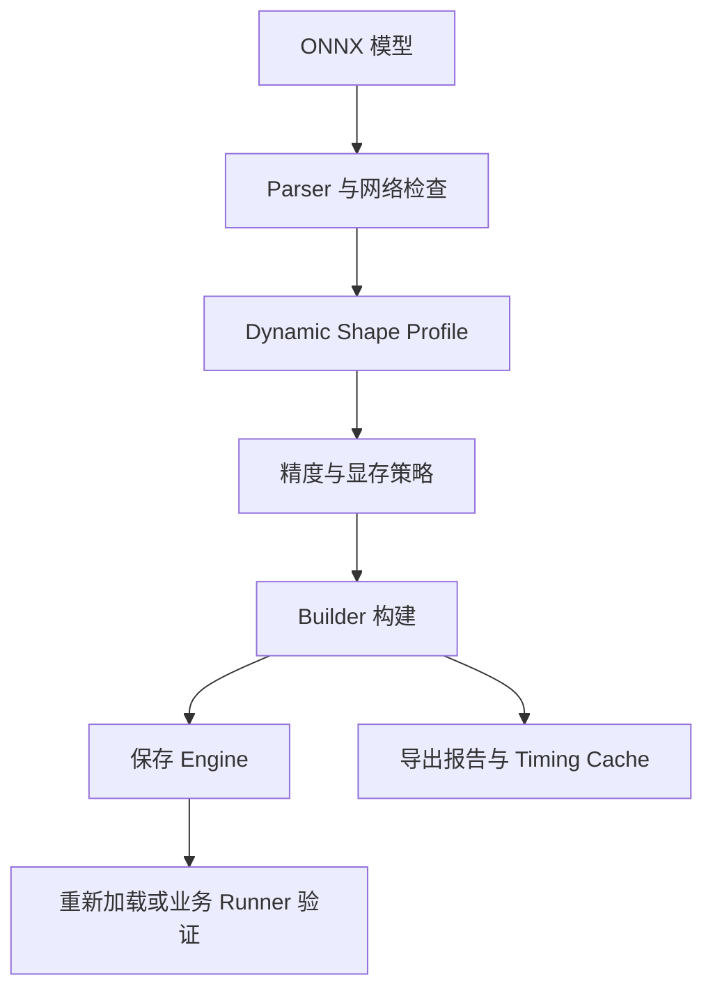

# TensorRT CSharp API v4.0 OnnxToEngine 进阶：Dynamic Shape、FP16、Workspace 与构建报告

<!-- public-article-layout:start -->
<style>
.content article { min-width: 0; overflow-wrap: anywhere; }
.content article a, .content article :not(pre) > code { overflow-wrap: anywhere; word-break: break-word; }
.content article pre:not(.mermaid), .content article table { display: block; max-width: 100%; overflow-x: auto; }
.content pre.mermaid { max-width: 640px; margin: 16px auto; overflow-x: auto; }
.content pre.mermaid svg { display: block; width: 100%; max-width: 640px; height: auto; }
</style>
<!-- public-article-layout:end -->

> 文章编号：`APP-ONNX-003`；适用版本：TensorRT CSharp API v4.0 `4.0.0`；当前状态：`ready`。

## 1. 前言
<!-- public-article-project-preface:start -->
TensorRT CSharp API v4.0 是一个面向 C#/.NET 开发者的 TensorRT 与 CUDA 工程化接口项目。它把 NVIDIA 原生运行时、生成式绑定、C++ Bridge、托管对象模型和可验证的示例程序组织成一条完整链路，使使用者可以在熟悉的 .NET 项目中完成 Engine 构建、反序列化、ExecutionContext 管理、CUDA 内存操作、异步流同步和结果校验。项目的目标不是隐藏 TensorRT 的概念，而是把这些概念转换为有明确生命周期、所有权和错误边界的 C# API。

4.0.0 是一次完整重构后的正式版本。核心接口、Bridge 边界、Runtime 包命名、样例目录和验证方式都以 4.x 设计为准，不能把 3.x 的类型名、旧包名或旧 DLL 目录直接复制到新项目。托管包只提供项目接口和自有 Bridge；TensorRT、CUDA、cuDNN、显卡驱动以及对应许可证仍由使用者按目标平台安装和管理。

单篇文章也应能够独立阅读：读者可以先从项目入口确认源码和包，再根据本文的程序路径准备依赖，最后用输出中的状态、计数、Shape、哈希或结果图片判断流程是否真的完成。对于尚未具备兼容 GPU 的环境，本文会把静态检查、期望输出和真实运行结果分开标记，不把帮助命令或 build-only 结果包装成推理成功。

项目、包和源码入口（以下地址保留明文，便于复制到不完整支持 Markdown 链接的平台）：

项目主页：

```text
https://github.com/guojin-yan/TensorRT-CSharp-API/tree/TensorRtSharp4.0
```

核心 NuGet：

```text
https://www.nuget.org/packages/JYPPX.TensorRT.CSharp.API/4.0.0
```

Runtime Bridge 包列表：

```text
https://www.nuget.org/packages?q=+JYPPX.TensorRT.CSharp&includeComputedFrameworks=true&prerel=true&sortby=relevance
```

运行库清单：

```text
https://github.com/guojin-yan/TensorRT-CSharp-API/blob/TensorRtSharp4.0/pack/runtime/runtime-packages.manifest.json
```

### 1.1 程序出处与输出说明

本文涉及的程序、脚本或命令均以仓库中的实现为准；对应源码入口：

```text
https://github.com/guojin-yan/TensorRT-CSharp-API/tree/TensorRtSharp4.0/applications
```

运行示例必须同时给出程序输出和判定标准。终端中的 `status`、`Ready`、`Bound`、`enqueueCount`、`OutputMatch`、进程退出码、报告文件或结果图片分别说明不同层次的事实；只有明确写出这些结果，读者才能区分程序启动、Engine 构建、GPU enqueue 和业务结果语义。
<!-- public-article-project-preface:end -->

把一个静态 ONNX 模型转换为 TensorRT Engine，只需要少量默认参数；真正进入工程部署后，输入尺寸、显存预算、精度策略、构建耗时和产物追踪都会成为必须明确的配置。TensorRT CSharp API v4.0：<https://github.com/guojin-yan/TensorRT-CSharp-API> 提供 TensorRT 与 CUDA 的 C# API，仓库中的 `OnnxToEngine` 则把常用构建能力整理成可复用的命令行应用。

本文是 OnnxToEngine 入门：<https://github.com/guojin-yan/TensorRT-CSharp-API/blob/TensorRtSharp4.0/docs/articles/zh-cn/03-applications/onnxtoengine/app-onnx-001-onnx-to-engine-getting-started.md> 的进阶篇，重点说明 Dynamic Shape、FP16/TF32、Workspace、Builder Optimization Level、Timing Cache 和构建报告。MNIST 的真实推理与 ONNX Runtime 对比请参阅 MNIST 双重验证：<https://github.com/guojin-yan/TensorRT-CSharp-API/blob/TensorRtSharp4.0/docs/articles/zh-cn/03-applications/onnxtoengine/app-onnx-002-mnist-runtime-validation.md>。

### 1.2 项目、包与源码入口

| 项目 | 作用 | 链接 |
| --- | --- | --- |
| TensorRT CSharp API v4.0 | 面向 .NET 的 TensorRT/CUDA C# API | GitHub 项目：<https://github.com/guojin-yan/TensorRT-CSharp-API> |
| 核心接口包 | 托管 API 与公共类型 | `JYPPX.TensorRT.CSharp.API 4.0.0`：<https://www.nuget.org/packages/JYPPX.TensorRT.CSharp.API/4.0.0> |
| Runtime Bridge | 按操作系统与 TensorRT/CUDA/cuDNN 版本选择 | JYPPX NuGet 包列表：<https://www.nuget.org/profiles/JYPPX> |
| OnnxToEngine 应用 | ONNX 构建、Engine 保存和报告导出 | 应用源码：<https://github.com/guojin-yan/TensorRT-CSharp-API/tree/TensorRtSharp4.0/applications/OnnxToEngine> |
| 命令入口 | 模式选择和参数调度 | `Program.cs`：<https://github.com/guojin-yan/TensorRT-CSharp-API/blob/TensorRtSharp4.0/applications/OnnxToEngine/Program.cs> |
| 构建服务 | Parser、Builder、Profile、运行和报告实现 | `OnnxEngineBuildService.cs`：<https://github.com/guojin-yan/TensorRT-CSharp-API/blob/TensorRtSharp4.0/src/JYPPX.TensorRtSharp.Tools/Build/OnnxEngineBuildService.cs> |
| 参数解析 | trtexec 风格参数的解析和归一化 | `TrtexecLikeParser.cs`：<https://github.com/guojin-yan/TensorRT-CSharp-API/blob/TensorRtSharp4.0/src/JYPPX.TensorRtSharp.Tools/Trtexec/TrtexecLikeParser.cs> |

`OnnxToEngine` 是源码应用，不作为独立 NuGet 包发布。独立项目需要同时安装核心接口包和一个与本机环境匹配的 Runtime Bridge；CUDA、cuDNN、TensorRT 和 NVIDIA Driver 仍由使用者安装。

## 2. 高级构建流程



参数可以分成三类：

| 类别 | 典型参数 | 解决的问题 |
| --- | --- | --- |
| 模型合同 | `--minShapes`、`--optShapes`、`--maxShapes` | Engine 接受哪些输入尺寸 |
| 构建策略 | `--fp16`、`--workspace`、`--builderOptimizationLevel` | 精度、显存和构建搜索空间 |
| 可追溯产物 | `--saveEngine`、`--exportReport`、`--exportTimingCache` | 保存结果并记录本次构建事实 |

## 3. Dynamic Shape 与 Optimization Profile

ONNX 维度为 `-1` 或 symbolic dimension 时，TensorRT 需要 Optimization Profile。每个动态输入都要提供 `min/opt/max`：

```text
min <= opt <= max
```

- `min`：允许的最小输入；
- `opt`：Builder 优先优化的常用输入；
- `max`：允许的最大输入，也是显存规划的重要上界。

单输入格式如下：

```text
images:1x3x640x640
```

多输入使用逗号分隔，并且三组 profile 必须覆盖相同的 tensor：

```text
images:1x3x640x640,scale:1x2
```

完整命令示例：

```powershell
$ModelRoot = Join-Path $PWD 'models\dynamic'
$OutputRoot = Join-Path $PWD 'work\onnx-to-engine\dynamic'
New-Item -ItemType Directory -Path $OutputRoot -Force | Out-Null

dotnet run --project .\applications\OnnxToEngine -- `
  --tensor-rt-line 10 `
  --onnx (Join-Path $ModelRoot 'model.onnx') `
  --saveEngine (Join-Path $OutputRoot 'model.plan') `
  --minShapes images:1x3x320x320 `
  --optShapes images:1x3x640x640 `
  --maxShapes images:4x3x960x960 `
  --workspace 1024 `
  --buildOnly `
  --exportReport (Join-Path $OutputRoot 'build-report.json')
```

如果只使用一个固定 Shape，可以使用 `--shapes` 或 `--inputShapes` 别名；工具会在没有显式 profile 三元组时把它投影到 min/opt/max。正式部署仍建议显式填写三组值，使报告能直接表达 Engine 边界。

### 3.1 常见 Profile 错误

| 现象 | 原因 | 处理方式 |
| --- | --- | --- |
| 找不到输入 | 参数中的 tensor 名与 ONNX 不一致 | 读取真实 ONNX input 名，区分大小写 |
| Rank 不一致 | 三组 Shape 的维数不同 | 保持 min/opt/max rank 完全一致 |
| Profile 无效 | `opt` 不在 `min/max` 之间 | 逐维检查大小关系 |
| 推理时越界 | 实际输入超过 profile | 重新构建 Engine 或限制业务输入 |
| 多输入仍失败 | 某个动态输入未配置 | 三组 profile 都覆盖全部动态输入 |

## 4. 精度策略

### 4.1 FP16

`--fp16` 会请求 Builder 启用 FP16。它通常可以降低 Engine 显存和推理时间，但是否真正获益取决于 GPU、网络层和 TensorRT tactic。构建成功只表示配置被接受，不等于模型输出精度已经验证。

```powershell
dotnet run --project .\applications\OnnxToEngine -- `
  --onnx .\models\model.onnx `
  --saveEngine .\work\model-fp16.plan `
  --fp16 `
  --workspace 512 `
  --builderOptimizationLevel 4 `
  --buildOnly `
  --exportReport .\work\model-fp16-report.json
```

### 4.2 TF32 与 BF16

TF32 默认策略可通过 `--noTF32` 关闭；BF16 使用 `--bf16` 请求。两者都与 TensorRT API line、硬件和模型有关，应检查报告中的 `AppliedOptions` 与 readback，不应只根据命令行判断已经生效。

### 4.3 INT8

`--int8` 与 `--calib` 当前可进入参数和报告，但不能据此宣称完整 INT8 校准链路已经完成。可靠 INT8 流程还需要校准数据、calibrator 生命周期、cache 有效性和模型输出精度验证。没有这些条件时，文章和报告都应保持构建或配置边界。

## 5. Workspace 与 Builder 搜索策略

### 5.1 Workspace

`--workspace` 默认按 MiB 解释，也接受 `512MiB`、`1GiB` 等单位。它是 TensorRT Builder 的 Workspace memory pool 上限，不是 Engine 文件大小，也不是应用运行时显存总量。

Workspace 太小时，Builder 可能找不到可用 tactic；设置得过大也不保证性能更高。建议从模型规模和目标 GPU 可用显存出发，在固定输入、固定 TensorRT 版本下比较构建报告和运行结果。

### 5.2 Builder Optimization Level

`--builderOptimizationLevel <0..5>` 控制 Builder 搜索强度。较高等级通常意味着更长构建时间和更大的 tactic 搜索空间，但结果依赖模型与环境，不能把等级直接换算成固定性能增益。

### 5.3 辅助流和时序迭代

| 参数 | 作用 | 注意事项 |
| --- | --- | --- |
| `--maxAuxStreams` | 限制 Engine 可使用的辅助流 | 可能增加运行资源占用 |
| `--avgTiming` | Builder tactic timing 平均次数 | TRT8/10/11 的具体支持路径不同 |
| `--minTiming` | TRT8 兼容 timing 配置 | TRT10/11 保持保守状态 |
| `--tacticSources` | 选择 tactic 来源 | 必须结合目标 TensorRT line 检查 readback |

## 6. Timing Cache

重复构建相似模型时，可以导入已有 cache，并在成功构建后导出更新后的 cache：

```powershell
dotnet run --project .\applications\OnnxToEngine -- `
  --onnx .\models\model.onnx `
  --saveEngine .\work\model.plan `
  --timingCacheFile .\work\model.timing.cache `
  --exportTimingCache .\work\model.updated.timing.cache `
  --buildOnly `
  --exportReport .\work\model-build-report.json
```

报告中的 `TimingCacheArtifact` 会记录是否请求、是否应用、文件大小和 SHA256。Cache 与构建环境相关，不应跨硬件或 TensorRT 版本盲目复用；cache 文件存在也不证明 Engine 输出正确。

## 7. 如何阅读构建报告

重点检查以下字段：

| 字段 | 含义 |
| --- | --- |
| `State` / `Success` | 本次流程最终状态 |
| `Parsed` / `EngineSaved` | ONNX 是否解析、Engine 是否保存 |
| `NormalizedCommandLine` | 归一化后的实际参数 |
| `NormalizedCommandSha256` | 参数记录的稳定指纹 |
| `WorkspaceBytes` | 实际传入 Builder 的 Workspace 上限 |
| `BuilderConfigDeploymentSnapshot` | Builder flags、profile、tactic 等只读快照 |
| `ParserPreflightSnapshot` | Parser 错误与复制后的诊断 |
| `AppliedOptions` | 已进入真实实现并产生 readback 的选项 |
| `ParseOnlyOptions` | 只被解析或记录、不能宣称已执行的选项 |
| `ProofClassification` | build-only、synthetic runtime 等结果等级 |

不要只看 `Success=true`。如果 `ProofClassification=build-only` 且 `InferenceRan=false`，结论只能是“模型已经成功构建为 Engine”，不能写成“模型推理正确”。

## 8. 已登记的构建结果

2026-08-13 在 TensorRT 10.11 / CUDA 12.9 / RTX 3060 Laptop 环境对 MNIST ONNX 执行两轮 `OnnxToEngine --buildOnly`，第二轮导入第一轮 Timing Cache。机器可读记录位于 `docs/articles/zh-cn/03-applications/onnxtoengine/onnxtoengine-runtime-evidence-20260813.json`。

| 检查项 | 结果 |
| --- | --- |
| ONNX | 26,454 bytes，SHA256 `2f06e72de813a8635c9bc0397ac447a601bdbfa7df4bebc278723b958831c9bf` |
| Workspace | 64 MiB，即 `67,108,864` bytes |
| FP16 / TF32 | 请求、应用、readback 与 match 均为 `true` |
| Builder Optimization Level | readback 为 4 |
| Max Aux Streams | readback 为 1 |
| 状态 | `external-onnx-build-only`，`Success=true` |
| 第一轮 Engine | 235,276 bytes，SHA256 `aba2693106e2f5af751f0182731650e2bf80a9fb8bb711ba12696506624afe7d` |
| 第一轮 Cache | 74,533 bytes，SHA256 `55364b91e701ce129ffbdb14a21b8891a26e89eb41711160b34a0d6d99fe6988` |
| 第二轮 Cache 导入 | `InputRequested=true`、`InputApplied=true`，输入哈希与第一轮一致 |
| 第二轮 Cache 导出 | 88,469 bytes，SHA256 `6ee034233f1ed4cd847e0e659dd2423cce8c971b82c117912066ab81d3b87ba1` |
| 归一化参数 SHA256 | 第一轮 `3542bf1d...e019`；第二轮 `59858c25...befc` |
| 结果范围 | Parser、Builder、Engine 保存；不含业务输出语义验证 |

Dynamic Shape 另由仓库现有 `OnnxToEngineSmokeRunner` 生成单输入动态 ONNX，并真实构建 `Min=[1,4] / Opt=[2,4] / Max=[4,4]` Profile。batch 3 位于范围内，Parser 错误为 0，GPU enqueue 成功且 `OutputMatch=true`，退出码 0。

这条 Dynamic Shape 结果证明共享 Parser、Builder、Profile 和 Runtime 路径，不冒充 OnnxToEngine CLI 对外部业务模型的运行结果。两轮高级构建均为 `build-only`、`InferenceRan=false`；MNIST 的真实输入、预测结果和独立 ORT 对比在 `APP-ONNX-002` 中单独说明。

## 9. 推荐排查顺序

1. 先用 `--dryRun` 检查参数语法和归一化结果。
2. 再用 `--buildOnly` 检查 Parser、Profile、Builder 和 Engine 保存。
3. 查看 Parser diagnostics，确认 unsupported operator、plugin 或 opset 问题。
4. 查看 `AppliedOptions`，不要把 `ParseOnlyOptions` 当作已执行配置。
5. 用模型专属 Runner 准备真实输入、预处理和 reference output。
6. 固定模型、输入、环境和 Engine 哈希后再比较性能。

## 10. 当前源码复核状态

2026-08-13 已使用稳定核心包 `4.0.0` 重新构建 `OnnxToEngine` 与动态 smoke，均为 0 警告、0 错误。FP16、TF32、64 MiB Workspace、Builder Optimization Level 4、Max Aux Streams 1、Timing Cache 写出与复用都由 `OnnxToEngine` 报告 readback 证明；动态 Profile 则由共享 smoke 的真实 GPU 输出证明。证据基于 `ee351914` 与用户已有未提交兼容改动，不是干净 package-consumer 或性能收益证明。

## 11. 总结

OnnxToEngine 的进阶配置本质上是在明确三件事：Engine 接受什么输入、Builder 使用什么策略、构建结果如何被追踪。Dynamic Shape、FP16、Workspace 和 Timing Cache 都是构建条件，不是模型正确性的替代品。先生成可复核的 build report，再交给模型专属 Runner 完成真实输入和输出校验，才能把“构建成功”推进到“业务结果可信”。

<!-- public-article-declaration:start -->
## 12. 文章声明

### 12.1 开源协议声明
作者所有开源项目代码均遵循 Apache License 2.0 开源协议。
特别说明：本项目集成了若干第三方库。若任何第三方库的许可协议与 Apache 2.0 协议存在冲突或不一致，均以该第三方库的原始许可协议为准。本项目不包含也不代表这些第三方库的授权声明，使用前请务必阅读并遵守第三方库的相关许可。

### 12.2 代码开发与质量说明
AI 辅助开发：本代码在开发过程中使用了人工智能（AI）辅助生成与优化，并非完全由人工逐行编写。
安全性承诺：作者郑重声明，本代码中绝无任何有意设置的后门、病毒、木马或旨在破坏用户设备、窃取数据的恶意代码。
技术局限性：受限于作者个人的技术水平与能力，代码中可能存在因逻辑不严谨、优化不足或经验欠缺导致的低级问题（例如但不限于内存泄漏、偶发崩溃、资源未释放等）。这些问题纯属能力不足所致，并非主观故意。
测试范围：由于作者精力有限，未对本软件进行全方位、覆盖所有边缘场景的完整测试。

### 12.3 免责声明（重要）
请在将本代码应用于任何实际项目（特别是商业、工业或关键任务环境）之前，务必进行详尽、严格的自行测试与验证。 鉴于上述可能存在的代码缺陷及测试覆盖不足，因使用本代码而导致的任何直接或间接损失（包括但不限于设备故障、数据丢失、系统瘫痪或利润损失等），本作者概不负责。 一旦您开始使用本代码，即表示您已知晓上述风险并同意自行承担一切后果，相关问题与本作者无关。

### 12.4 代码开源范围
本项目承诺核心逻辑代码完全开源，但上述提到的“第三方库”的二进制文件、源代码或相关资源不在本项目的开源义务范围内，请根据其各自的指引获取。

### 12.5 社区与反馈
尽管存在上述不足，我们仍欢迎大家下载使用、提交 Issue 或参与测试，共同完善项目。如果您在使用过程中发现 Bug、内存溢出或有改进建议，欢迎通过项目主页提供的联系方式与作者取得联系，我们将尽力在有限的时间内提供协助。


<!-- public-article-declaration:end -->
