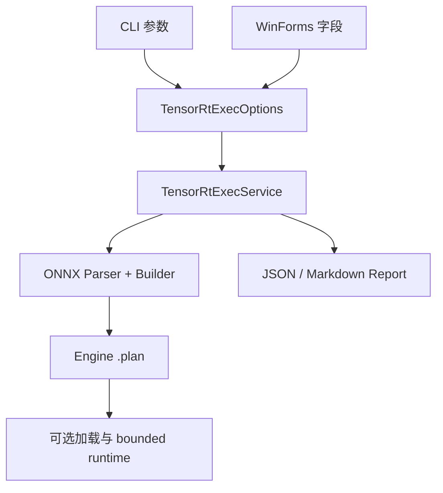

# TensorRT CSharp API v4.0 TensorRtExec 入门：使用 CLI 与 WinForms 构建 TensorRT Engine

<!-- public-article-layout:start -->
<style>
.content article { min-width: 0; overflow-wrap: anywhere; }
.content article a, .content article :not(pre) > code { overflow-wrap: anywhere; word-break: break-word; }
.content article pre:not(.mermaid), .content article table { display: block; max-width: 100%; overflow-x: auto; }
.content pre.mermaid { max-width: 640px; margin: 16px auto; overflow-x: auto; }
.content pre.mermaid svg { display: block; width: 100%; max-width: 640px; height: auto; }
</style>
<!-- public-article-layout:end -->

> 文章编号：`APP-EXEC-001`；适用版本：TensorRT CSharp API v4.0 `4.0.0`；当前状态：`ready`。

## 1. 前言
<!-- public-article-project-preface:start -->
TensorRT CSharp API v4.0 是一个面向 C#/.NET 开发者的 TensorRT 与 CUDA 工程化接口项目。它把 NVIDIA 原生运行时、生成式绑定、C++ Bridge、托管对象模型和可验证的示例程序组织成一条完整链路，使使用者可以在熟悉的 .NET 项目中完成 Engine 构建、反序列化、ExecutionContext 管理、CUDA 内存操作、异步流同步和结果校验。项目的目标不是隐藏 TensorRT 的概念，而是把这些概念转换为有明确生命周期、所有权和错误边界的 C# API。

4.0.0 是一次完整重构后的正式版本。核心接口、Bridge 边界、Runtime 包命名、样例目录和验证方式都以 4.x 设计为准，不能把 3.x 的类型名、旧包名或旧 DLL 目录直接复制到新项目。托管包只提供项目接口和自有 Bridge；TensorRT、CUDA、cuDNN、显卡驱动以及对应许可证仍由使用者按目标平台安装和管理。

单篇文章也应能够独立阅读：读者可以先从项目入口确认源码和包，再根据本文的程序路径准备依赖，最后用输出中的状态、计数、Shape、哈希或结果图片判断流程是否真的完成。对于尚未具备兼容 GPU 的环境，本文会把静态检查、期望输出和真实运行结果分开标记，不把帮助命令或 build-only 结果包装成推理成功。

项目、包和源码入口（以下地址保留明文，便于复制到不完整支持 Markdown 链接的平台）：

项目主页：

```text
https://github.com/guojin-yan/TensorRT-CSharp-API/tree/TensorRtSharp4.0
```

核心 NuGet：

```text
https://www.nuget.org/packages/JYPPX.TensorRT.CSharp.API/4.0.0
```

Runtime Bridge 包列表：

```text
https://www.nuget.org/packages?q=+JYPPX.TensorRT.CSharp&includeComputedFrameworks=true&prerel=true&sortby=relevance
```

运行库清单：

```text
https://github.com/guojin-yan/TensorRT-CSharp-API/blob/TensorRtSharp4.0/pack/runtime/runtime-packages.manifest.json
```

### 1.1 程序出处与输出说明

本文涉及的程序、脚本或命令均以仓库中的实现为准；对应源码入口：

```text
https://github.com/guojin-yan/TensorRT-CSharp-API/tree/TensorRtSharp4.0/applications
```

运行示例必须同时给出程序输出和判定标准。终端中的 `status`、`Ready`、`Bound`、`enqueueCount`、`OutputMatch`、进程退出码、报告文件或结果图片分别说明不同层次的事实；只有明确写出这些结果，读者才能区分程序启动、Engine 构建、GPU enqueue 和业务结果语义。
<!-- public-article-project-preface:end -->

TensorRT CSharp API v4.0：<https://github.com/guojin-yan/TensorRT-CSharp-API> 为 .NET 提供 TensorRT 与 CUDA C# API。除了底层接口和案例，项目还提供 `applications/TensorRtExec`：一个面向日常模型构建的工具应用，同时支持 trtexec 风格命令行和 Windows WinForms 界面。

CLI 适合脚本、批处理和 CI，WinForms 适合交互式选择模型、Shape、精度和报告路径。两个入口共享同一组 options、构建服务和报告 schema，因此同一个参数不会在 GUI 与命令行中产生两套互相矛盾的行为。

本文讲清第一次使用需要的安装、CLI、GUI、动态 Shape、构建报告和排障方法，并重点区分 Engine build-only 与真实模型推理。

### 1.2 项目、包与源码入口

| 项目 | 说明 | 链接 |
| --- | --- | --- |
| TensorRT CSharp API v4.0 | TensorRT/CUDA C# API 与工具集 | GitHub 项目：<https://github.com/guojin-yan/TensorRT-CSharp-API> |
| 稳定核心包 | 托管 API | `JYPPX.TensorRT.CSharp.API 4.0.0`：<https://www.nuget.org/packages/JYPPX.TensorRT.CSharp.API/4.0.0> |
| Runtime Bridge | 按 TensorRT/CUDA/cuDNN 组合选择 | NuGet 包列表：<https://www.nuget.org/profiles/JYPPX> |
| TensorRtExec | CLI 与 WinForms 源码应用 | 应用目录：<https://github.com/guojin-yan/TensorRT-CSharp-API/tree/TensorRtSharp4.0/applications/TensorRtExec> |
| CLI 入口 | 参数解析与运行模式选择 | `Program.cs`：<https://github.com/guojin-yan/TensorRT-CSharp-API/blob/TensorRtSharp4.0/applications/TensorRtExec/Program.cs> |
| GUI 窗口 | WinForms 字段与交互 | `MainForm.cs`：<https://github.com/guojin-yan/TensorRT-CSharp-API/blob/TensorRtSharp4.0/applications/TensorRtExec/MainForm.cs> |
| 应用说明 | 参数、能力和边界 | `README.md`：<https://github.com/guojin-yan/TensorRT-CSharp-API/blob/TensorRtSharp4.0/applications/TensorRtExec/README.md> |

TensorRtExec 是 source-only 应用，不作为独立 NuGet 或预编译桌面程序随 `4.0.0` Release 发布。它消费稳定核心包和共享工具代码。

## 2. 工具定位

TensorRtExec 主要解决四类问题：

1. 把 ONNX 构建为 TensorRT serialized Engine。
2. 为动态输入配置 min/opt/max Optimization Profile。
3. 统一设置 FP16、TF32、Workspace、Builder Optimization Level 等构建参数。
4. 输出 JSON/Markdown 报告，记录环境、模型、参数、Parser、Engine 与 proof classification。

它不是模型业务框架。任意 ONNX 的图像预处理、Tokenizer、检测解码、分类 labels 和参考输出仍应由模型对应的应用实现。



## 3. 系统要求与安装

WinForms 入口只面向 Windows；CLI 项目当前同样以 `net8.0-windows` 构建。机器需要：

- Windows x64；
- .NET 8 SDK 或满足仓库要求的更高 SDK；
- 支持的 NVIDIA GPU 与 Driver；
- 与所选 Bridge 匹配的 CUDA、cuDNN 和 TensorRT。

以 TensorRT 10.11、CUDA 12.9 和 cuDNN 9.22 为例，独立消费者的基础包为：

```powershell
dotnet add package JYPPX.TensorRT.CSharp.API --version 4.0.0
dotnet add package JYPPX.TensorRT.CSharp.API.Runtime.win-x64.trt10.11.cuda12.9.cudnn9.22.Bridge --version 4.0.0
```

在源码仓库中构建工具：

```powershell
dotnet build .\applications\TensorRtExec\TensorRtExec.csproj `
  -c Release `
  /p:UseSharedCompilation=false
```

> 当前源码复核说明：2026-08-13 已重新构建当前 TensorRtExec Release 程序，并在 TensorRT 10.11 / CUDA 12.9 环境完成 `--help`、WinForms Preview/Run、MNIST GUI build-only、CLI 构建/推理、Reference 比较和独立 `--loadEngine` 复跑。机器可读摘要位于 `docs/articles/zh-cn/03-applications/tensorrtexec/tensorrtexec-runtime-evidence-20260813.json`。

## 4. 第一次使用 CLI

先创建仓库外的模型和输出目录：

```powershell
$RepoRoot = (Get-Location).Path
$WorkspaceRoot = Split-Path -Parent $RepoRoot
$ModelRoot = Join-Path $WorkspaceRoot 'models\TensorRtExec\MyModel'
$OutputRoot = Join-Path $WorkspaceRoot 'work\tensorrtexec\my-model'
New-Item -ItemType Directory -Path $OutputRoot -Force | Out-Null
```

### 4.1 静态输入模型

```powershell
dotnet run --project .\applications\TensorRtExec -- `
  --onnx (Join-Path $ModelRoot 'model.onnx') `
  --saveEngine (Join-Path $OutputRoot 'model.plan') `
  --fp16 `
  --workspace 512 `
  --builderOptimizationLevel 3 `
  --exportReport (Join-Path $OutputRoot 'build-report.json') `
  --buildOnly
```

### 4.2 动态输入模型

```powershell
dotnet run --project .\applications\TensorRtExec -- `
  --onnx (Join-Path $ModelRoot 'model-dynamic.onnx') `
  --saveEngine (Join-Path $OutputRoot 'model-dynamic.plan') `
  --minShapes input:1x3x640x640 `
  --optShapes input:1x3x640x640 `
  --maxShapes input:4x3x640x640 `
  --fp16 `
  --workspace 1024 `
  --exportReport (Join-Path $OutputRoot 'dynamic-build-report.json') `
  --buildOnly
```

Shape 格式是 `tensorName:dimensionxdimension...`。多输入模型需要为每个动态输入提供三组 Shape；tensor 名称应来自实际 ONNX，而不是根据界面显示猜测。

### 4.3 加载已有 Engine

```powershell
dotnet run --project .\applications\TensorRtExec -- `
  --loadEngine (Join-Path $OutputRoot 'model.plan') `
  --exportReport (Join-Path $OutputRoot 'load-report.json')
```

加载路径会读取 Engine metadata。只有所有输入输出合同都满足受限执行条件时，工具才会尝试 bounded enqueue/readback；没有 reference output 的结果会标记为 `runtime-output-captured-unverified`，不能写成真实模型验证通过。

## 5. 使用 WinForms

无参数启动时进入 WinForms：

```powershell
dotnet run --project .\applications\TensorRtExec
```

界面中的关键区域包括：

| 区域 | 字段 | 建议 |
| --- | --- | --- |
| 输入输出 | ONNX、Engine、Report | 使用仓库外工作目录 |
| Runtime | TensorRT line | 与安装的 Bridge 保持一致 |
| Precision | FP16、INT8、BF16、TF32 | 只启用当前 TensorRT line 已实际应用的能力 |
| Memory | Workspace MiB | 根据模型和 GPU 余量设置 |
| Shape | Min/Opt/Max | 动态输入必须填写完整 |
| Mode | Build only、Skip inference | 第一次处理外部模型保持启用 |


点击运行后，日志、状态和报告均由与 CLI 相同的 `TensorRtExecService` 产生：


默认启用 Build only 与 Skip inference，是为了避免用户在没有输入合同和后处理时，把任意模型构建成功误写成推理成功。

## 6. 常用参数

| 参数 | 作用 | 当前边界 |
| --- | --- | --- |
| `--onnx` | 输入 ONNX | 构建路径 |
| `--saveEngine` | 保存 `.plan` | 构建产物 |
| `--loadEngine` | 加载现有 Engine | 反序列化/受限执行 |
| `--fp16` / `--tf32` | 精度开关 | 需检查 applied/readback 字段 |
| `--int8` | INT8 请求 | 不代表 calibrator 已配置 |
| `--workspace` | Workspace MiB | Builder memory pool |
| `--builderOptimizationLevel` | Builder 优化等级 | 需匹配 TensorRT line |
| `--minShapes` / `--optShapes` / `--maxShapes` | 动态 profile | 三组必须完整且有序 |
| `--exportReport` | JSON 或 Markdown 报告 | 报告本身不是 runtime proof |
| `--evidenceSidecar` | 模型和输入证据补充 | 不能提高 proof 等级 |
| `--buildOnly` | 只构建不推理 | `build-only` |

`--plugins` 可以进入参数和报告，但应用不会因此自动承担任意 plugin 的加载、注册和生命周期。`--int8` 被解析也不等于校准器、校准集和 cache 已形成完整量化流程。

## 7. 报告应该怎么看

JSON 报告中最重要的不是 `Success` 一个字段，而是以下组合：

```json
{
  "ProofClassification": "build-only",
  "BuildEvidenceOnly": true,
  "IsRuntimeExecutionProof": false,
  "IsRealModelRuntimeProof": false,
  "IsPackageConsumerRuntimeProof": false
}
```

常见等级：

| Proof | 表示什么 | 不能说明什么 |
| --- | --- | --- |
| `dependency-probe-only` | 依赖可探测 | Parser/Builder 可运行 |
| `build-only` | ONNX 成功构建 Engine | 模型业务输出正确 |
| `synthetic-input-runtime` | 合成输入执行成功 | 真实模型/真实输入正确 |
| `runtime-output-captured-unverified` | 已获取输出 | 输出语义正确 |
| `real-model-runtime` | 固定真实资产与语义校验通过 | 公共 NuGet 已发布并验证 |
| `package-consumer-runtime` | 包消费者运行通过 | 必然是 public feed 或 post-publish |

报告应同时检查 `Skipped`、`SkipReason`、`Diagnostics`、Parser errors、Engine hash、requested/applied/readback 参数和进程退出码。

## 8. 已登记的 GUI 构建结果

2026-08-04 的记录 `tensorrtexec-gui-mnist-build-win-x64-trt10.11-cuda12.9-20260804` 使用 TensorRT 10.11 sample data 中的 MNIST ONNX，实测环境为 Windows 11、RTX 3060 Laptop GPU、Driver 576.02、CUDA 12.9 和 TensorRT 10.11.0.33。

| 检查项 | 结果 |
| --- | --- |
| ONNX parsed | true |
| Engine saved | true |
| Inference ran | false |
| Workspace | 67,108,864 bytes |
| Builder optimization level | 3 |
| TF32 requested/applied/readback | true / true / true |
| Parser errors | 0 |
| Engine 大小 | 436,540 bytes |
| Engine SHA256 | `60a6d3ad888a4b832c054df9db89334066ad689b6c16b8e031ff852d33fa7148` |
| Exit code | 0 |
| Proof | `build-only` |

这条记录证明 GUI 参数进入真实 Parser/Builder 并生成可哈希的 Engine，但 `InferenceRan=false`，因此不能声称 MNIST 分类成功。截图与数值采集于 2026-08-04，2026-08-09 formatter 更新后没有重新截图，不能描述为当前提交的精确界面复测。

## 9. 常见问题

### 9.1 GUI 打不开

确认使用 Windows，并从 `net8.0-windows` 目标启动。远程无桌面会话或非 Windows 系统不能使用 WinForms，可改用 CLI。

### 9.2 找不到 TensorRT 或 Bridge

检查所选 TensorRT line、Runtime Bridge 包 ID、NVIDIA 安装目录和进程 PATH。Bridge 组合不匹配时不要复制其他版本 DLL 强行替换。

### 9.3 Parser 报不支持的算子

检查 ONNX opset、导出参数和是否需要自定义 plugin。报告中保留全部 parser errors；模型简化或重新导出后重新计算 SHA256。

### 9.4 动态 Shape 报错

确认 min/opt/max 同时存在，维度顺序正确，并覆盖实际运行 Shape。对多输入模型逐个核对名称。

### 9.5 Engine 构建成功但应用结果不对

TensorRtExec 只完成通用构建。应转到具体业务 runner，补齐真实输入、预处理、输出解码、参考结果和受控负例。

### 9.6 当前源码出现 `TensorRtApiLine` 缺失

这是共享应用工具项目引用问题，不是 GUI 参数或 ONNX 文件问题。当前 2026-08-13 Release 构建及 CLI/GUI 复跑已通过；若读者环境再次出现该错误，应先核对 `JYPPX.TensorRtSharp.ApplicationTools` 的版本与项目引用，再重新构建。

## 10. 证据边界

本文展示了 TensorRtExec 的 CLI/GUI 工作流。2026-08-13 当前源码复跑中，GUI build-only 得到 `external-onnx-build-only`、Parser error 0、2 个 binding 和 367748 字节 Engine；CLI 使用固定 MNIST float32 输入与 repository reference 完成构建、推理和独立 Engine 重载，两次输出 SHA256 均为 `c2ae024fb1a0f958fdad982b8586916089fa726e02ddcf36dfc4476964f0a84e`，Reference mismatch 为 0。

这组结果证明当前源码树中 Parser、Builder、Engine 保存、bounded runtime、输出校验和 GUI/CLI 共享服务成立。GUI 本身仍是 build-only 证据，通用 MNIST tensor 运行保守归类为 `synthetic-input-runtime`；本文也不是独立 public-package consumer、post-publish proof 或应用二进制发布声明，没有执行 NuGet push、Tag、GitHub Release 或外部文章发布。

## 11. 总结

TensorRtExec 适合作为 ONNX 到 TensorRT Engine 的统一构建入口：日常交互使用 WinForms，自动化使用 CLI，两者共享参数和报告。最稳妥的流程是先 build-only 并审查报告，再由 Classification、YoloVision 或自有业务程序完成真实输入和输出语义验证。

<!-- public-article-declaration:start -->
## 12. 文章声明

### 12.1 开源协议声明
作者所有开源项目代码均遵循 Apache License 2.0 开源协议。
特别说明：本项目集成了若干第三方库。若任何第三方库的许可协议与 Apache 2.0 协议存在冲突或不一致，均以该第三方库的原始许可协议为准。本项目不包含也不代表这些第三方库的授权声明，使用前请务必阅读并遵守第三方库的相关许可。

### 12.2 代码开发与质量说明
AI 辅助开发：本代码在开发过程中使用了人工智能（AI）辅助生成与优化，并非完全由人工逐行编写。
安全性承诺：作者郑重声明，本代码中绝无任何有意设置的后门、病毒、木马或旨在破坏用户设备、窃取数据的恶意代码。
技术局限性：受限于作者个人的技术水平与能力，代码中可能存在因逻辑不严谨、优化不足或经验欠缺导致的低级问题（例如但不限于内存泄漏、偶发崩溃、资源未释放等）。这些问题纯属能力不足所致，并非主观故意。
测试范围：由于作者精力有限，未对本软件进行全方位、覆盖所有边缘场景的完整测试。

### 12.3 免责声明（重要）
请在将本代码应用于任何实际项目（特别是商业、工业或关键任务环境）之前，务必进行详尽、严格的自行测试与验证。 鉴于上述可能存在的代码缺陷及测试覆盖不足，因使用本代码而导致的任何直接或间接损失（包括但不限于设备故障、数据丢失、系统瘫痪或利润损失等），本作者概不负责。 一旦您开始使用本代码，即表示您已知晓上述风险并同意自行承担一切后果，相关问题与本作者无关。

### 12.4 代码开源范围
本项目承诺核心逻辑代码完全开源，但上述提到的“第三方库”的二进制文件、源代码或相关资源不在本项目的开源义务范围内，请根据其各自的指引获取。

### 12.5 社区与反馈
尽管存在上述不足，我们仍欢迎大家下载使用、提交 Issue 或参与测试，共同完善项目。如果您在使用过程中发现 Bug、内存溢出或有改进建议，欢迎通过项目主页提供的联系方式与作者取得联系，我们将尽力在有限的时间内提供协助。


<!-- public-article-declaration:end -->
