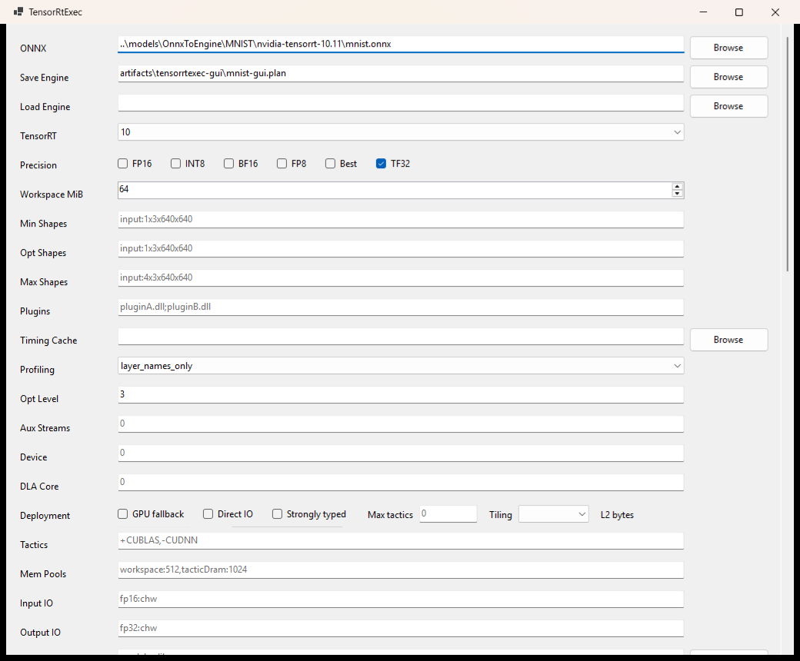
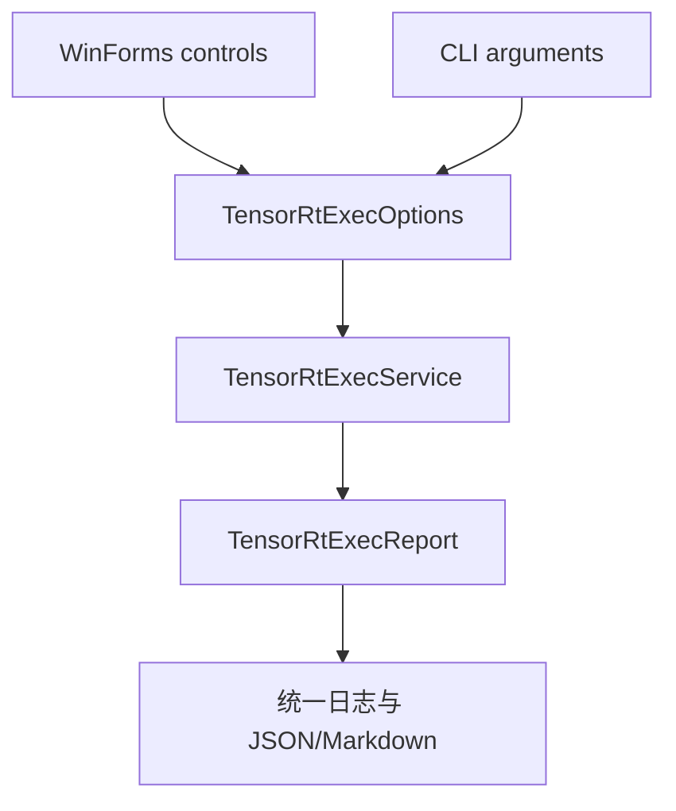
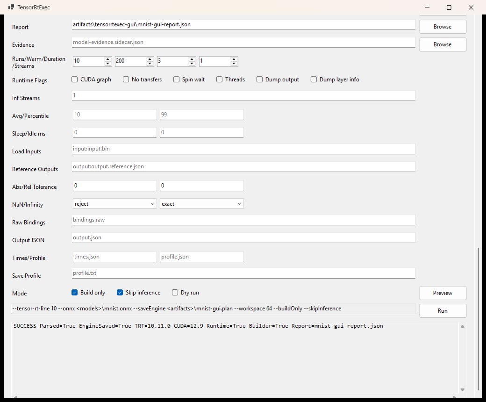

# 使用 TensorRT CSharp API v4.0 TensorRtExec GUI 将 ONNX 构建为 TensorRT Engine

<!-- public-article-layout:start -->
<style>
.content article { min-width: 0; overflow-wrap: anywhere; }
.content article a, .content article :not(pre) > code { overflow-wrap: anywhere; word-break: break-word; }
.content article pre:not(.mermaid), .content article table { display: block; max-width: 100%; overflow-x: auto; }
.content pre.mermaid { max-width: 640px; margin: 16px auto; overflow-x: auto; }
.content pre.mermaid svg { display: block; width: 100%; max-width: 640px; height: auto; }
</style>
<!-- public-article-layout:end -->

> 文章编号：`APP-EXEC-002`；适用版本：TensorRT CSharp API v4.0 `4.0.0`；当前状态：`ready`。

## 1. 前言
<!-- public-article-project-preface:start -->
TensorRT CSharp API v4.0 是一个面向 C#/.NET 开发者的 TensorRT 与 CUDA 工程化接口项目。它把 NVIDIA 原生运行时、生成式绑定、C++ Bridge、托管对象模型和可验证的示例程序组织成一条完整链路，使使用者可以在熟悉的 .NET 项目中完成 Engine 构建、反序列化、ExecutionContext 管理、CUDA 内存操作、异步流同步和结果校验。项目的目标不是隐藏 TensorRT 的概念，而是把这些概念转换为有明确生命周期、所有权和错误边界的 C# API。

4.0.0 是一次完整重构后的正式版本。核心接口、Bridge 边界、Runtime 包命名、样例目录和验证方式都以 4.x 设计为准，不能把 3.x 的类型名、旧包名或旧 DLL 目录直接复制到新项目。托管包只提供项目接口和自有 Bridge；TensorRT、CUDA、cuDNN、显卡驱动以及对应许可证仍由使用者按目标平台安装和管理。

单篇文章也应能够独立阅读：读者可以先从项目入口确认源码和包，再根据本文的程序路径准备依赖，最后用输出中的状态、计数、Shape、哈希或结果图片判断流程是否真的完成。对于尚未具备兼容 GPU 的环境，本文会把静态检查、期望输出和真实运行结果分开标记，不把帮助命令或 build-only 结果包装成推理成功。

项目、包和源码入口（以下地址保留明文，便于复制到不完整支持 Markdown 链接的平台）：

项目主页：

```text
https://github.com/guojin-yan/TensorRT-CSharp-API/tree/TensorRtSharp4.0
```

核心 NuGet：

```text
https://www.nuget.org/packages/JYPPX.TensorRT.CSharp.API/4.0.0
```

Runtime Bridge 包列表：

```text
https://www.nuget.org/packages?q=+JYPPX.TensorRT.CSharp&includeComputedFrameworks=true&prerel=true&sortby=relevance
```

运行库清单：

```text
https://github.com/guojin-yan/TensorRT-CSharp-API/blob/TensorRtSharp4.0/pack/runtime/runtime-packages.manifest.json
```

### 1.1 程序出处与输出说明

本文涉及的程序、脚本或命令均以仓库中的实现为准；对应源码入口：

```text
https://github.com/guojin-yan/TensorRT-CSharp-API/tree/TensorRtSharp4.0/applications
```

运行示例必须同时给出程序输出和判定标准。终端中的 `status`、`Ready`、`Bound`、`enqueueCount`、`OutputMatch`、进程退出码、报告文件或结果图片分别说明不同层次的事实；只有明确写出这些结果，读者才能区分程序启动、Engine 构建、GPU enqueue 和业务结果语义。
<!-- public-article-project-preface:end -->

TensorRT 模型构建通常从命令行开始，但在模型初次接入、参数对照和问题排查阶段，一个能直接查看 ONNX、Engine、Shape、精度和报告路径的桌面界面更容易使用。TensorRT CSharp API v4.0：<https://github.com/guojin-yan/TensorRT-CSharp-API> 提供 TensorRT/CUDA C# API，`TensorRtExec` 则在此基础上提供 Windows WinForms 与 trtexec 风格 CLI 两种入口。

GUI 并不是另一套简化实现。界面字段会生成同一个 `TensorRtExecOptions`，随后调用同一个 `TensorRtExecService`；命令预览、报告结构和错误分类也与 CLI 共用。这使用户可以在界面中完成第一次构建，再把归一化命令放入脚本或 CI。

### 1.2 项目、包与源码入口

| 项目 | 作用 | 链接 |
| --- | --- | --- |
| TensorRT CSharp API v4.0 | TensorRT/CUDA C# API 与示例应用 | GitHub 项目：<https://github.com/guojin-yan/TensorRT-CSharp-API> |
| 核心接口包 | .NET 托管 API | `JYPPX.TensorRT.CSharp.API 4.0.0`：<https://www.nuget.org/packages/JYPPX.TensorRT.CSharp.API/4.0.0> |
| Runtime Bridge | 原生桥接层，按环境组合选择 | JYPPX NuGet 包列表：<https://www.nuget.org/profiles/JYPPX> |
| TensorRtExec | CLI 与 WinForms 源码应用 | 应用源码：<https://github.com/guojin-yan/TensorRT-CSharp-API/tree/TensorRtSharp4.0/applications/TensorRtExec> |
| GUI 主窗口 | 控件、命令预览和执行交互 | `MainForm.cs`：<https://github.com/guojin-yan/TensorRT-CSharp-API/blob/TensorRtSharp4.0/applications/TensorRtExec/WinForms/MainForm.cs> |
| 共享参数模型 | GUI/CLI 到统一参数的投影 | `TensorRtExecOptions.cs`：<https://github.com/guojin-yan/TensorRT-CSharp-API/blob/TensorRtSharp4.0/applications/TensorRtExec/Core/TensorRtExecOptions.cs> |
| 执行服务 | 构建、运行和报告入口 | `TensorRtExecService.cs`：<https://github.com/guojin-yan/TensorRT-CSharp-API/blob/TensorRtSharp4.0/applications/TensorRtExec/Core/TensorRtExecService.cs> |

TensorRtExec 当前是 source-only 应用，并没有独立的安装程序或桌面 NuGet 包。它面向需要查看和修改源码的 .NET 用户，运行时仍需要正确安装 NVIDIA Driver、CUDA、cuDNN、TensorRT，以及匹配的 Bridge 包。

## 2. GUI 适合哪些场景

| 场景 | GUI 的价值 |
| --- | --- |
| 第一次接入 ONNX | 集中填写模型、Engine、Shape 和报告路径 |
| Dynamic Shape | 同时查看 min/opt/max，减少漏填 |
| 构建参数对照 | 直观看到 FP16、Workspace、Optimization Level 等选项 |
| 迁移到自动化 | 复制 Command Preview，转成 CLI 脚本 |
| 排查问题 | 在日志区查看 Parser、Builder、最终状态和报告路径 |

批量构建、无人值守任务和 CI 更适合使用 CLI。GUI 和 CLI 的选择只是交互方式不同，不改变底层构建能力。

## 3. 系统要求与启动

GUI 项目目标框架是 `net8.0-windows`，因此桌面入口只面向 Windows。准备环境：

- Windows x64；
- .NET 8 SDK 或满足仓库要求的更高 SDK；
- NVIDIA GPU 与 Driver；
- 与 Bridge 包匹配的 TensorRT、CUDA 和 cuDNN；
- TensorRT CSharp API v4.0 源码仓库。

从仓库根目录启动：

```powershell
dotnet run --project .\applications\TensorRtExec
```

或者显式指定 UI：

```powershell
dotnet run --project .\applications\TensorRtExec -- --ui
```

没有参数时，`Program.Main` 会直接进入 WinForms；带构建参数时则进入 CLI。

## 4. 界面结构



界面字段可以分成以下区域：

| 区域 | 关键字段 | 说明 |
| --- | --- | --- |
| Input / Output | ONNX、Save Engine、Load Engine | 选择构建输入或已有 Engine |
| Runtime | TensorRT line、device | 与当前安装的 Bridge 和 GPU 对齐 |
| Shapes | Min、Opt、Max | 动态输入的 Optimization Profile |
| Precision | FP16、INT8、BF16、TF32 | 精度请求，实际状态以报告为准 |
| Builder | Workspace、Optimization Level、Aux Streams | 构建资源和搜索策略 |
| Benchmark | iterations、warmup、duration、streams | 受限运行和计时参数 |
| Artifacts | Report、Output、Times、Layer Info | 保存机器可读结果 |
| Mode | Build Only、Skip Inference、Dry Run | 控制本次流程范围 |
| Preview | Command Preview | GUI 投影出的归一化命令 |

## 5. 第一次构建：推荐操作顺序

### 5.1 准备目录

模型和 Engine 不应直接写入源码目录。推荐使用仓库外工作目录：

```powershell
$WorkspaceRoot = Split-Path -Parent $PWD
$ModelRoot = Join-Path $WorkspaceRoot 'models\TensorRtExec\mnist'
$OutputRoot = Join-Path $WorkspaceRoot 'work\TensorRtExec\mnist'
New-Item -ItemType Directory -Path $OutputRoot -Force | Out-Null
```

### 5.2 选择输入输出

1. 在 **ONNX** 中选择模型。
2. 在 **Save Engine** 中设置 `.plan` 文件。
3. 在 **Export Report** 中设置 `.json` 或 `.md` 报告。
4. TensorRT line 选择与 Bridge 一致的 `8`、`10` 或 `11`。

Engine 是平台相关二进制，不建议作为跨机器通用文件分发。报告应和 Engine 一起保存，用于说明构建环境和参数。

### 5.3 配置 Shape

静态模型可以保留模型固有 Shape。动态模型需要填写完整三元组，例如：

```text
Min: images:1x3x640x640
Opt: images:1x3x640x640
Max: images:4x3x640x640
```

多输入模型用逗号分隔。tensor 名称必须来自 ONNX graph；界面不会把错误名称自动映射为正确输入。

### 5.4 配置 Builder

第一次构建建议：

| 字段 | 起始建议 | 原因 |
| --- | --- | --- |
| Workspace | 512 或 1024 MiB | 给 Builder 留出合理 tactic 空间 |
| Optimization Level | 3 | 在构建耗时和搜索强度之间取中间值 |
| FP16 | 先关闭，随后对照 | 先建立 FP32 基线 |
| INT8 | 不勾选 | 完整校准链路需要额外数据和验证 |
| Build Only | 勾选 | 先验证 Parser 与 Builder |
| Skip Inference | 勾选 | 外部模型尚无输入语义时避免误运行 |

这些是接入顺序，不是固定性能处方。后续应结合模型、GPU 和 reference output 调整。

### 5.5 先 Dry Run，再 Build Only

第一次填写完成后先启用 **Dry Run**，检查 Command Preview 与参数归一化结果；确认路径和 Shape 后关闭 Dry Run，保留 **Build Only** 和 **Skip Inference**，再执行真实构建。

Dry Run 不读取完整业务输出，Build Only 也不做模型任务后处理。两者的成功含义不同，报告会通过 `DryRun`、`BuildEvidenceOnly` 和 `ProofClassification` 区分。

## 6. GUI 与 CLI 如何保持一致



GUI 的 Command Preview 来自 `TensorRtExecOptions.ToArgumentLine()`。因此界面中的一次 MNIST build-only 操作可以归一化为类似命令：

```powershell
dotnet run --project .\applications\TensorRtExec -- `
  --tensor-rt-line 10 `
  --onnx .\models\mnist.onnx `
  --saveEngine .\work\mnist-gui.plan `
  --workspace 64 `
  --profilingVerbosity layer_names_only `
  --builderOptimizationLevel 3 `
  --batch 2 `
  --iterations 10 `
  --warmUp 200 `
  --duration 3 `
  --streams 1 `
  --buildOnly `
  --skipInference `
  --exportReport .\work\mnist-gui-report.json
```

在 build-only 模式下，`iterations`、`warmUp`、`duration` 和 `streams` 不会产生 benchmark，报告应把它们放入未执行或 parse-only 区域，而不是伪造计时数据。

## 7. 真实 GUI 构建结果



仓库保留的 GUI 记录使用 NVIDIA TensorRT sample-data 中的 MNIST ONNX，在 TensorRT 10.11 / CUDA 12.9 环境执行 build-only：

| 检查项 | 结果 |
| --- | --- |
| 状态 | `external-onnx-build-only` |
| Parser | `Parsed=true`，error count 0 |
| Engine | 已保存，436,540 bytes |
| Engine SHA256 | `60a6d188956242b6b5c7d8f3ff65bb030902be0909139fba2f97369a3b4b7148` |
| Workspace | 64 MiB |
| Builder Optimization Level | 3，报告中产生配置 readback |
| TF32 | 请求并回读成功 |
| Report SHA256 | `a4377624f7c3e0577434f09c7bcc89de195c5af1facc4e3fc06299dbeba3b2ef` |
| Normalized Command SHA256 | `2ab6c448685828806288bd1d046a10b843da70f0a4c83cee7bc04d7367bd8161` |
| 结果分类 | `build-only`，`InferenceRan=false` |

这张界面截图证明 GUI 字段、命令预览、共享服务和构建报告能够形成完整可见流程；它不证明 MNIST 分类输出正确。真实数字 7 推理和 ORT 对比由 OnnxToEngine 的 MNIST 专用流程完成。

## 8. 如何阅读执行结果

GUI 日志区至少应找到：

```text
TensorRtExec ReportPath=<report>
TensorRtExec ProofClassification=<classification>
TensorRtExec NormalizedCommandSha256=<sha256>
TensorRtExec State=<state> Success=<true|false>
```

报告中继续检查：

- `ParsedOptions`：界面生成并被 Parser 接收的选项；
- `AppliedOptions`：实际进入构建或运行实现的选项；
- `ParseOnlyOptions`：被记录但本次没有执行的选项；
- `ParserPreflightSnapshot`：ONNX Parser 的复制诊断；
- `BuilderConfigDeploymentSnapshot`：Builder 配置只读快照；
- `BindingMetadata`：Engine 顺序下的输入输出合同；
- `ReportBoundary`：本次结果可以支持哪些结论。

## 9. 从 GUI 迁移到 CLI

GUI 构建通过后，复制 Command Preview，并完成三项清理：

1. 把本机绝对路径改为脚本变量或 CI 工作目录。
2. 删除 build-only 下不会执行的 benchmark 参数，减少歧义。
3. 对运行路径补全 `--loadInputs`、`--referenceOutputs` 和容差策略。

这样可以让 GUI 负责初次探索，CLI 负责重复执行和自动化。

## 10. 常见问题

### 10.1 点击运行后立即失败

先看最终错误分类，再检查模型路径、输出目录写权限和 tensor 名称。不要只截取最后一行异常，应同时保存完整报告。

### 10.2 Dynamic Shape 构建失败

检查 min/opt/max 是否全部填写、rank 是否一致、每个动态输入是否覆盖，以及实际名称是否与 ONNX 一致。

### 10.3 勾选 FP16 后没有性能提升

FP16 只是 Builder 请求。应检查 applied/readback、Engine Inspector 和固定输入下的 benchmark；模型层、GPU 和 tactic 都会影响结果。

### 10.4 GUI 构建成功但没有识别结果

Build Only 与 Skip Inference 本来就不会产生业务预测。需要提供真实输入 tensor、预处理、输出解码和 reference，或改用 YoloVision/MNIST 等模型专属 Runner。

### 10.5 GUI 与 CLI 结果不同

比较两边的 `NormalizedCommandLine` 和 SHA256，而不是只看视觉控件。路径、默认值或未保存字段不同都会体现在归一化命令中。

## 11. 当前源码复核状态

2026-08-13 已从当前 Release `TensorRtExec.exe --ui` 启动真实 WinForms 窗口，通过 Windows UI Automation 读取 ONNX、Save Engine、TensorRT、Workspace、Preview、Run 和日志控件，填入 MNIST build-only 参数并依次执行 Preview 与 Run。实际构建耗时约 22.9 秒，报告得到 `TensorRT=10.11.0`、`CUDA=12.9`、`Parsed=True`、`EngineSaved=True`、Parser error 0、binding count 2，Engine 为 367748 字节；`InferenceRan=False` 是本步骤勾选 Build Only/Skip Inference 的预期结果。

同一轮还保留了未设置 bridge 环境时的 `dependency-probe-only` 失败报告，随后以明确的 TensorRT/bridge 路径重新启动进程并成功构建。它证明 GUI 会如实暴露 native dependency 边界，而不是把依赖探测失败写成 Engine 成功。当前复跑摘要和哈希位于 `docs/articles/zh-cn/03-applications/tensorrtexec/tensorrtexec-runtime-evidence-20260813.json`；正文既有 2026-08-04 截图仍保留其原始哈希与日期，不冒充本次新截图。

## 12. 总结

TensorRtExec GUI 的价值不只是“把参数放进窗口”，而是让第一次模型构建、命令归一化、报告保存和后续 CLI 自动化使用同一套实现。使用时先 Dry Run，再 Build Only，最后由模型专属输入和 reference output 完成运行验证，可以避免把界面上的绿色状态误解为业务模型已经验证完成。

<!-- public-article-declaration:start -->
## 13. 文章声明

### 13.1 开源协议声明
作者所有开源项目代码均遵循 Apache License 2.0 开源协议。
特别说明：本项目集成了若干第三方库。若任何第三方库的许可协议与 Apache 2.0 协议存在冲突或不一致，均以该第三方库的原始许可协议为准。本项目不包含也不代表这些第三方库的授权声明，使用前请务必阅读并遵守第三方库的相关许可。

### 13.2 代码开发与质量说明
AI 辅助开发：本代码在开发过程中使用了人工智能（AI）辅助生成与优化，并非完全由人工逐行编写。
安全性承诺：作者郑重声明，本代码中绝无任何有意设置的后门、病毒、木马或旨在破坏用户设备、窃取数据的恶意代码。
技术局限性：受限于作者个人的技术水平与能力，代码中可能存在因逻辑不严谨、优化不足或经验欠缺导致的低级问题（例如但不限于内存泄漏、偶发崩溃、资源未释放等）。这些问题纯属能力不足所致，并非主观故意。
测试范围：由于作者精力有限，未对本软件进行全方位、覆盖所有边缘场景的完整测试。

### 13.3 免责声明（重要）
请在将本代码应用于任何实际项目（特别是商业、工业或关键任务环境）之前，务必进行详尽、严格的自行测试与验证。 鉴于上述可能存在的代码缺陷及测试覆盖不足，因使用本代码而导致的任何直接或间接损失（包括但不限于设备故障、数据丢失、系统瘫痪或利润损失等），本作者概不负责。 一旦您开始使用本代码，即表示您已知晓上述风险并同意自行承担一切后果，相关问题与本作者无关。

### 13.4 代码开源范围
本项目承诺核心逻辑代码完全开源，但上述提到的“第三方库”的二进制文件、源代码或相关资源不在本项目的开源义务范围内，请根据其各自的指引获取。

### 13.5 社区与反馈
尽管存在上述不足，我们仍欢迎大家下载使用、提交 Issue 或参与测试，共同完善项目。如果您在使用过程中发现 Bug、内存溢出或有改进建议，欢迎通过项目主页提供的联系方式与作者取得联系，我们将尽力在有限的时间内提供协助。


<!-- public-article-declaration:end -->
