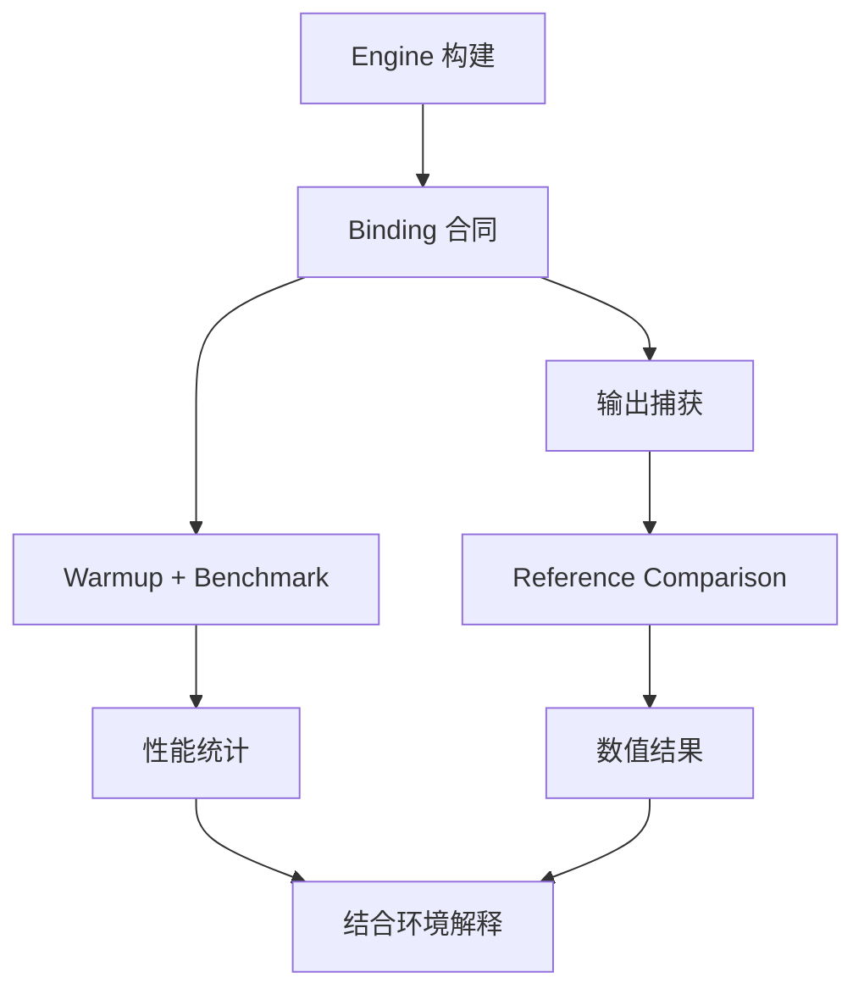

# TensorRT CSharp API v4.0 TensorRtExec 进阶：性能测试、多流、精度策略与输出校验

<!-- public-article-layout:start -->
<style>
.content article { min-width: 0; overflow-wrap: anywhere; }
.content article a, .content article :not(pre) > code { overflow-wrap: anywhere; word-break: break-word; }
.content article pre:not(.mermaid), .content article table { display: block; max-width: 100%; overflow-x: auto; }
.content pre.mermaid { max-width: 640px; margin: 16px auto; overflow-x: auto; }
.content pre.mermaid svg { display: block; width: 100%; max-width: 640px; height: auto; }
</style>
<!-- public-article-layout:end -->

> 文章编号：`APP-EXEC-004`；适用版本：TensorRT CSharp API v4.0 `4.0.0`；当前状态：`review`。

## 1. 前言
<!-- public-article-project-preface:start -->
TensorRT CSharp API v4.0 是一个面向 C#/.NET 开发者的 TensorRT 与 CUDA 工程化接口项目。它把 NVIDIA 原生运行时、生成式绑定、C++ Bridge、托管对象模型和可验证的示例程序组织成一条完整链路，使使用者可以在熟悉的 .NET 项目中完成 Engine 构建、反序列化、ExecutionContext 管理、CUDA 内存操作、异步流同步和结果校验。项目的目标不是隐藏 TensorRT 的概念，而是把这些概念转换为有明确生命周期、所有权和错误边界的 C# API。

4.0.0 是一次完整重构后的正式版本。核心接口、Bridge 边界、Runtime 包命名、样例目录和验证方式都以 4.x 设计为准，不能把 3.x 的类型名、旧包名或旧 DLL 目录直接复制到新项目。托管包只提供项目接口和自有 Bridge；TensorRT、CUDA、cuDNN、显卡驱动以及对应许可证仍由使用者按目标平台安装和管理。

单篇文章也应能够独立阅读：读者可以先从项目入口确认源码和包，再根据本文的程序路径准备依赖，最后用输出中的状态、计数、Shape、哈希或结果图片判断流程是否真的完成。对于尚未具备兼容 GPU 的环境，本文会把静态检查、期望输出和真实运行结果分开标记，不把帮助命令或 build-only 结果包装成推理成功。

项目、包和源码入口（以下地址保留明文，便于复制到不完整支持 Markdown 链接的平台）：

项目主页：

```text
https://github.com/guojin-yan/TensorRT-CSharp-API/tree/TensorRtSharp4.0
```

核心 NuGet：

```text
https://www.nuget.org/packages/JYPPX.TensorRT.CSharp.API/4.0.0
```

Runtime Bridge 包列表：

```text
https://www.nuget.org/packages?q=+JYPPX.TensorRT.CSharp&includeComputedFrameworks=true&prerel=true&sortby=relevance
```

运行库清单：

```text
https://github.com/guojin-yan/TensorRT-CSharp-API/blob/TensorRtSharp4.0/pack/runtime/runtime-packages.manifest.json
```

### 1.1 程序出处与输出说明

本文涉及的程序、脚本或命令均以仓库中的实现为准；对应源码入口：

```text
https://github.com/guojin-yan/TensorRT-CSharp-API/tree/TensorRtSharp4.0/applications
```

运行示例必须同时给出程序输出和判定标准。终端中的 `status`、`Ready`、`Bound`、`enqueueCount`、`OutputMatch`、进程退出码、报告文件或结果图片分别说明不同层次的事实；只有明确写出这些结果，读者才能区分程序启动、Engine 构建、GPU enqueue 和业务结果语义。
<!-- public-article-project-preface:end -->

Engine 构建成功以后，工程团队通常会继续问四个问题：单次执行有多快、增加并发流是否有效、精度策略是否真的被 Builder 接受、输出数值是否仍与参考结果一致。只回答其中一个问题，很容易得到看似漂亮但无法用于部署决策的数据。

TensorRT CSharp API v4.0：<https://github.com/guojin-yan/TensorRT-CSharp-API> 的 `TensorRtExec` 把 bounded benchmark、多 execution context、多流、CUDA Graph、I/O/逐层精度策略、输出捕获和 reference comparison 放在同一个 C# 工具中。本文介绍这些高级功能以及正确的结果解读方式。

### 1.2 项目、包与源码入口

| 项目 | 作用 | 链接 |
| --- | --- | --- |
| TensorRT CSharp API v4.0 | TensorRT/CUDA C# API | GitHub 项目：<https://github.com/guojin-yan/TensorRT-CSharp-API> |
| 核心接口包 | 托管 API | `JYPPX.TensorRT.CSharp.API 4.0.0`：<https://www.nuget.org/packages/JYPPX.TensorRT.CSharp.API/4.0.0> |
| Runtime Bridge | 按 TensorRT/CUDA/cuDNN 组合选择 | JYPPX NuGet 包列表：<https://www.nuget.org/profiles/JYPPX> |
| TensorRtExec | 构建、受限运行和报告应用 | 应用源码：<https://github.com/guojin-yan/TensorRT-CSharp-API/tree/TensorRtSharp4.0/applications/TensorRtExec> |
| Benchmark 实现 | warmup、round、stream 和 timing 调度 | `OnnxEngineBuildService.Benchmarking.cs`：<https://github.com/guojin-yan/TensorRT-CSharp-API/blob/TensorRtSharp4.0/src/JYPPX.TensorRtSharp.Tools/Build/OnnxEngineBuildService.Benchmarking.cs> |
| Runtime 实现 | binding、enqueue 和 output readback | `OnnxEngineBuildService.RuntimeExecution.cs`：<https://github.com/guojin-yan/TensorRT-CSharp-API/blob/TensorRtSharp4.0/src/JYPPX.TensorRtSharp.Tools/Build/OnnxEngineBuildService.RuntimeExecution.cs> |
| Reference 校验 | 多输出名称、Shape 和数值比较 | `OnnxEngineBuildService.ReferenceValidation.cs`：<https://github.com/guojin-yan/TensorRT-CSharp-API/blob/TensorRtSharp4.0/src/JYPPX.TensorRtSharp.Tools/Build/OnnxEngineBuildService.ReferenceValidation.cs> |

## 2. 先把四类结果分开



| 结果 | 能回答的问题 | 不能回答的问题 |
| --- | --- | --- |
| Build report | ONNX 能否构建、参数是否应用 | 业务输出是否正确 |
| Binding metadata | tensor 名、Shape、dtype、format | 输入内容是否符合模型预处理 |
| Benchmark | 当前环境下的 timing 与调度 | 其他 GPU 或其他输入的性能 |
| Reference validation | 捕获值是否在容差内匹配参考 | labels、NMS 等业务后处理是否正确 |

## 3. 基础 Benchmark

对已有 Engine 进行受限计时：

```powershell
dotnet run --project .\applications\TensorRtExec -- `
  --loadEngine .\work\model.plan `
  --shapes images:1x3x224x224 `
  --loadInputs images:.\inputs\image.fp32.bin `
  --iterations 100 `
  --warmUp 500 `
  --duration 3 `
  --avgRuns 10 `
  --percentile 90 `
  --exportTimes .\work\model-times.json `
  --exportReport .\work\model-benchmark-report.json
```

### 3.1 参数语义

| 参数 | 语义 |
| --- | --- |
| `--iterations N` | 至少执行 N 个 measurement rounds |
| `--warmUp M` | 正式测量前至少预热 M ms |
| `--duration S` | 正式测量至少持续 S 秒 |
| `--avgRuns N` | 将连续 N 个原始 timing samples 聚合为平均样本 |
| `--percentile P` | 计算 P 百分位耗时 |
| `--idleTime M` | measurement rounds 之间 host 等待 M ms |

`iterations` 与 `duration` 同时出现时，调度器满足相应下限后才停止。最终应从 `MeasurementRoundsExecuted`、`MeasurementElapsedMilliseconds` 和 `TimingSampleCount` 判断实际工作量。

### 3.2 Warmup 为什么重要

首次 enqueue 可能包含 CUDA context、TensorRT lazy initialization、cache 和内存访问预热。Warmup 不计入正式统计，能降低首次运行对平均值的影响。它不能消除系统调度、温度、功耗和后台负载造成的变化。

## 4. 多流与多 Execution Context

并发运行示例：

```powershell
dotnet run --project .\applications\TensorRtExec -- `
  --loadEngine .\work\model.plan `
  --shapes images:1x3x224x224 `
  --iterations 50 `
  --warmUp 500 `
  --streams 1 `
  --infStreams 2 `
  --threads `
  --avgRuns 5 `
  --percentile 95 `
  --exportTimes .\work\model-2streams-times.json `
  --exportReport .\work\model-2streams-report.json
```

`--infStreams` 存在时优先于 `--streams`。每个有效 inference stream 都拥有独立的 execution context、binding owner 和 CUDA stream，避免多个 worker 共享可变 context。

`--threads` 是布尔开关，不是线程数量。开启后，每个有效 inference stream 由独立 host driver thread 驱动；实际并发数仍由 `--infStreams` 或 `--streams` 决定。

多流可能提高吞吐，但不保证降低单请求延迟。GPU 计算资源、显存带宽、Engine auxiliary streams 和输入传输都会影响结果，因此应同时报告延迟、吞吐、stream 数和测量环境。

## 5. Spin Wait、CUDA Graph 与延迟控制

### 5.1 Spin Wait

`--useSpinWait` 通过 CUDA Event readiness 主动查询完成状态；未启用时使用阻塞同步。Spin wait 可能减少唤醒延迟，但会提高 host CPU 占用。

### 5.2 CUDA Graph

`--useCudaGraph` 会先 direct enqueue 一次以完成 lazy initialization，再尝试按 context 捕获、实例化和启动 CUDA Graph。任一 context 捕获失败时，已创建的 graph owner 会释放，整次运行回退到 direct enqueue，并在 `UseCudaGraphFallbackReason` 中记录原因。

```powershell
dotnet run --project .\applications\TensorRtExec -- `
  --loadEngine .\work\model.plan `
  --iterations 100 `
  --warmUp 500 `
  --infStreams 2 `
  --threads `
  --useSpinWait `
  --useCudaGraph `
  --exportTimes .\work\graph-times.json `
  --exportReport .\work\graph-report.json
```

### 5.3 Sleep Time 与 Idle Time

在包含 `CudaStream.EnqueueDelay` 的当前源码构建中，`--sleepTime` 会在专用 CUDA stream 中通过 bridge-owned `cudaLaunchHostFunc` 排入一次延迟，再用一个 CUDA Event 扇出到全部 inference streams。它不是每个 worker 各执行一次 `Thread.Sleep`。稳定核心包 `4.0.0` 尚未公开该 API，因此以该包构建 Applications 时会保留请求值，但报告中的 applied 值为 0。

`--idleTime` 则是连续 measurement rounds 之间的 host sleep。两个参数服务于不同调度阶段，不能混用。

## 6. 零传输 Benchmark

```powershell
dotnet run --project .\applications\TensorRtExec -- `
  --loadEngine .\work\model.plan `
  --iterations 100 `
  --warmUp 500 `
  --noDataTransfers `
  --exportTimes .\work\enqueue-only-times.json `
  --exportReport .\work\enqueue-only-report.json
```

`--noDataTransfers` 关闭 input H2D 与 output D2H/readback，用于观察 enqueue/timing 调度成本。此时应出现：

- `NoDataTransfersApplied=true`；
- input copy 与 output copy 均为 0；
- `TimingSampleCount>0`；
- `OutputValidated=false`；
- `OutputElementCount=0`。

零传输数据不能与端到端性能混在同一张表，也不能用来证明模型输出正确。

## 7. 精度策略与 Engine Inspector

常见构建策略：

```powershell
dotnet run --project .\applications\TensorRtExec -- `
  --onnx .\models\model.onnx `
  --saveEngine .\work\model-policy.plan `
  --inputIOFormats fp32:chw `
  --outputIOFormats fp32:chw `
  --precisionConstraints obey `
  --layerPrecisions "/model.0/conv/Conv:fp32" `
  --layerOutputTypes "/model.0/conv/Conv:fp32" `
  --profilingVerbosity detailed `
  --exportLayerInfo .\work\model-layer-info.json `
  --buildOnly `
  --exportReport .\work\model-policy-report.json
```

### 7.1 I/O Format 语法

```text
type:format[+format]
```

例如 `fp32:chw`。单个 specification 会广播到全部 input 或 output；多个 specification 的数量必须与 tensor 数完全一致。

### 7.2 逐层规则

- 精确层名优先于 wildcard；
- 同一优先级下，后面的规则覆盖前面的规则；
- pattern 最多包含一个 `*`；
- 没有命中网络层时 fail closed；
- TRT11 已移除的 precision constraint 和 layer setter 保持 parse-only，不伪造 applied 状态。

### 7.3 Inspector 能证明什么

`profilingVerbosity=detailed` 配合 `--exportLayerInfo` 可以导出实际 Engine layer 的 I/O datatype/format、权重类型和选中 tactic。它不能提供独立的内部累加精度字段，也不能替代数值 reference comparison。

## 8. 多输入、多输出与严格校验

完整示例：

```powershell
dotnet run --project .\applications\TensorRtExec -- `
  --loadEngine .\work\add-sub.plan `
  --shapes "left:2x4,right:2x4" `
  --loadInputs "left:.\inputs\left.bin,right:.\inputs\right.bin" `
  --referenceOutputs "sum:.\refs\sum.json,difference:.\refs\difference.json" `
  --referenceAbsTolerance 1e-5 `
  --referenceRelTolerance 1e-4 `
  --referenceNaNPolicy reject `
  --referenceInfinityPolicy exact `
  --dumpOutput `
  --exportOutput .\work\add-sub-output.json `
  --dumpRawBindingsToFile .\work\add-sub-output.raw `
  --exportReport .\work\add-sub-report.json
```

Reference JSON 示例：

```json
{
  "schemaVersion": 1,
  "tensorName": "sum",
  "shape": [2, 4],
  "values": [2.25, 5.25, 8.25, 11.25, 14.25, 17.25, 20.25, 23.25],
  "sourceClassification": "synthetic-generated"
}
```

只有全部 Engine outputs 都有 reference，且 name、shape、count、finite/special values 全部通过，`OutputValidated` 才会变成 `true`。只有 raw bytes、只有 SHA256 或只有一个 output 通过都不够。

## 9. 已登记的调度结果

### 9.1 多流调度记录

2026-07-21 的 TensorRT 10.11 / CUDA 12.9 identity 记录：

| 指标 | 结果 |
| --- | --- |
| GPU | NVIDIA GeForce RTX 3060 Laptop GPU |
| `infStreams` | 2 |
| Execution contexts | 2 |
| Measurement rounds | 3 |
| Inference iterations | 6 |
| Raw timing samples | 6 |
| Averaged samples，`avgRuns=2` | 3 |
| Warmup | 请求 5 ms，实际 5.1009 ms |
| Measurement elapsed | 26.5979 ms |
| P90 | 0.319488 ms |
| Output | identity match |

这组数据证明多 context 调度、计时和统计链路；它来自极小 identity 模型，不能代表视觉模型吞吐。

### 9.2 Thread、Spin Wait 与 CUDA Graph 记录

2026-08-03 的同环境记录：

| 指标 | 结果 |
| --- | --- |
| Execution contexts / threads | 2 / 2 |
| CUDA Graph | 请求并应用，未回退 |
| Spin Wait | 已应用 |
| 每个 context rounds | `[3,3]` |
| 总 inference iterations | 6 |
| Measurement elapsed | 1.3034 ms |
| P90 | 0.1024 ms |
| Output | identity match |

这些数字只能用于验证调度器行为。两次记录的命令和代码状态不同，不能把 P90 差异解释成固定加速比。

### 9.3 Sleep Time 与零传输记录

同一批证据还验证了：

- 带 `EnqueueDelay` 的历史源码运行中，`sleepTime=250 ms` 只排入一次，随后扇出到 2 个 inference streams；
- 2 个 context 各执行 2 rounds，共 4 次 inference；
- no-data-transfer 运行产生 2 个 timing samples；
- H2D/D2H 均为 0，输出元素为 0，`OutputValidated=false`。

## 10. 外部 YOLOv8n-cls 数值结果

2026-08-10 的 TensorRT 10.11 / CUDA 12.9 记录使用真实 YOLOv8n-cls ONNX、固定预处理 tensor 和 ONNX Runtime CPU reference：

| 检查项 | 结果 |
| --- | --- |
| 输入 | `images:[1,3,224,224]`，150,528 floats |
| 输出 | `output0:[1,1000]` |
| Reference | 1000 values，ORT CPU |
| mismatch | 0 |
| 最大绝对误差 | `5.364418e-7` |
| 最大相对误差 | `1.1431351e-5` |
| Engine Inspector | 87 layers |
| 目标层 I/O | Float / Linear |
| precision policy | TRT10 request、apply、readback 一致 |

TensorRT 11.0 的同资产记录同样比较 1000 values，0 mismatch，最大绝对误差 `6.2584877e-7`。TRT11 的 I/O format 在 inferred type 匹配时应用，已移除的逐层 precision setter 保持 parse-only。

这些结果验证 TensorRtExec 的外部 ONNX、输入绑定、Engine round-trip、Inspector 和 reference comparison。图片类别、labels 和 Top-K 仍由 YoloVision 的分类流程解释。

## 11. 设计可靠性能测试

1. 固定 GPU、Driver、TensorRT、CUDA、Bridge 包和电源模式。
2. 固定 ONNX、Engine、输入 tensor 和全部 SHA256。
3. 先验证输出，再开始比较性能。
4. 明确是否包含 H2D/D2H，禁止混淆零传输和端到端数据。
5. 同时报 average、min、max、percentile、样本数、warmup 和 measurement duration。
6. 分开报告单流延迟与多流吞吐。
7. 每个配置重复运行，观察温度、功耗和系统负载波动。
8. Engine 层数、tactic 和二进制哈希只适用于当前构建，不作为跨机器固定值。

## 12. 常见误区

### 12.1 多流一定更快

不成立。多流主要用于增加并发吞吐，也可能因资源竞争提高单请求延迟。

### 12.2 CUDA Graph 请求就一定应用

不成立。检查 `UseCudaGraphApplied` 和 `UseCudaGraphFallbackReason`。

### 12.3 FP16 Engine 构建成功就代表精度没有损失

不成立。需要相同输入和独立 reference output，按明确容差逐值比较。

### 12.4 有 timing samples 就代表模型验证通过

不成立。no-data-transfer 运行也能产生 timing，但没有输出读回。

### 12.5 Engine Inspector 能证明模型准确率

不成立。Inspector 描述 Engine layer 与 tactic，不提供业务标签或 reference truth。

## 13. 当前源码复核状态

2026-08-12 已使用稳定核心包 `4.0.0` 完成 TensorRtExec Release 构建和 `--help` 验证，结果为 0 警告、0 错误、退出码 0。稳定包尚未公开 `CudaStream.EnqueueDelay`，所以该消费模式下 `--sleepTime` 会记录为请求但未应用，实际应用值为 0；其他性能与输出组合也尚未在本轮逐项复跑。因此本文保持 `review`，上述数据仍是带日期的历史运行记录。

## 14. 总结

可靠的 TensorRT 性能结论必须和输入合同、输出校验、环境与测量方法绑定。TensorRtExec 提供了多流、thread、CUDA Graph、零传输、精度策略、Inspector 和 reference comparison，但这些能力应作为一条连续验证链使用：先确认输出，再测性能；先看 applied/readback，再解释选项；最后用模型专属应用补齐业务语义。

<!-- public-article-declaration:start -->
## 15. 文章声明

### 15.1 开源协议声明
作者所有开源项目代码均遵循 Apache License 2.0 开源协议。
特别说明：本项目集成了若干第三方库。若任何第三方库的许可协议与 Apache 2.0 协议存在冲突或不一致，均以该第三方库的原始许可协议为准。本项目不包含也不代表这些第三方库的授权声明，使用前请务必阅读并遵守第三方库的相关许可。

### 15.2 代码开发与质量说明
AI 辅助开发：本代码在开发过程中使用了人工智能（AI）辅助生成与优化，并非完全由人工逐行编写。
安全性承诺：作者郑重声明，本代码中绝无任何有意设置的后门、病毒、木马或旨在破坏用户设备、窃取数据的恶意代码。
技术局限性：受限于作者个人的技术水平与能力，代码中可能存在因逻辑不严谨、优化不足或经验欠缺导致的低级问题（例如但不限于内存泄漏、偶发崩溃、资源未释放等）。这些问题纯属能力不足所致，并非主观故意。
测试范围：由于作者精力有限，未对本软件进行全方位、覆盖所有边缘场景的完整测试。

### 15.3 免责声明（重要）
请在将本代码应用于任何实际项目（特别是商业、工业或关键任务环境）之前，务必进行详尽、严格的自行测试与验证。 鉴于上述可能存在的代码缺陷及测试覆盖不足，因使用本代码而导致的任何直接或间接损失（包括但不限于设备故障、数据丢失、系统瘫痪或利润损失等），本作者概不负责。 一旦您开始使用本代码，即表示您已知晓上述风险并同意自行承担一切后果，相关问题与本作者无关。

### 15.4 代码开源范围
本项目承诺核心逻辑代码完全开源，但上述提到的“第三方库”的二进制文件、源代码或相关资源不在本项目的开源义务范围内，请根据其各自的指引获取。

### 15.5 社区与反馈
尽管存在上述不足，我们仍欢迎大家下载使用、提交 Issue 或参与测试，共同完善项目。如果您在使用过程中发现 Bug、内存溢出或有改进建议，欢迎通过项目主页提供的联系方式与作者取得联系，我们将尽力在有限的时间内提供协助。


<!-- public-article-declaration:end -->
