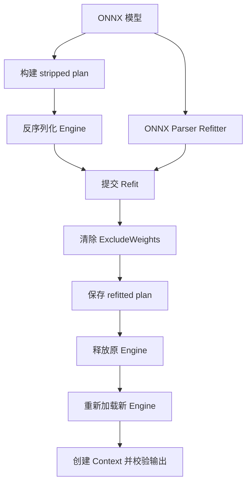

# TensorRT CSharp API v4.0 TensorRtExec：Refit、完整权重 Engine 持久化与重新加载

<!-- public-article-layout:start -->
<style>
.content article { min-width: 0; overflow-wrap: anywhere; }
.content article a, .content article :not(pre) > code { overflow-wrap: anywhere; word-break: break-word; }
.content article pre:not(.mermaid), .content article table { display: block; max-width: 100%; overflow-x: auto; }
.content pre.mermaid { max-width: 640px; margin: 16px auto; overflow-x: auto; }
.content pre.mermaid svg { display: block; width: 100%; max-width: 640px; height: auto; }
</style>
<!-- public-article-layout:end -->

> 文章编号：`APP-EXEC-005`；适用版本：TensorRT CSharp API v4.0 `4.0.0`；当前状态：`review`。

## 1. 前言
<!-- public-article-project-preface:start -->
TensorRT CSharp API v4.0 是一个面向 C#/.NET 开发者的 TensorRT 与 CUDA 工程化接口项目。它把 NVIDIA 原生运行时、生成式绑定、C++ Bridge、托管对象模型和可验证的示例程序组织成一条完整链路，使使用者可以在熟悉的 .NET 项目中完成 Engine 构建、反序列化、ExecutionContext 管理、CUDA 内存操作、异步流同步和结果校验。项目的目标不是隐藏 TensorRT 的概念，而是把这些概念转换为有明确生命周期、所有权和错误边界的 C# API。

4.0.0 是一次完整重构后的正式版本。核心接口、Bridge 边界、Runtime 包命名、样例目录和验证方式都以 4.x 设计为准，不能把 3.x 的类型名、旧包名或旧 DLL 目录直接复制到新项目。托管包只提供项目接口和自有 Bridge；TensorRT、CUDA、cuDNN、显卡驱动以及对应许可证仍由使用者按目标平台安装和管理。

单篇文章也应能够独立阅读：读者可以先从项目入口确认源码和包，再根据本文的程序路径准备依赖，最后用输出中的状态、计数、Shape、哈希或结果图片判断流程是否真的完成。对于尚未具备兼容 GPU 的环境，本文会把静态检查、期望输出和真实运行结果分开标记，不把帮助命令或 build-only 结果包装成推理成功。

项目、包和源码入口（以下地址保留明文，便于复制到不完整支持 Markdown 链接的平台）：

项目主页：

```text
https://github.com/guojin-yan/TensorRT-CSharp-API/tree/TensorRtSharp4.0
```

核心 NuGet：

```text
https://www.nuget.org/packages/JYPPX.TensorRT.CSharp.API/4.0.0
```

Runtime Bridge 包列表：

```text
https://www.nuget.org/packages?q=+JYPPX.TensorRT.CSharp&includeComputedFrameworks=true&prerel=true&sortby=relevance
```

运行库清单：

```text
https://github.com/guojin-yan/TensorRT-CSharp-API/blob/TensorRtSharp4.0/pack/runtime/runtime-packages.manifest.json
```

### 1.1 程序出处与输出说明

本文涉及的程序、脚本或命令均以仓库中的实现为准；对应源码入口：

```text
https://github.com/guojin-yan/TensorRT-CSharp-API/tree/TensorRtSharp4.0/applications
```

运行示例必须同时给出程序输出和判定标准。终端中的 `status`、`Ready`、`Bound`、`enqueueCount`、`OutputMatch`、进程退出码、报告文件或结果图片分别说明不同层次的事实；只有明确写出这些结果，读者才能区分程序启动、Engine 构建、GPU enqueue 和业务结果语义。
<!-- public-article-project-preface:end -->

TensorRT 的 stripped plan 可以显著缩小待分发的 Engine，但它不是一个拿到就能直接推理的普通 plan：权重被剥离后，应用必须从 ONNX 恢复权重、提交 refit，并按正确的序列化策略生成完整权重 Engine。只完成“Refit 返回成功”还不够，真正可部署的流程还要验证持久化文件、释放原 Engine、重新反序列化、创建新 Context，并对输出做数值校验。

TensorRT CSharp API v4.0：<https://github.com/guojin-yan/TensorRT-CSharp-API> 是面向 C#/.NET 的 TensorRT 与 CUDA 工程化接口。项目通过 C ABI Bridge、高层托管对象和版本路由，把 TensorRT 8、10、11 的对象生命周期、错误诊断和运行时差异收敛到可验证的 C# API。`TensorRtExec` 是仓库提供的完整应用，用于从命令行或 WinForms 完成 ONNX 构建、Engine 运行、性能测试、Refit 和结果报告。

### 1.2 项目、包与源码入口

| 项目 | 作用 | 链接 |
| --- | --- | --- |
| TensorRT CSharp API v4.0 | TensorRT/CUDA C# API | GitHub 项目：<https://github.com/guojin-yan/TensorRT-CSharp-API> |
| 核心接口包 | 托管 API | `JYPPX.TensorRT.CSharp.API 4.0.0`：<https://www.nuget.org/packages/JYPPX.TensorRT.CSharp.API/4.0.0> |
| Runtime Bridge | 按操作系统与 NVIDIA 版本选择 | JYPPX NuGet 包列表：<https://www.nuget.org/profiles/JYPPX> |
| TensorRtExec | CLI 与 WinForms 应用源码 | 应用目录：<https://github.com/guojin-yan/TensorRT-CSharp-API/tree/TensorRtSharp4.0/applications/TensorRtExec> |
| Refit 实现 | parser refitter、序列化与 reload | `OnnxEngineBuildService.Refit.cs`：<https://github.com/guojin-yan/TensorRT-CSharp-API/blob/TensorRtSharp4.0/src/JYPPX.TensorRtSharp.Tools/Build/OnnxEngineBuildService.Refit.cs> |
| 参数解析 | 路径隔离和版本条件 | `TrtexecLikeParser.cs`：<https://github.com/guojin-yan/TensorRT-CSharp-API/blob/TensorRtSharp4.0/src/JYPPX.TensorRtSharp.Tools/Trtexec/TrtexecLikeParser.cs> |
| Refit 样例 | 最小 stripped/refitted plan 流程 | RefittedPlan 示例：<https://github.com/guojin-yan/TensorRT-CSharp-API/tree/TensorRtSharp4.0/samples/Inference/04.RefittedPlan> |

正式 `4.0.0` 的 Bridge 包只包含 `jyppxtrtbridge.dll` 或 `libjyppxtrtbridge.so`，不包含 TensorRT、CUDA、cuDNN 或 NVRTC。运行前必须在目标机器安装与 Bridge 包名匹配的 NVIDIA 运行库。

## 2. 先理解三种产物

| 产物 | 是否含完整权重 | 主要用途 | 能否直接推理 |
| --- | --- | --- | --- |
| ONNX | 是 | 可交换模型与 refit 权重来源 | 不能直接作为 TensorRT Engine 执行 |
| Stripped plan | 否 | 缩小中间产物，等待部署端 refit | 未完成 refit 时不能当普通 Engine 使用 |
| Refitted plan | 是 | 已提交权重并清除 `ExcludeWeights` 后的部署产物 | 重新加载和绑定成功后可以执行 |

`--saveEngine` 保存构建阶段生成的 plan；当构建启用了 `--stripWeights` 时，这个文件就是 stripped plan。`--saveRefittedEngine` 保存 refit 后的完整权重 plan。两个路径必须不同，也不能覆盖 ONNX 源文件。



## 3. 环境与输入准备

本文命令从仓库根目录执行。建议把模型、plan、输入和报告放到仓库外层工作目录，避免把二进制产物误提交到 Git。

```powershell
$workRoot = Join-Path (Split-Path $PWD -Parent) 'models\TensorRtExec\Refit'
New-Item -ItemType Directory -Force -Path $workRoot | Out-Null

$onnxPath = Join-Path $workRoot 'mnist.onnx'
$strippedPlan = Join-Path $workRoot 'mnist.stripped.plan'
$refittedPlan = Join-Path $workRoot 'mnist.refitted.plan'
$reportPath = Join-Path $workRoot 'mnist-refit-report.json'
```

本文登记结果使用 NVIDIA TensorRT 示例中的 MNIST ONNX。项目不分发该模型；模型获取、许可证和 SHA256 管理方式见本系列的 `MSC-009`。执行前至少确认：

```powershell
dotnet --info
nvidia-smi
Get-FileHash -Algorithm SHA256 $onnxPath
```

## 4. 一条命令完成构建、Refit、持久化和运行

TensorRT 10/11 可使用下面的完整路径：

```powershell
dotnet run --project .\applications\TensorRtExec\TensorRtExec.csproj -c Release -- `
  --onnx $onnxPath `
  --saveEngine $strippedPlan `
  --stripWeights `
  --refit `
  --refitFromOnnx $onnxPath `
  --saveRefittedEngine $refittedPlan `
  --shapes Input3:1x1x28x28 `
  --iterations 1 `
  --dumpOutput `
  --exportReport $reportPath
```

模型的真实 tensor 名必须以 ONNX 或构建报告为准。MNIST 示例使用过 `Input3`/`Plus214_Output_0` 这类名称，不能把它机械套用到其它模型。

### 4.1 参数对应关系

| 参数 | 作用 | 失败条件 |
| --- | --- | --- |
| `--onnx` | 构建来源 | 文件不存在或 parser 报错 |
| `--saveEngine` | 保存 stripped plan | 与 refitted 路径相同 |
| `--stripWeights` | 构建时剥离可 refit 权重 | 当前 TensorRT line 不支持 |
| `--refit` | 声明 Engine 可 refit 策略 | 与版本/网络策略不兼容 |
| `--refitFromOnnx` | 从 ONNX 加载权重并提交 | parser error、missing weights 或 commit 失败 |
| `--saveRefittedEngine` | 保存完整权重 plan | 未提供 refit source、覆盖源文件或 serialization flag 未清除 |

## 5. TensorRtExec 内部做了什么

这段流程的关键不在参数数量，而在 owner 切换顺序。

1. 反序列化 stripped plan，得到原始 `TensorRtEngine`。
2. 创建 `TensorRtRefitter` 与 `TensorRtOnnxParserRefitter`。
3. 调用 `RefitFromFile`，并检查 parser error 与 missing weights。
4. 调用 `RefitCudaEngine`，将新权重提交到当前 Engine。
5. 创建 serialization config，读取 flags 并清除 `ExcludeWeights`。
6. 再次读取 flags，确认 `ExcludeWeights` 确实被清除。
7. 将序列化结果复制为托管 bytes，写入独立的 refitted plan。
8. 释放原始 refitted Engine owner。
9. 从新文件反序列化第二个 Engine owner。
10. 复制 I/O、层数和 profile 元数据，通过 gate 后才创建 Context 和运行。

为什么必须显式清除 `ExcludeWeights`？因为 stripped Engine 的默认序列化配置可能继续排除权重。若直接调用普通 serialize，得到的仍可能是一个缺权重 plan；它可能能反序列化，却产生零输出或错误结果。文件写出成功不能代替输出校验。

## 6. 分两次进程验证可部署性

同进程 reload 能检查 owner 切换，但部署还应再启动一个只加载 plan 的进程：

```powershell
$reloadReport = Join-Path $workRoot 'mnist-reload-report.json'

dotnet run --project .\applications\TensorRtExec\TensorRtExec.csproj -c Release -- `
  --loadEngine $refittedPlan `
  --shapes Input3:1x1x28x28 `
  --iterations 1 `
  --dumpOutput `
  --exportReport $reloadReport
```

第二次运行不得再依赖 `--onnx` 或 `--refitFromOnnx`。若它仍要求 ONNX，说明保存的并不是独立完整权重 plan。

建议同时记录：

```powershell
Get-Item $strippedPlan, $refittedPlan | Select-Object Name,Length,LastWriteTimeUtc
Get-FileHash -Algorithm SHA256 $strippedPlan, $refittedPlan
```

## 7. 报告应检查哪些字段

不要只搜索 `Succeeded=true`。至少确认以下四组信息：

| 组别 | 关键检查 |
| --- | --- |
| Parser/Refitter | parser errors 为 0、missing weights 为 0、refit commit 成功 |
| Serialization | `ExcludeWeights` clear 返回成功，flags readback 不再包含该位 |
| Persistence/Reload | 两个路径不同、文件非空、原 owner 已释放、新 Engine metadata 完整 |
| Runtime/Output | Context 创建成功、enqueue/synchronize 完成、输出 count/hash/reference 一致 |

完整权重 Engine 在 reload 后不一定继续保持 refittable，因此 `ReloadEngineRefittable=false` 本身不是失败条件。关键是新 Engine 能独立创建 Context 并给出正确输出。

## 8. 已登记的 TensorRT 10 结果

2026-08-10 的 TensorRT 10.11 / CUDA 12.9 MNIST 记录得到：

| 项目 | 结果 |
| --- | --- |
| Refitted plan 大小 | `408876` bytes |
| Plan SHA256 | `5594817d8b152a9478a57ae73ec2a8ed19e8c9e0794b448b89bcd738d99441eb` |
| Serialization flags | `3 -> 2`，`ExcludeWeights` 已清除 |
| Reload metadata | I/O `2`、layers `5`、profiles `1` |
| Context gate | `true` |
| 同进程输出 SHA256 | `6f5771d6c5b056406c190a59e725cf9bb13c1f148c1ef06f99ed8acfb11b9041` |
| 第二进程输出 SHA256 | 与同进程及 full-weight baseline 相同 |

这组记录证明了该环境和该输入下的 refit、持久化、重新加载与输出一致性，不等于所有模型都能 refit，也不是模型精度结论。


## 9. 已登记的 TensorRT 11 结果

TensorRT 11 的版本兼容 stripped-plan 路径也完成了两进程检查：

| 项目 | 结果 |
| --- | --- |
| 同进程严格报告 | `69/69` |
| `loadEngine` 第二进程严格报告 | `69/69` |
| 生命周期校验 | `45/45` |
| Reference mismatch | `0` |
| 两进程输出 SHA256 | `a632b881db2328e9103bbdbfb9205c988577a146125faa8ae20e51977b6877c8` |

该记录来自源码树本地运行，reference 是未审核的 MNIST 运行时参考，因此只能作为此流程的运行证据，不能升级为模型准确率、公开 NuGet 消费或 post-publish 证明。

TensorRT 8 没有本文依赖的 ONNX parser-refitter 路径。TensorRtExec 会保留参数解析与明确的版本拒绝，不会把 parse-only 写成 applied。

## 10. Weight Streaming

TensorRT 10/11 的 Engine 还可启用 weight streaming。构建时必须同时使用 strongly typed：

```powershell
dotnet run --project .\applications\TensorRtExec\TensorRtExec.csproj -c Release -- `
  --onnx $onnxPath `
  --saveEngine (Join-Path $workRoot 'model-streaming.plan') `
  --stronglyTyped `
  --allowWeightStreaming `
  --weightStreamingBudget 50% `
  --buildOnly `
  --exportReport (Join-Path $workRoot 'model-streaming-report.json')
```

预算语法如下：

| 值 | 含义 |
| --- | --- |
| `-2` | 禁用 streaming，权重全部驻留 |
| `-1` | 由 TensorRT 自动选择预算 |
| `0%` 到 `100%` | 按 streamable weights 比例计算 |
| 整数字节数 | 使用精确预算；也可按工具支持的容量格式输入 |

YOLOX-S 的 TensorRT 10 记录中，streamable weights 为 `35829504` bytes，`50%` 解析和 readback 都为 `17914752` bytes，scratch memory 为 `5901824` bytes。该运行捕获了 `[1,8400,85]` 输出，但当次没有完成业务后处理与语义校验，所以它证明预算应用，不证明检测结果正确。

## 11. 常见错误

### 11.1 `--saveRefittedEngine requires --refitFromOnnx`

完整权重保存必须有明确权重来源。补充 `--refitFromOnnx`，不要把 stripped plan 再序列化后改名冒充 refitted plan。

### 11.2 两个 plan 路径相同

保留 stripped 与 refitted 两个产物，便于审计和回滚。工具会拒绝相同路径，也会拒绝覆盖 ONNX。

### 11.3 Reload 成功但输出全零

先检查 serialization flags 是否真的清除了 `ExcludeWeights`，再比较输出 hash 与 reference。仅检查 plan 非空或 Engine 可反序列化不足以定位问题。

### 11.4 Missing weights 不为零

常见原因是 refit ONNX 与 stripped plan 不是同一模型版本、层名或权重角色不一致。应同时核对 ONNX SHA256、构建参数和 refittable weights 清单。

### 11.5 `--allowWeightStreaming requires --stronglyTyped`

这是构建期约束。添加 `--stronglyTyped`，并确认目标 TensorRT line 支持相应能力；不要只移除校验继续构建。

### 11.6 文件复制到另一台机器后加载失败

Plan 不是跨任意环境的通用格式。核对 TensorRT line、版本兼容策略、GPU、插件、CUDA、cuDNN、驱动和 Bridge 包，不要只比较文件 hash。

## 12. 结论与边界

TensorRtExec 的完整 Refit 流程不是“加载 ONNX 后调用一次 refit”，而是：权重来源确认、missing/error 检查、commit、清除序列化排权重标志、独立文件持久化、原 owner 释放、新 owner 重新加载、Context 创建和输出一致性校验。把这些步骤放在一个报告中，才能判断 refitted plan 是否真的可交付。

本文状态保持 `review`：2026-08-12 已使用稳定核心包 `4.0.0` 完成 TensorRtExec Release 构建和 `--help` 验证，但 Refit、完整权重 Engine 持久化与独立 Reload 尚未在当前工作树重新执行。正文不把旧的 local-feed consumer 当成正式 NuGet.org 或 post-publish 证明，也不声称 TensorRT 8 支持 parser refit。

<!-- public-article-declaration:start -->
## 13. 文章声明

### 13.1 开源协议声明
作者所有开源项目代码均遵循 Apache License 2.0 开源协议。
特别说明：本项目集成了若干第三方库。若任何第三方库的许可协议与 Apache 2.0 协议存在冲突或不一致，均以该第三方库的原始许可协议为准。本项目不包含也不代表这些第三方库的授权声明，使用前请务必阅读并遵守第三方库的相关许可。

### 13.2 代码开发与质量说明
AI 辅助开发：本代码在开发过程中使用了人工智能（AI）辅助生成与优化，并非完全由人工逐行编写。
安全性承诺：作者郑重声明，本代码中绝无任何有意设置的后门、病毒、木马或旨在破坏用户设备、窃取数据的恶意代码。
技术局限性：受限于作者个人的技术水平与能力，代码中可能存在因逻辑不严谨、优化不足或经验欠缺导致的低级问题（例如但不限于内存泄漏、偶发崩溃、资源未释放等）。这些问题纯属能力不足所致，并非主观故意。
测试范围：由于作者精力有限，未对本软件进行全方位、覆盖所有边缘场景的完整测试。

### 13.3 免责声明（重要）
请在将本代码应用于任何实际项目（特别是商业、工业或关键任务环境）之前，务必进行详尽、严格的自行测试与验证。 鉴于上述可能存在的代码缺陷及测试覆盖不足，因使用本代码而导致的任何直接或间接损失（包括但不限于设备故障、数据丢失、系统瘫痪或利润损失等），本作者概不负责。 一旦您开始使用本代码，即表示您已知晓上述风险并同意自行承担一切后果，相关问题与本作者无关。

### 13.4 代码开源范围
本项目承诺核心逻辑代码完全开源，但上述提到的“第三方库”的二进制文件、源代码或相关资源不在本项目的开源义务范围内，请根据其各自的指引获取。

### 13.5 社区与反馈
尽管存在上述不足，我们仍欢迎大家下载使用、提交 Issue 或参与测试，共同完善项目。如果您在使用过程中发现 Bug、内存溢出或有改进建议，欢迎通过项目主页提供的联系方式与作者取得联系，我们将尽力在有限的时间内提供协助。


<!-- public-article-declaration:end -->
