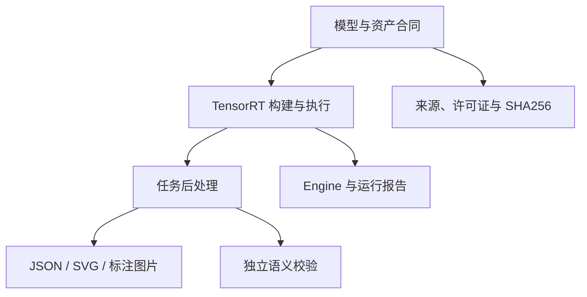

# TensorRT CSharp API v4.0 YoloVision 全任务总览：一个 C# 应用覆盖检测、分类、分割、姿态与 OBB

<!-- public-article-layout:start -->
<style>
.content article { min-width: 0; overflow-wrap: anywhere; }
.content article a, .content article :not(pre) > code { overflow-wrap: anywhere; word-break: break-word; }
.content article pre:not(.mermaid), .content article table { display: block; max-width: 100%; overflow-x: auto; }
.content pre.mermaid { max-width: 640px; margin: 16px auto; overflow-x: auto; }
.content pre.mermaid svg { display: block; width: 100%; max-width: 640px; height: auto; }
</style>
<!-- public-article-layout:end -->

> 文章编号：`APP-YV-001`；适用版本：TensorRT CSharp API v4.0 `4.0.0`。

## 1. 前言
<!-- public-article-project-preface:start -->
TensorRT CSharp API v4.0 是一个面向 C#/.NET 开发者的 TensorRT 与 CUDA 工程化接口项目。它把 NVIDIA 原生运行时、生成式绑定、C++ Bridge、托管对象模型和可验证的示例程序组织成一条完整链路，使使用者可以在熟悉的 .NET 项目中完成 Engine 构建、反序列化、ExecutionContext 管理、CUDA 内存操作、异步流同步和结果校验。项目的目标不是隐藏 TensorRT 的概念，而是把这些概念转换为有明确生命周期、所有权和错误边界的 C# API。

4.0.0 是一次完整重构后的正式版本。核心接口、Bridge 边界、Runtime 包命名、样例目录和验证方式都以 4.x 设计为准，不能把 3.x 的类型名、旧包名或旧 DLL 目录直接复制到新项目。托管包只提供项目接口和自有 Bridge；TensorRT、CUDA、cuDNN、显卡驱动以及对应许可证仍由使用者按目标平台安装和管理。

单篇文章也应能够独立阅读：读者可以先从项目入口确认源码和包，再根据本文的程序路径准备依赖，最后用输出中的状态、计数、Shape、哈希或结果图片判断流程是否真的完成。对于尚未具备兼容 GPU 的环境，本文会把静态检查、期望输出和真实运行结果分开标记，不把帮助命令或 build-only 结果包装成推理成功。

项目、包和源码入口（以下地址保留明文，便于复制到不完整支持 Markdown 链接的平台）：

项目主页：

```text
https://github.com/guojin-yan/TensorRT-CSharp-API/tree/TensorRtSharp4.0
```

核心 NuGet：

```text
https://www.nuget.org/packages/JYPPX.TensorRT.CSharp.API/4.0.0
```

Runtime Bridge 包列表：

```text
https://www.nuget.org/packages?q=+JYPPX.TensorRT.CSharp&includeComputedFrameworks=true&prerel=true&sortby=relevance
```

运行库清单：

```text
https://github.com/guojin-yan/TensorRT-CSharp-API/blob/TensorRtSharp4.0/pack/runtime/runtime-packages.manifest.json
```

### 1.1 程序出处与输出说明

本文涉及的程序、脚本或命令均以仓库中的实现为准；对应源码入口：

```text
https://github.com/guojin-yan/TensorRT-CSharp-API/tree/TensorRtSharp4.0/applications
```

运行示例必须同时给出程序输出和判定标准。终端中的 `status`、`Ready`、`Bound`、`enqueueCount`、`OutputMatch`、进程退出码、报告文件或结果图片分别说明不同层次的事实；只有明确写出这些结果，读者才能区分程序启动、Engine 构建、GPU enqueue 和业务结果语义。
<!-- public-article-project-preface:end -->

在 .NET 项目中接入 TensorRT，真正困难的部分通常不是调用一次 `EnqueueV3`，而是把模型来源、输入预处理、动态 Shape、GPU 内存、输出解码、结果可视化和运行证据组织成一条可复查的链路。TensorRT CSharp API v4.0：<https://github.com/guojin-yan/TensorRT-CSharp-API> 为 TensorRT 与 CUDA 提供 C# API，`applications/YoloVision` 则在它之上实现常见视觉模型的完整应用层流程。

YoloVision 不是只演示一个模型的代码片段。它通过统一命令行、统一配置、统一报告和按任务拆分的后处理器，覆盖目标检测、图像分类、实例分割、旋转框、姿态估计和语义分割。本篇先建立全局认识，并给出可以直接执行的入口；各任务的模型准备、输出合同和后处理细节会在后续文章中分别展开。

### 1.2 项目、包与源码入口

| 项目 | 说明 | 链接 |
| --- | --- | --- |
| TensorRT CSharp API v4.0 | TensorRT/CUDA 的 C# API 与工程化工具 | GitHub 源码：<https://github.com/guojin-yan/TensorRT-CSharp-API> |
| 稳定核心包 | 托管接口、环境探测与通用能力 | `JYPPX.TensorRT.CSharp.API 4.0.0`：<https://www.nuget.org/packages/JYPPX.TensorRT.CSharp.API/4.0.0> |
| Windows Runtime Bridge | 与本机 TensorRT/CUDA 版本对应的原生桥接层 | NuGet 包列表：<https://www.nuget.org/profiles/JYPPX> |
| OpenCV 包 | JPEG/PNG/BMP 解码与图像处理 | `JYPPX.OpenCV.CSharp.API`：<https://www.nuget.org/packages/JYPPX.OpenCV.CSharp.API> |
| YoloVision 应用 | 六类视觉任务的源码应用，不作为独立应用包发布 | 应用目录：<https://github.com/guojin-yan/TensorRT-CSharp-API/tree/TensorRtSharp4.0/applications/YoloVision> |
| 程序入口 | 参数解析、预检与任务调度 | `Program.cs`：<https://github.com/guojin-yan/TensorRT-CSharp-API/blob/TensorRtSharp4.0/applications/YoloVision/Program.cs> |

Runtime Bridge 必须与操作系统、架构、TensorRT、CUDA 和 cuDNN 组合相符。例如 Windows、TensorRT 10.11、CUDA 12.9 与 cuDNN 9.22 对应的包名为：

```text
JYPPX.TensorRT.CSharp.API.Runtime.win-x64.trt10.11.cuda12.9.cudnn9.22.Bridge
```

`applications/YoloVision` 当前是 source-only 应用，`IsPackable=false`。安装核心包和 Bridge 是使用底层 API 的方式，不代表 YoloVision 本身已经发布为 NuGet 包。

## 2. YoloVision 解决什么问题

同一个 YOLO 家族中，不同任务的输出结构并不相同；不同家族之间还会出现 objectness、端到端 NMS、多输出 tensor、关键点和角度编码等差异。如果把这些规则散落在业务代码中，模型一升级就容易出现“程序能跑，但框、类别或坐标是错的”。

YoloVision 将完整过程分成三层：



1. **模型层**：记录模型家族、任务、来源、许可证、固定版本、输入输出 tensor 和文件哈希。
2. **运行层**：负责 ONNX 解析、Engine 构建或加载、Optimization Profile、显存绑定、Stream 执行与输出读回。
3. **任务层**：按 detection、classification、segmentation、pose、OBB 和 semantic segmentation 分别解码，不用一套假设处理全部输出。

## 3. 支持范围与能力矩阵

YoloVision 的能力矩阵包含 10 个模型家族和 6 类任务，共 60 个组合。当前 55 个组合在配置层标记为支持；YOLOX 仅开放 detection，其余 5 类任务明确标记为不支持。

| 家族 | Detection | Classification | Instance Seg | Pose | OBB | Semantic Seg |
| --- | --- | --- | --- | --- | --- | --- |
| YOLOv5 / v6 / v7 | 支持 | 支持 | 支持 | 支持 | 支持 | 支持 |
| YOLOv8 / v9 | 支持 | 支持 | 支持 | 支持 | 支持 | 支持 |
| YOLOv10 | 支持端到端检测 | 支持 | 支持 | 支持 | 支持 | 支持 |
| YOLOv11 / YOLO26 | 支持 | 支持 | 支持 | 支持 | 支持 | 支持 |
| YOLOX | 支持 | 不支持 | 不支持 | 不支持 | 不支持 | 不支持 |
| Custom | 按显式 profile | 按显式 profile | 按显式 profile | 按显式 profile | 按显式 profile | 按显式 profile |

这张表表示应用层具备相应配置与后处理入口，不等于 55 个组合都已有真实模型运行证明。当前仓库中可复查的真实模型证据覆盖 YOLOv8n detection/classification/segmentation/pose/OBB、YOLOv10 detection 和 YOLOX-S detection；其他组合仍需使用者提供合规模型资产并执行验证。

## 4. 六类任务的输出合同

| 任务 | 主要输出 | 不能省略的校验 |
| --- | --- | --- |
| Detection | 类别、置信度、矩形框 | 坐标反映射、阈值、class-aware NMS |
| Classification | Top-K 类别与概率 | labels 顺序、softmax/概率语义 |
| Instance Segmentation | 框、类别、实例 mask | prototype 与 mask coefficient 合成、裁剪和缩放 |
| Pose | 框、类别、关键点 | 关键点数量、坐标和可见度格式 |
| OBB | 类别、置信度、旋转框 | 角度单位、中心/宽高、旋转 NMS |
| Semantic Segmentation | 像素级类别图 | 输出布局、argmax 维度、调色板和原图映射 |

“看到一张结果图”只能说明可视化存在，不能单独证明 tensor 解码正确。正式验证还要记录 tensor shape、预处理参数、阈值、候选数量、最终输出和受控失败条件。

## 5. 环境与安装

以 Windows x64、TensorRT 10.11、CUDA 12.9 为例，新建应用时至少需要核心包和匹配的 Bridge：

```powershell
dotnet add package JYPPX.TensorRT.CSharp.API --version 4.0.0
dotnet add package JYPPX.TensorRT.CSharp.API.Runtime.win-x64.trt10.11.cuda12.9.cudnn9.22.Bridge --version 4.0.0
dotnet add package JYPPX.OpenCV.CSharp.API
```

此外仍需在本机安装 NVIDIA Driver、CUDA、cuDNN 与 TensorRT。Bridge 只提供 TensorRtSharp 的原生 ABI 适配，不重新分发 NVIDIA 运行库。其他 TensorRT/CUDA 组合应从 NuGet 包列表选择对应 ID，不能只改 DLL 文件名混用。

源码运行前建议先验证 .NET 与 GPU 环境：

```powershell
dotnet --info
nvidia-smi
dotnet build .\applications\YoloVision\YoloVision.csproj -c Release
```

## 6. 从能力预检开始

第一次使用时，不应直接下载模型并猜参数。先列出应用实际识别的家族、任务和 profile：

```powershell
dotnet run --project .\applications\YoloVision -- --list-capabilities
dotnet run --project .\applications\YoloVision -- --list-capabilities --json
```

随后可以运行不依赖外部模型的端到端自检：

```powershell
dotnet run --project .\applications\YoloVision -- --self-test-end2end
```

能力矩阵和自检用于发现参数、配置与后处理路由问题；它们不是外部真实模型的 runtime proof。

## 7. 统一运行流程

六类任务共享以下主流程：

1. 根据模型 manifest 校验 ONNX、labels 和输入图片 SHA256。
2. 读取实际 ONNX/Engine tensor metadata，不凭模型文件名猜输出。
3. 按 profile 完成 resize/letterbox、通道转换、归一化和 NCHW/NHWC 排列。
4. 构建或加载 Engine，绑定输入输出，使用 CUDA stream 执行。
5. 将 GPU 输出读回，交给对应任务后处理器。
6. 输出 JSON、SVG/标注图、日志和机器可读 evidence。

以 YOLOv8 detection 为例，命令结构如下。路径使用工作区变量，避免把某台机器的用户名和盘符写进文档：

```powershell
$RepoRoot = (Get-Location).Path
$WorkspaceRoot = Split-Path -Parent $RepoRoot
$ModelRoot = Join-Path $WorkspaceRoot 'models\YoloVision\YOLOv8\Detection'
$OutputRoot = Join-Path $WorkspaceRoot 'work\yolovision\yolov8n-det'

dotnet run --project .\applications\YoloVision -- `
  --model (Join-Path $ModelRoot 'yolov8n.onnx') `
  --image (Join-Path $ModelRoot 'input.jpg') `
  --family yolov8 `
  --task detection `
  --labels (Join-Path $ModelRoot 'coco80.txt') `
  --confidence 0.25 `
  --iou 0.45 `
  --outputDirectory $OutputRoot
```

模型参数必须与导出方式一致。对自定义模型，至少要明确输入尺寸、颜色顺序、归一化、输出布局、类别数、是否含 objectness，以及模型内是否已经执行 NMS。

## 8. 代表性真实结果

下面展示的是 YOLOv8n detection 的代表性结果，用于说明 YoloVision 的输出形式；它不代表全任务矩阵都由这两张图证明。


对应实测记录使用 TensorRT 10.11.0.33、CUDA 12.9 和 RTX 3060 Laptop GPU，输入 tensor 为 `[1,3,640,640]`，输出为 `[1,84,8400]`。后处理得到 8 个目标：1 辆 bus、7 个 person；bus 最大置信度为 `0.932376`，person 最大置信度为 `0.782893`。

独立消费者验证对 705,600 个原始输出元素逐项比较，mismatch count 为 0；独立后处理得到 4 个 person 和 1 辆 bus，匹配框最小 IoU 为 `0.9997687958740106`，最大分数误差为 `0.0002024185388183053`。二者后处理配置不同，因此最终框数量不同，但原始 tensor 一致。

## 9. 常见问题

### 9.1 能构建 Engine，但没有检测结果

先检查输出 shape 和类别数，再检查预处理。最常见的问题是 RGB/BGR、NCHW/NHWC、letterbox padding 和 `scale=1/255` 不一致，而不是 TensorRT 没有执行。

### 9.2 框的位置整体偏移

确认是否按原图尺寸撤销 letterbox 的缩放与 padding。直接把 640x640 坐标绘制到原图会产生系统性偏移。

### 9.3 类别名称明显不对

labels 文件顺序必须与训练数据集 class index 完全一致。不能因为图片“像某一类”就手工修改模型输出；应核对模型元数据、labels SHA256 和 argmax index。

### 9.4 同一模型在不同机器结果不同

同时记录模型、输入、labels、TensorRT/CUDA/Driver、precision、Engine 和输出哈希。只比较模型文件名或截图无法定位差异。

## 10. 证据边界

本篇证明 YoloVision 已形成多家族、多任务的统一应用结构，并展示了一个可复查的 YOLOv8n 真实模型运行案例。能力矩阵、参数预检、Engine build-only、截图或 SVG 单独出现时，都不能升级为真实模型 runtime proof。

现有真实结果来自源码树和本地验证记录，不代表应用二进制已经发布，也不代表所有 Runtime Bridge 组合都验证完成。它不是 public-package post-publish proof，不包含 NuGet push、Git Tag、GitHub Release 或 CSDN 发布操作。

## 11. 总结

YoloVision 的价值不只是“让 YOLO 在 C# 中跑起来”，而是把模型合同、TensorRT 执行、任务后处理、结果展示和证据记录放进同一个可维护应用。建议先用能力矩阵确认组合，再从 YOLOv8n detection 建立第一条真实闭环，最后逐步扩展到分类、实例分割、Pose、OBB 和语义分割。

<!-- public-article-declaration:start -->
## 12. 文章声明

### 12.1 开源协议声明
作者所有开源项目代码均遵循 Apache License 2.0 开源协议。
特别说明：本项目集成了若干第三方库。若任何第三方库的许可协议与 Apache 2.0 协议存在冲突或不一致，均以该第三方库的原始许可协议为准。本项目不包含也不代表这些第三方库的授权声明，使用前请务必阅读并遵守第三方库的相关许可。

### 12.2 代码开发与质量说明
AI 辅助开发：本代码在开发过程中使用了人工智能（AI）辅助生成与优化，并非完全由人工逐行编写。
安全性承诺：作者郑重声明，本代码中绝无任何有意设置的后门、病毒、木马或旨在破坏用户设备、窃取数据的恶意代码。
技术局限性：受限于作者个人的技术水平与能力，代码中可能存在因逻辑不严谨、优化不足或经验欠缺导致的低级问题（例如但不限于内存泄漏、偶发崩溃、资源未释放等）。这些问题纯属能力不足所致，并非主观故意。
测试范围：由于作者精力有限，未对本软件进行全方位、覆盖所有边缘场景的完整测试。

### 12.3 免责声明（重要）
请在将本代码应用于任何实际项目（特别是商业、工业或关键任务环境）之前，务必进行详尽、严格的自行测试与验证。 鉴于上述可能存在的代码缺陷及测试覆盖不足，因使用本代码而导致的任何直接或间接损失（包括但不限于设备故障、数据丢失、系统瘫痪或利润损失等），本作者概不负责。 一旦您开始使用本代码，即表示您已知晓上述风险并同意自行承担一切后果，相关问题与本作者无关。

### 12.4 代码开源范围
本项目承诺核心逻辑代码完全开源，但上述提到的“第三方库”的二进制文件、源代码或相关资源不在本项目的开源义务范围内，请根据其各自的指引获取。

### 12.5 社区与反馈
尽管存在上述不足，我们仍欢迎大家下载使用、提交 Issue 或参与测试，共同完善项目。如果您在使用过程中发现 Bug、内存溢出或有改进建议，欢迎通过项目主页提供的联系方式与作者取得联系，我们将尽力在有限的时间内提供协助。


<!-- public-article-declaration:end -->
