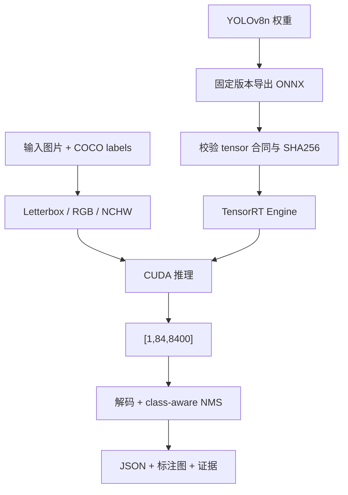

# 使用 TensorRT CSharp API v4.0 与 YoloVision 完成 YOLOv8n 目标检测

<!-- public-article-layout:start -->
<style>
.content article { min-width: 0; overflow-wrap: anywhere; }
.content article a, .content article :not(pre) > code { overflow-wrap: anywhere; word-break: break-word; }
.content article pre:not(.mermaid), .content article table { display: block; max-width: 100%; overflow-x: auto; }
.content pre.mermaid { max-width: 640px; margin: 16px auto; overflow-x: auto; }
.content pre.mermaid svg { display: block; width: 100%; max-width: 640px; height: auto; }
</style>
<!-- public-article-layout:end -->

> 文章编号：`APP-YV-002`；适用版本：TensorRT CSharp API v4.0 `4.0.0`。

## 1. 前言
<!-- public-article-project-preface:start -->
TensorRT CSharp API v4.0 是一个面向 C#/.NET 开发者的 TensorRT 与 CUDA 工程化接口项目。它把 NVIDIA 原生运行时、生成式绑定、C++ Bridge、托管对象模型和可验证的示例程序组织成一条完整链路，使使用者可以在熟悉的 .NET 项目中完成 Engine 构建、反序列化、ExecutionContext 管理、CUDA 内存操作、异步流同步和结果校验。项目的目标不是隐藏 TensorRT 的概念，而是把这些概念转换为有明确生命周期、所有权和错误边界的 C# API。

4.0.0 是一次完整重构后的正式版本。核心接口、Bridge 边界、Runtime 包命名、样例目录和验证方式都以 4.x 设计为准，不能把 3.x 的类型名、旧包名或旧 DLL 目录直接复制到新项目。托管包只提供项目接口和自有 Bridge；TensorRT、CUDA、cuDNN、显卡驱动以及对应许可证仍由使用者按目标平台安装和管理。

单篇文章也应能够独立阅读：读者可以先从项目入口确认源码和包，再根据本文的程序路径准备依赖，最后用输出中的状态、计数、Shape、哈希或结果图片判断流程是否真的完成。对于尚未具备兼容 GPU 的环境，本文会把静态检查、期望输出和真实运行结果分开标记，不把帮助命令或 build-only 结果包装成推理成功。

项目、包和源码入口（以下地址保留明文，便于复制到不完整支持 Markdown 链接的平台）：

项目主页：

```text
https://github.com/guojin-yan/TensorRT-CSharp-API/tree/TensorRtSharp4.0
```

核心 NuGet：

```text
https://www.nuget.org/packages/JYPPX.TensorRT.CSharp.API/4.0.0
```

Runtime Bridge 包列表：

```text
https://www.nuget.org/packages?q=+JYPPX.TensorRT.CSharp&includeComputedFrameworks=true&prerel=true&sortby=relevance
```

运行库清单：

```text
https://github.com/guojin-yan/TensorRT-CSharp-API/blob/TensorRtSharp4.0/pack/runtime/runtime-packages.manifest.json
```

### 1.1 程序出处与输出说明

本文涉及的程序、脚本或命令均以仓库中的实现为准；对应源码入口：

```text
https://github.com/guojin-yan/TensorRT-CSharp-API/tree/TensorRtSharp4.0/applications
```

运行示例必须同时给出程序输出和判定标准。终端中的 `status`、`Ready`、`Bound`、`enqueueCount`、`OutputMatch`、进程退出码、报告文件或结果图片分别说明不同层次的事实；只有明确写出这些结果，读者才能区分程序启动、Engine 构建、GPU enqueue 和业务结果语义。
<!-- public-article-project-preface:end -->

TensorRT CSharp API v4.0：<https://github.com/guojin-yan/TensorRT-CSharp-API> 是面向 .NET 的 TensorRT 与 CUDA C# API。它不仅封装底层对象，还处理资源生命周期、异常边界、Engine 构建、执行上下文、显存和 Stream 等工程问题。`applications/YoloVision` 在核心 API 之上提供检测、分类、分割、姿态和 OBB 的完整应用流程。

本文以 YOLOv8n detection 为第一条真实模型闭环，从模型获取与导出开始，说明 ONNX 合同、预处理、TensorRT 推理、输出解码、NMS、标注图和结果复核。重点不是只得到一张“看起来正确”的图片，而是让模型、输入、labels、tensor 和最终检测结果都可追溯。

### 1.2 项目与依赖

| 组件 | 作用 | 获取位置 |
| --- | --- | --- |
| TensorRT CSharp API v4.0 | TensorRT/CUDA C# API | GitHub：<https://github.com/guojin-yan/TensorRT-CSharp-API> |
| 核心 NuGet | 稳定托管接口 | `JYPPX.TensorRT.CSharp.API 4.0.0`：<https://www.nuget.org/packages/JYPPX.TensorRT.CSharp.API/4.0.0> |
| Runtime Bridge | 匹配本机 TensorRT/CUDA/cuDNN 的原生桥接层 | JYPPX NuGet 包：<https://www.nuget.org/profiles/JYPPX> |
| OpenCV | 图片解码和绘制辅助 | `JYPPX.OpenCV.CSharp.API`：<https://www.nuget.org/packages/JYPPX.OpenCV.CSharp.API> |
| YoloVision | 模型 profile、预处理、推理和后处理 | 应用源码：<https://github.com/guojin-yan/TensorRT-CSharp-API/tree/TensorRtSharp4.0/applications/YoloVision> |
| 程序入口 | 命令行与任务调度 | `Program.cs`：<https://github.com/guojin-yan/TensorRT-CSharp-API/blob/TensorRtSharp4.0/applications/YoloVision/Program.cs> |

YoloVision 是仓库内的 source-only 应用，不作为独立 NuGet 包发布。实际项目需要安装核心包、匹配的 Runtime Bridge 和图像处理依赖。

## 2. 运行目标与完整链路

本文完成以下步骤：



实测使用 YOLOv8n、COCO 80 类和 640x640 输入。最终检测 8 个候选结果，其中 bus 1 个、person 7 个。

## 3. 系统要求与安装

本文证据环境为 Windows 11、RTX 3060 Laptop GPU、NVIDIA Driver 576.02、CUDA 12.9、TensorRT 10.11.0.33 和 .NET SDK 10.0.301。其他受支持组合也可以使用，但 Runtime Bridge 必须精确匹配。

在独立项目中，以相同运行时组合为例：

```powershell
dotnet add package JYPPX.TensorRT.CSharp.API --version 4.0.0
dotnet add package JYPPX.TensorRT.CSharp.API.Runtime.win-x64.trt10.11.cuda12.9.cudnn9.22.Bridge --version 4.0.0
dotnet add package JYPPX.OpenCV.CSharp.API
```

源码仓库中先完成基础检查：

```powershell
dotnet --info
nvidia-smi
dotnet build .\applications\YoloVision\YoloVision.csproj -c Release
dotnet run --project .\applications\YoloVision -- --list-capabilities
```

## 4. 模型、图片和 labels

### 4.1 模型来源

YOLOv8n 权重与导出工具来自 Ultralytics YOLOv8。正式复现时应固定依赖版本和模型文件哈希，不要只记录“使用最新 ultralytics”。模型及其导出产物不提交到本仓库，统一暂存在仓库外层 `models` 目录。

```powershell
$RepoRoot = (Get-Location).Path
$WorkspaceRoot = Split-Path -Parent $RepoRoot
$ModelRoot = Join-Path $WorkspaceRoot 'models\YoloVision\YOLOv8\Detection'
New-Item -ItemType Directory -Path $ModelRoot -Force | Out-Null
```

在独立 Python 环境中固定所需版本后导出：

```powershell
python -m venv (Join-Path $WorkspaceRoot '.venv-yolov8-export')
& (Join-Path $WorkspaceRoot '.venv-yolov8-export\Scripts\python.exe') -m pip install ultralytics onnx
& (Join-Path $WorkspaceRoot '.venv-yolov8-export\Scripts\yolo.exe') export `
  model=yolov8n.pt `
  format=onnx `
  imgsz=640 `
  opset=17 `
  simplify=False `
  dynamic=False
```

将导出的 `yolov8n.onnx` 移到 `$ModelRoot`，并记录哈希：

```powershell
Get-FileHash (Join-Path $ModelRoot 'yolov8n.onnx') -Algorithm SHA256
```

本文实测 ONNX SHA256 为：

```text
db28b9cc03ba03d0033174176c104159097436dccb41aca00bc5a7f5e938221e
```

原始权重 SHA256 为：

```text
f59b3d833e2ff32e05d46f1ad4ca7e77503386e22c7c77cb5d26f7fea5883b36
```

模型许可证与使用条件应以所固定的 Ultralytics 版本和模型发布页为准；不要把下载成功等同于获得再分发授权。

### 4.2 输入图片与标签

本文使用的输入图片与公开截图已经过许可证审查，图片 SHA256 为：

```text
c0207bb7db96eb4a64a777b6e85d5e4dc02c72fa207723611835290f9131bc63
```

COCO 80 类 labels SHA256 为：

```text
bd17eb220e51c654618784946c5e58f93b34a5637db8979a79578747673ae730
```

labels 的第 N 行必须对应模型第 N 个 class index。结果图类别不合理时，首先核对 labels 顺序和哈希，不应根据肉眼判断去改网络输出。

## 5. ONNX 输入输出合同

实测模型合同如下：

| 角色 | 类型 | Shape | 说明 |
| --- | --- | --- | --- |
| 输入 | `float32` | `[1,3,640,640]` | RGB、NCHW、归一化到 0-1 |
| 输出 | `float32` | `[1,84,8400]` | 4 个框参数 + 80 个类别分数 |

该导出结果没有独立 objectness 通道，因此 `84 = 4 + 80`。如果另一个模型输出 `[1,85,8400]`，或者已经在模型内执行 NMS，就不能沿用本文的解码假设。

预处理配置为：

| 配置 | 值 |
| --- | --- |
| Resize | 保持比例的 center letterbox |
| 填充值 | 114 |
| 色彩 | BGR 解码后转 RGB |
| Layout | NCHW |
| Scale | `1/255` |
| 输入尺寸 | 640x640 |

预处理 tensor SHA256 为：

```text
46a51347b8cfa12ea1fe5ab56ff7a126a5f148f25aa5d23792470c391d7d574d
```

## 6. 核心代码流程

YoloVision 已经封装通用流程，业务侧无需直接拼接所有 native 调用。理解下面四步有助于排查问题。

### 6.1 建立模型 profile

```csharp
YoloVisionModelProfile profile = new()
{
    Family = YoloFamily.YoloV8,
    Task = YoloTask.Detection,
    InputWidth = 640,
    InputHeight = 640,
    ClassCount = 80,
    HasObjectness = false
};
```

### 6.2 预处理

```csharp
YoloVisionPreprocessResult input = preprocessor.Prepare(
    image,
    targetWidth: 640,
    targetHeight: 640,
    letterboxValue: 114,
    convertBgrToRgb: true);
```

预处理结果除 float tensor 外，还应保留 scale、padding 和原始尺寸，供后处理把框映射回原图。

### 6.3 执行 TensorRT

```csharp
bindings.CopyInputFromHost(inputTensorName, input.Values, inputShape);
bindings.AllocateDeviceBuffer(outputTensorName, outputShape, outputBytes);
bindings.BindAll();
bindings.EnqueueAsync(stream.Handle, synchronize: false, runShapeInference: false);
stream.Synchronize();
float[] output = bindings.ReadOutputSingles(outputTensorName, outputElementCount);
```

Engine、ExecutionContext、bindings、device buffer 和 stream 都有明确生命周期。不要在异步执行完成前释放或复用承载数据的对象。

### 6.4 解码与 NMS

```csharp
IReadOnlyList<YoloDetection> candidates = decoder.Decode(
    output,
    classCount: 80,
    confidenceThreshold: 0.25f,
    hasObjectness: false);

IReadOnlyList<YoloDetection> detections = nms.ApplyClassAware(
    candidates,
    iouThreshold: 0.45f);
```

框坐标在输出前必须撤销 letterbox，并裁剪到原图范围。本文使用 class-aware NMS，避免不同类别之间互相抑制。

## 7. 运行命令

```powershell
$OutputRoot = Join-Path $WorkspaceRoot 'work\yolovision\yolov8n-det'
New-Item -ItemType Directory -Path $OutputRoot -Force | Out-Null

dotnet run --project .\applications\YoloVision -- `
  --model (Join-Path $ModelRoot 'yolov8n.onnx') `
  --image (Join-Path $ModelRoot 'bus.jpg') `
  --family yolov8 `
  --task detection `
  --labels (Join-Path $ModelRoot 'coco80.txt') `
  --confidence 0.25 `
  --iou 0.45 `
  --outputDirectory $OutputRoot
```

运行前建议把模型、输入和 labels 的 SHA256 写入同一个 manifest。输出目录应至少包含结构化 JSON、可视化结果和运行日志。

## 8. 真实运行结果


实测汇总：

| 项目 | 结果 |
| --- | --- |
| TensorRT / CUDA | 10.11.0.33 / 12.9 |
| 输入 tensor | `[1,3,640,640]` |
| 输出 tensor | `[1,84,8400]` |
| 置信度 / IoU 阈值 | 0.25 / 0.45 |
| 最终检测数 | 8 |
| 类别分布 | bus 1、person 7 |
| bus 最大置信度 | `0.932376` |
| person 最大置信度 | `0.782893` |

机器可读证据记录为 `yolovision-yolov8n-det-win-x64-trt10.11-cuda12.9-20260802`。它记录模型、输入、labels、预处理 tensor、Engine 输出和环境版本，避免截图成为唯一依据。

## 9. 独立复核与受控负例

本地消费者复核读取相同输入，并对 705,600 个原始输出元素逐项比较，mismatch count 为 0。独立后处理得到 4 个 person 和 1 辆 bus，匹配框最小 IoU 为 `0.9997687958740106`，最大 score error 为 `0.0002024185388183053`。

最终框数量与主流程不同，原因是两个验证器使用的候选筛选与 NMS 配置不同；原始 tensor 完全一致。这也是为什么正式报告必须同时记录原始输出合同和后处理配置。

受控负例改变预期或破坏输入合同后返回非零退出码，证明校验路径 fail closed，而不是无论输出是否合理都写 success。

## 10. 常见问题

### 10.1 结果类别与图片明显不符

依次核对：模型是否真的是 COCO detection、输出 class count 是否为 80、labels 顺序是否与训练集一致、是否错误地把 `[1,84,8400]` 当成带 objectness 的输出。类别名来自 class index 与 labels 映射，不来自图片文件名。

### 10.2 有框但坐标偏移或缩放错误

检查 center letterbox 的 scale 和左右/上下 padding。后处理必须先撤销 padding，再除以 scale，最后裁剪到原图尺寸。

### 10.3 全部置信度很低

检查 RGB/BGR、`1/255`、NCHW 排列和输出转置。不要先把阈值降到极低来掩盖预处理错误。

### 10.4 Engine 可以生成但推理失败

检查 Runtime Bridge 与 TensorRT/CUDA 组合、动态 profile、tensor 名称和 device buffer 字节数。build-only 只证明构建路径，不能证明输入绑定和推理合同正确。

## 11. 证据边界

本文结果证明固定 YOLOv8n ONNX 与固定输入在记录的 TensorRT 10.11/CUDA 12.9 环境中完成了真实 GPU 推理、后处理和独立复核。它不是全部 YOLO 模型的通用 runtime proof，也不是所有 Windows/Linux Runtime Bridge 组合的兼容性证明。

现有本地包消费者记录来自本地 file feed，`publicFeed=false`；因此它不是公共 NuGet 安装后的 post-publish proof。本文没有执行 package push、Git Tag、GitHub Release 或外部文章发布。

## 12. 总结

YOLOv8n detection 适合作为 YoloVision 的第一条学习路径，因为它把模型导出、预处理、TensorRT 执行、解码、NMS 和结果图串成了完整闭环。迁移到其他 detection 模型时，不要只替换 ONNX 文件；应重新确认模型来源、tensor shape、类别数、objectness、NMS 位置和 labels 合同。

<!-- public-article-declaration:start -->
## 13. 文章声明

### 13.1 开源协议声明
作者所有开源项目代码均遵循 Apache License 2.0 开源协议。
特别说明：本项目集成了若干第三方库。若任何第三方库的许可协议与 Apache 2.0 协议存在冲突或不一致，均以该第三方库的原始许可协议为准。本项目不包含也不代表这些第三方库的授权声明，使用前请务必阅读并遵守第三方库的相关许可。

### 13.2 代码开发与质量说明
AI 辅助开发：本代码在开发过程中使用了人工智能（AI）辅助生成与优化，并非完全由人工逐行编写。
安全性承诺：作者郑重声明，本代码中绝无任何有意设置的后门、病毒、木马或旨在破坏用户设备、窃取数据的恶意代码。
技术局限性：受限于作者个人的技术水平与能力，代码中可能存在因逻辑不严谨、优化不足或经验欠缺导致的低级问题（例如但不限于内存泄漏、偶发崩溃、资源未释放等）。这些问题纯属能力不足所致，并非主观故意。
测试范围：由于作者精力有限，未对本软件进行全方位、覆盖所有边缘场景的完整测试。

### 13.3 免责声明（重要）
请在将本代码应用于任何实际项目（特别是商业、工业或关键任务环境）之前，务必进行详尽、严格的自行测试与验证。 鉴于上述可能存在的代码缺陷及测试覆盖不足，因使用本代码而导致的任何直接或间接损失（包括但不限于设备故障、数据丢失、系统瘫痪或利润损失等），本作者概不负责。 一旦您开始使用本代码，即表示您已知晓上述风险并同意自行承担一切后果，相关问题与本作者无关。

### 13.4 代码开源范围
本项目承诺核心逻辑代码完全开源，但上述提到的“第三方库”的二进制文件、源代码或相关资源不在本项目的开源义务范围内，请根据其各自的指引获取。

### 13.5 社区与反馈
尽管存在上述不足，我们仍欢迎大家下载使用、提交 Issue 或参与测试，共同完善项目。如果您在使用过程中发现 Bug、内存溢出或有改进建议，欢迎通过项目主页提供的联系方式与作者取得联系，我们将尽力在有限的时间内提供协助。


<!-- public-article-declaration:end -->
