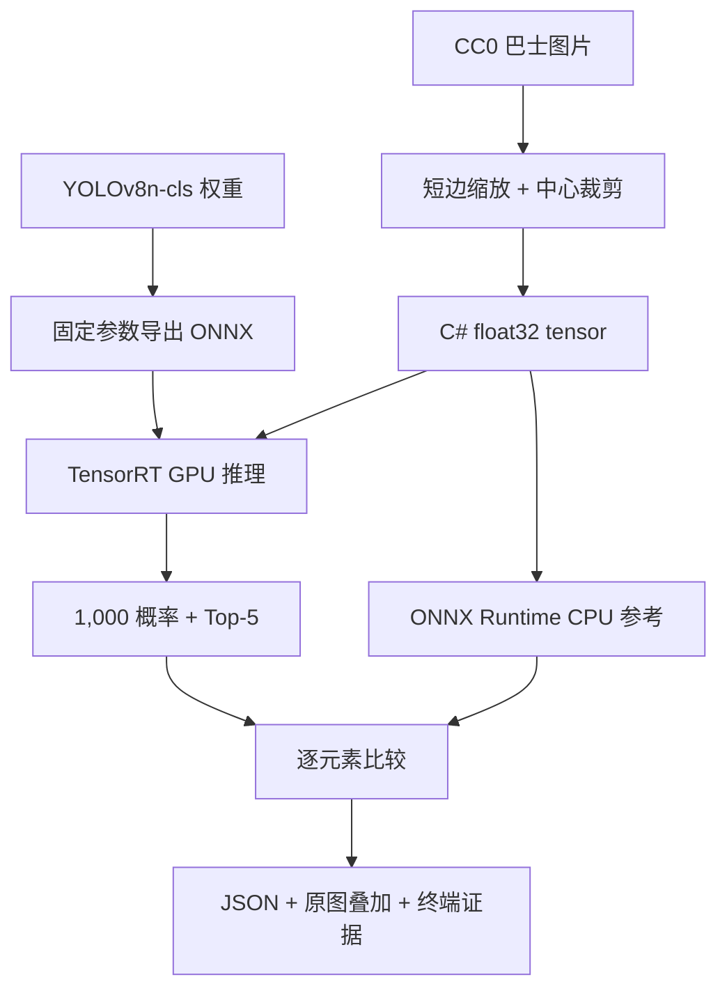

# 使用 TensorRT CSharp API v4.0 与 YoloVision 完成 YOLOv8n 图像分类

<!-- public-article-layout:start -->
<style>
.content article { min-width: 0; overflow-wrap: anywhere; }
.content article a, .content article :not(pre) > code { overflow-wrap: anywhere; word-break: break-word; }
.content article pre:not(.mermaid), .content article table { display: block; max-width: 100%; overflow-x: auto; }
.content pre.mermaid { max-width: 640px; margin: 16px auto; overflow-x: auto; }
.content pre.mermaid svg { display: block; width: 100%; max-width: 640px; height: auto; }
</style>
<!-- public-article-layout:end -->

> 文章编号：`APP-YV-003`；适用版本：TensorRT CSharp API v4.0 `4.0.0`。

## 1. 前言
<!-- public-article-project-preface:start -->
TensorRT CSharp API v4.0 是一个面向 C#/.NET 开发者的 TensorRT 与 CUDA 工程化接口项目。它把 NVIDIA 原生运行时、生成式绑定、C++ Bridge、托管对象模型和可验证的示例程序组织成一条完整链路，使使用者可以在熟悉的 .NET 项目中完成 Engine 构建、反序列化、ExecutionContext 管理、CUDA 内存操作、异步流同步和结果校验。项目的目标不是隐藏 TensorRT 的概念，而是把这些概念转换为有明确生命周期、所有权和错误边界的 C# API。

4.0.0 是一次完整重构后的正式版本。核心接口、Bridge 边界、Runtime 包命名、样例目录和验证方式都以 4.x 设计为准，不能把 3.x 的类型名、旧包名或旧 DLL 目录直接复制到新项目。托管包只提供项目接口和自有 Bridge；TensorRT、CUDA、cuDNN、显卡驱动以及对应许可证仍由使用者按目标平台安装和管理。

单篇文章也应能够独立阅读：读者可以先从项目入口确认源码和包，再根据本文的程序路径准备依赖，最后用输出中的状态、计数、Shape、哈希或结果图片判断流程是否真的完成。对于尚未具备兼容 GPU 的环境，本文会把静态检查、期望输出和真实运行结果分开标记，不把帮助命令或 build-only 结果包装成推理成功。

项目、包和源码入口（以下地址保留明文，便于复制到不完整支持 Markdown 链接的平台）：

项目主页：

```text
https://github.com/guojin-yan/TensorRT-CSharp-API/tree/TensorRtSharp4.0
```

核心 NuGet：

```text
https://www.nuget.org/packages/JYPPX.TensorRT.CSharp.API/4.0.0
```

Runtime Bridge 包列表：

```text
https://www.nuget.org/packages?q=+JYPPX.TensorRT.CSharp&includeComputedFrameworks=true&prerel=true&sortby=relevance
```

运行库清单：

```text
https://github.com/guojin-yan/TensorRT-CSharp-API/blob/TensorRtSharp4.0/pack/runtime/runtime-packages.manifest.json
```

### 1.1 程序出处与输出说明

本文涉及的程序、脚本或命令均以仓库中的实现为准；对应源码入口：

```text
https://github.com/guojin-yan/TensorRT-CSharp-API/tree/TensorRtSharp4.0/applications
```

运行示例必须同时给出程序输出和判定标准。终端中的 `status`、`Ready`、`Bound`、`enqueueCount`、`OutputMatch`、进程退出码、报告文件或结果图片分别说明不同层次的事实；只有明确写出这些结果，读者才能区分程序启动、Engine 构建、GPU enqueue 和业务结果语义。
<!-- public-article-project-preface:end -->

TensorRT CSharp API v4.0：<https://github.com/guojin-yan/TensorRT-CSharp-API> 为 .NET 提供 TensorRT 与 CUDA C# API，负责 Builder、Runtime、Engine、ExecutionContext、显存、Stream 和资源生命周期。仓库中的 `applications/YoloVision` 在核心 API 之上实现分类、检测、分割、Pose 和 OBB 等完整视觉流程。

图像分类和目标检测有本质区别：分类输出描述整张图片属于各类别的概率，没有检测框，也不需要 NMS。本文使用官方 YOLOv8n-cls、ImageNet 1,000 类 labels 和一张 CC0 巴士图片，完成权重获取、ONNX 导出、C# 预处理、TensorRT 推理、Top-5 解码、ONNX Runtime 对比和结果可视化。

本次模型把红色双层巴士的 Top-1 预测为 `fire_engine`。这不是 labels 用错：TensorRT 与 ONNX Runtime 对 1,000 个概率逐项一致，Top-5 class ID 和顺序也完全一致。它说明模型在这张图片上发生了语义误分类，不能把“部署实现正确”和“模型预测正确”混为一谈。

### 1.2 项目、包与源码入口

| 项目 | 说明 | 链接 |
| --- | --- | --- |
| TensorRT CSharp API v4.0 | TensorRT/CUDA C# API | GitHub 项目：<https://github.com/guojin-yan/TensorRT-CSharp-API> |
| 稳定核心包 | 托管接口与通用能力 | `JYPPX.TensorRT.CSharp.API 4.0.0`：<https://www.nuget.org/packages/JYPPX.TensorRT.CSharp.API/4.0.0> |
| Runtime Bridge | 按 TensorRT/CUDA/cuDNN 组合选择 | NuGet 包列表：<https://www.nuget.org/profiles/JYPPX> |
| OpenCV | 图像解码和处理 | `JYPPX.OpenCV.CSharp.API`：<https://www.nuget.org/packages/JYPPX.OpenCV.CSharp.API> |
| YoloVision | 分类预处理、推理、Top-K 和可视化 | 应用源码：<https://github.com/guojin-yan/TensorRT-CSharp-API/tree/TensorRtSharp4.0/applications/YoloVision> |
| 程序入口 | 命令解析与运行调度 | `Program.cs`：<https://github.com/guojin-yan/TensorRT-CSharp-API/blob/TensorRtSharp4.0/applications/YoloVision/Program.cs> |
| 分类结果模型 | class ID、名称与分数 | `YoloClassificationPrediction.cs`：<https://github.com/guojin-yan/TensorRT-CSharp-API/blob/TensorRtSharp4.0/applications/YoloVision/YoloClassificationPrediction.cs> |

YoloVision 当前是 source-only 应用，`IsPackable=false`。历史证据中出现过本地 `JYPPX.TensorRT.CSharp.API.YoloVision` 包，它来自发布前 file feed，不表示当前应用已经在公共 NuGet 发布。

## 2. 分类流程与验证目标



本文同时验证三件事：

1. C# 实际预处理 tensor 可重复并有固定 SHA256。
2. TensorRT 的 1,000 个输出与 ONNX Runtime CPU reference 在容差内一致。
3. Top-5 类别名称按固定 ImageNet labels 映射，且错误 reference 会导致非零退出。

## 3. 环境与安装

已登记实测环境为 Windows x64、RTX 3060 Laptop GPU、Driver 576.02、TensorRT 10.11.0、CUDA 12.9 和 .NET SDK 10.0.301。

以该组合为例，独立项目至少需要：

```powershell
dotnet add package JYPPX.TensorRT.CSharp.API --version 4.0.0
dotnet add package JYPPX.TensorRT.CSharp.API.Runtime.win-x64.trt10.11.cuda12.9.cudnn9.22.Bridge --version 4.0.0
dotnet add package JYPPX.OpenCV.CSharp.API
```

Bridge 只包含项目原生桥接层，不包含 NVIDIA Driver、CUDA、cuDNN、TensorRT 或 NVRTC。包 ID 必须与本机运行环境匹配。

源码应用构建命令：

```powershell
dotnet restore .\applications\YoloVision\YoloVision.csproj
dotnet build .\applications\YoloVision\YoloVision.csproj -c Release --no-restore
```

## 4. 模型、labels 与图片来源

本文固定使用 Ultralytics `v8.3.0`：

| 资产 | 固定值 |
| --- | --- |
| 权重 URL | `https://github.com/ultralytics/assets/releases/download/v8.3.0/yolov8n-cls.pt` |
| 源码 revision | `6e43d1e1e5db72afbf686dee6745669bcb124b0a` |
| 权重 SHA256 | `11fa19f2aea79bc960d680a13f82f22105982b325eb9e17a4a5e1a9f8245980a` |
| labels 来源 | 同一 revision 的 `ultralytics/cfg/datasets/ImageNet.yaml` |
| labels SHA256 | `dcc60e7297d33ea2b0efeab10074e4ac07d3fdd702fb1fb7ace169ee684240dd` |
| 许可证 | `AGPL-3.0-only` |

使用仓库脚本获取并校验：

```powershell
$RepoRoot = (Resolve-Path '.').Path
$WorkspaceRoot = Split-Path -Parent $RepoRoot
$AssetRoot = Join-Path $WorkspaceRoot 'downloads\yolov8n-cls-ultralytics-v8.3.0'

pwsh -NoProfile -ExecutionPolicy Bypass `
  -File .\eng\Acquire-YoloV8ClassificationOfficialAssets.ps1 `
  -AssetRoot $AssetRoot `
  -PythonPath $env:JYPPX_YOLO_PYTHON
```

文章图片来自 Wikimedia Commons 的 `Liverpool Street Bus station 2025`，许可证为 CC0 1.0。JPEG SHA256 为 `52b889d4fc9baea772ba2d9bbdfdef8b70710f993d7f27d193a965b11e708bcb`，转换后 PPM SHA256 为 `80715af66669147b049fec9386152bd45505f4e494a65079fdc55404d4589b8e`。

权重、ONNX 和 labels 没有获得本项目重新分发授权，保留在仓库外工作目录。输入图片允许公开再分发。

## 5. 导出 ONNX 与确认合同

```powershell
$ModelRoot = Join-Path $WorkspaceRoot 'models\YoloVision\Classification\yolov8n-cls-ultralytics-v8.3.0'
New-Item -ItemType Directory -Force $ModelRoot | Out-Null

Push-Location (Join-Path $AssetRoot 'source')
yolo export model=yolov8n-cls.pt format=onnx imgsz=224 opset=17 simplify=True dynamic=False batch=1 device=cpu
Pop-Location

Copy-Item (Join-Path $AssetRoot 'source\yolov8n-cls.onnx') `
  (Join-Path $ModelRoot 'yolov8n-cls.onnx') -Force
```

固定 ONNX 合同：

| 项目 | 值 |
| --- | --- |
| 文件大小 | 10,911,331 bytes |
| SHA256 | `630c022a99885d59f633ab5a614738f8a49be7f361e340fd3ff89b8c19b0768f` |
| 输入 | `images:float32[1,3,224,224]` |
| 输出 | `output0:float32[1,1000]` |
| 最后节点 | `Softmax` |
| 输出语义 | 1,000 个概率，和约等于 1 |

## 6. 分类预处理不是 Letterbox

YOLOv8n-cls 使用短边缩放和中心裁剪：

1. 将短边缩放到 224，原图得到 298x224。
2. 从水平方向 `x=37` 开始裁剪 224x224。
3. 转为 RGB、NCHW、`float32`。
4. 像素乘以 `1/255`；mean 为 0，std 为 1。

生成 C# 实际 tensor：

```powershell
$ArtifactRoot = Join-Path $WorkspaceRoot 'work\yolovision\yolov8n-cls'
$InputTensor = Join-Path $ArtifactRoot 'classification-csharp-input.fp32.bin'

dotnet run --project .\applications\YoloVision -c Release --no-build -- `
  --task cls --family v8 `
  --image (Join-Path $ArtifactRoot 'input.ppm') `
  --preprocessed-output $InputTensor `
  --input-shape 1x3x224x224 `
  --preprocess-only
```

tensor 包含 150,528 个 float32，SHA256 为 `931ba0af3ea36ad344551f5dbe850dcbe800f464f4d98324a3e8f0447dd6a7a3`。

参考输出必须读取同一个 C# tensor。不同缩放实现可能产生逐像素差异，不能用另一套 Pillow/OpenCV 预处理结果直接归因于 TensorRT。

```powershell
python .\eng\Invoke-YoloVisionClassificationReference.py `
  --weights (Join-Path $AssetRoot 'source\yolov8n-cls.pt') `
  --imagenet-yaml (Join-Path $AssetRoot 'source\ImageNet.yaml') `
  --image (Join-Path $ArtifactRoot 'input.jpg') `
  --onnx (Join-Path $ModelRoot 'yolov8n-cls.onnx') `
  --output-directory (Join-Path $ArtifactRoot 'reference') `
  --csharp-tensor $InputTensor
```

## 7. 执行 TensorRT 分类

```powershell
$ReferenceRoot = Join-Path $ArtifactRoot 'reference'
$Model = Join-Path $ModelRoot 'yolov8n-cls.onnx'
$Labels = Join-Path $ReferenceRoot 'imagenet-yolov8n-cls.names'
$Reference = Join-Path $ReferenceRoot 'output0-csharp-input.reference.json'
$env:JYPPX_TENSORRT_ROOT = $env:TENSORRT_PATH

dotnet run --project .\applications\YoloVision -c Release --no-build -- `
  --model $Model --labels $Labels `
  --image (Join-Path $ArtifactRoot 'input.ppm') `
  --visualization-background (Join-Path $ArtifactRoot 'input.jpg') `
  --output-json (Join-Path $ArtifactRoot 'classification-output.json') `
  --visualization (Join-Path $ArtifactRoot 'classification-annotated.svg') `
  --input-shape 1x3x224x224 --input-name images --output-name output0 `
  --tensor-rt-line 10 --noTF32 --family v8 --task cls `
  --classification-output output0 --class-count 1000 `
  --classification-score-mode probabilities --no-nms --nms-mode none `
  --confidence 0 --top-k 5 `
  --reference-outputs "output0:$Reference" `
  --reference-abs-tolerance 0.0001 --reference-rel-tolerance 0.0001
```

`class-count=1000`、`classification-score-mode=probabilities` 和 `no-nms` 是该模型合同的一部分，不能照搬 detection 参数。

## 8. 真实运行结果


Top-5：

| 排名 | class ID | ImageNet 类别 | 概率 |
| ---: | ---: | --- | ---: |
| 1 | 555 | `fire_engine` | `0.58679134` |
| 2 | 829 | `streetcar` | `0.33616993` |
| 3 | 874 | `trolleybus` | `0.022817276` |
| 4 | 757 | `recreational_vehicle` | `0.0072083427` |
| 5 | 569 | `garbage_truck` | `0.0068488526` |

### 8.1 为什么类名没有用错

| 核对项 | 结果 |
| --- | --- |
| labels 数量 | 1,000 |
| labels SHA256 | 与固定 ImageNet.yaml 派生结果一致 |
| TensorRT 与 ORT 比较元素 | 1,000 |
| mismatch | 0 |
| 最大绝对误差 | `8.568168E-08` |
| Top-5 class ID 与顺序 | 完全一致 |

因此 `fire_engine` 是 class ID 555 的正确标签映射，但模型在该图上的语义判断不准确。若要展示“预测正确”的效果，应更换输入并重新生成完整证据，不能把 class 555 的名字改成 `bus`。

## 9. 受控负例

把 reference 第 0 个值增加 `0.125` 后，实测结果为：

```text
Mismatches=1
FirstMismatch=0
MaxAbs=0.125
OutputValidated=False
YoloVision Passed=False
ProcessExitCode=1
```

这证明输出不一致时程序会 fail closed。

## 10. 常见问题

### 10.1 Top-5 类名明显错位

先检查 labels 是否严格按固定 `ImageNet.yaml` 的 map 顺序生成，并确认恰好 1,000 行。类别表错一行不会改变概率，但会使后续所有 class ID 对应错误名称。

### 10.2 概率和不是 1

确认 ONNX 最后是否有 Softmax，以及 `classification-score-mode` 是否与输出语义一致。对 logits 再按 probabilities 解释会产生错误结果。

### 10.3 TensorRT 与 ORT 误差较大

确认 reference 来自同一个 C# tensor、模型哈希一致并关闭 TF32。不要通过无限扩大容差掩盖预处理不一致。

### 10.4 使用了 detection 的 Letterbox

分类模型需要短边缩放和中心裁剪。错误使用 letterbox 往往仍能得到 1,000 个概率，但结果分布会改变。

## 11. 证据边界

记录 `yolovision-yolov8n-cls-article-local-package-win-x64-trt10.11-20260803` 证明固定模型、固定输入和固定 labels 在登记环境中完成真实 TensorRT 推理，并与 ONNX Runtime 输出一致。它证明部署实现和类别映射一致，不证明模型对任意图片的分类精度。

历史包来自本地 file feed，`packagesDownloadedFromPublicFeed=false`，且当前 YoloVision 为 source-only 应用。因此这不是公共 NuGet post-publish proof，也不是包发布、Tag、Release 或 Owner release acceptance。

## 12. 总结

分类任务的正确验收不是“Top-1 看起来像图片内容”，而是先固定模型、预处理和 labels，再比较完整输出。本文的误分类结果恰好说明了这一点：TensorRT 部署链路可以完全正确，模型本身仍可能判断错误。工程上应保留真实结果，而不是修改类名迎合预期。

<!-- public-article-declaration:start -->
## 13. 文章声明

### 13.1 开源协议声明
作者所有开源项目代码均遵循 Apache License 2.0 开源协议。
特别说明：本项目集成了若干第三方库。若任何第三方库的许可协议与 Apache 2.0 协议存在冲突或不一致，均以该第三方库的原始许可协议为准。本项目不包含也不代表这些第三方库的授权声明，使用前请务必阅读并遵守第三方库的相关许可。

### 13.2 代码开发与质量说明
AI 辅助开发：本代码在开发过程中使用了人工智能（AI）辅助生成与优化，并非完全由人工逐行编写。
安全性承诺：作者郑重声明，本代码中绝无任何有意设置的后门、病毒、木马或旨在破坏用户设备、窃取数据的恶意代码。
技术局限性：受限于作者个人的技术水平与能力，代码中可能存在因逻辑不严谨、优化不足或经验欠缺导致的低级问题（例如但不限于内存泄漏、偶发崩溃、资源未释放等）。这些问题纯属能力不足所致，并非主观故意。
测试范围：由于作者精力有限，未对本软件进行全方位、覆盖所有边缘场景的完整测试。

### 13.3 免责声明（重要）
请在将本代码应用于任何实际项目（特别是商业、工业或关键任务环境）之前，务必进行详尽、严格的自行测试与验证。 鉴于上述可能存在的代码缺陷及测试覆盖不足，因使用本代码而导致的任何直接或间接损失（包括但不限于设备故障、数据丢失、系统瘫痪或利润损失等），本作者概不负责。 一旦您开始使用本代码，即表示您已知晓上述风险并同意自行承担一切后果，相关问题与本作者无关。

### 13.4 代码开源范围
本项目承诺核心逻辑代码完全开源，但上述提到的“第三方库”的二进制文件、源代码或相关资源不在本项目的开源义务范围内，请根据其各自的指引获取。

### 13.5 社区与反馈
尽管存在上述不足，我们仍欢迎大家下载使用、提交 Issue 或参与测试，共同完善项目。如果您在使用过程中发现 Bug、内存溢出或有改进建议，欢迎通过项目主页提供的联系方式与作者取得联系，我们将尽力在有限的时间内提供协助。


<!-- public-article-declaration:end -->
