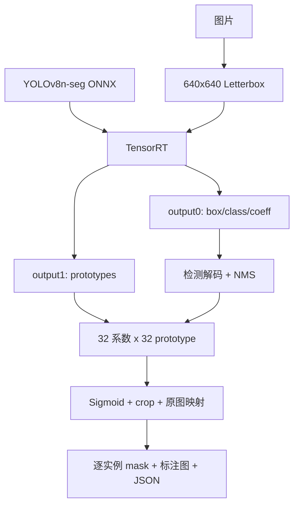
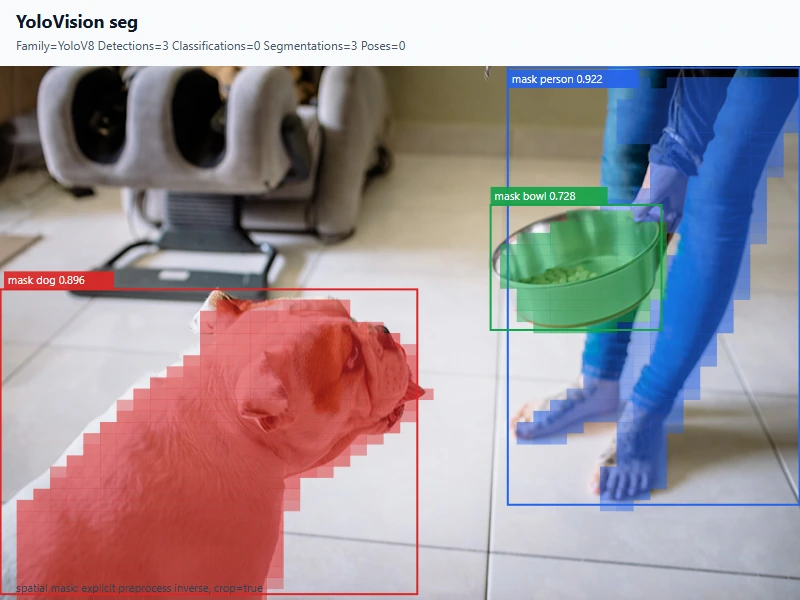

# 使用 TensorRT CSharp API v4.0 与 YoloVision 完成 YOLOv8n 实例分割

<!-- public-article-layout:start -->
<style>
.content article { min-width: 0; overflow-wrap: anywhere; }
.content article a, .content article :not(pre) > code { overflow-wrap: anywhere; word-break: break-word; }
.content article pre:not(.mermaid), .content article table { display: block; max-width: 100%; overflow-x: auto; }
.content pre.mermaid { max-width: 640px; margin: 16px auto; overflow-x: auto; }
.content pre.mermaid svg { display: block; width: 100%; max-width: 640px; height: auto; }
</style>
<!-- public-article-layout:end -->

> 文章编号：`APP-YV-004`；适用版本：TensorRT CSharp API v4.0 `4.0.0`。

## 1. 前言
<!-- public-article-project-preface:start -->
TensorRT CSharp API v4.0 是一个面向 C#/.NET 开发者的 TensorRT 与 CUDA 工程化接口项目。它把 NVIDIA 原生运行时、生成式绑定、C++ Bridge、托管对象模型和可验证的示例程序组织成一条完整链路，使使用者可以在熟悉的 .NET 项目中完成 Engine 构建、反序列化、ExecutionContext 管理、CUDA 内存操作、异步流同步和结果校验。项目的目标不是隐藏 TensorRT 的概念，而是把这些概念转换为有明确生命周期、所有权和错误边界的 C# API。

4.0.0 是一次完整重构后的正式版本。核心接口、Bridge 边界、Runtime 包命名、样例目录和验证方式都以 4.x 设计为准，不能把 3.x 的类型名、旧包名或旧 DLL 目录直接复制到新项目。托管包只提供项目接口和自有 Bridge；TensorRT、CUDA、cuDNN、显卡驱动以及对应许可证仍由使用者按目标平台安装和管理。

单篇文章也应能够独立阅读：读者可以先从项目入口确认源码和包，再根据本文的程序路径准备依赖，最后用输出中的状态、计数、Shape、哈希或结果图片判断流程是否真的完成。对于尚未具备兼容 GPU 的环境，本文会把静态检查、期望输出和真实运行结果分开标记，不把帮助命令或 build-only 结果包装成推理成功。

项目、包和源码入口（以下地址保留明文，便于复制到不完整支持 Markdown 链接的平台）：

项目主页：

```text
https://github.com/guojin-yan/TensorRT-CSharp-API/tree/TensorRtSharp4.0
```

核心 NuGet：

```text
https://www.nuget.org/packages/JYPPX.TensorRT.CSharp.API/4.0.0
```

Runtime Bridge 包列表：

```text
https://www.nuget.org/packages?q=+JYPPX.TensorRT.CSharp&includeComputedFrameworks=true&prerel=true&sortby=relevance
```

运行库清单：

```text
https://github.com/guojin-yan/TensorRT-CSharp-API/blob/TensorRtSharp4.0/pack/runtime/runtime-packages.manifest.json
```

### 1.1 程序出处与输出说明

本文涉及的程序、脚本或命令均以仓库中的实现为准；对应源码入口：

```text
https://github.com/guojin-yan/TensorRT-CSharp-API/tree/TensorRtSharp4.0/applications
```

运行示例必须同时给出程序输出和判定标准。终端中的 `status`、`Ready`、`Bound`、`enqueueCount`、`OutputMatch`、进程退出码、报告文件或结果图片分别说明不同层次的事实；只有明确写出这些结果，读者才能区分程序启动、Engine 构建、GPU enqueue 和业务结果语义。
<!-- public-article-project-preface:end -->

TensorRT CSharp API v4.0：<https://github.com/guojin-yan/TensorRT-CSharp-API> 为 .NET 提供 TensorRT/CUDA C# API，`applications/YoloVision` 则负责视觉模型的预处理、TensorRT 执行、任务后处理、JSON 报告和原图可视化。

实例分割不仅要找到目标框，还要为每个目标生成像素级 mask。YOLOv8n-seg 有 detection 与 mask prototype 两路输出，后处理需要把每个候选的 32 个 mask coefficient 与 32 路 prototype 相乘，再执行 sigmoid、空间映射、阈值化和 box crop。只把 `output0` 当检测模型处理，会丢失实例轮廓。

本文使用固定 YOLOv8n-seg 模型和项目所有者授权图片，完成 ONNX 导出、双输出合同、C# 预处理、TensorRT 推理、mask 合成、独立 ONNX Runtime/PyTorch 对比与结果展示。

### 1.2 项目、包与源码入口

| 项目 | 说明 | 链接 |
| --- | --- | --- |
| TensorRT CSharp API v4.0 | TensorRT/CUDA C# API | GitHub 项目：<https://github.com/guojin-yan/TensorRT-CSharp-API> |
| 稳定核心包 | 托管接口 | `JYPPX.TensorRT.CSharp.API 4.0.0`：<https://www.nuget.org/packages/JYPPX.TensorRT.CSharp.API/4.0.0> |
| Runtime Bridge | 匹配宿主 TensorRT/CUDA/cuDNN | NuGet 包列表：<https://www.nuget.org/profiles/JYPPX> |
| YoloVision | 完整视觉应用 | 应用源码：<https://github.com/guojin-yan/TensorRT-CSharp-API/tree/TensorRtSharp4.0/applications/YoloVision> |
| Mask 合成 | coefficient 与 prototype 合成 | `YoloMaskComposer.cs`：<https://github.com/guojin-yan/TensorRT-CSharp-API/blob/TensorRtSharp4.0/applications/YoloVision/YoloMaskComposer.cs> |
| Mask 输出 | 二进制 mask 与 manifest | `YoloSegmentationMaskArtifactWriter.cs`：<https://github.com/guojin-yan/TensorRT-CSharp-API/blob/TensorRtSharp4.0/applications/YoloVision/YoloSegmentationMaskArtifactWriter.cs> |
| 程序入口 | 参数和运行流程 | `Program.cs`：<https://github.com/guojin-yan/TensorRT-CSharp-API/blob/TensorRtSharp4.0/applications/YoloVision/Program.cs> |

YoloVision 当前是 source-only 应用，不作为独立 NuGet 包发布。历史 local-feed 运行记录只用于复查当时的包消费者行为。

## 2. 实例分割处理链



验证分成两层：先比较 1,793,600 个 raw tensor 元素，再比较最终框与 mask IoU。这样可以区分 TensorRT 数值差异和后处理实现差异。

## 3. 环境与安装

已登记环境为 Windows x64、RTX 3060 Laptop GPU、Driver 576.02、TensorRT 10.11.0、CUDA 12.9 和 .NET SDK 10.0.301。

```powershell
dotnet add package JYPPX.TensorRT.CSharp.API --version 4.0.0
dotnet add package JYPPX.TensorRT.CSharp.API.Runtime.win-x64.trt10.11.cuda12.9.cudnn9.22.Bridge --version 4.0.0
dotnet add package JYPPX.OpenCV.CSharp.API

dotnet restore .\applications\YoloVision\YoloVision.csproj
dotnet build .\applications\YoloVision\YoloVision.csproj -c Release --no-restore
```

Bridge 不包含 NVIDIA 运行库。实际项目应根据操作系统、架构、TensorRT、CUDA 和 cuDNN 选择精确包 ID。

## 4. 模型与输入资产

模型固定为 Ultralytics `v8.3.0`：

| 项目 | 值 |
| --- | --- |
| 权重 URL | `https://github.com/ultralytics/assets/releases/download/v8.3.0/yolov8n-seg.pt` |
| 源码 revision | `6e43d1e1e5db72afbf686dee6745669bcb124b0a` |
| 权重大小 | 7,071,756 bytes |
| 权重 SHA256 | `a7cd8f929e1903d78a12a48efecab430209f18dc46cb96c3599a5980c63c423c` |
| 许可证 | `AGPL-3.0-only` |

```powershell
$RepoRoot = (Resolve-Path '.').Path
$WorkspaceRoot = Split-Path -Parent $RepoRoot
$AssetRoot = Join-Path $WorkspaceRoot 'downloads\yolov8n-seg-ultralytics-v8.3.0'

pwsh -NoProfile -ExecutionPolicy Bypass `
  -File .\eng\Acquire-YoloV8SegOfficialAssets.ps1 `
  -OutputRoot $AssetRoot
```

输入 `dog.jpg` 由项目所有者提供并授权用于本仓库技术文章，SHA256 为 `bf76876b90e3ebd521f9882b9177ba8f33e80cb7ec09c630f179b122edd125e1`。模型权重与 ONNX 留在仓库外，图片授权不扩展为模型再分发授权。

## 5. 导出 ONNX 与双输出合同

```powershell
$Weights = Join-Path $AssetRoot 'source\yolov8n-seg.pt'
$ModelRoot = Join-Path $WorkspaceRoot 'models\YoloVision\InstanceSegmentation\yolov8n-seg-ultralytics-v8.3.0'
New-Item -ItemType Directory -Force $ModelRoot | Out-Null

yolo export model=$Weights format=onnx imgsz=640 opset=17 simplify=True dynamic=False batch=1 device=cpu
Move-Item (Join-Path (Split-Path $Weights) 'yolov8n-seg.onnx') $ModelRoot -Force
```

| 项目 | 值 |
| --- | --- |
| ONNX 大小 | 13,873,432 bytes |
| ONNX SHA256 | `08b5c61368d4ddec5e647522fc55a93c42a9e0c581770aae48b87bba65a9b21d` |
| 输入 | `images:float32[1,3,640,640]` |
| 检测输出 | `output0:float32[1,116,8400]` |
| Prototype 输出 | `output1:float32[1,32,160,160]` |

`116 = 4 box + 80 class + 32 mask coefficient`。两路输出角色必须显式声明：

```text
output0:det,output1:mask-prototypes
```

如果输出次序或名称不同，应根据实际 Engine metadata 修改 role map，不能假定任何双输出模型都采用 `output0/output1`。

## 6. 预处理与独立参考

预处理为 center letterbox 640x640、RGB、NCHW、`scale=1/255`、填充值 114。原图 800x534 被缩放为 640x427，上下 padding 共对应偏移 106。

先由 YoloVision 生成 C# 实际输入 tensor，再让 ONNX Runtime 读取该 tensor：

```powershell
$ArtifactRoot = Join-Path $WorkspaceRoot 'work\yolovision\yolov8n-seg'
$Model = Join-Path $ModelRoot 'yolov8n-seg.onnx'
$InputJpeg = Join-Path $AssetRoot 'input\dog.jpg'
$InputPpm = Join-Path $AssetRoot 'derived\dog.ppm'
$Tensor = Join-Path $ArtifactRoot 'seg-csharp-input.fp32.bin'

python .\eng\Invoke-YoloVisionSegmentationReference.py `
  --model $Weights --image $InputJpeg `
  --onnx-model $Model --input-tensor $Tensor `
  --output-directory (Join-Path $ArtifactRoot 'reference') `
  --evidence-classification source-tree-runtime
```

独立脚本输出两路 raw reference 和 Ultralytics/PyTorch 的框、类别与 mask 参考。

## 7. Mask 合成的核心步骤

对 NMS 后保留的每个 detection：

```text
maskLogits[y,x] = Sum(coeff[k] * prototype[k,y,x]), k=0..31
maskProbability = sigmoid(maskLogits)
binaryMask = maskProbability >= 0.5
```

随后将 prototype 空间的 mask 映射到模型输入空间，裁剪到 detection box，再撤销 letterbox 映射到原图。顺序错误会造成 mask 偏移、越界或覆盖整张图片。

业务代码可以直接使用 YoloVision 入口：

```csharp
using YoloVisionSample;

return YoloVisionCommand.Run(args);
```

## 8. 运行命令

```powershell
$Reference0 = Join-Path $ArtifactRoot 'reference\output0.reference.json'
$Reference1 = Join-Path $ArtifactRoot 'reference\output1.reference.json'
$MaskRoot = Join-Path $ArtifactRoot 'segmentation-masks'
$env:JYPPX_TENSORRT_ROOT = $env:TENSORRT_PATH

dotnet run --project .\applications\YoloVision -c Release --no-build -- `
  --model $Model --labels (Join-Path $AssetRoot 'derived\coco.names') `
  --image $InputPpm --preprocessed-output $Tensor `
  --input-shape 1x3x640x640 --tensor-rt-line 10 --family v8 --task seg `
  --output-role-map output0:det,output1:mask-prototypes `
  --mask-coefficient-count 32 --confidence 0.25 --iou-threshold 0.45 --top-k 10 `
  --mask-threshold 0.5 --mask-spatial-transform `
  --mask-coordinate-space model-input --mask-crop-to-box true `
  --reference-outputs "output0:$Reference0,output1:$Reference1" `
  --reference-abs-tolerance 0.02 --reference-rel-tolerance 0.03 `
  --reference-nan-policy reject --reference-infinity-policy exact --noTF32 `
  --segmentation-mask-output-directory $MaskRoot `
  --output-json (Join-Path $ArtifactRoot 'seg-output.json') `
  --visualization (Join-Path $ArtifactRoot 'seg-annotated.svg') `
  --visualization-background $InputJpeg
```

完成 TensorRT 后，再将 mask manifest 交给独立参考脚本比较 box 和 mask IoU。

## 9. 真实运行结果




| 项目 | 实测值 |
| --- | --- |
| TensorRT 退出码 | 0 |
| 输入 tensor | 1,228,800 个 float32 |
| 输入 tensor SHA256 | `4a2fb58684705e2029f4fae3620ebd3e12e99c73b825fe5d5c89185f1a08c600` |
| raw 比较元素 | 1,793,600 |
| mismatch | 0 |
| `output0` 最大绝对误差 | `0.0011138916` |
| `output1` 最大绝对误差 | `0.000008702278` |
| TensorRT 推理耗时 | `9.393 ms` |
| 实例 | person、dog、bowl |

独立后处理结果：

| 类别 | 分数 | box IoU | mask IoU |
| --- | ---: | ---: | ---: |
| person | `0.921502` | `0.999471` | `0.968968` |
| dog | `0.896453` | `0.998638` | `0.983439` |
| bowl | `0.728054` | `0.998047` | `0.964434` |

box 门槛为 0.995，mask 门槛为 0.96。边缘像素差异来自 C# 抗锯齿缩放与 Ultralytics/OpenCV 插值差异，三类均通过。

## 10. 常见问题

### 10.1 只有检测框，没有 mask

检查是否读取 `output1`，以及 role map 与实际 tensor 名称是否一致。`mask-coefficient-count` 必须为 32。

### 10.2 Mask 覆盖整张图片或位置偏移

核对 sigmoid、0.5 阈值、prototype 到输入空间的缩放、box crop 和 letterbox 逆变换顺序。

### 10.3 Box 正确但 mask IoU 很低

确认独立参考读取同一个 C# tensor，并检查 prototype layout `[1,32,160,160]`。把 channels-first 当成 channels-last 会产生完全错误的 mask。

### 10.4 类别名称不正确

该模型使用 COCO 80 类；labels 必须与训练 class index 顺序一致。类别映射与 mask coefficient 位于同一 detection 行，不能在 NMS 后丢失 source index。

## 11. 证据边界

记录 `yolovision-yolov8n-seg-owner-dog-local-package-win-x64-trt10.11-20260803` 证明固定模型和输入完成真实 TensorRT 双输出推理，两路 raw tensor、框和 mask 均通过独立参考比较。

历史包来自本地 file feed，`packagesDownloadedFromPublicFeed=false`；当前 YoloVision 也不是公开应用包。因此本文不是 public-package 或 post-publish proof，不包含模型再分发许可、NuGet push、Tag、Release 或 Owner release acceptance。

## 12. 总结

YOLOv8n-seg 的关键不是多读取一个 tensor，而是保持 detection、mask coefficient、prototype、NMS source index 和空间变换的一致性。先校验两路 raw tensor，再比较 box 与 mask IoU，可以快速判断问题发生在 TensorRT 执行还是后处理阶段。

<!-- public-article-declaration:start -->
## 13. 文章声明

### 13.1 开源协议声明
作者所有开源项目代码均遵循 Apache License 2.0 开源协议。
特别说明：本项目集成了若干第三方库。若任何第三方库的许可协议与 Apache 2.0 协议存在冲突或不一致，均以该第三方库的原始许可协议为准。本项目不包含也不代表这些第三方库的授权声明，使用前请务必阅读并遵守第三方库的相关许可。

### 13.2 代码开发与质量说明
AI 辅助开发：本代码在开发过程中使用了人工智能（AI）辅助生成与优化，并非完全由人工逐行编写。
安全性承诺：作者郑重声明，本代码中绝无任何有意设置的后门、病毒、木马或旨在破坏用户设备、窃取数据的恶意代码。
技术局限性：受限于作者个人的技术水平与能力，代码中可能存在因逻辑不严谨、优化不足或经验欠缺导致的低级问题（例如但不限于内存泄漏、偶发崩溃、资源未释放等）。这些问题纯属能力不足所致，并非主观故意。
测试范围：由于作者精力有限，未对本软件进行全方位、覆盖所有边缘场景的完整测试。

### 13.3 免责声明（重要）
请在将本代码应用于任何实际项目（特别是商业、工业或关键任务环境）之前，务必进行详尽、严格的自行测试与验证。 鉴于上述可能存在的代码缺陷及测试覆盖不足，因使用本代码而导致的任何直接或间接损失（包括但不限于设备故障、数据丢失、系统瘫痪或利润损失等），本作者概不负责。 一旦您开始使用本代码，即表示您已知晓上述风险并同意自行承担一切后果，相关问题与本作者无关。

### 13.4 代码开源范围
本项目承诺核心逻辑代码完全开源，但上述提到的“第三方库”的二进制文件、源代码或相关资源不在本项目的开源义务范围内，请根据其各自的指引获取。

### 13.5 社区与反馈
尽管存在上述不足，我们仍欢迎大家下载使用、提交 Issue 或参与测试，共同完善项目。如果您在使用过程中发现 Bug、内存溢出或有改进建议，欢迎通过项目主页提供的联系方式与作者取得联系，我们将尽力在有限的时间内提供协助。


<!-- public-article-declaration:end -->
