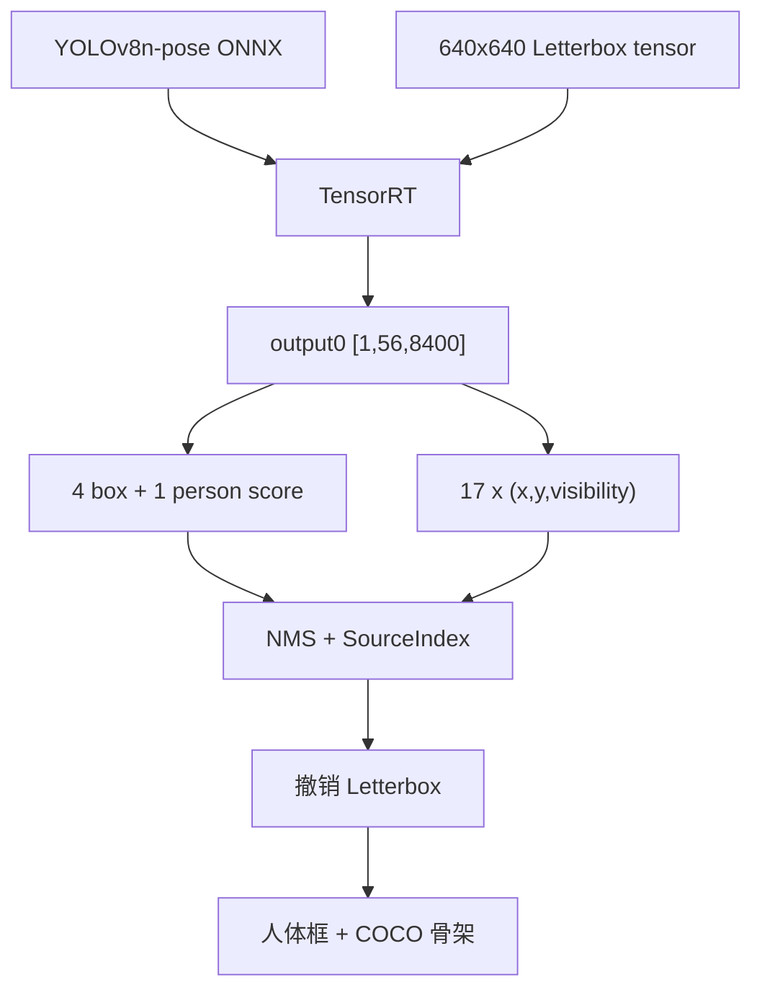
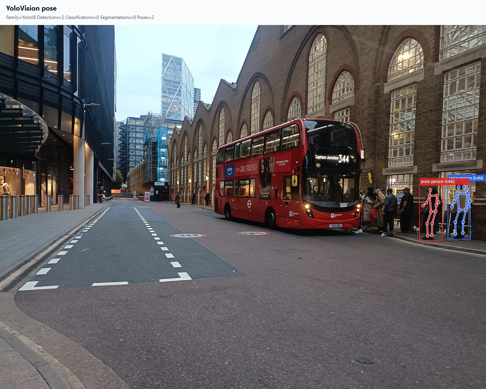

# 使用 TensorRT CSharp API v4.0 与 YoloVision 完成 YOLOv8n 姿态估计

<!-- public-article-layout:start -->
<style>
.content article { min-width: 0; overflow-wrap: anywhere; }
.content article a, .content article :not(pre) > code { overflow-wrap: anywhere; word-break: break-word; }
.content article pre:not(.mermaid), .content article table { display: block; max-width: 100%; overflow-x: auto; }
.content pre.mermaid { max-width: 640px; margin: 16px auto; overflow-x: auto; }
.content pre.mermaid svg { display: block; width: 100%; max-width: 640px; height: auto; }
</style>
<!-- public-article-layout:end -->

> 文章编号：`APP-YV-005`；适用版本：TensorRT CSharp API v4.0 `4.0.0`。

## 1. 前言
<!-- public-article-project-preface:start -->
TensorRT CSharp API v4.0 是一个面向 C#/.NET 开发者的 TensorRT 与 CUDA 工程化接口项目。它把 NVIDIA 原生运行时、生成式绑定、C++ Bridge、托管对象模型和可验证的示例程序组织成一条完整链路，使使用者可以在熟悉的 .NET 项目中完成 Engine 构建、反序列化、ExecutionContext 管理、CUDA 内存操作、异步流同步和结果校验。项目的目标不是隐藏 TensorRT 的概念，而是把这些概念转换为有明确生命周期、所有权和错误边界的 C# API。

4.0.0 是一次完整重构后的正式版本。核心接口、Bridge 边界、Runtime 包命名、样例目录和验证方式都以 4.x 设计为准，不能把 3.x 的类型名、旧包名或旧 DLL 目录直接复制到新项目。托管包只提供项目接口和自有 Bridge；TensorRT、CUDA、cuDNN、显卡驱动以及对应许可证仍由使用者按目标平台安装和管理。

单篇文章也应能够独立阅读：读者可以先从项目入口确认源码和包，再根据本文的程序路径准备依赖，最后用输出中的状态、计数、Shape、哈希或结果图片判断流程是否真的完成。对于尚未具备兼容 GPU 的环境，本文会把静态检查、期望输出和真实运行结果分开标记，不把帮助命令或 build-only 结果包装成推理成功。

项目、包和源码入口（以下地址保留明文，便于复制到不完整支持 Markdown 链接的平台）：

项目主页：

```text
https://github.com/guojin-yan/TensorRT-CSharp-API/tree/TensorRtSharp4.0
```

核心 NuGet：

```text
https://www.nuget.org/packages/JYPPX.TensorRT.CSharp.API/4.0.0
```

Runtime Bridge 包列表：

```text
https://www.nuget.org/packages?q=+JYPPX.TensorRT.CSharp&includeComputedFrameworks=true&prerel=true&sortby=relevance
```

运行库清单：

```text
https://github.com/guojin-yan/TensorRT-CSharp-API/blob/TensorRtSharp4.0/pack/runtime/runtime-packages.manifest.json
```

### 1.1 程序出处与输出说明

本文涉及的程序、脚本或命令均以仓库中的实现为准；对应源码入口：

```text
https://github.com/guojin-yan/TensorRT-CSharp-API/tree/TensorRtSharp4.0/applications
```

运行示例必须同时给出程序输出和判定标准。终端中的 `status`、`Ready`、`Bound`、`enqueueCount`、`OutputMatch`、进程退出码、报告文件或结果图片分别说明不同层次的事实；只有明确写出这些结果，读者才能区分程序启动、Engine 构建、GPU enqueue 和业务结果语义。
<!-- public-article-project-preface:end -->

TensorRT CSharp API v4.0：<https://github.com/guojin-yan/TensorRT-CSharp-API> 提供 TensorRT 与 CUDA 的 C# API，`applications/YoloVision` 在其上实现模型预处理、推理、任务解码和结果可视化。姿态估计需要同时保持人体框、17 个关键点、可见度和 NMS 前候选行的对应关系，比普通 detection 多了一层容易出错的数据关联。

本文使用官方 YOLOv8n-pose 与 CC0 图片，完成 ONNX 导出、`[1,56,8400]` 输出解析、TensorRT 推理、17 个 COCO 关键点解码、骨架绘制，以及 ONNX Runtime raw tensor 和 Ultralytics/PyTorch 后处理双重验证。

### 1.2 项目、包与源码入口

| 项目 | 说明 | 链接 |
| --- | --- | --- |
| TensorRT CSharp API v4.0 | TensorRT/CUDA C# API | GitHub 项目：<https://github.com/guojin-yan/TensorRT-CSharp-API> |
| 稳定核心包 | 托管接口 | `JYPPX.TensorRT.CSharp.API 4.0.0`：<https://www.nuget.org/packages/JYPPX.TensorRT.CSharp.API/4.0.0> |
| Runtime Bridge | 匹配宿主运行环境 | NuGet 包列表：<https://www.nuget.org/profiles/JYPPX> |
| YoloVision | Pose 应用流程 | 应用源码：<https://github.com/guojin-yan/TensorRT-CSharp-API/tree/TensorRtSharp4.0/applications/YoloVision> |
| Pose 解码 | 框、关键点和 source index | `YoloPoseDecoder.cs`：<https://github.com/guojin-yan/TensorRT-CSharp-API/blob/TensorRtSharp4.0/applications/YoloVision/YoloPoseDecoder.cs> |
| 关键点结构 | x、y 与 visibility | `YoloPoseKeypoint.cs`：<https://github.com/guojin-yan/TensorRT-CSharp-API/blob/TensorRtSharp4.0/applications/YoloVision/YoloPoseKeypoint.cs> |
| 程序入口 | 命令解析和执行 | `Program.cs`：<https://github.com/guojin-yan/TensorRT-CSharp-API/blob/TensorRtSharp4.0/applications/YoloVision/Program.cs> |

YoloVision 当前是 source-only 应用。历史 local-feed 包记录用于审计已有运行，不代表当前应用已在公共 NuGet 发布。

## 2. Pose 输出如何组成



56 个通道为：

```text
4 box + 1 person class + 17 * 3 keypoint = 56
```

模型没有独立 objectness，关键点从 channel 5 开始。NMS 后必须使用保留的 `SourceIndex` 返回原候选行取关键点，不能用 NMS 结果数组的顺序重新配对。

## 3. 环境与安装

实测环境为 Windows x64、RTX 3060 Laptop GPU、Driver 576.02、TensorRT 10.11.0、CUDA 12.9 和 .NET SDK 10.0.301。

```powershell
dotnet add package JYPPX.TensorRT.CSharp.API --version 4.0.0
dotnet add package JYPPX.TensorRT.CSharp.API.Runtime.win-x64.trt10.11.cuda12.9.cudnn9.22.Bridge --version 4.0.0
dotnet add package JYPPX.OpenCV.CSharp.API

dotnet restore .\applications\YoloVision\YoloVision.csproj
dotnet build .\applications\YoloVision\YoloVision.csproj -c Release --no-restore
```

CUDA、cuDNN 和 TensorRT 由用户安装，Bridge 只提供项目原生适配层。

## 4. 获取模型与准备图片

| 项目 | 值 |
| --- | --- |
| 权重 URL | `https://github.com/ultralytics/assets/releases/download/v8.3.0/yolov8n-pose.pt` |
| Ultralytics revision | `6e43d1e1e5db72afbf686dee6745669bcb124b0a` |
| 权重大小 | 6,832,633 bytes |
| 权重 SHA256 | `c6fa93dd1ee4a2c18c900a45c1d864a1c6f7aba75d84f91648a30b7fb641d212` |
| 许可证 | `AGPL-3.0-only` |

```powershell
$RepoRoot = (Resolve-Path '.').Path
$WorkspaceRoot = Split-Path -Parent $RepoRoot
$AssetRoot = Join-Path $WorkspaceRoot 'downloads\yolov8n-pose-ultralytics-v8.3.0'

pwsh -NoProfile -ExecutionPolicy Bypass `
  -File .\eng\Acquire-YoloV8PoseOfficialAssets.ps1 `
  -OutputRoot $AssetRoot `
  -PythonPath $env:JYPPX_YOLO_PYTHON
```

文章输入为 Wikimedia Commons 的 `Liverpool Street Bus station 2025`，许可证为 CC0 1.0。JPEG SHA256 为 `52b889d4fc9baea772ba2d9bbdfdef8b70710f993d7f27d193a965b11e708bcb`，转换后 PPM SHA256 为 `80715af66669147b049fec9386152bd45505f4e494a65079fdc55404d4589b8e`。

权重与 ONNX 保留在仓库外，图片的 CC0 许可不改变模型的 AGPL-3.0-only 条款。

## 5. 导出 ONNX 与确认合同

```powershell
$Weights = Join-Path $AssetRoot 'source\yolov8n-pose.pt'
$ModelRoot = Join-Path $WorkspaceRoot 'models\YoloVision\Pose\yolov8n-pose-ultralytics-v8.3.0'
New-Item -ItemType Directory -Force $ModelRoot | Out-Null

yolo export model=$Weights format=onnx imgsz=640 opset=17 simplify=True dynamic=False batch=1 device=cpu
Move-Item (Join-Path (Split-Path $Weights) 'yolov8n-pose.onnx') $ModelRoot -Force
```

| 项目 | 值 |
| --- | --- |
| ONNX 大小 | 13,514,570 bytes |
| ONNX SHA256 | `ed1e8d2d2aeb8a2c66e642a16295a72a2990393e3a3843325537da7e11c8a899` |
| 输入 | `images:float32[1,3,640,640]` |
| 输出 | `output0:float32[1,56,8400]` |
| 类别数 | 1 (`person`) |
| 关键点数 | 17 |
| Objectness | 无独立通道 |

## 6. 预处理和参考输出

预处理使用 center letterbox、RGB、NCHW、`scale=1/255`、fill 114。生成的 C# tensor 同时供 TensorRT 与 ONNX Runtime 使用：

```powershell
$ArtifactRoot = Join-Path $WorkspaceRoot 'work\yolovision\yolov8n-pose'
$Model = Join-Path $ModelRoot 'yolov8n-pose.onnx'
$Tensor = Join-Path $ArtifactRoot 'pose-csharp-input.fp32.bin'
$InputJpeg = Join-Path $ArtifactRoot 'input.jpg'

python .\eng\Invoke-YoloVisionPoseReference.py `
  --onnx-model $Model `
  --weights $Weights `
  --input-tensor $Tensor `
  --image $InputJpeg `
  --output-directory (Join-Path $ArtifactRoot 'reference')
```

参考脚本输出 470,400 个 ONNX Runtime raw 值，以及 Ultralytics/PyTorch 的人体框、分数和 17 个关键点。

## 7. 核心解码逻辑

关键配置必须显式声明：

```csharp
YoloPostprocessOptions options = new()
{
    ClassCount = 1,
    HasObjectness = false,
    AuxiliaryChannelStart = 5,
    KeypointCount = 17,
    ConfidenceThreshold = 0.25f,
    IoUThreshold = 0.45f
};
```

对每个候选读取 4 个 box 值、1 个 person score 和 51 个关键点值。NMS 后保留的 detection 必须携带原始候选索引，才能找到属于同一人体的关键点。

## 8. 运行命令

```powershell
$Reference = Join-Path $ArtifactRoot 'reference\output0.reference.json'
$InputPpm = Join-Path $ArtifactRoot 'input.ppm'
$env:JYPPX_TENSORRT_ROOT = $env:TENSORRT_PATH

dotnet run --project .\applications\YoloVision -c Release --no-build -- `
  --model $Model --labels (Join-Path $ArtifactRoot 'person.names') `
  --input-shape 1x3x640x640 --tensor-rt-line 10 --family v8 --task pose `
  --layout channels-first --has-objectness false --class-count 1 `
  --confidence 0.25 --iou-threshold 0.45 --top-k 10 `
  --keypoint-count 17 --aux-channel-start 5 `
  --image $InputPpm --preprocessed-output $Tensor `
  --reference-outputs "output0:$Reference" `
  --reference-abs-tolerance 1.25 --reference-rel-tolerance 0.05 `
  --reference-nan-policy reject --reference-infinity-policy exact --noTF32 `
  --output (Join-Path $ArtifactRoot 'pose-output.json') `
  --visualization (Join-Path $ArtifactRoot 'pose-annotated.svg') `
  --visualization-background $InputJpeg
```

## 9. 真实运行结果




| 项目 | 实测值 |
| --- | --- |
| TensorRT 退出码 | 0 |
| 输入 tensor | 1,228,800 个 float32 |
| 输入 SHA256 | `050935ebf471ec32ab4327d9f5643f0fe1a203289088895205e732e448a8d225` |
| 输出 | `[1,56,8400]` |
| raw 比较元素 / mismatch | 470,400 / 0 |
| 最大绝对误差 | `0.001373291` |
| TensorRT 推理耗时 | `10.494 ms` |
| 人体数量 | 2 |
| 分数 | `0.46771556`、`0.44162524` |
| 每人关键点 | 17 |
| 可见骨架边 | 27 |

独立 PyTorch 后处理的两个匹配框 IoU 为 `0.9999993976` 和 `0.9999978588`；可见关键点最大坐标误差为 `0.00009548` 和 `0.00012597` 像素。

## 10. 受控负例

将 raw reference 第 0 个值增加 100，实测得到：

```text
Mismatches=1
FirstMismatch=0
OutputValidated=False
YoloVision Passed=False
ProcessExitCode=1
```

这证明 reference 不匹配会阻断成功状态。

## 11. 常见问题

### 11.1 Engine 能生成但 `Poses=0`

确认输出是 `[1,56,8400]`，并设置 `class-count=1`、`has-objectness=false`、`aux-channel-start=5`。错误类别数会把关键点通道当成类别分数。

### 11.2 框正确，但关键点属于另一个人

NMS 后应通过 `SourceIndex` 回到原候选行读取关键点。不要用 NMS 结果列表下标代替原始候选索引。

### 11.3 关键点整体偏移

使用预处理记录中的 resize、padding 和 scale 撤销 letterbox。可视化背景图尺寸必须与预处理源图一致。

### 11.4 骨架连线异常

确认使用 COCO 17-keypoint 顺序和正确 skeleton edge 表。不同数据集的关键点数量与顺序不能混用。

## 12. 证据边界

记录 `yolovision-yolov8n-pose-article-local-package-win-x64-trt10.11-20260803` 证明固定模型与输入完成真实 TensorRT 推理，raw tensor、人体框和关键点均通过独立参考比较。

历史包来自本地 file feed，`packagesDownloadedFromPublicFeed=false`；当前 YoloVision 是 source-only 应用。这不是公共 NuGet post-publish proof，也不包含模型再分发授权、发布包、Tag、Release 或 Owner acceptance。

## 13. 总结

Pose 部署最关键的是同时固定输出通道合同和候选索引关系。`class-count=1`、`keypoint-count=17`、`aux-channel-start=5` 与 `SourceIndex` 缺一不可。全量 raw tensor 对比能验证执行层，框和关键点误差比较则验证后处理层。

<!-- public-article-declaration:start -->
## 14. 文章声明

### 14.1 开源协议声明
作者所有开源项目代码均遵循 Apache License 2.0 开源协议。
特别说明：本项目集成了若干第三方库。若任何第三方库的许可协议与 Apache 2.0 协议存在冲突或不一致，均以该第三方库的原始许可协议为准。本项目不包含也不代表这些第三方库的授权声明，使用前请务必阅读并遵守第三方库的相关许可。

### 14.2 代码开发与质量说明
AI 辅助开发：本代码在开发过程中使用了人工智能（AI）辅助生成与优化，并非完全由人工逐行编写。
安全性承诺：作者郑重声明，本代码中绝无任何有意设置的后门、病毒、木马或旨在破坏用户设备、窃取数据的恶意代码。
技术局限性：受限于作者个人的技术水平与能力，代码中可能存在因逻辑不严谨、优化不足或经验欠缺导致的低级问题（例如但不限于内存泄漏、偶发崩溃、资源未释放等）。这些问题纯属能力不足所致，并非主观故意。
测试范围：由于作者精力有限，未对本软件进行全方位、覆盖所有边缘场景的完整测试。

### 14.3 免责声明（重要）
请在将本代码应用于任何实际项目（特别是商业、工业或关键任务环境）之前，务必进行详尽、严格的自行测试与验证。 鉴于上述可能存在的代码缺陷及测试覆盖不足，因使用本代码而导致的任何直接或间接损失（包括但不限于设备故障、数据丢失、系统瘫痪或利润损失等），本作者概不负责。 一旦您开始使用本代码，即表示您已知晓上述风险并同意自行承担一切后果，相关问题与本作者无关。

### 14.4 代码开源范围
本项目承诺核心逻辑代码完全开源，但上述提到的“第三方库”的二进制文件、源代码或相关资源不在本项目的开源义务范围内，请根据其各自的指引获取。

### 14.5 社区与反馈
尽管存在上述不足，我们仍欢迎大家下载使用、提交 Issue 或参与测试，共同完善项目。如果您在使用过程中发现 Bug、内存溢出或有改进建议，欢迎通过项目主页提供的联系方式与作者取得联系，我们将尽力在有限的时间内提供协助。


<!-- public-article-declaration:end -->
