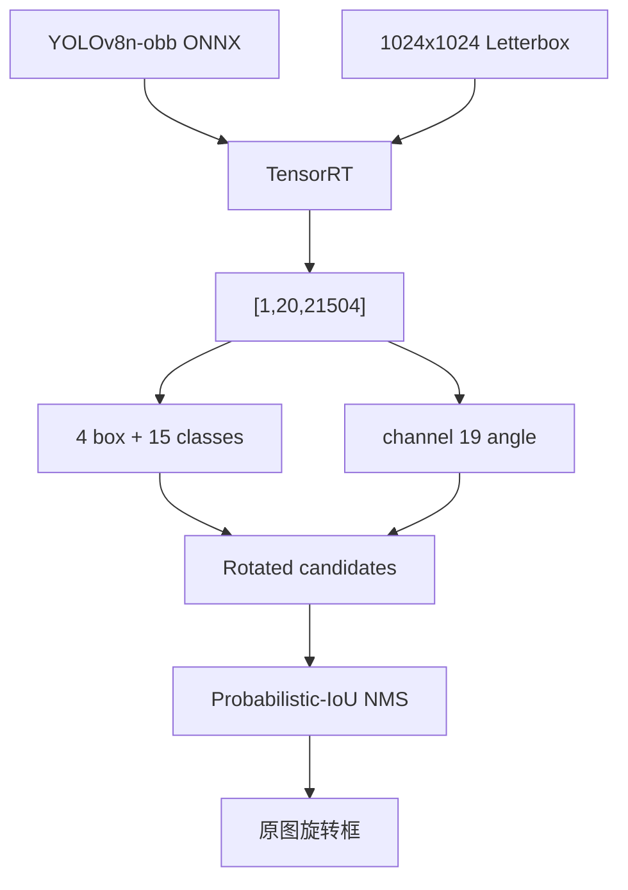

# 使用 TensorRT CSharp API v4.0 与 YoloVision 完成 YOLOv8n OBB 旋转目标检测

<!-- public-article-layout:start -->
<style>
.content article { min-width: 0; overflow-wrap: anywhere; }
.content article a, .content article :not(pre) > code { overflow-wrap: anywhere; word-break: break-word; }
.content article pre:not(.mermaid), .content article table { display: block; max-width: 100%; overflow-x: auto; }
.content pre.mermaid { max-width: 640px; margin: 16px auto; overflow-x: auto; }
.content pre.mermaid svg { display: block; width: 100%; max-width: 640px; height: auto; }
</style>
<!-- public-article-layout:end -->

> 文章编号：`APP-YV-006`；适用版本：TensorRT CSharp API v4.0 `4.0.0`。

## 1. 前言
<!-- public-article-project-preface:start -->
TensorRT CSharp API v4.0 是一个面向 C#/.NET 开发者的 TensorRT 与 CUDA 工程化接口项目。它把 NVIDIA 原生运行时、生成式绑定、C++ Bridge、托管对象模型和可验证的示例程序组织成一条完整链路，使使用者可以在熟悉的 .NET 项目中完成 Engine 构建、反序列化、ExecutionContext 管理、CUDA 内存操作、异步流同步和结果校验。项目的目标不是隐藏 TensorRT 的概念，而是把这些概念转换为有明确生命周期、所有权和错误边界的 C# API。

4.0.0 是一次完整重构后的正式版本。核心接口、Bridge 边界、Runtime 包命名、样例目录和验证方式都以 4.x 设计为准，不能把 3.x 的类型名、旧包名或旧 DLL 目录直接复制到新项目。托管包只提供项目接口和自有 Bridge；TensorRT、CUDA、cuDNN、显卡驱动以及对应许可证仍由使用者按目标平台安装和管理。

单篇文章也应能够独立阅读：读者可以先从项目入口确认源码和包，再根据本文的程序路径准备依赖，最后用输出中的状态、计数、Shape、哈希或结果图片判断流程是否真的完成。对于尚未具备兼容 GPU 的环境，本文会把静态检查、期望输出和真实运行结果分开标记，不把帮助命令或 build-only 结果包装成推理成功。

项目、包和源码入口（以下地址保留明文，便于复制到不完整支持 Markdown 链接的平台）：

项目主页：

```text
https://github.com/guojin-yan/TensorRT-CSharp-API/tree/TensorRtSharp4.0
```

核心 NuGet：

```text
https://www.nuget.org/packages/JYPPX.TensorRT.CSharp.API/4.0.0
```

Runtime Bridge 包列表：

```text
https://www.nuget.org/packages?q=+JYPPX.TensorRT.CSharp&includeComputedFrameworks=true&prerel=true&sortby=relevance
```

运行库清单：

```text
https://github.com/guojin-yan/TensorRT-CSharp-API/blob/TensorRtSharp4.0/pack/runtime/runtime-packages.manifest.json
```

### 1.1 程序出处与输出说明

本文涉及的程序、脚本或命令均以仓库中的实现为准；对应源码入口：

```text
https://github.com/guojin-yan/TensorRT-CSharp-API/tree/TensorRtSharp4.0/applications
```

运行示例必须同时给出程序输出和判定标准。终端中的 `status`、`Ready`、`Bound`、`enqueueCount`、`OutputMatch`、进程退出码、报告文件或结果图片分别说明不同层次的事实；只有明确写出这些结果，读者才能区分程序启动、Engine 构建、GPU enqueue 和业务结果语义。
<!-- public-article-project-preface:end -->

TensorRT CSharp API v4.0：<https://github.com/guojin-yan/TensorRT-CSharp-API> 为 .NET 提供 TensorRT 与 CUDA C# API，`applications/YoloVision` 负责模型预处理、执行、后处理、报告和可视化。OBB（Oriented Bounding Box）适用于航拍、遥感、工业零件等方向信息重要的场景，它输出带角度的旋转框，而不是普通水平矩形。

YOLOv8n-obb 的输出包含 15 个 DOTA 类别和一个内嵌角度通道。后处理必须正确解释角度单位、恢复旋转框到原图，并使用旋转框相似度执行 NMS。把它交给普通 detection 解码器，即使进程能运行，也会得到错误的框与抑制结果。

本文使用固定官方权重和项目所有者授权的航拍图片，完成 1024x1024 ONNX 导出、TensorRT 推理、12 个飞机旋转框、独立 raw tensor 对比和 rotated IoU 验证。

### 1.2 项目、包与源码入口

| 项目 | 说明 | 链接 |
| --- | --- | --- |
| TensorRT CSharp API v4.0 | TensorRT/CUDA C# API | GitHub 项目：<https://github.com/guojin-yan/TensorRT-CSharp-API> |
| 稳定核心包 | 托管接口 | `JYPPX.TensorRT.CSharp.API 4.0.0`：<https://www.nuget.org/packages/JYPPX.TensorRT.CSharp.API/4.0.0> |
| Runtime Bridge | 按运行环境选择 | NuGet 包列表：<https://www.nuget.org/profiles/JYPPX> |
| YoloVision | OBB 完整应用流程 | 应用源码：<https://github.com/guojin-yan/TensorRT-CSharp-API/tree/TensorRtSharp4.0/applications/YoloVision> |
| OBB 解码 | 角度、旋转框与 NMS 输入 | `YoloObbDecoder.cs`：<https://github.com/guojin-yan/TensorRT-CSharp-API/blob/TensorRtSharp4.0/applications/YoloVision/YoloObbDecoder.cs> |
| OBB 结果结构 | 中心、宽高、角度与类别 | `YoloObbDetection.cs`：<https://github.com/guojin-yan/TensorRT-CSharp-API/blob/TensorRtSharp4.0/applications/YoloVision/YoloObbDetection.cs> |
| 程序入口 | 参数和执行调度 | `Program.cs`：<https://github.com/guojin-yan/TensorRT-CSharp-API/blob/TensorRtSharp4.0/applications/YoloVision/Program.cs> |

YoloVision 当前是 source-only 应用。历史 local-feed 包证据不能解释为当前公开 NuGet 应用包。

## 2. OBB 与普通 Detection 的差异



20 个通道的结构为：

```text
4 box + 15 DOTA classes + 1 angle = 20
```

模型没有独立 objectness，角度在 channel 19，单位是 radians。NMS 使用 class-aware probabilistic IoU，不能用水平框 IoU 代替。

## 3. 环境与安装

实测环境为 Windows x64、RTX 3060 Laptop GPU、Driver 576.02、TensorRT 10.11.0、CUDA 12.9 和 .NET SDK 10.0.301。

```powershell
dotnet add package JYPPX.TensorRT.CSharp.API --version 4.0.0
dotnet add package JYPPX.TensorRT.CSharp.API.Runtime.win-x64.trt10.11.cuda12.9.cudnn9.22.Bridge --version 4.0.0
dotnet add package JYPPX.OpenCV.CSharp.API

dotnet restore .\applications\YoloVision\YoloVision.csproj
dotnet build .\applications\YoloVision\YoloVision.csproj -c Release --no-restore
```

Bridge 只包含项目原生桥接层，NVIDIA Driver、CUDA、cuDNN 和 TensorRT 需要单独安装。

## 4. 模型与图片资产

| 项目 | 值 |
| --- | --- |
| 权重 URL | `https://github.com/ultralytics/assets/releases/download/v8.3.0/yolov8n-obb.pt` |
| Ultralytics revision | `6e43d1e1e5db72afbf686dee6745669bcb124b0a` |
| 权重大小 | 6,567,590 bytes |
| 权重 SHA256 | `fa6e4cd2691f132875c143135affaa66b5d89394ebb1d07d19770a9b6382c1b8` |
| 训练类别 | DOTA 15 类 |
| 许可证 | `AGPL-3.0-only` |

```powershell
$RepoRoot = (Resolve-Path '.').Path
$WorkspaceRoot = Split-Path -Parent $RepoRoot
$AssetRoot = Join-Path $WorkspaceRoot 'downloads\yolov8n-obb-ultralytics-v8.3.0'

pwsh -NoProfile -ExecutionPolicy Bypass `
  -File .\eng\Acquire-YoloV8ObbOfficialAssets.ps1 `
  -OutputRoot $AssetRoot `
  -PythonPath $env:JYPPX_YOLO_PYTHON
```

输入 `plane.png` 由项目所有者提供并授权用于本仓库技术文章，原图 SHA256 为 `dde925501ff0f2bddb7e28198fdd0586620f7a7ef587412717f666b7ea6584c9`。该授权不扩展为模型或其他资产的再分发许可。

## 5. 导出 ONNX 与确认合同

```powershell
$Weights = Join-Path $AssetRoot 'source\yolov8n-obb.pt'
$ModelRoot = Join-Path $WorkspaceRoot 'models\YoloVision\OrientedBoundingBox\yolov8n-obb-ultralytics-v8.3.0'
New-Item -ItemType Directory -Force $ModelRoot | Out-Null

yolo export model=$Weights format=onnx imgsz=1024 opset=17 simplify=True dynamic=False batch=1 device=cpu
Move-Item (Join-Path (Split-Path $Weights) 'yolov8n-obb.onnx') $ModelRoot -Force
```

| 项目 | 值 |
| --- | --- |
| ONNX 大小 | 12,664,838 bytes |
| ONNX SHA256 | `5f2701ef5326fb5a691999438cfc55a69656323c21ffddebaff8968ab6de2e92` |
| 输入 | `images:float32[1,3,1024,1024]` |
| 输出 | `output0:float32[1,20,21504]` |
| 类别数 | 15 |
| 角度通道 | 19 |
| 角度单位 | radians |

模型合同必须由参数明确声明，不能仅凭文件名推断。

## 6. 预处理与独立参考

预处理为 center letterbox 1024x1024、RGB、NCHW、`scale=1/255`、fill 114。实测原图 1597x1208 缩放到 1024x775，垂直 padding 起点为 124。

先生成 C# 实际输入 tensor，再由 ONNX Runtime 和 Ultralytics/PyTorch 读取同一个 tensor：

```powershell
$ArtifactRoot = Join-Path $WorkspaceRoot 'work\yolovision\yolov8n-obb'
$Model = Join-Path $ModelRoot 'yolov8n-obb.onnx'
$InputPng = Join-Path $AssetRoot 'input\plane.png'
$Tensor = Join-Path $ArtifactRoot 'obb-csharp-input.fp32.bin'

python .\eng\Invoke-YoloVisionObbReference.py `
  --onnx-model $Model --weights $Weights --input-tensor $Tensor `
  --image $InputPng --output-directory (Join-Path $ArtifactRoot 'reference') `
  --input-shape 1 3 1024 1024 --output-shape 1 20 21504 `
  --max-detections 12
```

脚本输出 430,080 个 raw reference 值和独立旋转框结果。

## 7. 旋转框解码

每个候选包含中心点、宽高、15 个类别分数和一个角度：

```csharp
YoloPostprocessOptions options = new()
{
    ClassCount = 15,
    HasObjectness = false,
    AuxiliaryChannelStart = 19,
    ConfidenceThreshold = 0.25f,
    IoUThreshold = 0.45f
};
```

角度必须以 radians 解释。可视化时根据中心、宽高和角度计算四个顶点；NMS 使用旋转框 probabilistic IoU，并按类别隔离抑制。

## 8. 运行命令

```powershell
$InputPpm = Join-Path $AssetRoot 'derived\plane.ppm'
$Labels = Join-Path $AssetRoot 'derived\dota.names'
$Reference = Join-Path $ArtifactRoot 'reference\output0.reference.json'
$env:JYPPX_TENSORRT_ROOT = $env:TENSORRT_PATH

dotnet run --project .\applications\YoloVision -c Release --no-build -- `
  --model $Model --labels $Labels --image $InputPpm `
  --preprocessed-output $Tensor --input-shape 1x3x1024x1024 `
  --tensor-rt-line 10 --family v8 --task obb `
  --layout channels-first --class-count 15 --has-objectness false `
  --confidence 0.25 --iou-threshold 0.45 --top-k 12 `
  --aux-channel-start 19 --aux-layout channels-first --angle-radians `
  --reference-outputs "output0:$Reference" `
  --reference-abs-tolerance 4.25 --reference-rel-tolerance 0.05 `
  --reference-nan-policy reject --reference-infinity-policy exact --noTF32 `
  --output-json (Join-Path $ArtifactRoot 'obb-output.json') `
  --visualization (Join-Path $ArtifactRoot 'obb-annotated.svg') `
  --visualization-background $InputPng
```

## 9. 真实运行结果


| 项目 | 实测值 |
| --- | --- |
| TensorRT 退出码 | 0 |
| 输入 tensor | 3,145,728 个 float32 |
| 输入 SHA256 | `ec8bdbb2ce8fb32bdf23dc9d515a18f9c973b2a970719ee1668322fe68e7739b` |
| 输出 | `[1,20,21504]` |
| raw 比较元素 / mismatch | 430,080 / 0 |
| 最大绝对误差 | `0.0026550293` |
| TensorRT 推理耗时 | `12.996 ms` |
| 最终旋转框 | 12 个 `plane` |
| 最高分 | `0.923140` |
| 最小 rotated IoU | `0.9262661484` |
| 最大坐标误差 | `1.577365` pixels |
| 最大角度误差 | `0.00366746` radians |
| 最大分数误差 | `0.000360663` |

rotated IoU 门槛为 0.92，坐标误差门槛为 2 pixels，角度误差门槛为 0.01 radians。约 1.58 像素的最大坐标差异来自 C# 缩放与 Ultralytics/OpenCV 对半像素和 letterbox 舍入的不同处理，未被隐藏或写成零误差。

## 10. 常见问题

### 10.1 框存在但角度明显错误

确认 channel 19 是角度，并使用 `--angle-radians`。把 radians 当 degrees 会造成系统性旋转错误。

### 10.2 旋转框被错误抑制

不要使用水平外接矩形 IoU 代替 rotated/probabilistic IoU。细长且方向不同的目标使用水平 IoU 会产生错误重叠关系。

### 10.3 类别全部是 `plane` 是否合理

本文输入是航拍飞机场景，独立参考同样得到 12 个 plane。若换图后类别异常，应核对 DOTA 15 类 labels 顺序和 class count，而不是直接修改名称。

### 10.4 框整体偏移

核对 1024x1024 letterbox 的缩放和垂直 padding，先恢复中心与宽高到原图空间，再计算旋转顶点。

## 11. 证据边界

记录 `yolovision-yolov8n-obb-owner-plane-local-package-win-x64-trt10.11-20260803` 证明固定模型和图片完成真实 TensorRT OBB 推理，raw tensor 与独立参考一致，12 个旋转框通过 rotated IoU、坐标、角度和分数误差门槛。

历史包来自本地 file feed，`packagesDownloadedFromPublicFeed=false`，当前 YoloVision 也不是公开应用包。本文不是 public-package 或 post-publish proof，不包含模型再分发许可、NuGet push、Tag、Release 或 Owner acceptance。

## 12. 总结

OBB 部署需要同时固定 class count、角度通道、角度单位、旋转框 NMS 和 letterbox 逆变换。全量 raw tensor 对比验证 TensorRT 执行，rotated IoU 与角度误差验证后处理；两层都通过，才能确认旋转框流程正确。

<!-- public-article-declaration:start -->
## 13. 文章声明

### 13.1 开源协议声明
作者所有开源项目代码均遵循 Apache License 2.0 开源协议。
特别说明：本项目集成了若干第三方库。若任何第三方库的许可协议与 Apache 2.0 协议存在冲突或不一致，均以该第三方库的原始许可协议为准。本项目不包含也不代表这些第三方库的授权声明，使用前请务必阅读并遵守第三方库的相关许可。

### 13.2 代码开发与质量说明
AI 辅助开发：本代码在开发过程中使用了人工智能（AI）辅助生成与优化，并非完全由人工逐行编写。
安全性承诺：作者郑重声明，本代码中绝无任何有意设置的后门、病毒、木马或旨在破坏用户设备、窃取数据的恶意代码。
技术局限性：受限于作者个人的技术水平与能力，代码中可能存在因逻辑不严谨、优化不足或经验欠缺导致的低级问题（例如但不限于内存泄漏、偶发崩溃、资源未释放等）。这些问题纯属能力不足所致，并非主观故意。
测试范围：由于作者精力有限，未对本软件进行全方位、覆盖所有边缘场景的完整测试。

### 13.3 免责声明（重要）
请在将本代码应用于任何实际项目（特别是商业、工业或关键任务环境）之前，务必进行详尽、严格的自行测试与验证。 鉴于上述可能存在的代码缺陷及测试覆盖不足，因使用本代码而导致的任何直接或间接损失（包括但不限于设备故障、数据丢失、系统瘫痪或利润损失等），本作者概不负责。 一旦您开始使用本代码，即表示您已知晓上述风险并同意自行承担一切后果，相关问题与本作者无关。

### 13.4 代码开源范围
本项目承诺核心逻辑代码完全开源，但上述提到的“第三方库”的二进制文件、源代码或相关资源不在本项目的开源义务范围内，请根据其各自的指引获取。

### 13.5 社区与反馈
尽管存在上述不足，我们仍欢迎大家下载使用、提交 Issue 或参与测试，共同完善项目。如果您在使用过程中发现 Bug、内存溢出或有改进建议，欢迎通过项目主页提供的联系方式与作者取得联系，我们将尽力在有限的时间内提供协助。


<!-- public-article-declaration:end -->
