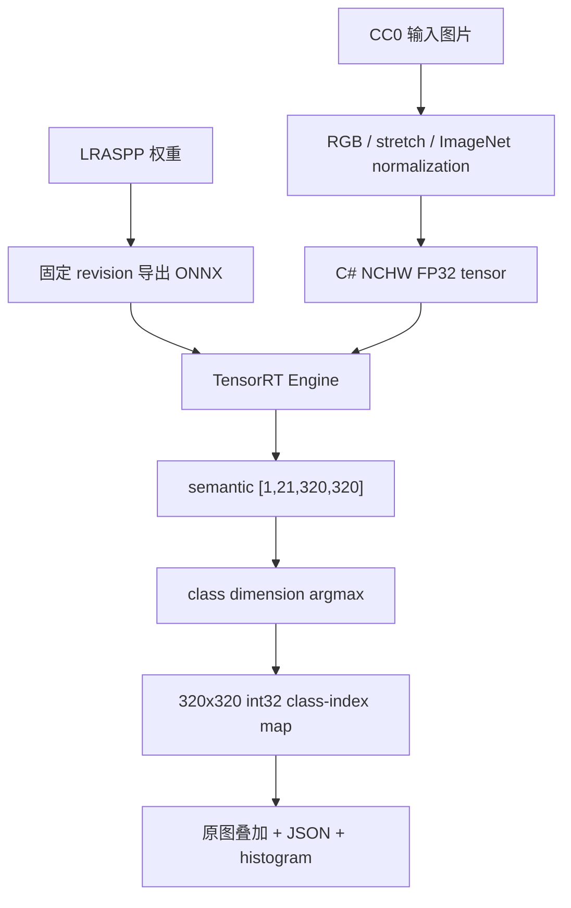

# 使用 TensorRT CSharp API v4.0 与 YoloVision 完成 LRASPP 语义分割

<!-- public-article-layout:start -->
<style>
.content article { min-width: 0; overflow-wrap: anywhere; }
.content article a, .content article :not(pre) > code { overflow-wrap: anywhere; word-break: break-word; }
.content article pre:not(.mermaid), .content article table { display: block; max-width: 100%; overflow-x: auto; }
.content pre.mermaid { max-width: 640px; margin: 16px auto; overflow-x: auto; }
.content pre.mermaid svg { display: block; width: 100%; max-width: 640px; height: auto; }
</style>
<!-- public-article-layout:end -->

> 文章编号：`APP-YV-007`；适用版本：TensorRT CSharp API v4.0 `4.0.0`。

## 1. 前言
<!-- public-article-project-preface:start -->
TensorRT CSharp API v4.0 是一个面向 C#/.NET 开发者的 TensorRT 与 CUDA 工程化接口项目。它把 NVIDIA 原生运行时、生成式绑定、C++ Bridge、托管对象模型和可验证的示例程序组织成一条完整链路，使使用者可以在熟悉的 .NET 项目中完成 Engine 构建、反序列化、ExecutionContext 管理、CUDA 内存操作、异步流同步和结果校验。项目的目标不是隐藏 TensorRT 的概念，而是把这些概念转换为有明确生命周期、所有权和错误边界的 C# API。

4.0.0 是一次完整重构后的正式版本。核心接口、Bridge 边界、Runtime 包命名、样例目录和验证方式都以 4.x 设计为准，不能把 3.x 的类型名、旧包名或旧 DLL 目录直接复制到新项目。托管包只提供项目接口和自有 Bridge；TensorRT、CUDA、cuDNN、显卡驱动以及对应许可证仍由使用者按目标平台安装和管理。

单篇文章也应能够独立阅读：读者可以先从项目入口确认源码和包，再根据本文的程序路径准备依赖，最后用输出中的状态、计数、Shape、哈希或结果图片判断流程是否真的完成。对于尚未具备兼容 GPU 的环境，本文会把静态检查、期望输出和真实运行结果分开标记，不把帮助命令或 build-only 结果包装成推理成功。

项目、包和源码入口（以下地址保留明文，便于复制到不完整支持 Markdown 链接的平台）：

项目主页：

```text
https://github.com/guojin-yan/TensorRT-CSharp-API/tree/TensorRtSharp4.0
```

核心 NuGet：

```text
https://www.nuget.org/packages/JYPPX.TensorRT.CSharp.API/4.0.0
```

Runtime Bridge 包列表：

```text
https://www.nuget.org/packages?q=+JYPPX.TensorRT.CSharp&includeComputedFrameworks=true&prerel=true&sortby=relevance
```

运行库清单：

```text
https://github.com/guojin-yan/TensorRT-CSharp-API/blob/TensorRtSharp4.0/pack/runtime/runtime-packages.manifest.json
```

### 1.1 程序出处与输出说明

本文涉及的程序、脚本或命令均以仓库中的实现为准；对应源码入口：

```text
https://github.com/guojin-yan/TensorRT-CSharp-API/tree/TensorRtSharp4.0/applications
```

运行示例必须同时给出程序输出和判定标准。终端中的 `status`、`Ready`、`Bound`、`enqueueCount`、`OutputMatch`、进程退出码、报告文件或结果图片分别说明不同层次的事实；只有明确写出这些结果，读者才能区分程序启动、Engine 构建、GPU enqueue 和业务结果语义。
<!-- public-article-project-preface:end -->

TensorRT CSharp API v4.0：<https://github.com/guojin-yan/TensorRT-CSharp-API> 为 .NET 提供 TensorRT 与 CUDA C# API，`applications/YoloVision` 在其上实现图像预处理、TensorRT 执行、任务后处理、artifact 和结果可视化。语义分割与实例分割不同：它为每个像素输出一个类别，不区分同类目标的实例，也没有检测框和 NMS。

本文使用 torchvision LRASPP MobileNetV3 Large，完成模型获取、ONNX 导出、ImageNet normalization、TensorRT 推理、逐像素 argmax、类别索引图、原图叠加和 ONNX Runtime 逐值验证。结果图中的 `dog` 和 `person` 类别来自固定 VOC 21 类 labels，不能根据颜色或图片观感手工调整。

### 1.2 项目、包与源码入口

| 项目 | 说明 | 链接 |
| --- | --- | --- |
| TensorRT CSharp API v4.0 | TensorRT/CUDA C# API | GitHub 项目：<https://github.com/guojin-yan/TensorRT-CSharp-API> |
| 稳定核心包 | 托管接口、Engine 构建与执行 | `JYPPX.TensorRT.CSharp.API 4.0.0`：<https://www.nuget.org/packages/JYPPX.TensorRT.CSharp.API/4.0.0> |
| Runtime Bridge | 匹配宿主 TensorRT/CUDA/cuDNN | NuGet 包列表：<https://www.nuget.org/profiles/JYPPX> |
| YoloVision | 语义分割应用、argmax 与 artifact | 应用源码：<https://github.com/guojin-yan/TensorRT-CSharp-API/tree/TensorRtSharp4.0/applications/YoloVision> |
| 语义输出结构 | 类别索引与报告 | `YoloSemanticMap.cs`：<https://github.com/guojin-yan/TensorRT-CSharp-API/blob/TensorRtSharp4.0/applications/YoloVision/YoloSemanticMap.cs> |
| Artifact 写出 | class-index 与 manifest | `YoloSemanticMapArtifactWriter.cs`：<https://github.com/guojin-yan/TensorRT-CSharp-API/blob/TensorRtSharp4.0/applications/YoloVision/YoloSemanticMapArtifactWriter.cs> |
| 程序入口 | 参数解析和运行调度 | `Program.cs`：<https://github.com/guojin-yan/TensorRT-CSharp-API/blob/TensorRtSharp4.0/applications/YoloVision/Program.cs> |

YoloVision 当前是 source-only 应用，不作为独立 NuGet 应用包发布。历史 local-feed 记录中的应用包仅代表当时的隔离消费者验证。

## 2. 语义分割的完整链路



本文验证三个层次：

1. 2,150,400 个 logits 与 ONNX Runtime reference 完全对照。
2. 102,400 个 class-index 像素及类别直方图一致。
3. 结果图片、JSON、manifest 和终端日志来自同一次真实 TensorRT 执行。

## 3. 环境与安装

实测矩阵：Windows x64、RTX 3060 Laptop GPU、Driver 576.02、TensorRT 10.11.0、CUDA 12.9 和 .NET SDK 10.0.301。

```powershell
dotnet add package JYPPX.TensorRT.CSharp.API --version 4.0.0
dotnet add package JYPPX.TensorRT.CSharp.API.Runtime.win-x64.trt10.11.cuda12.9.cudnn9.22.Bridge --version 4.0.0
dotnet add package JYPPX.OpenCV.CSharp.API

dotnet restore .\applications\YoloVision\YoloVision.csproj
dotnet build .\applications\YoloVision\YoloVision.csproj -c Release --no-restore
```

Bridge 只提供项目原生桥接层，不包含 NVIDIA Driver、CUDA、cuDNN、TensorRT 或 NVRTC。

## 4. 模型与许可证

本文固定 torchvision `v0.25.0` 的 LRASPP MobileNetV3 Large：

| 项目 | 固定值 |
| --- | --- |
| 权重 URL | `https://download.pytorch.org/models/lraspp_mobilenet_v3_large-d234d4ea.pth` |
| torchvision revision | `torchvision-v0.25.0@8ac84ee75afb1c327902156b5336f56ad63b7e2f` |
| 权重 SHA256 | `d234d4eae9d55d5f76de18b77cf0dc62c66fe5c5482758209d00f950c92bb280` |
| 许可证 | `BSD-3-Clause` |
| 类别表 | VOC 21 类，包括 background、dog、person |

使用仓库脚本获取固定资产：

```powershell
$RepoRoot = (Resolve-Path '.').Path
$WorkspaceRoot = Split-Path -Parent $RepoRoot
$DownloadRoot = Join-Path $WorkspaceRoot 'downloads\lraspp-mobilenet-v3-large-torchvision-v0.25.0'
$ModelRoot = Join-Path $WorkspaceRoot 'models\YoloVision\SemanticSegmentation\lraspp-mobilenet-v3-large-torchvision-v0.25.0'

pwsh -NoProfile -ExecutionPolicy Bypass `
  -File .\eng\Acquire-TorchVisionLrasppOfficialAssets.ps1 `
  -AssetDirectory (Join-Path $DownloadRoot 'source') `
  -ModelDirectory $ModelRoot `
  -ReferenceOutputDirectory (Join-Path $WorkspaceRoot 'work\lraspp-reference') `
  -PythonPath (Get-Command python).Source `
  -AllowDownload
```

模型、ONNX 和转换脚本下载的参考图片均只保存在仓库外工作目录，不进入 Git、NuGet 或 Release。

## 5. ONNX 合同与预处理

```powershell
python .\eng\Invoke-YoloVisionSemanticReference.py `
  --weights (Join-Path $ModelRoot 'lraspp_mobilenet_v3_large-d234d4ea.pth') `
  --image (Join-Path $DownloadRoot 'source\dog.jpg') `
  --onnx (Join-Path $ModelRoot 'lraspp-mobilenet-v3-large-320.onnx') `
  --output-directory (Join-Path $WorkspaceRoot 'work\lraspp-reference') `
  --export-onnx
```

固定 ONNX 信息：

| 项目 | 值 |
| --- | --- |
| 文件大小 | 12,879,801 bytes |
| SHA256 | `3cb94e561bdefe606ed7d1a2c4d0296409bec066f3a39a9fe9dabd72b23728f8` |
| 输入 | `images:float32[1,3,320,320]` |
| 输出 | `semantic:float32[1,21,320,320]` |
| 输出语义 | 21 类 logits |

预处理不是简单 `1/255`，而是：

```text
RGB -> NCHW -> scale=1/255
mean=(0.485,0.456,0.406)
std=(0.229,0.224,0.225)
stretch 到 320x320
```

文章展示图片来自 Wikimedia Commons 的 `Dog at Norre Vorupor Strand`，许可证为 CC0 1.0。JPEG SHA256 为 `e678ecf8dab63da112812ada0553d72d46033e4e9ea3b568bf0e53d92e1d6910`，PPM SHA256 为 `2b719e7967d6094bdd2f05d2a3b30a0b8e3cd63ffa2ca473f4c1373a1e09e728`。

## 6. 核心代码与运行命令

业务入口仍然是无指针的托管调用：

```csharp
using YoloVisionSample;

return YoloVisionCommand.Run(args);
```

准备结果目录：

```powershell
$ArtifactRoot = Join-Path $WorkspaceRoot 'work\yolovision\lraspp-semantic'
$Tensor = Join-Path $ArtifactRoot 'input-csharp-imagenet.fp32.bin'
$Onnx = Join-Path $ModelRoot 'lraspp-mobilenet-v3-large-320.onnx'
$InputPpm = Join-Path $DownloadRoot 'article-input\dog-norre-vorupor-1280.ppm'
$InputJpeg = Join-Path $DownloadRoot 'article-input\dog-norre-vorupor-1280.jpg'
$Labels = Join-Path $WorkspaceRoot 'work\lraspp-reference\voc-semantic.names'
$env:JYPPX_TENSORRT_ROOT = $env:TENSORRT_PATH

dotnet run --project .\applications\YoloVision -c Release --no-build -- `
  --model $Onnx --labels $Labels --image $InputPpm `
  --preprocessed-output $Tensor `
  --output-json (Join-Path $ArtifactRoot 'semantic-output.json') `
  --semantic-artifact-output-directory (Join-Path $ArtifactRoot 'semantic-map-artifacts') `
  --visualization (Join-Path $ArtifactRoot 'semantic-annotated.svg') `
  --visualization-background $InputJpeg `
  --input-shape 1x3x320x320 --input-name images --output-name semantic `
  --tensor-rt-line 10 --noTF32 --family custom --task sem `
  --class-count 21 --tensor-layout NCHW --color-order RGB --resize stretch `
  --scale 0.003921568627451 `
  --mean 0.485,0.456,0.406 --std 0.229,0.224,0.225
```

语义分割只取 class dimension 的 argmax：

```text
classIndex[y,x] = argmax(classId=0..20, semantic[classId,y,x])
```

严格参考必须读取 `$Tensor`，不能用另一个图像库重新缩放图片：

```powershell
python .\eng\Invoke-YoloVisionSemanticReference.py `
  --weights (Join-Path $ModelRoot 'lraspp_mobilenet_v3_large-d234d4ea.pth') `
  --image $InputJpeg --onnx $Onnx `
  --output-directory (Join-Path $ArtifactRoot 'strict-reference') `
  --csharp-tensor $Tensor
```

把生成的 `semantic.reference.json` 通过 `--reference-outputs` 传回 YoloVision，并使用绝对/相对容差 `0.0001`。

## 7. 真实运行结果


| 检查项 | 实测值 |
| --- | --- |
| 输入 | `[1,3,320,320]` |
| C# 输入 tensor SHA256 | `8b6c3d0dd3fbf3cd42dde02371bedc950f9101ab63bc322b958f2f8dc6d7e923` |
| 输出 | `[1,21,320,320]` |
| logits 比较元素 | 2,150,400 |
| logits mismatch | 0 |
| 最大绝对误差 | `1.04904175e-05` |
| class-index 像素 | 102,400 |
| class-index mismatch | 0 |
| background | 58,253 像素 |
| dog | 35,453 像素 |
| person | 8,694 像素 |
| 进程结果 | `OutputValidated=True`、`YoloVision Passed=True`、exit 0 |

狗主体被完整分为 `dog`，左侧人物腿部被分为 `person`。320x320 输出映射回 1280x1091 原图后，尾部和毛发边缘出现阶梯状边界，这是低分辨率语义分割的实际代价。

## 8. 结果 artifact 与常见问题

```powershell
pwsh -NoProfile -ExecutionPolicy Bypass `
  -File .\eng\Test-YoloVisionSemanticMapArtifact.ps1 `
  -ManifestPath (Join-Path $ArtifactRoot 'semantic-map-artifacts\semantic-map-artifacts.manifest.json') `
  -ExpectedClassIndexPath (Join-Path $ArtifactRoot 'strict-reference\semantic-class-index-onnxruntime.i32.bin') `
  -OutputPath (Join-Path $ArtifactRoot 'semantic-map-validation.json')
```

期望输出：

```text
ValidationState=passed ClassIndexMatches=True HistogramMatches=True FailedFindingCount=0
```

### 8.1 为什么必须设置 mean/std

LRASPP 使用 ImageNet normalization。只做 `1/255` 会改变 logits 和 argmax，无法与 torchvision reference 对齐。

### 8.2 为什么关闭 TF32

本文需要严格 FP32 logits 比较，因此使用 `--noTF32`。生产环境可以另测 TF32 吞吐，但不能将两种 tactic 的哈希混成一个证据。

### 8.3 语义图类别错位

检查 VOC 21 类 labels 顺序、class count=21 和 argmax 维度。语义分割没有 detection 的 confidence/NMS，不能套用检测后处理。

## 9. 证据边界

记录 `yolovision-lraspp-semantic-article-local-package-win-x64-trt10.11-20260803` 证明固定模型、固定输入和固定 normalization 在登记环境中完成真实 TensorRT 语义分割，并通过 raw logits、class-index map 和 histogram 对照。

该记录来自本地 file feed，`packagesDownloadedFromPublicFeed=false`；当前 YoloVision 为 source-only 应用。因此它不是公共 NuGet、post-publish、Release 或模型再分发授权证明。模型、ONNX、tensor 和原始日志继续存放在仓库外。

## 10. 总结

LRASPP 的部署重点是预处理 normalization、输出 class 维度、argmax 和类别索引 artifact。先比较完整 logits，再比较像素级 class-index map，才能判断问题发生在 TensorRT 执行还是语义后处理，而不是只看一张颜色叠加图。

<!-- public-article-declaration:start -->
## 11. 文章声明

### 11.1 开源协议声明
作者所有开源项目代码均遵循 Apache License 2.0 开源协议。
特别说明：本项目集成了若干第三方库。若任何第三方库的许可协议与 Apache 2.0 协议存在冲突或不一致，均以该第三方库的原始许可协议为准。本项目不包含也不代表这些第三方库的授权声明，使用前请务必阅读并遵守第三方库的相关许可。

### 11.2 代码开发与质量说明
AI 辅助开发：本代码在开发过程中使用了人工智能（AI）辅助生成与优化，并非完全由人工逐行编写。
安全性承诺：作者郑重声明，本代码中绝无任何有意设置的后门、病毒、木马或旨在破坏用户设备、窃取数据的恶意代码。
技术局限性：受限于作者个人的技术水平与能力，代码中可能存在因逻辑不严谨、优化不足或经验欠缺导致的低级问题（例如但不限于内存泄漏、偶发崩溃、资源未释放等）。这些问题纯属能力不足所致，并非主观故意。
测试范围：由于作者精力有限，未对本软件进行全方位、覆盖所有边缘场景的完整测试。

### 11.3 免责声明（重要）
请在将本代码应用于任何实际项目（特别是商业、工业或关键任务环境）之前，务必进行详尽、严格的自行测试与验证。 鉴于上述可能存在的代码缺陷及测试覆盖不足，因使用本代码而导致的任何直接或间接损失（包括但不限于设备故障、数据丢失、系统瘫痪或利润损失等），本作者概不负责。 一旦您开始使用本代码，即表示您已知晓上述风险并同意自行承担一切后果，相关问题与本作者无关。

### 11.4 代码开源范围
本项目承诺核心逻辑代码完全开源，但上述提到的“第三方库”的二进制文件、源代码或相关资源不在本项目的开源义务范围内，请根据其各自的指引获取。

### 11.5 社区与反馈
尽管存在上述不足，我们仍欢迎大家下载使用、提交 Issue 或参与测试，共同完善项目。如果您在使用过程中发现 Bug、内存溢出或有改进建议，欢迎通过项目主页提供的联系方式与作者取得联系，我们将尽力在有限的时间内提供协助。


<!-- public-article-declaration:end -->
