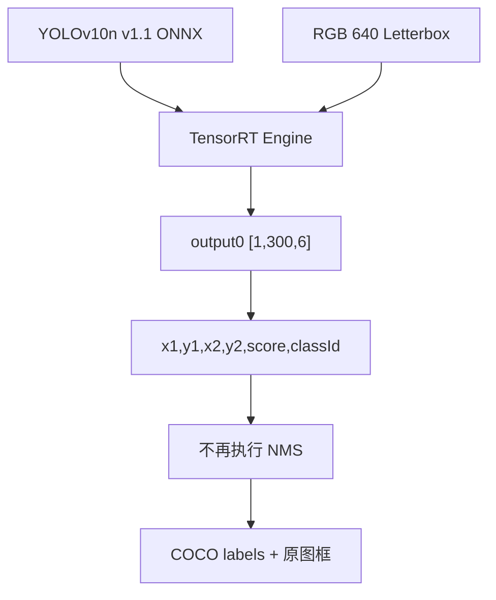

# 使用 TensorRT CSharp API v4.0 与 YoloVision 运行 YOLOv10n End-to-End 检测

<!-- public-article-layout:start -->
<style>
.content article { min-width: 0; overflow-wrap: anywhere; }
.content article a, .content article :not(pre) > code { overflow-wrap: anywhere; word-break: break-word; }
.content article pre:not(.mermaid), .content article table { display: block; max-width: 100%; overflow-x: auto; }
.content pre.mermaid { max-width: 640px; margin: 16px auto; overflow-x: auto; }
.content pre.mermaid svg { display: block; width: 100%; max-width: 640px; height: auto; }
</style>
<!-- public-article-layout:end -->

> 文章编号：`APP-YV-008`；适用版本：TensorRT CSharp API v4.0 `4.0.0`。

## 1. 前言
<!-- public-article-project-preface:start -->
TensorRT CSharp API v4.0 是一个面向 C#/.NET 开发者的 TensorRT 与 CUDA 工程化接口项目。它把 NVIDIA 原生运行时、生成式绑定、C++ Bridge、托管对象模型和可验证的示例程序组织成一条完整链路，使使用者可以在熟悉的 .NET 项目中完成 Engine 构建、反序列化、ExecutionContext 管理、CUDA 内存操作、异步流同步和结果校验。项目的目标不是隐藏 TensorRT 的概念，而是把这些概念转换为有明确生命周期、所有权和错误边界的 C# API。

4.0.0 是一次完整重构后的正式版本。核心接口、Bridge 边界、Runtime 包命名、样例目录和验证方式都以 4.x 设计为准，不能把 3.x 的类型名、旧包名或旧 DLL 目录直接复制到新项目。托管包只提供项目接口和自有 Bridge；TensorRT、CUDA、cuDNN、显卡驱动以及对应许可证仍由使用者按目标平台安装和管理。

单篇文章也应能够独立阅读：读者可以先从项目入口确认源码和包，再根据本文的程序路径准备依赖，最后用输出中的状态、计数、Shape、哈希或结果图片判断流程是否真的完成。对于尚未具备兼容 GPU 的环境，本文会把静态检查、期望输出和真实运行结果分开标记，不把帮助命令或 build-only 结果包装成推理成功。

项目、包和源码入口（以下地址保留明文，便于复制到不完整支持 Markdown 链接的平台）：

项目主页：

```text
https://github.com/guojin-yan/TensorRT-CSharp-API/tree/TensorRtSharp4.0
```

核心 NuGet：

```text
https://www.nuget.org/packages/JYPPX.TensorRT.CSharp.API/4.0.0
```

Runtime Bridge 包列表：

```text
https://www.nuget.org/packages?q=+JYPPX.TensorRT.CSharp&includeComputedFrameworks=true&prerel=true&sortby=relevance
```

运行库清单：

```text
https://github.com/guojin-yan/TensorRT-CSharp-API/blob/TensorRtSharp4.0/pack/runtime/runtime-packages.manifest.json
```

### 1.1 程序出处与输出说明

本文涉及的程序、脚本或命令均以仓库中的实现为准；对应源码入口：

```text
https://github.com/guojin-yan/TensorRT-CSharp-API/tree/TensorRtSharp4.0/applications
```

运行示例必须同时给出程序输出和判定标准。终端中的 `status`、`Ready`、`Bound`、`enqueueCount`、`OutputMatch`、进程退出码、报告文件或结果图片分别说明不同层次的事实；只有明确写出这些结果，读者才能区分程序启动、Engine 构建、GPU enqueue 和业务结果语义。
<!-- public-article-project-preface:end -->

TensorRT CSharp API v4.0：<https://github.com/guojin-yan/TensorRT-CSharp-API> 将 TensorRT 与 CUDA 的核心能力带到 .NET。`applications/YoloVision` 进一步把图像预处理、Engine 执行、模型输出合同、检测后处理和可视化串成一条应用流程。

YOLOv10n End-to-End 与 YOLOv8 raw head 的关键区别在输出合同：模型图内部已经完成候选筛选和 NMS，最终输出为 `[1,300,6]`，每行是 `x1,y1,x2,y2,score,classId`。应用端不能再次做 NMS，也不能把它误读成 `[1,84,8400]`。

本文使用 THU-MIG 官方 YOLOv10n v1.1 ONNX、CC0 巴士图片和 TensorRT 10.11 实机环境，展示 End-to-End decoder、结果绘制和证据边界。

### 1.2 项目、包与源码入口

| 项目 | 说明 | 链接 |
| --- | --- | --- |
| TensorRT CSharp API v4.0 | TensorRT/CUDA C# API | GitHub 项目：<https://github.com/guojin-yan/TensorRT-CSharp-API> |
| 稳定核心包 | 托管 TensorRT 接口 | `JYPPX.TensorRT.CSharp.API 4.0.0`：<https://www.nuget.org/packages/JYPPX.TensorRT.CSharp.API/4.0.0> |
| Runtime Bridge | 按 TensorRT/CUDA/cuDNN 组合选择 | NuGet 包列表：<https://www.nuget.org/profiles/JYPPX> |
| YoloVision | End-to-End 检测应用 | 应用源码：<https://github.com/guojin-yan/TensorRT-CSharp-API/tree/TensorRtSharp4.0/applications/YoloVision> |
| End-to-End 输出结构 | 六列输出解析 | `YoloEndToEndOutput.cs`：<https://github.com/guojin-yan/TensorRT-CSharp-API/blob/TensorRtSharp4.0/applications/YoloVision/YoloEndToEndOutput.cs> |
| 运行调度 | 模型、binding、解码和报告 | `YoloSampleRunner.cs`：<https://github.com/guojin-yan/TensorRT-CSharp-API/blob/TensorRtSharp4.0/applications/YoloVision/YoloSampleRunner.cs> |

YoloVision 当前是 source-only 应用；本文证据属于源码树 real-model-runtime，不是公共应用包发布证明。

## 2. End-to-End 输出合同



End-to-End 模型中的 NMS 已在图内执行，应用端只做：

1. 读取六列输出。
2. 过滤无效/低分行（如有配置）。
3. 依据 class ID 映射 COCO labels。
4. 撤销 letterbox 并绘制结果。

## 3. 模型来源与许可

| 项目 | 固定值 |
| --- | --- |
| 模型 URL | `https://github.com/THU-MIG/yolov10/releases/download/v1.1/yolov10n.onnx` |
| 上游 revision | `799ff3be47d21173bcf29b351820d4b8e955e0fe` |
| 文件大小 | 9,386,466 bytes |
| ONNX SHA256 | `7025ea1913f9a259cf8a8465ed608e10610d1bb376db2e0348b13e3bd286e0d3` |
| 许可证 | `AGPL-3.0-only` |
| labels | COCO 80 类，SHA256 `4d4aaea7bee6be2f675d9b53a9195ca36dfe6429f7479f29155da522a6c85930` |

官方已发布的 ONNX 不需要再次转换。若从 checkpoint 重导出，必须固定源码 revision、Python/PyTorch、opset、输入尺寸并重新检查输出 shape；重导出的 raw head 不能直接套本文合同。

仓库获取脚本：

```powershell
$RepoRoot = (Resolve-Path '.').Path
$WorkspaceRoot = Split-Path -Parent $RepoRoot
$ModelRoot = Join-Path $WorkspaceRoot 'models\YoloVision\Detection\yolov10n-thu-mig-v1.1'

pwsh -NoProfile -ExecutionPolicy Bypass `
  -File .\eng\Acquire-YoloV10OfficialAssets.ps1 `
  -OutputRoot (Join-Path $WorkspaceRoot 'downloads\yolov10-agpl')
```

实测输入为 Wikimedia Commons `Liverpool Street Bus station 2025`，CC0 1.0，1280x961 PPM SHA256 为 `80715af66669147b049fec9386152bd45505f4e494a65079fdc55404d4589b8e`。模型不进入 Git 或文章资产目录。

## 4. 环境与安装

实测矩阵为 Windows x64、RTX 3060 Laptop GPU、Driver 576.02、TensorRT 10.11.0.33、CUDA 12.9 和 .NET SDK 10.0.301。

```powershell
dotnet add package JYPPX.TensorRT.CSharp.API --version 4.0.0
dotnet add package JYPPX.TensorRT.CSharp.API.Runtime.win-x64.trt10.11.cuda12.9.cudnn9.22.Bridge --version 4.0.0
dotnet add package JYPPX.OpenCV.CSharp.API

dotnet build .\applications\YoloVision\YoloVision.csproj -c Release
```

Bridge 只提供项目原生桥接层；NVIDIA 运行库仍需用户安装。

## 5. 预处理和核心代码

输入合同为 `images:float32[1,3,640,640]`，使用 RGB、NCHW、center letterbox、`1/255`、fill 114。

```csharp
YoloModelProfile profile = YoloModelProfile.FromArgs(args, labels.Length);

YoloVisionResult result = YoloSampleRunner.DecodeOutput(
    output.Values,
    output.Shape.Values,
    profile);
```

模型端输出的 6 列必须按以下顺序读取：

```text
x1, y1, x2, y2, score, classId
```

`classId` 是浮点 tensor 中的整数值，映射 labels 前应检查范围 `[0,79]`。无效行不能被绘制成类别 0。

## 6. 运行命令

```powershell
$ArtifactRoot = Join-Path $WorkspaceRoot 'work\yolovision\yolov10n'
$Model = Join-Path $ModelRoot 'yolov10n.onnx'
$InputPpm = Join-Path $WorkspaceRoot 'downloads\article-assets\yolovision-detection-cc0-bus-station\liverpool-street-bus-station-1280.ppm'
$InputJpeg = Join-Path $WorkspaceRoot 'downloads\article-assets\yolovision-detection-cc0-bus-station\liverpool-street-bus-station-1280.jpg'
$env:JYPPX_TENSORRT_ROOT = $env:TENSORRT_PATH

dotnet run --project .\applications\YoloVision -c Release --no-build -- `
  --model $Model --labels (Join-Path $WorkspaceRoot 'downloads\yolox-apache\derived\coco.names') `
  --image $InputPpm --preprocessed-output (Join-Path $ArtifactRoot 'input.fp32.bin') `
  --input-shape 1x3x640x640 --tensor-rt-line 10 `
  --family v10 --task det --layout end2end --class-count 80 `
  --confidence 0.25 --top-k 100 --output-json (Join-Path $ArtifactRoot 'output.json') `
  --visualization (Join-Path $ArtifactRoot 'output.svg') `
  --visualization-background $InputJpeg
```

不要添加 `--nms-mode class-aware` 或重复运行普通 NMS；End-to-End 合同要求 `ApplyNms=false`、`NmsMode=None`。

## 7. 真实运行结果


| 检查项 | 实测值 |
| --- | --- |
| 输入 | `images:[1,3,640,640]` |
| 输出 | `output0:[1,300,6]` |
| 输出列 | `x1,y1,x2,y2,score,classId` |
| 结果数量 | 6 |
| 类别分布 | bus 1、person 5 |
| bus 最高置信度 | `0.950402` |
| TensorRT 推理耗时 | `9.451 ms` |
| 进程结果 | `YoloVision Passed=True`、exit 0 |
| 预处理 tensor | 1,228,800 elements，SHA256 `050935ebf471ec32ab4327d9f5643f0fe1a203289088895205e732e448a8d225` |

结果图和终端图来自同一次真实 TensorRT 执行。当前证据没有独立 raw tensor reference，因此不把本例写成跨框架逐值一致证明。

## 8. 常见问题

### 8.1 把输出当成 YOLOv8 raw head

先读取实际 shape。`[1,300,6]` 与 `[1,84,8400]` 的解码完全不同；不要按模型家族名称猜输出。

### 8.2 重复执行 NMS 后目标数量变少

YOLOv10n End-to-End 已在图内筛选候选，应用端不再执行 NMS。只做六列解析、有效行过滤和坐标反变换。

### 8.3 类别名称错误

核对 COCO 80 labels 顺序和 class ID 范围。`classId` 来自模型输出，不能把图片中的 bus 通过手工映射覆盖模型结果。

### 8.4 框整体偏移

检查 RGB letterbox 的 scale/padding 以及原图尺寸。模型坐标必须先撤销 letterbox，再绘制到 1280x961 原图。

## 9. 证据边界

记录 `yolovision-yolov10n-cc0-bus-win-x64-trt10.11-cuda12.9-20260804` 证明官方 YOLOv10n v1.1 ONNX 在源码树中完成真实 TensorRT enqueue、End-to-End 六列解码和结果绘制。

该记录不是 package-consumer runtime、公共 NuGet、post-publish、Owner acceptance 或模型再分发许可证明。模型和 NVIDIA 运行库继续由使用者按版本安装和获取。

## 10. 总结

YOLOv10n 的部署关键是尊重模型内置 NMS 的输出合同。只要先确认 `[1,300,6]` 和六列顺序，再关闭应用端 NMS，TensorRT CSharp API v4.0 就能把 End-to-End 输出稳定接入 YoloVision 的报告与可视化链路。

<!-- public-article-declaration:start -->
## 11. 文章声明

### 11.1 开源协议声明
作者所有开源项目代码均遵循 Apache License 2.0 开源协议。
特别说明：本项目集成了若干第三方库。若任何第三方库的许可协议与 Apache 2.0 协议存在冲突或不一致，均以该第三方库的原始许可协议为准。本项目不包含也不代表这些第三方库的授权声明，使用前请务必阅读并遵守第三方库的相关许可。

### 11.2 代码开发与质量说明
AI 辅助开发：本代码在开发过程中使用了人工智能（AI）辅助生成与优化，并非完全由人工逐行编写。
安全性承诺：作者郑重声明，本代码中绝无任何有意设置的后门、病毒、木马或旨在破坏用户设备、窃取数据的恶意代码。
技术局限性：受限于作者个人的技术水平与能力，代码中可能存在因逻辑不严谨、优化不足或经验欠缺导致的低级问题（例如但不限于内存泄漏、偶发崩溃、资源未释放等）。这些问题纯属能力不足所致，并非主观故意。
测试范围：由于作者精力有限，未对本软件进行全方位、覆盖所有边缘场景的完整测试。

### 11.3 免责声明（重要）
请在将本代码应用于任何实际项目（特别是商业、工业或关键任务环境）之前，务必进行详尽、严格的自行测试与验证。 鉴于上述可能存在的代码缺陷及测试覆盖不足，因使用本代码而导致的任何直接或间接损失（包括但不限于设备故障、数据丢失、系统瘫痪或利润损失等），本作者概不负责。 一旦您开始使用本代码，即表示您已知晓上述风险并同意自行承担一切后果，相关问题与本作者无关。

### 11.4 代码开源范围
本项目承诺核心逻辑代码完全开源，但上述提到的“第三方库”的二进制文件、源代码或相关资源不在本项目的开源义务范围内，请根据其各自的指引获取。

### 11.5 社区与反馈
尽管存在上述不足，我们仍欢迎大家下载使用、提交 Issue 或参与测试，共同完善项目。如果您在使用过程中发现 Bug、内存溢出或有改进建议，欢迎通过项目主页提供的联系方式与作者取得联系，我们将尽力在有限的时间内提供协助。


<!-- public-article-declaration:end -->
