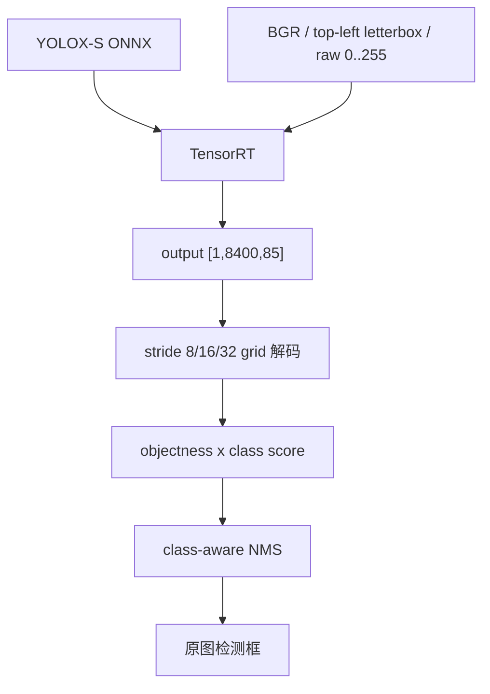

# 使用 TensorRT CSharp API v4.0 与 YoloVision 运行官方 YOLOX-S 目标检测

<!-- public-article-layout:start -->
<style>
.content article { min-width: 0; overflow-wrap: anywhere; }
.content article a, .content article :not(pre) > code { overflow-wrap: anywhere; word-break: break-word; }
.content article pre:not(.mermaid), .content article table { display: block; max-width: 100%; overflow-x: auto; }
.content pre.mermaid { max-width: 640px; margin: 16px auto; overflow-x: auto; }
.content pre.mermaid svg { display: block; width: 100%; max-width: 640px; height: auto; }
</style>
<!-- public-article-layout:end -->

> 文章编号：`APP-YV-009`；适用版本：TensorRT CSharp API v4.0 `4.0.0`。

## 1. 前言
<!-- public-article-project-preface:start -->
TensorRT CSharp API v4.0 是一个面向 C#/.NET 开发者的 TensorRT 与 CUDA 工程化接口项目。它把 NVIDIA 原生运行时、生成式绑定、C++ Bridge、托管对象模型和可验证的示例程序组织成一条完整链路，使使用者可以在熟悉的 .NET 项目中完成 Engine 构建、反序列化、ExecutionContext 管理、CUDA 内存操作、异步流同步和结果校验。项目的目标不是隐藏 TensorRT 的概念，而是把这些概念转换为有明确生命周期、所有权和错误边界的 C# API。

4.0.0 是一次完整重构后的正式版本。核心接口、Bridge 边界、Runtime 包命名、样例目录和验证方式都以 4.x 设计为准，不能把 3.x 的类型名、旧包名或旧 DLL 目录直接复制到新项目。托管包只提供项目接口和自有 Bridge；TensorRT、CUDA、cuDNN、显卡驱动以及对应许可证仍由使用者按目标平台安装和管理。

单篇文章也应能够独立阅读：读者可以先从项目入口确认源码和包，再根据本文的程序路径准备依赖，最后用输出中的状态、计数、Shape、哈希或结果图片判断流程是否真的完成。对于尚未具备兼容 GPU 的环境，本文会把静态检查、期望输出和真实运行结果分开标记，不把帮助命令或 build-only 结果包装成推理成功。

项目、包和源码入口（以下地址保留明文，便于复制到不完整支持 Markdown 链接的平台）：

项目主页：

```text
https://github.com/guojin-yan/TensorRT-CSharp-API/tree/TensorRtSharp4.0
```

核心 NuGet：

```text
https://www.nuget.org/packages/JYPPX.TensorRT.CSharp.API/4.0.0
```

Runtime Bridge 包列表：

```text
https://www.nuget.org/packages?q=+JYPPX.TensorRT.CSharp&includeComputedFrameworks=true&prerel=true&sortby=relevance
```

运行库清单：

```text
https://github.com/guojin-yan/TensorRT-CSharp-API/blob/TensorRtSharp4.0/pack/runtime/runtime-packages.manifest.json
```

### 1.1 程序出处与输出说明

本文涉及的程序、脚本或命令均以仓库中的实现为准；对应源码入口：

```text
https://github.com/guojin-yan/TensorRT-CSharp-API/tree/TensorRtSharp4.0/applications
```

运行示例必须同时给出程序输出和判定标准。终端中的 `status`、`Ready`、`Bound`、`enqueueCount`、`OutputMatch`、进程退出码、报告文件或结果图片分别说明不同层次的事实；只有明确写出这些结果，读者才能区分程序启动、Engine 构建、GPU enqueue 和业务结果语义。
<!-- public-article-project-preface:end -->

TensorRT CSharp API v4.0：<https://github.com/guojin-yan/TensorRT-CSharp-API> 提供 TensorRT/CUDA C# API，`applications/YoloVision` 将它用于完整视觉应用。YOLOX-S 虽然也是 YOLO 系列检测模型，但它的预处理和 raw head 与 YOLOv8 不同：BGR、左上角 letterbox、raw 0-255 float、objectness，以及 stride/grid 解码都必须使用 YOLOX 合同。

本文使用 Megvii 官方 YOLOX-S 0.1.1rc0 ONNX、COCO labels 和 CC0 巴士图片，完成 TensorRT 推理、`[1,8400,85]` 解码、class-aware NMS、原图坐标恢复和结果绘制。YoloVision 对 YOLOX 只开放 detection；classification、segmentation、OBB、Pose 和 semantic segmentation 会明确返回不支持，避免落入错误通用解码器。

### 1.2 项目、包与源码入口

| 项目 | 说明 | 链接 |
| --- | --- | --- |
| TensorRT CSharp API v4.0 | TensorRT/CUDA C# API | GitHub 项目：<https://github.com/guojin-yan/TensorRT-CSharp-API> |
| 稳定核心包 | 托管接口 | `JYPPX.TensorRT.CSharp.API 4.0.0`：<https://www.nuget.org/packages/JYPPX.TensorRT.CSharp.API/4.0.0> |
| Runtime Bridge | 对应本机 TensorRT/CUDA/cuDNN | NuGet 包列表：<https://www.nuget.org/profiles/JYPPX> |
| YoloVision | YOLOX 预处理、解码和可视化 | 应用源码：<https://github.com/guojin-yan/TensorRT-CSharp-API/tree/TensorRtSharp4.0/applications/YoloVision> |
| YOLOX 解码器 | stride/grid、objectness 和框恢复 | `YoloXOutputDecoder.cs`：<https://github.com/guojin-yan/TensorRT-CSharp-API/blob/TensorRtSharp4.0/applications/YoloVision/YoloXOutputDecoder.cs> |
| 能力矩阵 | YOLOX 仅 detection | `YoloCapabilityMatrix.cs`：<https://github.com/guojin-yan/TensorRT-CSharp-API/blob/TensorRtSharp4.0/applications/YoloVision/YoloCapabilityMatrix.cs> |
| 程序入口 | 参数和执行调度 | `Program.cs`：<https://github.com/guojin-yan/TensorRT-CSharp-API/blob/TensorRtSharp4.0/applications/YoloVision/Program.cs> |

YoloVision 当前是 source-only 应用。本文证明源码树中的真实模型执行，不代表公开应用包或 post-publish 验证。

## 2. YOLOX 输出合同



8400 个候选来自：

```text
80*80 + 40*40 + 20*20 = 8400
```

每行 85 个值：

```text
cx, cy, width, height, objectness, 80 class scores
```

网络输出的 box 仍需结合 grid 和 stride 解码：

```text
centerX = (rawX + gridX) * stride
centerY = (rawY + gridY) * stride
width   = exp(rawWidth) * stride
height  = exp(rawHeight) * stride
score   = objectness * bestClassScore
```

## 3. 模型来源与许可

| 项目 | 固定值 |
| --- | --- |
| 官方 ONNX | `https://github.com/Megvii-BaseDetection/YOLOX/releases/download/0.1.1rc0/yolox_s.onnx` |
| 上游 revision | `0.1.1rc0@e1052df71842031413f6030723c3607b839c80ce` |
| 文件大小 | 35,858,002 bytes |
| SHA256 | `c5c2d13e59ae883e6af3b45daea64af4833a4951c92d116ec270d9ddbe998063` |
| 许可证 | `Apache-2.0` |
| labels | COCO 80 类，SHA256 `4d4aaea7bee6be2f675d9b53a9195ca36dfe6429f7479f29155da522a6c85930` |

```powershell
$RepoRoot = (Resolve-Path '.').Path
$WorkspaceRoot = Split-Path -Parent $RepoRoot
$DownloadRoot = Join-Path $WorkspaceRoot 'downloads\yolox-apache'
$ModelRoot = Join-Path $WorkspaceRoot 'models\YoloVision\Detection\yolox-s-megvii-v0.1.1rc0'

pwsh -NoProfile -ExecutionPolicy Bypass `
  -File .\eng\Acquire-YoloXOfficialAssets.ps1 `
  -OutputRoot $DownloadRoot
```

本文直接使用官方 release ONNX。若从 checkpoint 重导出，应固定 YOLOX revision、PyTorch、ONNX、opset 和输入尺寸，并重新读取实际 tensor metadata。

结果图使用 Wikimedia Commons `Liverpool Street Bus station 2025`，许可证 CC0 1.0；1280x961 PPM SHA256 为 `80715af66669147b049fec9386152bd45505f4e494a65079fdc55404d4589b8e`。官方模型保持在仓库外工作区。

## 4. 环境与安装

实测矩阵为 Windows x64、RTX 3060 Laptop GPU、Driver 576.02、TensorRT 10.11.0.33、CUDA 12.9 和 .NET SDK 10.0.301。

```powershell
dotnet add package JYPPX.TensorRT.CSharp.API --version 4.0.0
dotnet add package JYPPX.TensorRT.CSharp.API.Runtime.win-x64.trt10.11.cuda12.9.cudnn9.22.Bridge --version 4.0.0
dotnet add package JYPPX.OpenCV.CSharp.API

dotnet build .\applications\YoloVision\YoloVision.csproj -c Release
```

Runtime Bridge 与 NVIDIA 安装版本必须对应，不能复制其他 TensorRT line 的 bridge 替代。

## 5. YOLOX 专用预处理

| 配置 | YOLOX-S 本文值 | YOLOv8 detection 常见值 |
| --- | --- | --- |
| 色彩顺序 | BGR | RGB |
| 像素 scale | 1.0，保留 0-255 | `1/255` |
| Letterbox 对齐 | top-left | center |
| Tensor layout | NCHW | NCHW |
| Fill | 114 | 114 |
| Objectness | 有 | 本文 YOLOv8n 无 |

任何一项套错都可能让程序正常运行但检测结果失真。

## 6. 核心调用与运行命令

YoloVision 从实际参数构造 profile，并把 TensorRT 输出交给 YOLOX 专用解码器：

```csharp
YoloModelProfile profile = YoloModelProfile.FromArgs(args, labels.Length);
YoloVisionResult result = YoloSampleRunner.DecodeOutput(
    output.Values,
    output.Shape.Values,
    profile);
```

运行命令：

```powershell
$ArtifactRoot = Join-Path $WorkspaceRoot 'work\yolovision\yolox-s'
$Model = Join-Path $ModelRoot 'yolox_s.onnx'
$InputPpm = Join-Path $WorkspaceRoot 'downloads\article-assets\yolovision-detection-cc0-bus-station\liverpool-street-bus-station-1280.ppm'
$InputJpeg = Join-Path $WorkspaceRoot 'downloads\article-assets\yolovision-detection-cc0-bus-station\liverpool-street-bus-station-1280.jpg'
$Labels = Join-Path $DownloadRoot 'derived\coco.names'
$env:JYPPX_TENSORRT_ROOT = $env:TENSORRT_PATH

dotnet run --project .\applications\YoloVision -c Release --no-build -- `
  --model $Model --labels $Labels --image $InputPpm `
  --preprocessed-output (Join-Path $ArtifactRoot 'input.fp32.bin') `
  --input-shape 1x3x640x640 --tensor-rt-line 10 `
  --family yolox --task det --layout boxes-first --has-objectness true `
  --nms-mode class-aware --confidence 0.3 --iou-threshold 0.45 --top-k 100 `
  --output-json (Join-Path $ArtifactRoot 'output.json') `
  --visualization (Join-Path $ArtifactRoot 'output.svg') `
  --visualization-background $InputJpeg
```

内置 YOLOX profile 会使用 BGR、top-left letterbox 和 raw 0-255。若显式覆盖 `--color-order`、`--scale` 或 alignment，应在证据中同步记录。

## 7. 真实运行结果


| 检查项 | 实测值 |
| --- | --- |
| 输入 | `images:[1,3,640,640]` |
| 输出 | `output:[1,8400,85]` |
| 预处理 tensor SHA256 | `d8480974ed95b20415348a8ab73f88718b87b9787c7624a889e955270b1abf74` |
| 结果数量 | 8 |
| bus | 1，最高分 `0.9566531` |
| person | 7，最高分 `0.852964` |
| 推理耗时 | `11.270784 ms` |
| 输出数值 SHA256 | `c5c3762b8cccf0bc57cddfc2b8aec48e0dd2e72ec428df744d28c967bd1bcf9d` |
| 输出 JSON SHA256 | `76fbcc4431e89940da185571af46fe23553aa8685fba9e040dd0080b8a6d7066` |
| 进程结果 | `YoloVision Passed=True`、exit 0 |

结果图和终端图来自同一次真实 TensorRT 执行。本文没有独立 raw tensor reference，因此不声称与另一框架逐元素一致。

## 8. 常见问题

### 8.1 有输出但几乎没有检测

检查是否错误使用 RGB、`1/255` 或 center letterbox。YOLOX-S 本文合同是 BGR、raw 0-255、top-left letterbox。

### 8.2 框尺寸异常

确认先执行 grid/stride 变换，并对宽高使用 `exp`。直接把 raw 的前四列当像素坐标会完全错误。

### 8.3 置信度偏高或偏低

最终 score 是 `objectness * classScore`。只使用其中一项不符合模型合同。

### 8.4 尝试运行 YOLOX segmentation/Pose

当前内置 YOLOX profile 只支持 detection。其他任务会明确失败，不能通过改 `--task` 强行进入通用 decoder。

## 9. 证据边界

记录 `yolovision-yolox-s-cc0-bus-win-x64-trt10.11-cuda12.9-20260804` 证明官方 YOLOX-S 在源码树完成真实 TensorRT enqueue、grid/stride 解码、objectness 计算、NMS 和结果绘制。

它不是 package-consumer runtime、公共 NuGet、post-publish、Owner acceptance 或模型再分发许可证明。Engine 哈希也与 GPU、TensorRT 和 Builder 配置相关，不能作为跨机器固定值。

## 10. 总结

YOLOX-S 的接入重点不是把 family 名改成 `yolox`，而是同时使用正确的 BGR/raw 预处理、top-left letterbox、objectness、grid/stride 解码和应用端 NMS。模型合同全部一致后，YoloVision 才能得到可信的检测结果。

<!-- public-article-declaration:start -->
## 11. 文章声明

### 11.1 开源协议声明
作者所有开源项目代码均遵循 Apache License 2.0 开源协议。
特别说明：本项目集成了若干第三方库。若任何第三方库的许可协议与 Apache 2.0 协议存在冲突或不一致，均以该第三方库的原始许可协议为准。本项目不包含也不代表这些第三方库的授权声明，使用前请务必阅读并遵守第三方库的相关许可。

### 11.2 代码开发与质量说明
AI 辅助开发：本代码在开发过程中使用了人工智能（AI）辅助生成与优化，并非完全由人工逐行编写。
安全性承诺：作者郑重声明，本代码中绝无任何有意设置的后门、病毒、木马或旨在破坏用户设备、窃取数据的恶意代码。
技术局限性：受限于作者个人的技术水平与能力，代码中可能存在因逻辑不严谨、优化不足或经验欠缺导致的低级问题（例如但不限于内存泄漏、偶发崩溃、资源未释放等）。这些问题纯属能力不足所致，并非主观故意。
测试范围：由于作者精力有限，未对本软件进行全方位、覆盖所有边缘场景的完整测试。

### 11.3 免责声明（重要）
请在将本代码应用于任何实际项目（特别是商业、工业或关键任务环境）之前，务必进行详尽、严格的自行测试与验证。 鉴于上述可能存在的代码缺陷及测试覆盖不足，因使用本代码而导致的任何直接或间接损失（包括但不限于设备故障、数据丢失、系统瘫痪或利润损失等），本作者概不负责。 一旦您开始使用本代码，即表示您已知晓上述风险并同意自行承担一切后果，相关问题与本作者无关。

### 11.4 代码开源范围
本项目承诺核心逻辑代码完全开源，但上述提到的“第三方库”的二进制文件、源代码或相关资源不在本项目的开源义务范围内，请根据其各自的指引获取。

### 11.5 社区与反馈
尽管存在上述不足，我们仍欢迎大家下载使用、提交 Issue 或参与测试，共同完善项目。如果您在使用过程中发现 Bug、内存溢出或有改进建议，欢迎通过项目主页提供的联系方式与作者取得联系，我们将尽力在有限的时间内提供协助。


<!-- public-article-declaration:end -->
