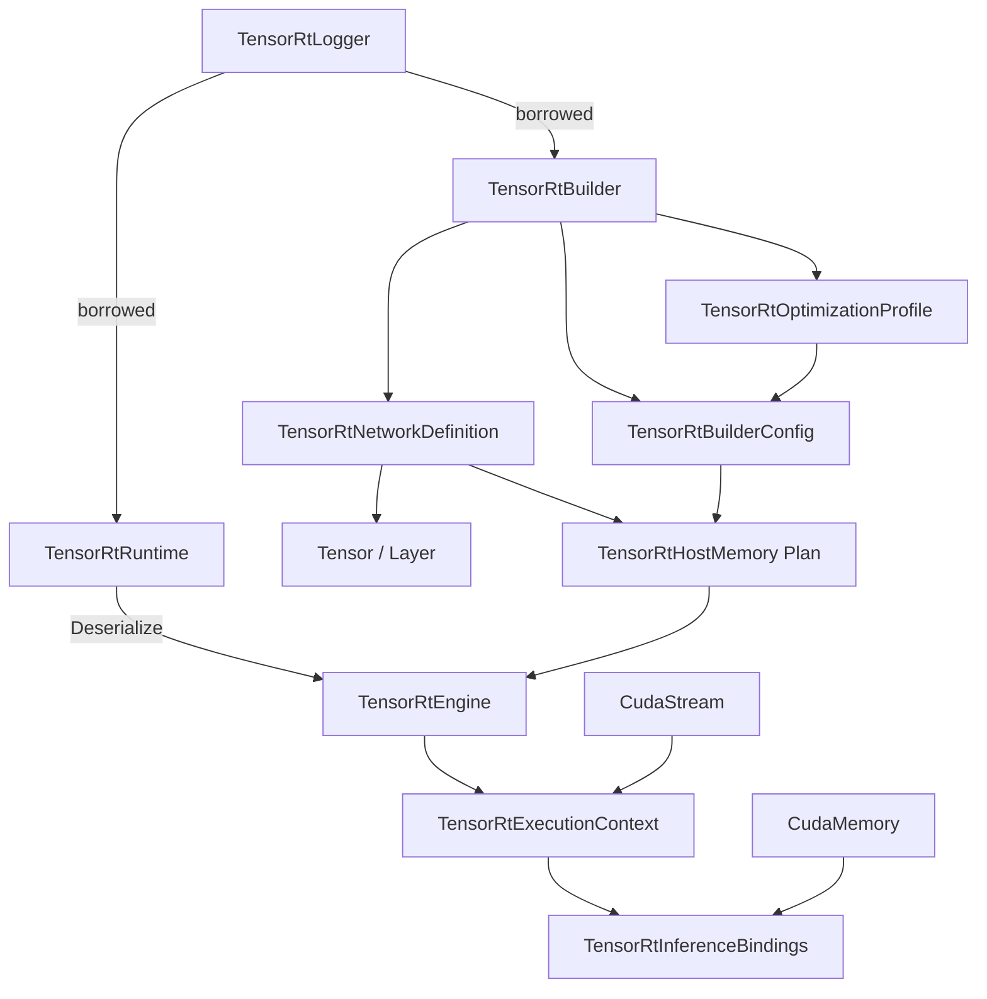
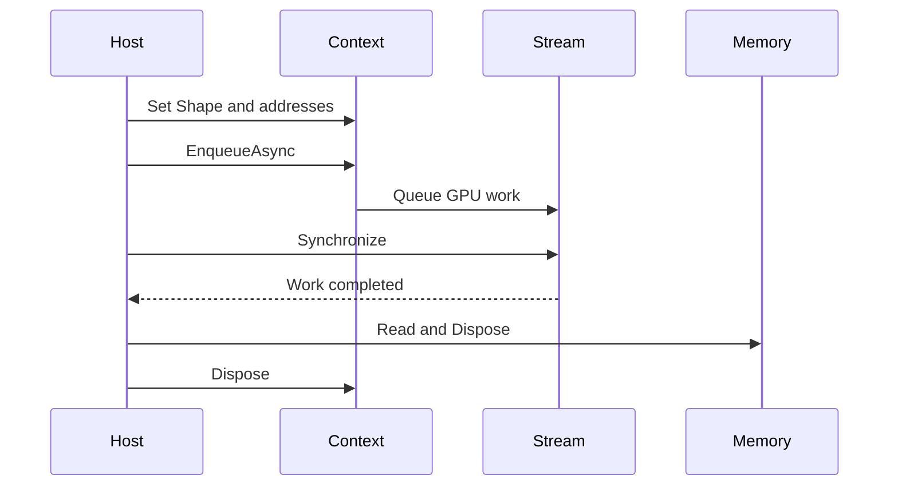

# TensorRT 对象模型：Builder、Network、Engine、Runtime 与 Context

<!-- public-article-layout:start -->
<style>
.content article { min-width: 0; overflow-wrap: anywhere; }
.content article a, .content article :not(pre) > code { overflow-wrap: anywhere; word-break: break-word; }
.content article pre:not(.mermaid), .content article table { display: block; max-width: 100%; overflow-x: auto; }
.content pre.mermaid { max-width: 640px; margin: 16px auto; overflow-x: auto; }
.content pre.mermaid svg { display: block; width: 100%; max-width: 640px; height: auto; }
</style>
<!-- public-article-layout:end -->

> 文章编号：`MSC-007`；适用版本：TensorRT CSharp API v4.0 `4.0.0`；当前状态：`ready`。

## 1. 前言
<!-- public-article-project-preface:start -->
TensorRT CSharp API v4.0 是一个面向 C#/.NET 开发者的 TensorRT 与 CUDA 工程化接口项目。它把 NVIDIA 原生运行时、生成式绑定、C++ Bridge、托管对象模型和可验证的示例程序组织成一条完整链路，使使用者可以在熟悉的 .NET 项目中完成 Engine 构建、反序列化、ExecutionContext 管理、CUDA 内存操作、异步流同步和结果校验。项目的目标不是隐藏 TensorRT 的概念，而是把这些概念转换为有明确生命周期、所有权和错误边界的 C# API。

4.0.0 是一次完整重构后的正式版本。核心接口、Bridge 边界、Runtime 包命名、样例目录和验证方式都以 4.x 设计为准，不能把 3.x 的类型名、旧包名或旧 DLL 目录直接复制到新项目。托管包只提供项目接口和自有 Bridge；TensorRT、CUDA、cuDNN、显卡驱动以及对应许可证仍由使用者按目标平台安装和管理。

单篇文章也应能够独立阅读：读者可以先从项目入口确认源码和包，再根据本文的程序路径准备依赖，最后用输出中的状态、计数、Shape、哈希或结果图片判断流程是否真的完成。对于尚未具备兼容 GPU 的环境，本文会把静态检查、期望输出和真实运行结果分开标记，不把帮助命令或 build-only 结果包装成推理成功。

项目、包和源码入口（以下地址保留明文，便于复制到不完整支持 Markdown 链接的平台）：

项目主页：

```text
https://github.com/guojin-yan/TensorRT-CSharp-API/tree/TensorRtSharp4.0
```

核心 NuGet：

```text
https://www.nuget.org/packages/JYPPX.TensorRT.CSharp.API/4.0.0
```

Runtime Bridge 包列表：

```text
https://www.nuget.org/packages?q=+JYPPX.TensorRT.CSharp&includeComputedFrameworks=true&prerel=true&sortby=relevance
```

运行库清单：

```text
https://github.com/guojin-yan/TensorRT-CSharp-API/blob/TensorRtSharp4.0/pack/runtime/runtime-packages.manifest.json
```

### 1.1 程序出处与输出说明

本文涉及的程序、脚本或命令均以仓库中的实现为准；对应源码入口：

```text
https://github.com/guojin-yan/TensorRT-CSharp-API/tree/TensorRtSharp4.0
```

运行示例必须同时给出程序输出和判定标准。终端中的 `status`、`Ready`、`Bound`、`enqueueCount`、`OutputMatch`、进程退出码、报告文件或结果图片分别说明不同层次的事实；只有明确写出这些结果，读者才能区分程序启动、Engine 构建、GPU enqueue 和业务结果语义。
<!-- public-article-project-preface:end -->

第一次接触 TensorRT 时，很容易把它理解成“加载模型、传入数组、返回数组”。实际上，构建阶段与运行阶段使用的是两组不同对象，动态 Shape、显存绑定和异步 CUDA stream 又各自带有生命周期要求。对象关系不清楚，是 C# 原生互操作中最常见的过早释放、line mismatch 和地址未绑定问题来源。

TensorRT CSharp API v4.0：<https://github.com/guojin-yan/TensorRT-CSharp-API> 用高层 C# wrapper 表达 TensorRT/CUDA 对象图，让使用者操作 `TensorRtBuilder`、`TensorRtEngine`、`CudaMemory` 等有语义的对象，而不是在业务代码中传递 `IntPtr`。本文从构建到 enqueue 解释完整模型。

### 1.2 项目、包与代码入口

| 项目 | 链接 |
| --- | --- |
| GitHub 项目 | TensorRT-CSharp-API：<https://github.com/guojin-yan/TensorRT-CSharp-API> |
| 核心包 | `JYPPX.TensorRT.CSharp.API 4.0.0`：<https://www.nuget.org/packages/JYPPX.TensorRT.CSharp.API/4.0.0> |
| Bridge 包列表 | JYPPX NuGet 包列表：<https://www.nuget.org/profiles/JYPPX> |
| Builder 源码 | `TensorRtBuilder.cs`：<https://github.com/guojin-yan/TensorRT-CSharp-API/blob/TensorRtSharp4.0/src/JYPPX.TensorRtSharp/Builder/TensorRtBuilder.cs> |
| Runtime 源码 | `TensorRtRuntime.cs`：<https://github.com/guojin-yan/TensorRT-CSharp-API/blob/TensorRtSharp4.0/src/JYPPX.TensorRtSharp/Runtime/TensorRtRuntime.cs> |
| Engine 源码 | `TensorRtEngine.cs`：<https://github.com/guojin-yan/TensorRT-CSharp-API/blob/TensorRtSharp4.0/src/JYPPX.TensorRtSharp/Engine/TensorRtEngine.cs> |
| Bindings 样例 | 完整源码：<https://github.com/guojin-yan/TensorRT-CSharp-API/tree/TensorRtSharp4.0/samples/Inference/01.Bindings> |

## 2. 对象总览



Logger 被 Builder/Runtime 借用；Builder 创建的 Network、Config、Profile 和 HostMemory 通常由调用方持有并释放；Engine 创建 Context；Context 保存每次执行的可变状态。

## 3. 两条主线

### 3.1 Build Phase

```text
Logger -> Builder -> Network + Config + Profile -> Serialized Plan
```

构建阶段决定网络拓扑、动态 Shape 范围、Workspace、精度、tactic 与兼容策略。ONNX Parser 也是把外部图填入 Network，再由 Builder 产生 plan。

### 3.2 Runtime Phase

```text
Logger -> Runtime -> Deserialize Plan -> Engine -> Context -> Enqueue
```

运行阶段读取 Engine I/O，设置实际 Shape，分配 device buffers，绑定 tensor address，并在 CUDA stream 上执行。只部署已有 plan 的应用不必保留 Builder/Network，但仍需要匹配的 TensorRT runtime 和插件。

## 4. Logger：借用关系的起点

```csharp
using var logger = new TensorRtLogger(TensorRtApiLine.TensorRt10);
using var builder = new TensorRtBuilder(logger);
using var runtime = new TensorRtRuntime(logger);
```

Builder 和 Runtime 会在 native 层使用 logger 回调，所以 logger 必须比它们活得更久。wrapper 保存 keep-alive 并维护 borrower 状态，但代码仍应按 parent 先声明、child 后声明的顺序组织，让 `using` 在退出时逆序释放。

## 5. Builder：构建期工厂

`TensorRtBuilder` 主要创建：

- `TensorRtNetworkDefinition`；
- `TensorRtBuilderConfig`；
- `TensorRtOptimizationProfile`；
- `TensorRtHostMemory`，由 `BuildSerializedNetwork` 返回。

```csharp
using var network = builder.CreateNetwork(stronglyTyped: false);
using var config = builder.CreateBuilderConfig();
using var profile = builder.CreateOptimizationProfile();
```

`CreateNetwork(bool stronglyTyped)` 会按 TensorRT 8/10/11 的实际规则映射。直接复制某个版本的 raw flag 容易在另一条 API line 上得到不同语义。

## 6. Network：Tensor 与 Layer 的 Owner Scope

最小动态 Shape identity network：

```csharp
using var input = network.AddInput(
    "input",
    TensorRtDataType.Float,
    new TensorRtDims(new[] { -1, 4 }));

using var identity = network.AddIdentity(input);
using var output = identity.GetOutput(0);
output.Name = "output";
network.MarkOutput(output);
```

Tensor 和 Layer wrapper 仍属于 Network 的 vendor object graph。不要保存内部 handle 后提前释放 Network。复杂网络建议用局部作用域管理 layer/tensor wrapper，或通过 ONNX Parser 填充 Network。

## 7. BuilderConfig：描述策略，不是执行结果

```csharp
config.SetMemoryPoolLimit(
    TensorRtMemoryPoolType.Workspace,
    64UL * 1024UL * 1024UL);
config.SetOptimizationLevel(3);
config.SetMaxAuxStreams(0);
```

Config 可以设置 memory pool、optimization level、profiling verbosity、precision、DLA、tactic、timing cache 和 profiles。Setter 返回成功说明参数被接受，不代表最终 Engine 一定选择了期望 tactic 或达到了期望性能。需要结合 readback、Engine Inspector 和运行数据判断。

## 8. OptimizationProfile：动态维度的合法区间

Network 中的 `-1` 必须由 Profile 给出 min/opt/max：

```csharp
profile.SetShape(
    "input",
    new TensorRtDims(new[] { 1, 4 }),
    new TensorRtDims(new[] { 2, 4 }),
    new TensorRtDims(new[] { 4, 4 }));

int profileIndex = config.AddOptimizationProfile(profile);
```

运行时 batch 允许在 `[1,4]` 内变化；`opt=2` 是 Builder 的优化参考，不是唯一合法 Shape。Profile 与 Builder/Config 必须属于同一 API line。

## 9. HostMemory：序列化 Plan 的 Owner

```csharp
using var plan = builder.BuildSerializedNetwork(network, config);
```

`TensorRtHostMemory` 持有序列化 bytes。它不是 Engine，不能 enqueue。可以复制到文件，也可以直接交给同 line 的 Runtime 反序列化。

持久化 plan 时应同时保存 TensorRT version、runtime key、网络或 ONNX SHA256、Builder 配置和 plan SHA256。单独一个 `.plan` 文件无法说明它适用于哪台机器。

## 10. Runtime：反序列化入口

`TensorRtRuntime` 支持从 `TensorRtHostMemory`、`byte[]`、`ReadOnlySpan<byte>`、`Stream` 和文件反序列化：

```csharp
using var engine = runtime.Deserialize(plan);
// 或 runtime.DeserializeFromFile(planPath)
```

Runtime 与 plan 必须属于兼容的 TensorRT line。反序列化成功仅说明当前 runtime 接受该 plan，不说明输入 Shape、插件、GPU 架构和业务输出已经验证。

## 11. Engine：不可变执行计划与元数据

Engine 可提供：

- I/O tensor 数量、名称、dtype、Shape、mode 与 format；
- optimization profile 数量；
- device memory 大小；
- capability、tactic sources、profiling verbosity；
- `CreateExecutionContext()` 与 `CreateInspector()`。

```csharp
using var context = engine.CreateExecutionContext();
TensorRtEngineBindingReport report = engine.GetBindingReport(profileIndex);
```

Engine 是 Context 的来源。Context 使用期间应保持 Engine 存活。一个 Engine 可以创建多个 Context，并发推理时每个 worker 应使用独立 Context 和 CUDA stream。

## 12. ExecutionContext：一次执行的可变状态

Context 保存 active profile、实际 Shape、tensor address、aux streams、profiler/debug controls 和 enqueue 状态。

```csharp
context.SetInputShape("input", new TensorRtDims(new[] { batch, 4 }));
context.SetInputTensorAddress("input", inputMemory);
context.SetOutputTensorAddress("output", outputMemory);

TensorRtExecutionContextReadiness readiness =
    context.GetReadiness(engine, runShapeInference: true);

if (!readiness.IsReadyForEnqueue)
{
    throw new InvalidOperationException(readiness.ToString());
}

context.EnqueueAsync(stream);
stream.Synchronize();
```

不要让多个线程无同步地修改同一个 Context 的 profile、Shape 或地址。`Readiness=true` 只说明调用前条件齐全，GPU 工作仍需真正 enqueue、同步并校验输出。

## 13. InferenceBindings：推荐的高层绑定对象

手工为每个 tensor 计算字节数、分配显存和绑定地址容易遗漏。`TensorRtInferenceBindings` 把 Engine、Context、Profile 和 Buffer 组织在一起：

```csharp
using var bindings = new TensorRtInferenceBindings(engine, context, profileIndex);
var runtimeShape = new TensorRtDims(new[] { batch, 4 });

bindings.SetInputShape("input", runtimeShape)
        .CopyInputFromHost("input", inputValues, runtimeShape);
bindings.AllocateDeviceBuffer("output", runtimeShape);
bindings.BindAll();

TensorRtInferenceExecutionSummary summary =
    bindings.EnqueueAsync(stream, synchronize: true);
float[] outputValues =
    bindings.ReadOutputSingles("output", inputValues.Length);
```

这条路径仍要求调用者理解模型 tensor 名、dtype、layout 和业务输出，但减少了裸 device pointer 的生命周期负担。

## 14. 推荐释放顺序

创建顺序建议为：

```text
logger
builder / runtime
network / config / profile
plan
engine
context
bindings / cuda memory / stream
```

释放时逆序进行。异步 enqueue 后，必须先等待 stream/event 完成，再释放输入输出 memory、bindings、Context 或 Engine。



## 15. 同一 API Line 约束

以下组合会检查 `TensorRtApiLine`：

- Builder + Network + Config + Profile；
- Runtime + HostMemory；
- Engine + Context；
- owner-scoped snapshot + owner。

Line mismatch 不是通过类型转换可以修复的问题。应选择正确 Bridge，重新创建整条对象链，并使用相应环境构建的 plan。

## 16. 每一步能证明什么

| 操作 | 可以证明 | 不能证明 |
| --- | --- | --- |
| 创建 Network/Config | Builder 对象可用 | Plan 构建成功 |
| `BuildSerializedNetwork` | 当前配置产生 plan | Plan 可反序列化执行 |
| `Deserialize` | Runtime 接受 plan | Shape/address 齐全 |
| Readiness true | enqueue 前置条件满足 | GPU 已执行 |
| Enqueue + synchronize | 指定 GPU 路径完成 | 输出业务语义正确 |
| Output equality/reference | 此输入结果匹配 | 其它模型、机器或包也匹配 |

## 17. 运行完整样例

```powershell
dotnet run --project .\samples\Inference\01.Bindings\InferenceBindings.csproj `
  -c Release -- --tensor-rt-line 10 --batch 2
```

关注输出中的 TensorRT line、profile min/opt/max、I/O metadata、readiness、enqueue 和 `OutputMatch=True`。该样例在代码中创建 identity network，不依赖外部 ONNX，适合作为对象模型与环境的第一条 smoke。

## 18. 常见问题

### 18.1 Builder 释放后 Engine 还能用吗

可以。通过序列化 plan 与 Runtime 创建的 Engine 有独立 owner；但构建调用期间 Network、Config 和 Profile 必须存活。

### 18.2 Engine 释放后 Context 还能用吗

不应这样做。执行期间保持 Engine 存活是清晰的 owner scope。

### 18.3 为什么绑定 `CudaMemory` 而不是 `IntPtr`

`CudaMemory` 表达分配大小、owner、disposed state 和复制动作。内部可以取 native handle，业务代码无需承担裸 device pointer 的全部风险。

### 18.4 Readiness 通过为什么输出仍可能错

Readiness 不理解归一化、RGB/BGR、NCHW/NHWC、labels 或 NMS。它只能检查 Context 的 Shape/address/profile 等执行条件。

### 18.5 TRT8/10/11 能共用同一个 Plan 吗

不能这样假设。Plan 受 TensorRT、GPU 与 compatibility policy 约束，应按 runtime key 单独构建和验证。

## 19. 总结

TensorRT 对象模型可以归纳为两条链：Builder/Network/Config/Profile 负责生成 plan，Runtime/Engine/Context/CUDA resources 负责执行 plan。TensorRT CSharp API v4.0 的高层 wrapper 让所有权、API line 和释放顺序变得可读，但不能替代对动态 Shape、异步同步、输入预处理和输出语义的理解。掌握这张对象图后，ONNX、Refit、多流和 YoloVision 都只是沿同一生命周期增加更具体的步骤。

<!-- public-article-declaration:start -->
## 20. 文章声明

### 20.1 开源协议声明
作者所有开源项目代码均遵循 Apache License 2.0 开源协议。
特别说明：本项目集成了若干第三方库。若任何第三方库的许可协议与 Apache 2.0 协议存在冲突或不一致，均以该第三方库的原始许可协议为准。本项目不包含也不代表这些第三方库的授权声明，使用前请务必阅读并遵守第三方库的相关许可。

### 20.2 代码开发与质量说明
AI 辅助开发：本代码在开发过程中使用了人工智能（AI）辅助生成与优化，并非完全由人工逐行编写。
安全性承诺：作者郑重声明，本代码中绝无任何有意设置的后门、病毒、木马或旨在破坏用户设备、窃取数据的恶意代码。
技术局限性：受限于作者个人的技术水平与能力，代码中可能存在因逻辑不严谨、优化不足或经验欠缺导致的低级问题（例如但不限于内存泄漏、偶发崩溃、资源未释放等）。这些问题纯属能力不足所致，并非主观故意。
测试范围：由于作者精力有限，未对本软件进行全方位、覆盖所有边缘场景的完整测试。

### 20.3 免责声明（重要）
请在将本代码应用于任何实际项目（特别是商业、工业或关键任务环境）之前，务必进行详尽、严格的自行测试与验证。 鉴于上述可能存在的代码缺陷及测试覆盖不足，因使用本代码而导致的任何直接或间接损失（包括但不限于设备故障、数据丢失、系统瘫痪或利润损失等），本作者概不负责。 一旦您开始使用本代码，即表示您已知晓上述风险并同意自行承担一切后果，相关问题与本作者无关。

### 20.4 代码开源范围
本项目承诺核心逻辑代码完全开源，但上述提到的“第三方库”的二进制文件、源代码或相关资源不在本项目的开源义务范围内，请根据其各自的指引获取。

### 20.5 社区与反馈
尽管存在上述不足，我们仍欢迎大家下载使用、提交 Issue 或参与测试，共同完善项目。如果您在使用过程中发现 Bug、内存溢出或有改进建议，欢迎通过项目主页提供的联系方式与作者取得联系，我们将尽力在有限的时间内提供协助。


<!-- public-article-declaration:end -->
