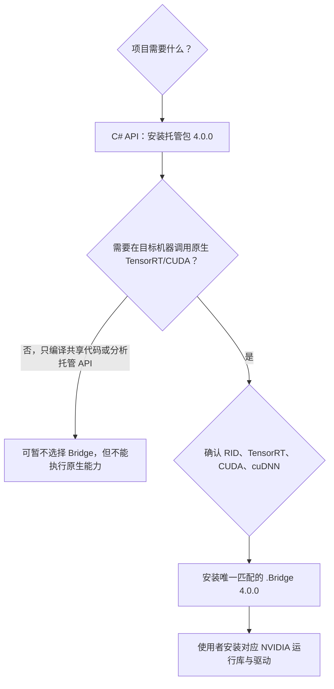

# TensorRT CSharp API v4.0 托管包与 Bridge 包如何选择

<!-- public-article-layout:start -->
<style>
.content article { min-width: 0; overflow-wrap: anywhere; }
.content article a, .content article :not(pre) > code { overflow-wrap: anywhere; word-break: break-word; }
.content article pre:not(.mermaid), .content article table { display: block; max-width: 100%; overflow-x: auto; }
.content pre.mermaid { max-width: 640px; margin: 16px auto; overflow-x: auto; }
.content pre.mermaid svg { display: block; width: 100%; max-width: 640px; height: auto; }
</style>
<!-- public-article-layout:end -->

> 文章 ID：`MSC-004`<br>
> 对应版本：`4.0.0`<br>
> 内容状态：`ready`，尚未发布到 CSDN

## 1. 前言
<!-- public-article-project-preface:start -->
TensorRT CSharp API v4.0 是一个面向 C#/.NET 开发者的 TensorRT 与 CUDA 工程化接口项目。它把 NVIDIA 原生运行时、生成式绑定、C++ Bridge、托管对象模型和可验证的示例程序组织成一条完整链路，使使用者可以在熟悉的 .NET 项目中完成 Engine 构建、反序列化、ExecutionContext 管理、CUDA 内存操作、异步流同步和结果校验。项目的目标不是隐藏 TensorRT 的概念，而是把这些概念转换为有明确生命周期、所有权和错误边界的 C# API。

4.0.0 是一次完整重构后的正式版本。核心接口、Bridge 边界、Runtime 包命名、样例目录和验证方式都以 4.x 设计为准，不能把 3.x 的类型名、旧包名或旧 DLL 目录直接复制到新项目。托管包只提供项目接口和自有 Bridge；TensorRT、CUDA、cuDNN、显卡驱动以及对应许可证仍由使用者按目标平台安装和管理。

单篇文章也应能够独立阅读：读者可以先从项目入口确认源码和包，再根据本文的程序路径准备依赖，最后用输出中的状态、计数、Shape、哈希或结果图片判断流程是否真的完成。对于尚未具备兼容 GPU 的环境，本文会把静态检查、期望输出和真实运行结果分开标记，不把帮助命令或 build-only 结果包装成推理成功。

项目、包和源码入口（以下地址保留明文，便于复制到不完整支持 Markdown 链接的平台）：

项目主页：

```text
https://github.com/guojin-yan/TensorRT-CSharp-API/tree/TensorRtSharp4.0
```

核心 NuGet：

```text
https://www.nuget.org/packages/JYPPX.TensorRT.CSharp.API/4.0.0
```

Runtime Bridge 包列表：

```text
https://www.nuget.org/packages?q=+JYPPX.TensorRT.CSharp&includeComputedFrameworks=true&prerel=true&sortby=relevance
```

运行库清单：

```text
https://github.com/guojin-yan/TensorRT-CSharp-API/blob/TensorRtSharp4.0/pack/runtime/runtime-packages.manifest.json
```

### 1.1 程序出处与输出说明

本文涉及的程序、脚本或命令均以仓库中的实现为准；对应源码入口：

```text
https://github.com/guojin-yan/TensorRT-CSharp-API/tree/TensorRtSharp4.0
```

运行示例必须同时给出程序输出和判定标准。终端中的 `status`、`Ready`、`Bound`、`enqueueCount`、`OutputMatch`、进程退出码、报告文件或结果图片分别说明不同层次的事实；只有明确写出这些结果，读者才能区分程序启动、Engine 构建、GPU enqueue 和业务结果语义。
<!-- public-article-project-preface:end -->

### 1.2 项目简介

TensorRT CSharp API v4.0 4.0.0 采用“一个托管接口包 + 一个目标 ABI Bridge 包”的分发方式。托管包提供 `JYPPX.TensorRtSharp` 和 `JYPPX.CudaSharp`，Bridge 只负责项目自己的 C ABI 适配；TensorRT、CUDA、cuDNN、NVRTC 和驱动仍由部署机器提供。

### 1.3 项目链接与包列表

| 项目内容 | 入口 |
| --- | --- |
| 项目源码 | TensorRT-CSharp-API 4.0 分支：<https://github.com/guojin-yan/TensorRT-CSharp-API/tree/TensorRtSharp4.0> |
| 包选择对应源码 | PublicSamplePackages.props：<https://github.com/guojin-yan/TensorRT-CSharp-API/blob/TensorRtSharp4.0/build/JYPPX.PublicSamplePackages.props> |
| 核心 NuGet | JYPPX.TensorRT.CSharp.API 4.0.0：<https://www.nuget.org/packages/JYPPX.TensorRT.CSharp.API/4.0.0> |
| 全部 Runtime Bridge | NuGet 包列表：<https://www.nuget.org/packages?q=+JYPPX.TensorRT.CSharp&includeComputedFrameworks=true&prerel=true&sortby=relevance> |
| 正式发布资产 | GitHub Release v4.0.0：<https://github.com/guojin-yan/TensorRT-CSharp-API/releases/tag/v4.0.0> |

### 1.4 本文结构

先给出最小安装组合，再解释包名、Windows/Linux 版本矩阵、跨平台部署和典型错误，最后提供安装后的复查清单。普通项目优先使用正式 `4.0.0`，不混用预览包、本地包和多个 Bridge。

TensorRT CSharp API v4.0 4.0.0 一共公开 19 个 NuGet 包。数量看起来不少，但实际选择规则很简单：所有项目使用同一个托管 API 包；需要真实调用 TensorRT/CUDA 时，再选择一个与目标环境完全匹配的 Bridge 包。

本文解释为什么要拆包、如何从包名读出版本矩阵、Windows 和 Linux 的 18 个 Bridge 如何选择，以及选错时会出现什么现象。

## 2. 结论先行

一个典型运行项目需要两条直接引用：

```text
1 x JYPPX.TensorRT.CSharp.API 4.0.0
1 x 与目标环境匹配的 JYPPX.TensorRT.CSharp.API.Runtime.*.Bridge 4.0.0
```

例如 Windows x64、TensorRT 10.11、CUDA 12.9、cuDNN 9.22：

```powershell
dotnet add package JYPPX.TensorRT.CSharp.API --version 4.0.0
dotnet add package JYPPX.TensorRT.CSharp.API.Runtime.win-x64.trt10.11.cuda12.9.cudnn9.22.Bridge --version 4.0.0
```

不要把 `4.0.0-*` 写进正式项目，也不要同时添加多个 Bridge。正式版本已经公开，精确版本能让恢复结果保持稳定。

## 3. 三类内容分别由谁提供



| 内容 | 由哪个包或安装项提供 | 说明 |
| --- | --- | --- |
| `JYPPX.TensorRtSharp`、`JYPPX.CudaSharp` 托管 API | `JYPPX.TensorRT.CSharp.API` | 所有组合共用 |
| `jyppxtrtbridge.dll` 或 `libjyppxtrtbridge.so` | 一个 `*.Bridge` | 项目自有 ABI Bridge，按组合构建 |
| TensorRT、CUDA、cuDNN、NVRTC | 使用者从 NVIDIA 安装 | 绝不包含在 TensorRtSharp NuGet 中 |
| NVIDIA Driver | 目标机器管理员安装 | NuGet 不能安装或升级驱动 |
| Samples、YoloVision、OnnxToEngine、TensorRtExec | GitHub 源码 | 不属于 19 个 NuGet 包 |
| ONNX、Engine、标签、图片 | 使用者或文章规定的上游来源 | 不进入核心包与 Bridge |

这种拆分避免重复分发体积很大的厂商运行库，也让项目明确遵守上游许可和目标机器的部署策略。

## 4. 包名逐段解释

Windows Bridge 格式：

```text
JYPPX.TensorRT.CSharp.API.Runtime.win-x64.trt10.11.cuda12.9.cudnn9.22.Bridge
```

| 片段 | 含义 |
| --- | --- |
| `Runtime` | 运行时原生 Bridge 包族，不是托管 API 主包 |
| `win-x64` | Windows x64 RID |
| `trt10.11` | 按 TensorRT 10.11 构建 |
| `cuda12.9` | 目标 CUDA 12.9 |
| `cudnn9.22` | 目标 cuDNN 9.22 |
| `Bridge` | 只含项目自有 Bridge，不含 NVIDIA 厂商运行库 |

Linux 还会把发行版写进包名：

```text
JYPPX.TensorRT.CSharp.API.Runtime.linux-x64.ubuntu22.04.trt11.0.cuda13.2.cudnn9.22.Bridge
```

选择 Linux 包时不能只看 `linux-x64`；Ubuntu 版本也是兼容条件的一部分。

## 5. Windows x64 的 6 个 Bridge

| TensorRT | CUDA | cuDNN | 精确包 ID |
| ---: | ---: | ---: | --- |
| 8.6 | 11.8 | 8.9 | `JYPPX.TensorRT.CSharp.API.Runtime.win-x64.trt8.6.cuda11.8.cudnn8.9.Bridge` |
| 8.6 | 12.1 | 8.9 | `JYPPX.TensorRT.CSharp.API.Runtime.win-x64.trt8.6.cuda12.1.cudnn8.9.Bridge` |
| 10.11 | 11.8 | 8.9 | `JYPPX.TensorRT.CSharp.API.Runtime.win-x64.trt10.11.cuda11.8.cudnn8.9.Bridge` |
| 10.11 | 12.9 | 9.22 | `JYPPX.TensorRT.CSharp.API.Runtime.win-x64.trt10.11.cuda12.9.cudnn9.22.Bridge` |
| 11.0 | 12.9 | 9.22 | `JYPPX.TensorRT.CSharp.API.Runtime.win-x64.trt11.0.cuda12.9.cudnn9.22.Bridge` |
| 11.0 | 13.2 | 9.22 | `JYPPX.TensorRT.CSharp.API.Runtime.win-x64.trt11.0.cuda13.2.cudnn9.22.Bridge` |

如果机器上是 TensorRT 10.11 和 CUDA 12.9，就选择第四行。不要因为系统里还有 CUDA 11.8 目录就同时安装第三行；应先明确当前应用进程实际加载哪套厂商 DLL。

## 6. Linux x64 的 12 个 Bridge

### 6.1 Ubuntu 20.04

| TensorRT | CUDA | cuDNN | 精确包 ID |
| ---: | ---: | ---: | --- |
| 8.6 | 11.8 | 8.9 | `JYPPX.TensorRT.CSharp.API.Runtime.linux-x64.ubuntu20.04.trt8.6.cuda11.8.cudnn8.9.Bridge` |
| 8.6 | 12.1 | 8.9 | `JYPPX.TensorRT.CSharp.API.Runtime.linux-x64.ubuntu20.04.trt8.6.cuda12.1.cudnn8.9.Bridge` |
| 10.11 | 11.8 | 8.9 | `JYPPX.TensorRT.CSharp.API.Runtime.linux-x64.ubuntu20.04.trt10.11.cuda11.8.cudnn8.9.Bridge` |

### 6.2 Ubuntu 22.04

| TensorRT | CUDA | cuDNN | 精确包 ID |
| ---: | ---: | ---: | --- |
| 8.6 | 11.8 | 8.9 | `JYPPX.TensorRT.CSharp.API.Runtime.linux-x64.ubuntu22.04.trt8.6.cuda11.8.cudnn8.9.Bridge` |
| 8.6 | 12.1 | 8.9 | `JYPPX.TensorRT.CSharp.API.Runtime.linux-x64.ubuntu22.04.trt8.6.cuda12.1.cudnn8.9.Bridge` |
| 10.11 | 11.8 | 8.9 | `JYPPX.TensorRT.CSharp.API.Runtime.linux-x64.ubuntu22.04.trt10.11.cuda11.8.cudnn8.9.Bridge` |
| 10.11 | 12.9 | 9.22 | `JYPPX.TensorRT.CSharp.API.Runtime.linux-x64.ubuntu22.04.trt10.11.cuda12.9.cudnn9.22.Bridge` |
| 11.0 | 12.9 | 9.22 | `JYPPX.TensorRT.CSharp.API.Runtime.linux-x64.ubuntu22.04.trt11.0.cuda12.9.cudnn9.22.Bridge` |
| 11.0 | 13.2 | 9.22 | `JYPPX.TensorRT.CSharp.API.Runtime.linux-x64.ubuntu22.04.trt11.0.cuda13.2.cudnn9.22.Bridge` |

### 6.3 Ubuntu 24.04

| TensorRT | CUDA | cuDNN | 精确包 ID |
| ---: | ---: | ---: | --- |
| 10.11 | 12.9 | 9.22 | `JYPPX.TensorRT.CSharp.API.Runtime.linux-x64.ubuntu24.04.trt10.11.cuda12.9.cudnn9.22.Bridge` |
| 11.0 | 12.9 | 9.22 | `JYPPX.TensorRT.CSharp.API.Runtime.linux-x64.ubuntu24.04.trt11.0.cuda12.9.cudnn9.22.Bridge` |
| 11.0 | 13.2 | 9.22 | `JYPPX.TensorRT.CSharp.API.Runtime.linux-x64.ubuntu24.04.trt11.0.cuda13.2.cudnn9.22.Bridge` |

公开包存在只说明该 Bridge 构建产物已经发布。Linux 真实运行还取决于目标发行版、glibc、GPU、驱动、厂商运行库路径和模型，不能把 Windows 生成的清单或托管构建结果写成 Linux GPU 实测。

## 7. 按机器选择，而不是按开发机选择

包的选择目标是“最终运行进程所在的机器或容器”，不是编写代码的机器。

### 7.1 场景 A：开发机和部署机一致

直接读取本机 TensorRT/CUDA/cuDNN 版本，选择对应 `win-x64` 或 Ubuntu Bridge。

### 7.2 场景 B：Windows 开发，Linux 部署

项目文件应针对部署目标选择 Linux RID 和 Ubuntu Bridge；在 Windows 上能还原或编译，不等于 Linux 原生库可以在 Windows 运行。最终验证必须在目标 Linux 环境完成。

### 7.3 场景 C：同一源码发布到多个目标矩阵

不要在一个通用输出目录里同时放入所有 Bridge。按 RID/部署配置分别构建和发布，每个部署产物只带一个 Bridge，并在部署清单中记录目标四元组。

### 7.4 场景 D：只开发不执行的共享类库

共享类库可以只引用托管 API 以完成编译，但一旦宿主真正调用 TensorRT/CUDA，就必须由最终应用提供匹配 Bridge 和 NVIDIA 运行库。不要把“类库能编译”当成“部署不需要 Bridge”。

### 7.5 场景 E：从源码自建 Bridge

源码构建适用于需要调试原生 Bridge、尚无目标组合或有内部工具链要求的团队。此时仍要保证构建使用的 TensorRT/CUDA/cuDNN 与部署环境一致，并自己承担产物归档和加载路径。普通使用者优先使用正式 `4.0.0` Bridge。

## 8. NuGet.org、GitHub Packages 与 Release 的关系

4.0.0 的 19 个包可在公开渠道核对：

- 核心包：NuGet.org `JYPPX.TensorRT.CSharp.API/4.0.0`：<https://www.nuget.org/packages/JYPPX.TensorRT.CSharp.API/4.0.0>
- 全部包：NuGet 搜索：<https://www.nuget.org/packages?q=+JYPPX.TensorRT.CSharp&includeComputedFrameworks=true&prerel=true&sortby=relevance>
- 原始发布资产：GitHub Release `v4.0.0`：<https://github.com/guojin-yan/TensorRT-CSharp-API/releases/tag/v4.0.0>

一般项目从 NuGet.org 恢复即可。GitHub Release 适合人工核对资产名和离线归档，但不要手工解压 `.nupkg` 后随意复制其中 DLL 代替正常 NuGet 资产选择。

## 9. 安装后确认实际选择

```powershell
dotnet restore
dotnet list package --include-transitive
```

检查三件事：

1. 主包是 `JYPPX.TensorRT.CSharp.API 4.0.0`。
2. 只有一个 `JYPPX.TensorRT.CSharp.API.Runtime.*.Bridge 4.0.0`。
3. Bridge 名称中的 RID、TensorRT、CUDA、cuDNN 与部署环境逐段一致。

Windows 可以继续检查输出：

```powershell
Get-ChildItem .\bin -Recurse -Filter jyppxtrtbridge.dll
```

Linux 可以检查发布目录和动态依赖：

```bash
find ./bin -name 'libjyppxtrtbridge.so' -print
ldd ./path/to/libjyppxtrtbridge.so
```

`ldd` 输出中的 `not found` 必须通过安装正确厂商运行库或修复加载路径解决，不能靠再安装一个不同 Bridge 掩盖。

## 10. 选错包时的典型症状

| 症状 | 常见原因 | 优先检查 |
| --- | --- | --- |
| 找不到 `jyppxtrtbridge` | 未安装 Bridge、RID 不匹配、资产未复制 | 直接包引用、构建输出、进程架构 |
| 找不到 `nvinfer`/CUDA/cuDNN | Bridge 已到位，但厂商运行库缺失或路径不可见 | NVIDIA 安装与加载器路径 |
| 入口点缺失 | 实际加载的 TensorRT/CUDA 与 Bridge 构建组合不一致 | PATH/`LD_LIBRARY_PATH` 中的重复版本 |
| `BadImageFormatException` | x86/x64 或平台不匹配 | `PlatformTarget`、RID、宿主架构 |
| CUDA Error 35 | 驱动不足以支持当前 CUDA Runtime | `nvidia-smi`、驱动/CUDA 兼容表 |
| Engine 反序列化失败 | Engine 的 TensorRT/GPU/构建配置不兼容 | Engine 生成环境与 version-compatible 策略 |
| 构建成功、运行失败 | 托管编译不加载原生依赖 | 在目标机器执行最小 Runtime/Engine 案例 |

详细 Windows 步骤见 `MSC-003：Windows 安装、验证与常见问题`：<https://github.com/guojin-yan/TensorRT-CSharp-API/blob/TensorRtSharp4.0/docs/articles/zh-cn/05-installation/windows/msc-003-windows-installation.md>。

## 11. 旧包与重复引用迁移

从预览版、full-runtime 或历史聚合策略迁移时：

```powershell
dotnet list package --include-transitive
```

然后直接检查 `.csproj`：

- 保留一个 `JYPPX.TensorRT.CSharp.API`，版本设为 `4.0.0`。
- 保留一个与目标四元组匹配的 `*.Bridge`，版本设为 `4.0.0`。
- 删除旧 full-runtime、vendor-runtime、聚合包和其他组合 Bridge 的直接引用。
- 重新 `dotnet restore --force-evaluate`、`dotnet clean` 和构建。

不要仅根据 NuGet 解析后的最终版本判断安全。原生库冲突常常发生在输出和加载阶段，项目中多余的直接引用本身就应清除。

## 12. 常见问答

### 12.1 只装托管包可以吗？

可以编译只触及托管类型的代码，但不能据此执行 TensorRT/CUDA 原生能力。最终运行应用仍需要一个 Bridge、厂商运行库、驱动和 GPU。

### 12.2 Bridge 会自动下载 TensorRT 吗？

不会。Bridge 只分发 `jyppxtrtbridge`。TensorRT、CUDA、cuDNN 和 NVRTC 由使用者安装。

### 12.3 可以引用两个 Bridge，让程序自动选择吗？

不建议，也不是 4.0.0 的部署模型。每个部署产物选择一个明确矩阵，避免原生加载器从多套候选中命中错误库。

### 12.4 CUDA Toolkit 版本和 `nvidia-smi` 的 CUDA 字段为何不同？

`nvidia-smi` 显示的是驱动可支持的 CUDA 能力上限；`nvcc --version` 才反映当前 Toolkit 编译器。应用实际加载的 CUDA Runtime 还要通过安装目录和 DLL/SO 路径确认。

### 12.5 包名匹配就能保证模型运行吗？

不能。包名解决 Bridge ABI 目标；模型还受 TensorRT 算子支持、Plugin、动态 Shape、精度、Engine 生成环境、GPU 和输入输出契约影响。

## 13. 相关入口

- `REL-001：TensorRT CSharp API v4.0 4.0.0 正式发布`：<https://github.com/guojin-yan/TensorRT-CSharp-API/blob/TensorRtSharp4.0/docs/articles/zh-cn/01-release/2026/2026-08-10-tensorrtsharp-4.0.0.md>
- `MSC-003：Windows 安装、验证与常见问题`：<https://github.com/guojin-yan/TensorRT-CSharp-API/blob/TensorRtSharp4.0/docs/articles/zh-cn/05-installation/windows/msc-003-windows-installation.md>
- 运行时包矩阵历史文档：<https://github.com/guojin-yan/TensorRT-CSharp-API/blob/TensorRtSharp4.0/docs/articles/zh-cn/runtime-package-matrix.md>
- 矩阵阅读历史指南：<https://github.com/guojin-yan/TensorRT-CSharp-API/blob/TensorRtSharp4.0/docs/articles/zh-cn/runtime-package-matrix-reading-guide.md>
- Windows/Linux 安装 FAQ：<https://github.com/guojin-yan/TensorRT-CSharp-API/blob/TensorRtSharp4.0/docs/articles/zh-cn/runtime-package-windows-linux-install-faq.md>
- 4.0.0 Release notes：<https://github.com/guojin-yan/TensorRT-CSharp-API/blob/TensorRtSharp4.0/docs/releases/4.0.0.md>

## 14. 结语

19 个包不是 19 套需要同时安装的组件，而是“1 个统一托管入口 + 18 个互斥的目标 Bridge”。先确认最终运行环境的 RID、TensorRT、CUDA 和 cuDNN，再固定 `4.0.0` 并只保留一个 Bridge，绝大多数安装问题就能在进入业务代码前被定位。

<!-- public-article-declaration:start -->
## 15. 文章声明

### 15.1 开源协议声明
作者所有开源项目代码均遵循 Apache License 2.0 开源协议。
特别说明：本项目集成了若干第三方库。若任何第三方库的许可协议与 Apache 2.0 协议存在冲突或不一致，均以该第三方库的原始许可协议为准。本项目不包含也不代表这些第三方库的授权声明，使用前请务必阅读并遵守第三方库的相关许可。

### 15.2 代码开发与质量说明
AI 辅助开发：本代码在开发过程中使用了人工智能（AI）辅助生成与优化，并非完全由人工逐行编写。
安全性承诺：作者郑重声明，本代码中绝无任何有意设置的后门、病毒、木马或旨在破坏用户设备、窃取数据的恶意代码。
技术局限性：受限于作者个人的技术水平与能力，代码中可能存在因逻辑不严谨、优化不足或经验欠缺导致的低级问题（例如但不限于内存泄漏、偶发崩溃、资源未释放等）。这些问题纯属能力不足所致，并非主观故意。
测试范围：由于作者精力有限，未对本软件进行全方位、覆盖所有边缘场景的完整测试。

### 15.3 免责声明（重要）
请在将本代码应用于任何实际项目（特别是商业、工业或关键任务环境）之前，务必进行详尽、严格的自行测试与验证。 鉴于上述可能存在的代码缺陷及测试覆盖不足，因使用本代码而导致的任何直接或间接损失（包括但不限于设备故障、数据丢失、系统瘫痪或利润损失等），本作者概不负责。 一旦您开始使用本代码，即表示您已知晓上述风险并同意自行承担一切后果，相关问题与本作者无关。

### 15.4 代码开源范围
本项目承诺核心逻辑代码完全开源，但上述提到的“第三方库”的二进制文件、源代码或相关资源不在本项目的开源义务范围内，请根据其各自的指引获取。

### 15.5 社区与反馈
尽管存在上述不足，我们仍欢迎大家下载使用、提交 Issue 或参与测试，共同完善项目。如果您在使用过程中发现 Bug、内存溢出或有改进建议，欢迎通过项目主页提供的联系方式与作者取得联系，我们将尽力在有限的时间内提供协助。


<!-- public-article-declaration:end -->
