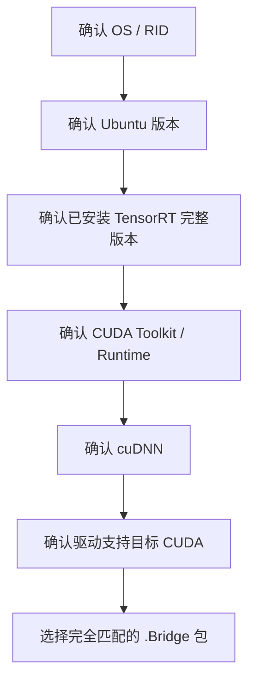

# TensorRT CSharp API v4.0 Windows/Linux Bridge 运行库矩阵与部署边界

<!-- public-article-layout:start -->
<style>
.content article { min-width: 0; overflow-wrap: anywhere; }
.content article a, .content article :not(pre) > code { overflow-wrap: anywhere; word-break: break-word; }
.content article pre:not(.mermaid), .content article table { display: block; max-width: 100%; overflow-x: auto; }
.content pre.mermaid { max-width: 640px; margin: 16px auto; overflow-x: auto; }
.content pre.mermaid svg { display: block; width: 100%; max-width: 640px; height: auto; }
</style>
<!-- public-article-layout:end -->

> 文章编号：`MSC-005`；适用版本：TensorRT CSharp API v4.0 `4.0.0`；当前状态：`ready`。

## 1. 前言
<!-- public-article-project-preface:start -->
TensorRT CSharp API v4.0 是一个面向 C#/.NET 开发者的 TensorRT 与 CUDA 工程化接口项目。它把 NVIDIA 原生运行时、生成式绑定、C++ Bridge、托管对象模型和可验证的示例程序组织成一条完整链路，使使用者可以在熟悉的 .NET 项目中完成 Engine 构建、反序列化、ExecutionContext 管理、CUDA 内存操作、异步流同步和结果校验。项目的目标不是隐藏 TensorRT 的概念，而是把这些概念转换为有明确生命周期、所有权和错误边界的 C# API。

4.0.0 是一次完整重构后的正式版本。核心接口、Bridge 边界、Runtime 包命名、样例目录和验证方式都以 4.x 设计为准，不能把 3.x 的类型名、旧包名或旧 DLL 目录直接复制到新项目。托管包只提供项目接口和自有 Bridge；TensorRT、CUDA、cuDNN、显卡驱动以及对应许可证仍由使用者按目标平台安装和管理。

单篇文章也应能够独立阅读：读者可以先从项目入口确认源码和包，再根据本文的程序路径准备依赖，最后用输出中的状态、计数、Shape、哈希或结果图片判断流程是否真的完成。对于尚未具备兼容 GPU 的环境，本文会把静态检查、期望输出和真实运行结果分开标记，不把帮助命令或 build-only 结果包装成推理成功。

项目、包和源码入口（以下地址保留明文，便于复制到不完整支持 Markdown 链接的平台）：

项目主页：

```text
https://github.com/guojin-yan/TensorRT-CSharp-API/tree/TensorRtSharp4.0
```

核心 NuGet：

```text
https://www.nuget.org/packages/JYPPX.TensorRT.CSharp.API/4.0.0
```

Runtime Bridge 包列表：

```text
https://www.nuget.org/packages?q=+JYPPX.TensorRT.CSharp&includeComputedFrameworks=true&prerel=true&sortby=relevance
```

运行库清单：

```text
https://github.com/guojin-yan/TensorRT-CSharp-API/blob/TensorRtSharp4.0/pack/runtime/runtime-packages.manifest.json
```

### 1.1 程序出处与输出说明

本文涉及的程序、脚本或命令均以仓库中的实现为准；对应源码入口：

```text
https://github.com/guojin-yan/TensorRT-CSharp-API/tree/TensorRtSharp4.0
```

运行示例必须同时给出程序输出和判定标准。终端中的 `status`、`Ready`、`Bound`、`enqueueCount`、`OutputMatch`、进程退出码、报告文件或结果图片分别说明不同层次的事实；只有明确写出这些结果，读者才能区分程序启动、Engine 构建、GPU enqueue 和业务结果语义。
<!-- public-article-project-preface:end -->

TensorRT CSharp API v4.0 的托管 API 可以跨平台编译，但真正运行时必须同时匹配操作系统、CPU 架构、TensorRT、CUDA、cuDNN 和 NVIDIA 驱动。只安装核心 NuGet 包不能提供 GPU 运行能力，随意选择一个看起来较新的 Runtime 包也可能造成 DLL 加载失败或 CUDA 版本错误。

TensorRT CSharp API v4.0：<https://github.com/guojin-yan/TensorRT-CSharp-API> `4.0.0` 采用一个托管核心包加 18 个 bridge-only 运行包的正式交付方式。本文列出完整矩阵，并解释如何从本机环境反推唯一正确的包。

### 1.2 项目与包入口

| 项目 | 链接 |
| --- | --- |
| GitHub 项目 | TensorRT-CSharp-API：<https://github.com/guojin-yan/TensorRT-CSharp-API> |
| 核心托管包 | `JYPPX.TensorRT.CSharp.API 4.0.0`：<https://www.nuget.org/packages/JYPPX.TensorRT.CSharp.API/4.0.0> |
| 发布者包列表 | JYPPX on NuGet：<https://www.nuget.org/profiles/JYPPX> |
| 正式 Release 说明 | `docs/releases/4.0.0.md`：<https://github.com/guojin-yan/TensorRT-CSharp-API/blob/TensorRtSharp4.0/docs/releases/4.0.0.md> |
| Runtime manifest | `runtime-packages.manifest.json`：<https://github.com/guojin-yan/TensorRT-CSharp-API/blob/TensorRtSharp4.0/pack/runtime/runtime-packages.manifest.json> |
| CMake 预设 | `CMakePresets.json`：<https://github.com/guojin-yan/TensorRT-CSharp-API/blob/TensorRtSharp4.0/CMakePresets.json> |

## 2. 正式版到底发布了什么

正式 `4.0.0` 共 19 个 NuGet 包：

- 1 个 `JYPPX.TensorRT.CSharp.API` 托管核心包；
- 6 个 Windows x64 `.Bridge` 包；
- 12 个 Linux x64 `.Bridge` 包，覆盖 Ubuntu 20.04、22.04、24.04 的已建模组合。

`.Bridge` 包只包含项目编译的 `jyppxtrtbridge.dll` 或 `libjyppxtrtbridge.so` 等项目自有原生库，不包含：

- TensorRT `nvinfer` / `nvonnxparser`；
- CUDA Runtime、cuBLAS 或 NVRTC；
- cuDNN；
- NVIDIA 驱动；
- 模型、ONNX 或 TensorRT plan。

因此安装两个 NuGet 包只是完成“托管 API + 项目 Bridge”两层，NVIDIA 依赖仍由目标机器安装并按其许可证管理。

## 3. 包名如何阅读

以 Windows 包为例：

```text
JYPPX.TensorRT.CSharp.API.Runtime.win-x64.trt10.11.cuda12.9.cudnn9.22.Bridge
                                      |       |          |           |
                                      RID     TensorRT   CUDA        cuDNN
```

Linux 包还包含发行版版本：

```text
...Runtime.linux-x64.ubuntu22.04.trt11.0.cuda13.2.cudnn9.22.Bridge
```

包名中的每一段都是选择条件，不是描述性标签。`trt10.11` 不能替代 `trt11.0`，`cuda12.9` 不能在仅兼容 CUDA 11.8 的驱动环境中强行使用，Ubuntu 版本也不应随意跨用。

## 4. Windows x64 正式 Bridge 矩阵

| TensorRT | CUDA | cuDNN | 精确 Package ID |
| --- | --- | --- | --- |
| 8.6.1.6 | 11.8 | 8.9.7.29 | `JYPPX.TensorRT.CSharp.API.Runtime.win-x64.trt8.6.cuda11.8.cudnn8.9.Bridge` |
| 8.6.1.6 | 12.1 | 8.9.7.29 | `JYPPX.TensorRT.CSharp.API.Runtime.win-x64.trt8.6.cuda12.1.cudnn8.9.Bridge` |
| 10.11.0.33 | 11.8 | 8.9.7.29 | `JYPPX.TensorRT.CSharp.API.Runtime.win-x64.trt10.11.cuda11.8.cudnn8.9.Bridge` |
| 10.11.0.33 | 12.9 | 9.22.0 | `JYPPX.TensorRT.CSharp.API.Runtime.win-x64.trt10.11.cuda12.9.cudnn9.22.Bridge` |
| 11.0.0.114 | 12.9 | 9.22.0 | `JYPPX.TensorRT.CSharp.API.Runtime.win-x64.trt11.0.cuda12.9.cudnn9.22.Bridge` |
| 11.0.0.114 | 13.2 | 9.22.0 | `JYPPX.TensorRT.CSharp.API.Runtime.win-x64.trt11.0.cuda13.2.cudnn9.22.Bridge` |

安装示例：

```powershell
dotnet add package JYPPX.TensorRT.CSharp.API --version 4.0.0
dotnet add package JYPPX.TensorRT.CSharp.API.Runtime.win-x64.trt10.11.cuda12.9.cudnn9.22.Bridge --version 4.0.0
```

不要同时引用两条 Windows Bridge 组合来“提高兼容性”。一个进程应选择一条清晰的 TensorRT API line 和依赖组合。

## 5. Linux x64 正式 Bridge 矩阵

### 5.1 Ubuntu 20.04

| TensorRT | CUDA | cuDNN | 精确 Package ID |
| --- | --- | --- | --- |
| 8.6.1.6 | 11.8 | 8.9.7.29 | `JYPPX.TensorRT.CSharp.API.Runtime.linux-x64.ubuntu20.04.trt8.6.cuda11.8.cudnn8.9.Bridge` |
| 8.6.1.6 | 12.1 | 8.9.7.29 | `JYPPX.TensorRT.CSharp.API.Runtime.linux-x64.ubuntu20.04.trt8.6.cuda12.1.cudnn8.9.Bridge` |
| 10.11.0.33 | 11.8 | 8.9.7.29 | `JYPPX.TensorRT.CSharp.API.Runtime.linux-x64.ubuntu20.04.trt10.11.cuda11.8.cudnn8.9.Bridge` |

### 5.2 Ubuntu 22.04

| TensorRT | CUDA | cuDNN | 精确 Package ID |
| --- | --- | --- | --- |
| 8.6.1.6 | 11.8 | 8.9.7.29 | `JYPPX.TensorRT.CSharp.API.Runtime.linux-x64.ubuntu22.04.trt8.6.cuda11.8.cudnn8.9.Bridge` |
| 8.6.1.6 | 12.1 | 8.9.7.29 | `JYPPX.TensorRT.CSharp.API.Runtime.linux-x64.ubuntu22.04.trt8.6.cuda12.1.cudnn8.9.Bridge` |
| 10.11.0.33 | 11.8 | 8.9.7.29 | `JYPPX.TensorRT.CSharp.API.Runtime.linux-x64.ubuntu22.04.trt10.11.cuda11.8.cudnn8.9.Bridge` |
| 10.11.0.33 | 12.9 | 9.22.0 | `JYPPX.TensorRT.CSharp.API.Runtime.linux-x64.ubuntu22.04.trt10.11.cuda12.9.cudnn9.22.Bridge` |
| 11.0.0.114 | 12.9 | 9.22.0 | `JYPPX.TensorRT.CSharp.API.Runtime.linux-x64.ubuntu22.04.trt11.0.cuda12.9.cudnn9.22.Bridge` |
| 11.0.0.114 | 13.2 | 9.22.0 | `JYPPX.TensorRT.CSharp.API.Runtime.linux-x64.ubuntu22.04.trt11.0.cuda13.2.cudnn9.22.Bridge` |

### 5.3 Ubuntu 24.04

| TensorRT | CUDA | cuDNN | 精确 Package ID |
| --- | --- | --- | --- |
| 10.11.0.33 | 12.9 | 9.22.0 | `JYPPX.TensorRT.CSharp.API.Runtime.linux-x64.ubuntu24.04.trt10.11.cuda12.9.cudnn9.22.Bridge` |
| 11.0.0.114 | 12.9 | 9.22.0 | `JYPPX.TensorRT.CSharp.API.Runtime.linux-x64.ubuntu24.04.trt11.0.cuda12.9.cudnn9.22.Bridge` |
| 11.0.0.114 | 13.2 | 9.22.0 | `JYPPX.TensorRT.CSharp.API.Runtime.linux-x64.ubuntu24.04.trt11.0.cuda13.2.cudnn9.22.Bridge` |

Ubuntu 20.04 的正式构建使用 hosted runner 内的 Ubuntu 20.04 container lane；22.04/24.04 使用对应 hosted runner。这个事实说明包的构建环境，不代表任意 Linux 发行版都属于正式矩阵。

## 6. 如何选择唯一正确的包



### 6.1 Windows 信息采集

```powershell
dotnet --info
nvidia-smi
Get-Command nvidia-smi | Select-Object -ExpandProperty Source
Get-ChildItem Env: | Where-Object Name -Match 'CUDA|TENSORRT|CUDNN|PATH'
```

### 6.2 Linux 信息采集

```bash
dotnet --info
nvidia-smi
cat /etc/os-release
ldconfig -p | grep -E 'nvinfer|nvonnxparser|cudart|cudnn'
```

`nvidia-smi` 顶部显示的 CUDA Version 是驱动可支持的最高 CUDA 版本提示，不等于应用当前实际加载的 CUDA Runtime。仍需检查安装目录、动态库和运行时探测结果。

## 7. 应用目录中的加载关系

构建输出通常包含：

```text
MyApp.dll
JYPPX.TensorRtSharp.dll
JYPPX.CudaSharp.dll
JYPPX.Shared.dll
runtimes/<rid>/native/jyppxtrtbridge.dll 或 libjyppxtrtbridge.so
```

NVIDIA 动态库可以通过系统安装目录、应用可发现目录或受控的原生解析路径提供。不要把从另一台机器复制来的零散 `nvinfer`/`cudart` 文件与本机 SDK 混放，否则加载器可能得到一个表面存在、依赖却互不兼容的组合。

## 8. Bridge 与 NVIDIA Runtime 的责任边界

| 层 | 谁提供 | 失败时先检查 |
| --- | --- | --- |
| 托管 API | `JYPPX.TensorRT.CSharp.API` | NuGet restore、目标框架、版本 |
| 项目 Bridge | 对应 `.Bridge` 包 | RID、包名、输出目录、架构 |
| TensorRT/CUDA/cuDNN | 用户/NVIDIA 安装 | 版本、搜索路径、依赖链 |
| 驱动与 GPU | 目标机器 | `nvidia-smi`、CUDA 兼容性 |
| 模型/plan | 应用团队 | SHA256、TensorRT line、GPU/插件兼容策略 |

Bridge 包成功加载，不等于 Engine 一定能运行；Engine 反序列化成功，也不等于输入预处理和输出语义正确。

## 9. Build、Load、Runtime 三种结论

| 结果 | 可以说明 | 不能说明 |
| --- | --- | --- |
| NuGet restore/build 成功 | 包可解析，托管项目能编译 | Bridge 或 vendor DLL 已加载 |
| Bridge probe 成功 | 项目原生 Bridge 能加载并响应 | TensorRT Builder/Runtime 一定可用 |
| Runtime 创建成功 | 目标 TensorRT runtime 可创建 | 某个 plan 可反序列化 |
| Engine deserialize 成功 | plan 被当前 runtime 接受 | enqueue 与输出正确 |
| Enqueue + output validation | 该输入路径执行并匹配参考 | 其它机器、模型或 batch 也正确 |

## 10. 容器与服务部署建议

- 基础镜像、Ubuntu、CUDA、TensorRT 和 cuDNN 版本应与 Bridge 包名一致。
- 将包版本固定为 `4.0.0`，不要用浮动版本组装生产镜像。
- 构建镜像时保存 `dotnet --info`、包锁文件和 NVIDIA 包清单。
- 启动探针分别检查 Bridge、CUDA runtime、TensorRT runtime 和最小 Engine。
- 不要在没有 GPU 的普通 CI container 中把 build-only 结果标成 runtime passed。
- TensorRT plan 应按目标 GPU/compatibility policy 管理，不要把 ONNX 的可移植性假设套给 plan。

## 11. 常见选包错误

### 11.1 只看 TensorRT major

`trt10.11.cuda11.8.cudnn8.9` 与 `trt10.11.cuda12.9.cudnn9.22` 不是同一组合。必须同时匹配 CUDA 与 cuDNN。

### 11.2 Windows 能跑就复用到 Linux

托管 API 可以共享，Bridge 动态库和系统 ABI 不可以共享。Linux 还要匹配 Ubuntu lane。

### 11.3 认为 Bridge 包包含全部运行时

4.0.0 已明确取消 full-runtime 厂商库打包。缺少 `nvinfer`、`cudart` 或 `cudnn` 时，应安装匹配的 NVIDIA 运行库，而不是继续添加不同 Bridge 包。

### 11.4 CUDA error 35 时更换 NuGet 核心包

该错误通常指向驱动/runtime 不兼容。应核对驱动与 CUDA lane，而不是先重装托管核心包。完整排查顺序见 `MSC-008`。

## 12. 总结

TensorRT CSharp API v4.0 4.0.0 的部署单位不是一个“万能 Runtime 包”，而是核心托管包、一个精确 `.Bridge` 包和用户安装的匹配 NVIDIA 运行库。18 个 Bridge 包把正式支持组合写进包名；正确选择的关键是先识别目标环境，再精确匹配 RID、Ubuntu、TensorRT、CUDA 和 cuDNN，最后用真实 Engine 与输出验证运行，而不是只看 restore/build。

<!-- public-article-declaration:start -->
## 13. 文章声明

### 13.1 开源协议声明
作者所有开源项目代码均遵循 Apache License 2.0 开源协议。
特别说明：本项目集成了若干第三方库。若任何第三方库的许可协议与 Apache 2.0 协议存在冲突或不一致，均以该第三方库的原始许可协议为准。本项目不包含也不代表这些第三方库的授权声明，使用前请务必阅读并遵守第三方库的相关许可。

### 13.2 代码开发与质量说明
AI 辅助开发：本代码在开发过程中使用了人工智能（AI）辅助生成与优化，并非完全由人工逐行编写。
安全性承诺：作者郑重声明，本代码中绝无任何有意设置的后门、病毒、木马或旨在破坏用户设备、窃取数据的恶意代码。
技术局限性：受限于作者个人的技术水平与能力，代码中可能存在因逻辑不严谨、优化不足或经验欠缺导致的低级问题（例如但不限于内存泄漏、偶发崩溃、资源未释放等）。这些问题纯属能力不足所致，并非主观故意。
测试范围：由于作者精力有限，未对本软件进行全方位、覆盖所有边缘场景的完整测试。

### 13.3 免责声明（重要）
请在将本代码应用于任何实际项目（特别是商业、工业或关键任务环境）之前，务必进行详尽、严格的自行测试与验证。 鉴于上述可能存在的代码缺陷及测试覆盖不足，因使用本代码而导致的任何直接或间接损失（包括但不限于设备故障、数据丢失、系统瘫痪或利润损失等），本作者概不负责。 一旦您开始使用本代码，即表示您已知晓上述风险并同意自行承担一切后果，相关问题与本作者无关。

### 13.4 代码开源范围
本项目承诺核心逻辑代码完全开源，但上述提到的“第三方库”的二进制文件、源代码或相关资源不在本项目的开源义务范围内，请根据其各自的指引获取。

### 13.5 社区与反馈
尽管存在上述不足，我们仍欢迎大家下载使用、提交 Issue 或参与测试，共同完善项目。如果您在使用过程中发现 Bug、内存溢出或有改进建议，欢迎通过项目主页提供的联系方式与作者取得联系，我们将尽力在有限的时间内提供协助。


<!-- public-article-declaration:end -->
