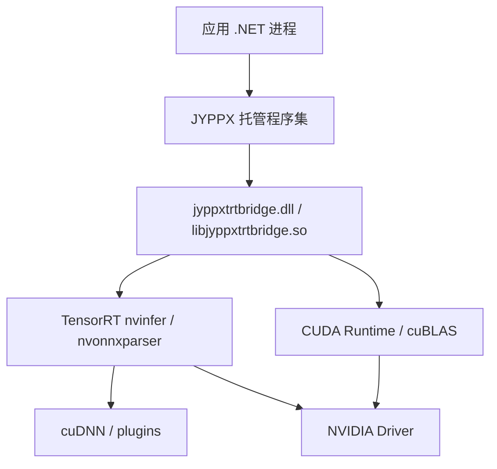

# CUDA error 35、DLL 加载失败和版本不匹配排查

<!-- public-article-layout:start -->
<style>
.content article { min-width: 0; overflow-wrap: anywhere; }
.content article a, .content article :not(pre) > code { overflow-wrap: anywhere; word-break: break-word; }
.content article pre:not(.mermaid), .content article table { display: block; max-width: 100%; overflow-x: auto; }
.content pre.mermaid { max-width: 640px; margin: 16px auto; overflow-x: auto; }
.content pre.mermaid svg { display: block; width: 100%; max-width: 640px; height: auto; }
</style>
<!-- public-article-layout:end -->

> 文章编号：`MSC-008`；适用版本：TensorRT CSharp API v4.0 `4.0.0`；当前状态：`ready`。

## 1. 前言
<!-- public-article-project-preface:start -->
TensorRT CSharp API v4.0 是一个面向 C#/.NET 开发者的 TensorRT 与 CUDA 工程化接口项目。它把 NVIDIA 原生运行时、生成式绑定、C++ Bridge、托管对象模型和可验证的示例程序组织成一条完整链路，使使用者可以在熟悉的 .NET 项目中完成 Engine 构建、反序列化、ExecutionContext 管理、CUDA 内存操作、异步流同步和结果校验。项目的目标不是隐藏 TensorRT 的概念，而是把这些概念转换为有明确生命周期、所有权和错误边界的 C# API。

4.0.0 是一次完整重构后的正式版本。核心接口、Bridge 边界、Runtime 包命名、样例目录和验证方式都以 4.x 设计为准，不能把 3.x 的类型名、旧包名或旧 DLL 目录直接复制到新项目。托管包只提供项目接口和自有 Bridge；TensorRT、CUDA、cuDNN、显卡驱动以及对应许可证仍由使用者按目标平台安装和管理。

单篇文章也应能够独立阅读：读者可以先从项目入口确认源码和包，再根据本文的程序路径准备依赖，最后用输出中的状态、计数、Shape、哈希或结果图片判断流程是否真的完成。对于尚未具备兼容 GPU 的环境，本文会把静态检查、期望输出和真实运行结果分开标记，不把帮助命令或 build-only 结果包装成推理成功。

项目、包和源码入口（以下地址保留明文，便于复制到不完整支持 Markdown 链接的平台）：

项目主页：

```text
https://github.com/guojin-yan/TensorRT-CSharp-API/tree/TensorRtSharp4.0
```

核心 NuGet：

```text
https://www.nuget.org/packages/JYPPX.TensorRT.CSharp.API/4.0.0
```

Runtime Bridge 包列表：

```text
https://www.nuget.org/packages?q=+JYPPX.TensorRT.CSharp&includeComputedFrameworks=true&prerel=true&sortby=relevance
```

运行库清单：

```text
https://github.com/guojin-yan/TensorRT-CSharp-API/blob/TensorRtSharp4.0/pack/runtime/runtime-packages.manifest.json
```

### 1.1 程序出处与输出说明

本文涉及的程序、脚本或命令均以仓库中的实现为准；对应源码入口：

```text
https://github.com/guojin-yan/TensorRT-CSharp-API/tree/TensorRtSharp4.0
```

运行示例必须同时给出程序输出和判定标准。终端中的 `status`、`Ready`、`Bound`、`enqueueCount`、`OutputMatch`、进程退出码、报告文件或结果图片分别说明不同层次的事实；只有明确写出这些结果，读者才能区分程序启动、Engine 构建、GPU enqueue 和业务结果语义。
<!-- public-article-project-preface:end -->

GPU 应用启动失败时，最容易采取的动作是反复复制 DLL、重装 NuGet 或清空输出目录。但 TensorRT CSharp API v4.0 的加载链包含托管程序集、项目 Bridge、TensorRT/CUDA/cuDNN 和 NVIDIA 驱动，错误发生在哪一层，处理方式完全不同。无来源地复制动态库经常会把一个明确的缺依赖问题变成更隐蔽的版本混用。

TensorRT CSharp API v4.0：<https://github.com/guojin-yan/TensorRT-CSharp-API> 4.0.0 通过核心托管包和按版本命名的 `.Bridge` 包交付项目代码，NVIDIA 运行库由用户安装。本文按“环境、包、加载路径、最小复现”的顺序排查 `CUDA error 35`、`DllNotFoundException`、`BadImageFormatException` 和 TensorRT 版本不匹配。

### 1.2 项目、包与源码入口

| 项目 | 链接 |
| --- | --- |
| GitHub 项目 | TensorRT-CSharp-API：<https://github.com/guojin-yan/TensorRT-CSharp-API> |
| 核心包 | `JYPPX.TensorRT.CSharp.API 4.0.0`：<https://www.nuget.org/packages/JYPPX.TensorRT.CSharp.API/4.0.0> |
| Bridge 包列表 | JYPPX NuGet 包列表：<https://www.nuget.org/profiles/JYPPX> |
| 原生路径解析器 | `NativeBridgePathResolver.cs`：<https://github.com/guojin-yan/TensorRT-CSharp-API/blob/TensorRtSharp4.0/src/JYPPX.Shared/Interop/NativeBridgePathResolver.cs> |
| 环境探针 | `TensorRtEnvironmentProbe`：<https://github.com/guojin-yan/TensorRT-CSharp-API/tree/TensorRtSharp4.0/src/JYPPX.TensorRtSharp/Diagnostics> |
| Bridge 矩阵 | MSC-005：<https://github.com/guojin-yan/TensorRT-CSharp-API/blob/TensorRtSharp4.0/docs/articles/zh-cn/05-installation/runtime/msc-005-windows-linux-bridge-matrix.md> |

## 2. 先画出加载链



排错时应找出“第一个失败节点”。后续层没有执行，不应拿后续行为解释前面的加载错误。

## 3. 错误类型速查

| 现象 | 优先怀疑 | 第一检查 |
| --- | --- | --- |
| `FileNotFoundException` 指向 managed DLL | NuGet/输出缺失 | `.deps.json`、restore、输出目录 |
| `DllNotFoundException` 指向 Bridge | `.Bridge` 包/RID/搜索路径 | `runtimes/<rid>/native` |
| Bridge 文件存在仍 `DllNotFoundException` | Bridge 的传递依赖缺失 | `dumpbin` 或 `ldd` |
| `BadImageFormatException` | x86/x64 或文件架构不匹配 | 进程架构、RID、PE/ELF 架构 |
| `EntryPointNotFoundException` | 托管层与 Bridge 版本不一致 | 两个包都固定 `4.0.0` |
| CUDA error 35 | 驱动不足以支持已加载 CUDA Runtime | `nvidia-smi` + runtime lane |
| TensorRT deserialize 失败 | Plan、插件或 TensorRT line 不兼容 | Plan provenance 与 Engine 日志 |
| 输出错误但无加载异常 | 预处理/Shape/dtype/后处理 | 输入合同和 reference |

## 4. 第一步：采集环境，不急着修改

### 4.1 Windows

```powershell
dotnet --info
nvidia-smi
[Environment]::Is64BitProcess
Get-CimInstance Win32_OperatingSystem | Select-Object Caption,Version,OSArchitecture
Get-ChildItem Env: | Where-Object Name -Match 'CUDA|TENSORRT|CUDNN|JYPPX|PATH'
```

### 4.2 Linux

```bash
dotnet --info
nvidia-smi
uname -a
cat /etc/os-release
printenv | grep -E 'CUDA|TENSORRT|CUDNN|JYPPX|LD_LIBRARY_PATH'
```

把命令输出、应用版本、Bridge PackageReference 和完整异常保存在同一个问题记录中。不要只截取最后一行“加载失败”。

## 5. CUDA error 35 是什么

CUDA error 35 对应 insufficient driver 语义，常见情况是进程加载的 CUDA Runtime 比当前 NVIDIA 驱动能够支持的版本更新。它通常不是 C# wrapper 缺方法，也不表示 GPU 一定损坏。

典型信息：

```text
cudaRuntimeGetVersion failed with CUDA error 35
```

### 5.1 正确判断顺序

1. 记录 `nvidia-smi` 的 Driver Version 与页面顶部 CUDA Version。
2. 从 `.Bridge` 包名确认目标 CUDA lane，例如 `cuda13.2`。
3. 找出进程实际能发现的 `cudart`，排除 `PATH` 中另一套 CUDA。
4. 核对 TensorRT 下载包或 apt package 对应的 CUDA 版本。
5. 若驱动不支持该 Runtime，升级驱动或选择与现有驱动兼容的正式 Bridge/NVIDIA 组合。

`nvidia-smi` 显示的 CUDA Version 是驱动能力提示，不等同于应用已加载的 `cudart` 版本。必须把两者分开记录。

### 5.2 不应做的事

- 不要把 error 35 写成 runtime passed 或“仅警告”。
- 不要只替换 `cudart` 单个文件，继续保留不匹配的 TensorRT/cuDNN。
- 不要通过忽略异常继续创建 Engine/Context。
- 不要把 build-only、dependency probe 或截图当成兼容主机上的运行结果。

## 6. 第二步：确认 NuGet 包组合

项目文件应有一个核心包和一个精确 Bridge：

```xml
<ItemGroup>
  <PackageReference Include="JYPPX.TensorRT.CSharp.API" Version="4.0.0" />
  <PackageReference Include="JYPPX.TensorRT.CSharp.API.Runtime.win-x64.trt10.11.cuda12.9.cudnn9.22.Bridge" Version="4.0.0" />
</ItemGroup>
```

检查解析结果：

```powershell
dotnet list .\MyApp.csproj package --include-transitive
dotnet restore .\MyApp.csproj --force-evaluate
```

重点排除：

- 核心包与 Bridge 版本不同；
- 同时引用多个互斥 Bridge；
- Windows 项目引用 Linux 包或反之；
- `AnyCPU` 进程实际以 x86 启动；
- 输出中残留旧 preview Bridge。

## 7. 第三步：确认 Bridge 是否复制

Windows：

```powershell
Get-ChildItem .\bin\Release -Recurse -Filter jyppxtrtbridge.dll |
  Select-Object FullName,Length,LastWriteTimeUtc
```

Linux：

```bash
find ./bin/Release -name 'libjyppxtrtbridge.so' -print
```

如果 Bridge 根本不存在，先修复 NuGet/RID/native asset copy。此时研究 NVIDIA 驱动还太早。

开发源码树可用显式路径诊断：

```powershell
$env:JYPPX_NATIVE_BRIDGE_PATH = '<完整的 jyppxtrtbridge.dll 路径>'
$env:JYPPX_ENABLE_DEVELOPMENT_PROBING = '1'
```

这两个变量适合定位本地构建产物，不应在生产中长期指向随意变化的源码目录。NuGet 消费路径应优先使用包的 `runtimes/<rid>/native` 资产。

## 8. 第四步：检查 Bridge 的传递依赖

### 8.1 Windows

```powershell
dumpbin /headers .\bin\Release\net8.0\runtimes\win-x64\native\jyppxtrtbridge.dll |
  Select-String 'machine'

dumpbin /dependents .\bin\Release\net8.0\runtimes\win-x64\native\jyppxtrtbridge.dll
```

再检查搜索到的动态库：

```powershell
where.exe nvinfer_10.dll
where.exe nvonnxparser_10.dll
where.exe cudart64_12.dll
where.exe cudnn64_9.dll
```

`where.exe` 返回多个版本时，要确认加载顺序。把错误版本排除出当前进程搜索路径，再重新启动进程验证。

### 8.2 Linux

```bash
file ./bin/Release/net8.0/runtimes/linux-x64/native/libjyppxtrtbridge.so
ldd ./bin/Release/net8.0/runtimes/linux-x64/native/libjyppxtrtbridge.so
ldconfig -p | grep -E 'nvinfer|nvonnxparser|cudart|cudnn'
```

`ldd` 的 `not found` 是直接线索。优先通过系统包、受控的 `LD_LIBRARY_PATH` 或容器镜像修复依赖，不要从未知来源下载同名 `.so`。

## 9. `BadImageFormatException`

该异常常见于架构不匹配：

- x64 应用加载 x86 DLL；
- Windows DLL 被误放入 Linux 输出；
- 文件损坏或并非有效动态库；
- 进程以 32 位方式启动。

先检查 `[Environment]::Is64BitProcess`、项目 `RuntimeIdentifier` 和 Bridge 文件架构。TensorRT CSharp API v4.0 4.0.0 的正式矩阵是 x64，不应使用 x86 进程消费。

## 10. `EntryPointNotFoundException`

这通常说明托管 P/Invoke 期待的导出与实际 Bridge 不一致，常见于：

- 核心包 4.0.0 加载了旧 preview Bridge；
- `JYPPX_NATIVE_BRIDGE_PATH` 指向上一次源码构建；
- 输出目录有两个同名 Bridge，加载顺序与预期不同；
- 手工复制动态库覆盖了 NuGet 资产。

清楚记录实际加载文件的完整路径、长度和 SHA256，再统一核心包/Bridge 版本。不要通过删除对应 P/Invoke 调用掩盖 ABI 不一致。

## 11. TensorRT 版本或 Plan 不匹配

Bridge 和 Runtime 创建成功后，Plan 仍可能反序列化失败。检查：

- Plan 由哪一版 TensorRT 构建；
- 是否启用 version compatible / lean runtime 等策略；
- 目标 GPU 与构建 GPU；
- 自定义 plugin 是否存在且版本一致；
- Engine 是否为 stripped plan，是否已经正确 refit；
- 文件 SHA256 是否与交付记录一致。

TensorRT plan 不是 ONNX 那样的通用交换格式。最可靠的做法是在目标部署矩阵中构建或验证，并保留 provenance。

## 12. 最小复现应逐层升级

### 12.1 层 1：托管构建

```powershell
dotnet build .\MyApp.csproj -c Release
```

### 12.2 层 2：Bridge/环境探针

使用项目诊断 API 或现有工具只查询 Bridge build/runtime info，确认原生边界可加载。

### 12.3 层 3：不依赖外部模型的 TensorRT 样例

```powershell
dotnet run --project .\samples\Inference\01.Bindings\InferenceBindings.csproj `
  -c Release -- --tensor-rt-line 10 --batch 2
```

### 12.4 层 4：业务 Engine 与固定输入

记录 I/O metadata、Shape、enqueue、输出 SHA256 和 reference mismatch。只有层 4 通过，才能讨论业务模型输出。

## 13. 提交问题时应附带什么

- OS、RID、进程架构和 .NET SDK/runtime；
- GPU 名称、Driver Version 与 `nvidia-smi` 完整输出；
- 核心包和 `.Bridge` 的精确 PackageReference；
- TensorRT、CUDA、cuDNN 完整版本和安装方式；
- Bridge 实际加载路径、长度和 SHA256；
- `dumpbin /dependents` 或 `ldd` 输出；
- 从第一条异常开始的完整 stack trace；
- 最小复现命令，以及 build/load/runtime 到哪一层；
- 若涉及 Plan，附来源版本、构建参数与 Plan SHA256，不必上传未获授权的模型。

## 14. 结论边界

| 状态 | 正确表述 |
| --- | --- |
| `blocked-by-cuda-driver` | 当前主机驱动/runtime 不兼容，运行未通过 |
| Bridge probe passed | 项目 Bridge 可加载，尚未证明 Engine 执行 |
| Deserialize passed | Plan 被接受，尚未证明 enqueue/output |
| Enqueue passed | GPU 调用完成，尚需输出语义验证 |
| Output reference passed | 固定模型/输入/环境结果匹配 |

## 15. 总结

原生加载问题最有效的排查方式是分层：先记录环境，再确认核心包与唯一 Bridge，检查 Bridge 是否复制，然后用 `dumpbin`/`ldd` 找传递依赖，最后进入 TensorRT Plan 和业务输出。CUDA error 35 应按驱动与实际 Runtime 版本处理，不能靠更换托管包或复制单个 DLL 解决。保留每层证据，问题通常会从“GPU 应用不能跑”收敛成一个可以直接修复的版本或路径差异。

<!-- public-article-declaration:start -->
## 16. 文章声明

### 16.1 开源协议声明
作者所有开源项目代码均遵循 Apache License 2.0 开源协议。
特别说明：本项目集成了若干第三方库。若任何第三方库的许可协议与 Apache 2.0 协议存在冲突或不一致，均以该第三方库的原始许可协议为准。本项目不包含也不代表这些第三方库的授权声明，使用前请务必阅读并遵守第三方库的相关许可。

### 16.2 代码开发与质量说明
AI 辅助开发：本代码在开发过程中使用了人工智能（AI）辅助生成与优化，并非完全由人工逐行编写。
安全性承诺：作者郑重声明，本代码中绝无任何有意设置的后门、病毒、木马或旨在破坏用户设备、窃取数据的恶意代码。
技术局限性：受限于作者个人的技术水平与能力，代码中可能存在因逻辑不严谨、优化不足或经验欠缺导致的低级问题（例如但不限于内存泄漏、偶发崩溃、资源未释放等）。这些问题纯属能力不足所致，并非主观故意。
测试范围：由于作者精力有限，未对本软件进行全方位、覆盖所有边缘场景的完整测试。

### 16.3 免责声明（重要）
请在将本代码应用于任何实际项目（特别是商业、工业或关键任务环境）之前，务必进行详尽、严格的自行测试与验证。 鉴于上述可能存在的代码缺陷及测试覆盖不足，因使用本代码而导致的任何直接或间接损失（包括但不限于设备故障、数据丢失、系统瘫痪或利润损失等），本作者概不负责。 一旦您开始使用本代码，即表示您已知晓上述风险并同意自行承担一切后果，相关问题与本作者无关。

### 16.4 代码开源范围
本项目承诺核心逻辑代码完全开源，但上述提到的“第三方库”的二进制文件、源代码或相关资源不在本项目的开源义务范围内，请根据其各自的指引获取。

### 16.5 社区与反馈
尽管存在上述不足，我们仍欢迎大家下载使用、提交 Issue 或参与测试，共同完善项目。如果您在使用过程中发现 Bug、内存溢出或有改进建议，欢迎通过项目主页提供的联系方式与作者取得联系，我们将尽力在有限的时间内提供协助。


<!-- public-article-declaration:end -->
