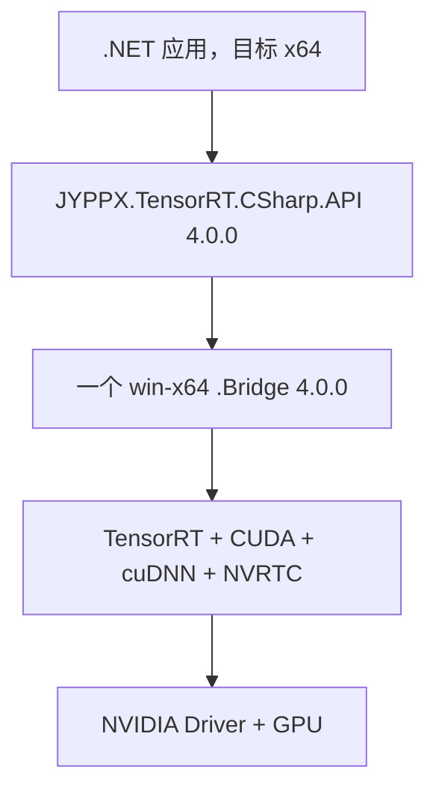

# TensorRT CSharp API v4.0 Windows 安装、验证与常见问题

<!-- public-article-layout:start -->
<style>
.content article { min-width: 0; overflow-wrap: anywhere; }
.content article a, .content article :not(pre) > code { overflow-wrap: anywhere; word-break: break-word; }
.content article pre:not(.mermaid), .content article table { display: block; max-width: 100%; overflow-x: auto; }
.content pre.mermaid { max-width: 640px; margin: 16px auto; overflow-x: auto; }
.content pre.mermaid svg { display: block; width: 100%; max-width: 640px; height: auto; }
</style>
<!-- public-article-layout:end -->

> 文章 ID：`MSC-003`<br>
> 对应版本：`4.0.0`<br>
> 适用平台：Windows x64<br>
> 内容状态：`ready`，尚未发布到 CSDN

## 1. 前言
<!-- public-article-project-preface:start -->
TensorRT CSharp API v4.0 是一个面向 C#/.NET 开发者的 TensorRT 与 CUDA 工程化接口项目。它把 NVIDIA 原生运行时、生成式绑定、C++ Bridge、托管对象模型和可验证的示例程序组织成一条完整链路，使使用者可以在熟悉的 .NET 项目中完成 Engine 构建、反序列化、ExecutionContext 管理、CUDA 内存操作、异步流同步和结果校验。项目的目标不是隐藏 TensorRT 的概念，而是把这些概念转换为有明确生命周期、所有权和错误边界的 C# API。

4.0.0 是一次完整重构后的正式版本。核心接口、Bridge 边界、Runtime 包命名、样例目录和验证方式都以 4.x 设计为准，不能把 3.x 的类型名、旧包名或旧 DLL 目录直接复制到新项目。托管包只提供项目接口和自有 Bridge；TensorRT、CUDA、cuDNN、显卡驱动以及对应许可证仍由使用者按目标平台安装和管理。

单篇文章也应能够独立阅读：读者可以先从项目入口确认源码和包，再根据本文的程序路径准备依赖，最后用输出中的状态、计数、Shape、哈希或结果图片判断流程是否真的完成。对于尚未具备兼容 GPU 的环境，本文会把静态检查、期望输出和真实运行结果分开标记，不把帮助命令或 build-only 结果包装成推理成功。

项目、包和源码入口（以下地址保留明文，便于复制到不完整支持 Markdown 链接的平台）：

项目主页：

```text
https://github.com/guojin-yan/TensorRT-CSharp-API/tree/TensorRtSharp4.0
```

核心 NuGet：

```text
https://www.nuget.org/packages/JYPPX.TensorRT.CSharp.API/4.0.0
```

Runtime Bridge 包列表：

```text
https://www.nuget.org/packages?q=+JYPPX.TensorRT.CSharp&includeComputedFrameworks=true&prerel=true&sortby=relevance
```

运行库清单：

```text
https://github.com/guojin-yan/TensorRT-CSharp-API/blob/TensorRtSharp4.0/pack/runtime/runtime-packages.manifest.json
```

### 1.1 程序出处与输出说明

本文涉及的程序、脚本或命令均以仓库中的实现为准；对应源码入口：

```text
https://github.com/guojin-yan/TensorRT-CSharp-API/tree/TensorRtSharp4.0
```

运行示例必须同时给出程序输出和判定标准。终端中的 `status`、`Ready`、`Bound`、`enqueueCount`、`OutputMatch`、进程退出码、报告文件或结果图片分别说明不同层次的事实；只有明确写出这些结果，读者才能区分程序启动、Engine 构建、GPU enqueue 和业务结果语义。
<!-- public-article-project-preface:end -->

### 1.2 项目简介

TensorRT CSharp API v4.0 是面向 .NET 的 TensorRT 与 CUDA C# API 项目。4.0.0 将托管接口、C ABI Bridge、Samples 和安装验证流程分开维护，开发者可以通过 NuGet 获取托管层和项目自有 Bridge，再根据本机硬件安装 NVIDIA 厂商运行库。

### 1.3 项目链接与包列表

| 项目内容 | 入口 |
| --- | --- |
| 项目源码 | TensorRT-CSharp-API 4.0 分支：<https://github.com/guojin-yan/TensorRT-CSharp-API/tree/TensorRtSharp4.0> |
| Windows 安装相关源码 | build/ 与 Samples：<https://github.com/guojin-yan/TensorRT-CSharp-API/tree/TensorRtSharp4.0/build> |
| 核心 NuGet | JYPPX.TensorRT.CSharp.API 4.0.0：<https://www.nuget.org/packages/JYPPX.TensorRT.CSharp.API/4.0.0> |
| Windows Runtime Bridge | NuGet 包列表：<https://www.nuget.org/packages?q=+JYPPX.TensorRT.CSharp&includeComputedFrameworks=true&prerel=true&sortby=relevance> |
| 包选择文章 | MSC-004：托管包与 Bridge 包如何选择：<https://github.com/guojin-yan/TensorRT-CSharp-API/blob/TensorRtSharp4.0/docs/articles/zh-cn/05-installation/packages/msc-004-managed-and-bridge-package-selection.md> |

### 1.4 本文结构

按“依赖层次 → 目标矩阵 → 工具链 → TensorRT/DLL 路径 → NuGet 安装 → 验证 → 常见错误”的顺序排查。安装命令使用正式 `4.0.0`，不会把帮助、还原或编译结果写成 GPU 推理成功。

TensorRT CSharp API v4.0 的 Windows 安装并不是只执行一次 `dotnet add package`。一个可运行环境同时涉及 .NET 托管程序集、项目自有 Bridge、NVIDIA TensorRT/CUDA/cuDNN、显卡驱动和 Windows 动态库搜索路径。只要其中任意两层版本不匹配，应用就可能在第一次调用原生 API 时失败。

本文从一个全新的 .NET 项目开始，使用正式版本 `4.0.0` 完成安装、环境检查和最小验证，并按故障现象说明排查顺序。

## 2. 先理解五层依赖



各层责任如下：

| 层 | 谁提供 | 安装方式 | 关键检查 |
| --- | --- | --- | --- |
| 业务应用 | 使用者 | 自己的 .NET 项目 | 目标框架和进程架构 |
| 托管 API | TensorRT CSharp API v4.0 | NuGet `JYPPX.TensorRT.CSharp.API` | 版本固定为 `4.0.0` |
| 项目 Bridge | TensorRT CSharp API v4.0 | 一个 `*.Bridge` NuGet 包 | RID 与 NVIDIA 四元组匹配 |
| TensorRT/CUDA/cuDNN/NVRTC | NVIDIA/使用者 | 按 NVIDIA 官方方式安装 | DLL 可被当前进程找到 |
| Driver/GPU | NVIDIA/机器管理员 | 驱动安装程序 | `nvidia-smi` 正常，驱动满足 CUDA 要求 |

Bridge 包只包含项目自有 `jyppxtrtbridge.dll`。它不会把 TensorRT、CUDA、cuDNN 或 NVRTC 安装到系统中，也不会更新驱动。

## 3. 安装前记录目标矩阵

不要从包列表里直接选择“看起来最新”的 Bridge。先记录目标机器：

```text
Operating system: Windows 10/11 or Windows Server, x64
.NET SDK/runtime: <version>
GPU: <model>
NVIDIA driver: <version>
TensorRT: <version>
CUDA: <version>
cuDNN: <version>
```

本文使用下面这组已发布组合演示：

```text
RID       = win-x64
TensorRT  = 10.11
CUDA      = 12.9
cuDNN     = 9.22
```

对应 Bridge 包必须是：

```text
JYPPX.TensorRT.CSharp.API.Runtime.win-x64.trt10.11.cuda12.9.cudnn9.22.Bridge
```

如果你的机器安装的是其他组合，请到 `MSC-004：托管包与 Bridge 包如何选择`：<https://github.com/guojin-yan/TensorRT-CSharp-API/blob/TensorRtSharp4.0/docs/articles/zh-cn/05-installation/packages/msc-004-managed-and-bridge-package-selection.md> 查找精确包 ID，不要照抄示例。

## 4. 检查 .NET、驱动和 CUDA 工具链

打开新的 PowerShell，先执行只读检查：

```powershell
dotnet --info
nvidia-smi
Get-Command nvcc -ErrorAction SilentlyContinue
Get-Command where.exe
```

如何理解输出：

- `dotnet --info` 应显示 x64 SDK/Runtime，并列出你准备使用的 .NET SDK。
- `nvidia-smi` 能识别 GPU 和驱动，说明驱动基本可用；它显示的 CUDA 字段是驱动可支持的上限，不等于本机已经安装对应 CUDA Toolkit。
- `nvcc --version` 反映 CUDA Toolkit 编译器版本。仅运行已编译 CUDA 程序时不一定要求 `nvcc`，但 `Cuda/01.RuntimeCompilation` 还需要 NVRTC。
- 一个命令可执行不代表 TensorRT 与 cuDNN DLL 已经进入当前进程的搜索路径，后面还要单独确认。

如果 `nvidia-smi` 失败，应先修复显卡驱动。此时继续调整 NuGet 包没有意义。

## 5. 准备 TensorRT 和 DLL 搜索路径

按 NVIDIA 对应版本文档安装 TensorRT、CUDA 与 cuDNN，并确认三者版本与 Bridge 包名一致。项目支持使用 `TENSORRT_PATH` 或 `JYPPX_TENSORRT_ROOT` 指向 TensorRT 根目录；同时，Windows 加载器仍需要能从应用目录或 `PATH` 找到依赖 DLL。

当前 PowerShell 会话可以先做临时验证：

```powershell
$env:JYPPX_TENSORRT_ROOT = '<TensorRT-root>'
$env:TENSORRT_PATH = '<TensorRT-root>'
$env:PATH = '<TensorRT-root>\lib;<CUDA-root>\bin;<cuDNN-bin>;' + $env:PATH
```

占位符要替换成自己的安装目录。文章、脚本和项目文件中不要提交带用户名或盘符的个人路径。

常见目录职责：

- TensorRT `lib` 或 `bin`：`nvinfer`、ONNX Parser、Plugin 等 DLL。
- CUDA `bin`：CUDA Runtime、Driver stub 以外的用户态组件和 NVRTC DLL。
- cuDNN `bin`：与目标 CUDA/TensorRT 组合匹配的 cuDNN DLL。
- 应用输出目录：NuGet Bridge 提供的 `jyppxtrtbridge.dll`。

可以用 Windows 自带搜索命令检查一个已知 DLL，例如 TensorRT 10 主库：

```powershell
where.exe nvinfer_10.dll
where.exe jyppxtrtbridge.dll
```

第二条通常只有在进入构建输出目录或把该目录加入搜索路径后才有结果。不要把所有历史 TensorRT 目录同时放进 `PATH`，否则加载器可能先命中错误版本。

## 6. 创建项目并安装 4.0.0

从准备存放项目的目录执行：

```powershell
dotnet new console -n TrtWindowsQuickstart
Set-Location .\TrtWindowsQuickstart
dotnet add package JYPPX.TensorRT.CSharp.API --version 4.0.0
dotnet add package JYPPX.TensorRT.CSharp.API.Runtime.win-x64.trt10.11.cuda12.9.cudnn9.22.Bridge --version 4.0.0
dotnet restore
dotnet list package --include-transitive
```

期望直接依赖中出现：

```text
JYPPX.TensorRT.CSharp.API                                                    4.0.0
JYPPX.TensorRT.CSharp.API.Runtime.win-x64.trt10.11.cuda12.9.cudnn9.22.Bridge 4.0.0
```

项目文件建议显式固定 x64，避免上层工具以其他架构启动：

```xml
<PropertyGroup>
  <TargetFramework>net8.0</TargetFramework>
  <PlatformTarget>x64</PlatformTarget>
  <RuntimeIdentifier>win-x64</RuntimeIdentifier>
</PropertyGroup>
```

仓库中的项目可能支持不同目标框架；这里的 `net8.0` 是新建示例的保守起点，不表示包只支持这一项。真正关键的是运行进程与 Bridge 都是 x64。

## 7. 先验证还原和帮助入口

包恢复完成后，先确认资产落入输出目录：

```powershell
dotnet build -c Release
Get-ChildItem .\bin\Release -Recurse -Filter jyppxtrtbridge.dll
```

如果你在 TensorRT CSharp API v4.0 源码仓库中排查，可以执行一个不会初始化 GPU 的帮助入口：

```powershell
dotnet run --project .\samples\Inference\01.Bindings -- --help
```

这个步骤验证的是：公开 NuGet 能还原、示例能编译、命令行解析可达。它不是 TensorRT 推理验证。下一步应按 推理绑定教程：<https://github.com/guojin-yan/TensorRT-CSharp-API/blob/TensorRtSharp4.0/docs/articles/zh-cn/inference-bindings-tutorial.md> 运行最小网络，再按业务场景加载真实 Engine 或 ONNX。

## 8. 最小运行检查的顺序

真实运行不要一开始就接入大型模型。建议按以下顺序缩小问题范围：

1. `nvidia-smi`：驱动和 GPU 是否可见。
2. `dotnet list package`：托管包与唯一 Bridge 是否都是 `4.0.0`。
3. 输出目录：是否存在 `jyppxtrtbridge.dll`，进程是否 x64。
4. DLL 搜索路径：目标 TensorRT/CUDA/cuDNN 是否位于当前会话可见路径。
5. 无外部模型的最小 TensorRT 网络：验证 Runtime、Builder 或 ExecutionContext 基础链路。
6. 再加载真实 Engine/ONNX，并校验输入名称、Shape、数据类型和输出语义。

每跨过一层就保存实际命令和异常全文。只记录“启动失败”会丢失最有价值的 DLL 名、错误码和调用阶段。

## 9. 常见问题

### 9.1 `DllNotFoundException` 或“找不到指定模块”

“指定模块”不一定是异常中显示的那个 DLL，也可能是它的传递依赖缺失。

排查：

```powershell
dotnet list package --include-transitive
Get-ChildItem .\bin -Recurse -Filter jyppxtrtbridge.dll
where.exe nvinfer_10.dll
where.exe cudart64_12.dll
```

如果 Bridge 存在而 `nvinfer` 不可见，修复 TensorRT 路径；如果 `nvinfer` 存在但来自另一套 TensorRT 目录，先消除 PATH 冲突。不要从未知网站单独下载 DLL 填补错误。

### 9.2 `BadImageFormatException`

这通常表示进程架构与原生库不一致，例如 x86 进程加载 x64 Bridge。检查：

```powershell
dotnet --info
$env:PROCESSOR_ARCHITECTURE
```

项目显式设置 `PlatformTarget=x64` 和 `RuntimeIdentifier=win-x64`，并确认没有由 32 位宿主启动。

### 9.3 CUDA Error 35

CUDA Error 35 通常对应驱动不足以支持当前 CUDA Runtime。先比较 `nvidia-smi` 显示的驱动版本与所选 CUDA 版本要求，再决定升级驱动还是改用与现有驱动匹配的 CUDA/Bridge 组合。

不要只更换 `JYPPX.TensorRT.CSharp.API` 托管包。CUDA Error 35 发生在驱动与 CUDA Runtime 边界，完整排查见 CUDA Error 35 指南：<https://github.com/guojin-yan/TensorRT-CSharp-API/blob/TensorRtSharp4.0/docs/articles/zh-cn/cuda-error-35-troubleshooting.md>。

### 9.4 找到了 DLL，但出现入口点缺失或初始化失败

这通常是“名字能找到、版本却不匹配”。例如 Bridge 按 TensorRT 10.11 构建，进程先加载了另一目录中的 TensorRT 10 或不同 CUDA 依赖。

处理顺序：

1. 关闭应用，打开新的 PowerShell，避免继承旧会话路径。
2. 只把本组合的 TensorRT/CUDA/cuDNN 目录加入当前会话 `PATH`。
3. 确认项目只引用一个 Bridge。
4. 重新构建后再次运行最小案例。

### 9.5 安装了多个 Bridge 包

执行：

```powershell
dotnet list package --include-transitive
```

在项目文件中删除不属于目标四元组的 `PackageReference`，保留一个 Bridge。不要依赖 NuGet 的冲突解析替你选择原生 ABI。

### 9.6 升级后仍加载旧包或旧 DLL

先确认项目文件已经固定 `4.0.0`，再运行：

```powershell
dotnet restore --force-evaluate
dotnet clean
dotnet build -c Release
```

只有在确认全局缓存内容损坏时才考虑 NuGet 缓存操作。通常不需要清空整台机器的缓存；删除错误引用并重新生成当前项目输出更容易控制影响范围。

### 9.7 Engine 反序列化失败

Engine 文件与普通跨平台资源不同。生成时的 TensorRT 版本、GPU 架构、构建选项、插件和兼容模式都可能影响加载。记录 Engine 的来源环境，并在目标组合上重新构建或使用明确的 version-compatible 策略。

Bridge 匹配只解决项目原生边界，不保证任意 Engine 都能跨环境复用。

## 10. 安装完成后的推荐验证

从低风险到高依赖依次执行：

```powershell
dotnet run --project .\samples\Cuda\01.RuntimeCompilation -- --help
dotnet run --project .\samples\Inference\01.Bindings -- --help
dotnet run --project .\samples\Inference\02.DynamicShapes -- --help
```

随后阅读案例 README，运行无需外部模型的合成网络或最小网络。最后才进入 ONNX、Refit、Classification 或 YoloVision 等资产相关工作流。

每次反馈问题时至少附上：

- `JYPPX.TensorRT.CSharp.API` 与 Bridge 的完整包 ID和版本；
- Windows、.NET、GPU、驱动、TensorRT、CUDA、cuDNN 版本；
- 失败命令和完整异常；
- Engine/模型的输入输出名称、Shape、数据类型及生成环境；
- 是否在干净 PowerShell 会话和唯一 Bridge 下复现。

## 11. 相关入口

- `REL-001：TensorRT CSharp API v4.0 4.0.0 正式发布`：<https://github.com/guojin-yan/TensorRT-CSharp-API/blob/TensorRtSharp4.0/docs/articles/zh-cn/01-release/2026/2026-08-10-tensorrtsharp-4.0.0.md>
- `MSC-004：托管包与 Bridge 包如何选择`：<https://github.com/guojin-yan/TensorRT-CSharp-API/blob/TensorRtSharp4.0/docs/articles/zh-cn/05-installation/packages/msc-004-managed-and-bridge-package-selection.md>
- Windows 安装历史兼容文档：<https://github.com/guojin-yan/TensorRT-CSharp-API/blob/TensorRtSharp4.0/docs/articles/zh-cn/windows-installation-and-troubleshooting-guide.md>
- 运行时包最小 smoke 命令：<https://github.com/guojin-yan/TensorRT-CSharp-API/blob/TensorRtSharp4.0/docs/articles/zh-cn/runtime-package-minimal-smoke-commands.md>
- 4.0.0 Release notes：<https://github.com/guojin-yan/TensorRT-CSharp-API/blob/TensorRtSharp4.0/docs/releases/4.0.0.md>

## 12. 结语

Windows 安装最重要的不是记住一组路径，而是保持五层一致：x64 .NET 进程、`4.0.0` 托管包、唯一且匹配的 Bridge、同一矩阵中的 NVIDIA 运行库，以及满足 CUDA 要求的驱动。按层检查比反复重装更快，也更容易留下可复现的问题报告。

<!-- public-article-declaration:start -->
## 13. 文章声明

### 13.1 开源协议声明
作者所有开源项目代码均遵循 Apache License 2.0 开源协议。
特别说明：本项目集成了若干第三方库。若任何第三方库的许可协议与 Apache 2.0 协议存在冲突或不一致，均以该第三方库的原始许可协议为准。本项目不包含也不代表这些第三方库的授权声明，使用前请务必阅读并遵守第三方库的相关许可。

### 13.2 代码开发与质量说明
AI 辅助开发：本代码在开发过程中使用了人工智能（AI）辅助生成与优化，并非完全由人工逐行编写。
安全性承诺：作者郑重声明，本代码中绝无任何有意设置的后门、病毒、木马或旨在破坏用户设备、窃取数据的恶意代码。
技术局限性：受限于作者个人的技术水平与能力，代码中可能存在因逻辑不严谨、优化不足或经验欠缺导致的低级问题（例如但不限于内存泄漏、偶发崩溃、资源未释放等）。这些问题纯属能力不足所致，并非主观故意。
测试范围：由于作者精力有限，未对本软件进行全方位、覆盖所有边缘场景的完整测试。

### 13.3 免责声明（重要）
请在将本代码应用于任何实际项目（特别是商业、工业或关键任务环境）之前，务必进行详尽、严格的自行测试与验证。 鉴于上述可能存在的代码缺陷及测试覆盖不足，因使用本代码而导致的任何直接或间接损失（包括但不限于设备故障、数据丢失、系统瘫痪或利润损失等），本作者概不负责。 一旦您开始使用本代码，即表示您已知晓上述风险并同意自行承担一切后果，相关问题与本作者无关。

### 13.4 代码开源范围
本项目承诺核心逻辑代码完全开源，但上述提到的“第三方库”的二进制文件、源代码或相关资源不在本项目的开源义务范围内，请根据其各自的指引获取。

### 13.5 社区与反馈
尽管存在上述不足，我们仍欢迎大家下载使用、提交 Issue 或参与测试，共同完善项目。如果您在使用过程中发现 Bug、内存溢出或有改进建议，欢迎通过项目主页提供的联系方式与作者取得联系，我们将尽力在有限的时间内提供协助。


<!-- public-article-declaration:end -->
