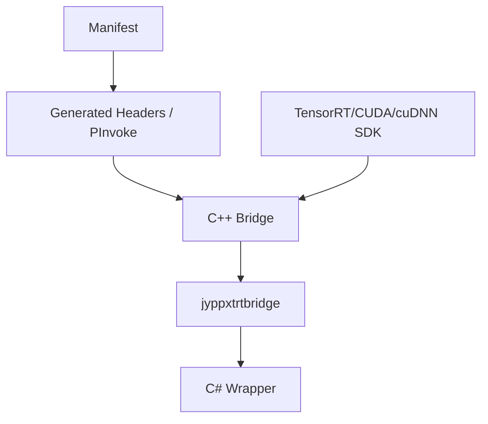

# 从源码编译 TensorRT CSharp API v4.0 C++ Bridge

<!-- public-article-layout:start -->
<style>
.content article { min-width: 0; overflow-wrap: anywhere; }
.content article a, .content article :not(pre) > code { overflow-wrap: anywhere; word-break: break-word; }
.content article pre:not(.mermaid), .content article table { display: block; max-width: 100%; overflow-x: auto; }
.content pre.mermaid { max-width: 640px; margin: 16px auto; overflow-x: auto; }
.content pre.mermaid svg { display: block; width: 100%; max-width: 640px; height: auto; }
</style>
<!-- public-article-layout:end -->

> 文章编号：`MSC-006`；适用版本：TensorRT CSharp API v4.0 `4.0.0`；当前状态：`ready`。

## 1. 前言
<!-- public-article-project-preface:start -->
TensorRT CSharp API v4.0 是一个面向 C#/.NET 开发者的 TensorRT 与 CUDA 工程化接口项目。它把 NVIDIA 原生运行时、生成式绑定、C++ Bridge、托管对象模型和可验证的示例程序组织成一条完整链路，使使用者可以在熟悉的 .NET 项目中完成 Engine 构建、反序列化、ExecutionContext 管理、CUDA 内存操作、异步流同步和结果校验。项目的目标不是隐藏 TensorRT 的概念，而是把这些概念转换为有明确生命周期、所有权和错误边界的 C# API。

4.0.0 是一次完整重构后的正式版本。核心接口、Bridge 边界、Runtime 包命名、样例目录和验证方式都以 4.x 设计为准，不能把 3.x 的类型名、旧包名或旧 DLL 目录直接复制到新项目。托管包只提供项目接口和自有 Bridge；TensorRT、CUDA、cuDNN、显卡驱动以及对应许可证仍由使用者按目标平台安装和管理。

单篇文章也应能够独立阅读：读者可以先从项目入口确认源码和包，再根据本文的程序路径准备依赖，最后用输出中的状态、计数、Shape、哈希或结果图片判断流程是否真的完成。对于尚未具备兼容 GPU 的环境，本文会把静态检查、期望输出和真实运行结果分开标记，不把帮助命令或 build-only 结果包装成推理成功。

项目、包和源码入口（以下地址保留明文，便于复制到不完整支持 Markdown 链接的平台）：

项目主页：

```text
https://github.com/guojin-yan/TensorRT-CSharp-API/tree/TensorRtSharp4.0
```

核心 NuGet：

```text
https://www.nuget.org/packages/JYPPX.TensorRT.CSharp.API/4.0.0
```

Runtime Bridge 包列表：

```text
https://www.nuget.org/packages?q=+JYPPX.TensorRT.CSharp&includeComputedFrameworks=true&prerel=true&sortby=relevance
```

运行库清单：

```text
https://github.com/guojin-yan/TensorRT-CSharp-API/blob/TensorRtSharp4.0/pack/runtime/runtime-packages.manifest.json
```

### 1.1 程序出处与输出说明

本文涉及的程序、脚本或命令均以仓库中的实现为准；对应源码入口：

```text
https://github.com/guojin-yan/TensorRT-CSharp-API/tree/TensorRtSharp4.0
```

运行示例必须同时给出程序输出和判定标准。终端中的 `status`、`Ready`、`Bound`、`enqueueCount`、`OutputMatch`、进程退出码、报告文件或结果图片分别说明不同层次的事实；只有明确写出这些结果，读者才能区分程序启动、Engine 构建、GPU enqueue 和业务结果语义。
<!-- public-article-project-preface:end -->

大多数用户只需安装正式 NuGet 包；需要修改 native API、调试 TensorRT/CUDA 版本适配、验证自有 SDK 安装或为新平台构建 Bridge 时，才需要进入源码编译路径。这个过程既包含 CMake，也包含 manifest 生成、托管层编译和原生依赖检查。

TensorRT CSharp API v4.0：<https://github.com/guojin-yan/TensorRT-CSharp-API> 使用 C++ Bridge 隔离 NVIDIA C++ ABI，并通过生成式 P/Invoke 与 C# 高层 wrapper 对外提供能力。本文给出 Windows 和 Linux 的完整构建主线，所有命令均从仓库根目录执行。

### 1.2 项目、包与源码入口

| 项目 | 链接 |
| --- | --- |
| GitHub 项目 | TensorRT-CSharp-API：<https://github.com/guojin-yan/TensorRT-CSharp-API> |
| 核心包 | `JYPPX.TensorRT.CSharp.API 4.0.0`：<https://www.nuget.org/packages/JYPPX.TensorRT.CSharp.API/4.0.0> |
| Native 源码 | `native`：<https://github.com/guojin-yan/TensorRT-CSharp-API/tree/TensorRtSharp4.0/native> |
| Binding Generator | `tools/JYPPX.BindingGenerator`：<https://github.com/guojin-yan/TensorRT-CSharp-API/tree/TensorRtSharp4.0/tools/JYPPX.BindingGenerator> |
| 构建预设 | `CMakePresets.json`：<https://github.com/guojin-yan/TensorRT-CSharp-API/blob/TensorRtSharp4.0/CMakePresets.json> |
| Runtime 矩阵 | `runtime-packages.manifest.json`：<https://github.com/guojin-yan/TensorRT-CSharp-API/blob/TensorRtSharp4.0/pack/runtime/runtime-packages.manifest.json> |

## 2. 你正在构建哪一层



| 产物 | 来源 | 是否包含 NVIDIA 厂商库 |
| --- | --- | --- |
| `JYPPX.TensorRtSharp.dll` 等 | .NET build | 否 |
| `jyppxtrtbridge.dll` / `libjyppxtrtbridge.so` | CMake build | 否 |
| TensorRT/CUDA/cuDNN 动态库 | 用户安装的 SDK/runtime | 不由项目生成或打包 |

源码构建证明当前 toolchain 能编译项目 Bridge，不自动证明生成的库能在其它机器运行，也不等于公开包验证。

## 3. 通用准备

1. 克隆或切换到与目标版本一致的源码提交。
2. 安装 `global.json` 所要求的 .NET SDK。
3. 安装 CMake 3.27 或更高版本。
4. 安装与目标 lane 完全匹配的 TensorRT、CUDA 和 cuDNN。
5. 确定 `MSC-005` 中的 runtime key，再选择同名语义的 CMake preset。

先确认工具：

```powershell
dotnet --info
cmake --version
cmake --list-presets
```

当前仓库应列出 Windows 与 Linux 的 TensorRT 8/10/11、CUDA 11/12/13 预设。本文已在当前提交执行 `cmake --list-presets` 并确认 13 个 configure presets 可被 CMake 识别；这只是预设语法检查，不是 13 条 native lane 全部编译通过。

## 4. Windows 环境

### 4.1 必需工具

| 工具 | 要求 |
| --- | --- |
| Windows | Windows 10/11 x64 |
| Visual Studio | 2022，安装 Desktop development with C++ |
| MSVC/SDK | 由 VS 2022 workload 提供 |
| CMake | 3.27+ |
| .NET | 以 `global.json` 为准 |
| NVIDIA SDK | 与目标 TensorRT/CUDA/cuDNN lane 一致 |

### 4.2 显式指定 SDK 根目录

```powershell
$env:JYPPX_TENSORRT_ROOT = '<TensorRT 安装目录>'
$env:JYPPX_CUDA_ROOT = '<CUDA 安装目录>'
$env:JYPPX_CUDNN_ROOT = '<cuDNN 安装目录>'
$env:JYPPX_ENABLE_DEVELOPMENT_PROBING = '1'
```

不要在同一 shell 中把 TensorRT 8 的 include、TensorRT 11 的 lib 和另一套 CUDA bin 混在 `PATH`。每次切换 lane 时重新核对三个根目录。

## 5. Linux 环境

Linux 需要 C++ 编译器、Ninja、CMake、.NET SDK 和匹配的 NVIDIA developer packages。示例：

```bash
export JYPPX_TENSORRT_ROOT=/opt/tensorrt/ubuntu22.04/trt10.11-cuda12.9-cudnn9.22
export JYPPX_CUDA_ROOT=/usr/local/cuda-12.9
export JYPPX_CUDNN_ROOT=/opt/cudnn/ubuntu22.04/cuda12
export JYPPX_ENABLE_DEVELOPMENT_PROBING=1
```

实际路径以本机安装方式为准。Ubuntu 版本会进入正式包名，但 Linux CMake preset 主要按 TensorRT/CUDA line 区分；发行版差异由构建执行环境和依赖安装共同约束。

## 6. 选择 Preset

| 目标 | Configure/Build preset |
| --- | --- |
| Windows TRT 8 + CUDA 11.8 | `win-x64-trt8-cuda11-release` |
| Windows TRT 8 + CUDA 12.1 | `win-x64-trt8-cuda12-release` |
| Windows TRT 10 + CUDA 11.8 | `win-x64-trt10-cuda11-release` |
| Windows TRT 10 + CUDA 12.9 | `win-x64-trt10-cuda12-release` |
| Windows TRT 11 + CUDA 12.9 | `win-x64-trt11-cuda12-release` |
| Windows TRT 11 + CUDA 13.2 | `win-x64-trt11-cuda13-release` |
| Linux 对应组合 | 将前缀改为 `linux-x64-` |

不要手写一套与正式矩阵不同的临时 cache variables 后仍把产物标成正式 Bridge。新增组合应先更新 manifest、preset、测试和发布策略。

## 7. 生成绑定

修改 manifest、native header、entrypoint 或 interop 形状后运行：

```powershell
pwsh -NoProfile -ExecutionPolicy Bypass -File .\eng\Generate-Bindings.ps1
pwsh -NoProfile -ExecutionPolicy Bypass -File .\eng\Test-BindingGeneratorOutputs.ps1
pwsh -NoProfile -ExecutionPolicy Bypass -File .\eng\Export-InterfaceCoverageMatrix.ps1
```

重要输出包括：

| 文件 | 用途 |
| --- | --- |
| `native/generated/bridge_api_catalog.g.h` | 原生 API catalog |
| `src/JYPPX.Shared/Generated/GeneratedEntryPointNames.g.cs` | 托管入口名称常量 |
| `src/JYPPX.TensorRtSharp/Internal/Interop/Generated/NativeMethodsTensorRt.Generated.g.cs` | TensorRT P/Invoke 声明 |

不要直接修改 generated 文件。生成检查失败时，应修 manifest 或 generator，再重新生成。

## 8. Windows 编译示例

以 TensorRT 10.11 + CUDA 12.9 + cuDNN 9.22 为例：

```powershell
cmake --preset win-x64-trt10-cuda12-release
cmake --build --preset win-x64-trt10-cuda12-release --parallel
```

典型输出目录：

```text
build-out/win-x64-trt10-cuda12-release/bin/Release/
build-out/win-x64-trt10-cuda12-release/lib/Release/
```

至少检查：

```powershell
Get-Item .\build-out\win-x64-trt10-cuda12-release\bin\Release\jyppxtrtbridge.dll
dumpbin /dependents .\build-out\win-x64-trt10-cuda12-release\bin\Release\jyppxtrtbridge.dll
```

`dumpbin` 中的 `nvinfer_10.dll`、`nvonnxparser_10.dll`、`cudart64_12.dll` 等依赖必须与目标 lane 一致。

## 9. Linux 编译示例

```bash
cmake --preset linux-x64-trt10-cuda12-release
cmake --build --preset linux-x64-trt10-cuda12-release --parallel
```

检查输出和依赖：

```bash
find build-out/linux-x64-trt10-cuda12-release -name 'libjyppxtrtbridge.so' -print
ldd build-out/linux-x64-trt10-cuda12-release/lib/libjyppxtrtbridge.so
```

实际 `.so` 位置以 CMake 输出为准。`ldd` 出现 `not found` 时，先修复 TensorRT/CUDA/cuDNN 搜索路径，不要把缺失依赖复制成无来源的零散文件。

## 10. 编译托管层

```powershell
dotnet restore .\TensorRtSharp.sln
dotnet build .\TensorRtSharp.sln -c Release --no-restore /p:UseSharedCompilation=false
```

涉及 Native ABI 时再运行质量测试：

```powershell
dotnet build .\tests\JYPPX.ProjectQuality.Tests\JYPPX.ProjectQuality.Tests.csproj `
  -c Release --no-restore /p:UseSharedCompilation=false

dotnet test .\tests\JYPPX.ProjectQuality.Tests\JYPPX.ProjectQuality.Tests.csproj `
  -c Release --no-build `
  --filter "FullyQualifiedName~TensorRtNativeAbiSurfaceParityTests|FullyQualifiedName~NativeVendorBoundaryGuardTests|FullyQualifiedName~NativeBridgePathResolverTests"
```

## 11. 运行最小 Smoke

先用不依赖外部模型的样例确认 Bridge 与执行主线：

```powershell
dotnet run --project .\samples\Inference\01.Bindings\InferenceBindings.csproj `
  -c Release -- --tensor-rt-line 10 --batch 2
```

有效结果应包含 TensorRT line、输入输出元数据、readiness、enqueue 和 `OutputMatch=True`。`Skipped=True`、dependency probe 或只完成 network build 都不能写成运行通过。

## 12. 本地包验证

源码目录中能加载 Bridge，不代表 NuGet 消费端的 native copy 正确。需要打包时，至少分三层记录：

1. `dotnet pack` 生成核心包与对应 `.Bridge` 包；
2. 一个没有 `ProjectReference` 的新项目仅通过 PackageReference restore/build；
3. 消费项目运行最小 Engine，并验证输出。

正式 4.0.0 不允许把 TensorRT、CUDA、cuDNN 或 NVRTC 放进 Bridge nupkg。检查包内容时只能看到项目自有动态库与必要的 NuGet 元数据。

## 13. 常见构建错误

| 错误 | 常见原因 | 处理 |
| --- | --- | --- |
| `NvInfer.h` 找不到 | TensorRT root 错误 | 检查 `JYPPX_TENSORRT_ROOT` |
| `nvonnxparser.lib` 找不到 | SDK 不完整或 line 混用 | 使用同一 TensorRT SDK 的 include/lib/bin |
| `cudart64_*.dll` 找不到 | CUDA bin 不可发现 | 检查 CUDA root 与 `PATH` |
| CMake 找不到 VS generator | 未安装 C++ workload | 补装 VS 2022 Desktop C++ |
| 链接符号不匹配 | header 与 lib 来自不同版本 | 清理该 preset 输出后用统一 SDK 重配 |
| 程序报 CUDA error 35 | 驱动不支持目标 runtime | 更新驱动或选择兼容 CUDA lane |
| Bridge 加载但 vendor DLL 失败 | 传递依赖缺失 | 使用 `dumpbin`/`ldd` 逐层检查 |

若要清理单个 preset 的输出，只针对已确认的 `build-out/<preset>` 目录操作；不要删除仓库根目录或其它 lane 的构建证据。

## 14. 提交前清单

- [ ] runtime key、preset 和本机 SDK 版本一致。
- [ ] 生成文件来自 generator，没有手工修改。
- [ ] CMake configure/build 日志已保存。
- [ ] `dumpbin` 或 `ldd` 未显示错误版本/缺失依赖。
- [ ] 托管解决方案和相关质量测试通过。
- [ ] 至少一个无外部模型 smoke 完成 enqueue 与输出比较。
- [ ] 若生成 NuGet，确认包内不含 NVIDIA 厂商运行库。
- [ ] 未把源码构建结果误写成公开包或 post-publish 证明。

## 15. 总结

从源码编译 TensorRT CSharp API v4.0 Bridge 的正确顺序是：确定版本矩阵、准备匹配 SDK、生成绑定、使用仓库 preset 编译 C++、检查动态库依赖、编译托管层，再运行最小 smoke。每一步回答的问题不同；只有目标机器上的真实 enqueue 和输出校验，才能说明该构建在当前环境中完成了运行闭环。

<!-- public-article-declaration:start -->
## 16. 文章声明

### 16.1 开源协议声明
作者所有开源项目代码均遵循 Apache License 2.0 开源协议。
特别说明：本项目集成了若干第三方库。若任何第三方库的许可协议与 Apache 2.0 协议存在冲突或不一致，均以该第三方库的原始许可协议为准。本项目不包含也不代表这些第三方库的授权声明，使用前请务必阅读并遵守第三方库的相关许可。

### 16.2 代码开发与质量说明
AI 辅助开发：本代码在开发过程中使用了人工智能（AI）辅助生成与优化，并非完全由人工逐行编写。
安全性承诺：作者郑重声明，本代码中绝无任何有意设置的后门、病毒、木马或旨在破坏用户设备、窃取数据的恶意代码。
技术局限性：受限于作者个人的技术水平与能力，代码中可能存在因逻辑不严谨、优化不足或经验欠缺导致的低级问题（例如但不限于内存泄漏、偶发崩溃、资源未释放等）。这些问题纯属能力不足所致，并非主观故意。
测试范围：由于作者精力有限，未对本软件进行全方位、覆盖所有边缘场景的完整测试。

### 16.3 免责声明（重要）
请在将本代码应用于任何实际项目（特别是商业、工业或关键任务环境）之前，务必进行详尽、严格的自行测试与验证。 鉴于上述可能存在的代码缺陷及测试覆盖不足，因使用本代码而导致的任何直接或间接损失（包括但不限于设备故障、数据丢失、系统瘫痪或利润损失等），本作者概不负责。 一旦您开始使用本代码，即表示您已知晓上述风险并同意自行承担一切后果，相关问题与本作者无关。

### 16.4 代码开源范围
本项目承诺核心逻辑代码完全开源，但上述提到的“第三方库”的二进制文件、源代码或相关资源不在本项目的开源义务范围内，请根据其各自的指引获取。

### 16.5 社区与反馈
尽管存在上述不足，我们仍欢迎大家下载使用、提交 Issue 或参与测试，共同完善项目。如果您在使用过程中发现 Bug、内存溢出或有改进建议，欢迎通过项目主页提供的联系方式与作者取得联系，我们将尽力在有限的时间内提供协助。


<!-- public-article-declaration:end -->
