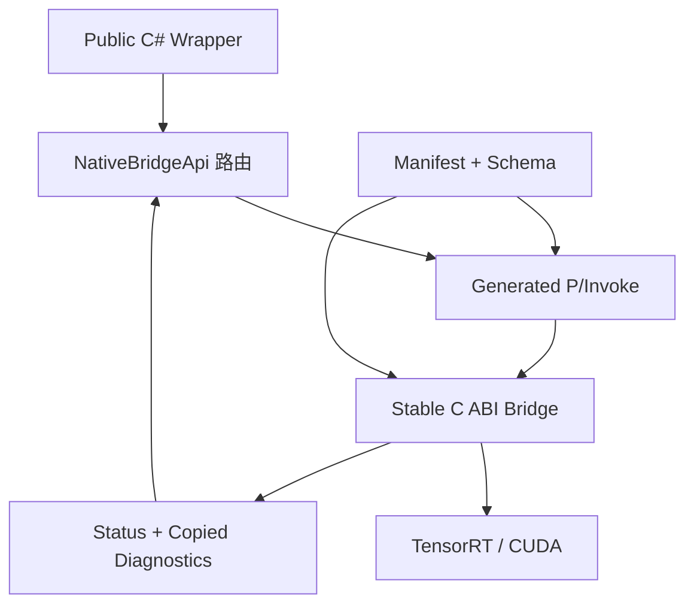

# 为什么 TensorRT CSharp API v4.0 不是简单的 P/Invoke 封装

<!-- public-article-layout:start -->
<style>
.content article { min-width: 0; overflow-wrap: anywhere; }
.content article a, .content article :not(pre) > code { overflow-wrap: anywhere; word-break: break-word; }
.content article pre:not(.mermaid), .content article table { display: block; max-width: 100%; overflow-x: auto; }
.content pre.mermaid { max-width: 640px; margin: 16px auto; overflow-x: auto; }
.content pre.mermaid svg { display: block; width: 100%; max-width: 640px; height: auto; }
</style>
<!-- public-article-layout:end -->

> 文章编号：`MSC-002`；适用版本：TensorRT CSharp API v4.0 `4.0.0`；当前状态：`ready`。

## 1. 前言
<!-- public-article-project-preface:start -->
TensorRT CSharp API v4.0 是一个面向 C#/.NET 开发者的 TensorRT 与 CUDA 工程化接口项目。它把 NVIDIA 原生运行时、生成式绑定、C++ Bridge、托管对象模型和可验证的示例程序组织成一条完整链路，使使用者可以在熟悉的 .NET 项目中完成 Engine 构建、反序列化、ExecutionContext 管理、CUDA 内存操作、异步流同步和结果校验。项目的目标不是隐藏 TensorRT 的概念，而是把这些概念转换为有明确生命周期、所有权和错误边界的 C# API。

4.0.0 是一次完整重构后的正式版本。核心接口、Bridge 边界、Runtime 包命名、样例目录和验证方式都以 4.x 设计为准，不能把 3.x 的类型名、旧包名或旧 DLL 目录直接复制到新项目。托管包只提供项目接口和自有 Bridge；TensorRT、CUDA、cuDNN、显卡驱动以及对应许可证仍由使用者按目标平台安装和管理。

单篇文章也应能够独立阅读：读者可以先从项目入口确认源码和包，再根据本文的程序路径准备依赖，最后用输出中的状态、计数、Shape、哈希或结果图片判断流程是否真的完成。对于尚未具备兼容 GPU 的环境，本文会把静态检查、期望输出和真实运行结果分开标记，不把帮助命令或 build-only 结果包装成推理成功。

项目、包和源码入口（以下地址保留明文，便于复制到不完整支持 Markdown 链接的平台）：

项目主页：

```text
https://github.com/guojin-yan/TensorRT-CSharp-API/tree/TensorRtSharp4.0
```

核心 NuGet：

```text
https://www.nuget.org/packages/JYPPX.TensorRT.CSharp.API/4.0.0
```

Runtime Bridge 包列表：

```text
https://www.nuget.org/packages?q=+JYPPX.TensorRT.CSharp&includeComputedFrameworks=true&prerel=true&sortby=relevance
```

运行库清单：

```text
https://github.com/guojin-yan/TensorRT-CSharp-API/blob/TensorRtSharp4.0/pack/runtime/runtime-packages.manifest.json
```

### 1.1 程序出处与输出说明

本文涉及的程序、脚本或命令均以仓库中的实现为准；对应源码入口：

```text
https://github.com/guojin-yan/TensorRT-CSharp-API/tree/TensorRtSharp4.0
```

运行示例必须同时给出程序输出和判定标准。终端中的 `status`、`Ready`、`Bound`、`enqueueCount`、`OutputMatch`、进程退出码、报告文件或结果图片分别说明不同层次的事实；只有明确写出这些结果，读者才能区分程序启动、Engine 构建、GPU enqueue 和业务结果语义。
<!-- public-article-project-preface:end -->

把原生函数声明成 `[DllImport]`，只解决了“托管代码如何跳到一个导出符号”。一套可长期升级的 TensorRT C# API 还必须解决 C++ 虚函数 ABI、对象所有权、跨版本差异、异常边界、字符串与数组复制、CUDA 异步生命周期以及离开源码树后的原生库加载。

TensorRT CSharp API v4.0：<https://github.com/guojin-yan/TensorRT-CSharp-API> 因此采用 manifest 驱动的 C ABI Bridge、generated interop 和 owner-safe 高层 wrapper。本文从一条调用的完整路径解释这个设计，以及它为何比直接 P/Invoke 多做了必要的工程工作。

### 1.2 项目、包与源码入口

| 项目 | 链接 |
| --- | --- |
| GitHub 项目 | TensorRT-CSharp-API：<https://github.com/guojin-yan/TensorRT-CSharp-API> |
| 核心托管包 | `JYPPX.TensorRT.CSharp.API 4.0.0`：<https://www.nuget.org/packages/JYPPX.TensorRT.CSharp.API/4.0.0> |
| Runtime Bridge 包 | JYPPX NuGet 包列表：<https://www.nuget.org/profiles/JYPPX> |
| Native manifests | 目录：<https://github.com/guojin-yan/TensorRT-CSharp-API/tree/TensorRtSharp4.0/native/manifests> |
| Native Bridge | 目录：<https://github.com/guojin-yan/TensorRT-CSharp-API/tree/TensorRtSharp4.0/native/src> |
| 高层 TensorRT wrapper | 目录：<https://github.com/guojin-yan/TensorRT-CSharp-API/tree/TensorRtSharp4.0/src/JYPPX.TensorRtSharp> |
| 高层 CUDA wrapper | 目录：<https://github.com/guojin-yan/TensorRT-CSharp-API/tree/TensorRtSharp4.0/src/JYPPX.CudaSharp> |

## 2. 直接 P/Invoke 留下的七个问题

1. TensorRT C++ interface 的虚函数布局能否跨版本和编译器稳定调用？
2. 返回的 builder、network、engine、context 由谁释放，父对象能否提前释放？
3. TensorRT 8、10、11 中同名概念是否具有相同 flag、参数和行为？
4. C++ exception 或 Windows SEH 是否会穿过托管边界？
5. `char*`、数组和 borrowed pointer 在调用返回后是否还有效？
6. CUDA stream 上的异步工作结束前，buffer 和 callback owner 是否仍然存活？
7. NuGet 消费端如何加载正确的 Bridge，并找到与之匹配的 NVIDIA 依赖？

如果这些问题没有统一答案，`DllImport` 越多，业务层承担的隐含约束就越多。

## 3. 五层调用链



| 层 | 责任 | 典型位置 |
| --- | --- | --- |
| Manifest | 定义入口、版本、参数方向和 ownership | `native/manifests` |
| C ABI | 提供稳定导出形状，隔离 vendor C++ ABI | `native/include`、`native/src` |
| Generated Interop | 生成 P/Invoke、entrypoint 名称与 catalog | `src/JYPPX.Shared/Generated` |
| NativeBridgeApi | 按 API line 路由并处理状态 | `src/JYPPX.TensorRtSharp/Internal/Interop` |
| Public Wrapper | 参数、对象关系、托管集合与易用 API | `src/JYPPX.TensorRtSharp`、`src/JYPPX.CudaSharp` |

`eng/Generate-Bindings.ps1` 根据 manifest 生成互操作输出，一致性检查会发现重复入口、缺字段和生成漂移。入口定义不再散落为难以审计的字符串。

## 4. 为什么要加一层 C ABI Bridge

TensorRT 的 Builder、Runtime、Engine 等核心对象是 C++ interface。直接在 C# 中模拟 vtable，会把托管 API 绑定到特定头文件、编译器和函数槽位。一旦 NVIDIA 在新版本中增删方法或改变布局，即使 DLL 成功加载，也可能调用到错误位置。

项目 Bridge 只导出 C 调用约定函数，并把 vendor 对象封装为受检查的 bridge object。调用前会验证：

- handle 不为 null；
- magic 表明对象由当前 Bridge 创建；
- API line 是 TensorRT 8、10 或 11 的预期版本；
- object kind 是 builder、runtime、engine 或 context 等正确类型。

因此，把 TensorRT 10 Engine 误传给 TensorRT 11 Context 路径时，系统可以返回明确的 invalid argument，而不是把错误留给未定义行为。

## 5. 异常不能跨越 P/Invoke

C++ exception 穿越 P/Invoke 没有可靠契约，Windows 原生库还可能触发 structured exception。Bridge 在原生边界捕获异常并保存线程诊断，再返回稳定 status；托管层通过 `NativeStatus.ThrowIfFailed` 读取分类和消息，转换为可理解的 .NET 异常。

错误信息至少应回答：

- 哪一层失败：Bridge 加载、依赖加载、参数检查还是 vendor 调用；
- 属于什么类别：缺依赖、版本不匹配、无效对象或运行时错误；
- 当前期待哪条 TensorRT API line；
- 下一步应该检查包、驱动还是输入。

这比直接暴露 `EntryPointNotFoundException` 或 `AccessViolationException` 更适合生产排障。

## 6. 字符串、数组与快照必须复制

Vendor API 常返回 borrowed `char*` 或内部数组。若把这些地址直接交给 C#，父对象释放、下次调用或线程切换都可能让指针失效。TensorRT CSharp API v4.0 优先使用三种稳定模式：

| 模式 | 做法 | 适用数据 |
| --- | --- | --- |
| Caller buffer | 先查询长度，再复制 UTF-8 | 名称、错误消息 |
| Count/copy | 先查询元素数，再复制固定布局数组 | tensor、profile、plugin 元数据 |
| Copied snapshot | 转换为托管 record/class | 诊断、只读状态、报告 |

“复制”会增加一点调用成本，但它切断了 borrowed pointer 对业务代码的生命周期要求。高频执行数据仍通过明确的 CUDA device memory 路径处理，不会把大 tensor 当元数据反复复制。

## 7. `IDisposable` 之前必须先定义 Ownership

仅给类加 `Dispose` 并不能自动解决所有权。项目区分：

- owner：创建并最终释放 native 对象；
- borrower：临时使用 owner，不能独立销毁底层对象；
- copied snapshot：离开 native owner 后仍可安全读取；
- leased resource：异步或子对象使用期间阻止 owner 过早释放。

例如 `TensorRtBuilder` 创建 native builder，但 TensorRT 会借用 logger。wrapper 会保存 logger keep-alive，并在 builder 构造和释放时登记 borrower。`TensorRtInferenceBindings` 则保存 Engine/Context 与显存 owner，使绑定和执行期间的资源关系更明确。

```csharp
using var logger = new TensorRtLogger(TensorRtApiLine.TensorRt10);
using var builder = new TensorRtBuilder(logger);
using var network = builder.CreateNetwork(stronglyTyped: false);
using var config = builder.CreateBuilderConfig();
```

这里声明顺序很重要：作用域退出时会逆序释放，logger 最后离开。

## 8. CUDA 异步执行改变了生命周期规则

`EnqueueAsync` 返回只表示工作已排入 CUDA stream，不表示 GPU 已完成读取输入或写出输出。以下代码是危险思路：

```csharp
context.EnqueueAsync(stream);
// 不能在未同步、未建立其它完成依赖时释放 input/output memory。
```

正确路径需要同步 stream 或使用 event 建立可证明的完成关系，然后读取输出和释放资源：

```csharp
bindings.EnqueueAsync(stream, synchronize: true);
float[] output = bindings.ReadOutputSingles("output", elementCount);
```

高层 wrapper 不能消除 CUDA 的异步语义，但可以让资源 owner、stream 和执行动作以有语义的类型出现。

## 9. 跨版本不是一个 `if` 能解决

TensorRT 8、10、11 在显式 batch、strongly typed、binding API、序列化、layer 能力和废弃接口方面存在差异。4.0.0 使用 `TensorRtApiLine` 与独立 native adapter 路由，不假设数值相同的 enum 就能直接复用。

跨版本策略是：

1. 能安全映射的高层语义由 wrapper 统一。
2. 仅某条 line 支持的能力明确限定版本。
3. 已删除能力抛出 `NotSupportedException` 或保持 parse-only 诊断。
4. 对象组合时检查 line，不允许不同版本 handle 混用。
5. Engine plan 仍与构建版本、GPU 和 compatibility policy 相关。

这种设计可能比“所有方法都显示出来”更保守，但避免了假支持。

## 10. Native 加载也属于 API 契约

实际加载链大致为：

```text
应用 -> JYPPX.TensorRT.CSharp.API
     -> jyppxtrtbridge.dll / libjyppxtrtbridge.so
     -> nvinfer / nvonnxparser / cudart / cuDNN
     -> NVIDIA driver
```

正式 `.Bridge` 包只负责第二层的项目自有动态库。它不携带 NVIDIA runtime，所以“Bridge 文件已经复制”与“全部 vendor dependency 可加载”是两个不同结论。包名把 RID、Ubuntu、TensorRT、CUDA 和 cuDNN 组合编码进去，消费端应精确选择，不能只看最新版本号。

## 11. 一条 API 如何闭环

以“读取 Engine I/O tensor 列表”为例，真正的完成不是增加一个 P/Invoke 声明，而是：

1. Manifest 定义入口、参数和版本线。
2. Generator 产生 entrypoint 与托管声明。
3. C ABI 实现检查 Engine handle 和 API line。
4. Native 调用 vendor API，使用 count/copy 复制元数据。
5. `NativeBridgeApi` 检查 status 并映射结构。
6. `TensorRtEngine.GetIOTensors()` 返回托管集合。
7. 测试或样例覆盖空集合、正常集合、错误 line 和 owner 释放边界。

任何一步缺失，都只能说明某一层存在，不能宣传为高层可用功能。

## 12. Bridge 设计的代价

这套架构不是没有成本：

- 需要维护 manifest、C++ Bridge、generated interop 和 wrapper 多层代码；
- 每条 TensorRT line 都要单独编译和验证；
- 快照复制比返回裸指针多一次内存操作；
- 保守的 ownership/版本 guard 会拒绝一些“也许能跑”的调用。

这些成本换来的是可诊断失败、明确对象关系和可独立升级的 ABI 边界。对长生命周期的 .NET 库而言，这比把不稳定性分散到每个用户项目更可控。

## 13. 如何验证不是“纸面架构”

维护者可以从四层分别检查：

```powershell
pwsh -NoProfile -ExecutionPolicy Bypass -File .\eng\Generate-Bindings.ps1 -Check
cmake --list-presets
dotnet build .\TensorRtSharp.sln -c Release --no-restore
pwsh -NoProfile -ExecutionPolicy Bypass -File .\eng\Test-PublicArticleIndex.ps1
```

其中生成检查证明声明一致，CMake 证明预设可见，托管构建证明代码可编译，文章索引证明公开入口完整。它们都不能单独替代目标 GPU 上的 enqueue、输出数值或公开包消费验证。

## 14. 总结

简单 P/Invoke 解决“怎么调用符号”，TensorRT CSharp API v4.0 要解决的是“怎么把 TensorRT/CUDA 变成可维护的 .NET 工程接口”。C ABI Bridge 负责 ABI 与异常边界，generated interop 负责声明一致性，高层 wrapper 负责生命周期与语义，Bridge 包矩阵负责部署选择，样例和输出校验负责验证真实行为。多出的这些层，正是 4.0.0 能作为全新一代 API 的基础。

<!-- public-article-declaration:start -->
## 15. 文章声明

### 15.1 开源协议声明
作者所有开源项目代码均遵循 Apache License 2.0 开源协议。
特别说明：本项目集成了若干第三方库。若任何第三方库的许可协议与 Apache 2.0 协议存在冲突或不一致，均以该第三方库的原始许可协议为准。本项目不包含也不代表这些第三方库的授权声明，使用前请务必阅读并遵守第三方库的相关许可。

### 15.2 代码开发与质量说明
AI 辅助开发：本代码在开发过程中使用了人工智能（AI）辅助生成与优化，并非完全由人工逐行编写。
安全性承诺：作者郑重声明，本代码中绝无任何有意设置的后门、病毒、木马或旨在破坏用户设备、窃取数据的恶意代码。
技术局限性：受限于作者个人的技术水平与能力，代码中可能存在因逻辑不严谨、优化不足或经验欠缺导致的低级问题（例如但不限于内存泄漏、偶发崩溃、资源未释放等）。这些问题纯属能力不足所致，并非主观故意。
测试范围：由于作者精力有限，未对本软件进行全方位、覆盖所有边缘场景的完整测试。

### 15.3 免责声明（重要）
请在将本代码应用于任何实际项目（特别是商业、工业或关键任务环境）之前，务必进行详尽、严格的自行测试与验证。 鉴于上述可能存在的代码缺陷及测试覆盖不足，因使用本代码而导致的任何直接或间接损失（包括但不限于设备故障、数据丢失、系统瘫痪或利润损失等），本作者概不负责。 一旦您开始使用本代码，即表示您已知晓上述风险并同意自行承担一切后果，相关问题与本作者无关。

### 15.4 代码开源范围
本项目承诺核心逻辑代码完全开源，但上述提到的“第三方库”的二进制文件、源代码或相关资源不在本项目的开源义务范围内，请根据其各自的指引获取。

### 15.5 社区与反馈
尽管存在上述不足，我们仍欢迎大家下载使用、提交 Issue 或参与测试，共同完善项目。如果您在使用过程中发现 Bug、内存溢出或有改进建议，欢迎通过项目主页提供的联系方式与作者取得联系，我们将尽力在有限的时间内提供协助。


<!-- public-article-declaration:end -->
