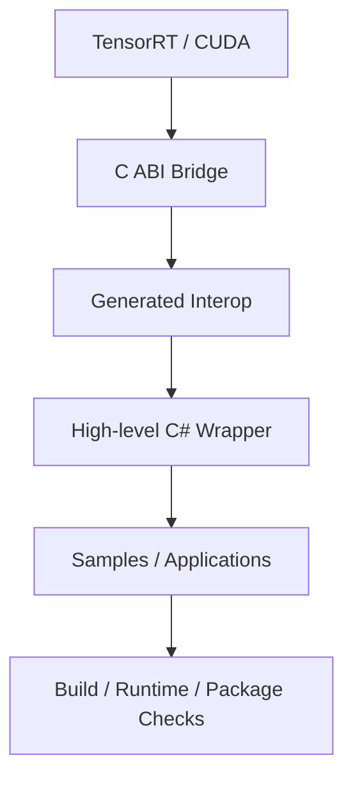

# TensorRT CSharp API v4.0 是什么：面向 C#/.NET 的 TensorRT 与 CUDA 工程化接口

<!-- public-article-layout:start -->
<style>
.content article { min-width: 0; overflow-wrap: anywhere; }
.content article a, .content article :not(pre) > code { overflow-wrap: anywhere; word-break: break-word; }
.content article pre:not(.mermaid), .content article table { display: block; max-width: 100%; overflow-x: auto; }
.content pre.mermaid { max-width: 640px; margin: 16px auto; overflow-x: auto; }
.content pre.mermaid svg { display: block; width: 100%; max-width: 640px; height: auto; }
</style>
<!-- public-article-layout:end -->

> 文章编号：`MSC-001`；适用版本：TensorRT CSharp API v4.0 `4.0.0`；当前状态：`ready`。

## 1. 前言
<!-- public-article-project-preface:start -->
TensorRT CSharp API v4.0 是一个面向 C#/.NET 开发者的 TensorRT 与 CUDA 工程化接口项目。它把 NVIDIA 原生运行时、生成式绑定、C++ Bridge、托管对象模型和可验证的示例程序组织成一条完整链路，使使用者可以在熟悉的 .NET 项目中完成 Engine 构建、反序列化、ExecutionContext 管理、CUDA 内存操作、异步流同步和结果校验。项目的目标不是隐藏 TensorRT 的概念，而是把这些概念转换为有明确生命周期、所有权和错误边界的 C# API。

4.0.0 是一次完整重构后的正式版本。核心接口、Bridge 边界、Runtime 包命名、样例目录和验证方式都以 4.x 设计为准，不能把 3.x 的类型名、旧包名或旧 DLL 目录直接复制到新项目。托管包只提供项目接口和自有 Bridge；TensorRT、CUDA、cuDNN、显卡驱动以及对应许可证仍由使用者按目标平台安装和管理。

单篇文章也应能够独立阅读：读者可以先从项目入口确认源码和包，再根据本文的程序路径准备依赖，最后用输出中的状态、计数、Shape、哈希或结果图片判断流程是否真的完成。对于尚未具备兼容 GPU 的环境，本文会把静态检查、期望输出和真实运行结果分开标记，不把帮助命令或 build-only 结果包装成推理成功。

项目、包和源码入口（以下地址保留明文，便于复制到不完整支持 Markdown 链接的平台）：

项目主页：

```text
https://github.com/guojin-yan/TensorRT-CSharp-API/tree/TensorRtSharp4.0
```

核心 NuGet：

```text
https://www.nuget.org/packages/JYPPX.TensorRT.CSharp.API/4.0.0
```

Runtime Bridge 包列表：

```text
https://www.nuget.org/packages?q=+JYPPX.TensorRT.CSharp&includeComputedFrameworks=true&prerel=true&sortby=relevance
```

运行库清单：

```text
https://github.com/guojin-yan/TensorRT-CSharp-API/blob/TensorRtSharp4.0/pack/runtime/runtime-packages.manifest.json
```

### 1.1 程序出处与输出说明

本文涉及的程序、脚本或命令均以仓库中的实现为准；对应源码入口：

```text
https://github.com/guojin-yan/TensorRT-CSharp-API/tree/TensorRtSharp4.0
```

运行示例必须同时给出程序输出和判定标准。终端中的 `status`、`Ready`、`Bound`、`enqueueCount`、`OutputMatch`、进程退出码、报告文件或结果图片分别说明不同层次的事实；只有明确写出这些结果，读者才能区分程序启动、Engine 构建、GPU enqueue 和业务结果语义。
<!-- public-article-project-preface:end -->

.NET 团队在桌面软件、服务端 API、工业视觉和数据处理领域已经有成熟的 C# 工程体系，但 GPU 推理部署往往仍要切换到 C++ 或 Python。困难并不只是“能不能调用 TensorRT”，而是如何处理 C++ ABI、对象生命周期、CUDA 异步执行、TensorRT 版本差异、原生库加载、NuGet 分发和故障诊断。

TensorRT CSharp API v4.0：<https://github.com/guojin-yan/TensorRT-CSharp-API> 是针对这些工程问题重新构建的 TensorRT/CUDA C# API。它不是 3.x 的局部升级，也不是把 NVIDIA 头文件机械翻译成 P/Invoke，而是从原生 Bridge、生成式互操作、高层对象模型、样例与发布门禁四个层面建立完整链路。

### 1.2 项目与发布入口

| 信息 | 内容 |
| --- | --- |
| 项目名称 | TensorRT CSharp API v4.0 / TensorRT-CSharp-API |
| GitHub | guojin-yan/TensorRT-CSharp-API：<https://github.com/guojin-yan/TensorRT-CSharp-API> |
| 稳定版本 | `4.0.0` |
| 核心 NuGet | `JYPPX.TensorRT.CSharp.API 4.0.0`：<https://www.nuget.org/packages/JYPPX.TensorRT.CSharp.API/4.0.0> |
| Runtime Bridge | JYPPX NuGet 包列表：<https://www.nuget.org/profiles/JYPPX> |
| 许可证 | Apache-2.0，第三方模型与 NVIDIA SDK 遵循各自许可证 |
| 目标框架 | .NET 8 |
| 主要平台 | Windows x64、Linux x64 Bridge 矩阵 |
| 支持线 | TensorRT 8、10、11；CUDA 11、12、13 的发布组合 |
| 项目源码入口 | `src`：<https://github.com/guojin-yan/TensorRT-CSharp-API/tree/TensorRtSharp4.0/src> |
| 示例源码入口 | `samples`：<https://github.com/guojin-yan/TensorRT-CSharp-API/tree/TensorRtSharp4.0/samples> |
| 完整应用入口 | `applications`：<https://github.com/guojin-yan/TensorRT-CSharp-API/tree/TensorRtSharp4.0/applications> |

## 2. 为什么需要 TensorRT C# API

### 2.1 保留 .NET 主技术栈

当业务、UI、服务和数据管道都在 C# 中时，仅为推理新增一个 Python 服务或 C++ 边车，会增加进程通信、部署、监控和版本管理成本。原生 C# API 让 Engine 构建、加载、显存管理和推理调度进入同一套项目、依赖注入、日志和发布流程。

### 2.2 TensorRT 不是一个简单函数

一条实际推理链路至少包含：

```text
Logger -> Builder -> Network -> BuilderConfig -> Serialized Plan
Logger -> Runtime -> Engine -> ExecutionContext -> CUDA Stream/Memory
```

动态 Shape 还需要 Optimization Profile，异步执行还要保证 host/device memory 在 CUDA stream 完成前不被释放。若这些对象只以 `IntPtr` 暴露，所有权风险会扩散到每个业务项目。

### 2.3 部署问题比调用问题更常见

开发机上成功不代表消费端能运行。目标机器还必须匹配 NVIDIA 驱动、TensorRT、CUDA、cuDNN、操作系统 RID 与 Bridge 包。TensorRT CSharp API v4.0 将版本组合写入包名和构建预设，并提供诊断路径，减少“DLL 都在但仍加载失败”的黑盒排查。

## 3. TensorRT CSharp API v4.0 的定位

一句话概括：TensorRT CSharp API v4.0 是面向 .NET 的 TensorRT/CUDA Bridge 与高层封装，目标是让 C# 用户以有语义、可释放、可诊断的对象完成 GPU 推理工程。

它覆盖三类能力：

| 能力 | 典型对象或功能 |
| --- | --- |
| TensorRT 构建与执行 | Builder、Network、ONNX Parser、Engine、Runtime、Context、Refitter |
| CUDA 基础能力 | Device、Memory、Stream、Event、Runtime Compilation、Graph 等 |
| 工程交付 | Bridge 包矩阵、Native 加载、示例、完整应用、质量检查与文档 |

项目并不替代 TensorRT 本身，也不提供通用模型转换服务。TensorRT、CUDA、cuDNN 和模型文件仍由用户根据 NVIDIA 与模型作者的条款安装、获取和维护。

## 4. 与 3.x 的主要差异

4.0.0 是重新设计后的首个稳定版本，升级价值主要体现在边界和工程结构，而不只是新增几个接口。

| 维度 | 3.x 常见方式 | 4.0.0 设计 |
| --- | --- | --- |
| 原生边界 | 更接近直接互操作 | 项目自有 no-throw C ABI Bridge |
| API 生成 | 容易出现手写入口漂移 | Manifest 驱动生成与一致性检查 |
| 对象模型 | 调用者承担更多 handle 管理 | 高层 `IDisposable` wrapper 与 owner/borrower 约束 |
| 跨版本 | 单一路径或分散条件 | TensorRT 8/10/11 显式 API line 路由 |
| 错误处理 | 原生加载/入口错误较直接 | 状态码、线程诊断与托管异常收敛 |
| CUDA | 以辅助调用为主 | 独立 `JYPPX.CudaSharp` 高层对象体系 |
| 分发 | 原生依赖边界容易混杂 | 核心托管包 + 18 个 bridge-only 正式包 |
| 验证 | 编译成功是主要信号 | build、runtime、输出、package consumer 分层记录 |
| 应用 | 以小样例为主 | Samples + OnnxToEngine + TensorRtExec + YoloVision |

这里的“支持 TensorRT 8/10/11”表示项目存在对应的版本路由和正式 Bridge 组合，不代表每个 NVIDIA API 在三条版本线上都有完全相同的语义。遇到已删除或仅特定版本存在的能力，4.0.0 会明确拒绝或标为版本限定，而不是静默映射错误 flag。

## 5. 四层架构



| 层 | 仓库位置 | 职责 |
| --- | --- | --- |
| Native Bridge | `native`：<https://github.com/guojin-yan/TensorRT-CSharp-API/tree/TensorRtSharp4.0/native> | 隔离 C++ ABI、验证 handle、收敛异常和版本差异 |
| Generated Interop | `src/JYPPX.Shared/Generated`：<https://github.com/guojin-yan/TensorRT-CSharp-API/tree/TensorRtSharp4.0/src/JYPPX.Shared/Generated> | 保持导出名、P/Invoke 和 manifest 一致 |
| High-level Wrapper | `JYPPX.TensorRtSharp`：<https://github.com/guojin-yan/TensorRT-CSharp-API/tree/TensorRtSharp4.0/src/JYPPX.TensorRtSharp>、`JYPPX.CudaSharp`：<https://github.com/guojin-yan/TensorRT-CSharp-API/tree/TensorRtSharp4.0/src/JYPPX.CudaSharp> | 参数校验、对象生命周期、托管集合和诊断 API |
| User/Evidence | `samples`、`applications`、`tests`、`eng` | 用户路径、回归验证、包内容与发布约束 |

只有 native 入口存在不等于用户可用；只有 wrapper 能编译也不等于 GPU 路径已执行。项目把这些状态分开，是为了让使用者知道结论建立在哪一层。

## 6. 核心优势

### 6.1 C++ ABI 隔离

TensorRT 的核心接口是 C++ 对象。Bridge 通过稳定 C 函数边界与带 `magic`、API line、object kind 的 handle 封装 vendor 对象，避免 C# 直接依赖 vtable 布局。

### 6.2 生命周期可读

Builder、Runtime、Engine、ExecutionContext、CudaMemory、CudaStream 都有明确 wrapper。父子对象和回调 borrower 关系由库维护或检查，业务代码不需要到处传递裸指针。

### 6.3 跨版本显式

`TensorRtApiLine` 明确区分 TensorRT 8、10、11。Builder flags、已删除接口和序列化能力按版本路由，避免“入口名相同就假定行为相同”。

### 6.4 TensorRT 与 CUDA 同一对象体系

输入输出 buffer、stream、event 与 execution context 可以在同一个 C# 工程中组合。高层 `TensorRtInferenceBindings` 还能统一 Shape、显存分配、地址绑定、enqueue 和输出读取。

### 6.5 分发边界明确

正式版只发布一个托管核心包和 18 个项目自有 Bridge 包。Bridge 不夹带 NVIDIA DLL/SO，用户可以按自己的授权与环境管理 TensorRT、CUDA、cuDNN 和 NVRTC。

### 6.6 结果而非“运行过”

示例文章会区分 build-only、runtime、输出 hash、数值 reference 和业务后处理。分类结果必须同时核对模型、labels 和预处理，不会仅凭一张界面截图宣称准确。

## 7. NuGet 包如何组成

一个普通项目至少安装：

```powershell
dotnet add package JYPPX.TensorRT.CSharp.API --version 4.0.0
dotnet add package JYPPX.TensorRT.CSharp.API.Runtime.win-x64.trt10.11.cuda12.9.cudnn9.22.Bridge --version 4.0.0
```

第一行提供托管 API，第二行提供与当前 Windows/TensorRT/CUDA/cuDNN 组合匹配的项目 Bridge。Linux 包名还包含 Ubuntu 版本。第三方运行库必须另外安装，不能混用不匹配的版本组合。完整 18 包表见 `MSC-005`。

## 8. 可以从哪些功能开始

### 8.1 不依赖外部模型的 Samples

| 示例 | 学习内容 | 源码 |
| --- | --- | --- |
| Inference Bindings | 动态 batch、显存、绑定、enqueue | 源码：<https://github.com/guojin-yan/TensorRT-CSharp-API/tree/TensorRtSharp4.0/samples/Inference/01.Bindings> |
| Dynamic Shapes | Profile 与运行时 Shape | 源码：<https://github.com/guojin-yan/TensorRT-CSharp-API/tree/TensorRtSharp4.0/samples/Inference/02.DynamicShapes> |
| CUDA RTC | C# 生成、编译和启动 CUDA Kernel | 源码：<https://github.com/guojin-yan/TensorRT-CSharp-API/tree/TensorRtSharp4.0/samples/Cuda/01.RuntimeCompilation> |
| MultiStream | CUDA Stream/Event 顺序与并发 | 源码：<https://github.com/guojin-yan/TensorRT-CSharp-API/tree/TensorRtSharp4.0/samples/Performance/01.MultiStream> |

### 8.2 完整应用

| 应用 | 用途 | 源码 |
| --- | --- | --- |
| OnnxToEngine | ONNX 构建 Engine 和受限运行 | 源码：<https://github.com/guojin-yan/TensorRT-CSharp-API/tree/TensorRtSharp4.0/applications/OnnxToEngine> |
| TensorRtExec | 类 trtexec CLI、WinForms、性能与报告 | 源码：<https://github.com/guojin-yan/TensorRT-CSharp-API/tree/TensorRtSharp4.0/applications/TensorRtExec> |
| YoloVision | 检测、分类、分割、Pose、OBB 等任务 | 源码：<https://github.com/guojin-yan/TensorRT-CSharp-API/tree/TensorRtSharp4.0/applications/YoloVision> |

视觉模型、labels 和图片不随 NuGet 或仓库发布，使用者必须自行获取并确认许可证。

## 9. 最小对象模型示例

下面的片段展示 build phase 与 runtime phase 的关系，完整可运行代码以 Inference Bindings 样例为准：

```csharp
using var logger = new TensorRtLogger(TensorRtApiLine.TensorRt10);
using var builder = new TensorRtBuilder(logger);
using var network = builder.CreateNetwork(stronglyTyped: false);
using var config = builder.CreateBuilderConfig();

// 向 network 添加 input、layer、output，并在动态维度场景添加 profile。
using var plan = builder.BuildSerializedNetwork(network, config);

using var runtime = new TensorRtRuntime(logger);
using var engine = runtime.Deserialize(plan);
using var context = engine.CreateExecutionContext();
```

真正推理还要分配 `CudaMemory`、设置 input shape、绑定每个 tensor address、enqueue、同步并读取输出。`MSC-007` 会详细解释对象所有权和释放顺序。

## 10. 适合与不适合的场景

适合：

- .NET 8 项目需要在 Windows/Linux x64 上使用 TensorRT/CUDA。
- 团队希望把推理与现有 C# 服务、桌面程序或工具链集成。
- 项目重视原生加载诊断、版本矩阵和可维护对象模型。
- 需要从小样例逐步走到 ONNX、YoloVision 或自有业务封装。

需要谨慎评估：

- 依赖未在 4.0.0 中形成高层 wrapper 的特殊 TensorRT 接口。
- 需要跨任意 TensorRT/GPU 环境复用同一个 plan。
- 希望 NuGet 自动携带 NVIDIA 厂商运行库或模型权重。
- 把 compile-only、metadata query 或 build-only 当成完整推理证明。

## 11. 建议学习路线

1. 根据本机版本选择核心包与 Bridge 包。
2. 运行 Inference Bindings，确认对象、显存和 enqueue 主线。
3. 运行 Dynamic Shapes，理解 profile 与 runtime shape。
4. 使用 OnnxToEngine 构建自己的 ONNX。
5. 根据任务进入 TensorRtExec 或 YoloVision。
6. 出现加载问题时按 `MSC-008` 分层检查驱动、包、搜索路径和依赖链。

## 12. 总结

TensorRT CSharp API v4.0 的核心价值不是“让 C# 能调用一个 TensorRT DLL”，而是把 C++ ABI、对象生命周期、TensorRT 版本线、CUDA 资源、NuGet Bridge 和可复核结果组织成一套 .NET 工程接口。4.0.0 已建立稳定的项目结构和公开包矩阵；具体模型能否正确运行，仍要由目标环境、输入预处理、输出校验和业务后处理共同证明。

<!-- public-article-declaration:start -->
## 13. 文章声明

### 13.1 开源协议声明
作者所有开源项目代码均遵循 Apache License 2.0 开源协议。
特别说明：本项目集成了若干第三方库。若任何第三方库的许可协议与 Apache 2.0 协议存在冲突或不一致，均以该第三方库的原始许可协议为准。本项目不包含也不代表这些第三方库的授权声明，使用前请务必阅读并遵守第三方库的相关许可。

### 13.2 代码开发与质量说明
AI 辅助开发：本代码在开发过程中使用了人工智能（AI）辅助生成与优化，并非完全由人工逐行编写。
安全性承诺：作者郑重声明，本代码中绝无任何有意设置的后门、病毒、木马或旨在破坏用户设备、窃取数据的恶意代码。
技术局限性：受限于作者个人的技术水平与能力，代码中可能存在因逻辑不严谨、优化不足或经验欠缺导致的低级问题（例如但不限于内存泄漏、偶发崩溃、资源未释放等）。这些问题纯属能力不足所致，并非主观故意。
测试范围：由于作者精力有限，未对本软件进行全方位、覆盖所有边缘场景的完整测试。

### 13.3 免责声明（重要）
请在将本代码应用于任何实际项目（特别是商业、工业或关键任务环境）之前，务必进行详尽、严格的自行测试与验证。 鉴于上述可能存在的代码缺陷及测试覆盖不足，因使用本代码而导致的任何直接或间接损失（包括但不限于设备故障、数据丢失、系统瘫痪或利润损失等），本作者概不负责。 一旦您开始使用本代码，即表示您已知晓上述风险并同意自行承担一切后果，相关问题与本作者无关。

### 13.4 代码开源范围
本项目承诺核心逻辑代码完全开源，但上述提到的“第三方库”的二进制文件、源代码或相关资源不在本项目的开源义务范围内，请根据其各自的指引获取。

### 13.5 社区与反馈
尽管存在上述不足，我们仍欢迎大家下载使用、提交 Issue 或参与测试，共同完善项目。如果您在使用过程中发现 Bug、内存溢出或有改进建议，欢迎通过项目主页提供的联系方式与作者取得联系，我们将尽力在有限的时间内提供协助。


<!-- public-article-declaration:end -->
