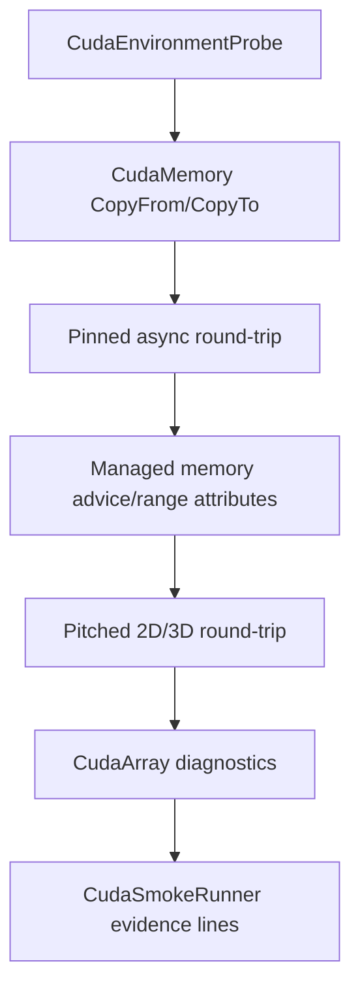

# CUDA Memory Wrapper 博客版：让 device、pinned、managed、pitched memory 有清晰 owner

> 文章类型：接口使用长文
> 适合发布：微信公众号、技术博客、CUDA wrapper 入门
> 配图建议：四类 memory owner 对象围绕 `CudaStream` 做同步/异步 copy 的结构图。
> 发布摘要：说明 TensorRtSharp4.0 的 CUDA memory wrapper 如何用 C# owner 对象管理 device、pinned、managed、pitched memory，减少裸指针在 public API 中漂移，并通过 `CudaSmokeRunner` 形成可诊断 evidence。

## 为什么 memory wrapper 很关键

TensorRT 推理最终一定会落到 tensor address。裸指针如果在应用代码里随意传递，很容易出现生命周期不清、释放顺序错误、跨 stream 使用未同步等问题。TensorRtSharp4.0 的 CUDA memory wrapper 希望把“谁拥有内存、什么时候释放、怎么复制、在哪条 stream 上执行”收敛到明确对象上。

## 常见对象

| 类型 | 典型用途 |
| --- | --- |
| `CudaMemory` | device memory，适合 TensorRT input/output buffer。 |
| `CudaPinnedMemory` | pinned host memory，适合异步 host-device copy。 |
| `CudaManagedMemory` | unified memory，适合原型和诊断场景。 |
| `CudaPitchedMemory` | 2D/3D pitched layout，适合图像或行对齐数据。 |
| `CudaArray` | CUDA array/mipmapped array 相关路径。 |

## Smoke 证据链



对应文件：

```text
smoke/CudaSmokeRunner/Program.cs
docs/articles/zh-cn/cuda-memory-wrapper.md
docs/articles/zh-cn/cuda-memory-range-apis.md
samples/MultiStream/Program.cs
```

## 运行命令

```powershell
dotnet build .\TensorRtSharp.sln -c Debug --no-restore /p:UseSharedCompilation=false
$env:JYPPX_ENABLE_DEVELOPMENT_PROBING = "1"
dotnet .\smoke\CudaSmokeRunner\bin\Debug\net8.0\CudaSmokeRunner.dll
```

## 关键输出

你会看到类似：

```text
RoundTrip=True
FloatRoundTrip=True
PinnedAsyncRoundTrip=True
PitchedMemory SyncRoundTrip=True DeviceToDevice=True Fill2D=True
PitchedMemory3D SyncRoundTrip=True DeviceToDevice=True
CudaArray RoundTrip=True ArrayToArray=True AsyncRoundTrip=True
```

这些 marker 说明基础 copy/readback、pinned async、pitched memory 和 CUDA array 路径可达。某些高级属性如果被 driver/runtime 拒绝，会输出 `Skipped Reason=...` 并保留诊断。

## 和 TensorRT binding 的关系

`CudaMemory` 可以作为 TensorRT tensor address 的 owner。更推荐的模式是：应用持有 memory owner，对 execution context 只绑定地址，不让裸指针逃出 public API 的语义边界。

## 边界

Memory wrapper ready 不等于 allocator callback proof ready。`IGpuAllocator`、`IGpuAsyncAllocator`、`IOutputAllocator` 仍涉及 TensorRT 调用托管/原生 callback、跨语言 ownership 和释放顺序，必须继续通过 owner ledger、precheck 和真实 runtime proof gate 推进。

## CTA

如果你要写自己的 sample，先用 `CudaMemory` 和 `CudaPinnedMemory` 做一个 round-trip，再把 device buffer 交给 `TensorRtInferenceBindings`。这样问题会被拆成 memory copy、binding readiness、enqueue 三个更容易排查的层次。
