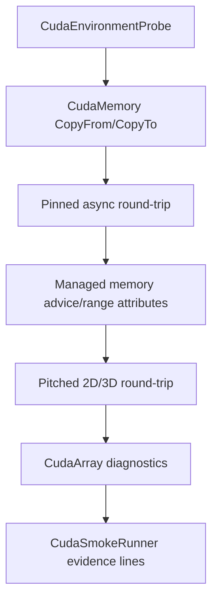
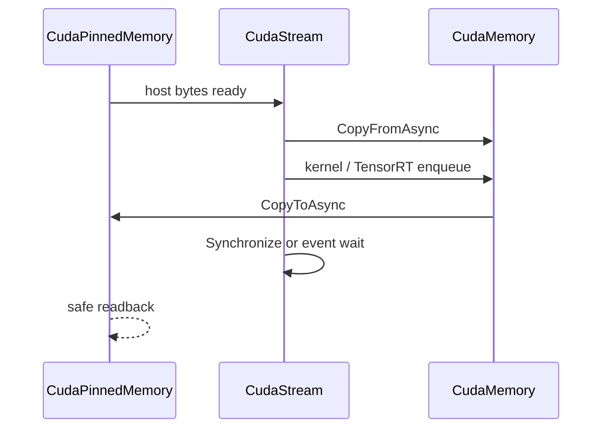

# CUDA Memory Wrapper 博客版：让 device、pinned、managed、pitched memory 有清晰 owner

> 文章类型：接口使用长文
> 适合发布：微信公众号、技术博客、CUDA wrapper 入门
> 配图建议：四类 memory owner 对象围绕 `CudaStream` 做同步/异步 copy 的结构图。
> 发布摘要：说明 TensorRtSharp4.0 的 CUDA memory wrapper 如何用 C# owner 对象管理 device、pinned、managed、pitched memory，减少裸指针在 public API 中漂移，并通过 `CudaSmokeRunner` 形成可诊断 evidence。

## 为什么 memory wrapper 很关键

TensorRT 推理最终一定会落到 tensor address。裸指针如果在应用代码里随意传递，很容易出现生命周期不清、释放顺序错误、跨 stream 使用未同步等问题。TensorRtSharp4.0 的 CUDA memory wrapper 希望把“谁拥有内存、什么时候释放、怎么复制、在哪条 stream 上执行”收敛到明确对象上。

## 常见对象

| 类型 | 典型用途 |
| --- | --- |
| `CudaMemory` | device memory，适合 TensorRT input/output buffer。 |
| `CudaPinnedMemory` | pinned host memory，适合异步 host-device copy。 |
| `CudaManagedMemory` | unified memory，适合原型和诊断场景。 |
| `CudaPitchedMemory` | 2D/3D pitched layout，适合图像或行对齐数据。 |
| `CudaArray` | CUDA array/mipmapped array 相关路径。 |

## Smoke 证据链



对应文件：

```text
smoke/CudaSmokeRunner/Program.cs
docs/articles/zh-cn/cuda-memory-wrapper.md
docs/articles/zh-cn/cuda-memory-range-apis.md
samples/MultiStream/Program.cs
```

## 运行命令

```powershell
dotnet build .\TensorRtSharp.sln -c Debug --no-restore /p:UseSharedCompilation=false
$env:JYPPX_ENABLE_DEVELOPMENT_PROBING = "1"
dotnet .\smoke\CudaSmokeRunner\bin\Debug\net8.0\CudaSmokeRunner.dll
```

## 关键输出

你会看到类似：

```text
RoundTrip=True
FloatRoundTrip=True
PinnedAsyncRoundTrip=True
PitchedMemory SyncRoundTrip=True DeviceToDevice=True Fill2D=True
PitchedMemory3D SyncRoundTrip=True DeviceToDevice=True
CudaArray RoundTrip=True ArrayToArray=True AsyncRoundTrip=True
```

这些 marker 说明基础 copy/readback、pinned async、pitched memory 和 CUDA array 路径可达。某些高级属性如果被 driver/runtime 拒绝，会输出 `Skipped Reason=...` 并保留诊断。

## 和 TensorRT binding 的关系

`CudaMemory` 可以作为 TensorRT tensor address 的 owner。更推荐的模式是：应用持有 memory owner，对 execution context 只绑定地址，不让裸指针逃出 public API 的语义边界。

## 边界

Memory wrapper ready 不等于 allocator callback proof ready。`IGpuAllocator`、`IGpuAsyncAllocator`、`IOutputAllocator` 仍涉及 TensorRT 调用托管/原生 callback、跨语言 ownership 和释放顺序，必须继续通过 owner ledger、precheck 和真实 runtime proof gate 推进。

## CTA

如果你要写自己的 sample，先用 `CudaMemory` 和 `CudaPinnedMemory` 做一个 round-trip，再把 device buffer 交给 `TensorRtInferenceBindings`。这样问题会被拆成 memory copy、binding readiness、enqueue 三个更容易排查的层次。

## 四类 memory 的选择原则

| Owner | 分配位置 | Host 可直接访问 | 主要场景 |
| --- | --- | --- | --- |
| `CudaMemory` | device | 否 | TensorRT tensor、kernel buffer |
| `CudaPinnedMemory` | page-locked host | 是 | async H2D/D2H staging |
| `CudaManagedMemory` | unified | 是，但有迁移 | 原型、诊断、memory advice |
| `CudaPitchedMemory` | device pitched | 否 | 2D/3D 行对齐数据 |

对应实现位于 `src/JYPPX.CudaSharp/CudaMemory.cs`、`src/JYPPX.CudaSharp/CudaPinnedMemory.cs`、
`src/JYPPX.CudaSharp/CudaManagedMemory.cs`、`src/JYPPX.CudaSharp/CudaPitchedMemory.cs`。所有类型都应作为
owner 使用，异步操作完成前不能 dispose。



普通 managed array 可以用于同步 copy；需要真正异步 host copy 时应使用 pinned owner，避免 GC 移动或临时 pin 的生命周期
不足。

## Range API 与 checked arithmetic

copy/fill 的 `offset`、`length` 都应在 managed 边界先验证。`CudaMemory` 的 range overload 把常见的
`offset + length` 溢出、负值和越界提前转为异常；native bridge 仍会做最终检查。不要通过截断 length 让错误静默通过。

```csharp
using CudaMemory device = new CudaMemory(4096);
byte[] input = Enumerable.Range(0, 256).Select(i => (byte)i).ToArray();

device.CopyFrom(input);
byte[] output = new byte[input.Length];
device.CopyTo(output);
```

字节 API 与 typed array API 的单位不同；文章、代码和日志必须明确是 bytes 还是 elements。

## Pinned async round-trip

`PinnedAsyncRoundTrip=True` 是 `smoke/CudaSmokeRunner/Program.cs` 的关键 marker。完整路径包括 pinned host 写入、
async H2D、async D2H、stream synchronize 和逐字节比较。只创建 pinned memory 或排队 copy 不足以得到该 marker。

```powershell
$repo = "E:\GitSpace\TensorRT-CSharp-API-4.0\TensorRtSharp4.0"
$case = "E:\TensorRtSharpAssets\cases\cuda-memory-smoke"
New-Item -ItemType Directory -Force -Path "$case\logs" | Out-Null
Set-Location $repo

dotnet build .\smoke\CudaSmokeRunner\CudaSmokeRunner.csproj -c Debug --no-restore --nologo
$env:JYPPX_ENABLE_DEVELOPMENT_PROBING = "1"
dotnet .\smoke\CudaSmokeRunner\bin\Debug\net8.0\CudaSmokeRunner.dll `
  2>&1 | Tee-Object "$case\logs\cuda-memory.log"
```

日志中的 `RoundTrip`、`FloatRoundTrip`、`PinnedAsyncRoundTrip`、pitched 和 array marker 分别对应不同 API family；某个
高级 family skipped 时，不能用基础 round-trip 替它宣称通过。

## Managed memory 不是自动更快

managed memory 让 host/device 共享地址空间，但页面迁移、prefetch、advice 和多 GPU 访问仍需显式理解。
`src/JYPPX.CudaSharp/CudaManagedMemoryBatch.cs` 提供 batch prefetch/discard 组织，range diagnostics 可读取 location、
read-mostly、preferred location 和 accessed-by devices。查询成功是 copied diagnostics，不是性能证明。

实际场景应记录：allocation size、device、prefetch stream、access pattern、同步点与测量方法。不要仅因代码更短就替换
TensorRT hot path 的 device memory。

## Pitched memory 的 pitch 不能忽略

2D/3D allocation 的实际 pitch 可能大于逻辑 row bytes。copy/fill 应使用 wrapper 的 width/height/depth 和 pitch-aware API，
不能把 buffer 当连续 `width * height` 直接递增。smoke 的 sync round-trip、device-to-device 与 Fill2D marker 分别覆盖
布局、复制和填充。

图像接入时还要区分 packed RGB、planar CHW、row stride 与 tensor layout；pitched copy 通过不等于预处理语义正确。

## 交给 TensorRT binding

推荐让 `TensorRtInferenceBindings` 创建和持有常规 input/output `CudaMemory`，或让应用显式持有外部 buffer 后在 context
存活期绑定。无论哪种方式，execution context 不拥有 memory；enqueue 完成前释放或复用 buffer 会产生 use-after-free/data race。

多 stream 场景使用 `CudaEvent` 表达 producer/consumer ordering，参见 `samples/MultiStream/Program.cs`。host readback 前必须
同步对应 consumer stream，而不是任意另一条 stream。

## 常见错误

**invalid value**：检查 byte/element 单位、offset、length 与目标 owner size。

**illegal address 或偶发崩溃**：检查异步工作结束前是否 dispose/reuse buffer，随后检查 kernel/binding shape。

**async copy 实际阻塞或失败**：确认 host memory 是 pinned，stream/runtime/device 均有效。

**pitched 输出错行**：使用实际 pitch，不用逻辑 width 推算下一行地址。

**managed memory 性能抖动**：记录 page migration、prefetch/advice 和访问设备，不把 correctness smoke 当 benchmark。

## 与 allocator callback 的硬边界

memory wrapper 是 caller-owned allocation；`IGpuAllocator`、`IGpuAsyncAllocator`、`IOutputAllocator` 则让 TensorRT 在未知
时点回调分配/释放，涉及并发、异常、对齐、stream ordering 和 shutdown。前者完成不会自动让后者安全。

本文保持 `performsPublish=false`、`canPublishPublicly=false`、`canCloseReleaseIssue=false`，也不把本地
`CudaSmokeRunner` 写成 package consumer runtime proof。

继续阅读：[CUDA memory 完整教程](cuda-memory-wrapper.md)、[CUDA range API](cuda-memory-range-apis.md)、
[MultiStream 博客版](blog-multistream-cuda-stream-event.md) 与 [InferenceBindings](blog-inference-bindings-identity-network.md)。
