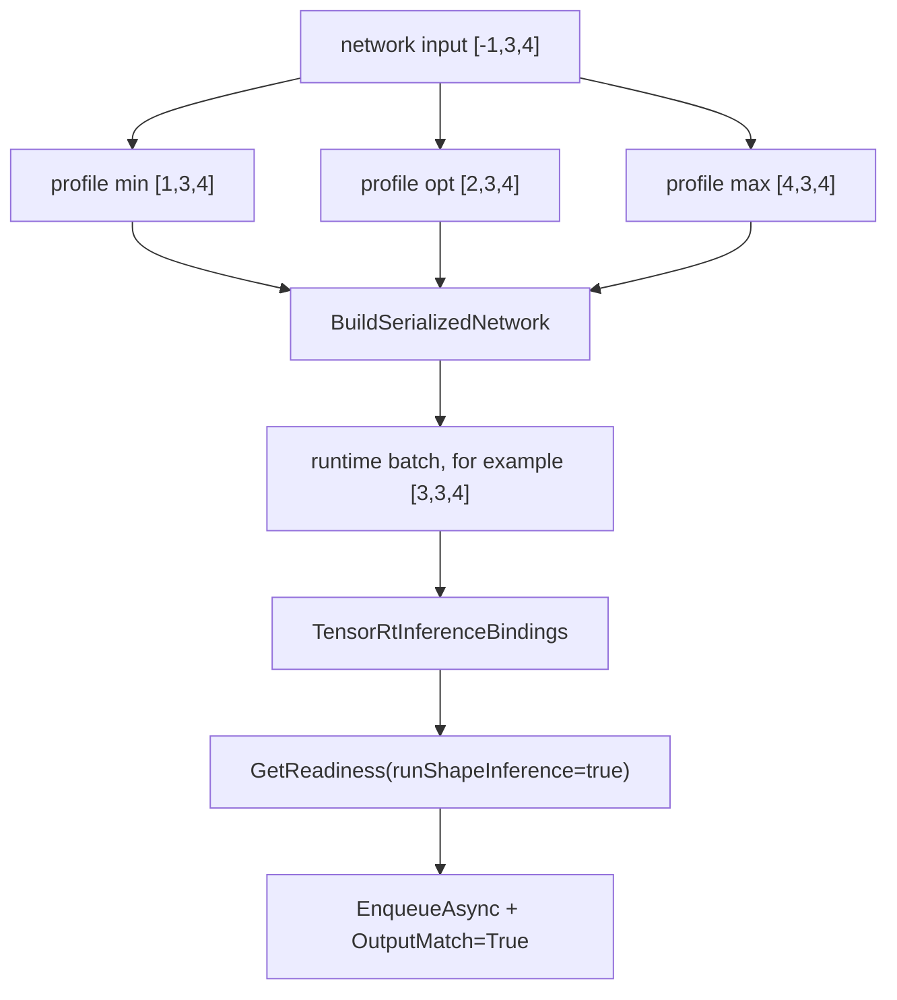

# Dynamic Shape 博客版：把运行时 batch 交给 Optimization Profile

> 文章类型：样例教程长文
> 适合发布：微信公众号、技术博客、样例导览
> 配图建议：一个输入 tensor 从 `[-1,3,4]` 进入 min/opt/max profile，再进入 runtime batch 的流程图。
> 发布摘要：用 `samples/DynamicShape` 演示 TensorRtSharp4.0 如何在 C# 中构建动态 batch identity network，并用 optimization profile、runtime shape、binding readiness 和 output match 形成可复现证据。

## 为什么 dynamic shape 值得单独讲

TensorRT 的动态维度不是简单把 shape 写成 `-1`。Builder 需要知道这个动态范围的最小、最优、最大值，runtime 也需要在 enqueue 前设置实际输入 shape。任何一步漏掉，最后都会变成难读的 runtime 失败。

TensorRtSharp4.0 的 `samples/DynamicShape` 选择了一个最小 identity network，目的是把 dynamic shape 的工程路径讲清楚，而不是让外部模型、图片和预处理干扰判断。

## 样例链路



对应文件：

```text
samples/DynamicShape/Program.cs
samples/DynamicShape/README.md
docs/articles/zh-cn/dynamic-shape-optimization-profile-tutorial.md
```

## 运行方式

```powershell
dotnet build .\TensorRtSharp.sln -c Debug --no-restore /p:UseSharedCompilation=false
$env:JYPPX_ENABLE_DEVELOPMENT_PROBING = "1"
dotnet .\samples\DynamicShape\bin\Debug\net8.0\DynamicShape.dll --tensor-rt-line 10 --batch 3
```

`--batch` 必须落在 profile 范围内。这个样例的范围是 1 到 4，默认使用 3。

## 读输出不要只看最后一行

成功输出应包含：

```text
Profile Index=0 Min=[1,3,4] Opt=[2,3,4] Max=[4,3,4] Valid=True
RuntimeShape=[3,3,4]
Readiness Ready=True Bound=True ActiveProfile=0
Execution ... OutputMatch=True
DynamicShape Passed=True
```

这些 marker 分别证明 profile 生效、runtime shape 已设置、tensor address 已绑定、shape inference/readiness 通过、identity 输出与输入一致。

## 边界说明

如果当前机器返回 `DynamicShape=Skipped`，优先看 dependency diagnostic。它通常表示本机 TensorRT/CUDA 运行环境不可用，而不是 dynamic shape wrapper 自动失败。

如果 CUDA 13.2 包线返回 `blocked-by-cuda-driver`，应把它记录为 driver/runtime compatibility 阻塞。它不是 runtime smoke passed，也不是 callback proof。

## CTA

读完这篇，建议继续跑 `InferenceBindings` 和 `OnnxToEngine`。这三条样例线组合起来，基本覆盖了 shape、binding、serialized engine 和最小 ONNX parser 的入门路径。
