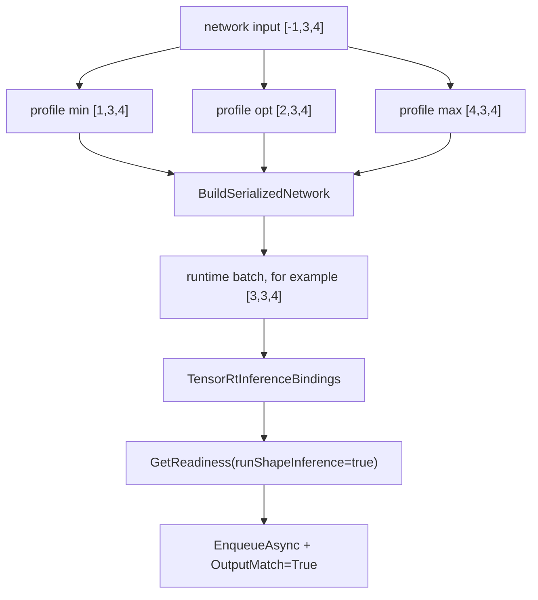
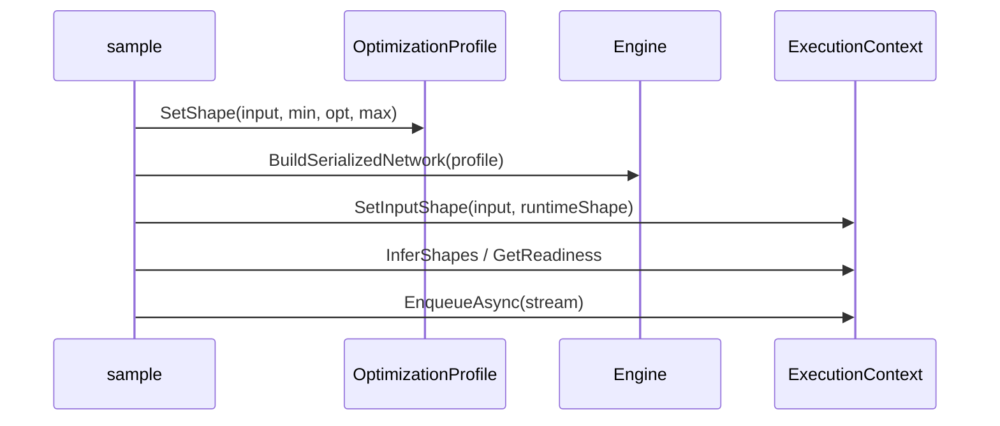

# Dynamic Shape 博客版：把运行时 batch 交给 Optimization Profile

> 文章类型：样例教程长文
> 适合发布：微信公众号、技术博客、样例导览
> 配图建议：一个输入 tensor 从 `[-1,3,4]` 进入 min/opt/max profile，再进入 runtime batch 的流程图。
> 发布摘要：用 `samples/Inference/02.DynamicShapes` 演示 TensorRtSharp4.0 如何在 C# 中构建动态 batch identity network，并用 optimization profile、runtime shape、binding readiness 和 output match 形成可复现证据。

## 为什么 dynamic shape 值得单独讲

TensorRT 的动态维度不是简单把 shape 写成 `-1`。Builder 需要知道这个动态范围的最小、最优、最大值，runtime 也需要在 enqueue 前设置实际输入 shape。任何一步漏掉，最后都会变成难读的 runtime 失败。

TensorRtSharp4.0 的 `samples/Inference/02.DynamicShapes` 选择了一个最小 identity network，目的是把 dynamic shape 的工程路径讲清楚，而不是让外部模型、图片和预处理干扰判断。

## 样例链路



对应文件：

```text
samples/Inference/02.DynamicShapes/Program.cs
samples/Inference/02.DynamicShapes/README.md
docs/articles/zh-cn/dynamic-shape-optimization-profile-tutorial.md
```

## 运行方式

```powershell
dotnet build .\TensorRtSharp.sln -c Debug --no-restore /p:UseSharedCompilation=false
$env:JYPPX_ENABLE_DEVELOPMENT_PROBING = "1"
dotnet .\samples\Inference\02.DynamicShapes\bin\Debug\net8.0\DynamicShape.dll --tensor-rt-line 10 --batch 3
```

`--batch` 必须落在 profile 范围内。这个样例的范围是 1 到 4，默认使用 3。

## 读输出不要只看最后一行

成功输出应包含：

```text
Profile Index=0 Min=[1,3,4] Opt=[2,3,4] Max=[4,3,4] Valid=True
RuntimeShape=[3,3,4]
Readiness Ready=True Bound=True ActiveProfile=0
Execution ... OutputMatch=True
DynamicShape Passed=True
```

这些 marker 分别证明 profile 生效、runtime shape 已设置、tensor address 已绑定、shape inference/readiness 通过、identity 输出与输入一致。

## 边界说明

如果当前机器返回 `DynamicShape=Skipped`，优先看 dependency diagnostic。它通常表示本机 TensorRT/CUDA 运行环境不可用，而不是 dynamic shape wrapper 自动失败。

如果 CUDA 13.2 包线返回 `blocked-by-cuda-driver`，应把它记录为 driver/runtime compatibility 阻塞。它不是 runtime smoke passed，也不是 callback proof。

## CTA

读完这篇，建议继续跑 `InferenceBindings` 和 `OnnxToEngine`。这三条样例线组合起来，基本覆盖了 shape、binding、serialized engine 和最小 ONNX parser 的入门路径。

## Dynamic shape 的四个状态

动态维度从声明到执行会经过四个不同对象，任何一层都不能省略：

1. network input 用 `-1` 标出 runtime dimension。
2. `TensorRtOptimizationProfile` 为同名 input 设置 min/opt/max。
3. builder config 接收 profile，并把它编进 serialized engine。
4. execution context 在 enqueue 前接收本次 runtime shape。

public wrapper 分别位于 `src/JYPPX.TensorRtSharp/Profiles/TensorRtOptimizationProfile.cs`、
`src/JYPPX.TensorRtSharp/Inference/TensorRtInferenceBindings.TensorGeometry.cs` 和
`src/JYPPX.TensorRtSharp/Inference/TensorRtInferenceBindings.Execution.cs`。profile shape range 是 copied value，context shape 的设置则受
engine tensor name 与 active profile 约束。



profile 不是运行时自动扩容规则。`max=[4,3,4]` 时，batch 5 必须被拒绝；为了绕过错误扩大 device buffer，并不会让
engine 接受越界 shape。

## 关键代码拆解

```csharp
using TensorRtOptimizationProfile profile = builder.CreateOptimizationProfile();
profile.SetShape(
    "input",
    new TensorRtDims(new[] { 1, 3, 4 }),
    new TensorRtDims(new[] { 2, 3, 4 }),
    new TensorRtDims(new[] { 4, 3, 4 }));

TensorRtOptimizationProfileShapeRange range = profile.GetShapeRange("input");
int profileIndex = config.AddOptimizationProfile(profile);
```

min/opt/max 必须 rank 相同、静态维一致，并满足逐维 `min <= opt <= max`。`profile.IsValid` 或 sample 中的
`Valid=True` 是 TensorRT/profile validation 的结果，不等于给定 runtime shape 已被设置。

运行阶段由高层 binding 统一 shape、copy、buffer 和 address：

```csharp
bindings.SetInputShape("input", runtimeShape)
        .CopyInputFromHost("input", inputValues, runtimeShape);
bindings.AllocateDeviceBuffer("output", runtimeShape);
bindings.BindAll();

TensorRtExecutionContextReadiness readiness =
    bindings.GetReadiness(runShapeInference: true);
```

`runShapeInference: true` 会让缺失 shape tensor 或未满足的输入更早暴露。只有 `IsReadyForEnqueue` 与
`AllTensorAddressesBound` 都满足，才进入 enqueue。

## E 盘复现与边界输入

```powershell
$repo = "."
$case = "..\downloads\cases\dynamic-shape-identity"
New-Item -ItemType Directory -Force -Path "$case\logs" | Out-Null
Set-Location $repo

dotnet build .\samples\Inference\02.DynamicShapes\DynamicShape.csproj -c Debug --no-restore --nologo
$env:JYPPX_ENABLE_DEVELOPMENT_PROBING = "1"

1..4 | ForEach-Object {
  dotnet .\samples\Inference\02.DynamicShapes\bin\Debug\net8.0\DynamicShape.dll `
    --tensor-rt-line 10 --batch $_ 2>&1 |
    Tee-Object "$case\logs\batch-$_.log"
  if ($LASTEXITCODE -ne 0) { throw "batch $_ failed" }
}
```

边界值 1 和 4 与 opt 附近的 2/3 都应验证。非法 batch 0/5 应走 `DynamicShape=InvalidArguments`，它们属于 CLI
negative test，不应混进 runtime failure 计数。

## 输出诊断矩阵

| Marker | 检查点 | 失败时先看 |
| --- | --- | --- |
| `Profile ... Valid=True` | min/opt/max 被接受 | rank、维度顺序、input name |
| `RuntimeShape=...` | 本次 shape 已选择 | CLI batch 与 profile 范围 |
| `Ready=True` | shape/context 可 enqueue | missing input shape、shape inference |
| `Bound=True` | 所有 tensor address 已绑定 | buffer allocation 与 tensor name |
| `OutputMatch=True` | identity 输出逐元素一致 | copy、元素数、stream sync |

`ActiveProfile=0` 只适用于样例的单 profile。真实应用有多个 profile 时，应先选择 profile，再设置 shape；不要在已有
异步工作未完成时切换 profile。

## 从 identity 迁移到真实模型

- 从 engine 报告读取真实 input 名称、rank、dtype 和 dynamic dimensions。
- 为每个 dynamic input 定义业务 min/opt/max，不要用同一 profile 粗暴覆盖所有场景。
- 对 shape tensor 使用 shape-value API，不把它与普通 execution tensor 混淆。
- 按 runtime shape 重新计算 host 元素数和 device buffer 字节数。
- 保存 binding report、readiness、实际 shape、输入输出 hash 与业务校验。
- 若模型有 plugin，先做 creator inventory；若 parser 失败，保存 parser copied diagnostics。

profile 越宽通常会增加 tactic 搜索与资源压力。opt shape 应代表常见负载，而不是简单取 min/max 中点。

## Proof boundary 与下一步

本文完成的是内置 identity network 的 dynamic shape 教程。local sample、synthetic input、build success 或
`OutputMatch=True` 都不能替代外部模型与 clean package consumer proof。当前 `performsPublish=false`、
`canPublishPublicly=false`、`canCloseReleaseIssue=false`。

继续阅读：[Dynamic Shape 详细教程](dynamic-shape-optimization-profile-tutorial.md)、
[InferenceBindings 博客版](blog-inference-bindings-identity-network.md) 与
[ONNX round-trip 博客版](blog-onnx-parser-engine-roundtrip.md)。
