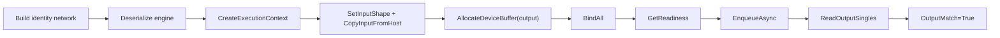

# InferenceBindings 博客版：用最小 Identity Network 验证推理闭环

> 文章类型：样例教程长文
> 适合发布：微信公众号、技术博客、用户入门材料
> 配图建议：从 host input 到 device buffer、tensor address binding、enqueue、host output 的闭环图。
> 发布摘要：通过 `samples/InferenceBindings` 展示 TensorRtSharp4.0 如何把 execution context 的 shape、device buffer、tensor address、readiness 和 readback 收敛成 C# 高层工作流。

## 真正的难点在 engine 之后

很多 TensorRT 入门材料会停在 engine 创建成功。但应用代码真正容易出错的地方通常在 execution context：输入 shape 是否设置、buffer 是否分配、tensor address 是否绑定、enqueue 前是否 ready、输出是否安全读回。

`TensorRtInferenceBindings` 的价值就是把这些步骤组织成可诊断的 C# 对象，而不是让用户在 public API 里保存裸指针。

## 最小网络

```text
input [-1,4] -> Identity -> output [-1,4]
```



对应文件：

```text
samples/InferenceBindings/Program.cs
samples/InferenceBindings/README.md
docs/articles/zh-cn/inference-bindings-tutorial.md
```

## 运行命令

```powershell
dotnet build .\TensorRtSharp.sln -c Debug --no-restore /p:UseSharedCompilation=false
$env:JYPPX_ENABLE_DEVELOPMENT_PROBING = "1"
dotnet .\samples\InferenceBindings\bin\Debug\net8.0\InferenceBindings.dll --tensor-rt-line 10 --batch 2
```

如果你正在验证 package consumer，不要把这个样例的本地运行结果直接等同于 NuGet 包消费端结果。包消费端仍应使用 `eng\Test-PackageConsumer.ps1` 生成独立 evidence。

## 关键 marker

```text
BindingReport Ready=True Inputs=1 Outputs=1
Readiness Ready=True Bound=True ActiveProfile=0
Execution ... OutputMatch=True
InferenceBindings Passed=True
```

`Ready=True` 说明绑定状态满足 enqueue 前置条件。`OutputMatch=True` 说明最小 identity 推理结果正确。它们是样例 evidence，不是 allocator/debug listener callback runtime proof。

## 常见排查

如果出现 `InferenceBindings=Skipped`，先看 TensorRT/CUDA dependency probe。若是 `blocked-by-cuda-driver`，表示当前 driver/runtime 不兼容目标包线，应换兼容 host 复测。

如果 batch 超出 profile 范围，应该调整 profile 或输入参数，而不是绕过 readiness。

## CTA

把这个样例跑通后，再读 Dynamic Shape 教程会更自然：InferenceBindings 关注“如何绑定和执行”，Dynamic Shape 进一步关注“runtime shape 如何进入 profile 范围”。
