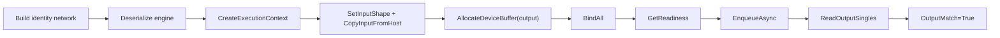
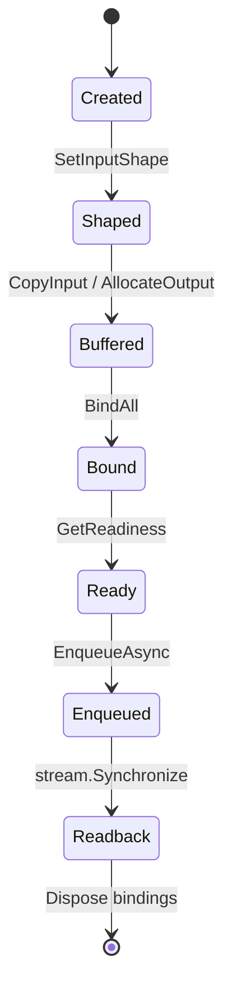

# InferenceBindings 博客版：用最小 Identity Network 验证推理闭环

> 文章类型：样例教程长文
> 适合发布：微信公众号、技术博客、用户入门材料
> 配图建议：从 host input 到 device buffer、tensor address binding、enqueue、host output 的闭环图。
> 发布摘要：通过 `samples/Inference/01.Bindings` 展示 TensorRtSharp4.0 如何把 execution context 的 shape、device buffer、tensor address、readiness 和 readback 收敛成 C# 高层工作流。

## 真正的难点在 engine 之后

很多 TensorRT 入门材料会停在 engine 创建成功。但应用代码真正容易出错的地方通常在 execution context：输入 shape 是否设置、buffer 是否分配、tensor address 是否绑定、enqueue 前是否 ready、输出是否安全读回。

`TensorRtInferenceBindings` 的价值就是把这些步骤组织成可诊断的 C# 对象，而不是让用户在 public API 里保存裸指针。

## 最小网络

```text
input [-1,4] -> Identity -> output [-1,4]
```



对应文件：

```text
samples/Inference/01.Bindings/Program.cs
samples/Inference/01.Bindings/README.md
docs/articles/zh-cn/inference-bindings-tutorial.md
```

## 运行命令

```powershell
dotnet build .\TensorRtSharp.sln -c Debug --no-restore /p:UseSharedCompilation=false
$env:JYPPX_ENABLE_DEVELOPMENT_PROBING = "1"
dotnet .\samples\Inference\01.Bindings\bin\Debug\net8.0\InferenceBindings.dll --tensor-rt-line 10 --batch 2
```

如果你正在验证 package consumer，不要把这个样例的本地运行结果直接等同于 NuGet 包消费端结果。包消费端仍应使用 `eng\Test-PackageConsumer.ps1` 生成独立 evidence。

## 关键 marker

```text
BindingReport Ready=True Inputs=1 Outputs=1
Readiness Ready=True Bound=True ActiveProfile=0
Execution ... OutputMatch=True
InferenceBindings Passed=True
```

`Ready=True` 说明绑定状态满足 enqueue 前置条件。`OutputMatch=True` 说明最小 identity 推理结果正确。它们是样例 evidence，不是 allocator/debug listener callback runtime proof。

## 常见排查

如果出现 `InferenceBindings=Skipped`，先看 TensorRT/CUDA dependency probe。若是 `blocked-by-cuda-driver`，表示当前 driver/runtime 不兼容目标包线，应换兼容 host 复测。

如果 batch 超出 profile 范围，应该调整 profile 或输入参数，而不是绕过 readiness。

## CTA

把这个样例跑通后，再读 Dynamic Shape 教程会更自然：InferenceBindings 关注“如何绑定和执行”，Dynamic Shape 进一步关注“runtime shape 如何进入 profile 范围”。

## `TensorRtInferenceBindings` 管什么

高层对象的生命周期 core 位于 `src/JYPPX.TensorRtSharp/Inference/TensorRtInferenceBindings.cs`，buffer、host transfer、address binding
与 execution 分别位于同名前缀的 feature partial。它不拥有 engine 或 context，但拥有由它创建的 device buffer，并把 tensor
name、shape、buffer、address 与报告组织在一起。生命周期应保持：engine/context 先创建，
bindings 在二者仍存活时使用并先释放，最后再释放 context/engine/logger。

| 操作 | 高层语义 | 常见错误 |
| --- | --- | --- |
| `SetInputShape` | 设置 runtime input shape | 超出 profile、名称错误 |
| `CopyInputFromHost` | 校验元素数并复制到 device | dtype/shape/长度不符 |
| `AllocateDeviceBuffer` | 按输出 shape 分配 owner buffer | 动态输出尺寸未知 |
| `BindAll` | 把 owner buffer 地址绑定到 context | 缺少 input/output |
| `GetReadiness` | 复制 enqueue 前诊断 | profile/shape/address 未完成 |
| `EnqueueAsync` | 在指定 stream 排队 | context 不 ready |
| `ReadOutputSingles` | 同步后复制 float output | dtype 或元素数不符 |



readiness 不是装饰性日志。若高层对象报告 false，调用方应读取 tensors/diagnostics，修复缺失状态，而不是直接调用 native
enqueue。

## 最小工作流逐行看

```csharp
using TensorRtInferenceBindings bindings =
    new TensorRtInferenceBindings(engine, context, profileIndex);

bindings.SetInputShape("input", runtimeShape)
        .CopyInputFromHost("input", inputValues, runtimeShape);
bindings.AllocateDeviceBuffer("output", runtimeShape);
bindings.BindAll();

TensorRtExecutionContextReadiness readiness =
    bindings.GetReadiness(runShapeInference: true);
if (!readiness.IsReadyForEnqueue)
{
    throw new InvalidOperationException(
        $"Context is not ready: dimensions={readiness.AllInputDimensionsSpecified}, " +
        $"shapes={readiness.AllInputShapesSpecified}, " +
        $"missing={readiness.ShapeInferenceMissingTensorCount}, " +
        $"bound={readiness.AllTensorAddressesBound}");
}

bindings.EnqueueAsync(cudaStream, synchronize: false, runShapeInference: false);
cudaStream.Synchronize();
float[] output = bindings.ReadOutputSingles("output", inputValues.Length);
```

sample 刻意把 `synchronize: false` 与显式 `cudaStream.Synchronize()` 分开，显示 GPU 排队和 host readback 的边界。
如果应用使用 event 或另一条 stream，应在读取前建立等价 ordering。

## Buffer 大小来自 shape 和 dtype

identity 示例只有 float，因此元素数乘 `sizeof(float)` 即可。真实 engine 可能包含 half、int8、int32、int64、bool 或
动态输出，不能把 input byte count 直接套给 output。优先从 engine/context copied metadata 获取 dtype 与 resolved shape，
再做 checked arithmetic；未知或负维度必须先完成 shape inference。

公共使用路径不要求应用保存 `IntPtr`。确需与外部 CUDA 库互操作时，也应让 `CudaMemory` owner 覆盖所有异步工作，并在
dispose 前同步或等待 event。

## 可复现命令与负向输入

```powershell
$repo = "."
$case = "..\downloads\cases\inference-bindings-identity"
New-Item -ItemType Directory -Force -Path "$case\logs" | Out-Null
Set-Location $repo

dotnet build .\samples\Inference\01.Bindings\InferenceBindings.csproj -c Debug --no-restore --nologo
$env:JYPPX_ENABLE_DEVELOPMENT_PROBING = "1"
dotnet .\samples\Inference\01.Bindings\bin\Debug\net8.0\InferenceBindings.dll `
  --tensor-rt-line 10 --batch 2 2>&1 |
  Tee-Object "$case\logs\trt10-batch2.log"
```

分别对 TRT8、TRT10、TRT11 保存日志，不跨版本投影。batch 0 或 5 应是 argument failure；移除 `BindAll`、错拼 tensor name
或少分配 output 则应由高层 API/readiness fail closed，这些是测试设计，不建议在用户样例里绕过。

## 报告怎么读

`bindings.Report` 是 engine/context binding 的 copied view。输入输出数量正确并不意味着地址都已绑定，所以还要联合读取：

```text
BindingReport Ready=True Inputs=1 Outputs=1
Readiness Ready=True Bound=True ActiveProfile=0
Execution ... OutputMatch=True
```

三行依次表示结构、enqueue 前状态和数值结果。`InferenceBindings Passed=True` 是 sample 汇总，不应覆盖前面任一 false 或
skipped marker。若环境初始化失败，`InferenceBindings=Skipped Reason=...` 保留为环境证据。

## 真实模型迁移清单

- 从 engine 枚举 input/output tensor，不硬编码不确定名称。
- 为所有动态 input 设置 shape，并验证 active profile。
- 依据 dtype/shape 生成或加载预处理 tensor，记录 input hash。
- 为每个 output 分配足够 buffer；动态输出先查询 max/output size 或完成 shape inference。
- 绑定所有 tensor address，保存 binding report 与 readiness。
- enqueue 后按同一 stream/event ordering 读回。
- 使用模型专属后处理与业务容差，不用“非空 output”代替验证。
- 保存 engine hash、host metadata、runtime key、stdout/stderr 与 validator。

## 常见故障

**`Ready=False`**：查看缺失 shape、未绑定 tensor 与 active profile，不直接调用 enqueue。

**CUDA invalid value**：检查 byte count、dtype、已释放 buffer 和错误 stream；确认异步 copy 尚未访问被回收的 host memory。

**输出全零**：确认 input copy、tensor name、output address、network output 标记和 stream synchronization。

**本地通过但 NuGet consumer 失败**：运行 `eng/Test-PackageConsumer.ps1`，比对 native assets 与 runtime package key；
本地 solution 引用不等于包消费证据。

## Proof boundary

本文证明仓库 identity sample 的 owner-safe binding 工作流，不证明任意外部 engine、动态 output 或真实模型精度。
`performsPublish=false`、`canPublishPublicly=false`、`canCloseReleaseIssue=false`。

继续阅读：[Inference Binding 详细教程](inference-bindings-tutorial.md)、
[Dynamic Shape 博客版](blog-dynamic-shape-optimization-profile.md) 与 [CUDA memory wrapper 博客版](blog-cuda-memory-wrapper.md)。
