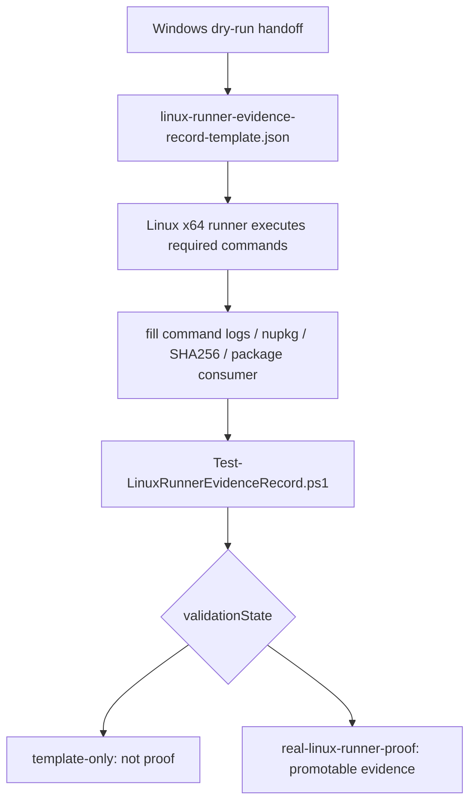

# Linux Runner Evidence 回填指南：从 handoff 到真实 proof

> 文章类型：技术操作指南
> 适合发布：微信公众号、技术博客、Release owner handoff issue
> 配图建议：Linux handoff 目录截图、validator 输出截图、runner proof 晋级流程图
> 发布摘要：讲清楚 Windows handoff、Linux runner record、validator 三者之间的关系，避免把 `template-only` 交接材料误写成真实 Linux x64 runner proof。
> 公众号封面建议：左右对比图，左侧为 `template-only` handoff 文件夹，右侧为 Linux x64 runner 执行日志、runtime nupkg SHA256 和 validator 绿色通过状态。

## 这篇文章解决什么问题

Windows 本地可以生成 Linux runtime package 的规划、handoff 和模板，但这不等于 Linux 包线已经真实通过。真正的 Linux proof 必须来自 Linux x64 runner：它要执行 configure、build、asset collection、pack、package consumer，并回填结构化证据。

TensorRtSharp4.0 现在提供了一个 validator：

```powershell
eng\Test-LinuxRunnerEvidenceRecord.ps1
```

它的作用不是伪造 proof，而是检查外部 runner 回填的 JSON 是否足够可信。



## 当前 handoff 目录

代表 runtime key：

```text
linux-x64-ubuntu22.04-trt11.0-cuda13.2-cudnn9.22
```

交接目录：

```text
artifacts/linux-dry-run/linux-x64-ubuntu22.04-trt11.0-cuda13.2-cudnn9.22
```

你会看到类似文件：

```text
linux-runner-evidence-template.md
linux-runner-evidence-record-template.json
linux-runner-evidence-validation.md
linux-package-consumer-plan.md
linux-runner-execution-status.json
```

这些文件是交接材料。只要 validator 仍输出 `validationState=template-only`，它们就不是 Linux runner proof。

## Linux runner 需要执行什么

在 Linux x64 runner 上按顺序执行：

```bash
pwsh -NoProfile -ExecutionPolicy Bypass -File ./eng/Validate-LinuxRuntimeInputs.ps1 \
  -RuntimePackageKey linux-x64-ubuntu22.04-trt11.0-cuda13.2-cudnn9.22

cmake --preset linux-x64-trt11-cuda13-release
cmake --build --preset linux-x64-trt11-cuda13-release --parallel

pwsh -NoProfile -ExecutionPolicy Bypass -File ./eng/Collect-RuntimeAssets.ps1 \
  -RuntimePackageKey linux-x64-ubuntu22.04-trt11.0-cuda13.2-cudnn9.22

dotnet pack ./pack/runtime/linux-x64-ubuntu22.04-trt11.0-cuda13.2-cudnn9.22/JYPPX.TensorRT.CSharp.API.Runtime.linux-x64.ubuntu22.04.trt11.0.cuda13.2.cudnn9.22.csproj \
  -c Release \
  -o ./artifacts/runtime-nupkg

pwsh -NoProfile -ExecutionPolicy Bypass -File ./eng/Test-PackageConsumer.ps1 \
  -RuntimePackageKey linux-x64-ubuntu22.04-trt11.0-cuda13.2-cudnn9.22
```

如果 runner 有兼容 NVIDIA driver、CUDA runtime 和 GPU 访问，再追加：

```bash
pwsh -NoProfile -ExecutionPolicy Bypass -File ./eng/Test-PackageConsumer.ps1 \
  -RuntimePackageKey linux-x64-ubuntu22.04-trt11.0-cuda13.2-cudnn9.22 \
  -RunSmoke
```

GPU smoke 是 runtime execution proof 的输入，不是 packaging proof 的前置条件。没有 GPU smoke 时，可以证明 Linux package build/consumer native-copy，但不能写 runtime smoke passed。

## 回填 JSON 需要哪些字段

`linux-runner-evidence-record-template.json` 中需要回填：

- runner OS、kernel、architecture、runner labels。
- TensorRT root、CUDA root、cuDNN root。
- 每条命令的 status、actual exit code、start/finish time、log path。
- runtime `.nupkg` path。
- runtime `.nupkg` SHA256。
- native asset copied count。
- native asset missing count。
- package consumer status。
- optional smoke status。

核心原则：每个成功结论都要能追到日志或 artifact 路径。

## validator 怎么用

回填后运行：

```powershell
pwsh -NoProfile -ExecutionPolicy Bypass -File .\eng\Test-LinuxRunnerEvidenceRecord.ps1 `
  -RuntimePackageKey linux-x64-ubuntu22.04-trt11.0-cuda13.2-cudnn9.22
```

输出：

```text
artifacts/linux-dry-run/linux-x64-ubuntu22.04-trt11.0-cuda13.2-cudnn9.22/linux-runner-evidence-validation.json
artifacts/linux-dry-run/linux-x64-ubuntu22.04-trt11.0-cuda13.2-cudnn9.22/linux-runner-evidence-validation.md
```

模板阶段的正确结果是：

```text
validationState=template-only
isRealLinuxRunnerProof=False
canPromoteLinuxPackage=False
```

真实晋级目标是：

```text
validationState=real-linux-runner-proof
isRealLinuxRunnerProof=True
canPromoteLinuxPackage=True
```

## validator 会检查什么

| 检查项 | 要求 |
| --- | --- |
| runtime key | 与命令传入的 key 一致。 |
| runner | 必须是 Linux x64。 |
| required commands | 必须存在且成功。 |
| log path | 每条命令必须有日志或证据引用。 |
| runtime nupkg | path 和 SHA256 必须存在。 |
| native assets | copied count 存在，missing count 为 0。 |
| package consumer | restore/build/native-copy 状态 ready。 |

只要任何一项缺失，validator 就不能把 Linux line 提升为真实 proof。

## 常见误区

- `linux-runner-evidence-template.md` 不是 proof。
- `linux-runner-evidence-validation.md` 也不自动是 proof；必须看 `validationState`。
- Windows 生成的 `dry-run-only` 不是 Linux runner build。
- package consumer native-copy 不是 GPU smoke passed。
- GPU smoke passed 也不自动证明 callback runtime proof。
- callback proof 仍然需要 `InvocationCount>0` 和 `IsRealCallbackRuntimeProof=True`。

## Release owner 应该怎么写

如果还没有真实 runner 回填，推荐写：

> Linux runtime line 当前为 handoff/template 状态，validator 输出 `validationState=template-only`，`isRealLinuxRunnerProof=False`。发布前如需 Linux proof，必须由 Linux x64 runner 回填命令日志、runtime nupkg、SHA256、native asset count 和 package consumer summary。

如果真实 runner 已经回填并通过，才可以写：

> Linux runner evidence validator 输出 `validationState=real-linux-runner-proof`，并记录了 Linux x64 runner、CMake build、runtime package、native asset copy 和 package consumer evidence。

## 总结

Linux proof 的核心不是“有一个 Linux 目录”，而是“Linux x64 runner 的真实执行结果可追溯”。TensorRtSharp4.0 用 template、record、validator 三步，把这个过程固定下来：没有证据时保持 false，有证据时用脚本判断是否足够晋级。

准备执行 Linux runner 的维护者，可以先把本文中的命令复制到 issue checklist，然后把每条命令的日志路径、exit code、runtime nupkg SHA256 和 package consumer summary 一并回填。只有这些证据齐备，release owner 才能把 Linux line 从 handoff 推进到真实 runner proof。

下一步阅读：

- [Linux Runner Evidence Record Schema](linux-runner-evidence-record-schema.md)
- [Release Channel Preflight And Rollback](release-channel-preflight-and-rollback.md)
- [Package Consumer Evidence Chain](blog-package-consumer-evidence-chain.md)
