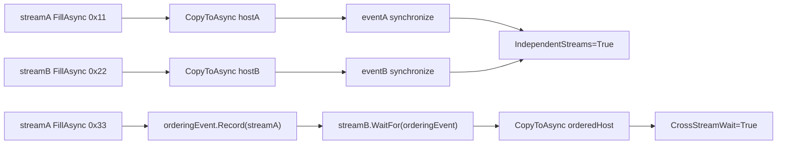
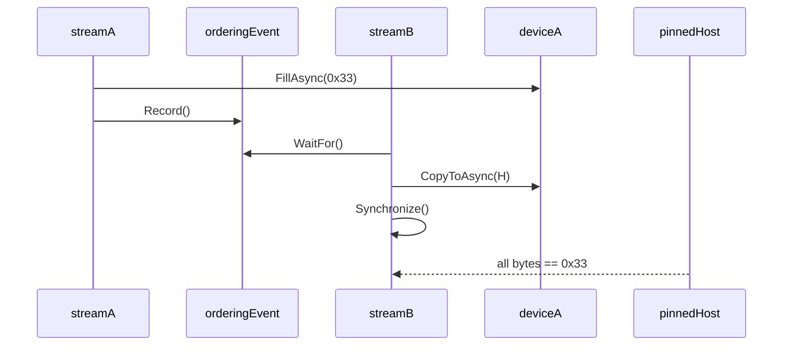

# MultiStream 博客版：用 CUDA Stream 和 Event 搭出可诊断的并发骨架

> 文章类型：样例教程长文
> 适合发布：微信公众号、技术博客、CUDA wrapper 使用导览
> 配图建议：两条 CUDA stream 并行填充 device memory，随后通过 event wait 建立跨 stream ordering 的流程图。
> 发布摘要：基于 `samples/Performance/01.MultiStream` 说明 TensorRtSharp4.0 如何用 C# wrapper 管理 CUDA stream、event、device memory 和 pinned host memory，并用 evidence markers 判断并发与同步是否真实发生。

## 为什么先讲 MultiStream

真实推理服务很少只有一条同步调用链。图像预处理、host-to-device copy、TensorRT enqueue、device-to-host readback 都可能分布在不同 stream 上。TensorRtSharp4.0 的 `samples/Performance/01.MultiStream` 不试图做完整推理服务，而是先证明 CUDA stream/event wrapper 能表达两个关键能力：

- 两条 non-blocking stream 可以独立执行异步填充和拷贝。
- 一个 stream 可以等待另一个 stream 上记录的 event，从而建立跨 stream 顺序。

这个样例不依赖 TensorRT，也不依赖外部模型资产，所以适合作为 CUDA wrapper 的第一条可运行路径。

## 样例流程



对应文件：

```text
samples/Performance/01.MultiStream/Program.cs
samples/Performance/01.MultiStream/README.md
docs/articles/zh-cn/cuda-stream-event-multistream-tutorial.md
```

## 运行命令

```powershell
dotnet build .\TensorRtSharp.sln -c Debug --no-restore /p:UseSharedCompilation=false
$env:JYPPX_ENABLE_DEVELOPMENT_PROBING = "1"
dotnet .\samples\Performance\01.MultiStream\bin\Debug\net8.0\MultiStream.dll
```

## 成功输出怎么读

关键 evidence lines：

```text
IndependentStreams=True A=True B=True Bytes=4096
CrossStreamWait=True ProducerStream=NonBlocking ConsumerStream=NonBlocking
StreamIds A=... B=...
MultiStream Passed=True
```

`IndependentStreams=True` 证明两条 stream 的独立 device fill/readback 符合预期。`CrossStreamWait=True` 证明 `streamB.WaitFor(orderingEvent)` 的顺序约束生效。`StreamIds` 用于诊断当前 CUDA runtime 是否能返回 stream id。

## 常见跳过状态

如果当前 CUDA runtime 无法初始化，样例会输出：

```text
MultiStream=Skipped Reason=...
```

这通常是 driver/runtime、DLL 搜索路径或设备可见性问题。它不是 C# wrapper API completion 的反证，也不是 package consumer smoke passed。

## 和 TensorRT 推理的关系

后续推理样例可以把 `CudaStream` 传入 TensorRT enqueue。MultiStream 先证明 stream/event 的基本生命周期和 ordering 能力；TensorRT 端的 enqueue、binding readiness、engine 生命周期仍由 `InferenceBindings`、`DynamicShape` 和 `OnnxToEngine` 样例继续证明。

## 边界

这篇文章不证明：

- CUDA 13.2 package consumer runtime smoke 已通过。
- TensorRT callback runtime proof 已完成。
- allocator callback 或 output allocator ownership 已可公开开放。
- 所有真实模型都能无修改接入多 stream pipeline。

## CTA

如果你准备把图像预处理和 TensorRT enqueue 做成异步流水线，建议先跑通 `MultiStream`，再接着跑 `InferenceBindings`。前者确认 stream/event，后者确认 execution context binding 和 enqueue。

## Stream、Event 与 Memory 的 owner 关系

`CudaStream` 的 handle/lifetime core 与同步、事件操作分别位于 `src/JYPPX.CudaSharp/Streams/CudaStream.cs`、
`src/JYPPX.CudaSharp/Streams/CudaStream.Synchronization.cs`，`CudaEvent` 位于
`src/JYPPX.CudaSharp/Events/CudaEvent.cs`；device/pinned owner 位于 `src/JYPPX.CudaSharp/Memory/CudaMemory.cs` 与
`src/JYPPX.CudaSharp/Memory/CudaPinnedMemory.cs`。异步操作排队后，相关 stream、event、device memory 和 pinned host memory
都必须保持存活，直到 event/stream 表明工作完成。



`WaitFor` 把 event 之前的 producer 工作排在 consumer copy 之前，但不会阻塞 host。最后的 `streamB.Synchronize()`
才让 host 安全检查 pinned memory。

## 为什么两段测试缺一不可

第一段分别在 streamA/streamB 上 fill、copy、record、event synchronize，验证两套 owner 没有串数据。
第二段复用 deviceA，故意让 streamB 消费 streamA 的结果，验证跨 stream dependency。只有前者通过，可能只是两条独立队列；
只有后者通过，也无法排除某条 stream 基础 copy 路径未覆盖。

```csharp
deviceA.FillAsync(0x33, ByteCount, streamA);
orderingEvent.Record(streamA);
streamB.WaitFor(orderingEvent);
deviceA.CopyToAsync(orderedHost, ByteCount, streamB);
streamB.Synchronize();
```

不要在 `Record` 前 dispose event，也不要在 consumer 完成前回收 device/pinned owner。

## E 盘日志与重复运行

```powershell
$repo = "."
$case = "..\downloads\cases\cuda-multistream"
New-Item -ItemType Directory -Force -Path "$case\logs" | Out-Null
Set-Location $repo

dotnet build .\samples\Performance\01.MultiStream\MultiStream.csproj -c Debug --no-restore --nologo
$env:JYPPX_ENABLE_DEVELOPMENT_PROBING = "1"
1..3 | ForEach-Object {
  dotnet .\samples\Performance\01.MultiStream\bin\Debug\net8.0\MultiStream.dll `
    2>&1 | Tee-Object "$case\logs\run-$_.log"
  if ($LASTEXITCODE -ne 0) { throw "MultiStream run $_ failed" }
}
```

重复运行用于发现释放顺序和偶发 ordering 问题，但三次本地 synthetic smoke 仍不等于 clean package runtime proof。

## `StreamIds` 只是诊断增强

某些 CUDA runtime 支持查询 stream id，样例通过 `TryGetStreamId` 输出值；若该查询不支持，核心 fill/copy/event 仍可能
正常。验收应以 `IndependentStreams`、`CrossStreamWait` 和最终 byte comparison 为主，不把 stream id 可用性作为所有
CUDA line 的硬要求。

## 放进 TensorRT pipeline 时

推荐把阶段和 event 明确命名：

1. copy stream：pinned host 到 input device。
2. preprocess stream：CUDA kernel 生成模型输入。
3. inference stream：等待 preprocess event 后调用 context enqueue。
4. postprocess stream：等待 inference event，再读取/处理 output。
5. readback stream：必要时复制结果到 pinned host。

每个 execution context 的并发规则必须遵循 TensorRT 契约，不能让多个 stream 无保护地同时修改同一个 context。buffer
复用也要等待上一轮 consumer 完成。

## 排障表

| 现象 | 检查 |
| --- | --- |
| `IndependentStreams=False` | fill byte count、pinned buffer、各自 event |
| `CrossStreamWait=False` | event record 顺序、wait 所在 stream、最终 synchronize |
| invalid resource handle | owner 是否提前 dispose、runtime 是否一致 |
| host 数据偶发错误 | pinned memory 生命周期、遗漏同步、并发复用 |
| `Skipped=True` | device count、driver/runtime、bridge search path |

默认 stream 与 non-blocking stream 的隐式同步规则容易掩盖错误。本文样例明确使用
`CudaStreamCreationFlags.NonBlocking`，让 ordering 只由 event 表达。

## Evidence 与边界

合格日志应含 build info、device count、stream flags、byte count、两类 boolean、退出码和原始诊断。若迁移到 TensorRT，
还要附 engine/input/output hash、binding readiness 和 context enqueue 结果。

本文不证明完整异步推理服务、CUDA Graph、allocator callback 或 package consumer runtime。保持
`performsPublish=false`、`canPublishPublicly=false`、`canCloseReleaseIssue=false`。

继续阅读：[CUDA Stream/Event 详细教程](cuda-stream-event-multistream-tutorial.md)、
[InferenceBindings 博客版](blog-inference-bindings-identity-network.md) 与 [CUDA Graph 边界](cuda-graph-capabilities-boundary.md)。
