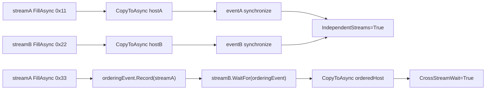

# MultiStream 博客版：用 CUDA Stream 和 Event 搭出可诊断的并发骨架

> 文章类型：样例教程长文
> 适合发布：微信公众号、技术博客、CUDA wrapper 使用导览
> 配图建议：两条 CUDA stream 并行填充 device memory，随后通过 event wait 建立跨 stream ordering 的流程图。
> 发布摘要：基于 `samples/MultiStream` 说明 TensorRtSharp4.0 如何用 C# wrapper 管理 CUDA stream、event、device memory 和 pinned host memory，并用 evidence markers 判断并发与同步是否真实发生。

## 为什么先讲 MultiStream

真实推理服务很少只有一条同步调用链。图像预处理、host-to-device copy、TensorRT enqueue、device-to-host readback 都可能分布在不同 stream 上。TensorRtSharp4.0 的 `samples/MultiStream` 不试图做完整推理服务，而是先证明 CUDA stream/event wrapper 能表达两个关键能力：

- 两条 non-blocking stream 可以独立执行异步填充和拷贝。
- 一个 stream 可以等待另一个 stream 上记录的 event，从而建立跨 stream 顺序。

这个样例不依赖 TensorRT，也不依赖外部模型资产，所以适合作为 CUDA wrapper 的第一条可运行路径。

## 样例流程



对应文件：

```text
samples/MultiStream/Program.cs
samples/MultiStream/README.md
docs/articles/zh-cn/cuda-stream-event-multistream-tutorial.md
```

## 运行命令

```powershell
dotnet build .\TensorRtSharp.sln -c Debug --no-restore /p:UseSharedCompilation=false
$env:JYPPX_ENABLE_DEVELOPMENT_PROBING = "1"
dotnet .\samples\MultiStream\bin\Debug\net8.0\MultiStream.dll
```

## 成功输出怎么读

关键 evidence lines：

```text
IndependentStreams=True A=True B=True Bytes=4096
CrossStreamWait=True ProducerStream=NonBlocking ConsumerStream=NonBlocking
StreamIds A=... B=...
MultiStream Passed=True
```

`IndependentStreams=True` 证明两条 stream 的独立 device fill/readback 符合预期。`CrossStreamWait=True` 证明 `streamB.WaitFor(orderingEvent)` 的顺序约束生效。`StreamIds` 用于诊断当前 CUDA runtime 是否能返回 stream id。

## 常见跳过状态

如果当前 CUDA runtime 无法初始化，样例会输出：

```text
MultiStream=Skipped Reason=...
```

这通常是 driver/runtime、DLL 搜索路径或设备可见性问题。它不是 C# wrapper API completion 的反证，也不是 package consumer smoke passed。

## 和 TensorRT 推理的关系

后续推理样例可以把 `CudaStream` 传入 TensorRT enqueue。MultiStream 先证明 stream/event 的基本生命周期和 ordering 能力；TensorRT 端的 enqueue、binding readiness、engine 生命周期仍由 `InferenceBindings`、`DynamicShape` 和 `OnnxToEngine` 样例继续证明。

## 边界

这篇文章不证明：

- CUDA 13.2 package consumer runtime smoke 已通过。
- TensorRT callback runtime proof 已完成。
- allocator callback 或 output allocator ownership 已可公开开放。
- 所有真实模型都能无修改接入多 stream pipeline。

## CTA

如果你准备把图像预处理和 TensorRT enqueue 做成异步流水线，建议先跑通 `MultiStream`，再接着跑 `InferenceBindings`。前者确认 stream/event，后者确认 execution context binding 和 enqueue。
