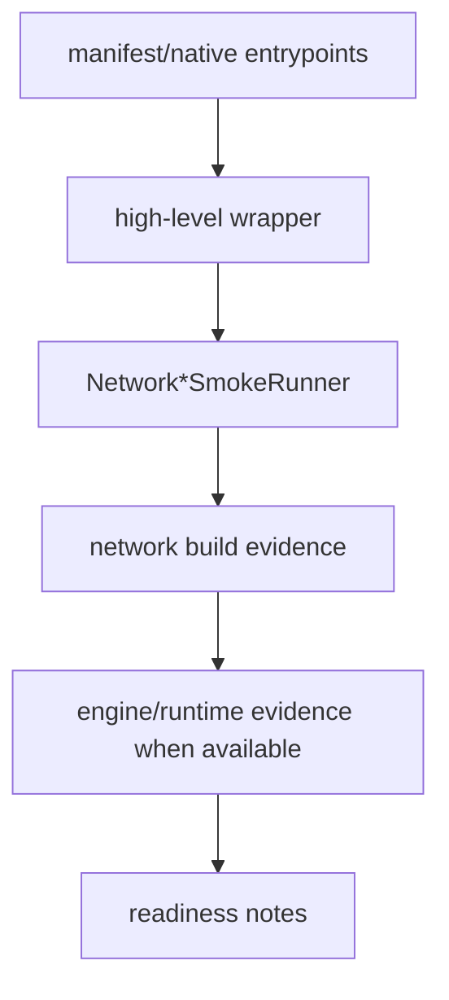

# Network Layer Coverage 博客版：看懂 layer smoke，不把它误读成模型精度证明

> 文章类型：覆盖度解读长文
> 适合发布：微信公众号、技术博客、发布说明辅助材料
> 配图建议：多个 `Network*SmokeRunner` 汇聚到 layer coverage checklist，再流向 release readiness 的结构图。
> 发布摘要：解释 TensorRtSharp4.0 如何用一组 network layer smoke runner 证明常见 TensorRT layer builder 路径可达，同时说明 layer coverage 与真实模型精度、callback proof、runtime package smoke 是不同层次的证据。

## 为什么 layer coverage 要单独看

接口 coverage 说的是 manifest/source 是否覆盖；sample smoke 说的是某条使用路径能否跑通；真实模型 accuracy 又是另一回事。Network layer coverage 位于中间层：它回答“这些 layer builder wrapper 是否能构建 network，并在必要时进入 engine/runtime 路径”。

## 当前 runner 家族

当前仓库中已有多条 `Network*SmokeRunner`：

```text
NetworkBuilderSmokeRunner
NetworkLayersSmokeRunner
NetworkConvolutionScaleSmokeRunner
NetworkActivationPoolingResizeSmokeRunner
NetworkConcatSliceSmokeRunner
NetworkSoftmaxTopKSmokeRunner
NetworkQuantizeDequantizeSmokeRunner
NetworkShapeOpsSmokeRunner
NetworkTrt11ModernLayersSmokeRunner
NetworkTrt11AdvancedLayersSmokeRunner
```

它们覆盖 convolution、scale、activation、pooling、resize、concat、slice、softmax、topk、quantize/dequantize、shape ops 和 TRT11 modern layers 等路径。



## 推荐运行顺序

```powershell
dotnet build .\TensorRtSharp.sln -c Debug --no-restore /p:UseSharedCompilation=false
$env:JYPPX_ENABLE_DEVELOPMENT_PROBING = "1"
dotnet .\smoke\NetworkBuilderSmokeRunner\bin\Debug\net8.0\NetworkBuilderSmokeRunner.dll
dotnet .\smoke\NetworkLayersSmokeRunner\bin\Debug\net8.0\NetworkLayersSmokeRunner.dll
dotnet .\smoke\NetworkConvolutionScaleSmokeRunner\bin\Debug\net8.0\NetworkConvolutionScaleSmokeRunner.dll
dotnet .\smoke\NetworkTrt11ModernLayersSmokeRunner\bin\Debug\net8.0\NetworkTrt11ModernLayersSmokeRunner.dll --tensor-rt-line 11
```

实际执行时可以按修改范围选择相关 runner，不必每次全跑所有 layer smoke。

## 如何写 evidence

一条可靠的 layer coverage 记录应包含：

- TensorRT line：TRT8、TRT10 或 TRT11。
- wrapper API 名称。
- native manifest/source 是否非 deferred。
- runner 名称。
- 输出 marker。
- 如果被环境阻塞，记录 `Skipped=True Reason=...`；如果来自 package consumer runtime，则继续使用 `blocked-by-cuda-driver` 这类明确分类，不写成 smoke passed。

## 不能误读

Layer coverage 不等于：

- 所有真实 ONNX 模型都能 parse。
- 所有 layer 组合都已做精度验证。
- CUDA 13.2 package consumer smoke passed。
- real callback runtime proof complete。
- Linux runner proof complete。

尤其是 TRT11 modern layers，应继续保留 version guard。TRT11 专属能力不能被写成 TRT8/TRT10 同样可用。

## CTA

当你准备接入一个真实模型时，先看它主要依赖哪些 TensorRT layer，再对照相应 `Network*SmokeRunner`。如果 layer smoke 可达，但模型仍失败，下一步通常要看 ONNX parser error、plugin registry、dynamic shape profile 或模型资产本身。
