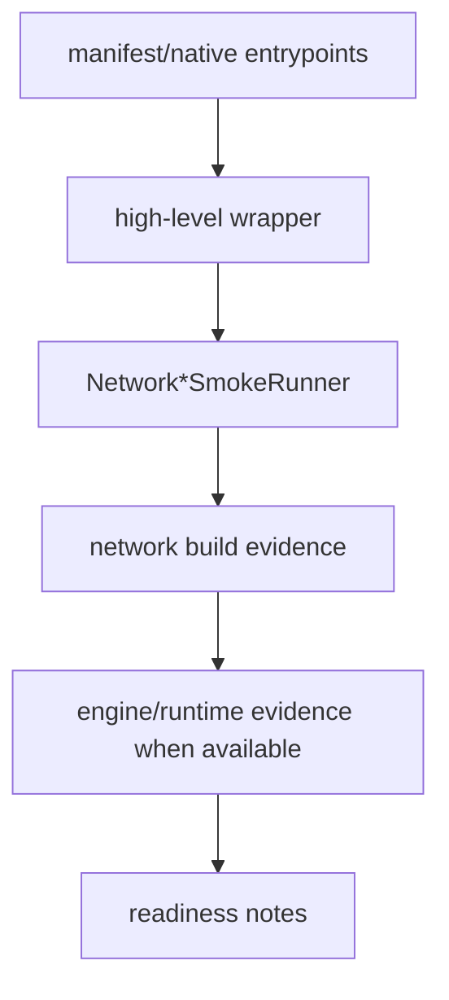
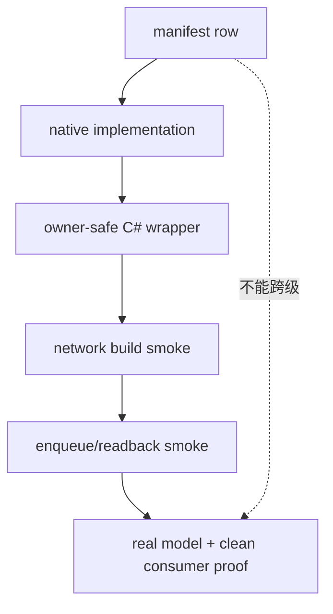

# Network Layer Coverage 博客版：看懂 layer smoke，不把它误读成模型精度证明

> 文章类型：覆盖度解读长文
> 适合发布：微信公众号、技术博客、发布说明辅助材料
> 配图建议：多个 `Network*SmokeRunner` 汇聚到 layer coverage checklist，再流向 release readiness 的结构图。
> 发布摘要：解释 TensorRtSharp4.0 如何用一组 network layer smoke runner 证明常见 TensorRT layer builder 路径可达，同时说明 layer coverage 与真实模型精度、callback proof、runtime package smoke 是不同层次的证据。

## 为什么 layer coverage 要单独看

接口 coverage 说的是 manifest/source 是否覆盖；sample smoke 说的是某条使用路径能否跑通；真实模型 accuracy 又是另一回事。Network layer coverage 位于中间层：它回答“这些 layer builder wrapper 是否能构建 network，并在必要时进入 engine/runtime 路径”。

## 当前 runner 家族

当前仓库中已有多条 `Network*SmokeRunner`：

```text
NetworkBuilderSmokeRunner
NetworkLayersSmokeRunner
NetworkConvolutionScaleSmokeRunner
NetworkActivationPoolingResizeSmokeRunner
NetworkConcatSliceSmokeRunner
NetworkSoftmaxTopKSmokeRunner
NetworkQuantizeDequantizeSmokeRunner
NetworkShapeOpsSmokeRunner
NetworkTrt11ModernLayersSmokeRunner
NetworkTrt11AdvancedLayersSmokeRunner
```

它们覆盖 convolution、scale、activation、pooling、resize、concat、slice、softmax、topk、quantize/dequantize、shape ops 和 TRT11 modern layers 等路径。



## 推荐运行顺序

```powershell
dotnet build .\TensorRtSharp.sln -c Debug --no-restore /p:UseSharedCompilation=false
$env:JYPPX_ENABLE_DEVELOPMENT_PROBING = "1"
dotnet .\smoke\NetworkBuilderSmokeRunner\bin\Debug\net8.0\NetworkBuilderSmokeRunner.dll
dotnet .\smoke\NetworkLayersSmokeRunner\bin\Debug\net8.0\NetworkLayersSmokeRunner.dll
dotnet .\smoke\NetworkConvolutionScaleSmokeRunner\bin\Debug\net8.0\NetworkConvolutionScaleSmokeRunner.dll
dotnet .\smoke\NetworkTrt11ModernLayersSmokeRunner\bin\Debug\net8.0\NetworkTrt11ModernLayersSmokeRunner.dll --tensor-rt-line 11
```

实际执行时可以按修改范围选择相关 runner，不必每次全跑所有 layer smoke。

## 如何写 evidence

一条可靠的 layer coverage 记录应包含：

- TensorRT line：TRT8、TRT10 或 TRT11。
- wrapper API 名称。
- native manifest/source 是否非 deferred。
- runner 名称。
- 输出 marker。
- 如果被环境阻塞，记录 `Skipped=True Reason=...`；如果来自 package consumer runtime，则继续使用 `blocked-by-cuda-driver` 这类明确分类，不写成 smoke passed。

## 不能误读

Layer coverage 不等于：

- 所有真实 ONNX 模型都能 parse。
- 所有 layer 组合都已做精度验证。
- CUDA 13.2 package consumer smoke passed。
- real callback runtime proof complete。
- Linux runner proof complete。

尤其是 TRT11 modern layers，应继续保留 version guard。TRT11 专属能力不能被写成 TRT8/TRT10 同样可用。

## CTA

当你准备接入一个真实模型时，先看它主要依赖哪些 TensorRT layer，再对照相应 `Network*SmokeRunner`。如果 layer smoke 可达，但模型仍失败，下一步通常要看 ONNX parser error、plugin registry、dynamic shape profile 或模型资产本身。

## 先把“覆盖”拆成五层

同一个 layer 可以在 manifest 中存在，却仍处于 deferred；也可以完成 C# wrapper 与 network build，却没有 enqueue/readback。
因此本文使用五层证据，而不是一个笼统百分比：

| 层级 | 权威证据 | 回答的问题 |
| --- | --- | --- |
| ABI declaration | `native/manifests` | entrypoint 与签名是否声明 |
| native implementation | `native/src/tensorrt` | 是否真实调用 TensorRT，而非 deferred stub |
| managed wrapper | `src/JYPPX.TensorRtSharp` | 用户是否获得强类型、owner-safe API |
| network/engine smoke | `smoke/Network*SmokeRunner` | 最小构建或执行路径是否可达 |
| model/runtime proof | 外部模型与 clean consumer record | 真实组合是否满足业务输出 |

`artifacts/interface-coverage/tensorrt-interface-coverage.csv` 主要服务前三层；runner 输出服务第四层；第五层必须有
模型、输入、输出、环境与 hash，不能从前四层推断。



## Runner 家族如何分工

仓库当前将常见算子按行为分组，而不是建一个难以定位失败的巨型 runner：

- `smoke/NetworkConvolutionScaleSmokeRunner`：卷积与 scale 权重、shape 和输出路径。
- `smoke/NetworkActivationPoolingResizeSmokeRunner`：activation、pooling、resize 参数组合。
- `smoke/NetworkConcatSliceSmokeRunner`：多输入 concat 与 slice start/size/stride。
- `smoke/NetworkSoftmaxTopKSmokeRunner`：axes、TopK operation 与 index/value 输出。
- `smoke/NetworkMatrixFillSelectSmokeRunner`：matrix multiply、fill、select。
- `smoke/NetworkQuantizeDequantizeSmokeRunner`：quantize/dequantize scale 与 dtype。
- `smoke/NetworkShapeOpsSmokeRunner`：shape tensor、shuffle 与形状计算。
- `smoke/NetworkDeconvolutionSmokeRunner`、`smoke/NetworkLrnSmokeRunner`：独立兼容路径。
- `smoke/NetworkTrt11ModernLayersSmokeRunner`、`smoke/NetworkTrt11AdvancedLayersSmokeRunner`：TRT11 专属能力。

这种拆分让失败可以映射到 layer family，也让版本 guard 留在对应 runner 内。通配路径
`smoke/Network*SmokeRunner` 是文档中的集合引用；实际命令应使用明确项目名。

## 一次有边界的验证流程

```powershell
$repo = "."
$case = "..\downloads\cases\network-layer-coverage"
New-Item -ItemType Directory -Force -Path "$case\logs" | Out-Null
Set-Location $repo

dotnet build .\TensorRtSharp.sln -c Debug --no-restore --nologo -m:1
$env:JYPPX_ENABLE_DEVELOPMENT_PROBING = "1"

$runners = @(
  "NetworkConvolutionScaleSmokeRunner",
  "NetworkActivationPoolingResizeSmokeRunner",
  "NetworkConcatSliceSmokeRunner",
  "NetworkSoftmaxTopKSmokeRunner",
  "NetworkQuantizeDequantizeSmokeRunner",
  "NetworkShapeOpsSmokeRunner"
)
foreach ($runner in $runners) {
  dotnet ".\smoke\$runner\bin\Debug\net8.0\$runner.dll" `
    2>&1 | Tee-Object "$case\logs\$runner.log"
  if ($LASTEXITCODE -ne 0) { throw "$runner failed with exit code $LASTEXITCODE" }
}
```

这里没有把 `Skipped=True` 当失败码自动吞掉。记录方仍须解析每个日志的 classification：如果依赖缺失、driver
不兼容或 requested line 不支持，日志应标记 blocked/skipped，汇总也必须保留同样分类。

## 如何从模型反查 layer

接入 ONNX 模型时，建议先用 parser diagnostics 和 network inspection 得到 layer/name/type，再做映射：

1. 保存模型来源、license 和 SHA256。
2. 运行 parser dry-run，保存 error count 与 copied error descriptions。
3. 对已创建的 network 输出 layer type、输入输出 dtype/shape。
4. 将高风险或版本专属 layer 映射到具体 runner。
5. runner 通过后再进行 engine build、enqueue 与业务输出验证。

例如 resize smoke 能通过，不代表模型的 coordinate transformation、nearest rounding 或 dynamic shape 组合正确；
quantize/dequantize 能创建，也不代表 calibration、scale broadcast 和最终精度满足模型要求。

## 跨版本读法

TRT8、TRT10、TRT11 共享的 wrapper 名称不保证底层 API 完全同构。必须检查：

- 对应 line 的 manifest 是否有 entrypoint。
- native v8/v10/v11 adapter 是否实现相同 public 语义。
- 枚举值、dims 宽度和 deprecated layer 是否经过转换。
- unsupported line 是明确异常/skip，而不是错误落到另一 DLL。
- runner 日志是否写出实际 TensorRT line 与 build info。

TRT11 的 `TensorRtDims64`、attention、modern/advanced layer 证据只能归到 TRT11。TRT8 的 legacy shape binding 也
不能因为 managed 方法同名而写成 TRT11 行为。

## 输出记录模板

```text
Runner=<exact runner name>
TensorRtLine=<8|10|11>
LayerFamily=<family>
ManifestState=<implemented|deferred|not-applicable>
ManagedWrapper=<type and method>
NetworkBuilt=<True|False>
EngineBuilt=<True|False>
EnqueueAttempted=<True|False>
OutputValidated=<True|False>
Classification=<passed|failed|skipped|blocked>
Reason=<diagnostic>
```

`NetworkBuilt=True` 与 `OutputValidated=False` 是合法组合，说明证据停在 build。不要为了漂亮报表将它压缩成一个
`Passed=True`。反过来，真实模型失败也不一定说明 wrapper 缺失，parser contract、plugin、profile 或资产都可能是原因。

## 排障顺序

**入口找不到**：先对照 manifest 和 generated entrypoint，再检查加载的 bridge/runtime key，不要先改 managed wrapper。

**创建返回 null object**：读取 bridge last error 与 copied error recorder，检查 shape/dtype/axes 和版本支持。

**build 失败**：检查 workspace、profile、precision flag、plugin registry 和 network output 是否完整。

**enqueue 失败**：检查 execution context readiness、所有 tensor address、dynamic input shape、device buffer 与 stream。

**输出不匹配**：保存原始 tensor，核对算子参数和容差；layer smoke 的预期值应是确定的，不能只看“无异常”。

## 收口清单与边界

- 每个高频 family 至少有 manifest/native/wrapper/smoke 四层链接。
- 每个 runner 有明确输出 marker 与失败码。
- version-specific runner 有正向 line 和错误 line guard。
- borrowed tensor/layer 只在 owner 存活期内使用，public 报告使用 copied metadata。
- build-only、synthetic smoke 与真实模型 proof 分栏记录。
- 所有发布 flag 保持 false，直到真实外部 proof 和 owner authorization 到位。
- `performsPublish=false`、`canPublishPublicly=false`、`canCloseReleaseIssue=false`。

继续阅读：[接口 coverage 与 deferred 边界](interface-zero-to-deferred-boundary.md)、
[TRT11 modern layers](trt11-modern-layers-guide.md) 与 [YoloVision 真实资产接入](yolovision-real-asset-walkthrough.md)。
