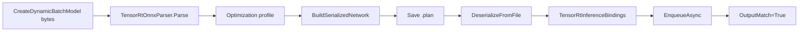

# ONNX Parser 博客版：从内置模型到 Serialized Engine Round-Trip

> 文章类型：样例教程长文
> 适合发布：微信公众号、技术博客、模型部署入门材料
> 配图建议：一个 `.onnx` 内存模型转换为 TensorRT network、serialized engine 文件、runtime deserialize、inference output 的流程图。
> 发布摘要：用 `samples/OnnxToEngine` 演示不依赖外部模型资产的 ONNX parser、engine build、plan 文件 round-trip 和推理读回闭环。

## 为什么先不用外部模型

外部 ONNX 模型会带来许可证、opset、输入 layout、预处理、labels 和测试图片等变量。它们很重要，但不适合放在第一条链路里。`samples/OnnxToEngine` 通过进程内生成最小 identity ONNX，让验证目标集中在 parser、builder、serialized engine 和 inference binding 本身。

## 端到端流程



对应文件：

```text
samples/OnnxToEngine/Program.cs
samples/OnnxToEngine/README.md
docs/articles/zh-cn/onnx-parser-to-serialized-engine-tutorial.md
```

## 运行命令

```powershell
dotnet build .\TensorRtSharp.sln -c Debug --no-restore /p:UseSharedCompilation=false
$env:JYPPX_ENABLE_DEVELOPMENT_PROBING = "1"
dotnet .\samples\OnnxToEngine\bin\Debug\net8.0\OnnxToEngine.dll --tensor-rt-line 10 --batch 2
```

## 成功输出怎么读

```text
Parsed=True ProfileIndex=0 EngineFileRoundTrip=True
BindingReport Ready=True Inputs=1 Outputs=1
Execution ... OutputMatch=True
OnnxToEngine Passed=True
```

`Parsed=True` 证明 ONNX parser 把模型加载进 network。`EngineFileRoundTrip=True` 证明 serialized engine 已写入文件并能被 runtime 重新反序列化。`OutputMatch=True` 证明最小推理闭环成立。

## 和真实模型的距离

真实分类或检测模型还需要补充：

- 模型来源 URL 和许可证。
- 输入 tensor 名称、layout、shape、dtype。
- 图像预处理和输出后处理。
- labels、测试图片和再分发要求。
- package consumer 或 sample smoke evidence。

因此这篇文章只证明最小 ONNX 到 TensorRT engine 路径，不宣称所有真实模型都无需修改即可运行。

## 边界说明

如果本机返回 `blocked-by-cuda-driver`，应记录为 CUDA driver/runtime compatibility 阻塞。它不是 ONNX parser 失败，也不是 real callback runtime proof。

## CTA

接下来可以把这条最小 round-trip 路径迁移到 `samples/Classification` 或 `samples/YoloVision`，但在写模型案例前，先补模型资产清单和许可证说明。
