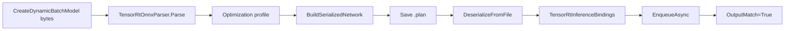
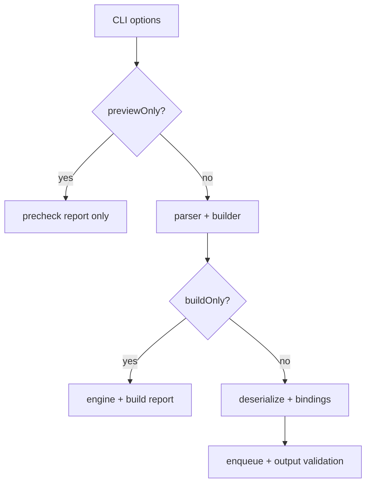

# ONNX Parser 博客版：从内置模型到 Serialized Engine Round-Trip

> 文章类型：样例教程长文
> 适合发布：微信公众号、技术博客、模型部署入门材料
> 配图建议：一个 `.onnx` 内存模型转换为 TensorRT network、serialized engine 文件、runtime deserialize、inference output 的流程图。
> 发布摘要：用 `samples/OnnxToEngine` 演示不依赖外部模型资产的 ONNX parser、engine build、plan 文件 round-trip 和推理读回闭环。

## 为什么先不用外部模型

外部 ONNX 模型会带来许可证、opset、输入 layout、预处理、labels 和测试图片等变量。它们很重要，但不适合放在第一条链路里。`samples/OnnxToEngine` 通过进程内生成最小 identity ONNX，让验证目标集中在 parser、builder、serialized engine 和 inference binding 本身。

## 端到端流程



对应文件：

```text
samples/OnnxToEngine/Program.cs
samples/OnnxToEngine/README.md
docs/articles/zh-cn/onnx-parser-to-serialized-engine-tutorial.md
```

## 运行命令

```powershell
dotnet build .\TensorRtSharp.sln -c Debug --no-restore /p:UseSharedCompilation=false
$env:JYPPX_ENABLE_DEVELOPMENT_PROBING = "1"
dotnet .\samples\OnnxToEngine\bin\Debug\net8.0\OnnxToEngine.dll --tensor-rt-line 10 --batch 2
```

## 成功输出怎么读

```text
Parsed=True ProfileIndex=0 EngineFileRoundTrip=True
BindingReport Ready=True Inputs=1 Outputs=1
Execution ... OutputMatch=True
OnnxToEngine Passed=True
```

`Parsed=True` 证明 ONNX parser 把模型加载进 network。`EngineFileRoundTrip=True` 证明 serialized engine 已写入文件并能被 runtime 重新反序列化。`OutputMatch=True` 证明最小推理闭环成立。

## 和真实模型的距离

真实分类或检测模型还需要补充：

- 模型来源 URL 和许可证。
- 输入 tensor 名称、layout、shape、dtype。
- 图像预处理和输出后处理。
- labels、测试图片和再分发要求。
- package consumer 或 sample smoke evidence。

因此这篇文章只证明最小 ONNX 到 TensorRT engine 路径，不宣称所有真实模型都无需修改即可运行。

## 边界说明

如果本机返回 `blocked-by-cuda-driver`，应记录为 CUDA driver/runtime compatibility 阻塞。它不是 ONNX parser 失败，也不是 real callback runtime proof。

## CTA

接下来可以把这条最小 round-trip 路径迁移到 `samples/Classification` 或 `samples/YoloVision`，但在写模型案例前，先补模型资产清单和许可证说明。

## 先分清三种运行模式

当前 `samples/OnnxToEngine` 已承载 trtexec-like options，因此同一程序会产生不同证据等级：

| 模式 | 是否要求 ONNX | 是否 build | 是否 enqueue | 合理分类 |
| --- | --- | --- | --- | --- |
| `--previewOnly` | 可缺失 | 否 | 否 | precheck |
| external `--buildOnly` | 是 | 是 | 否 | build evidence |
| 内置 identity 默认路径 | 进程内生成 | 是 | 是 | synthetic runtime smoke |
| 模型特定 runtime | 是 | 是/加载 | 是 | model runtime candidate |

option parsing 的主编排位于 `src/JYPPX.TensorRtSharp.Tools/Trtexec/TrtexecLikeParser.cs`；argument collection、
scalar parsing、build option value normalization 与 memory unit parsing 分别位于
`TrtexecLikeParser.Arguments.cs`、`TrtexecLikeParser.ScalarParsing.cs`、
`TrtexecLikeParser.BuildOptionValues.cs`、`TrtexecLikeParser.MemoryUnits.cs`。build orchestration 位于
`src/JYPPX.TensorRtSharp.Tools/Build/OnnxEngineBuildService.cs`，deployment 与 runtime 投影分别位于
`OnnxEngineBuildService.DeploymentConfiguration.cs`、`OnnxEngineBuildService.RuntimeExecution.cs`。
`samples/OnnxToEngine/trtexec-parity-matrix.json` 记录每个参数是 applied、diagnostic 还是 parse-only；不能只因 CLI
接受参数就声称与官方 trtexec 行为等价。



## 内置 identity 路径为什么重要

`src/JYPPX.TensorRtSharp.Tools/Runtime/OnnxIdentityModel.cs` 生成一个结构确定的 dynamic identity model，消除下载、
license、preprocess 和后处理变量。parser 仍会经过 `TensorRtOnnxParser`，engine 仍会写文件并从文件重新加载，输出仍会
逐元素比对，因此它是框架链路的高价值 smoke。

但 synthetic identity 的 operator 集极小，不能证明真实模型的 opset、plugin 或 shape contract。

## E 盘 round-trip 命令

```powershell
$repo = "E:\GitSpace\TensorRT-CSharp-API-4.0\TensorRtSharp4.0"
$case = "E:\TensorRtSharpAssets\cases\onnx-identity-roundtrip"
New-Item -ItemType Directory -Force -Path "$case\engines","$case\reports","$case\logs" | Out-Null
Set-Location $repo

dotnet build .\samples\OnnxToEngine\OnnxToEngine.csproj -c Debug --no-restore --nologo
$env:JYPPX_ENABLE_DEVELOPMENT_PROBING = "1"
dotnet .\samples\OnnxToEngine\bin\Debug\net8.0\OnnxToEngine.dll `
  --tensor-rt-line 10 --batch 2 `
  --saveEngine "$case\engines\identity-trt10.plan" `
  --exportReport "$case\reports\identity-trt10.json" `
  2>&1 | Tee-Object "$case\logs\identity-trt10.log"
```

engine 对 TensorRT version、GPU compatibility、plugins 和 build flags 敏感，不应把 `.plan` 当跨环境通用文件。报告应保存
engine SHA256、runtime line、build info 和输入 shape。

## 外部模型 build-only

```powershell
dotnet .\samples\OnnxToEngine\bin\Debug\net8.0\OnnxToEngine.dll `
  --tensor-rt-line 10 `
  --onnx "E:\TensorRtSharpAssets\cases\external-model\models\model.onnx" `
  --saveEngine "E:\TensorRtSharpAssets\cases\external-model\engines\model.plan" `
  --minShapes input:1x3x640x640 `
  --optShapes input:1x3x640x640 `
  --maxShapes input:4x3x640x640 `
  --fp16 --workspace 512 --buildOnly `
  --exportReport "E:\TensorRtSharpAssets\cases\external-model\reports\build.json"
```

这里的 `input`、shape、precision 和 workspace 都必须由模型契约确认。build-only 成功只说明 parser/builder 能产出
engine，不说明输出语义或精度。未知模型默认不自动猜 binding 与后处理。

## Parser diagnostics 怎么保存

parser failure 应至少记录 error count、code、description、node/file context 和 TensorRT line。仓库 runner 使用
`TensorRtOnnxParserDiagnosticSnapshot` 与 summary 将字符串复制到 managed 侧，并可在 `ClearErrors()` 后继续诊断；
snapshot/summary 分别由 `TensorRtOnnxParserDiagnosticSnapshot.cs` 与 `TensorRtOnnxParserDiagnosticSummary.cs` 拥有，
ParserRefitter 对应使用 `TensorRtOnnxParserRefitterDiagnosticSnapshot.cs` 与
`TensorRtOnnxParserRefitterDiagnosticSummary.cs`。

ONNX config 的 native owner、复制快照与紧凑摘要分别由 `TensorRtOnnxConfig.cs`、
`TensorRtOnnxConfigSnapshot.cs`、`TensorRtOnnxConfigSummary.cs` 拥有。模型支持诊断也按职责拆开：
`TensorRtOnnxModelSupportReport.cs` 负责报告与汇总入口，`TensorRtOnnxModelSupportSummary.cs` 负责复制型摘要，
`TensorRtOnnxSubgraphSupportInfo.cs` 负责单条子图记录。这些类型仍只表达 copied managed values；源码拆分与摘要本身
不构成 runtime 或 release proof，也不会替代真实模型执行、独立输出核验或 package-consumer 证据。

常见分层：

- unsupported operator/opset：先核对 TensorRT parser 能力。
- plugin creator missing：运行 Plugin Inventory，核对 name/version/namespace。
- dynamic input 没有 profile：补 min/opt/max。
- parser 成功但 build 失败：看 builder config、workspace、precision 和 copied error recorder。
- engine 加载失败：核对 engine 构建环境、runtime line 和 plugin library。
- enqueue/readback 失败：转到 binding/readiness 与模型输出 contract。

不要把 parser error 统一归类成 CUDA driver 问题，也不要把 driver blocker改写成 ONNX 不受支持。

## 输出证据链

| Marker | 证明层级 |
| --- | --- |
| `Parsed=True ParserErrors=0` | parser/network |
| `ProfileIndex=0` | build profile |
| `EngineFileRoundTrip=True` | serialization/deserialize |
| `BindingReport Ready=True` | execution preparation |
| `Enqueue=True OutputMatch=True` | identity runtime smoke |

每一行都应来自同一命令、同一 host。若中途生成报告后换了 engine 或 runtime，必须重新计算 hash 并建立新的 record。

## 真实模型需要补齐什么

- 模型 URL、license、下载时间、原始 SHA256 与 export command。
- input/output tensor 的 name、dtype、shape、layout 与 dynamic range。
- 预处理、labels、后处理、业务容差和测试输入来源。
- plugin library 与 creator inventory。
- engine/report/output/log SHA256。
- clean consumer、host metadata 与 validator。

YoloVision、Classification 或 MNIST 等模型特定路径应使用自己的 validator，不能只复用 identity 的 `OutputMatch=True`。

## Proof boundary 与延伸阅读

preview、build-only、内置 identity smoke 和真实模型 proof 是四个不同等级。本文不执行发布，保持
`performsPublish=false`、`canPublishPublicly=false`、`canCloseReleaseIssue=false`。

继续阅读：[ONNX Parser 详细教程](onnx-parser-to-serialized-engine-tutorial.md)、
[OnnxToEngine/trtexec 转换指南](onnx-to-engine-trtexec-conversion-guide.md) 与
[InferenceBindings 博客版](blog-inference-bindings-identity-network.md)。
