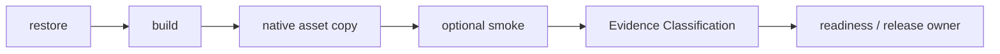

# 从 NuGet 包到真实消费端：TensorRtSharp4.0 如何证明用户真的能用

> 文章类型：技术长文
> 适合发布：微信公众号、技术博客、Release Candidate 说明
> 配图建议：package consumer 流程图、native asset copy 表格、`package-consumer-validation-summary.md` 截图
> 发布摘要：说明 TensorRtSharp4.0 为什么把 package consumer 作为发布证据核心，并用 Evidence Classification 字段区分 native-copy、dependency probe、runtime execution 和 real callback proof。
> 公众号封面建议：一张从 NuGet 包到 consumer 输出目录的横向流程图，右侧放大 `EvidenceKind`、`RuntimeSmokeClassification`、`IsDependencyProbeOnly` 三个字段。

## 为什么 package consumer 很关键

很多库在源码目录里可以 build，但一旦变成 NuGet 包给用户安装，就会暴露另一批问题：

- managed assembly 没打进包。
- runtime package 没被引用。
- native DLL 没复制到输出目录。
- `.targets` 不生效。
- consumer 项目意外用了 `ProjectReference`，验证结果不真实。
- smoke 失败时没有结构化诊断。

TensorRtSharp4.0 把 package consumer 当成 release readiness 的核心证据。它不只问“包有没有生成”，而是问：

> 离开源码目录以后，一个普通 .NET consumer 能不能 restore、build、复制 native assets，并在可选 smoke 中启动 packaged runtime？

## 核心脚本

入口脚本是：

```powershell
pwsh -NoProfile -ExecutionPolicy Bypass -File .\eng\Test-PackageConsumer.ps1 `
  -RuntimePackageKey win-x64-trt11.0-cuda13.2-cudnn9.22 `
  -RunSmoke `
  -AllowSmokeFailure
```

输出位于：

```text
artifacts/package-consumer/package-consumer-validation-summary.json
artifacts/package-consumer/package-consumer-validation-summary.md
```

如果只是验证 restore/build/native-copy，可以不传 `-RunSmoke`。如果当前机器 CUDA driver 不兼容目标 runtime，则保留 `-AllowSmokeFailure`，让脚本把 `blocked-by-cuda-driver` 写成证据，而不是中途丢失报告。

## 验证链路

package consumer 验证大致分为六段：



| 阶段 | 验证内容 | 失败时常见原因 |
| --- | --- | --- |
| restore | managed/runtime package 能否从包源还原 | 包 ID、version、source 配置错误 |
| build | consumer 项目是否能编译 | public API 缺失、target framework 不匹配 |
| native-copy | native assets 是否进入输出目录 | `.targets`、runtime package、asset pattern 问题 |
| unblock/sign | Windows application control 边界 | WDAC 或未签名临时输出 |
| smoke | packaged runtime 是否启动 | driver/runtime mismatch、DLL missing |
| report | JSON/Markdown 证据 | schema 缺失或分类不清 |

## 新的 Evidence Classification 字段

为了避免“包能被消费”和“runtime 真正跑通”混在一起，summary 现在包含机器可读字段：

```text
EvidenceKind
RuntimeSmokeClassification
IsRuntimeExecutionEvidence
IsDependencyProbeOnly
IsRealCallbackRuntimeProof
```

它们的含义是：

| 字段 | 示例 | 含义 |
| --- | --- | --- |
| `EvidenceKind` | `full-runtime-package-consumer-smoke-driver-blocked` | 当前报告的证据类别。 |
| `RuntimeSmokeClassification` | `runtime-smoke-driver-blocked` | runtime smoke 的分类。 |
| `IsRuntimeExecutionEvidence` | `False` | 是否能作为 runtime execution proof。 |
| `IsDependencyProbeOnly` | `True` | 是否只能作为 dependency/package evidence。 |
| `IsRealCallbackRuntimeProof` | `False` | 是否满足真实 callback runtime proof。 |

当前 CUDA 13.2 Windows 包线的典型读法是：

```text
EvidenceKind=full-runtime-package-consumer-smoke-driver-blocked
RuntimeSmokeClassification=runtime-smoke-driver-blocked
IsRuntimeExecutionEvidence=False
IsDependencyProbeOnly=True
IsRealCallbackRuntimeProof=False
```

这意味着 restore/build/native-copy 是有效证据，但当前机器不是 CUDA 13.2 runtime smoke 的兼容执行环境。

## 怎么判断 native assets

summary 中的 native asset 数量例如：

```text
NativeAssetsFound=19
NativeAssetsExpected=19
```

它证明 runtime package 的 native assets copy 逻辑生效。它不能证明：

- 当前 GPU runtime 一定能执行。
- TensorRT engine 一定能在当前机器创建。
- callback trampoline 已经被 TensorRT runtime 调用。

所以 release 文档必须同时写 native asset 结果和 smoke classification。

## blocked-by-cuda-driver 怎么读

`blocked-by-cuda-driver` 的典型 diagnostic 是：

```text
cudaRuntimeGetVersion reported CUDA error 35
```

这说明 packaged runtime 已经启动到 CUDA runtime 边界，但当前 driver 不支持目标 CUDA runtime。它不是：

- NuGet restore 失败。
- native asset copy 失败。
- TensorRtSharp API 缺失。
- callback proof 完成。

正确下一步是换兼容 driver/GPU host 复测，而不是删除 smoke 或把状态写成 passed。

## 与 readiness 的关系

`Test-RuntimePackageReadiness.ps1` 会读取 package consumer summary，并把它汇总到：

```text
artifacts/package-readiness/runtime-package-readiness-summary.md
```

readiness clean 表示包布局、native copy、bridge dependency 和 wrapper surface 等证据足够；它仍然不能替代 GPU runtime smoke 或真实 callback runtime proof。

## 适合放进 release note 的写法

推荐写法：

> 当前 `win-x64-trt11.0-cuda13.2-cudnn9.22` package consumer 已完成 restore/build/native-copy，native asset count 为 19/19；本机 runtime smoke 被 CUDA driver/runtime compatibility 阻塞为 `blocked-by-cuda-driver`，因此 `IsRuntimeExecutionEvidence=False`、`IsRealCallbackRuntimeProof=False`。

不推荐写法：

> CUDA 13.2 runtime smoke 已通过。

如果没有兼容 driver/GPU host 的真实输出，这句话就是过度宣称。

## 总结

package consumer 是把“开发者机器能 build”推进到“用户安装包后也能恢复同样能力”的关键证据。TensorRtSharp4.0 通过 JSON/Markdown summary、evidence classification、native asset count 和 callback proof 字段，把发布状态拆得足够细，让 release owner 可以做真实判断。

写 release note 或公众号文章时，最稳的做法是同时贴出 `NativeAssetsFound/NativeAssetsExpected`、`RuntimeSmokeClassification`、`IsDependencyProbeOnly` 和 `IsRealCallbackRuntimeProof`。这样读者能知道哪些是包消费端证据，哪些还需要兼容 GPU/driver host 继续复测。

下一步阅读：

- [Package Readiness 当前状态](package-readiness-current-state.md)
- [最终发布 Dry Run](final-release-dry-run.md)
- [CUDA error 35 与驱动兼容排查](cuda-error-35-troubleshooting.md)
