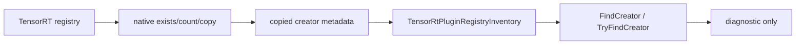
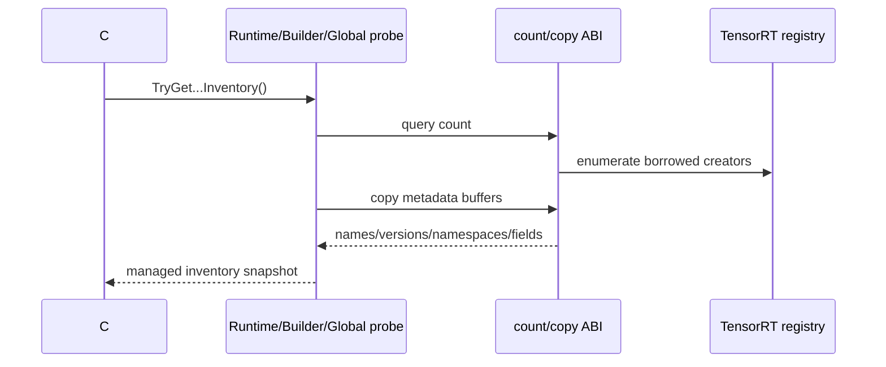

# Plugin Inventory 博客版：只复制元数据，不暴露 borrowed pointer

> 文章类型：接口专题长文
> 适合发布：微信公众号、技术博客、部署排障文章
> 配图建议：TensorRT plugin registry 到 native count/copy bridge，再到 `TensorRtPluginRegistryInventory` 的三段式图。
> 发布摘要：介绍 TensorRtSharp4.0 的 Plugin Inventory 只读 API 如何帮助 .NET 用户在部署前检查 creator count、name、version、namespace 和 field metadata，同时避免 public API 暴露 native `IPluginCreator*` 生命周期风险。

## Plugin 问题为什么要提前发现

ONNX 或 TensorRT engine 里一旦依赖 plugin，部署失败往往不发生在 C# 调用点，而是更早隐藏在 registry 可见性里：

- 自定义 plugin library 没有加载。
- creator name 或 version 与导出模型不一致。
- namespace 不匹配。
- TRT8、TRT10、TRT11 的 registry 能力不完全一致。

直接把 native creator pointer 交给 C# 用户看似方便，但会带来 borrowed pointer、生命周期和 ABI 异常传播问题。Plugin Inventory 的设计取舍是：只复制可安全表达的元数据，不开放 ownership 不清楚的 native pointer。

## 只读链路



对应文件：

```text
src/JYPPX.TensorRtSharp/Plugins/TensorRtPluginRegistryInventory.cs
smoke/PluginRegistryInventorySmokeRunner/Program.cs
docs/articles/zh-cn/plugin-inventory-readonly-api.md
```

## 能查询什么

当前只读 API 覆盖：

- registry exists。
- creator count。
- creator name/version/namespace。
- creator field count 与 field descriptor。
- managed snapshot lookup：`FindCreator`、`TryFindCreator`。
- global registry、builder capability registry、runtime local registry 的只读路径。
- runtime-local creator lookup copied metadata：按 name/version/namespace 复制 interface、API language 和 field metadata。

这些返回的是 copied metadata。public API 不返回裸 `IntPtr` plugin creator。

## Smoke 命令

先做 dependency probe：

```powershell
dotnet run --project .\smoke\PluginRegistryInventorySmokeRunner\PluginRegistryInventorySmokeRunner.csproj -- --dependency-probe-only --tensor-rt-line 11
```

有可用 TensorRT runtime 时再跑完整 smoke：

```powershell
dotnet run --project .\smoke\PluginRegistryInventorySmokeRunner\PluginRegistryInventorySmokeRunner.csproj -- --tensor-rt-line 11
```

关键输出：

```text
GlobalPluginRegistry Exists=True
BuilderCapabilityPluginRegistry Exists=True
RuntimePluginRegistry Exists=True
PluginCreatorLookup Found=True Name=... Version=... Namespace=...
PluginRegistryInventorySmokeRunner Passed=True
```

## 跨版本边界

TRT8 主要保留 builder-owned registry 只读路径。TRT10/TRT11 可覆盖 global registry、builder capability registry 和 runtime local registry。每条路径都必须保留 version guard，不能为了统一 public API 而调用某个 TensorRT line 不支持的 native entrypoint。

## 明确不做什么

本阶段不处理：

- registry register/deregister/load library。
- plugin resource acquire/release。
- plugin instance create/clone/enqueue。
- Plugin V2/V3 callback trampoline。
- 任何 ownership 不清楚的 borrowed pointer 暴露。

## CTA

部署包含 plugin 的模型前，先运行 Plugin Inventory smoke，确认 creator name/version/namespace 是否可见。若 inventory 查不到 creator，再去排查 plugin library 加载和 namespace 配置，会比等 engine build 失败更快定位问题。

## Inventory 对象是什么

`TensorRtPluginRegistryInventory` 定义在 `src/JYPPX.TensorRtSharp/Plugins/TensorRtPluginRegistryInventory.cs`。它保存一次
复制得到的 creator 列表、recursive count、parent search、error recorder presence 和 source。runtime/builder helper 位于
`src/JYPPX.TensorRtSharp/Runtime/TensorRtRuntime.PluginRegistryInventory.cs`、
`src/JYPPX.TensorRtSharp/Builder/TensorRtBuilder.PluginRegistryInventory.cs`。



native 层只在调用期间观察 borrowed creator，public 层拿到的是字符串和结构。`HasData` 仅表示 field descriptor 报告非空
data pointer，API 不返回或复制 payload pointer。

## 三类 registry 不要混用

| Source | 典型用途 | 版本边界 |
| --- | --- | --- |
| Global | 进程级 built-in/global creator | TRT10/TRT11 更完整 |
| Builder capability | standard/safety build capability | 依赖 builder 与 capability |
| Runtime local | runtime-owned local registry | TRT10/TRT11 local 查询 |

同一 creator 在不同 source 的可见性可能不同。报告必须写 `Source`，不能只记录 `Found=True`。TRT8 固定 interface metadata
与 TRT10/11 versioned metadata 也应分别解释。

## copied lookup 示例

```csharp
if (runtime.TryGetPluginRegistryInventory(
        out TensorRtPluginRegistryInventory inventory,
        out string diagnostic))
{
    TensorRtPluginRegistryInventoryDiagnostics check = inventory.GetDiagnostics();
    if (!check.IsConsistent)
    {
        throw new InvalidOperationException(check.DiagnosticSummary);
    }

    TensorRtPluginCreatorInfo? creator = inventory.FindCreator(
        pluginName: "example",
        pluginVersion: "1",
        pluginNamespace: "");
}
```

lookup 参数必须来自模型/plugin contract。将 namespace 默认为空可能找不到使用自定义 namespace 注册的 creator；version 也
不是程序集版本。

## 完整运行与日志隔离

```powershell
$repo = "E:\GitSpace\TensorRT-CSharp-API-4.0\TensorRtSharp4.0"
$case = "E:\TensorRtSharpAssets\cases\plugin-inventory"
New-Item -ItemType Directory -Force -Path "$case\logs" | Out-Null
Set-Location $repo

dotnet build .\smoke\PluginRegistryInventorySmokeRunner\PluginRegistryInventorySmokeRunner.csproj `
  -c Debug --no-restore --nologo
$env:JYPPX_ENABLE_DEVELOPMENT_PROBING = "1"
dotnet .\smoke\PluginRegistryInventorySmokeRunner\bin\Debug\net8.0\PluginRegistryInventorySmokeRunner.dll `
  --tensor-rt-line 11 2>&1 | Tee-Object "$case\logs\trt11.log"
```

TRT11 runner 可能因 internal creator field hook 限制而不收集全部 creator fields，并输出
`CreatorFieldCollection Included=False Reason=...`。这不是 inventory 整体失败；应保留 reason，不能伪造 field count。

## 输出怎么判断

- `Exists=True`：对应 registry 可发现。
- `Creators=N`：复制的 creator 数量，不是成功加载的自定义库数量。
- `IsConsistent=True`：copied snapshot 内部计数/字段自洽。
- `Found=True Name=... Version=... Namespace=...`：指定 identity 可查。
- `ParentSearch Original/Requested/Readback`：设置与回读路径；runner 最终必须恢复原值。
- `Passed=True`：runner 的只读断言完成，不是 plugin enqueue。

dependency probe 只检查模块与入口；`Skipped=True Reason=DependencyProbeOnly` 不代表 registry exists。

## 自定义 plugin 排障顺序

1. 记录 plugin library 绝对路径、SHA256、架构与 TensorRT/CUDA build line。
2. 明确由何处加载 library，保存加载返回与错误。
3. 运行 inventory，检查目标 source 的 exists/count。
4. 按 name/version/namespace 查 creator。
5. 对比 field descriptors 与模型 exporter contract。
6. 再进入 parser/build；失败时保存 parser/error recorder。

Inventory 找到 creator 后，仍可能在 create、configure、serialize、clone 或 enqueue 阶段失败。这些阶段涉及 plugin instance
与资源 ownership，不能由本篇只读结果覆盖。

## Ownership 禁区

当前 public API 不提供：

- `IPluginCreator*`、registry pointer 或 field data pointer。
- register/deregister 的 lifetime 控制。
- plugin library handle 的 acquire/release。
- plugin V2/V3 instance 的 create/clone/enqueue。
- callback trampoline 的真实 runtime promotion。

未来提升这些接口必须有独立 owner ledger、no-throw adapter、attach/detach/dispose 顺序和真实 runtime proof。

## Proof boundary 与下一步

本文是 read-only deployment diagnostics 教程。inventory consistency、creator lookup 或 smoke pass 不能证明 plugin instance
运行，也不能批准发布。`performsPublish=false`、`canPublishPublicly=false`、`canCloseReleaseIssue=false`。

继续阅读：[Plugin Inventory 详细指南](plugin-inventory-readonly-api.md)、
[Plugin Serialization Paths](plugin-serialization-paths.md) 与
[Callback/allocator safety roadmap](callback-allocator-safety-bridge-roadmap.md)。
