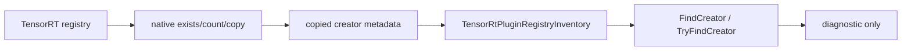

# Plugin Inventory 博客版：只复制元数据，不暴露 borrowed pointer

> 文章类型：接口专题长文
> 适合发布：微信公众号、技术博客、部署排障文章
> 配图建议：TensorRT plugin registry 到 native count/copy bridge，再到 `TensorRtPluginRegistryInventory` 的三段式图。
> 发布摘要：介绍 TensorRtSharp4.0 的 Plugin Inventory 只读 API 如何帮助 .NET 用户在部署前检查 creator count、name、version、namespace 和 field metadata，同时避免 public API 暴露 native `IPluginCreator*` 生命周期风险。

## Plugin 问题为什么要提前发现

ONNX 或 TensorRT engine 里一旦依赖 plugin，部署失败往往不发生在 C# 调用点，而是更早隐藏在 registry 可见性里：

- 自定义 plugin library 没有加载。
- creator name 或 version 与导出模型不一致。
- namespace 不匹配。
- TRT8、TRT10、TRT11 的 registry 能力不完全一致。

直接把 native creator pointer 交给 C# 用户看似方便，但会带来 borrowed pointer、生命周期和 ABI 异常传播问题。Plugin Inventory 的设计取舍是：只复制可安全表达的元数据，不开放 ownership 不清楚的 native pointer。

## 只读链路



对应文件：

```text
src/JYPPX.TensorRtSharp/TensorRtPluginRegistryInventory.cs
smoke/PluginRegistryInventorySmokeRunner/Program.cs
docs/articles/zh-cn/plugin-inventory-readonly-api.md
```

## 能查询什么

当前只读 API 覆盖：

- registry exists。
- creator count。
- creator name/version/namespace。
- creator field count 与 field descriptor。
- managed snapshot lookup：`FindCreator`、`TryFindCreator`。
- global registry、builder capability registry、runtime local registry 的只读路径。
- runtime-local creator lookup copied metadata：按 name/version/namespace 复制 interface、API language 和 field metadata。

这些返回的是 copied metadata。public API 不返回裸 `IntPtr` plugin creator。

## Smoke 命令

先做 dependency probe：

```powershell
dotnet run --project .\smoke\PluginRegistryInventorySmokeRunner\PluginRegistryInventorySmokeRunner.csproj -- --dependency-probe-only --tensor-rt-line 11
```

有可用 TensorRT runtime 时再跑完整 smoke：

```powershell
dotnet run --project .\smoke\PluginRegistryInventorySmokeRunner\PluginRegistryInventorySmokeRunner.csproj -- --tensor-rt-line 11
```

关键输出：

```text
GlobalPluginRegistry Exists=True
BuilderCapabilityPluginRegistry Exists=True
RuntimePluginRegistry Exists=True
PluginCreatorLookup Found=True Name=... Version=... Namespace=...
PluginRegistryInventorySmokeRunner Passed=True
```

## 跨版本边界

TRT8 主要保留 builder-owned registry 只读路径。TRT10/TRT11 可覆盖 global registry、builder capability registry 和 runtime local registry。每条路径都必须保留 version guard，不能为了统一 public API 而调用某个 TensorRT line 不支持的 native entrypoint。

## 明确不做什么

本阶段不处理：

- registry register/deregister/load library。
- plugin resource acquire/release。
- plugin instance create/clone/enqueue。
- Plugin V2/V3 callback trampoline。
- 任何 ownership 不清楚的 borrowed pointer 暴露。

## CTA

部署包含 plugin 的模型前，先运行 Plugin Inventory smoke，确认 creator name/version/namespace 是否可见。若 inventory 查不到 creator，再去排查 plugin library 加载和 namespace 配置，会比等 engine build 失败更快定位问题。
